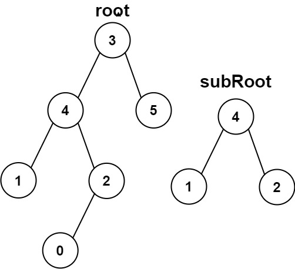
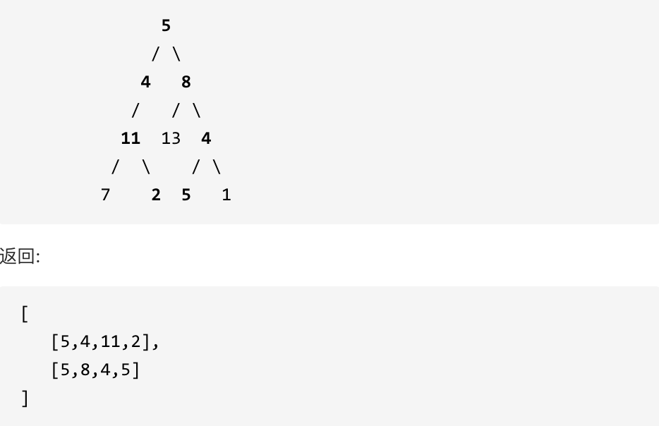
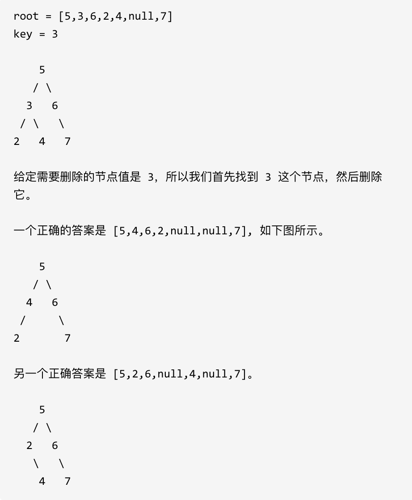
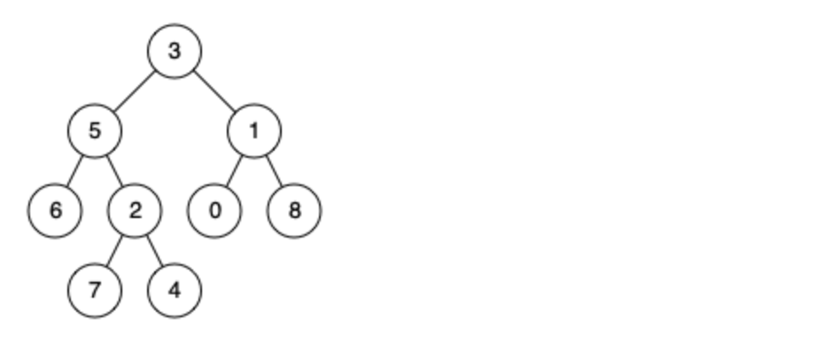

## 二叉树的统一解题模板

本质上二叉树的题目是递归的一种，与树相关的递归思路可以从以下方式思考

- **确定递归函数的参数和返回值：** 确定哪些参数是递归的过程中需要处理的，那么就在递归函数里加上这个参数， 并且还要明确每次递归的返回值是什么进而确定递归函数的返回类型。
  - 如果需要搜索整棵二叉树且不用处理递归返回值，递归函数就不要返回值。
  - 如果需要搜索整棵二叉树且需要处理递归返回值，递归函数就需要返回值。 
  
    - 搜索一条边的写法
  
      ```
      if (递归函数(root->left)) return ;
      if (递归函数(root->right)) return ;
      ```
    - 搜索整个树写法
  
      ```
      left = 递归函数(root->left);  // 左
      right = 递归函数(root->right); // 右
      left与right的逻辑处理;         // 中 
      ```
  
  - 如果要搜索其中一条符合条件的路径，那么递归一定需要返回值boolean，因为遇到符合条件的路径了就要及时返回。
  
  - 对于需要回溯的问题，基本数据类型不需要回溯，而引用数据类型需要回溯
  
- **确定终止条件：** 写完了递归算法, 运行的时候，经常会遇到栈溢出的错误，就是没写终止条件或者终止条件写的不对，操作系统也是用一个栈的结构来保存每一层递归的信息，如果递归没有终止，操作系统的内存栈必然就会溢出。
- **确定单层递归的逻辑：** 确定每一层递归需要处理的信息。在这里也就会重复调用自己来实现递归的过程。

## 二叉树的遍历方式

二叉树的大部分题目都是基于遍历来解决。二叉树的遍历方式有以下四种

- 前序遍历：根左右
- 后序遍历：左右根
- 中序遍历：左根右
- 层序遍历：将树按照层次进行遍历

### 递归遍历思路

以前序遍历为例

- 前序遍历
  - **确定递归函数的参数和返回值**：不需要再处理什么数据了也不需要有返回值，所以递归函数返回类型就是void
  - **确定终止条件**：当前遍历的节点是空了，那么本层递归就要结束了，所以如果当前遍历的这个节点是空，就直接return
  - **确定单层递归的逻辑**：前序遍历是中左右的顺序，所以在单层递归的逻辑，是要先取中节点的数值

#### leetcode 144 二叉树的前序遍历

**题目描述**

[题目链接](https://leetcode.cn/problems/binary-tree-preorder-traversal/description/)

给你二叉树的根节点 `root` ，返回它节点值的 **前序** 遍历。

**示例 1：**

**输入：** root = [1,null,2,3]

**输出：**[1,2,3]

**解释：**


**示例 2：**

**输入：** root = [1,2,3,4,5,null,8,null,null,6,7,9]

**输出：**[1,2,4,5,6,7,3,8,9]

**解释：**


**示例 3：**

**输入：** root = []

**输出：**[]

**示例 4：**

**输入：** root = [1]

**输出：**[1]

**参考代码**

```java
class Solution {
    public List<Integer> preorderTraversal(TreeNode root) {
        List<Integer>res=new ArrayList<>();
        preorder(root,res);
        return res;
    }
    public void preorder(TreeNode root,List<Integer>res)
    {
        // 终止条件
        if(root==null)
            return;
        // 遍历过程
        res.add(root.val);
        preorder(root.left,res);
        preorder(root.right,res);
    }
}
```

#### leetcode 145 二叉树的后序遍历

**题目描述**

[题目链接](https://leetcode.cn/problems/binary-tree-postorder-traversal/)

给你一棵二叉树的根节点 `root` ，返回其节点值的 **后序遍历** 。

 

**示例 1：**

**输入：** root = [1,null,2,3]

**输出：** [3,2,1]

**解释：**


**示例 2：**

**输入：** root = [1,2,3,4,5,null,8,null,null,6,7,9]

**输出：** [4,6,7,5,2,9,8,3,1]

**解释：**


**示例 3：**

**输入：** root = []

**输出：** []

**示例 4：**

**输入：** root = [1]

**输出：** [1]

 

**提示：**

- 树中节点的数目在范围 `[0, 100]` 内
- `-100 <= Node.val <= 100`

**参考代码**

```java
class Solution {
    public List<Integer> postorderTraversal(TreeNode root) {
        List<Integer>res=new ArrayList<>();
        transfer(root,res);
        return res;
    }
    public void transfer(TreeNode root,List<Integer>res)
    {
        // 终止条件
        if(root==null)
            return;
        transfer(root.left,res);
        transfer(root.right,res);
        res.add(root.val);
    }

}
```

#### leetcode 94 二叉树的中序遍历

**题目描述**

[题目链接](https://leetcode.cn/problems/binary-tree-inorder-traversal/description/)

给定一个二叉树的根节点 `root` ，返回 *它的 **中序** 遍历* 。

**示例 1：**


```
输入：root = [1,null,2,3]
输出：[1,3,2]
```

**示例 2：**

```
输入：root = []
输出：[]
```

**示例 3：**

```
输入：root = [1]
输出：[1]
```

 

**提示：**

- 树中节点数目在范围 `[0, 100]` 内
- `-100 <= Node.val <= 100`


**参考代码**

```java
class Solution {
    public List<Integer> inorderTraversal(TreeNode root) {
        List<Integer>res=new ArrayList<>();
        transfer(root,res);
        return res;
    }

    public void transfer(TreeNode root,List<Integer>res)
    {
        if(root==null)
            return;
        transfer(root.left,res);
        res.add(root.val);
        transfer(root.right,res);
    }

}
```

### 迭代遍历思路

使用一个栈作为存储结构，但是栈存在 **无法同时解决访问节点（遍历节点）和处理节点（将元素放进结果集）不一致的情况** 。**那我们就将访问的节点放入栈中，把要处理的节点也放入栈中但是要做标记。** 通常可以将要处理的节点后面放入一个空指针

#### 前序遍历

栈中的行为

- 放入根节点，然后直接出栈，但是保留根节点的引用
- 右节点入栈，栈中元素[右节点]
- 左节点入栈，栈中元素[右节点，左节点]
- 根节点入栈，栈中元素[右节点，左节点，根节点]
- 出栈顺序：根节点，左节点，右节点

```java
class Solution {
    public List<Integer> preorderTraversal(TreeNode root) {
        List<Integer> result = new LinkedList<>();
        Stack<TreeNode> st = new Stack<>();
        if (root != null) st.push(root);
        while (!st.empty()) {
            TreeNode node = st.peek();
            if (node != null) {
                st.pop(); // 将该节点弹出，避免重复操作，下面再将右中左节点添加到栈中
                if (node.right!=null) st.push(node.right);  // 添加右节点（空节点不入栈）
                if (node.left!=null) st.push(node.left);    // 添加左节点（空节点不入栈）
                st.push(node);                          // 添加中节点
                st.push(null); // 中节点访问过，但是还没有处理，加入空节点做为标记。
                
            } else { // 只有遇到空节点的时候，才将下一个节点放进结果集
                st.pop();           // 将空节点弹出
                node = st.peek();    // 重新取出栈中元素
                st.pop();
                result.add(node.val); // 加入到结果集
            }
        }
        return result;
    }
}
```

#### 中序遍历

栈中行为

- 放入根节点，然后直接出栈，但是保留根节点的引用
- 右节点入栈，栈中元素[右节点]
- 根节点入栈，栈中元素[右节点，根节点]
- 左节点入栈，栈中元素[右节点，根节点，左节点]
- 出栈顺序：左节点，根节点，右节点

```java
class Solution {
public List<Integer> inorderTraversal(TreeNode root) {
        List<Integer> result = new LinkedList<>();
    Stack<TreeNode> st = new Stack<>();
    if (root != null) st.push(root);
    while (!st.empty()) {
        TreeNode node = st.peek();
        if (node != null) {
            st.pop(); // 将该节点弹出，避免重复操作，下面再将右中左节点添加到栈中
            if (node.right!=null) st.push(node.right);  // 添加右节点（空节点不入栈）
            st.push(node);                          // 添加中节点
            st.push(null); // 中节点访问过，但是还没有处理，加入空节点做为标记。

            if (node.left!=null) st.push(node.left);    // 添加左节点（空节点不入栈）
        } else { // 只有遇到空节点的时候，才将下一个节点放进结果集
            st.pop();           // 将空节点弹出
            node = st.peek();    // 重新取出栈中元素
            st.pop();
            result.add(node.val); // 加入到结果集
        }
    }
    return result;
}
}
```

#### 后序遍历

栈中行为

- 放入根节点，然后直接出栈，但是保留根节点的引用
- 根节点入栈，栈中元素[根节点]
- 右节点入栈，栈中元素[根节点，右节点]
- 左节点入栈，栈中元素[根节点，右节点，左节点]
- 出栈顺序：左节点，右节点，根节点

```java
class Solution {
   public List<Integer> postorderTraversal(TreeNode root) {
        List<Integer> result = new LinkedList<>();
        Stack<TreeNode> st = new Stack<>();
        if (root != null) st.push(root);
        while (!st.empty()) {
            TreeNode node = st.peek();
            if (node != null) {
                st.pop(); // 将该节点弹出，避免重复操作，下面再将中右左节点添加到栈中
                st.push(node);                          // 添加中节点
                st.push(null); // 中节点访问过，但是还没有处理，加入空节点做为标记。
                if (node.right!=null) st.push(node.right);  // 添加右节点（空节点不入栈）
                if (node.left!=null) st.push(node.left);    // 添加左节点（空节点不入栈）         
                               
            } else { // 只有遇到空节点的时候，才将下一个节点放进结果集
                st.pop();           // 将空节点弹出
                node = st.peek();    // 重新取出栈中元素
                st.pop();
                result.add(node.val); // 加入到结果集
            }
        }
        return result;
   }
}
```

### 层次遍历思路

使用一个队列来模拟遍历，每次出队时将节点的左右子节点放入队列中

#### 代码模板

```java
		Queue<TreeNode>queue=new LinkedList<>();
        queue.add(root);
        while (!queue.isEmpty())
        {
            int size=queue.size();
            // 以层为单位的操作，size是每一层的元素个数
            for(int i=0;i<size;i++)
            {
                TreeNode temp=queue.poll();
                // 题目中对单个元素特定操作
                if(temp.left!=null)
                    queue.offer(temp.left);
                if(temp.right!=null)
                    queue.offer(temp.right);
            }
            // 每层结束后的操作
        }
```

#### leetcode 102 二叉树的层次遍历

**题目描述**

[力扣题目链接(opens new window)](https://leetcode.cn/problems/binary-tree-level-order-traversal/)

给你一个二叉树，请你返回其按 层序遍历 得到的节点值。 （即逐层地，从左到右访问所有节点）。


**参考代码**

```java
class Solution {
    public List<List<Integer>> levelOrder(TreeNode root) {
        List<List<Integer>>res=new ArrayList<>();
        if(root==null)return res;
        // 引入辅助队列
        Queue<TreeNode>que=new LinkedList<>();
        // 添加根节点
        que.offer(root);
        while(!que.isEmpty())
        {
            // 为每一层建立一个list存储每一层的结果
            List<Integer>ans=new ArrayList<>();
            // 每一层的操作，其中size是每一层的元素个数
            int size=que.size();
            for(int i=0;i<size;i++)
            {
                TreeNode temp=que.poll();
                // 对单个元素的操作
                ans.add(temp.val);
                if(temp.left!=null)que.offer(temp.left);
                if(temp.right!=null)que.offer(temp.right);
            }
            // 每一层遍历完之后的操作
            res.add(ans);
        }
        return res;
    }

}
```

#### leetcode 637 二叉树的层平均值

**题目描述**

[力扣题目链接(opens new window)](https://leetcode.cn/problems/average-of-levels-in-binary-tree/)

给定一个非空二叉树, 返回一个由每层节点平均值组成的数组。


**参考代码**

```java
class Solution {
    public List<Double> averageOfLevels(TreeNode root) {
        ArrayList<Double>res=new ArrayList<>();
        if(root==null)return res;
        // 建立辅助队列
        Queue<TreeNode>que=new LinkedList<>();
        // 根节点入队
        que.offer(root);
        while(!que.isEmpty())
        {
            // 定义每层的变量
            int size=que.size();
            double count=0;
            // 层内遍历
            for(int i=0;i<size;i++)
            {
                TreeNode temp=que.poll();
                // 对层内元素求和
                count+=temp.val;
                if(temp.left!=null)
                    que.offer(temp.left);
                if(temp.right!=null)
                    que.offer(temp.right);
            }
            // 每一层遍历结束后加入结果集
            res.add(count/size);
        }
        return res;
    }
}
```

#### leetcode 515 在每个树行中找最大值

**题目描述**

[力扣题目链接(opens new window)](https://leetcode.cn/problems/find-largest-value-in-each-tree-row/)

您需要在二叉树的每一行中找到最大的值。


**参考代码**

```java
class Solution {
    public List<Integer> largestValues(TreeNode root) {
        List<Integer>res=new ArrayList<>();
        if(root==null)return res;
        // 设置辅助队列
        Queue<TreeNode>que=new LinkedList<>();
        // 根节点入队
        que.offer(root);
        while(!que.isEmpty())
        {
            // 设置每一层的最大值
            int max=Integer.MIN_VALUE;
            int size=que.size();
            for(int i=0;i<size;i++)
            {
                TreeNode temp=que.poll();
                if(temp.val>max)
                    max=temp.val;
                if(temp.left!=null)
                    que.offer(temp.left);
                if(temp.right!=null)
                    que.offer(temp.right);
            }
            // 遍历完一层后将最大值放入队列中
            res.add(max);
        }
        return res;
    }
}
```

## 二叉树的深度问题

二叉树的最大深度是根节点到最远叶子节点的最长路径上的节点数。只有一个节点的二叉树深度为1

### 最大深度问题

#### leetcode 104 二叉树的最大深度

**题目描述**

[力扣题目链接(opens new window)](https://leetcode.cn/problems/maximum-depth-of-binary-tree/)

给定一个二叉树，找出其最大深度。

二叉树的深度为根节点到最远叶子节点的最长路径上的节点数。

说明: 叶子节点是指没有子节点的节点。

示例：

给定二叉树 [3,9,20,null,null,15,7]，


返回它的最大深度 3 。

**思路解析**

本题可以从迭代和递归两个角度思考

**迭代法**

因为最大的深度就是二叉树的层数，和层序遍历的方式相似。在二叉树中，一层一层的来遍历二叉树，记录一下遍历的层数就是二叉树的深度

**迭代法参考代码**

```java
class Solution {
    public int maxDepth(TreeNode root) {
        int depth=0;
        if(root==null)return 0;
        Queue<TreeNode>que=new LinkedList<>();
        que.offer(root);
        while(!que.isEmpty())
        {
            // 进行每一层遍历前的操作
            int size=que.size();
            depth++;
            for(int i=0;i<size;i++)
            {
                TreeNode temp=que.poll();
                if(temp.left!=null)que.offer(temp.left);
                if(temp.right!=null)que.offer(temp.right);
            }
        }
        return depth;
    }

}
```

**递归法**

根据递归的模板逐步确定思路

- **确定递归函数的参数和返回值：** 由题可知递归函数的参数为树的根节点，返回值为根的深度
- **确定终止条件：** 如果为空节点的话，就返回0，表示高度为0。
- **确定单层递归的逻辑：** 
  - 求最大深度可以转换为求根高度，求高度通常采用后序遍历
    - 左节点的处理：先计算左子树的高度
    - 右节点的处理：再计算右子树的高度
    - 中节点的处理：选取左右子树高度的最大值加1（中间节点）
  - 本质上求深度应当使用前序遍历
    - 中节点的处理：让当前层级递增，处理当前层级和最大深度的关系
    - 左节点的处理：计算左子树的层数
    - 右节点的处理：计算右子树的层数
    - 最后回溯层数

**参考代码**

```java
// 后序遍历法
class Solution {
    public int maxDepth(TreeNode root) {
        int depth=0;
        // 设置终止条件
        if(root==null)
            return 0;
        // 单次遍历逻辑：后序遍历
        int leftDepth=maxDepth(root.left); // 处理左子树
        int rightDepth=maxDepth(root.right); // 处理右子树
        return Math.max(leftDepth,rightDepth)+1; // 处理中间节点
    }

}

// 前序遍历法
class Solution {
    int maxDepth=0;
    public int maxDepth(TreeNode root) {
        dfs(root,0);
        return maxDepth;
    }
    // depth为当前节点的层级
    public void dfs(TreeNode root,int depth)
    {
        // 终止条件
        if(root==null)
            return;
        // 中间节点处理
        depth++; //层级递增
        maxDepth=maxDepth>depth?maxDepth:depth; // 计算最大深度
        // 处理左节点
        dfs(root.left,depth);
        // 处理右节点
        dfs(root.right,depth);
    }

}
```

### 最小深度问题

二叉树的最小深度是从根节点到最近叶子节点的最短路径上的节点数量。。只有一个节点的二叉树深度为1。

#### leetcode 111 二叉树的最小深度

**题目描述**

[力扣题目链接(opens new window)](https://leetcode.cn/problems/minimum-depth-of-binary-tree/)

给定一个二叉树，找出其最小深度。

最小深度是从根节点到最近叶子节点的最短路径上的节点数量。

说明: 叶子节点是指没有子节点的节点。

示例:

给定二叉树 [3,9,20,null,null,15,7],


返回它的最小深度 2.

**思路解析**

本题可以从迭代和递归两个角度思考

**迭代法**

因为深度可以用二叉树的层数，和层序遍历的方式相似。在二叉树中，一层一层的来遍历二叉树，遍历到没有左右子节点的节点就停止记录

**参考代码**

```java
class Solution {
    public int minDepth(TreeNode root) {
        int depth=0;
        if(root==null)return depth;
        Queue<TreeNode>que=new LinkedList<>();
        que.offer(root);
        while(!que.isEmpty())
        {
            int size=que.size();
            depth++;
            for(int i=0;i<size;i++)
            {
                TreeNode temp=que.poll();
                if(temp.left==null&&temp.right==null)
                    return depth;
                if(temp.left!=null)que.offer(temp.left);
                if(temp.right!=null)que.offer(temp.right);
            }
        }
        return depth;
    }
}
```

**递归法**

- **确定递归函数的参数和返回值：** 由题可知递归函数的参数为树的根节点，返回值为根的深度
- **确定终止条件：** 如果为空节点的话，就返回0，表示高度为0。
- **确定单层递归的逻辑：** 
  - 求最大深度可以转换为求根高度，求高度通常采用后序遍历
    - 左节点的处理：先计算左子树的高度
    - 右节点的处理：再计算右子树的高度
    - 中节点的处理：
      - 当左节点为空选取右子树的高度
      - 当右节点为空选取左子树的高度
      - 选取左右子树高度的较小值+1
  - 本质上求深度应当使用前序遍历
    - 中节点的处理：让当前层级递增，判断是否为叶子节点，若为叶子节点处理当前层级和最大深度的关系
    - 左节点的处理：计算左子树的层数
    - 右节点的处理：计算右子树的层数
    - 最后回溯层数

**参考代码**

```java
// 前序遍历
class Solution {
    int minDepth=Integer.MAX_VALUE;
    public int minDepth(TreeNode root) {
        if(root==null)
            return 0;
        dfs(root,0);
        return minDepth;
    }

    public void dfs(TreeNode root,int depth)
    {
        // 设置终止条件
        if(root==null)
            return;
        // 中节点处理
        depth++;
        if(root.left==null&&root.right==null) // 判断是否为叶子节点
            minDepth=Math.min(minDepth,depth);
        // 左节点处理
        dfs(root.left,depth);
        // 右节点处理
        dfs(root.right,depth);
    }

}

// 后序遍历
class Solution {
    public int minDepth(TreeNode root) {
        if(root==null)
            return 0;
        // 处理左节点
        int leftLength=minDepth(root.left);
        // 处理右节点
        int rightLength=minDepth(root.right);
        // 处理中节点
        if(root.left==null)
            return rightLength+1;
        if(root.right==null)
            return leftLength+1;
        return Math.min(leftLength,rightLength)+1;
    }

}
```

## 二叉树的翻转和对称操作

### leetcode 226 翻转二叉树

#### 题目描述

[力扣题目链接(opens new window)](https://leetcode.cn/problems/invert-binary-tree/)

翻转一棵二叉树。


#### 递归法解析

本题可以从递归的思路去思考

从递归的角度思考，本题适合使用后序遍历。后序遍历的遍历顺序是左右中。本题只需要将每个节点的左右子节点反转即可。左右中的遍历顺序可以保证所有节点不会被反转两次

#### 参考代码（递归法）

```java
class Solution {
    public TreeNode invertTree(TreeNode root) {
        // 确定终止条件
        if(root==null)
            return root;
        // 遍历过程（后序遍历）
        invertTree(root.left); // 处理左节点
        invertTree(root.right);// 处理右节点
        swapChildren(root);// 交换根节点的两个子节点
        return root;

    }
    private void swapChildren(TreeNode root) {
        TreeNode tmp = root.left;
        root.left = root.right;
        root.right = tmp;
    }


}
```

#### 迭代法解析

本题可以从迭代的角度思考，本题只需要将每个节点的左右子节点反转即可，可以考虑使用层次遍历

#### 参考代码（迭代法）

```java
class Solution {
    public TreeNode invertTree(TreeNode root) {
        if(root==null)return root;
        Queue<TreeNode>que=new LinkedList<>();
        que.offer(root);
        while(!que.isEmpty())
        {
            int size=que.size();
            for(int i=0;i<size;i++)
            {
                TreeNode temp=que.poll();
                swapChildren(temp);
                if(temp.left!=null)
                    que.offer(temp.left);
                if(temp.right!=null)
                    que.offer(temp.right);
            }
        }
        return root;

    }
    private void swapChildren(TreeNode root) {
        TreeNode tmp = root.left;
        root.left = root.right;
        root.right = tmp;
    }


}
```

### leetcode 101 对称二叉树

#### 题目描述

[力扣题目链接(opens new window)](https://leetcode.cn/problems/symmetric-tree/)

给定一个二叉树，检查它是否是镜像对称的。


#### 思路解析

本题从递归的角度思考，对于二叉树是否对称，要比较的是根节点的左子树与右子树是不是相互翻转的，其实要比较的是两个树（这两个树是根节点的左右子树）。**因为要遍历两棵树而且要比较内侧和外侧节点，所以准确的来说是一个树的遍历顺序是左右中，一个树的遍历顺序是右左中。**

- **确定递归函数的参数和返回值：** 由题可知递归函数的参数为两棵树的根节点，返回值为boolean变量表示以该节点为根节点的子树是否对称
- **确定终止条件：** 
  - 若两棵树均为空节点的话，就返回true。
  - 若两棵树的左右节点分别有一个为null，就返回false
  - 若两棵树的左右节点均不为空，但是两个节点的值不同，就返回false
- **确定单层递归的逻辑：** 
  - 比较外侧节点：比较左侧节点的左节点和右侧节点的右节点
  - 比较内侧节点：比较左侧节点的右节点和左侧节点的左节点
  - 返回外侧节点和内测节点的与运算

#### 参考代码

```java
class Solution {
    public boolean isSymmetric(TreeNode root) {
        return compare(root,root);
    }


    public boolean compare(TreeNode left,TreeNode right)
    {
        // 设置终止条件
        if(left==null&&right==null)
            return true;
        else if(left!=null&&right==null)
            return false;
        else if(left==null&&right!=null)
            return false;
        else if(left!=null&&right!=null&&left.val!=right.val)
            return false;
        boolean outSide=compare(left.left,right.right);
        boolean inSide=compare(left.right,right.left);
        return inSide&&outSide;
    }
}
```

## 二叉树的比较问题

### leetcode 100 相同的树

#### 题目描述

[力扣题目链接(opens new window)](https://leetcode.cn/problems/same-tree/)

给定两个二叉树，编写一个函数来检验它们是否相同。

如果两个树在结构上相同，并且节点具有相同的值，则认为它们是相同的。


#### 思路解析

本题使用后序遍历的方式进行递归，因为本题适合从左右节点开始比较，并将比较结果汇总中间节点

- **确定递归函数的参数和返回值：** 由题可知递归函数的参数为两棵树的根节点，返回值为boolean变量表示以该节点为根节点的子树是否对称
- **确定终止条件：** 
  - 若两棵树均为空节点的话，就返回true。
  - 若两棵树的左右节点分别有一个为null，就返回false
  - 若两棵树的左右节点均不为空，但是两个节点的值不同，就返回false
- **确定单层递归的逻辑：** 
  - 比较左侧节点：比较两棵树左侧节点
  - 比较右侧节点：比较两棵树右侧节点
  - 返回左侧节点和右测节点的与运算

#### 参考代码

```java
class Solution {
    public boolean isSameTree(TreeNode p, TreeNode q) {
        //终止条件
        if(p==null&&q==null)return true;
        else if(p==null&&q!=null)return false;
        else if(p!=null&&q==null)return false;
        else if(p.val!=q.val)return false;
        // 单次遍历逻辑（后序遍历）
        boolean left=isSameTree(p.left,q.left); // 处理左节点
        boolean right=isSameTree(p.right,q.right);// 处理右节点
        return left&&right; //处理中间节点
    }
}
```

### leetcode 572 另一棵树的子树

#### 题目描述

给你两棵二叉树 `root` 和 `subRoot` 。检验 `root` 中是否包含和 `subRoot` 具有相同结构和节点值的子树。如果存在，返回 `true` ；否则，返回 `false` 。

二叉树 `tree` 的一棵子树包括 `tree` 的某个节点和这个节点的所有后代节点。`tree` 也可以看做它自身的一棵子树。


**示例 1：**


```
输入：root = [3,4,5,1,2], subRoot = [4,1,2]
输出：true
```

**示例 2：**



```
输入：root = [3,4,5,1,2,null,null,null,null,0], subRoot = [4,1,2]
输出：false
```


**提示：**

- `root` 树上的节点数量范围是 `[1, 2000]`
- `subRoot` 树上的节点数量范围是 `[1, 1000]`
- `-104 <= root.val <= 104`
- `-104 <= subRoot.val <= 104`

#### 思路解析

本题适合使用后序遍历，遍历 *s* 中的每一个节点，判断这个点的子树是否和 *t* 相等。这个过程单独作为一个递归函数

判断一个节点的子树是否和 *t* 相等的过程则作为另一个递归函数

#### 参考代码

```java
class Solution {
    public boolean isSubtree(TreeNode root, TreeNode subRoot) {
        // 设置终止条件
        if(root==null)
            return false;
        if(subRoot==null)
            return true;
        // 单层遍历
        boolean left=isSubtree(root.left,subRoot); // 左节点
        boolean right=isSubtree(root.right,subRoot); // 右节点
        return left||right||check(root,subRoot); // 中节点


    }

    // 检测两个树是否相同
    public boolean check(TreeNode root,TreeNode subRoot)
    {
        // 设置终止条件
        if(root==null&&subRoot==null)
            return true;
        else if(root==null&&subRoot!=null)
            return false;
        else if(root!=null&&subRoot==null)
            return false;
        else if(root.val!=subRoot.val)
            return false;
        // 后序遍历
        boolean left=check(root.left,subRoot.left);
        boolean right=check(root.right,subRoot.right);
        return left&&right;
    }

}
```

## 二叉树的节点计数问题

### leetcode 222 完全二叉树的节点个数

#### 题目描述

[力扣题目链接(opens new window)](https://leetcode.cn/problems/count-complete-tree-nodes/)

给出一个完全二叉树，求出该树的节点个数。

示例 1：

- 输入：root = [1,2,3,4,5,6]
- 输出：6

示例 2：

- 输入：root = []
- 输出：0

示例 3：

- 输入：root = [1]
- 输出：1

提示：

- 树中节点的数目范围是[0, 5 * 10^4]
- 0 <= Node.val <= 5 * 10^4
- 题目数据保证输入的树是 完全二叉树

#### 思路解析

本题适合使用后序遍历，因为可以先分别统计左子树和右子树的节点个数，再将两个子树的节点个数相加再加一（中间节点）

- **确定递归函数的参数和返回值：** 由题可知递归函数的参数为树的根节点，返回值为int变量表示以该节点为根节点的子树的节点个数
- **确定终止条件：** 
  - 若遍历到空节点的话，就返回0。
- **确定单层递归的逻辑：** 
  - 处理左节点：计算左子树的节点个数
  - 处理右节点：计算右子树节点个数
  - 处理中间节点：将左右两个子树的节点个数相加再加一

#### 参考代码

```java
class Solution {
    public int countNodes(TreeNode root) {
        // 设置终止条件
        if(root==null)
            return 0;
        // 单层遍历(后序遍历)
        int leftCount=countNodes(root.left); // 计算左子树的节点个数
        int rightCount=countNodes(root.right); // 计算右子树的节点个数
        return leftCount+rightCount+1; // 处理中间节点
    }
}
```


### leetcode  404 左叶子之和

#### 题目描述

[力扣题目链接(opens new window)](https://leetcode.cn/problems/sum-of-left-leaves/)

计算给定二叉树的所有左叶子之和。

示例：


#### 思路解析

本题使用后序遍历，通过递归函数的返回值来累加求取左叶子数值之和

- **确定递归函数的参数和返回值：** 由题可知递归函数的参数为树的根节点，记录单个节点的左叶子之和

- **确定终止条件：** 

  - 若遍历到空节点的话，返回0

- **确定单层递归的逻辑：** 

  - 处理左节点：
    - 递归计算左节点

  - 处理右节点
    - 递归计算右节点
  - 处理中间节点
    - 当中间节点的左节点没有子节点，加入该节点的值
    - 最后加入中间节点的值和左右节点的计算结果

#### 参考代码

```java
class Solution {
    public int sumOfLeftLeaves(TreeNode root) {
        if(root==null)return 0;
        return sum(root);
    }

    public int sum(TreeNode root)
    {
        // 终止条件
        if(root==null)
            return 0;
        // 单层遍历
        int left=sum(root.left);
        int right=sum(root.right);
        int mid=0;
        if(root.left!=null&&root.left.left==null&&root.left.right==null)
            mid=root.left.val;
        return left+right+mid;

    }
}
```


### leetcode 513 找树左下角的值

#### 题目描述

[力扣题目链接(opens new window)](https://leetcode.cn/problems/find-bottom-left-tree-value/)

给定一个二叉树，在树的最后一行找到最左边的值。

示例 1:


示例 2:


#### 迭代法解析

可以使用层次遍历的方法，将每一层的最左边的值保留，并随着层次进行更新

#### 参考代码（迭代法）

```java
class Solution {
    public int findBottomLeftValue(TreeNode root) {
        int ans=0;
        if(root==null)
            return ans;
        Queue<TreeNode>queue=new LinkedList<>();
        queue.offer(root);
        while(!queue.isEmpty())
        {
            int size=queue.size();
            for(int i=0;i<size;i++)
            {
                TreeNode temp=queue.poll();
                if(i==0)
                {
                    ans=temp.val;
                }
                if(temp.left!=null)
                {
                    queue.offer(temp.left);
                }
                if(temp.right!=null)
                {
                    queue.offer(temp.right);
                }
            }
        }
        return ans;

    }
}
```


#### 递归法解析

- **确定递归函数的参数和返回值：** 递归函数的参数为树的根节点以及当前节点的深度，返回值为void

- **确定终止条件：** 

  - 若遍历到空节点的话，就返回

- **确定单层递归的逻辑：** 

  - 处理中节点：

    - 层级递增
    - 更新最大深度
    - 更新最左侧节点的值

  - 处理左节点

  - 处理右节点

  - 回溯

    

## 二叉树的高度问题

二叉树的高度通常使用后序遍历，因为高度是节点到根节点的距离，通常由由左右节点先中间节点开始计算

### leetcode 101 平衡二叉树

#### 题目描述

[力扣题目链接(opens new window)](https://leetcode.cn/problems/balanced-binary-tree/)

给定一个二叉树，判断它是否是高度平衡的二叉树。

本题中，一棵高度平衡二叉树定义为：一个二叉树每个节点 的左右两个子树的高度差的绝对值不超过1。

示例 1:

给定二叉树 [3,9,20,null,null,15,7]


返回 true 。

示例 2:

给定二叉树 [1,2,2,3,3,null,null,4,4]


返回 false 。

#### 思路解析

本题适合使用后序遍历，因为可以先分别统计左节点和右节点的高度，在中间节点将两个节点的高度进行比较，若平衡则返回节点的高度，不平衡返回-1

- **确定递归函数的参数和返回值：** 由题可知递归函数的参数为树的根节点，返回值为int变量表示以该节点的高度
- **确定终止条件：** 
  - 若遍历到空节点的话，就返回0。
- **确定单层递归的逻辑：** 
  - 处理左节点：
    - 计算左节点的高度
    - 若左节点不平衡直接返回-1
  - 处理右节点
    - 计算右节点的高度
    - 若右节点不平衡直接返回-1
  - 处理中间节点
    - 计算左右节点的高度差
      - 若不平衡返回-1
      - 若平衡返回左右节点高度的较大者+1；

#### 参考代码

```java
class Solution {
    public boolean isBalanced(TreeNode root) {
        return getHeight(root)!=-1;
    }

    public int getHeight(TreeNode root)
    {
        if(root==null)
            return 0;
        // 单层遍历
        int left=getHeight(root.left);
        if(left==-1)return -1;
        int right=getHeight(root.right);
        if(right==-1)return -1;
        return Math.abs(left-right)>1?-1:Math.max(left,right)+1;
    }
}
```


## 二叉树的路径问题

通常二叉树的路径计算使用前序遍历，因为通常路径的第一个节点为中间节点，遍历顺序为根左右，同时在左右节点的处理中注意回溯

### 统一解题模板

#### 自顶向下

```java
// 一般路径,要求到叶子节点return
void traversal(TreeNode root,List<String>res,List<Integer>path)
    {
        // 终止条件为到叶子节点
        if(root.left==null&&root.right==null)
        {
            path.add(root.val);
            res.add(new ArrayList<>(path));
        }
        // 单层遍历
        // 添加非叶子节点
        if(root.left!=null||root.right!=null)
            path.add(root.val);
        if(root.left!=null)
        {
            traversal(root.left,res,path);
            path.remove(path.size()-1); 
        }
        if(root.right!=null)
        {
            traversal(root.right,res,path);
            path.remove(path.size()-1);
        }
    }
// 给定和的路径
public void check(TreeNode root,int targetSum,List<Integer>path,List<List<Integer>>res)
    {
        // 终止条件
        if(root.left==null&&root.right==null)
        {
            path.add(root.val);
            targetSum-=root.val;
            if(targetSum==0)
            {
                res.add(new ArrayList<>(path));
            }
            return;
        }
        // 单层遍历
        if(root.left!=null||root.right!=null)
        {
            targetSum-=root.val;
            path.add(root.val);
        }
        if(root.left!=null)
        {
            check(root.left,targetSum,path,res); // 基本数据类型不需要回溯
            path.remove(path.size()-1);
        }
        if(root.right!=null)
        {
            check(root.right,targetSum,path,res);
            path.remove(path.size()-1);
        }
    }
```


### leetcode 257 二叉树的所有路径

#### 题目描述

[力扣题目链接(opens new window)](https://leetcode.cn/problems/binary-tree-paths/)

给定一个二叉树，返回所有从根节点到叶子节点的路径。

说明: 叶子节点是指没有子节点的节点。

示例: 


#### 思路解析

- **确定递归函数的参数和返回值：** 由题可知递归函数的参数为树的根节点，记录单条路径的集合，结果集，返回值为void

- **确定终止条件：** 

  - 若遍历到叶子节点的话
    - 先加入叶子节点
    - 将路径集合中的路径转换为字符串
    - 将字符串加入结果集

- **确定单层递归的逻辑：** 

  - 处理中间节点

    - 加入非叶子节点

  - 处理左节点：

    - 递归加入左节点
    - 执行完毕后回溯，从路径集合中删除最后一个元素

  - 处理右节点

    - 递归加入右节点
    - 执行完毕后回溯，从路径集合中删除最后一个元素

    

#### 参考代码

```java
class Solution {
    public List<String> binaryTreePaths(TreeNode root) {
        List<String>res=new ArrayList<>();
        if(root==null)
            return res;
        List<Integer>path=new ArrayList<>();
        traversal(root,res,path);
        return res;
    }

    void traversal(TreeNode root,List<String>res,List<Integer>path)
    {
        // 终止条件
        if(root.left==null&&root.right==null)
        {
            path.add(root.val);
            StringBuilder sb=new StringBuilder();
            for(int i=0;i<path.size()-1;i++)
            {
                sb.append(path.get(i)).append("->");
            }
            sb.append(path.get(path.size()-1));
            res.add(sb.toString());
        }
        // 单层遍历
        // 添加非叶子节点
        if(root.left!=null||root.right!=null)
            path.add(root.val);
        if(root.left!=null)
        {
            traversal(root.left,res,path);
            path.remove(path.size()-1);
        }
        if(root.right!=null)
        {
            traversal(root.right,res,path);
            path.remove(path.size()-1);
        }
    }
}
```

### leetcode 112 路径总和

#### 题目描述

[力扣题目链接(opens new window)](https://leetcode.cn/problems/path-sum/)

给定一个二叉树和一个目标和，判断该树中是否存在根节点到叶子节点的路径，这条路径上所有节点值相加等于目标和。

说明: 叶子节点是指没有子节点的节点。

示例: 给定如下二叉树，以及目标和 sum = 22，


返回 true, 因为存在目标和为 22 的根节点到叶子节点的路径 5->4->11->2。

#### 思路解析

本题应当使用前序遍历，因为路径从根节点开始。

- **确定递归函数的参数和返回值：** 由题可知递归函数的参数为树的根节点和目标和，记录单条路径的集合，结果集，返回值为boolean

- **确定终止条件：** 

  - 若遍历到叶子节点的话
    - 先加入叶子节点到路径和中
    - 判断路径和和目标和的大小

- **确定单层递归的逻辑：** 

  - 处理中间节点

    - 加入非叶子节点

  - 处理左节点：

    - 递归加入左节点，判断是否找到合适路径，直接返回
    - 执行完毕后回溯，从路径和中删除最后一个元素

  - 处理右节点

    - 递归加入右节点，判断是否找到合适路径，直接返回
    - 执行完毕后回溯，从路径和中删除最后一个元素

    

#### 参考代码

```java
class Solution {
    int sum=0;
    public boolean hasPathSum(TreeNode root, int targetSum) {
        if(root==null)return false;
        // 设置终止条件
        if(root.left==null&&root.right==null)
        {
            sum+=root.val;
            return sum==targetSum;
        }
        // 设置中间节点
        if(root.left!=null||root.right!=null)
        {
            sum+=root.val;
        }
        // 处理左节点
        if(root.left!=null)
        {
            boolean left=hasPathSum(root.left,targetSum);
            if(left)return true;
            sum-=root.left.val;
        }
        if(root.right!=null)
        {
            boolean right=hasPathSum(root.right,targetSum);
            if(right)
                return true;
            sum-=root.right.val;
        }
        return false;
    }
}
```

### leetcode 113 路径总和 II

#### 题目描述

[力扣题目链接(opens new window)](https://leetcode.cn/problems/path-sum-ii/)

给定一个二叉树和一个目标和，找到所有从根节点到叶子节点路径总和等于给定目标和的路径。

说明: 叶子节点是指没有子节点的节点。

示例: 给定如下二叉树，以及目标和 sum = 22，



#### 思路解析

本题应当使用前序遍历，因为路径从根节点开始。

- **确定递归函数的参数和返回值：** 由题可知递归函数的参数为树的根节点和目标和路径集合和答案集合，记录单条路径的集合，结果集，返回值为void

- **确定终止条件：** 

  - 若遍历到叶子节点的话
    - 先加入叶子节点到路径和，路径集合中
    - 判断路径和与目标和的大小，符合条件加入答案集合中，注意要复制路径集，不然路径集会因为回溯而清空

- **确定单层递归的逻辑：** 

  - 处理中间节点

    - 加入非叶子节点到路径集合
    - 加入非叶子节点的值

  - 处理左节点：

    - 递归加入左节点
    - 执行完毕后回溯
      - 从路径和中删除最后一个元素的值
      - 从路径集合中删除最后一个元素

  - 处理右节点

    - 递归加入右节点

    - 执行完毕后回溯

      - 从路径和中删除最后一个元素的值

      - 从路径集合中删除最后一个元素

        

#### 参考代码

```java
class Solution {
    public List<List<Integer>> pathSum(TreeNode root, int targetSum) {
        List<List<Integer>>res=new ArrayList<>();
        if (root == null) return res; // 非空判断
        List<Integer>path=new ArrayList<>();
        check(root,targetSum,path,res);
        return res;
    }

    public void check(TreeNode root,int targetSum,List<Integer>path,List<List<Integer>>res)
    {
        // 终止条件
        if(root.left==null&&root.right==null)
        {
            path.add(root.val);
            targetSum-=root.val;
            if(targetSum==0)
            {
                res.add(new ArrayList<>(path));
            }
            return;
        }
        // 单层遍历
        if(root.left!=null||root.right!=null)
        {
            targetSum-=root.val;
            path.add(root.val);
        }
        if(root.left!=null)
        {
            check(root.left,targetSum,path,res);
            path.remove(path.size()-1);
        }
        if(root.right!=null)
        {
            check(root.right,targetSum,path,res);
            path.remove(path.size()-1);
        }
    }
}
```

## 二叉树的构造

### leetcode 106 从中序和后序遍历构造二叉树

#### 题目描述

[力扣题目链接(opens new window)](https://leetcode.cn/problems/construct-binary-tree-from-inorder-and-postorder-traversal/)

根据一棵树的中序遍历与后序遍历构造二叉树。

注意: 你可以假设树中没有重复的元素。

例如，给出

- 中序遍历 inorder = [9,3,15,20,7]
- 后序遍历 postorder = [9,15,7,20,3] 返回如下的二叉树：


#### 思路解析

实现思路就是以后序数组的最后一个元素为切割点，先切中序数组，根据中序数组，反过来再切后序数组。一层一层切下去，每次后序数组最后一个元素就是节点元素。

根据树的构造顺序可知本题使用前序遍历。同时在构造时注意数组的边界问题，建议使用左闭右闭的区间。

- **确定递归函数的参数和返回值：** 
  - 递归函数的参数
    - 中序数组

    - 中序数组的起点

    - 中序数组的终点

    - 后序数组

    - 后序数组的起点

    - 后序数组的终点

  - 返回值为树节点

- **确定终止条件：** 

  - 若终点<起点代表数组中不存在元素，返回null
- **确定单层递归的逻辑：** 

  - 处理中间节点
    - 选取后序数组的终点作为中间节点的值，并将根据这个值在中序数组的位置（ **`rootIndex`** ）切分为左右子树两个部分

    - 左子树部分（长度为 **`rootIndex-inStart`** ）
      - 中序数组
        - 起点：中序数组的起点

        - 终点：中序数组的 **`rootIndex`** 的前一位（ **`rootIndex-1`** ）

      - 后序数组
        - 起点：后序数组的起点
        - 终点：后序数组的起点+左子树的长度-1

    - 右子树部分
      - 中序数组
        - 起点： **`rootIndex+1`**
        - 终点：中序数组的起点
      - 后序数组
        - 起点：后序数组的起点+左子树的长度
        - 终点：后序数组的终点-1

  - 处理左节点：

    - 递归处理左节点
  - 处理右节点

    - 递归处理右节点

#### 参考代码

```java
class Solution {
    HashMap<Integer,Integer>map=new HashMap<>();
    public TreeNode buildTree(int[] inorder, int[] postorder) {
        for(int i=0;i<inorder.length;i++)
        {
            map.put(inorder[i],i);
        }
        return findNode(inorder,0,inorder.length-1,postorder,0,postorder.length-1);
    }

    // 左闭右闭
    public TreeNode findNode(int[]inorder,int inStart,int inEnd,int[] postorder,int postStart,int postEnd)
    {
        // 终止条件
        if(inEnd<inStart||postEnd<postStart)
            return null;
        // 单层遍历：前序遍历
        // 处理中间节点
        int rootIndex=map.get(postorder[postEnd]);
        TreeNode root=new TreeNode(postorder[postEnd]);
        // 求解左子树的长度
        int length=rootIndex-inStart;
        // 确定左子树的起点和终点
        int leftInorderStart=inStart;
        int leftInorderEnd=rootIndex-1;
        int leftPostorderStart=postStart;
        int leftPostorderEnd=postStart+length-1;
        // 确定右子树的起点和终点
        int rightInorderStart=rootIndex+1;
        int rightInorderEnd=inEnd;
        int rightPostorderStart=postStart+length;
        int rightPostorderEnd=postEnd-1;
        root.left=findNode(inorder,leftInorderStart,leftInorderEnd,postorder,leftPostorderStart,leftPostorderEnd);
        root.right=findNode(inorder,rightInorderStart,rightInorderEnd,postorder,rightPostorderStart,rightPostorderEnd);
        return root;
    }


}
```

### leetcode  105 从中序和前序遍历构造二叉树

#### 题目描述

[力扣题目链接(opens new window)](https://leetcode.cn/problems/construct-binary-tree-from-preorder-and-inorder-traversal/)

根据一棵树的前序遍历与中序遍历构造二叉树。

注意: 你可以假设树中没有重复的元素。

例如，给出

前序遍历 preorder = [3,9,20,15,7] 中序遍历 inorder = [9,3,15,20,7] 返回如下的二叉树：


#### 思路解析

与上一题一样，但是顺序不同。以前序数组的第一个元素为切割点，先切中序数组，根据中序数组，反过来再切前序数组。一层一层切下去，每次前序数组第一个元素就是节点元素。

#### 参考代码

```java
class Solution {
    HashMap<Integer,Integer>map=new HashMap<>();
    public TreeNode buildTree(int[] preorder, int[] inorder) {
        for(int i=0;i<inorder.length;i++)
        {
            map.put(inorder[i],i);
        }
        return findNode(preorder,0,preorder.length-1,inorder,0,inorder.length-1);
    }
    public TreeNode findNode(int []preorder,int preBegin,int preEnd,int[]inorder,int inBegin,int inEnd)
    {
        // 递归终止条件
        if(preEnd<preBegin||inEnd<inBegin)
        {
            return null;
        }
        // 中间节点构造
        int rootIndex=map.get(preorder[preBegin]);
        TreeNode root=new TreeNode(preorder[preBegin]);
        // 计算左子树的节点个数
        int length=rootIndex-inBegin;
        // 确定左子树的起点和终点
        int leftInorderBegin=inBegin;
        int leftInorderEnd=rootIndex-1;
        int leftPreorederBegin=preBegin+1;
        int leftPreorderEnd=preBegin+length;
        // 确定右子树的起点和终点
        int rightInorderBegin=rootIndex+1;
        int rightInorderEnd=inEnd ;
        int rightPreorderBegin=preBegin+length+1;
        int rightPreorderEnd=preEnd;
        root.left=findNode(preorder,leftPreorederBegin,leftPreorderEnd,inorder,leftInorderBegin,leftInorderEnd);
        root.right=findNode(preorder,rightPreorderBegin,rightPreorderEnd,inorder,rightInorderBegin,rightInorderEnd);
        return root;
    }
}
```

### leetcode 654 最大二叉树

#### 题目描述

[力扣题目地址(opens new window)](https://leetcode.cn/problems/maximum-binary-tree/)

给定一个不含重复元素的整数数组。一个以此数组构建的最大二叉树定义如下：

- 二叉树的根是数组中的最大元素。
- 左子树是通过数组中最大值左边部分构造出的最大二叉树。
- 右子树是通过数组中最大值右边部分构造出的最大二叉树。

通过给定的数组构建最大二叉树，并且输出这个树的根节点。

示例 ：


提示：

给定的数组的大小在 [1, 1000] 之间。

#### 思路解析

本题依然是根据题意进行数组切割，但是要注意数组的边界问题。这是使用数组下标的左闭右闭区间

- **确定递归函数的参数和返回值：** 
  - 参数
    - 待切割的数组

    - 数组的左指针

    - 数组的右指针

- **确定终止条件：** 当左指针大于右指针说明数组没有元素了，递归终止
- **确定单层递归的逻辑：** 
  - 对中间节点的处理
    - 求解区间内的最大值及其下标，并建立中间节点
  - 对左节点的处理
    - 递归求解左半数组
  - 对右节点的处理
    - 递归求解右半数组

#### 参考代码

```java
class Solution {
    public TreeNode constructMaximumBinaryTree(int[] nums) {
        return traversal(nums,0,nums.length-1);
    }

    public TreeNode traversal(int[]num,int left,int right)
    {
        // 递归终止条件
        if(left>right)
            return null;
        // 求解最大值
        int maxIndex=0;
        int maxVal=Integer.MIN_VALUE;
        for(int i=left;i<=right;i++)
        {
            if(num[i]>maxVal)
            {
                maxIndex=i;
                maxVal=num[i];
            }
        }
        TreeNode root=new TreeNode(maxVal);
        root.left=traversal(num,left,maxIndex-1);
        root.right=traversal(num,maxIndex+1,right);
        return root;
    }
}
```

## 二叉搜索树

根据二叉搜索树的特性，通常使用中序遍历。因为二叉搜索树的中序遍历结果是一个单调递增数列。通常为了保存前一个节点的指会设置一个全局遍历 **`pre`** 来保存

### leetcode 98  验证二叉搜索树

#### 题目描述

[力扣题目链接(opens new window)](https://leetcode.cn/problems/validate-binary-search-tree/)

给定一个二叉树，判断其是否是一个有效的二叉搜索树。

假设一个二叉搜索树具有如下特征：

- 节点的左子树只包含小于当前节点的数。
- 节点的右子树只包含大于当前节点的数。
- 所有左子树和右子树自身必须也是二叉搜索树。


#### 思路解析

可以利用二叉搜索树的性质，对二叉搜索树进行中序遍历，然后检验遍历结果是否为单调递增的数组

但是可以在中序遍历的过程中判断，因为中序遍历的结果是递增，所以可以使用一个全局的pre值保存上一个节点的节点值，比较和上一个节点的大小关系

#### 参考代码

```java
class Solution {
    long maxVal = Long.MIN_VALUE;
    public boolean isValidBST(TreeNode root) {
        // 终止条件
        if(root==null)
            return true;
        boolean left=isValidBST(root.left);
        if(root.val>maxVal)
            maxVal=root.val;
        else return false;
        boolean right=isValidBST(root.right);
        return left&right;
    }

}
```

### leetcode 530 二叉搜索树的最小绝对差

#### 题目描述

[力扣题目链接(opens new window)](https://leetcode.cn/problems/minimum-absolute-difference-in-bst/)

给你一棵所有节点为非负值的二叉搜索树，请你计算树中任意两节点的差的绝对值的最小值。

示例：


提示：树中至少有 2 个节点。

#### 思路解析

根据二叉搜索树的性质，最小绝对值差是两个在中序遍历结果中相邻的节点。可以使用一个全局变量存储上一个节点，来进行比较

#### 参考代码

```java
class Solution {
    int res=Integer.MAX_VALUE;
    TreeNode pre;
    public int getMinimumDifference(TreeNode root) {
        if(root==null)
            return 0;
        traversal(root);
        return res;
    }
    public void traversal(TreeNode root)
    {
        // 终止条件
        if(root==null)
            return;
        // 单层遍历
        traversal(root.left);
        if(pre!=null)
        {
            // 更新结果
            res=Math.min(res,root.val-pre.val);
        }
        pre=root;
        traversal(root.right);
    }
}
```

### leetcode 501 二叉搜索树中的众数

#### 题目描述

[力扣题目链接(opens new window)](https://leetcode.cn/problems/find-mode-in-binary-search-tree/)

给定一个有相同值的二叉搜索树（BST），找出 BST 中的所有众数（出现频率最高的元素）。

假定 BST 有如下定义：

- 结点左子树中所含结点的值小于等于当前结点的值
- 结点右子树中所含结点的值大于等于当前结点的值
- 左子树和右子树都是二叉搜索树

例如：

给定 BST [1,null,2,2],


返回[2].

提示：如果众数超过1个，不需考虑输出顺序

进阶：你可以不使用额外的空间吗？（假设由递归产生的隐式调用栈的开销不被计算在内）

#### 思路解析

- **确定递归函数的参数和返回值：** 
  - 参数：树节点
  - 返回值：void

- **确定终止条件：** 遍历到空节点，递归终止
- **确定单层递归的逻辑：** 
  - 对中间节点的处理
    - 若与上一个节点的值一致则重新计数，否则计数加一
    - 若比众数大则清空原先的众数集合，并更新众数，同时更新众数的值
  - 对左节点的处理
    - 递归求解左节点
  - 对右节点的处理
    - 递归求解右节点

#### 参考代码

```java
class Solution {
    ArrayList<Integer>resList;
    int maxCount;
    int count;
    TreeNode pre;
    public int[] findMode(TreeNode root) {
        maxCount=0;
        count=0;
        resList=new ArrayList<>();
        pre=null;
        check(root);
        int[]res=new int[resList.size()];
        for(int i=0;i<resList.size();i++)
        {
            res[i]=resList.get(i);
        }
        return res;
    }

    public void check(TreeNode root)
    {
        // 终止条件
        if(root==null)
            return;
        // 中序遍历
        check(root.left);
        int rootVal=root.val;
        // 计数逻辑
        if(pre==null||rootVal!=pre.val)
        {
            count=1;
        }else{
            count++;
        }
        // 更新结果
        if(maxCount<count)
        {
            resList.clear();
            resList.add(rootVal);
            maxCount=count;
        }else if(maxCount==count)
        {
            resList.add(rootVal);
        }
        pre=root;
        check(root.right);
    }
}
```

### leetcode 701 二叉搜索树的插入

#### 题目描述

[力扣题目链接(opens new window)](https://leetcode.cn/problems/insert-into-a-binary-search-tree/)

给定二叉搜索树（BST）的根节点和要插入树中的值，将值插入二叉搜索树。 返回插入后二叉搜索树的根节点。 输入数据保证，新值和原始二叉搜索树中的任意节点值都不同。

注意，可能存在多种有效的插入方式，只要树在插入后仍保持为二叉搜索树即可。 你可以返回任意有效的结果。


提示：

- 给定的树上的节点数介于 0 和 10^4 之间
- 每个节点都有一个唯一整数值，取值范围从 0 到 10^8
- -10^8 <= val <= 10^8
- 新值和原始二叉搜索树中的任意节点值都不同

#### 思路解析

- 确定递归函数参数以及返回值
  - 参数就是根节点指针，以及要插入元素
  - 返回值为树的节点
- 终止条件
  - 遇到空节点时代表找到插入位置直接返回新节点
- 单次递归逻辑
  - 若当前节点的值小于目标值，向右递归，将当前节点的右节点设置为递归结果
  - 若当前节点的值大于目标值，向左递归，将当前节点的左节点设置为递归结果

#### 参考代码

```java
class Solution {
    public TreeNode insertIntoBST(TreeNode root, int val) {
        //终止条件
        if(root==null)
            return new TreeNode(val);
        // 单次递归
        if(root.val<val)
            root.right=insertIntoBST(root.right,val);
        if(root.val>val)
            root.left=insertIntoBST(root.left,val);
        return root;
    }
}
```


### leetcode 450 二叉搜索树中的删除工作

#### 题目描述

[力扣题目链接(opens new window)](https://leetcode.cn/problems/delete-node-in-a-bst/)

给定一个二叉搜索树的根节点 root 和一个值 key，删除二叉搜索树中的 key 对应的节点，并保证二叉搜索树的性质不变。返回二叉搜索树（有可能被更新）的根节点的引用。

一般来说，删除节点可分为两个步骤：

首先找到需要删除的节点； 如果找到了，删除它。 说明： 要求算法时间复杂度为 $O(h)$，h 为树的高度。

示例:



#### 思路解析

- 确定递归函数参数以及返回值
  - 参数为树的节点和目标值
  - 返回值为树的节点，代表删除节点的新子树
- 终止条件
  - 遇到空返回null
- 单次遍历
  - 要删除的节点左节点为空，返回右节点
  - 要删除的节点右节点为空，返回左节点
  - 要删除的节点左右不为空，将删除节点的左子树头结点（左孩子）放到删除节点的右子树的最左面节点的左孩子上，返回删除节点右孩子为新的根节点。

#### 参考代码

```java
class Solution {
    public TreeNode deleteNode(TreeNode root, int key) {
        if(root==null)
            return null;
        if(root.val==key)
        {
            if(root.left==null)
                return root.right;
            else if(root.right==null)
                return root.left;
            else {
                TreeNode curr=root.right;
                while(curr.left!=null)
                    curr=curr.left;
                curr.left=root.left;
                root=root.right;
                return root;
            }
        }
        if(root.val>key)
            root.left=deleteNode(root.left,key);
        else
            root.right=deleteNode(root.right,key);
        return root;
    }
}
```


## 最近公共祖先问题

### leetcode 236 二叉树的最近公共祖先

#### 题目描述

[力扣题目链接(opens new window)](https://leetcode.cn/problems/lowest-common-ancestor-of-a-binary-tree/)

给定一个二叉树, 找到该树中两个指定节点的最近公共祖先。

百度百科中最近公共祖先的定义为：“对于有根树 T 的两个结点 p、q，最近公共祖先表示为一个结点 x，满足 x 是 p、q 的祖先且 x 的深度尽可能大（一个节点也可以是它自己的祖先）。”

例如，给定如下二叉树: root = [3,5,1,6,2,0,8,null,null,7,4]



示例 1: 输入: root = [3,5,1,6,2,0,8,null,null,7,4], p = 5, q = 1 输出: 3 解释: 节点 5 和节点 1 的最近公共祖先是节点 3。

示例 2: 输入: root = [3,5,1,6,2,0,8,null,null,7,4], p = 5, q = 4 输出: 5 解释: 节点 5 和节点 4 的最近公共祖先是节点 5。因为根据定义最近公共祖先节点可以为节点本身。

说明:

- 所有节点的值都是唯一的。
- p、q 为不同节点且均存在于给定的二叉树中。

#### 思路解析

通常会想到从左右节点开始查找，再根据左右节点的返回值来指向中间节点的逻辑，所以适合后序遍历。

判定情况有两种

- **如果找到一个节点，发现左子树出现结点p，右子树出现节点q，或者 左子树出现结点q，右子树出现节点p，那么该节点就是节点p和q的最近公共祖先**
- **节点本身p(q)，它拥有一个子孙节点q(p)**

总体思路如下

- 确定递归函数返回值以及参数
  - 返回值为树节点
- 终止条件
  - 遇到空的话，返回空
  - 如果 root == q，或者 root == p，说明找到 q p ，则将其返回
- 单层递归逻辑
  - 处理左节点
    - 递归处理左节点
  - 处理右节点
    - 递归处理右节点
  - 处理中节点
    - 若左节点为空，右节点不为空，返回右节点
    - 若左节点不为空，右节点为空，返回左节点
    - 若左右节点为空，返回null
    - 若左右节点不为空，返回当前节点

#### 参考代码

```java
class Solution {
    public TreeNode lowestCommonAncestor(TreeNode root, TreeNode p, TreeNode q) {
        // 终止条件
        if(root==null||root==p||root==q)
            return root;
        // 后序遍历
        TreeNode left=lowestCommonAncestor(root.left,p,q);
        TreeNode right=lowestCommonAncestor(root.right,p,q);
        if(left!=null&&right==null)
            return left;
        else if(left==null&&right!=null)
            return right;
        else if(left==null&&right==null)
            return null;
        else
            return root;

    }
}
```

### leetcode 235 二叉搜索树的最近公共祖先

#### 题目描述

[力扣题目链接(opens new window)](https://leetcode.cn/problems/lowest-common-ancestor-of-a-binary-search-tree/)

给定一个二叉搜索树, 找到该树中两个指定节点的最近公共祖先。

百度百科中最近公共祖先的定义为：“对于有根树 T 的两个结点 p、q，最近公共祖先表示为一个结点 x，满足 x 是 p、q 的祖先且 x 的深度尽可能大（一个节点也可以是它自己的祖先）。”

例如，给定如下二叉搜索树: root = [6,2,8,0,4,7,9,null,null,3,5]


示例 1:

- 输入: root = [6,2,8,0,4,7,9,null,null,3,5], p = 2, q = 8
- 输出: 6
- 解释: 节点 2 和节点 8 的最近公共祖先是 6。

示例 2:

- 输入: root = [6,2,8,0,4,7,9,null,null,3,5], p = 2, q = 4
- 输出: 2
- 解释: 节点 2 和节点 4 的最近公共祖先是 2, 因为根据定义最近公共祖先节点可以为节点本身。

说明:

- 所有节点的值都是唯一的。
- p、q 为不同节点且均存在于给定的二叉搜索树中。

#### 思路解析

二叉搜索树具有有序性

因为是有序树，所以 如果 中间节点是 q 和 p 的公共祖先，那么 中节点的数组 一定是在 [p, q]区间的。即 中节点 > p && 中节点 < q 或者 中节点 > q && 中节点 < p。

- 确定递归函数返回值以及参数
  - 参数就是当前节点，以及两个结点 p、q。
  - 返回值是要返回最近公共祖先，
- 终止条件
  - 遇到空返回
- 单层遍历条件
  - 若当前节点的值同时大于p和q，向左遍历
  - 若当前节点的值同时小于p和q，向右遍历

#### 参考代码

```java
class Solution {
    public TreeNode lowestCommonAncestor(TreeNode root, TreeNode p, TreeNode q) {
        return dfs(root,p,q);
    }
    public TreeNode dfs(TreeNode root,TreeNode p,TreeNode q)
    {
        if(root==null)
            return null;
        if(root.val>p.val&&root.val>q.val)
            return dfs(root.left, p, q);
        if(root.val<p.val&&root.val<q.val)
            return dfs(root.right,p,q);
        return root;
    }
}
```

## 二叉树与链表转换问题

### leetcode 114 二叉树展开为链表

#### 题目描述

[题目链接](https://leetcode.cn/problems/flatten-binary-tree-to-linked-list/description/)

给你二叉树的根结点 `root` ，请你将它展开为一个单链表：

- 展开后的单链表应该同样使用 `TreeNode` ，其中 `right` 子指针指向链表中下一个结点，而左子指针始终为 `null` 。
- 展开后的单链表应该与二叉树 [**先序遍历**](https://baike.baidu.com/item/先序遍历/6442839?fr=aladdin) 顺序相同。


**示例 1：**


```
输入：root = [1,2,5,3,4,null,6]
输出：[1,null,2,null,3,null,4,null,5,null,6]
```

**示例 2：**

```
输入：root = []
输出：[]
```

**示例 3：**

```
输入：root = [0]
输出：[0]
```


**提示：**

- 树中结点数在范围 `[0, 2000]` 内
- `-100 <= Node.val <= 100`


**进阶：**你可以使用原地算法（`O(1)` 额外空间）展开这棵树吗？

#### 思路解析

利用递归的方法将树的前序遍历结果放入结果集合中，然后再基于结果集重新构建链表

#### 参考代码

```java
class Solution {
    List<TreeNode>res;
    public void flatten(TreeNode root) {
        res=new ArrayList<>();
        dfs(root);
        for(int i=1;i<res.size();i++)
        {
            TreeNode prev=res.get(i-1);
            TreeNode curr=res.get(i);
            prev.left=null;
            prev.right=curr;
        }
    }

    public void dfs(TreeNode root)
    {
        if(root==null)
            return;
        res.add(root);
        dfs(root.left);
        dfs(root.right);
    }
}
```

### BM30 二叉搜索树与双向链表

#### 题目描述

[题目链接](https://www.nowcoder.com/practice/947f6eb80d944a84850b0538bf0ec3a5?tpId=295&tqId=23253&sourceUrl=%2Fexam%2Foj%3FquestionJobId%3D10%26subTabName%3Donline_coding_page)

输入一棵二叉搜索树，将该二叉搜索树转换成一个排序的双向链表。如下图所示


数据范围：输入二叉树的节点数 0≤n≤10000≤*n*≤1000，二叉树中每个节点的值 0≤val≤10000≤*v**a**l*≤1000
要求：空间复杂度O(1)*O*(1)（即在原树上操作），时间复杂度 O(n)*O*(*n*)

注意:

1.要求不能创建任何新的结点，只能调整树中结点指针的指向。当转化完成以后，树中节点的左指针需要指向前驱，树中节点的右指针需要指向后继
2.返回链表中的第一个节点的指针
3.函数返回的TreeNode，有左右指针，其实可以看成一个双向链表的数据结构

4.你不用输出双向链表，程序会根据你的返回值自动打印输出

**输入描述：**

二叉树的根节点

**返回值描述：**

双向链表的其中一个头节点。

示例1

输入：

```
{10,6,14,4,8,12,16}
```

返回值：

```
From left to right are:4,6,8,10,12,14,16;From right to left are:16,14,12,10,8,6,4;
```

说明：

```
输入题面图中二叉树，输出的时候将双向链表的头节点返回即可。     
```

**示例2**

输入：

```
{5,4,#,3,#,2,#,1}
```

返回值：

```
From left to right are:1,2,3,4,5;From right to left are:5,4,3,2,1;
```

说明：

```
                    5
                  /
                4
              /
            3
          /
        2
      /
    1
树的形状如上图
```

#### 思路解析

- 使用一个指针preNode指向当前结点root的前继
- 确定递归函数返回值以及参数
  - 返回值为void，不需要利用递归值
- 终止条件
  - 遇到空的话，返回空
- 单层递归逻辑：使用中序遍历
  - 处理左节点
    - 递归处理左节点
  - 处理中节点
    - 对于当前结点root，有root->left要指向前继preNode
    - preNode->right要指向当前结点
    - 更新preNode
  - 处理右节点
    - 递归处理右节点

#### 参考代码

```java
public class Solution {
    TreeNode preRoot;
    public TreeNode Convert(TreeNode pRootOfTree) {
        if (pRootOfTree == null)
            return null;
        TreeNode root = pRootOfTree;
        while (root.left != null) {
            root = root.left;
        }
        inorder(pRootOfTree);
        return root;
    }
    public void inorder(TreeNode root) {
        if (root == null)
            return;
        inorder(root.left);
        root.left = preRoot;
        if (preRoot != null) {
            preRoot.right = root;
        }
        preRoot = root;
        inorder(root.right);
    }
}
```

