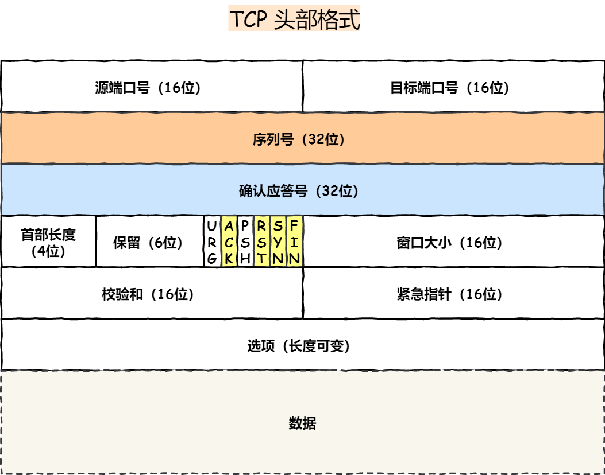

## 传输层的作用

**主要职责** ：负责不同主机的进程间通信

**功能**

- **拥塞控制** ：防止**整个网络**因负载过大而崩溃
- **流量控制** ：协调发送速率和接受速率
- **提供端到端服务** ：不同主机之间的进程通信

**常见协议**

- **TCP** ：面向连接的可靠传输服务
- **UDP** ：非面向连接的不可靠传输服务

## 多路复用和多路分解

- **多路分解** ：在接收端，传输层检测报文的字段，识别出接受端的socket，进而将报文段定向并正确交付到对应的socket中
- **多路复用** ：源主机从不同的socket收集数据块，并将数据报封装首部信息，从而生成报文段。然后将报文段交付到网络层

### 无连接的多路复用和多路分解

通过UDP套接字分配特定端口

UDP套接字的格式（目的IP，目的端口号）

### 有连接的多路复用和多路分解

通过TCP套接字分配端口

TCP套接字的格式（源IP，源端口号，目的IP，目的端口号）

## 面向连接的可靠传输—TCP协议

TCP是一个传输层协议，提供可靠传输，支持全双工，是一个连接导向的协议。数据任何时候都可以双向传输。

### TCP的主要特点

- **面向连接** ：双方传输数据之前，必须先建立一条通道
- **可靠传输** ：TCP提供可靠的传输服务。传送的数据无差错、不丢失、不重复、按序到达
- **面向字节流** ：虽然应用程序与TCP交互是一次一个大小不等的数据块，但TCP把这些数据看成一连串无结构的字节流，它不保证接收方收到的数据块和发送方发送的数据块具有对应大小关系，
- **差错检测** ：发现差错会重发报文段
- **拥塞控制** ：协调整个网络的流量，使得每条TCP连接共享带宽

### TCP报文头格式

