## 传输层的作用

**主要职责** ：负责不同主机的进程间通信

**功能**

- **拥塞控制** ：防止**整个网络**因负载过大而崩溃
- **流量控制** ：协调发送速率和接受速率
- **提供端到端服务** ：不同主机之间的进程通信

**常见协议**

- **TCP** ：面向连接的可靠传输服务
- **UDP** ：非面向连接的不可靠传输服务

## 多路复用和多路分解

- **多路分解** ：在接收端，传输层检测报文的字段，识别出接受端的socket，进而将报文段定向并正确交付到对应的socket中
- **多路复用** ：源主机从不同的socket收集数据块，并将数据报封装首部信息，从而生成报文段。然后将报文段交付到网络层

### 无连接的多路复用和多路分解

通过UDP套接字分配特定端口

UDP套接字的格式（目的IP，目的端口号）

### 有连接的多路复用和多路分解

通过TCP套接字分配端口

TCP套接字的格式（源IP，源端口号，目的IP，目的端口号）

## 面向连接的可靠传输—TCP协议

TCP是一个传输层协议，提供可靠传输，支持全双工，是一个连接导向的协议。数据任何时候都可以双向传输。

### TCP的主要特点

- **面向连接** ：双方传输数据之前，必须先建立一条通道
- **可靠传输** ：TCP提供可靠的传输服务。传送的数据无差错、不丢失、不重复、按序到达，通过确认（ACK）、重传机制以及序列号，TCP 能够保证数据在不可靠的 IP 网络上可靠传输。
- **面向字节流** ：虽然应用程序与TCP交互是一次一个大小不等的数据块，但TCP把这些数据看成一连串无结构的字节流，它不保证接收方收到的数据块和发送方发送的数据块具有对应大小关系，
- **差错检测** ：发现差错会重发报文段
- **拥塞控制** ：TCP 通过拥塞避免算法（如慢启动、拥塞避免、快速重传和快速恢复）来防止网络过载，协调整个网络的流量，使得每条TCP连接共享带宽
- **流量控制** ：TCP 通过滑动窗口机制调节发送方的数据发送速率，防止接收方因为处理能力有限而被数据流淹没。

### TCP报文格式

报文段 = 首部 + 数据

- **首部** ：最小长度 **20** 字节

  - **源端口号和目的端口号** ：对应用层数据进行多路复用和多路分解

  - **序列号 `seq`** ：在建立连接时由计算机生成的随机数作为其初始值，通过 SYN 包传给接收端主机，每发送一次数据，就「累加」一次该「数据字节数」的大小。**用来解决网络包乱序问题。**

  - **确认号 `ack`** ：指下一次「期望」收到的数据的序列号，发送端收到这个确认应答以后可以认为在这个序号以前的数据都已经被正常接收。**用来解决丢包的问题。**

  - **控制位**

    - *ACK*：该位为 1 时，「确认应答」的字段变为有效，TCP 规定除了最初建立连接时的 SYN 包之外该位必须设置为 1 。
    - *RST*：该位为 1 时，表示 TCP 连接中出现异常必须强制断开连接。
      - **端口未监听**：当主机接收到一个发往没有在监听的端口的 TCP 数据包时，会回复一个 `RST` 报文来告知发送方该端口不可用。
      - **连接异常关闭后**：如果一方出现崩溃、强制退出或被其他因素干扰导致连接中断，TCP 会使用 `RST` 报文来通知对方连接已无法继续。（例如服务端断电重启后，客户端再次通过之前的连接请求，就会被返回一个 `RST`）。
      - **数据包冲突**：当某一方接收到的序列号不在预期范围内时，可能会发送 `RST` 报文以重置连接。
      - **重置无效的连接请求**：当主机收到与当前连接状态不符的请求时，例如在未建立连接时收到 `FIN` 报文，会发送 `RST` 报文表示无效。
    - *SYN*：该位为 1 时，表示希望建立连接，并在其「序列号」的字段进行序列号初始值的设定。
    - *FIN*：该位为 1 时，表示今后不会再有数据发送，希望断开连接。当通信结束希望断开连接时，通信双方的主机之间就可以相互交换 FIN 位为 1 的 TCP 段。

  - **窗口**：滑动窗口大小，用来告知发送端接收端缓存大小，以此控制发送端发送数据的速率，从而达到流量控制。

    **校验和**：奇偶校验，此校验和是对整个的TCP报文段（包括TCP头部和TCP数据），以16位进行计算所得，由发送端计算和存储，接收端进行验证。

- **数据**

### TCP粘包，拆包

#### 现象描述

- **粘包** ：在 TCP 传输中，发送方的多个数据包在接收方被合并成一个包接收，导致多条消息数据粘在一起，接收方无法正确区分这些消息的边界。
- **拆包** ：发送方的一个数据包在接收方被分成了多个包接收，导致一条完整的消息被拆成多个部分，接收方无法一次性接收到完整的数据。

#### 出现原因

- **粘包** ：TCP是面向字节流的协议，把上层应用层的数据看成字节流，所以它发送的不是固定大小的数据包，TCP协议也没有字段说明发送数据包的大小。数据在发送方可能被一次性发送，接收方在读取时可能会将多个消息拼接在一起。
- **拆包** ：由于网络传输中的 MTU（最大传输单元）限制或发送缓冲区大小限制，一个大包被分成了多个小包传输。

#### 解决方案

- **消息定长** ：每个发送的数据包大小固定，不足的部分用空格补充，接受方取数据的时候根据这个长度来读取数据
- **消息末尾增加换行符来表示一条完整的消息** ：接收方读取的时候根据换行符来判断是否是一条完整的消息，如果消息的内容也包含换行符，那么这种方式就不合适了。
- **使用消息头** ：在消息的头部添加一个长度字段，指示消息的长度，接收方根据这个长度来读取相应长度的数据。（UDP的设计方法）

### TCP连接的基本认识

TCP 为每个数据流初始化并维护的某些状态信息（这些信息包括 socket、序列号和窗口大小），称为连接。

建立一个 TCP 连接是需要客户端与服务端达成上述三个信息的共识。

- **Socket**：由 IP 地址和端口号组成，是通信的端点
- **序列号**：用来解决乱序问题，帮助于接收方按顺序重组数据包，并检测丢包情况
- **窗口大小**：用来做流量控制

#### TCP连接的唯一确定

TCP 四元组可以唯一标识一个连接

- 源地址
- 源端口
- 目的地址
- 目的端口



TCP 三元组

三元组指的是 IP 地址和端口号的组合，即 `IP 地址 + 端口号 + 协议类型`。例如，`192.168.1.1:8080 (TCP)` 就是一个三元组。在一个机器上，这样的组合唯一标识了一个网络服务或应用程序。



### TCP连接的建立—三次握手

#### 握手过程

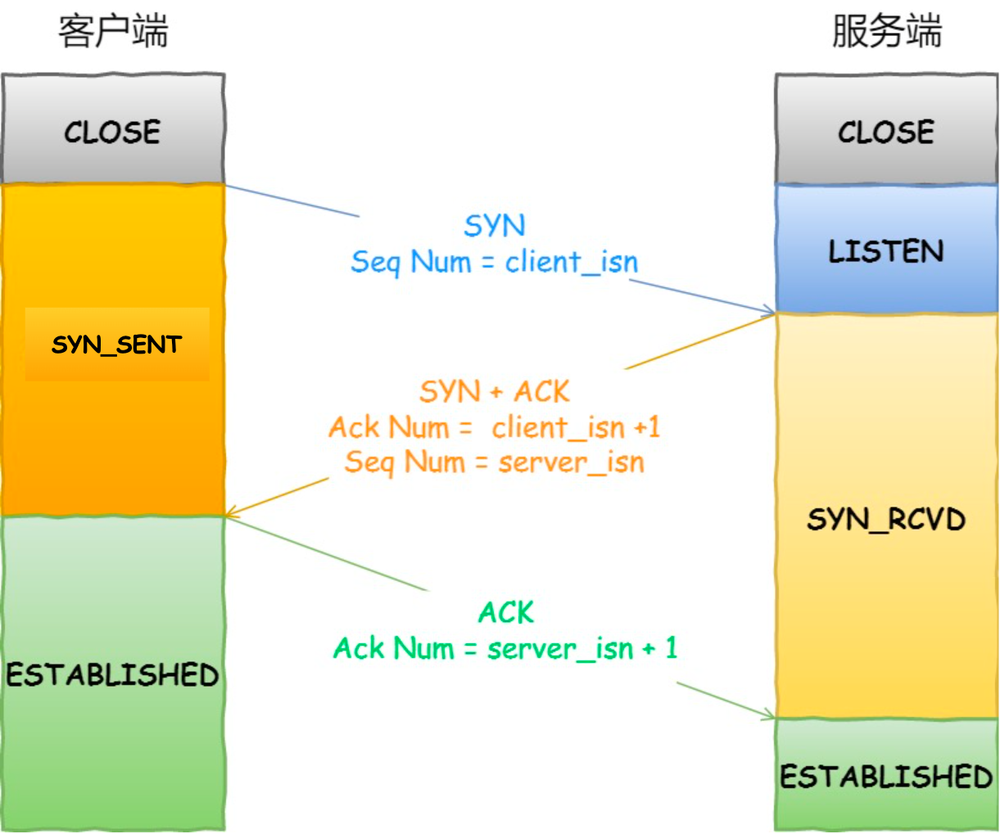

- 握手前

  - 客户端和服务端都处于 `CLOSE` 状态。先是服务端主动监听某个端口，处于 `LISTEN` 状态

- 第一次握手

  - 客户端向服务端发送特殊的TCP报文段（SYN报文段），该报文段被封装到IP数据报中，客户端处于 `SYN-SENT` 状态，表示向服务端发起连接，并告知服务器自己的初始序列号

  - SYN 报文段结构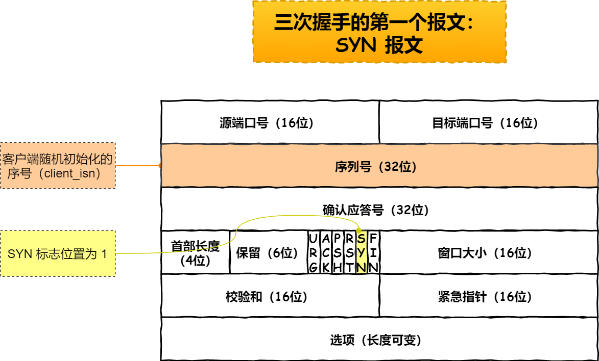

    - 客户端随机初始化序号（**`client_isn`**），设为x，填入序列号

    - **`SYN`** 字段置为1

    - 报文段不包含数据

      

- 第二次握手

  - 服务端接收到 **`SYN`** 报文段，为TCP连接分配TCP缓存和变量，并向客户端发送允许连接的报文段 **`（SYN + ACK）`** ，服务端处于 `SYN-RCVD` 状态，表示的连接请求被接受了，并通知客户端自己的初始序列号。
  - SYN+ACK 报文段结构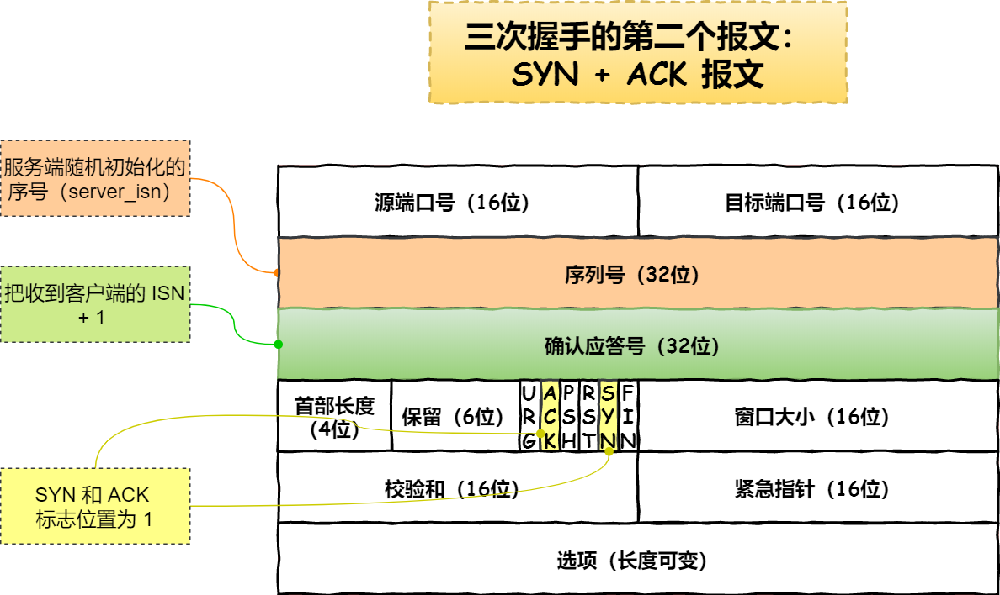
    - 服务端随机初始化自己的序号（ **`server_isn`** ）设为y，填入序列号
    - 将确认应答号 **`ack`** 置为 **`client_isn + 1`**
    - SYN和ACK字段置为1
    - 不携带数据

​	

   第二次握手为什么要传回ACK和SYN

- ACK：是第一次握手的确认报文，告知客户端从客户端到服务端的通信是正常的，服务端正确接收到客户端的信息
- SYN：建立并确认从服务端到客户端的通信

​	

- 第三次握手
  - 客户端收到服务端报文后，为TCP连接分配缓存和变量，客户端向服务端发送确认连接的报文（ACK报文），客户端处于 ESTABLISHED 状态。服务端收到客户端的应答报文后，也进入 ESTABLISHED 状态
  - ACK报文结构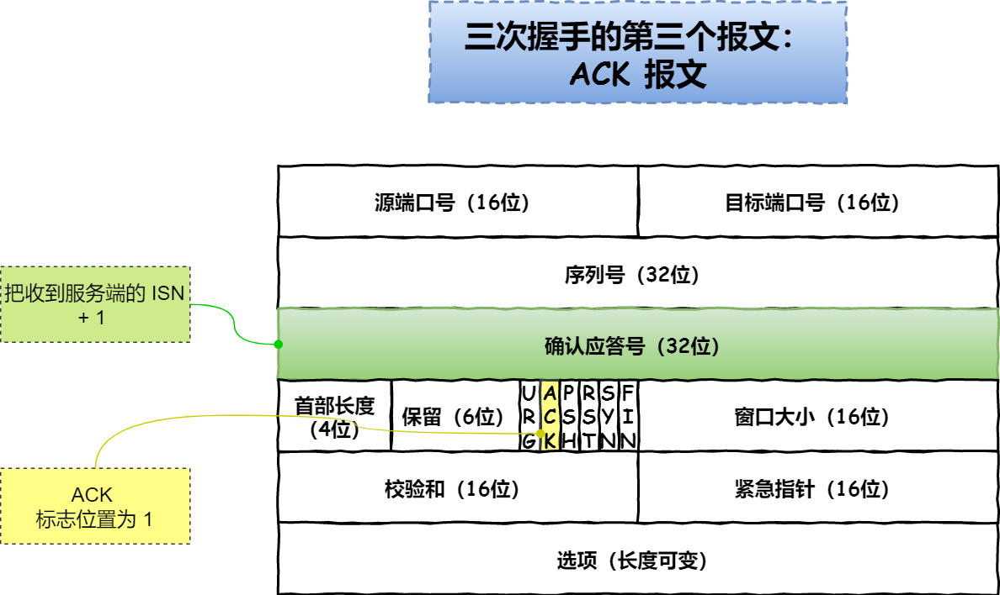
    - 将确认应答号 **`ack`** 置为 **`server_isn + 1`**
    - 将 **`ACK`** 字段置为1
    - 报文可以携带数据

#### 三次握手的必要性

- 三次握手才可以阻止重复历史连接的初始化（主要原因）
  - 一个「旧 SYN 报文」比「最新的 SYN」 报文早到达了服务端，那么此时服务端就会回一个 SYN + ACK 报文给客户端，此报文中的确认号是 **旧的SYN报文中的ISN+1** 。
  - 客户端收到后，发现自己期望收到的确认号应该是 **新的SYN报文中的ISN+1** ，于是就会回 RST 报文。
  - 服务端收到 RST 报文后，就会释放连接。
  - 后续最新的 SYN 抵达了服务端后，客户端与服务端就可以正常的完成三次握手了。
- 三次握手才可以同步双方的初始序列号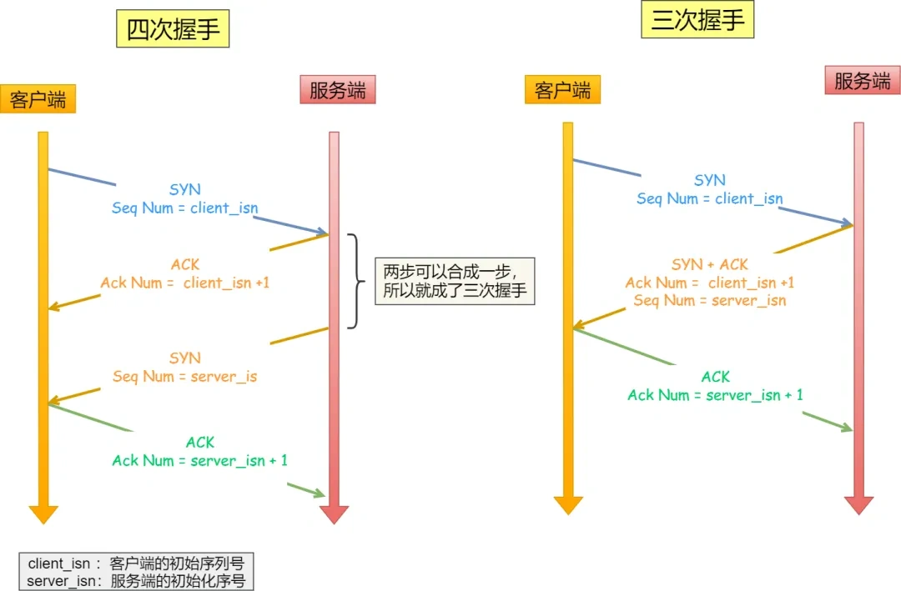
  - 当客户端发送携带「初始序列号」的 SYN 报文的时候，需要服务端回一个 ACK 应答报文，表示客户端的 SYN 报文已被服务端成功接收
  - 那当服务端发送「初始序列号」给客户端的时候，依然也要得到客户端的应答回应
- 三次握手可以避免资源浪费
  - 如果没有第三次握手，**服务端不清楚客户端是否收到了自己回复的** **ACK** **报文** 。如果客户端发送的 SYN 报文在网络中阻塞了，重复发送多次 SYN 报文，那么服务端在收到请求后就会 **建立多个冗余的无效链接，造成不必要的资源浪费。**



TCP连接为什么不设计成两次握手（面试题）

- 两次握手无法阻止重复历史连接的初始化
  - **在两次握手的情况下，服务端没有中间状态给客户端来阻止历史连接，导致服务端可能建立一个历史连接，造成资源浪费**。
    - 服务端在收到 SYN 报文后，就进入 **ESTABLISHED** 状态，意味着这时可以给对方发送数据，但是客户端此时还没有进入 **ESTABLISHED** 状态。
    - 假设这次是历史连接，客户端判断到此次连接为历史连接，那么就会回 RST 报文来断开连接，而服务端在第一次握手的时候就进入 **ESTABLISHED** 状态，所以它可以发送数据的，但是它并不知道这个是历史连接，它只有在收到 RST 报文后，才会断开连接。
    - 服务端在向客户端发送数据前，并没有阻止掉历史连接，导致服务端建立了一个历史连接，又白白发送了数据，妥妥地浪费了服务端的资源。
- 两次握手只保证了一方的初始序列号能被对方成功接收，没办法保证双方的初始序列号都能被确认接收。
- 两次握手无法识别历史连接
  - **如果握手只有两次**，那么接收方应对发送方的请求只能拒绝或者接受，但是**它无法识别当前的请求是旧的请求还是新的请求**。由于没有第三次握手，服务端不清楚客户端是否收到了自己回复的 ACK 报文，所以服务端每收到一个 SYN 就只能先主动建立一个连接。
  - 如果客户端发送的 SYN 报文在网络中阻塞了，重复发送多次 SYN 报文，那么服务端在收到请求后就会**建立多个冗余的无效链接，造成不必要的资源浪费。**



#### 初始序列号ISN

**作用**

- 为了防止历史报文被下一个相同四元组的连接接收
  - 当客户端和服务端中出现连接中断，若客户端又与服务端建立了与上一个连接相同四元组的连接，上一个连接中被网络阻塞的数据包正好抵达了服务端，刚好该数据包的序列号正好是在服务端的接收窗口内，所以该数据包会被服务端正常接收，就会造成数据错乱。
- 为了安全性，防止黑客伪造的相同序列号的 TCP 报文被对方接收

**生成过程**

初始序列号 ISN 是以时间戳为基础生成的。

#### 握手丢失

- 第一次握手丢失（客户端发送SYN报文丢失）：客户端触发超时重传机制
  - 服务端：不会进行任何的动作
  - 客户端：发完SYN报文后处于 **SYN_SENT** 状态。由于一段时间内没有收到服务端发来的确认报文，等待一段时间后会重新发送 SYN 报文（ **重传的 SYN 报文的序列号都是一样的** ），如果仍然没有回应，会重复这个过程，直到发送次数超过最大重传次数限制，就会返回连接建立失败。
- 第二次握手丢失（服务端发送SYN+ACK报文丢失）：客户端和服务端均触发超时重传机制
  - 客户端：第二次握手报文里是包含对客户端的第一次握手的 ACK 确认报文，如果客户端迟迟没有收到第二次握手，那么客户端就觉得可能自己的 SYN 报文（第一次握手）丢失了，于是 **客户端就会触发超时重传机制，重传 SYN 报文（第一次握手）** 。
  - 服务端：第二次握手中包含服务端的 SYN 报文，所以当客户端收到后，需要给服务端发送 ACK 确认报文（第三次握手），服务端才会认为该 SYN 报文被客户端收到了。那么，如果第二次握手丢失了，服务端就收不到第三次握手，于是 **服务端这边会触发超时重传机制，重传 SYN-ACK 报文（第二次握手）** 。
- 第三次握手丢失（客户端发送的ACK报文丢失）：服务端触发超时重传机制
  - 客户端：发完SYN报文后处于 **ESTABLISHED** 状态
  - 服务端：第三次握手的 ACK 报文是对第二次握手的 SYN 的确认报文，所以当第三次握手丢失了，如果服务端那一方迟迟收不到这个确认报文，就会触发超时重传机制，重传 SYN-ACK 报文，直到收到第三次握手，或者达到最大重传次数。

#### TCP半连接

TCP 半连接指的是在 TCP 三次握手过程中，服务器接收到了客户端的 SYN 包，但还没有完成第三次握手，此时的连接处于一种未完全建立的状态。

**半连接队列和全连接队列**

TCP 进入三次握手前，服务端会从 **CLOSED** 状态变为 **LISTEN** 状态, 同时在内部创建了两个队列：半连接队列（SYN 队列）和全连接队列（ACCEPT 队列）。

半连接队列存放的是三次握手未完成的连接，全连接队列存放的是完成三次握手的连接

- 客户端发送 SYN 到服务端，服务端收到之后，便回复 **ACK 和 SYN**，状态由 **LISTEN 变为 SYN_RCVD**，此时这个连接就被推入了 **SYN 队列**，即半连接队列。
- 当客户端回复 ACK, 服务端接收后，三次握手就完成了。这时连接会等待被具体的应用取走，在被取走之前，它被推入 ACCEPT 队列，即全连接队列。

#### SYN洪泛攻击

**实现原理**

SYN 洪泛 是一种拒绝服务攻击（DoS）。攻击者伪造**不存在的 IP 地址**, 向服务器发送大量 SYN 报文。当服务器回复 SYN+ACK 报文后，不会收到 ACK 回应报文，那么 SYN 队列里的连接旧不会出对队，久⽽久之就会占满服务端的 **SYN** 接收队列（半连接队列），使得服务器不能为正常⽤户服务。

**应对策略**

- **syn cookie**：在收到 SYN 包后，服务器根据一定的方法，以数据包的源地址、端口等信息为参数计算出一个 cookie 值作为自己的 SYNACK 包的序列号，回复 SYN+ACK 后，服务器并不立即分配资源进行处理，等收到发送方的 ACK 包后，重新根据数据包的源地址、端口计算该包中的确认序列号是否正确，如果正确则建立连接，否则丢弃该包。
- **SYN Proxy 防火墙**：服务器防火墙会对收到的每一个 SYN 报文进行代理和回应，并保持半连接。等发送方将 ACK 包返回后，再重新构造 SYN 包发到服务器，建立真正的 TCP 连接。

### TCP连接的断开—四次挥手

#### 挥手过程

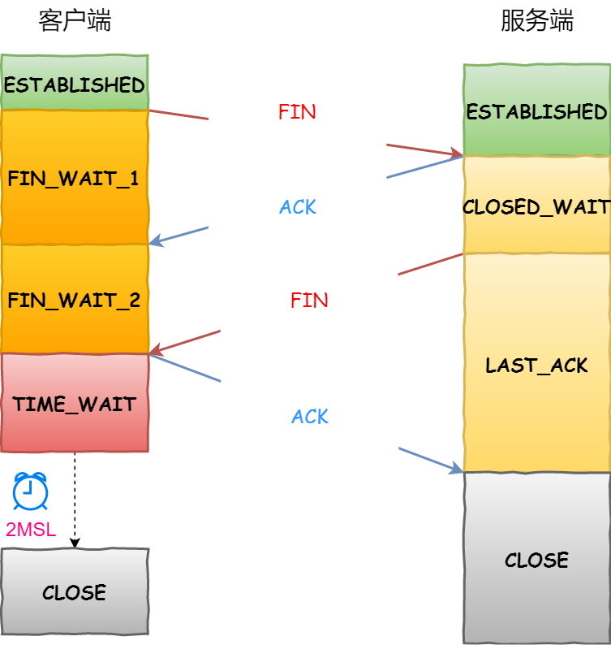

- 第一次挥手
  - 客户端主动关闭连接，发送 FIN 包。服务器收到 FIN 后，表示不再接收数据，但仍可能继续发送数据。
    - 客户端进入 **`FIN_WAIT_1`** 状态
- 第二次挥手
  - 服务器发送 ACK 包，确认已收到 FIN。在收到 FIN 报文的时候，TCP 协议栈会为 FIN 包插入一个文件结束符 EOF 到接收缓冲区中，服务端应用程序可以通过 read 调用来感知这个 FIN 包，这个 EOF 会被**放在已排队等候的其他已接收的数据之后**，所以必须要得继续 read 接收缓冲区已接收的数据；
  - 双方状态
    - 服务器进入 **`CLOSE_WAIT`** 状态
    - 客户端进入 **`FIN_WAIT_2`** 状态。
- 第三次挥手
  - 服务器完成所有数据传输后，发送 FIN 包。客户端收到 FIN 后，准备关闭连接。
    - 服务端进入 **`LAST_ACK`** 状态
- 第四次挥手
  - 客户端发送最后一个 ACK 包，并等待可能迟到的 FIN 包。服务器收到 ACK 后，关闭连接。客户端在 TIME_WAIT 计时结束后（2MSL），正式关闭连接。
  - 双方状态
    - 服务端进入 **`CLOSED`** 状态
    - 客户端进入 **`TIME_WAIT`** 状态

#### 四次挥手的必要性

主要是为了**确保数据完整性**。

TCP 是一个全双工协议，也就是说双方都要关闭，每一方都向对方发送 FIN 和回应 ACK。

客户端发起连接断开，代表客户端没数据要发送的，但是服务端可能还有数据没有返回给客户端。

所以一个 FIN + ACK 代表一方结束数据的传输，因此需要两对 FIN + ACK，加起来就是四次通信。



四次挥手变成三次挥手的情况

如果 Client 发送 FIN 给 server 的时候 server 已经没数据发送给 Client 了并且开启了 TCP 延迟确认机制，**那么 Server 就可以将 ACK （第二次挥手）和它的 FIN（第三次挥手） 合并传输一起发给 Client** ，这样一来就变成三次挥手

TCP延迟确认机制

当发送没有携带数据的 ACK，它的网络效率也是很低的，因为它也有 40 个字节的 IP 头 和 TCP 头，但却没有携带数据报文。 为了解决 ACK 传输效率低问题，所以就衍生出了 **TCP 延迟确认**。 TCP 延迟确认的策略：

- 当有响应数据要发送时，ACK 会随着响应数据一起立刻发送给对方
- 当没有响应数据要发送时，ACK 将会延迟一段时间，以等待是否有响应数据可以一起发送
- 如果在延迟等待发送 ACK 期间，对方的第二个数据报文又到达了，这时就会立刻发送 ACK



#### 挥手丢失

- 第一次挥手丢失
  - 客户端：迟迟收不到被动方的 ACK 的话，也就会触发超时重传机制
    - 重传 FIN 报文（第一次握手），重发次数由 `tcp_orphan_retries` 参数控制。
    - 当客户端重传 FIN 报文的次数超过 `tcp_orphan_retries` 后，就不再发送 FIN 报文，则会在等待一段时间（时间为上一次超时时间的 2 倍）
  - 服务端：不会有任何动作
- 第二次挥手丢失
  - 客户端：就会触发超时重传机制
    - 重传 FIN 报文（第一次报文），直到收到服务端的第二次挥手，或者达到最大的重传次数。
    - 已达到最大重传次数，于是再等待一段时间（时间为上一次超时时间的 2 倍），如果还是没能收到服务端的第二次挥手（ACK 报文），那么客户端就会断开连接。
  - 服务端：不会有任何动作
- 第三次挥手丢失
  - 服务端：触发重传机制
    - 重发 FIN 报文，重发次数仍然由 **`tcp_orphan_retries`** 参数控制，这与客户端重发 FIN 报文的重传次数控制方式是一样的。
    - 当服务端重传第三次挥手报文的次数达到了 3 次后，由于 **`tcp_orphan_retries`** 为 3，达到了重传最大次数，于是再等待一段时间（时间为上一次超时时间的 2 倍），如果还是没能收到客户端的第四次挥手（ACK报文），那么服务端就会断开连接。
  - 客户端：进入
- 第四次挥手丢失
  - 服务端：触发重传机制
    - 当服务端重传第三次挥手报文达到 2 时，由于 tcp_orphan_retries 为 2， 达到了最大重传次数，于是再等待一段时间（时间为上一次超时时间的 2 倍），如果还是没能收到客户端的第四次挥手（ACK 报文），那么服务端就会断开连接。
  - 客户端：进入 **`TIME_WAIT`** 状态，开启时长为 2MSL 的定时器，如果途中再次收到第三次挥手（FIN 报文）后，就会重置定时器，当等待 2MSL 时长后，客户端就会断开连接。

#### TIME_WAIT状态

- 在 **`TIME_WAIT`** 状态中，客户端可以重新发送 ACK 确保对方正常关闭连接。
  - 在 TCP 四次挥手过程中，主动关闭连接的一方在发送最后一个 ACK 确认包后进入 **TIME_WAIT** 状态。
  - 如果这个 ACK 丢失了，另一方（被动关闭连接的一方）没有收到确认包，会重发 FIN 报文。主动关闭的一方需要在 **TIME_WAIT** 状态下保持一段时间，以便能够重发 ACK，确保连接能被正确地关闭。
- 在 **`TIME_WAIT`** 持续的 2MSL 时间后，确保旧数据包完全消失，避免它们干扰未来建立的新连接。
  - TCP 连接在关闭后，可能会有一些延迟的或者已经失效的报文还在网络中传输。如果立即重新使用相同的 IP 地址和端口建立新的连接，可能会受到这些旧报文的干扰。
  - **TIME_WAIT** 状态可以确保在旧连接的所有报文都超时失效后，才允许新的连接使用相同的 IP 地址和端口，从而避免数据混乱。



为什么 **`TIME_WAIT`** 等待时间为2MSL

`MSL` 是 Maximum Segment Lifetime，**报文最大生存时间**，它是任何报文在网络上存在的最长时间，超过这个时间报文将被丢弃。

网络中可能存在来自发送方的数据包，当这些发送方的数据包被接收方处理后又会向对方发送响应，所以 **一来一回需要等待 2 倍的时间**。



#### 连接的强制断开

- **RST（Reset）标志**：
  - 使用 TCP RST 标志可以强制立即终止连接。发送方可以直接发送带有 RST 标志的 TCP 报文，通知对方立即断开连接。
- **超时（Timeout）**：
  - 如果连接一段时间内没有任何数据包传输，连接双方可以依据设定的超时时间自动断开连接。

### TCP的可靠传输原理

#### 检验和

TCP 报文段包括一个校验和字段，用于检测报文段在传输过程中的变化。如果接收方检测到校验和错误，就会丢弃这个报文段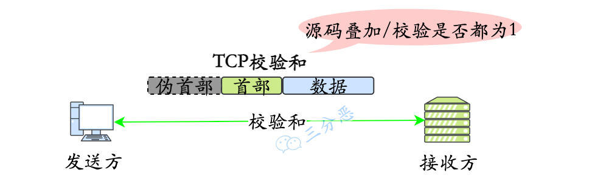

#### 重传机制和序列号确认机制

**序列号/确认机制**：TCP 将数据分成多个小段，每段数据都有唯一的序列号，以确保数据包的顺序传输和完整性。同时，发送方如果没有收到接收方的确认应答，会重传数据。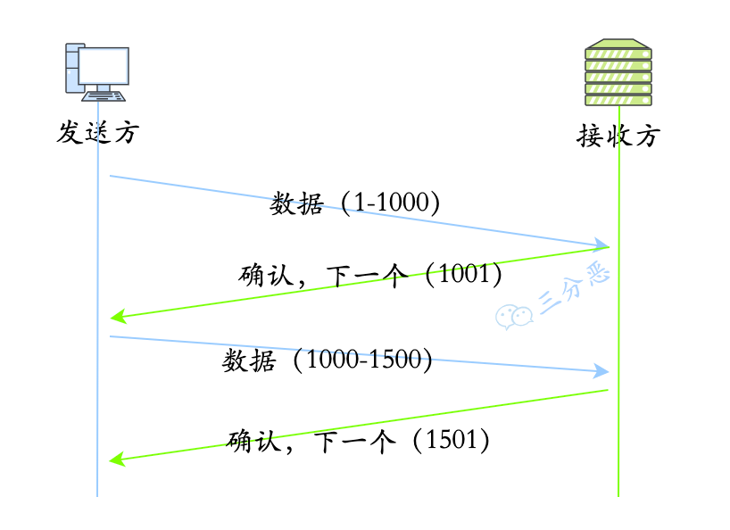

**重传机制** ：用于防止数据包的丢失。

- 超时重传：发送数据时，设定一个定时器，当超过指定的时间后，没有收到对方的 `ACK` 确认应答报文，就会重发该数据
  - 发生条件
    - 数据包丢失：发送方重新发送数据包
    - 确认应答丢失：发送方重新发送数据包
- 快速重传：发送方连续收到三次相同 ACK，会在定时器过期之前，重传丢失的报文段。

**SACK方法** ：带选择确认的重传

传统的 TCP 使用累计确认（Cumulative ACK）机制，只能确认到达的连续数据段，无法有效告知发送方中间某些数据段的丢失或乱序情况。结果是发送方只能依赖超时或重复 ACK 来重传数据，这可能导致不必要的重传，浪费带宽，降低效率。

**SACK可以将已收到的数据的信息发送给「发送方」**，这样发送方就可以知道哪些数据收到了，哪些数据没收到，知道了这些信息，就可以**只重传丢失的数据**。

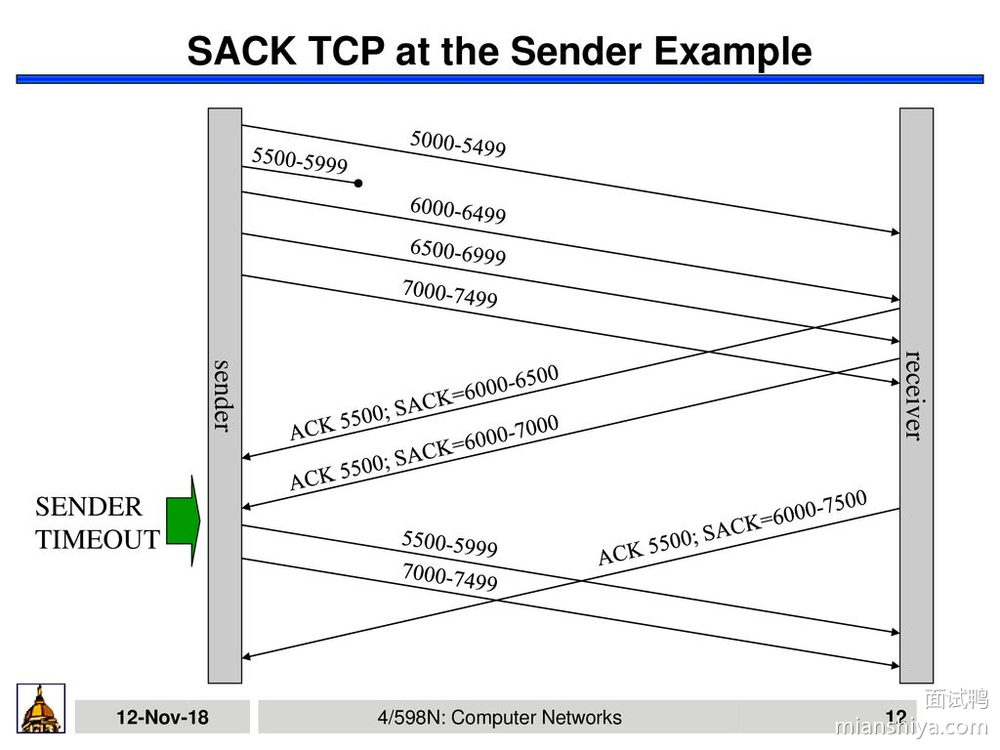

通过 ACK 告知我接下来要 5500 开始的数据，并一直更新 SACK，6000-6500 收到了，6000-7000的数据收到了，6000-7500的数据我收到了，发送方很明确的知道，5500-5999 的那一波数据应该是丢了，于是重传。

#### 滑动窗口机制

TCP 滑动窗口机制的主要作用是实现流量控制（Flow Control），即协调发送方和接收方的数据传输速率，确保发送方不会发送超出接收方处理能力的数据量，防止接收端缓冲区溢出。

滑动窗口允许发送方在未收到前一个数据包的确认（ACK）前继续发送多个数据包，从而提高网络吞吐量，减少等待时间，实现高效的数据流传输。

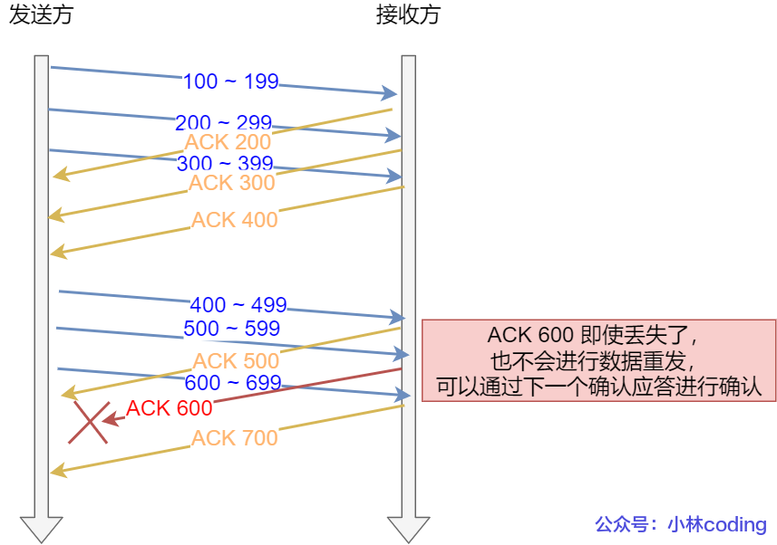

累计确认机制：图中的 ACK 600 确认应答报文丢失，也没关系，因为可以通过下一个确认应答进行确认，只要发送方收到了 ACK 700 确认应答，就意味着 700 之前的所有数据「接收方」都收到了。

#### 拥塞控制

- **慢启动**：
  - 发送方在连接建立初期，缓慢地增加数据发送速率。初始的拥塞窗口（cwnd）通常为一个 MSS（最大报文段大小），然后在每次收到 ACK 后成倍增加 cwnd，直到达到慢启动阈值（ssthresh）或检测到网络拥塞。
- **拥塞避免**
  - 当 cwnd 达到 ssthresh 后，TCP 进入拥塞避免阶段，拥塞窗口的增长速度从指数变为线性增长，即每个 RTT（往返时间）增加一个 MSS。这一阶段旨在避免激烈的拥塞反应，保持网络稳定性。
- **拥塞发生**
  - 当网络出现拥塞，也就是会发生数据包重传
    - 超时重传
      - `ssthresh` 设为 `cwnd/2`，
      - `cwnd` 重置为 `1` （是恢复为 cwnd 初始化值，我这里假定 cwnd 初始化值 1）
    - 快速重传
      - `cwnd = cwnd/2` ，也就是设置为原来的一半;
      - `ssthresh = cwnd`;
- **快速恢复（Fast Recovery）**
  - 在快速重传后，TCP 不进入慢启动，而是减小 cwnd 到当前的一半，并设置 ssthresh 为当前新的 cwnd 的值，然后开始线性增加 cwnd，以快速恢复到丢包前的传输速率。
- **保活机制**
  - 如果两端的 TCP 连接一直没有数据交互，达到了触发 TCP 保活机制的条件，那么内核里的 TCP 协议栈就会发送探测报文。
  - 如果对端程序是正常工作的。当 TCP 保活的探测报文发送给对端, 对端会正常响应，这样 **TCP 保活时间会被重置**，等待下一个 TCP 保活时间的到来。
  - 如果对端主机宕机（*注意不是进程崩溃，进程崩溃后操作系统在回收进程资源的时候，会发送 FIN 报文，而主机宕机则是无法感知的，所以需要 TCP 保活机制来探测对方是不是发生了主机宕机*），或对端由于其他原因导致报文不可达。当 TCP 保活的探测报文发送给对端后，石沉大海，没有响应，连续几次，达到保活探测次数后，**TCP 会报告该 TCP 连接已经死亡**。



HTTP Keep-Alive 和 TCP Keep-Alive

- HTTP 的 Keep-Alive 也叫 HTTP 长连接，该功能是由「应用程序」实现的，可以使得用同一个 TCP 连接来发送和接收多个 HTTP 请求/应答，减少了 HTTP 短连接带来的多次 TCP 连接建立和释放的开销。
- TCP 的 Keepalive 也叫 TCP 保活机制，该功能是由「内核」实现的，当客户端和服务端长达一定时间没有进行数据交互时，内核为了确保该连接是否还有效，就会发送探测报文，来检测对方是否还在线，然后来决定是否要关闭该连接。



## 非面向连接的不可靠传输-UDP协议

### UDP的主要特点

- **非面向连接** ：进程之间通信之前没有握手过程，而是将带有目的地址的报文放入线路
- **不可靠服务** ：不确保报文段按序交付，不保证报文的完整性
- 不提供拥塞控制和流量控制
- 使用场景：实时通讯、语音、视频、游戏等高性能要求应用
- 面向报文段

### UDP报文结构

报文段结构：数据字段 + 首部字段

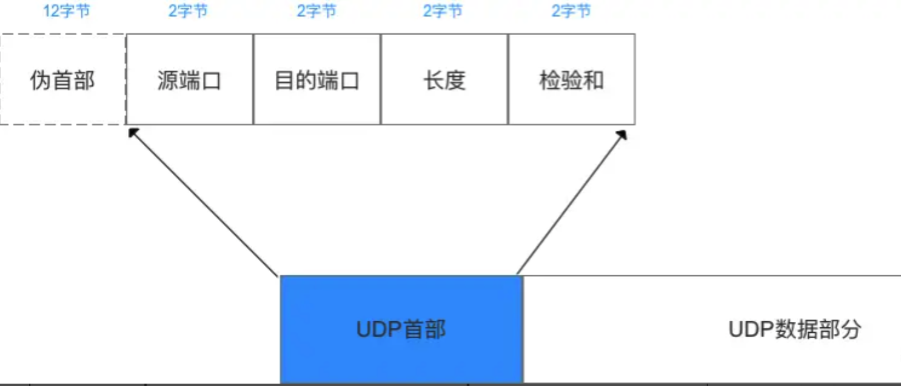

- 首部
  - 源端口：这个字段占据 UDP 报文头的前 16 位，通常包含发送数据报的应用程序所使用的 UDP 端口，接收端的应用程序利用这个字段的值作为发送响应的目的地址，这个字段是可选的，所以发送端的应用程序不一定会把自己的端口号写入该字段中，如果不写入端口号，则把这个字段设置为 0，这样，接收端的应用程序就不能发送响应了。
  - 目的端口：接收端计算机上 UDP 软件使用的端口，占据 16 位。
  - 长度：该字段占据 16 位，表示 UDP 数据报长度，包含 UDP 报文头和 UDP 数据长度，因为 UDP 报文头长度是 8 个字节，所以这个值最小为 8。
  - 校验值：该字段占据 16 位，可以检验数据在传输过程中是否被损坏。
- 数据部分
