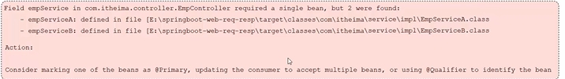

## 什么是依赖注入（DI）

组件之间依赖关系由容器在运行期决定，形象的说，即由容器动态的将某个依赖关系注入到组件之中。依赖注入的目的并非为软件系统带来更多功能，而是为了提升组件重用的频率，并为系统搭建一个灵活、可扩展的平台。

## 关键点分析

- 谁依赖于谁：当然是**应用程序依赖于IoC容器**；
- 为什么需要依赖：**应用程序需要IoC容器来提供对象需要的外部资源**；
- 谁注入谁：很明显是**IoC容器注入应用程序某个对象，应用程序依赖的对象**；
- 注入了什么：就是**注入某个对象所需要的外部资源（包括对象、资源、常量数据）**

## Bean注入方式

### @Autowired注入

使用<strong>@Autowired</strong>注解修饰要注入的对象

```
@Autowired
userMapper mapper;
```

#### 注意事项

- **@Autowired**注解默认按Bean对象的类型进行自动装配，若存在多个相同类型的Bean对象会报错
- 可以使用注解<strong>@Primary</strong>指定Bean对象的优先级，对优先级高的Bean对象使用 **@Primary** 注解
- 可以使用注解<strong>@Qualifier</strong>和<strong>@Autowired</strong>配合使用，<strong>@Qualifier</strong>的value属性用于按名字指定Bean对象



Bean对象的默认名称是类名首字母小写



### @Resource

​		使用 **@Resource** 注解修饰要注入的对象,**@Resource** 注解按照Bean对象名注入对象

```java
@Resource(name="Bean_name")
userMapper mapper;
```



**@Resource** 和 **@Autowired** 的区别

- **@Autowired** 是Spring框架提供的注解，而 **@Resource** 是IDK提供的注解
- **@Autowired** 默认是按照类型注入，而 **@Resource** 默认是按照名称注入。


