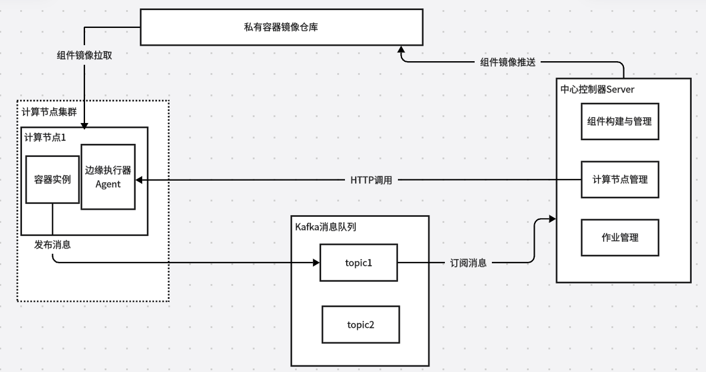

## Serverless架构的定义与特点

**Serverless** 的英文直译是无服务器的。但是并不代表真正的没有服务器，而是将底层服务器的管理和维护细节透明化，使得开发者可以专注于业务逻辑的实现，而无需考虑服务器的配置、扩展和维护等问题。

2019年UBC发表的论文[《Cloud Programming Simplified: A Berkeley View on Serverless Computing》](https://arxiv.org/abs/1902.03383) 指出了 **Serverful** 架构和**Serverless** 架构的一些区别

> 在云的上下文中，Serverful 的计算就像使用低级的汇编语言编程，而 Serverless 的计算就像使用 Python 这样的高级语言进行编程。例如 c=a+b 这样简单的表达式，如果用汇编描述，就必须先选择几个寄存器，把值加载到寄存器，进行数学计算，再存储结果。
>
> 这就好比今天在云环境下 Serverful 的计算，开发首先需要分配或找到可用的资源，然后加载代码和数据，再执行计算，将计算的结果存储起来，最后还需要管理资源的释放。
> 

在我看来Serverless架构和Serverful架构最根本的区别在于 **开发者的责任划分的问题** 。在Serverful架构中开发者需要关心的非业务问题非常多。而在 Serverless 架构下，开发者只专注于开发业务逻辑，所有的这些与业务无关的基础设施，全部交给云平台负责，由云平台统一调度、运维。

同样该论文提出了以下观点：**Serverless computing=FaaS(函数即服务)+BaaS(后端即服务)** 

下面表达以下我对 **FaaS** 和 **BaaS** 的理解

- BaaS意味着云服务商把后端架构的工作全部包揽下来。例如硬件的维护，集群的管理，运行环境的搭建，全部由云平台完成，除此之外，像缓存、数据库、文件存储、消息中间件等，也全部有云平台帮我们做好，封装起来，以接口的形式提供服务。对于开发者，BaaS 就是一个黑盒，你不用知道我怎么做，更不需要关心我如何做，你需要什么过来拿就行了。
- FaaS意味着一个函数运行平台，用于执行业务逻辑代码。

Serverless架构具有以下特点

- **服务器透明化** ：虽然实际还是在服务器上运行，但开发者无需管理或配置这些服务器，所有的资源调度、伸缩和维护均由云服务平台自动处理。
- **事件驱动** ：函数或组件只有在特定事件触发时才会被调用。这种模式使得资源利用更加高效，按需执行并只为实际使用的计算资源付费。
- **高扩展性** ：云平台会根据实际请求量自动扩展或缩减计算资源，确保应用在流量高峰时能够稳定运行，而在流量低谷时减少资源浪费。
- **按需计费**：由于只在函数执行期间计费，用户可以大幅降低成本，避免因长期运行空闲服务器而产生的浪费。

## 架构设计思路

### 组件即函数

在Serverless架构中，开发者将代码作为函数上传到云平台，并在事件触发时执行。而项目中的组件与函数具有很多相似之处

- **事件驱动** ：组件是基于事件驱动的，当存在数据处理事件时，组件才会被触发并开始运行，并在处理完数据后立即终止。
- **服务器透明** ：组件不需要事先配置或管理任何服务器，组件开发人员可以专注于编写组件代码，而无需关心服务器的管理。
- **状态无关** ：组件是无状态的，其算法功能单一且稳定，对固定类型的输入数据进行数据处理后得到对应的处理结果，不同组件之间不存在调用关系且不共享任何状态信息。

### 移动数据不如移动计算

数据处理平台中有一条重要理念：**移动数据不如移动计算** 。与其将大量数据从存储地点传输到计算资源处进行处理，不如把计算任务迁移到数据所在的位置。这样可以避免大量数据在网络中传输所带来的延迟、带宽占用和I/O开销，从而提高数据处理效率。因此通过在边缘计算节点上直接执行任务，可以利用本地数据进行计算，而无需将数据传输到云端进行处理

## 架构核心设计

### 核心概念

- **批处理算法组件** ：由组件开发人员开发得到的算法组件。
- **组件库** ：由组件开发人员上传并成功构建的多个可被调用的组件组成组件库
- **批处理任务** ：指定数据处理操作需要调用的批处理算法组件，在配置中每个任务都与批处理算法组件有唯一的映射关系，每个批处理任务的执行实际上是通过启动容器执行组件从而实现数据处理。
- **作业工作流** ：由多个批处理任务组成，每个作业工作流代表着一个数据处理作业的执行流程，对应于组件编排模型，通过DAG图描述批处理任务之间的依赖关系。
- **作业** ：数据处理作业是引擎核心业务单位，每个数据处理作业包含作业基本信息及工作流。

### 核心架构

架构中包含三大核心模块，分别是中心控制器（Server）以边缘执行器（Agent）以及Kafka消息中心。

#### 中心控制器（Server）

Server部署在云端，负责管理集群的计算节点、组件及作业等资源。

- Server提供 **计算节点管理服务** ：Server会维护一个计算节点列表，该列表用于记录平台中的所有计算节点。在用户进行组件编排时，可通过在Json文件中指定组件运行的计算节点，将组件迁移至数据所在处的计算节点运行。若计算节点长期未上报心跳事件，中心控制器会将该计算节点从列表中删除，以保持列表的准确性和及时性。
- Server提供 **组件管理服务** ：开发人员将算法程序封装为组件后，将组件代码和镜像构建文件打包成压缩包，并将压缩包和组件描述文档一起上传至Server。Server解压缩得到组件代码和镜像构建文件后，开始构建组件镜像。镜像构建完成后，将该镜像推送到私有的镜像仓库中，并将组件信息和镜像地址存储到数据库中，完成组件上传与镜像构建的流程。
- Server提供 **作业管理服务** ：业务人员在组件库中选取需要执行的组件，编写作业描述文档构建并上传新的数据处理作业，Server接收到业务人员上传的作业描述文档后，解析文档并将作业信息和作业工作流中各个任务的信息存储至数据库中。执行作业时，Server首先通过采用拓扑排序的方法来确定工作流中待执行的任务，并将这些任务派发至数据所在地的计算节点进行执行。一旦任务执行完成，组件会上报组件运行生命周期事件，Server通过订阅消息队列的指定主题，获取该消息后，获取作业工作流中的下一个待执行任务，并重复上述操作，直至所有的任务都运行完毕，从而完成整个作业的运行过程。

#### 边缘控制器（Agent）

Agent部署在各个计算节点上，启动时会向中心控制器发起节点注册请求，注册成功后，边缘执行器所在的Agent成为集群中的计算节点。

- Agent提供 **计算节点硬件资源使用情况查询** ：Server通过调用该接口，获取计算节点当前的硬件资源信息。同时，边缘执行器以固定的频率向中心控制器发送心跳事件，告知Server当前计算节点处于健康（在线）状态，可以向该计算节点分配任务。

- Agent提供 **组件容器的封装** ：与计算节点上的Docker服务进行交互，任务运行时，Agent解析获取任务使用的组件镜像地址，从云端的组件库中拉取组件镜像到计算节点本地后，根据任务参数中的组件运行配置信息创建并组件运行容器，实现移动计算，将代码迁移至数据所在地运行。
- Agent提供 **请求转发** ：Server向Agent发起任务运行生命周期管理请求，请求中携带组件容器绑定的端口和动作类型，Agent接收到该请求后根据请求中的端口号，将该请求转发至监听该端口的组件容器，获得请求响应后再将结果返回给中心控制器。
  图

### 整体架构设计图

## 工作流程设计

- **编写组件逻辑代码** ：开发人员根据提供的SDK编写好组件的业务逻辑代码和生命周期事件代码

- **构建组件** ：编写Dockerfile然后将组件构建成镜像推送到私有镜像仓库中

- **编写作业描述文档** ：开发人员编写作业描述文档，指定容器的编排顺序，指定计算节点等

- **执行作业**

  - Server解析文档并将作业信息和作业工作流中各个任务的信息存储至数据库中
  - Server采用拓扑排序的方法来确定工作流中待执行的任务，并将这些任务派发至数据所在地的计算节点进行执行
  - 任务执行完成，组件会上报组件运行生命周期事件

  