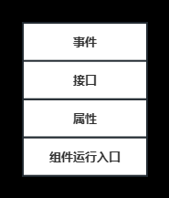
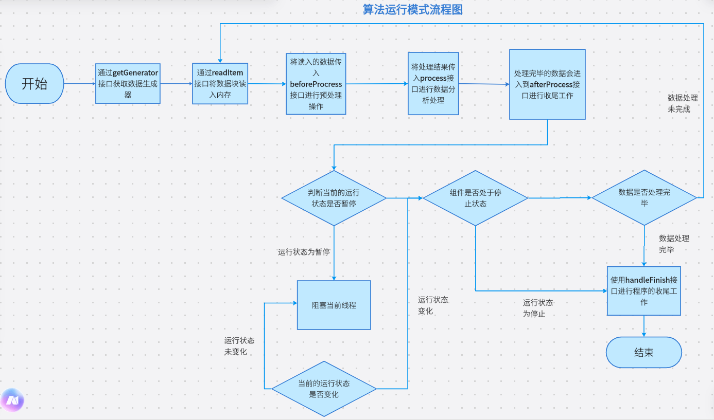
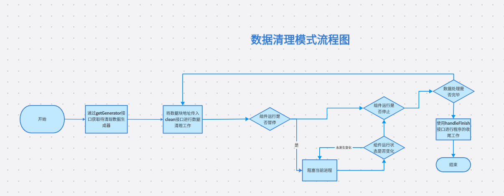
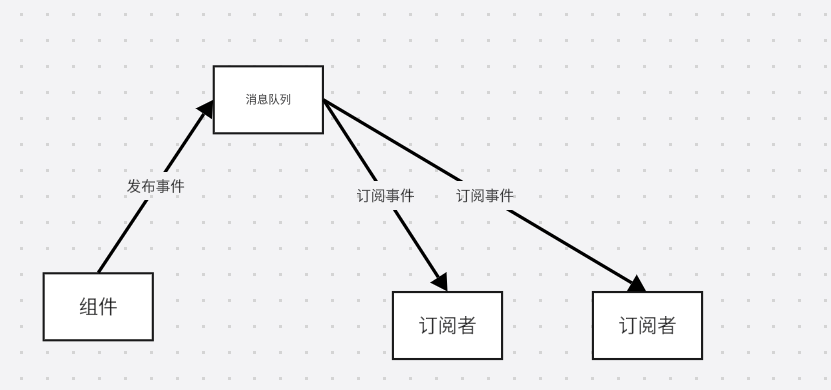
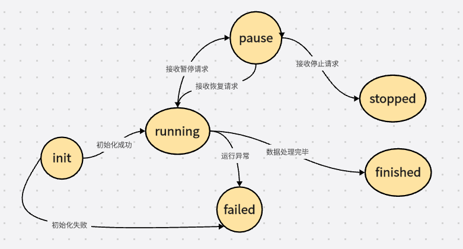
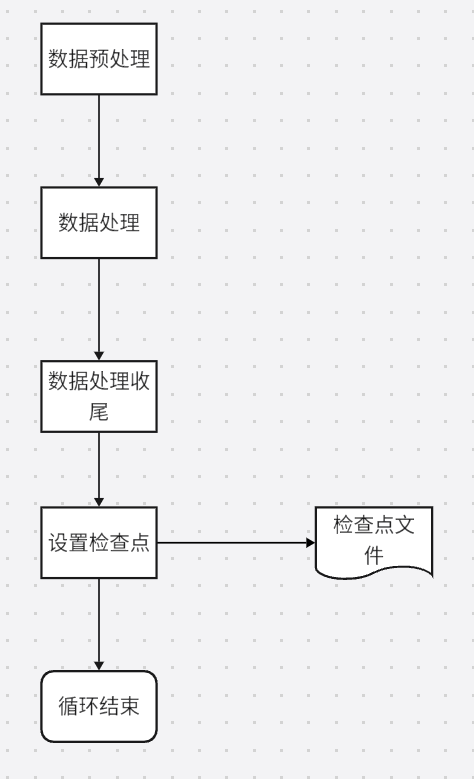
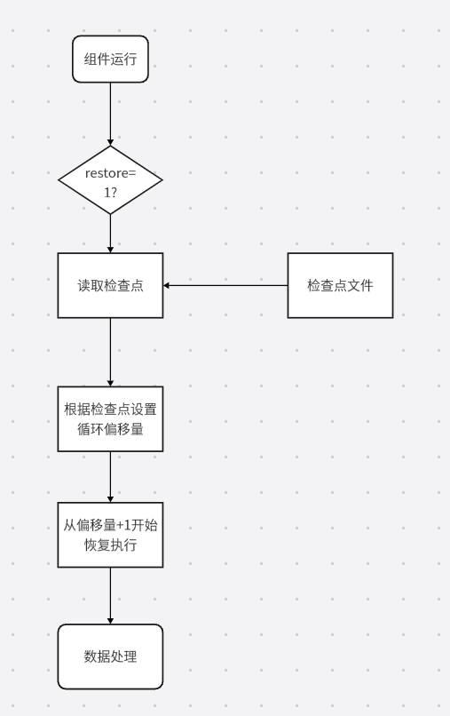

## 批处理算法组件的设计动机

- **异常处理**：大多数算法开发人员在程序开发过程中通常只关注程序的正常逻辑，而忽视了程序在运行过程中可能遇到的异常情况以及如何处理这些异常故障。
- **缺乏生命周期管理**：缺乏提供生命周期管理接口，用户无法方便地查询程序的运行状态，也无法进行必要的生命周期管理操作，例如暂停、恢复或停止程序的执行。若在程序执行过程中发现逻辑错误或需要优先执行其他任务，用户只能通过终止进程的方式停止程序的执行。

## 批处理算法组件的模型结构

批处理算法组件是**面向海量数据批处理场景**的**具有生命周期管理**和**检查点恢复机制**的功能软件单元



## 属性

属性是组件内部维护的数据成员，包含以下两种类型：**组件启动配置属性**、**组件运行过程属性**以及**数据处理属性**。

### 组件启动配置属性

在组件启动时，外部环境将参数传递给组件，随后组件进入初始化阶段，利用这些参数为组件的启动配置属性进行赋值

- **mode**：组件运行模式
  - 算法执行模式 （algorithm）：正常执行算法过程
  - 数据清理模式（clean）：若组件的算法逻辑有误导致错误的数据输出或中间输出结果没有业务价值，则需要清理这些数据，减轻集群节点机器的磁盘资源压力。
- **restore**：检查点标志位
  - **1**：组件在运行之前，会尝试读取本地的检查点文件，并从检查点处恢复执行
  - **0**：组件此次运行会重新开始处理所有数据
- **properties_url**：数据处理参数的配置文件地址

### 组件运行过程属性

组件运行过程属性是用于记录组件的运行状态、运行进度等相关信息的属性集合

- **status**：组件当前的运行状态
  - 初始化 **（init）**
  - 运行中 **（running）**
  - 暂停 **（paused）**
  - 停止 **（stop）**
  - 运行完成 **（finished）**
  - 运行失败 **（failed）**
- **now**：当前处理的数据块序号。
- **total**：数据块总数
- **progress**：组件的运行进度，计算公式：$progress=now/total$。
- **start_at**：组件的开始运行时间，组件初始化完毕后设置该属性。
- **pause_at**：组件的运行暂停时间，该属性记录组件运行的最近一次暂停时间。
- **pause_duration**：组件运行暂停的总时长，组件在运行时可以被多次暂停。
- **remain_time**：组件运行的剩余时长

### 数据处理属性

数据处理属性是组件进行数据处理时需要使用的属性

- 输入数据地址
- 输出结果地址
- 可选的算法模型动态参数

## 接口

接口定义了组件的各项行为

### 生命周期管理

组件运行时会启动一个HTTP服务，并提供生命周期管理接口给外界控制和获取组件运行状态

- **info** ：获取组件运行状态，包括组件运行进度、运行状态等信息
- **pause**：暂停组件运行
- **restart**：恢复运行处于暂停状态的组件
- **stop**：停止组件运行

### 数据处理

数据处理接口是组件读取、处理以及写入数据的接口集合

- **getConfig**：获取数据处理属性。
- **getGenerator**：返回一个获取批处理任务所需数据的生成器。组件进行数据处理时，数据被分成块进行处理。开发人员实现该接口时，可以根据需要指定块的粒度。
- **readItem**：从生成器中遍历得到数据的存放地址，并将数据读取至内存中。
- **beforeProcess**：输入数据的预处理环节。
- **process**：主要的数据分析处理环节，开发人员要在该接口内实现批处理算法逻辑。
- **afterProcess**：收尾工作，例如可将处理完毕的图片从内存中移除，避免过多的图片将内存占满
- **clean**：清理组件执行过程中生成的所有数据
- **handleFinish**：当数据的批处理任务后，将要退出前调用此接口进行收尾工作

#### **算法运行模式**

1. 通过**getGenerator**接口获取数据生成器，并遍历该生成器
2. 在每次遍历时，按照以下步骤进行数据处理操作。
   1. 通过**readItem**接口将数据块读入内存。
   2. 将读入的数据传入**beforeProcress**接口进行预处理操作。
   3. 预处理完毕后，将处理结果传入**process**接口进行数据分析处理，执行具体的数据处理算法或操作。
   4. 处理完毕的数据会进入到**afterProcess**接口进行收尾工作，如释放内存等。
3. 进入下一次循环之前，组件程序会判断当前的运行状态。
   1. 如果状态为暂停，线程将被阻塞，直到状态重新变为运行中。
   2. 如果状态为停止或生成器已遍历完成，则进入使用**handleFinish**接口进行程序的收尾工作。



#### 数据清理模式

1. 通过getGenerator接口获取待清理数据生成器，并遍历该生成器。
2. 在每次遍历时
   1. 将数据块地址传入clean接口进行数据清理工作。
3. 数据清理完毕后，在进入下一次循环之前，需要判断组件运行状态
   1. 如果状态为暂停，线程将被阻塞，直到状态重新变为运行中。
   2. 如果状态为停止或生成器已遍历完成，则进入使用**handleFinish**接口进行程序的收尾工作。



### 检查点管理

检查点接口是负责组件运行过程中检查点设置和读取的接口集合

- **setCheckpoint**：设置检查点内容，保存组件当前的运行状态。
- **getCheckpoint**：读取检查点内容，组件重新启动时，调用该接口恢复组件运行状态。

### 事件发布

- **lifeCycleEventPublish**：发布组件运行生命周期事件。
- **runPorgressEventPublish**：发布组件运行进度事件。

## 事件

事件是批处理算法组件具备的主动向外界传递信息的能力，采用发布/订阅机制。

消息队列接受组件模型发布的事件

订阅者通过订阅获取事件



### 运行生命周期事件（Life Cycle Event）

组件运行过程中，向外界告知当前组件的运行状态。

```json
{ 
 	"id": "", // 组件运行唯一标识 
 	"status": "", // 运行状态, running/paused/stopped/finished/failed 
 	"msg": "", // 消息，如运行异常的原因 
 	"occurAt": "" // 事件发生时间 
}
```


### 运行进度事件（Run Progress Event）

组件运行时首先获取待处理数据，再将待处理数据分批并以循环的方式进行重复的算法操作。每个循环执行结束后，向外界告知组件当前的执行进度

```json
{ 	
	"id": "", // 组件运行唯一标识 
	"progress": 0, // 运行进度 
	"startTime": 0, // 开始时间，毫秒级时间戳 
	"usedTime": 0, // 使用时间，秒 
	"remainTime": 0, // 剩余时间，秒 
}
```


### 自定义事件（Custom Event）

自定义事件允许用户根据业务需求发送事件，事件内容不做限制

## 组件运行入口

组件的运行入口是一个main函数，外界通过调用组件的main函数启动组件运行。

1. 首先接收外界传递的参数，以进行组件的初始化阶段。
2. 启动一个HTTP服务线程，以便外界可以与组件进行通信。
3. 通过判断mode属性值来确定组件进入哪种运行模式
   1. 如果mode为algorithm，进入算法执行模式；
   2. 如果mode为clean，进入数据清理模式。

## 批处理算法组件的模型机制

### 生命周期管理机制

- 初始化 **（init）** ：处于该状态的组件进行必要的初始化操作。
- 运行中 **（running）** ：处于该状态的组件按照既定的算法逻辑处理数据。
- 运行暂停 **（paused）** ：一旦组件进入暂停状态，线程将会持续阻塞，无法继续执行下一步操作。
- 运行停止 **（stopped）** ：组件主动终止当前的执行进入停止状态，组件进程将会退出
- 运行完成 **（finished）** ：当组件处理完所有的数据后，进入运行完成状态，进行收尾工作并退出进程。
- 运行失败 **（failed）** ：运行失败状态表示组件在执行过程中遇到了错误、异常或不可恢复的问题，导致无法继续正常运行



### 检查点恢复机制

检查点恢复机制确保组件运行时，即使组件运行停止或突然遇到故障导致组件崩溃退出，也能够在下一次重新启动时恢复到最近一个检查点的状态继续执行

#### 设置检查点

在每次数据处理循环结束之前，调用设置检查点接口 **setCheckpoint** 将当前组件处理输入数据的进度作为检查点文件保存在本地文件系统中。组件模型内部维护一个检查点对象，在保存检查点时，会将该对象进行序列化并以 **Json** 文件格式持久到本地的文件系统

一个粗粒度的检查点对象示例

```json
{ 
    "offset": 50, // 循环执行偏移量 
    "total": 100, // 循环总数 
    "startTime": 1640966400000, // 组件运行开始时间 
    "usedTime": 100 // 组件运行时长 
}
```

后续开发人员可以增加检查点中的数据成员用于保存数据处理的中间处理结果，并在 **setCheckpoint** 和 **getCheckpoint** 接口实现相应代码逻辑



### 读取检查点

当组件恢复运行时，若属性restore的值为1，则判断本地是否存在该组件运行的检查点文件，存在则读取检查点文件并进行反序列化得到检查点对象



## 批处理算法组件的编排模型

由算法程序封装得到的批处理算法组件只能提供单一的算法功能，无法单独完成完整的数据处理任务。 

因此在完成各个组件的独立开发后，还需要允许用户根据具体需求选择组件，并对多个组件进行编排，通过复用已有组件，处理复杂的数据处理任务。

### 编排模型的结构设计

在组件编排模型中，多个组件之间以有向无环图（DAG）的方式进行编排

有向箭头表示组件之间的依赖关系，例如，组件A指向组件B的有向箭头表示组件B需要在组件A的运行结果的基础上进行数据处理和分析，即组件A的运行输出结果作为组件B的运行输入数据。
