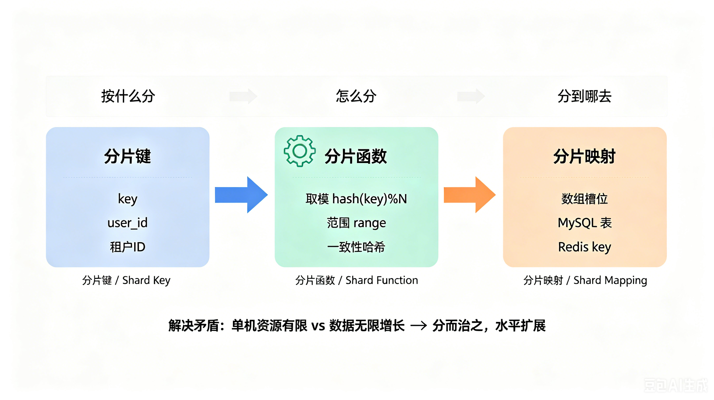
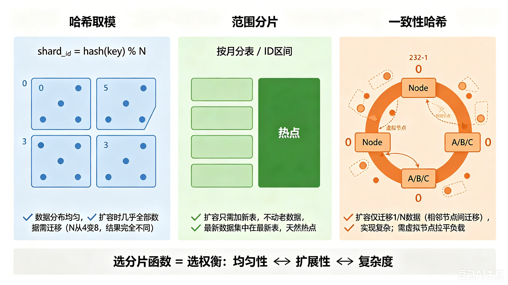
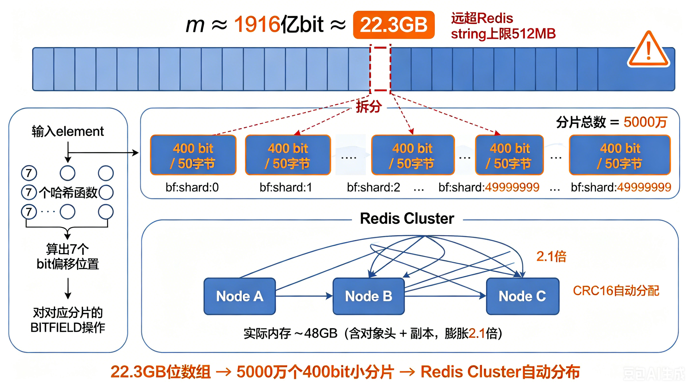
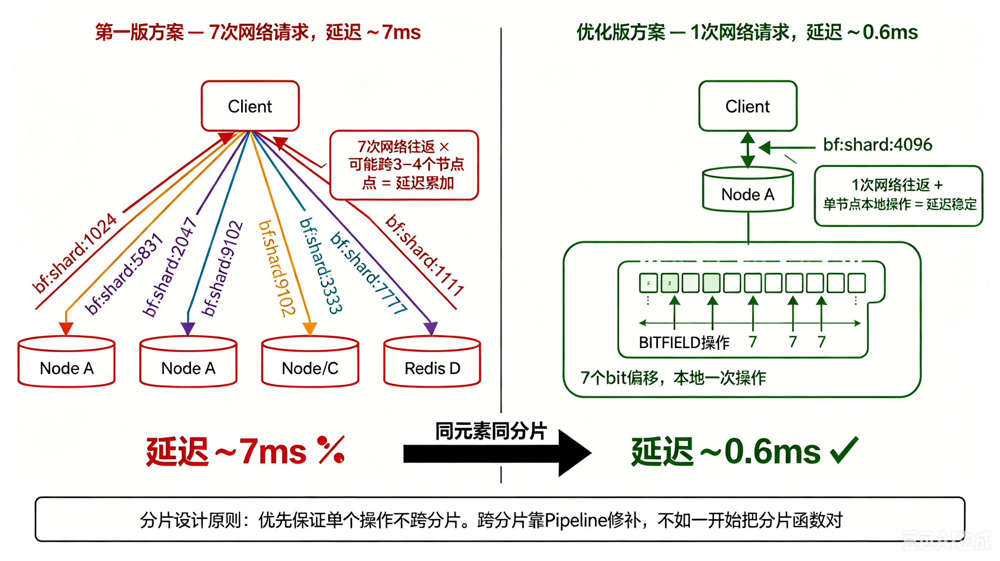

## 分片到底是什么。
分片到底是什么。
大多数人听到分片，第一反应是"把数据切成几块"。真正决定系统生死的是怎么切——也就是分片算法。扛住双十一的分布式数据库，到200 亿量级的布隆过滤器，底层跑的都是同一套逻辑：分片键、分片函数、分片映射。

搞懂了这三个要素，你就有了分析任何分片系统的通用框架。

## 分片三要素：先搞清楚它在干什么
任何分片模型都绕不开三个问题：按什么分、怎么分、分到哪去。

- 分片键是按什么分。哈希表里是 key，订单系统里是 user_id，数据库里可能是租户 ID。选错了分片键，后面的一切都白搭。

- 分片函数是怎么分。把分片键算成一个具体位置的公式——取模、范围、一致性哈希，都属于这一层。分片函数的好坏，直接决定数据均不均匀、扩容痛不痛。

- 分片映射是分到哪去。算出来的那个位置对应什么——数组里的一个槽位、MySQL 里的一张表、Redis 里的一个 key。

这三个要素组合起来，解决的是一个朴素的矛盾：单机资源有限，数据量和请求量无限增长。分片算法通过"分而治之"让系统能够水平扩展。但"能扩展"和"扩展得好"之间，差的是分片函数设计里的魔鬼细节。我们一个一个场景看。

## 数据库分片
MySQL 单表超过 5000 万行之后，查询延迟肉眼可见地攀升。这不是调索引能解决的问题——磁盘 IO 有上限，CPU 有上限，单机网卡带宽也有上限。唯一的出路是把数据分到多台机器上。这就是数据库分库分表。

数据库分片是指将数据库中的数据按分片键进行分片，每个分片存储在不同的数据库实例中。

选哪种分片函数，决定你以后加机器时的痛苦程度

- shard_id = hash(key) % N // N 是分片数 N 是当前分片数。数据分布极其均匀，运维也很开心——至少上线那天很开心。因为等到要扩容的时候，问题就来了：N 从 4 变成 8，hash(key) % 4 和 hash(key) % 8 的结果几乎完全不同。换句话说，几乎所有数据都要搬家。
这就是哈希取模的代价——均匀性和扩展性不可兼得。
- 范围分片，比如按月分表，或者按 ID 区间划分。扩容时只需要往尾部加新表，不用动老数据。代价也明显：最新数据集中在最新那张表上，天然热点。
- 一致性哈希。它把分片映射到一个哈希环上，扩容时只有相邻节点之间的数据需要迁移，迁移比例可以降到 1/N。听起来很美，但实现复杂度高出一截，负载不均也是常态——需要引入虚拟节点来拉平。

分完片之后，有些原来一行 SQL 搞定的事情变得麻烦了。

不带分片键的查询会被广播到所有分片再聚合结果，性能和复杂度同步飙升。这反过来强制业务查询必须携带分片键——架构选择变成了业务约束。

跨分片的事务需要 2PC 或者 TCC，成本和复杂度都不低。单机自增 ID 也失效了，得引入雪花算法之类的分布式 ID 生成器。

但这些问题都是"扩展后产生的新问题"，而不是"不扩展就能躲过去的问题"。当单机容量到了天花板，分片是唯一能继续往前走的路。

## 分布式布隆过滤器

需求很明确：在 200 亿量级的数据集合上做存在性判断，误判率容忍 1%。技术选型很快定了——Redis Cluster + 布隆过滤器。

为什么布隆过滤器也要分片

先算笔账。布隆过滤器的位数组大小 m 由期望元素数 n 和误判率 p 决定：m = -n × ln(p) / (ln2)² 代入 200 亿和 1%：
m ≈ 200 亿 × 9.58 ≈ 1916 亿 bit ≈ 22.3 GB 22.3 GB 的连续内存，远超 Redis 单个 string 对象 512 MB 的上限。必须拆。

### 第一版方案：拆成 5000 万个小分片
我们的做法是把这 22.3 GB 切成 5000 万个小分片，每个分片 400 bit（50 字节），对应一个 Redis key，格式是 bf:shard:<shard_index>。Redis Cluster 会根据 key 的 CRC16 值自动把这些 key 分配到不同 master 节点。

理论上 22.5 GB 的位数组，实际在 Redis 里占了大约 48 GB——对象头、内存预分配、cluster 副本加起来，膨胀了 2.1 倍。这个数字提醒我们：分片设计不能只算净数据大小，存储引擎的 overhead 必须算进去。

布隆过滤器需要 7 个哈希函数，每个元素要设置 7 个 bit 位。于是关键问题来了：这 7 个 bit 应该放在同一个分片里，还是分散到不同分片？

### 第二版方案：优化分片函数
最初的直觉很自然：7 个哈希值分别算出各自的分片位置和偏移。
$$
shard \_ index = hash_i(element) \% total\_shards
$$

$$
offset \_ in \_ shard = (hash_i(element) / total \_ shards) \% bits \_ per \_ shard
$$

同一个元素的 7 个哈希值，被撒到 7 个不同的分片上。

逻辑上没问题。但跑起来之后，单次查询要访问 7 个 Redis key。这些 key 很可能分布在不同节点上，即使用了 Pipeline 合并请求，服务端还是要处理 7 个 key 的读写。延迟：大约 7ms。对于一个存在性判断来说，这个数字太大了。

我们换了一种思路——先选一个分片，然后在这个分片内部解决 7 个 bit 的偏移问题。

base_hash = hash(element) // 只算一次基础哈希 shard_index = base_hash % total_shards // 确定这个元素去哪个分片 // 

在同一个分片内，用 7 个哈希函数算出不同偏移 // 

hash_i 等价于 hash(element + seed_i)，每个 seed 不同 

offset_i = hash_i(element) % bits_per_shard 改动很小：用同一个 base_hash 决定分片归属，7 个 bit 全部落在同一个 Redis string 里。

效果立竿见影——单次查询从访问 7 个 key 变成 1 个 key，一次 BITFIELD 批量操作搞定。延迟从 7ms 降到 0.6ms，10 倍以上。

两种方案的网络路径对比：

