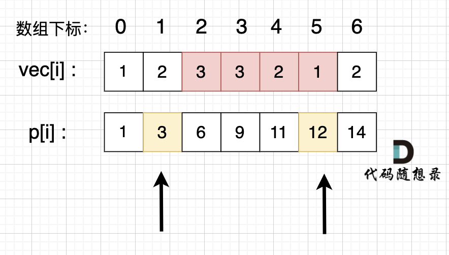

## 一维前缀和

### 题目描述

用于计算一维数组的区间和，将时间复杂度从$O(n * m) ,m 是查询的次数$简化到$O(n)$

### 算法思想

前缀和的思想是重复利用计算过的子数组之和，从而降低区间查询需要累加计算的次数。

例如，统计 vec[i] 这个数组上的区间和。

- 先做累加，即 p[i] 表示 下标 0 到 i 的 vec[i] 累加 之和。
- 统计vec数组上 下标 i 到下标 j 之间的累加和时使用 **p[j]-p[i-1]** 即可

```
p[i] = vec[0] + vec[1] + ... vec[i];
p[j] = vec[0] + vec[1] + vec[2] + vec[3] + vec[4] + vec[5] + ..vec[j];
p[j] - p[i] = vec[i+1] + vec[i+2] + vec[i+3] + ... +vec[j];
```



### 代码模板

```java
// 求解前缀和数组
int presum = 0;
for (int i = 0; i < n; i++) {
    presum += vec[i];
    p[i] = presum;
}
// 求解子区间和
int sum;
if (a == 0) {
     sum = p[b];
} else {
     sum = p[b] - p[a - 1];
 }
```


### 经典例题

#### 板子题

题目描述

[题目链接(opens new window)](https://kamacoder.com/problempage.php?pid=1070)

给定一个整数数组 Array，请计算该数组在每个指定区间内元素的总和。

输入描述

第一行输入为整数数组 Array 的长度 n，接下来 n 行，每行一个整数，表示数组的元素。随后的输入为需要计算总和的区间，直至文件结束。

输出描述

输出每个指定区间内元素的总和。

输入示例

```text
5
1
2
3
4
5
0 1
1 3
```


输出示例

```text
3
9
```


数据范围：

0 < n <= 100000


**参考代码**

```java
import java.util.Scanner;

public class Main {
    public static void main(String[] args) {
        Scanner scanner = new Scanner(System.in);

        int n = scanner.nextInt();
        int[] vec = new int[n];
        int[] p = new int[n];

        int presum = 0;
        for (int i = 0; i < n; i++) {
            vec[i] = scanner.nextInt();
            presum += vec[i];
            p[i] = presum;
        }

        while (scanner.hasNextInt()) {
            int a = scanner.nextInt();
            int b = scanner.nextInt();

            int sum;
            if (a == 0) {
                sum = p[b];
            } else {
                sum = p[b] - p[a - 1];
            }
            System.out.println(sum);
        }

        scanner.close();
    }
}
```

#### leetcode 560 和为K的子数组

**题目描述**

[题目链接](https://leetcode.cn/problems/subarray-sum-equals-k/description/)

给你一个整数数组 `nums` 和一个整数 `k` ，请你统计并返回 *该数组中和为 `k` 的子数组的个数* 。

子数组是数组中元素的连续非空序列。

**示例 1：**

```
输入：nums = [1,1,1], k = 2
输出：2
```

**示例 2：**

```
输入：nums = [1,2,3], k = 3
输出：2
```

**思路解析**

- 先构造出nums的前缀和数组
- 根据公式，从区间[i,j]的区间和为p[j]-p[i-1]=k
- 注意要先在map中放入（0，1），因为当j=0时只有1种可能
- 因此可以遍历前缀和数组，相当于求解p[j]-k在map中出现多少次

**参考代码**

```java
class Solution {
    public int subarraySum(int[] nums, int k) {
        HashMap<Integer,Integer>map=new HashMap<>();
        int[]preSum=new int[nums.length];
        int pre=0;
        int count=0;
        for(int i=0;i<nums.length;i++){
            pre+=nums[i];
            preSum[i]=pre;
        }
        map.put(0,1);
        // 区间[i,j]的区间和为preSum[j]-preSum[i-1]=k
        for(int j=0;j<nums.length;j++){
            int temp=preSum[j]-k;
            if(map.containsKey(temp)){
                count+=map.get(temp);
            }
            map.put(preSum[j],map.getOrDefault(preSum[j],0)+1);
        }
        return count;
    }
}
```

