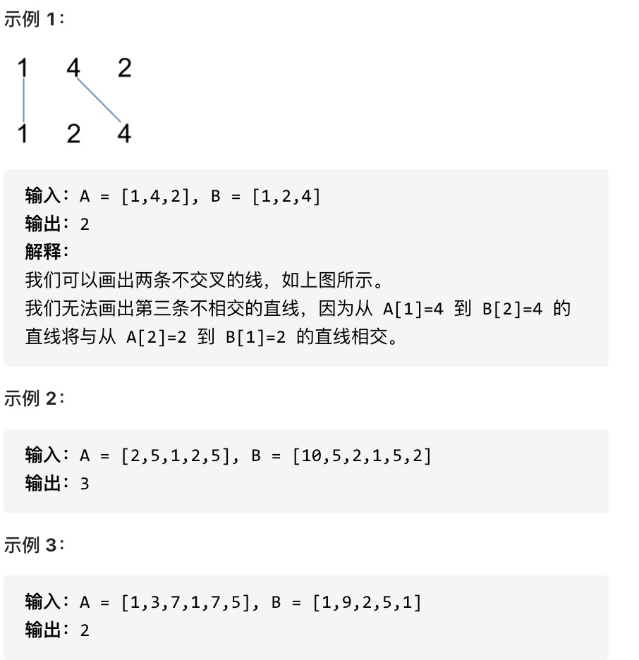
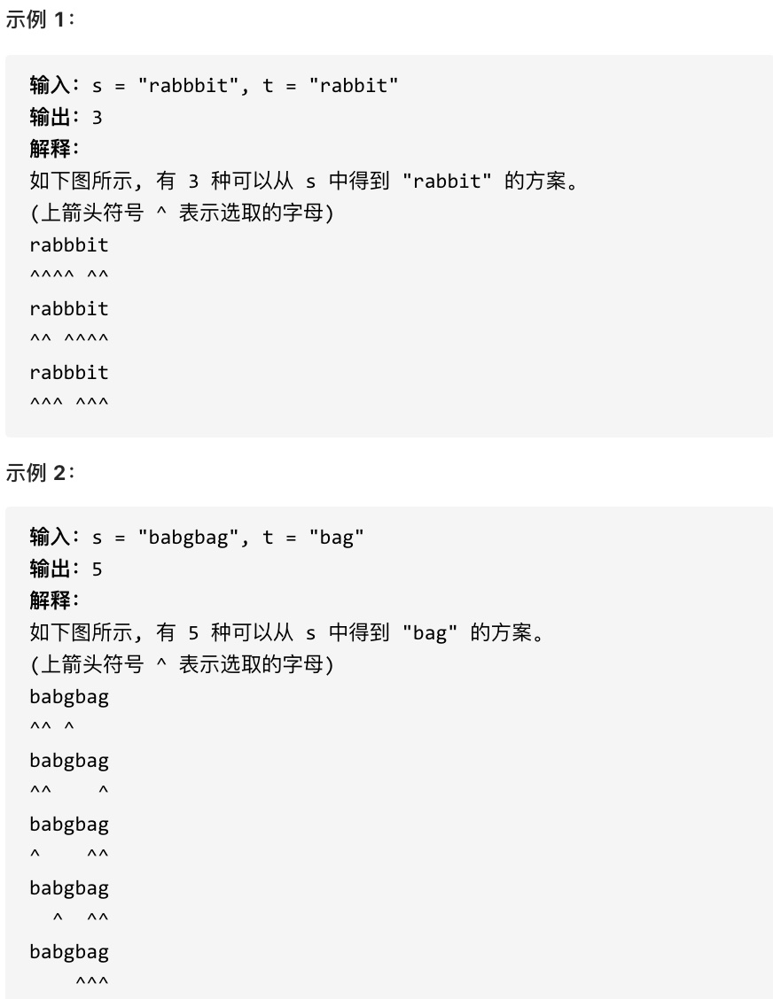

## 动态规划的思考步骤

### 思考过程

- 确定dp数组（dp table）以及下标的含义
- 确定递推公式
- dp数组如何初始化
- 确定遍历顺序
- 举例推导dp数组

### 基本代码模板

```java
class Solution {
    public int solover(int n) {
        if(n<=1)return n;
        // 确定dp的含义
        int[]dp=new int[n+1];
        // 对dp数字初始化
        dp[0]=0;
        dp[1]=1;
        // 遍历顺序，利用状态转移方程求解dp数组
        for(int i=2;i<=n;i++){
            dp[i]=dp[i-1]+dp[i-2];
        }
        return dp[n];

    }
}
```


## 一维动态规划

### leetcode 509 斐波那契数

#### 题目描述

[力扣题目链接(opens new window)](https://leetcode.cn/problems/fibonacci-number/)

斐波那契数，通常用 F(n) 表示，形成的序列称为 斐波那契数列 。该数列由 0 和 1 开始，后面的每一项数字都是前面两项数字的和。也就是： F(0) = 0，F(1) = 1 F(n) = F(n - 1) + F(n - 2)，其中 n > 1 给你n ，请计算 F(n) 。

示例 1：

- 输入：2
- 输出：1
- 解释：F(2) = F(1) + F(0) = 1 + 0 = 1

示例 2：

- 输入：3
- 输出：2
- 解释：F(3) = F(2) + F(1) = 1 + 1 = 2

示例 3：

- 输入：4
- 输出：3
- 解释：F(4) = F(3) + F(2) = 2 + 1 = 3

提示：

- 0 <= n <= 30

#### 思路解析

- 确定dp数组（dp table）以及下标的含义

  - dp[i]的定义为：第i个数的斐波那契数值是dp[i]

- 确定递推公式

  - 状态转移方程： dp[i] = dp[i - 1] + dp[i - 2];

- dp数组如何初始化

  - ```text
    dp[0] = 0;
    dp[1] = 1;
    ```

- 确定遍历顺序

  - dp[i]是依赖 dp[i - 1] 和 dp[i - 2]，遍历的顺序一定是从前到后遍历的

- 举例推导dp数组

#### 参考代码

```java
class Solution {
    public int fib(int n) {
        if(n<=1)return n;
        // dp[i]为F[i]
        int[]dp=new int[n+1];
        // 初始化
        dp[0]=0;
        dp[1]=1;
        for(int i=2;i<=n;i++){
            dp[i]=dp[i-1]+dp[i-2];
        }
        return dp[n];

    }
}
```

### leetcode 70 爬楼梯

#### 题目描述

[力扣题目链接(opens new window)](https://leetcode.cn/problems/climbing-stairs/)

假设你正在爬楼梯。需要 n 阶你才能到达楼顶。

每次你可以爬 1 或 2 个台阶。你有多少种不同的方法可以爬到楼顶呢？

注意：给定 n 是一个正整数。

示例 1：

- 输入： 2
- 输出： 2
- 解释： 有两种方法可以爬到楼顶。
  - 1 阶 + 1 阶
  - 2 阶

示例 2：

- 输入： 3
- 输出： 3
- 解释： 有三种方法可以爬到楼顶。
  - 1 阶 + 1 阶 + 1 阶
  - 1 阶 + 2 阶
  - 2 阶 + 1 阶

#### 思路解析

- 确定dp数组以及下标的含义

  - dp[i]： 爬到第i层楼梯，有dp[i]种方法

- 确定递推公式

  - 第一种情况：dp[i - 1]，上i-1层楼梯，有dp[i - 1]种方法，那么再一步跳一个台阶。
  - 第二种情况：dp[i - 2]，上i-2层楼梯，有dp[i - 2]种方法，那么再一步跳两个台阶。
  - 所以dp[i] = dp[i - 1] + dp[i - 2] 。

- dp数组如何初始化

  - ```java
    dp[0]=1;
    dp[1]=1;
    ```

- 确定遍历顺序：遍历顺序一定是从前向后遍历的

#### 参考代码

```java
class Solution {
    public int climbStairs(int n) {
        // dp[i]为到达第i阶台阶的方式，第n阶为楼顶
        int[]dp=new int[n+1];
        // 初始化
        dp[0]=1;
        dp[1]=1;
        // 状态转移方程:dp[i]=dp[i-1]+dp[i-2]
        for(int i=2;i<=n;i++){
            dp[i]=dp[i-1]+dp[i-2];
        }
        return dp[n];
    }
}
```

### leetcode 746 使用最小花费爬楼梯

#### 题目描述

[力扣题目链接](https://leetcode.cn/problems/min-cost-climbing-stairs/)

给你一个整数数组 cost ，其中 cost[i] 是从楼梯第 i 个台阶向上爬需要支付的费用。一旦你支付此费用，即可选择向上爬一个或者两个台阶。

你可以选择从下标为 0 或下标为 1 的台阶开始爬楼梯。

请你计算并返回达到楼梯顶部的最低花费。


#### 思路解析

- 确定dp数组以及下标的含义
  - dp[i]的定义：到达第i台阶所花费的最少体力为dp[i]。
- 确定递推公式
  - 第一种情况：dp[i - 1] 跳到 dp[i] 需要花费 dp[i - 1] + cost[i - 1]。
  - 第二种情况：dp[i - 2] 跳到 dp[i] 需要花费 dp[i - 2] + cost[i - 2]。
  - 所以dp[i] = min(dp[i - 1] + cost[i - 1], dp[i - 2] + cost[i - 2]);
- dp数组如何初始化
  - 题目描述中明确说明“你可以选择从下标为 0 或下标为 1 的台阶开始爬楼梯。” 也就是说 到达 第 0 个台阶是不花费的，但从 第0 个台阶 往上跳的话，需要花费 cost[0]。所以初始化 dp[0] = 0，dp[1] = 0;
- 确定遍历顺序
  - dp[i]由dp[i-1]dp[i-2]推出，所以是从前到后遍历cost数组即可

#### 参考代码

```java
class Solution {
    public int minCostClimbingStairs(int[] cost) {
        int n=cost.length;
        // dp[i]为到达第i阶台阶的最小花费，第n阶为楼顶
        int[]dp=new int[n+1];
        // 初始化
        dp[0]=0;
        dp[1]=0;
        // 状态转移方程推导
        // 从第i-1阶爬1个台阶:dp[i-1]+cost[i-1]
        // 从第i-2阶爬2个台阶:dp[i-2]+cost[i-2]
        for(int i=2;i<=n;i++){
            dp[i]=Math.min(dp[i-1]+cost[i-1],dp[i-2]+cost[i-2]);
        }
        return dp[n];
    }
}
```

### leetcode 343 整数拆分

#### 题目描述

[力扣题目链接(opens new window)](https://leetcode.cn/problems/integer-break/)

给定一个正整数 n，将其拆分为至少两个正整数的和，并使这些整数的乘积最大化。 返回你可以获得的最大乘积。

示例 1:

- 输入: 2
- 输出: 1
- 解释: 2 = 1 + 1, 1 × 1 = 1。

示例 2:

- 输入: 10
- 输出: 36
- 解释: 10 = 3 + 3 + 4, 3 × 3 × 4 = 36。
- 说明: 你可以假设 n 不小于 2 且不大于 58。

#### 思路解析

- 确定dp数组（dp table）以及下标的含义

  - dp[i]：分拆数字i，可以得到的最大乘积为dp[i]。

- 确定递推公式

  - 第一种情况：j * (i - j) 直接相乘。单纯的把整数拆分为两个数相乘
  - 第二种情况：j * dp[i - j]，相当于是拆分(i - j)，拆分成两个以及两个以上的个数相乘

  - 递推公式：**`dp[i] = max({dp[i], (i - j) * j, dp[i - j] * j})`**

- dp的初始化

  - 初始化dp[2] = 1=

- 确定遍历顺序

  - 确定遍历顺序，递归公式：**`dp[i] = max(dp[i], max((i - j) * j, dp[i - j] * j));`**
  - i从3开始遍历到n
  - j从1开始遍历到i-1

#### 参考代码

```java
class Solution {
    public int integerBreak(int n) {
        // 分拆数字i可以得到的最大乘积
        int[]dp=new int[n+1];
        // 初始化
        dp[2]=1;
        // 遍历过程
        // 被拆成i*(i-j)
        // 被拆成dp[i-j]*j
        for(int i=3;i<=n;i++){
            for(int j=1;j<i;j++){
                dp[i]=Math.max(dp[i],Math.max((i-j)*j,dp[i-j]*j));
            }
        }
        return dp[n];
    }
}
```

### leetcode 96 不同的二叉搜索树

#### 题目描述

[力扣题目链接(opens new window)](https://leetcode.cn/problems/unique-binary-search-trees/)

给定一个整数 n，求以 1 ... n 为节点组成的二叉搜索树有多少种？

示例:


#### 思路解析

- 确定dp数组（dp table）以及下标的含义
  - **dp[i] ： i个不同元素节点组成的二叉搜索树的个数**。
- 确定递推公式
  - dp[i] += dp[以j为头结点左子树节点数量] * dp[以j为头结点右子树节点数量]
  - j表示选取的根节点结点的元素，从1遍历到i为止。
    - 左子树：[1,j-1]
    - 右子树：[j+1,i];
  - 所以递推公式：**`dp[i] += dp[j - 1] * dp[i - j]`** ; ，j-1 为j为头结点左子树节点数量，i-j 为以j为头结点右子树节点数量

- dp数组初始化
  - 初始化dp[0]=1
- 确定遍历顺序
  - 首先遍历节点数，从递归公式：dp[i] += dp[j - 1] * dp[i - j]可以看出，节点数为i的状态是依靠 i之前节点数的状态。
  - 那么遍历i里面每一个数作为头结点的状态，用j来遍历。

#### 参考代码

```java
class Solution {
    public int numTrees(int n) {
        // dp[i]代表i个节点的不同二叉树数量
        int[]dp=new int[n+1];
        // 初始化
        dp[0]=1;
        // i表示考虑i个节点的情况
        for(int i=1;i<=n;i++){
            // j表示选取的根节点编号
            for(int j=1;j<=i;j++){
                dp[i]+=dp[j-1]*dp[i-j];
            }
        }
        return dp[n];
    }
}
```


## 二维动态规划

### leetcode 62 不同路径

#### 题目描述

[力扣题目链接(opens new window)](https://leetcode.cn/problems/unique-paths/)

一个机器人位于一个 m x n 网格的左上角 （起始点在下图中标记为 “Start” ）。

机器人每次只能向下或者向右移动一步。机器人试图达到网格的右下角（在下图中标记为 “Finish” ）。

问总共有多少条不同的路径？

示例 1：


- 输入：m = 3, n = 7
- 输出：28

示例 2：

- 输入：m = 2, n = 3
- 输出：3

解释： 从左上角开始，总共有 3 条路径可以到达右下角。

1. 向右 -> 向右 -> 向下
2. 向右 -> 向下 -> 向右
3. 向下 -> 向右 -> 向右

示例 3：

- 输入：m = 7, n = 3
- 输出：28

示例 4：

- 输入：m = 3, n = 3
- 输出：6

提示：

- 1 <= m, n <= 100
- 题目数据保证答案小于等于 2 * 10^9

#### 思路解析

- 确定dp数组（dp table）以及下标的含义
  - **`dp[i][j]`** ：表示从（0 ，0）出发，到(i, j) 有 **`dp[i][j]`** 条不同的路径。
- 确定递推公式
  -  **`dp[i - 1][j]`** 表示是从(0, 0)的位置到(i - 1, j)有几条路径， **`dp[i][j - 1]`** 同理。
  - **`dp[i][j] = dp[i - 1][j] + dp[i][j - 1]`** 
- dp数组的初始化
  - 首先 **`dp[i][0]`** 一定都是1，因为从(0, 0)的位置到(i, 0)的路径只有一条（竖直向下走），那么 **`dp[0][j]`** 也同理（水平向右走。
- 确定遍历顺序
  - 看一下递推公式 **`dp[i][j] = dp[i - 1][j] + dp[i][j - 1]`** ，**`dp[i][j]`** 都是从其上方和左方推导而来，那么从左到右一层一层遍历就可以了。

#### 参考代码

```java
class Solution {
    public int uniquePaths(int m, int n) {
        int[][]dp=new int[m][n];
        // 初始化
        // [0,0]到[m,0]的路径只有一条，竖直向下走
        for(int i=0;i<m;i++){
            dp[i][0]=1;
        }
        // [0,0]到[0,n]的路径只有一条，向右走
        for(int i=0;i<n;i++){
            dp[0][i]=1;
        }
        // 转移方程 dp[i[[j]=dp[i-1][j]+dp[i][j-1]
        for(int i=1;i<m;i++){
            for(int j=1;j<n;j++){
                dp[i][j]=dp[i-1][j]+dp[i][j-1];
            }
        }
        return dp[m-1][n-1];
    }
}
```

### leetcode 63 不同路径II

#### 题目描述

[力扣题目链接(opens new window)](https://leetcode.cn/problems/unique-paths-ii/)

一个机器人位于一个 m x n 网格的左上角 （起始点在下图中标记为“Start” ）。

机器人每次只能向下或者向右移动一步。机器人试图达到网格的右下角（在下图中标记为“Finish”）。

现在考虑网格中有障碍物。那么从左上角到右下角将会有多少条不同的路径？


网格中的障碍物和空位置分别用 1 和 0 来表示。

示例 1：


- 输入：obstacleGrid = [[0,0,0],[0,1,0],[0,0,0]]
- 输出：2 解释：
- 3x3 网格的正中间有一个障碍物。
- 从左上角到右下角一共有 2 条不同的路径：
  1. 向右 -> 向右 -> 向下 -> 向下
  2. 向下 -> 向下 -> 向右 -> 向右

示例 2：


- 输入：obstacleGrid = [[0,1],[0,0]]
- 输出：1

提示：

- m == obstacleGrid.length
- n == obstacleGrid[i].length
- 1 <= m, n <= 100
- obstacleGrid[i][j] 为 0 或 1

#### 思路解析

与上一题的大体思路相同，只是在初始化和遍历过程略有不同。

- 初始化时将遇到障碍物之前的dp数字置为1
- 遍历过程中遇到障碍物跳过该dp数组

#### 参考代码

```java
import java.util.Arrays;

//leetcode submit region begin(Prohibit modification and deletion)
class Solution {
    public int uniquePathsWithObstacles(int[][] obstacleGrid) {
        // m行n列
        int m=obstacleGrid.length;
        int n=obstacleGrid[0].length;
        if (obstacleGrid[m - 1][n - 1] == 1 || obstacleGrid[0][0] == 1) {
            return 0;
        }
        int[][]dp=new int[m][n];
        // 初始化
        // 从[0,0]到[i,0]只有一条，遇到障碍物停止
        for(int i=0;i<m&&obstacleGrid[i][0]==0;i++){
            dp[i][0]=1;
        }
        // 从[0,0]到[0,i]只有一条，遇到障碍物停止
        for(int i=0;i<n&&obstacleGrid[0][i]==0;i++){
            dp[0][i]=1;
        }
        //遍历过程
        for(int i=1;i<m;i++){
            for(int j=1;j<n;j++){
                if(obstacleGrid[i][j]==1)
                    continue;
                else
                    dp[i][j]=dp[i-1][j]+dp[i][j-1];
            }
        }
        return dp[m-1][n-1];
    }
}
```

## 0-1背包问题

### 题目描述

有n件物品和一个最多能背重量为w 的背包。第i件物品的重量是weight[i]，得到的价值是value[i] 。**每件物品只能用一次**，求解将哪些物品装入背包里物品价值总和最大。

### 思路解析

#### 二维dp解法

- 确定dp数组以及下标的含义
  - 有两个维度需要分别表示：物品 和 背包容量
  - **`dp[i][j] 表示从下标为[0-i]的物品里任意取，放进容量为j的背包，价值总和最大`**
- 确定递推公式
  - 第一种情况：不放物体则 **`dp[i][j]=dp[i-1][j]`**
  - 第二种情况：放入物体则 **`dp[i][j]=dp[i-1][j-weight[i]]+value[i]`**
  - 取上面的较大值
- dp数组的初始化
  - i=0时
    -  `j < weight[0]`的时候，**`dp[0][j]`** 是 0，因为背包容量比编号0的物品重量还小。
    - 当`j >= weight[0]`时，**`dp[0][j]`** 是value[0]
  - j=0时
    - 背包容量为0，**`dp[i][0]=0`**
- 确定遍历顺序
  - 先遍历物品再遍历容量，注意判断当背包容量小于物品容量时不放入物品

**代码模板**

```java
import java.util.*;
public class Main{
    public static void main (String[] args) {
        Scanner sc=new Scanner(System.in);
        int M=sc.nextInt();
        int N=sc.nextInt();
        int[]weight=new int[M];
        int[]value=new int[M];
        for(int i=0;i<M;i++){
            weight[i]=sc.nextInt();
        }
        for(int i=0;i<M;i++){
            value[i]=sc.nextInt();
        }
        // dp[i][j]表示放入[0-i]的物品，背包容量为j的最大价值
        int[][]dp=new int[M][N+1];
        // 初始化
        // 背包空间为0，价值为0
        for(int i=0;i<M;i++){
            dp[i][0]=0;
        }
        // 被背包容量大于weight[0]价值为value[0]
        for(int i=weight[0];i<=N;i++){
            dp[0][i]=value[0];
        }
        for(int i=1;i<M;i++){
            for(int j=1;j<=N;j++){
                if(j<weight[i]){
                    dp[i][j]=dp[i-1][j];
                }else{
                    dp[i][j]=Math.max(dp[i-1][j],dp[i-1][j-weight[i]]+value[i]);
                }
            }
        }
        System.out.println(dp[M-1][N]);
         
    }
}
```

#### 一维dp解法

在使用二维数组的时候，递推公式：**`dp[i][j] = max(dp[i - 1][j], dp[i - 1][j - weight[i]] + value[i]);`**

其实可以发现如果把dp[i - 1]那一层复制到dp[i]上，表达式完全可以是：**`dp[i][j] = max(dp[i][j], dp[i][j - weight[i]] + value[i])`**

因此可以推出

**`dp[j] = max(dp[j], dp[j - weight[i]] + value[i])`**

- 确定dp数组的定义
  - dp[j]表示：容量为j的背包，所背的物品价值可以最大为dp[j]。
- 递推公式
  - 递推公式为：**`dp[j] = max(dp[j], dp[j - weight[i]] + value[i])`**
- 初始化
  - 全部初始化为0即可
- 遍历顺序
  - 顺序遍历物品，同时逆序遍历容量
  - **倒序遍历是为了保证物品i只被放入一次** ，从后往前循环，每次取得状态不会和之前取得状态重合，这样每种物品就只取一次了

代码模板

```java
import java.util.*;
public class Main{
    public static void main (String[] args) {
        Scanner sc=new Scanner(System.in);
        int M=sc.nextInt();
        int N=sc.nextInt();
        int[]weight=new int[M];
        int[]value=new int[M];
        for(int i=0;i<M;i++){
            weight[i]=sc.nextInt();
        }
        for(int i=0;i<M;i++){
            value[i]=sc.nextInt();
        }
        // dp[j]背包容量为j的最大价值
        int[]dp=new int[N+1];
        for(int i=0;i<M;i++){
            for (int j = N; j >= weight[i]; j--) {
                dp[j] = Math.max(dp[j], dp[j - weight[i]] + value[i]);
            }
        }
        System.out.println(dp[N]);
    }
}
```

### 经典例题

板子题：https://kamacoder.com/problempage.php?pid=1046

#### leetcode 416 分割等和子集

**题目描述**

[力扣题目链接(opens new window)](https://leetcode.cn/problems/partition-equal-subset-sum/)

题目难易：中等

给定一个只包含正整数的非空数组。是否可以将这个数组分割成两个子集，使得两个子集的元素和相等。

注意: 每个数组中的元素不会超过 100 数组的大小不会超过 200

示例 1:

- 输入: [1, 5, 11, 5]
- 输出: true
- 解释: 数组可以分割成 [1, 5, 5] 和 [11].

示例 2:

- 输入: [1, 2, 3, 5]
- 输出: false
- 解释: 数组不能分割成两个元素和相等的子集.

提示：

- 1 <= nums.length <= 200
- 1 <= nums[i] <= 100

**思路解析**

本题可以将其视为一个0-1背包问题。nums中的数字为重量和价值的物品

既有一个 只能装重量为 sum / 2 的背包，商品为数字，这些数字能不能把 这个背包装满。

即为求解装满 承载重量为 sum / 2 的背包，价值最大是多少？如果最大价值是 sum / 2，说明正好被商品装满了。

- 确定dp数组以及下标的含义
  - 如果背包所载重量为target， dp[target]就是装满 背包之后的总价值，因为 本题中每一个元素的数值既是重量，也是价值，所以，当 dp[target] == target 的时候，背包就装满了。
- 确定递推公式
  - 本题相当于背包里放入数值，那么物品i的重量是nums[i]，其价值也是nums[i]。所以递推公式：**`dp[j] = max(dp[j], dp[j - nums[i]] + nums[i]);`**
- dp数组如何初始化
  - dp[0]=0
- 遍历顺序与0-1背包相同

注意当sum是一个奇数是不存在该种方式的

**参考代码**

```java
class Solution {
    public boolean canPartition(int[] nums) {
        int sum=0;
        for(int i=0;i<nums.length;i++){
            sum+=nums[i];
        }
        if(sum%2!=0){
            return false;
        }
        int target=sum/2;
        int[]dp=new int[target+1];
        for(int i=0;i<nums.length;i++){
            for(int j=target;j>=nums[i];j--){
                dp[j]=Math.max(dp[j],dp[j-nums[i]]+nums[i]);
            }
            if(dp[target]==target){
                return true;
            }
        }
        return dp[target]==target;
    }
}
```

#### leetcode 494 目标和

**题目描述**

[力扣题目链接(opens new window)](https://leetcode.cn/problems/target-sum/)

难度：中等

给定一个非负整数数组，a1, a2, ..., an, 和一个目标数，S。现在你有两个符号 + 和 -。对于数组中的任意一个整数，你都可以从 + 或 -中选择一个符号添加在前面。

返回可以使最终数组和为目标数 S 的所有添加符号的方法数。

示例：

- 输入：nums: [1, 1, 1, 1, 1], S: 3
- 输出：5

解释：

- -1+1+1+1+1 = 3
- +1-1+1+1+1 = 3
- +1+1-1+1+1 = 3
- +1+1+1-1+1 = 3
- +1+1+1+1-1 = 3

一共有5种方法让最终目标和为3。

提示：

- 数组非空，且长度不会超过 20 。
- 初始的数组的和不会超过 1000 。
- 保证返回的最终结果能被 32 位整数存下。

**思路解析**

本题依然可以转换为0-1背包问题，设加法部分为left，减法部分为right
$$
		left+right=sum,
        left-right=target \to
        left=(sum+target)/2
$$
**此时问题就转化为，用nums装满容量为left的背包有多少种方法**

- 确定dp数组以及下标的含义
  - dp[i]：使用容量为i的包装满，有dp[j]种方法。
- 确定递推公式
  - **不放物品i**：即背包容量为j，里面不放物品i，装满有dp[j]中方法。
  - **放物品i**： 即：先空出物品i的容量，背包容量为（j - 物品i容量），放满背包有 dp[[j - 物品i容量] 种方法。
  - 递推公式：dp[j] = dp[j] + dp[j - nums[i]]
- 遍历顺序：同0-1背包

**参考代码**

```java
class Solution {
    public int findTargetSumWays(int[] nums, int target) {
        int sum=0;
        for(int i=0;i<nums.length;i++){
            sum+=nums[i];
        }
        // left+right=sum
        // left-right=target
        // left=(sum+target)/2
        if (Math.abs(target) > sum) return 0;
        if ((target + sum) % 2 == 1) return 0;
        int bagSize=(sum+target)/2;
        int[]dp=new int[bagSize+1];
        dp[0]=1;
        for(int i=0;i<nums.length;i++){
            for(int j=bagSize;j>=nums[i];j--){
                dp[j]+=dp[j-nums[i]];
            }
        }
        return dp[bagSize];
    }
}
```

#### leetcode 474 一和零

**题目描述**

[力扣题目链接(opens new window)](https://leetcode.cn/problems/ones-and-zeroes/)

给你一个二进制字符串数组 strs 和两个整数 m 和 n 。

请你找出并返回 strs 的最大子集的大小，该子集中 最多 有 m 个 0 和 n 个 1 。

如果 x 的所有元素也是 y 的元素，集合 x 是集合 y 的 子集 。

示例 1：

- 输入：strs = ["10", "0001", "111001", "1", "0"], m = 5, n = 3
- 输出：4
- 解释：最多有 5 个 0 和 3 个 1 的最大子集是 {"10","0001","1","0"} ，因此答案是 4 。 其他满足题意但较小的子集包括 {"0001","1"} 和 {"10","1","0"} 。{"111001"} 不满足题意，因为它含 4 个 1 ，大于 n 的值 3 。

示例 2：

- 输入：strs = ["10", "0", "1"], m = 1, n = 1
- 输出：2
- 解释：最大的子集是 {"0", "1"} ，所以答案是 2 。

提示：

- 1 <= strs.length <= 600
- 1 <= strs[i].length <= 100
- strs[i] 仅由 '0' 和 '1' 组成
- 1 <= m, n <= 100

**思路解析**

本题其实也是一个01背包问题。**本题中strs 数组里的元素就是物品，每个物品都是一个！**

**而m 和 n相当于是一个背包，两个维度的背包**。而重量也是两个维度（0的个数和1的个数）

- 确定dp数组（dp table）以及下标的含义
  - **`dp[i][j]：最多有i个0和j个1的strs的最大子集的大小为dp[i][j]`**。
- 确定递推公式
  - **`dp[i][j]`** 可以由前一个strs里的字符串推导出来，strs里的字符串有zeroNum个0，oneNum个1。
  - 然后我们在遍历的过程中，取dp[i][j]的最大值。
  - 递推公式：**`dp[i][j] = max(dp[i][j], dp[i - zeroNum][j - oneNum] + 1);`**
- 遍历顺序：倒序遍历m和n，类似0-1背包

**参考代码**

```java
class Solution {
    public int findMaxForm(String[] strs, int m, int n) {
        // 最多有i个0和j个1的strs的最大子集的大小为dp[i][j]
        int[][]dp=new int[m+1][n+1];
        int oneNum;
        int zeroNum;
        for(String str:strs){
            oneNum=0;
            zeroNum=0;
            for(char ch:str.toCharArray()){
                if(ch=='0'){
                    zeroNum++;
                }else{
                    oneNum++;
                }
            }
            for(int i=m;i>=zeroNum;i--){
                for(int j=n;j>=oneNum;j--){
                    dp[i][j]=Math.max(dp[i][j],dp[i-zeroNum][j-oneNum]+1);
                }
            }
        }
        return dp[m][n];
    }
}
```

## 完全背包问题

### 题目描述

有n件物品和一个最多能背重量为w 的背包。第i件物品的重量是weight[i]，得到的价值是value[i] 。**每件物品可以使用无数次**，求解将哪些物品装入背包里物品价值总和最大。

### 思路解析

#### 二维dp解法

- 确定dp数组以及下标的含义
  - 有两个维度需要分别表示：物品 和 背包容量
  - **`dp[i][j] 表示从下标为[0-i]的物品里任意取，放进容量为j的背包，价值总和最大`**
- 确定递推公式
  - 第一种情况：不放物体则 **`dp[i][j]=dp[i-1][j]`**
  - 第二种情况：放入物体则 **`dp[i][j]=dp[i][j-weight[i]]+value[i]`**
  - 取上面的较大值
- dp数组的初始化
  - i=0时
    -  **`j < weight[0]`** 的时候，**`dp[0][j]`** 是 0，因为背包容量比编号0的物品重量还小。
    -  当 **`j >= weight[0]`** 时，**`dp[0][j]`** 可以一直装物品0，**`dp[0][j] = dp[0][j - weight[0]] + value[0]`**
  - j=0时
    - 背包容量为0，**`dp[i][0]=0`**
- 确定遍历顺序
  - 先遍历物品再遍历容量，注意判断当背包容量小于物品容量时不放入物品
  - 求解组合数的时候，先遍历物品还是先遍历背包容量不重要
  - 求解排列数的时候，必须先遍历背包再遍历物品

```java
import java.util.*;
public class Main{
    public static void main (String[] args) {
        Scanner sc=new Scanner(System.in);
        int n=sc.nextInt();
        int v=sc.nextInt();
        int[] weight=new int[n];
        int[] value=new int[n];
        for(int i=0;i<n;i++){
            weight[i]=sc.nextInt();
            value[i]=sc.nextInt();
        }
        int[][]dp=new int[n][v+1];
        // i=0,初始化
        for(int i=weight[0];i<=v;i++){
            dp[0][i]=dp[0][i-weight[0]]+value[0];
        }
        for(int i=1;i<n;i++){
            for(int j=1;j<=v;j++){
                if(j<weight[i]){
                    dp[i][j]=dp[i-1][j];
                }else{
                    dp[i][j]=Math.max(dp[i-1][j],dp[i][j-weight[i]]+value[i]);
                }
            }
        }
        System.out.println(dp[n-1][v]); 
    }
}
```

#### 一维dp解法

同理0-1背包问题的一维DP解法，递推公式可以转换为 **`dp[j] = max(dp[j], dp[j - weight[i]] + value[i])`**

- 确定dp数组的定义
  - dp[j]表示：容量为j的背包，所背的物品价值可以最大为dp[j]。
- 递推公式
  - 递推公式为：**`dp[j] = max(dp[j], dp[j - weight[i]] + value[i])`**
- 初始化
  - 全部初始化为0即可
- 遍历顺序
  - 顺序遍历物品，同时顺序遍历容量

```java
import java.util.*;
public class Main{
    public static void main (String[] args) {
        Scanner sc=new Scanner(System.in);
        int n=sc.nextInt();
        int v=sc.nextInt();
        int[] weight=new int[n];
        int[] value=new int[n];
        for(int i=0;i<n;i++){
            weight[i]=sc.nextInt();
            value[i]=sc.nextInt();
        }
        int[]dp=new int[v+1];
        for(int i=0;i<n;i++){
            for(int j=0;j<=v;j++){
                if(j<weight[i]){
                    dp[j]=dp[j];
                }else{
                    dp[j]=Math.max(dp[j],dp[j-weight[i]]+value[i]);
                }
            }
        }
        System.out.println(dp[v]); 
    }
}
```

### 经典例题

#### leetcode 518 零钱兑换II

**题目描述**

[力扣题目链接(opens new window)](https://leetcode.cn/problems/coin-change-ii/)

给定不同面额的硬币和一个总金额。写出函数来计算可以凑成总金额的硬币组合数。假设每一种面额的硬币有无限个。

示例 1:

- 输入: amount = 5, coins = [1, 2, 5]
- 输出: 4

解释: 有四种方式可以凑成总金额:

- 5=5
- 5=2+2+1
- 5=2+1+1+1
- 5=1+1+1+1+1

示例 2:

- 输入: amount = 3, coins = [2]
- 输出: 0
- 解释: 只用面额2的硬币不能凑成总金额3。

示例 3:

- 输入: amount = 10, coins = [10]
- 输出: 1

注意，你可以假设：

- 0 <= amount (总金额) <= 5000
- 1 <= coin (硬币面额) <= 5000
- 硬币种类不超过 500 种
- 结果符合 32 位符号整数

**思路解析**

本题实际上可以转换为完全背包问题。将总金额视为背包的容量，硬币作为重量和价值相同的物品

- 确定dp数组的含义
  - dp[j]：凑成总金额j的货币组合数为dp[j]
- 确定递推公式
  - 不放硬币：**`dp[j]`**
  - 放入硬币：**`dp[j-coins[i]]`**
  - **`dp[j] =dp[j] + dp[j - coins[i]]`**
- 初始化
  - 装满背包容量为0 的方法是1，即不放任何物品，`dp[0] = 1`
- 遍历顺序
  - 本题要求解的是组合数，应当先遍历物品再遍历背包容量

**参考代码**

```java
class Solution {
    public int change(int amount, int[] coins) {
        int n=coins.length;
        int[]dp=new int[amount+1];
        // 初始化
        dp[0]=1;
        // 求组合数先遍历物品再遍历背包容量
        for(int i=0;i<n;i++){
            for(int j=0;j<=amount;j++){
                // 背包比硬币小，只能不放入硬币
                if(j<coins[i]){
                    dp[j]=dp[j];
                }else{
                    dp[j]=dp[j]+dp[j-coins[i]];
                }
            }
        }
        return dp[amount];
    }
}
```

#### leetcode 377 组合总和IV

**题目描述**

[力扣题目链接(opens new window)](https://leetcode.cn/problems/combination-sum-iv/)

难度：中等

给定一个由正整数组成且不存在重复数字的数组，找出和为给定目标正整数的组合的个数。

示例:

- nums = [1, 2, 3]
- target = 4

所有可能的组合为： (1, 1, 1, 1) (1, 1, 2) (1, 2, 1) (1, 3) (2, 1, 1) (2, 2) (3, 1)

请注意，顺序不同的序列被视作不同的组合。

因此输出为 7。

**思路解析**

本题依然是完全背包问题，将目标正整数视为背包容量，数组中的元素视为重量和价值相同的物品

- 确定dp数组以及下标的含义
  - **dp[i]: 凑成目标正整数为i的排列个数为dp[i]**

- 确定递推公式
  - dp[i]有两种可能
    - 加入nums[j]即由 dp[i - nums[j]]推导
    - 不加入nums[j]即由dp[i] 推导出来。
- dp数组如何初始化
  - 递推公式dp[i] += dp[i - nums[j]]，dp[0]要初始化为1，这样递归其他dp[i]的时候才会有数值基础。
- 确定遍历顺序
  - 本题要求的是排列，要求先遍历背包容量再遍历物品

**参考代码**

```java
class Solution {
    public int combinationSum4(int[] nums, int target) {
        int n=nums.length;
        // p[i]: 凑成目标正整数为i的排列个数为dp[i]
        int[]dp=new int[target+1];
        dp[0]=1;
        // 求排列数先遍历背包容量再遍历物品
        for(int i=0;i<=target;i++){
            for(int j=0;j<n;j++){
                if(i<nums[j]){
                    dp[i]=dp[i];
                }else{
                    dp[i]=dp[i]+dp[i-nums[j]];
                }
            }
        }
        return dp[target];
    }
}
```

#### leetcode 322 零钱兑换

**题目描述**

[力扣题目链接(opens new window)](https://leetcode.cn/problems/coin-change/)

给定不同面额的硬币 coins 和一个总金额 amount。编写一个函数来计算可以凑成总金额所需的最少的硬币个数。如果没有任何一种硬币组合能组成总金额，返回 -1。

你可以认为每种硬币的数量是无限的。

示例 1：

- 输入：coins = [1, 2, 5], amount = 11
- 输出：3
- 解释：11 = 5 + 5 + 1

示例 2：

- 输入：coins = [2], amount = 3
- 输出：-1

示例 3：

- 输入：coins = [1], amount = 0
- 输出：0

示例 4：

- 输入：coins = [1], amount = 1
- 输出：1

示例 5：

- 输入：coins = [1], amount = 2
- 输出：2

提示：

- 1 <= coins.length <= 12
- 1 <= coins[i] <= 2^31 - 1
- 0 <= amount <= 10^4

**思路解析**

- 确定dp数组以及下标的含义
  - **dp[j]：凑足总额为j所需钱币的最少个数为dp[j]**

- 确定递推公式
  - 凑足总额为j - coins[i]的最少个数为dp[j - coins[i]]，那么只需要加上一个钱币coins[i] 即dp[j - coins[i]] + 1就是dp[j]（考虑coins[i]）
  - 递推公式：dp[j] = min(dp[j - coins[i]] + 1, dp[j]);

- dp数组初始化
  - 凑足总金额为0所需钱币的个数一定是0，那么dp[0] = 0;
  - 其他下标对应的数值，考虑到递推公式的特性，dp[j]必须初始化为一个最大的数，否则就会在min(dp[j - coins[i]] + 1, dp[j])比较的过程中被初始值覆盖。
- 遍历过程
  - 本题是求解是组合数（硬币的顺序不重要）

**参考代码**

```java
class Solution {
    public int coinChange(int[] coins, int amount) {
        int n=coins.length;
        // 凑足总额为j所需钱币的最少个数为dp[j]
        int[]dp=new int[amount+1];
        // 初始化DP数值
        Arrays.fill(dp,Integer.MAX_VALUE);
        dp[0]=0;
        for(int i=0;i<n;i++){
            for(int j=0;j<=amount;j++){
                if(j<coins[i]){
                    dp[j]=dp[j];
                }else if(dp[j-coins[i]]!=Integer.MAX_VALUE){
                    dp[j]=Math.min(dp[j],dp[j-coins[i]]+1);
                }
            }
        }
        return dp[amount]==Integer.MAX_VALUE?-1:dp[amount];
    }
}
```

#### leetcode 279 完全平方数

**题目描述**

[力扣题目链接(opens new window)](https://leetcode.cn/problems/perfect-squares/)

给定正整数 n，找到若干个完全平方数（比如 1, 4, 9, 16, ...）使得它们的和等于 n。你需要让组成和的完全平方数的个数最少。

给你一个整数 n ，返回和为 n 的完全平方数的 最少数量 。

完全平方数 是一个整数，其值等于另一个整数的平方；换句话说，其值等于一个整数自乘的积。例如，1、4、9 和 16 都是完全平方数，而 3 和 11 不是。

示例 1：

- 输入：n = 12
- 输出：3
- 解释：12 = 4 + 4 + 4

示例 2：

- 输入：n = 13
- 输出：2
- 解释：13 = 4 + 9

提示：

- 1 <= n <= 10^4

**思路解析**

**完全平方数就是物品（可以无限件使用），凑个正整数n就是背包，问凑满这个背包最少有多少物品？**

- 确定dp数组（dp table）以及下标的含义
  - **dp[j]：和为j的完全平方数的最少数量为dp[j]**
- 确定递推公式
  - dp[j] 可以由dp[j - i * i]推出， dp[j - i * i] + 1 便可以凑成dp[j]。
  - dp[j] = min(dp[j - i * i] + 1, dp[j]);
- dp数组如何初始化
  - dp[0]表示 和为0的完全平方数的最小数量，那么dp[0]一定是0。
  - 非0下标的dp[j]应该是很大的值，从递归公式dp[j] = min(dp[j - i * i] + 1, dp[j]);中可以看出每次dp[j]都要选最小的，**所以非0下标的dp[j]一定要初始为最大值，这样dp[j]在递推的时候才不会被初始值覆盖**。

- 确定遍历顺序
  - 本题求解的是组合数就是外层for循环遍历物品，内层for遍历背包。

**参考代码**

```java
class Solution {
    public int numSquares(int n) {
        int[]dp=new int[n+1];
        Arrays.fill(dp,Integer.MAX_VALUE);
        dp[0]=0;
        for(int i=1;i*i<=n;i++){
            for(int j=1;j<=n;j++){
                if(j<i*i){
                    dp[j]=dp[j];
                }else{
                    dp[j]=Math.min(dp[j],dp[j-i*i]+1);
                }
            }
        }
        return dp[n];
    }
}
```

#### leetcode 139 单词拆分

**题目描述**

[力扣题目链接(opens new window)](https://leetcode.cn/problems/word-break/)

给定一个非空字符串 s 和一个包含非空单词的列表 wordDict，判定 s 是否可以被空格拆分为一个或多个在字典中出现的单词。

说明：

拆分时可以重复使用字典中的单词。

你可以假设字典中没有重复的单词。

示例 1：

- 输入: s = "leetcode", wordDict = ["leet", "code"]
- 输出: true
- 解释: 返回 true 因为 "leetcode" 可以被拆分成 "leet code"。

示例 2：

- 输入: s = "applepenapple", wordDict = ["apple", "pen"]
- 输出: true
- 解释: 返回 true 因为 "applepenapple" 可以被拆分成 "apple pen apple"。
- 注意你可以重复使用字典中的单词。

示例 3：

- 输入: s = "catsandog", wordDict = ["cats", "dog", "sand", "and", "cat"]
- 输出: false

**思路解析**

单词就是物品，字符串s就是背包，单词能否组成字符串s，就是问物品能不能把背包装满。

- 确定dp数组以及下标的含义
  - **dp[i] : 字符串长度为i的话，dp[i]为true，表示可以拆分为一个或多个在字典中出现的单词**。

- 确定递推公式
  - 如果确定dp[j] 是true，且 [j, i] 这个区间的子串出现在字典里，那么dp[i]一定是true。（j < i ）。
  - 递推公式是 if([j, i] 这个区间的子串出现在字典里 && dp[j]是true) 那么 dp[i] = true。

- dp数组如何初始化
  - dp[0]一定要为true，否则递推下去后面都都是false了。
  - 下标非0的dp[i]初始化为false，只要没有被覆盖说明都是不可拆分为一个或多个在字典中出现的单词。

- 确定遍历顺序
  - 本题求的是排列数，先遍历背包再遍历物品

**参考代码**

```java
class Solution {
    public boolean wordBreak(String s, List<String> wordDict) {
        int m=wordDict.size();
        int n=s.length();
        // 存储字典
        HashSet<String>set=new HashSet<>(wordDict);
        // 长度为i的字符串可以被划分
        boolean[]dp=new boolean[n+1];
        dp[0]=true;
        // 先遍历背包容量（字符串长度）
        // 后遍历物品
        for(int i=1;i<=n;i++){
            for(int j=0;j<i;j++){
                String str=s.substring(j,j+(i-j));
                if(dp[j]==true&&set.contains(str)){
                    dp[i]=true;
                }
            }
        }
        return dp[n];
    }
}
```

## 打劫问题

### leetcode 198 打家劫舍

#### 题目描述

[力扣题目链接(opens new window)](https://leetcode.cn/problems/house-robber/)

你是一个专业的小偷，计划偷窃沿街的房屋。每间房内都藏有一定的现金，影响你偷窃的唯一制约因素就是相邻的房屋装有相互连通的防盗系统，如果两间相邻的房屋在同一晚上被小偷闯入，系统会自动报警。

给定一个代表每个房屋存放金额的非负整数数组，计算你 不触动警报装置的情况下 ，一夜之内能够偷窃到的最高金额。

- 示例 1：
- 输入：[1,2,3,1]
- 输出：4

解释：偷窃 1 号房屋 (金额 = 1) ，然后偷窃 3 号房屋 (金额 = 3)。  偷窃到的最高金额 = 1 + 3 = 4 。

- 示例 2：
- 输入：[2,7,9,3,1]
- 输出：12 解释：偷窃 1 号房屋 (金额 = 2), 偷窃 3 号房屋 (金额 = 9)，接着偷窃 5 号房屋 (金额 = 1)。  偷窃到的最高金额 = 2 + 9 + 1 = 12 。

提示：

- 0 <= nums.length <= 100
- 0 <= nums[i] <= 400

#### **思路解析**

- 确定dp数组（dp table）以及下标的含义
  - **dp[i]：考虑下标[0-i]以内的房屋，最多可以偷窃的金额为dp[i]**。

- 确定递推公式

  - 决定dp[i]的因素就是第i房间偷还是不偷。
  - 如果偷第i房间，那么dp[i] = dp[i - 2] + nums[i] ，即：第i-1房一定是不考虑的，找出 下标i-2（包括i-2）以内的房屋，最多可以偷窃的金额为dp[i-2] 加上第i房间偷到的钱。

  - 如果不偷第i房间，那么dp[i] = dp[i - 1]，即考虑i-1房
  - dp[i]取最大值，即dp[i] = max(dp[i - 2] + nums[i], dp[i - 1]);

- dp数组如何初始化
  - 从递推公式dp[i] = max(dp[i - 2] + nums[i], dp[i - 1]);可以看出，递推公式的基础就是dp[0] 和 dp[1]
  - dp[0] 一定是 nums[0]，dp[1]就是nums[0]和nums[1]的最大值
- 确定遍历顺序
  - dp[i] 是根据dp[i - 2] 和 dp[i - 1] 推导出来的，那么一定是从前到后遍历！

#### **参考代码**

```java
class Solution {
    public int rob(int[] nums) {
        int n=nums.length;
        // 从[0-i]房间可以偷的最大金额
        int[]dp=new int[n];
        if(n==1)return nums[0];
        // 数值初始化
        dp[0]=nums[0];
        dp[1]=Math.max(nums[0],nums[1]);
        for(int i=2;i<n;i++){
            dp[i]=Math.max(dp[i-1],dp[i-2]+nums[i]);
        }
        return dp[n-1];
    }
}
```

### leetcode 213 打家劫舍II

#### 题目描述

[力扣题目链接(opens new window)](https://leetcode.cn/problems/house-robber-ii/)

你是一个专业的小偷，计划偷窃沿街的房屋，每间房内都藏有一定的现金。这个地方所有的房屋都 围成一圈 ，这意味着第一个房屋和最后一个房屋是紧挨着的。同时，相邻的房屋装有相互连通的防盗系统，如果两间相邻的房屋在同一晚上被小偷闯入，系统会自动报警 。

给定一个代表每个房屋存放金额的非负整数数组，计算你 在不触动警报装置的情况下 ，能够偷窃到的最高金额。

示例 1：

- 输入：nums = [2,3,2]
- 输出：3
- 解释：你不能先偷窃 1 号房屋（金额 = 2），然后偷窃 3 号房屋（金额 = 2）, 因为他们是相邻的。
- 示例 2：
- 输入：nums = [1,2,3,1]
- 输出：4
- 解释：你可以先偷窃 1 号房屋（金额 = 1），然后偷窃 3 号房屋（金额 = 3）。偷窃到的最高金额 = 1 + 3 = 4 。
- 示例 3：
- 输入：nums = [0]
- 输出：0

提示：

- 1 <= nums.length <= 100
- 0 <= nums[i] <= 1000

#### 思路解析

对于一个数组，成环的话主要有如下三种情况：

- 考虑不包含首尾元素
- 考虑包含首元素，不包含尾元素
- 考虑包含尾元素，不包含首元素

因此可以将上一题的逻辑封装成方法，然后比较后两者方法的较大值

#### 参考代码

```java
class Solution {
    public int rob(int[] nums) {
        if(nums.length==1){
            return nums[0];
        }
        int result1=rob(0,nums.length-2,nums);
        int result2=rob(1,nums.length-1,nums);
        return Math.max(result1,result2);


    }
    public int rob(int start,int end,int[]nums){
        if (end == start) return nums[start];
        int n=nums.length;
        int[]dp=new int[n];
        dp[start]=nums[start];
        dp[start+1]=Math.max(nums[start],nums[start+1]);
        for(int i=start+2;i<=end;i++){
            dp[i]=Math.max(dp[i-1],dp[i-2]+nums[i]);
        }
        return dp[end];
    }
}
```

## 股票问题

### leetcode 121 买卖股票的最佳时机

#### 题目描述

[力扣题目链接(opens new window)](https://leetcode.cn/problems/best-time-to-buy-and-sell-stock/)

给定一个数组 prices ，它的第 i 个元素 prices[i] 表示一支给定股票第 i 天的价格。

你只能选择 某一天 买入这只股票，并选择在 未来的某一个不同的日子 卖出该股票。设计一个算法来计算你所能获取的最大利润。

返回你可以从这笔交易中获取的最大利润。如果你不能获取任何利润，返回 0 。

- 示例 1：
- 输入：[7,1,5,3,6,4]
- 输出：5
  解释：在第 2 天（股票价格 = 1）的时候买入，在第 5 天（股票价格 = 6）的时候卖出，最大利润 = 6-1 = 5 。注意利润不能是 7-1 = 6, 因为卖出价格需要大于买入价格；同时，你不能在买入前卖出股票。
- 示例 2：
- 输入：prices = [7,6,4,3,1]
- 输出：0
  解释：在这种情况下, 没有交易完成, 所以最大利润为 0。

#### 思路解析

- 确定dp数组以及下标的含义
  - **`dp[i][0]`** 表示第i天持有股票所得最多现金 
  - **`dp[i][1]`** 表示第i天不持有股票所得最多现金

- 确定递推公式

  - 如果第i天持有股票即 **`dp[i][0]`** ， 那么可以由两个状态推出来

    - 第i-1天就持有股票，那么就保持现状，所得现金就是昨天持有股票的所得现金 即：**`dp[i - 1][0]`**

    - 第i天买入股票，所得现金就是买入今天的股票后所得现金即：-prices[i]

  - 如果第i天不持有股票即 **`dp[i][1]`** ， 也可以由两个状态推出来

    - 第i-1天就不持有股票，那么就保持现状，所得现金就是昨天不持有股票的所得现金 即：**`dp[i - 1][1]`**

    - 第i天卖出股票，所得现金就是按照今天股票价格卖出后所得现金即：**`prices[i] + dp[i - 1][0]`**

- dp数组初始化
  - 递推公式 **`dp[i][0] = max(dp[i - 1][0], -prices[i]);`** 和 **`dp[i][1] = max(dp[i - 1][1], prices[i] + dp[i - 1][0])`** 可以看出基础都是要从 **`dp[0][0]`** 和 **`dp[0][1]`** 推导出来。
  - **`dp[0][0] -= prices[0]`**
  - **`dp[0][1]`** 表示第0天不持有股票，不持有股票那么现金就是0，所以 **`dp[0][1] = 0`**

#### 参考代码

```java
class Solution {
    public int maxProfit(int[] prices) {
        if (prices == null || prices.length == 0) return 0;
        int length = prices.length;
        // dp[i][0]代表第i天持有股票的最大收益
        // dp[i][1]代表第i天不持有股票的最大收益
        int[][] dp = new int[length][2];
        int result = 0;
        dp[0][0] = -prices[0];
        dp[0][1] = 0;
        for (int i = 1; i < length; i++) {
            dp[i][0] = Math.max(dp[i - 1][0], -prices[i]);
            dp[i][1] = Math.max(dp[i - 1][0] + prices[i], dp[i - 1][1]);
        }
        return dp[length - 1][1];
    }
}
```

### leetcode 122 买卖股票的最佳时机II

#### 题目描述

[力扣题目链接(opens new window)](https://leetcode.cn/problems/best-time-to-buy-and-sell-stock-ii/)

给定一个数组，它的第 i 个元素是一支给定股票第 i 天的价格。

设计一个算法来计算你所能获取的最大利润。你可以尽可能地完成更多的交易（多次买卖一支股票）。

注意：你不能同时参与多笔交易（你必须在再次购买前出售掉之前的股票）。

- 示例 1:
- 输入: [7,1,5,3,6,4]
- 输出: 7
  解释: 在第 2 天（股票价格 = 1）的时候买入，在第 3 天（股票价格 = 5）的时候卖出, 这笔交易所能获得利润 = 5-1 = 4。随后，在第 4 天（股票价格 = 3）的时候买入，在第 5 天（股票价格 = 6）的时候卖出, 这笔交易所能获得利润 = 6-3 = 3 。
- 示例 2:
- 输入: [1,2,3,4,5]
- 输出: 4
  解释: 在第 1 天（股票价格 = 1）的时候买入，在第 5 天 （股票价格 = 5）的时候卖出, 这笔交易所能获得利润 = 5-1 = 4 。注意你不能在第 1 天和第 2 天接连购买股票，之后再将它们卖出。因为这样属于同时参与了多笔交易，你必须在再次购买前出售掉之前的股票。
- 示例 3:
- 输入: [7,6,4,3,1]
- 输出: 0
  解释: 在这种情况下, 没有交易完成, 所以最大利润为 0。

提示：

- 1 <= prices.length <= 3 * 10 ^ 4
- 0 <= prices[i] <= 10 ^ 4

#### 思路解析

与上一题只有递推公式不一样

- 在上一题中因为股票全程只能买卖一次，所以如果买入股票，那么第i天持有股票即 **`dp[i][0]`** 一定就是 -prices[i]。
- 而本题，因为一只股票可以买卖多次，所以当第i天买入股票的时候，所持有的现金可能有之前买卖过的利润。、那么第i天持有股票即 **`dp[i][0]`**
- 如果是第i天买入股票，所得现金就是昨天不持有股票的所得现金 减去 今天的股票价格 即：**`dp[i - 1][1] - prices[i]`** 。

#### 参考代码

```java
class Solution {
    public int maxProfit(int[] prices) {
        int n=prices.length;
        // dp[i][0]代表第i天持有股票的最大收益
        // dp[i][1]代表第i天不持有股票的最大收益
        int[][]dp=new int[n][2];
        // 初始化
        dp[0][0]=-prices[0];
        dp[0][1]=0;
        for(int i=1;i<n;i++){
            dp[i][0]=Math.max(dp[i-1][0],dp[i-1][1]-prices[i]);
            dp[i][1]=Math.max(dp[i-1][1],dp[i-1][0]+prices[i]);
        }
        return dp[n-1][1];
    }
}
```

### leetcode 123 买卖股票的最佳时机III

#### 题目描述

[力扣题目链接(opens new window)](https://leetcode.cn/problems/best-time-to-buy-and-sell-stock-iii/)

给定一个数组，它的第 i 个元素是一支给定的股票在第 i 天的价格。

设计一个算法来计算你所能获取的最大利润。你最多可以完成 两笔 交易。

注意：你不能同时参与多笔交易（你必须在再次购买前出售掉之前的股票）。

- 示例 1:
- 输入：prices = [3,3,5,0,0,3,1,4]
- 输出：6 解释：在第 4 天（股票价格 = 0）的时候买入，在第 6 天（股票价格 = 3）的时候卖出，这笔交易所能获得利润 = 3-0 = 3 。随后，在第 7 天（股票价格 = 1）的时候买入，在第 8 天 （股票价格 = 4）的时候卖出，这笔交易所能获得利润 = 4-1 = 3。
- 示例 2：
- 输入：prices = [1,2,3,4,5]
- 输出：4 解释：在第 1 天（股票价格 = 1）的时候买入，在第 5 天 （股票价格 = 5）的时候卖出, 这笔交易所能获得利润 = 5-1 = 4。注意你不能在第 1 天和第 2 天接连购买股票，之后再将它们卖出。因为这样属于同时参与了多笔交易，你必须在再次购买前出售掉之前的股票。
- 示例 3：
- 输入：prices = [7,6,4,3,1]
- 输出：0 解释：在这个情况下, 没有交易完成, 所以最大利润为0。
- 示例 4：
- 输入：prices = [1] 输出：0

提示：

- 1 <= prices.length <= 10^5
- 0 <= prices[i] <= 10^5

#### 思路解析

关键在于至多买卖两次，这意味着可以买卖一次，可以买卖两次，也可以不买卖。

接来下我用动态规划五部曲详细分析一下：

- 确定dp数组以及下标的含义

  - 一天共有以下状态

    - 没有操作 （其实我们也可以不设置这个状态）

    - 第一次持有股票

    - 第一次不持有股票

    - 第二次持有股票

    - 第二次不持有股票

  - **`dp[i][j]`** 中 i表示第i天，j为 [0 - 4] 五个状态，**`dp[i][j]`** 表示第i天状态j所剩最大现金。

- 确定递推公式

  - 达到 **`dp[i][1]`** 状态，有两个具体操作：

    - 操作一：第i天买入股票了，那么 **`dp[i][1] = dp[i-1][0] - prices[i]`**

    - 操作二：第i天没有操作，而是沿用前一天买入的状态，即：**`dp[i][1] = dp[i - 1][1]`**

  - **`dp[i][2]`** 也有两个操作：

    - 操作一：第i天卖出股票了，那么 **`dp[i][2] = dp[i - 1][1] + prices[i]`**

    - 操作二：第i天没有操作，沿用前一天卖出股票的状态，即：**`dp[i][2] = dp[i - 1][2]`**

  - 同理可推出剩下状态部分：

    - **`dp[i][3] = max(dp[i - 1][3], dp[i - 1][2] - prices[i]);`**

    - **`dp[i][4] = max(dp[i - 1][4], dp[i - 1][3] + prices[i]);`**

- dp数组如何初始化
  - 第0天没有操作，这个最容易想到，就是0，即：**`dp[0][0] = 0`**;
  - 第0天做第一次买入的操作，**`dp[0][1] = -prices[0];`**
  - 第0天做第一次卖出的操作，初始值可以理解当天买入，当天卖出，**`dp[0][2] = 0`**
  - 第0天做第二次买入操作，初始化为：**`dp[0][3] = -prices[0]`** ;
  - 第0天做第二次卖出初始化 **`dp[0][4] = 0`**
- 遍历顺序
  - 从前向后遍历

#### 参考代码

```java
class Solution {
    public int maxProfit(int[] prices) {
        int n=prices.length;
        int[][]dp=new int[n][5];
        // 初始化
        dp[0][0]=0;
        dp[0][1]=-prices[0];
        dp[0][2]=0;
        dp[0][3]=-prices[0];
        dp[0][4]=0;
        for(int i=1;i<n;i++){
            dp[i][0]=dp[i-1][0];
            // 第一次持有股票
            dp[i][1]=Math.max(dp[i-1][1],dp[i-1][0]-prices[i]);
            // 第一次不持有股票
            dp[i][2]=Math.max(dp[i-1][2],dp[i-1][1]+prices[i]);
            // 第二次持有股票
            dp[i][3]=Math.max(dp[i-1][3],dp[i-1][2]-prices[i]);
            // 第二次不持有股票
            dp[i][4]=Math.max(dp[i-1][4],dp[i-1][3]+prices[i]);
        }
        return dp[n-1][4];
    }
}
```

### leetcode 188 买卖股票的最佳时机IV

#### 题目描述

[力扣题目链接(opens new window)](https://leetcode.cn/problems/best-time-to-buy-and-sell-stock-iv/)

给定一个整数数组 prices ，它的第 i 个元素 prices[i] 是一支给定的股票在第 i 天的价格。

设计一个算法来计算你所能获取的最大利润。你最多可以完成 k 笔交易。

注意：你不能同时参与多笔交易（你必须在再次购买前出售掉之前的股票）。

- 示例 1：
- 输入：k = 2, prices = [2,4,1]
- 输出：2 解释：在第 1 天 (股票价格 = 2) 的时候买入，在第 2 天 (股票价格 = 4) 的时候卖出，这笔交易所能获得利润 = 4-2 = 2。
- 示例 2：
- 输入：k = 2, prices = [3,2,6,5,0,3]
- 输出：7 解释：在第 2 天 (股票价格 = 2) 的时候买入，在第 3 天 (股票价格 = 6) 的时候卖出, 这笔交易所能获得利润 = 6-2 = 4。随后，在第 5 天 (股票价格 = 0) 的时候买入，在第 6 天 (股票价格 = 3) 的时候卖出, 这笔交易所能获得利润 = 3-0 = 3 。

提示：

- 0 <= k <= 100
- 0 <= prices.length <= 1000
- 0 <= prices[i] <= 1000

#### 思路解析

- 确定dp数组以及下标的含义
  - 0 表示不操作
  - 当 j 为奇数则是持有股票
  - 当 j 为偶数则是不持有股票
- 确定递推公式
  - 当 j 为奇数为持有股票，有两种情况
    - 前一天依然持有股票：**`dp[i-1][j]`**
    - 前一天不持有股票然后买入股票：**`dp[i-1][j-1]-prices[i]`**
  - 当 j 为偶数为不持有股票，有两种情况
    - 前一天依然不持有股票：**`dp[i-1][j]`**
    - 前一天持有股票然后卖出股票：**`dp[i-1][j-1]+prices[i]`**
- 数组初始化
  - 当 j 为奇数为持有股票则 **`dp[0][j]=-prices[0]`**
  - 当 j 为偶数数为不持有股票则 **`dp[0][j]=0`**

#### 参考代码

```java
class Solution {
    public int maxProfit(int k, int[] prices) {
        int n=prices.length;
        int[][]dp=new int[n][2*k+1];
        // 初始化
        for(int i=0;i<=2*k;i+=2){
            dp[0][i]=0;
        }
        for(int i=1;i<=2*k-1;i+=2){
            dp[0][i]=-prices[0];
        }
        for(int i=1;i<n;i++){
            for(int j=1;j<2*k+1;j++){
                if(j%2==1){
                    dp[i][j]=Math.max(dp[i-1][j],dp[i-1][j-1]-prices[i]);
                }else{
                    dp[i][j]=Math.max(dp[i-1][j],dp[i-1][j-1]+prices[i]);
                }
            }
        }
        return dp[n-1][2*k];
    }
}
```

## 子序列和子数组问题

- 子序列：不要求连续，是序列中删除部分元素或者不删除
- 子数组：要求连续

### 最长上升子序列

#### leetcode 300 最长上升子序列的长度

**题目描述**

[力扣题目链接(opens new window)](https://leetcode.cn/problems/longest-increasing-subsequence/)

给你一个整数数组 nums ，找到其中最长严格递增子序列的长度。

子序列是由数组派生而来的序列，删除（或不删除）数组中的元素而不改变其余元素的顺序。例如，[3,6,2,7] 是数组 [0,3,1,6,2,2,7] 的子序列。

示例 1：

- 输入：nums = [10,9,2,5,3,7,101,18]
- 输出：4
- 解释：最长递增子序列是 [2,3,7,101]，因此长度为 4 。

示例 2：

- 输入：nums = [0,1,0,3,2,3]
- 输出：4

示例 3：

- 输入：nums = [7,7,7,7,7,7,7]
- 输出：1

提示：

- 1 <= nums.length <= 2500
- -10^4 <= nums[i] <= 104

**思路解析**

- dp[i]的定义
  - **dp[i]表示以nums[i]结尾的最长递增子序列的长度**
- 递推方程
  - 位置i的最长升序子序列等于j从0到i-1各个位置的最长升序子序列 + 1 的最大值。
  - if (nums[i] > nums[j]) dp[i] = max(dp[i], dp[j] + 1);
- dp[i]的初始化
  - 每一个i，对应的dp[i]（即最长递增子序列）起始大小至少都是1.
- 遍历顺序
  - dp[i] 是有0到i-1各个位置的最长递增子序列推导而来，那么遍历i一定是从前向后遍历。
  - j其实遍历0到i-1，

**参考代码**

```java
class Solution {
    public int lengthOfLIS(int[] nums) {
        int n=nums.length;
        //以下标为i结尾的子序列的最长严格递增子序列长度
        if(n==0||n==1)return n;
        int[]dp=new int[n];
        int res=Integer.MIN_VALUE;
        Arrays.fill(dp,1);
        for(int i=1;i<n;i++){
            for(int j=0;j<i;j++){
                if(nums[j]<nums[i]){
                    dp[i]=Math.max(dp[j]+1,dp[i]);
                }
                res=Math.max(res,dp[i]);
            }
        }
        return res;
    }
}
```

#### leetcode 673 最长上升子序列的个数

**题目描述**

[力扣题目链接(opens new window)](https://leetcode.cn/problems/number-of-longest-increasing-subsequence/)

给定一个未排序的整数数组，找到最长递增子序列的个数。

示例 1:

- 输入: [1,3,5,4,7]
- 输出: 2
- 解释: 有两个最长递增子序列，分别是 [1, 3, 4, 7] 和[1, 3, 5, 7]。

示例 2:

- 输入: [2,2,2,2,2]
- 输出: 5
- 解释: 最长递增子序列的长度是1，并且存在5个子序列的长度为1，因此输出5。

**思路解析**

- 确定dp数组以及下标的含义
  - 这道题目需要一起维护两个数组。
    - dp[i]：i之前（包括i）最长递增子序列的长度为dp[i]
    - count[i]：以nums[i]为结尾的字符串，最长递增子序列的个数为count[i]

- 确定递推公式
  - 更新dp[i]：在上一题中的状态转移是：if (nums[i] > nums[j]) dp[i] = max(dp[i], dp[j] + 1);
  - 更新count[i]：
    - 那么在nums[i] > nums[j]前提下，如果在[0, i-1]的范围内，找到了j，使得dp[j] + 1 > dp[i]，说明找到了一个更长的递增子序列。那么以j为结尾的子串的最长递增子序列的个数，就是最新的以i为结尾的子串的最长递增子序列的个数，即：count[i] = count[j]。
    - 在nums[i] > nums[j]前提下，如果在[0, i-1]的范围内，找到了j，使得dp[j] + 1 == dp[i]，说明找到了两个相同长度的递增子序列。那么以i为结尾的子串的最长递增子序列的个数 就应该加上以j为结尾的子串的最长递增子序列的个数，即：count[i] += count[j];
- 数组初始化
  - count[i]记录了以nums[i]为结尾的字符串，最长递增子序列的个数。最少也就是1个，所以count[i]初始为1。
  - dp[i]记录了i之前（包括i）最长递增序列的长度。最小的长度也是1，所以dp[i]初始为1。
- 遍历顺序
  - 从左往右遍历

**参考代码**

```java
class Solution {
    public int findNumberOfLIS(int[] nums) {
        int res=0;
        int n=nums.length;
        if (n <= 1) return nums.length;
        int[]dp=new int[n];
        int[]count=new int[n];
        Arrays.fill(dp,1);
        Arrays.fill(count,1);
        int maxCount=0;
        for(int i=1;i<n;i++) {
            for (int j = 0; j < i; j++) {
                if (nums[i] > nums[j]) {
                    if (dp[j] + 1 > dp[i]) {
                        count[i] = count[j];
                    } else if (dp[j] + 1 == dp[i]) {
                        count[i] += count[j];
                    }
                    dp[i] = Math.max(dp[j] + 1, dp[i]);
                }
                if(dp[i]>maxCount){
                    maxCount=dp[i];
                }
            }
        }
        int result = 0;
        for (int i = 0; i < n; i++) {
            if (maxCount == dp[i]) result += count[i];
        }
        return result;

    }
}
```


### 最长连续上升子序列

#### leetcode 674 最长上升连续序列

**题目描述**

[力扣题目链接(opens new window)](https://leetcode.cn/problems/longest-continuous-increasing-subsequence/)

给定一个未经排序的整数数组，找到最长且 连续递增的子序列，并返回该序列的长度。

连续递增的子序列 可以由两个下标 l 和 r（l < r）确定，如果对于每个 l <= i < r，都有 nums[i] < nums[i + 1] ，那么子序列 [nums[l], nums[l + 1], ..., nums[r - 1], nums[r]] 就是连续递增子序列。

示例 1：

- 输入：nums = [1,3,5,4,7]
- 输出：3
- 解释：最长连续递增序列是 [1,3,5], 长度为3。尽管 [1,3,5,7] 也是升序的子序列, 但它不是连续的，因为 5 和 7 在原数组里被 4 隔开。

示例 2：

- 输入：nums = [2,2,2,2,2]
- 输出：1
- 解释：最长连续递增序列是 [2], 长度为1。

**思路解析**

- 确定dp数组以及下标的含义
  - **dp[i]：以下标i为结尾的连续递增的子序列长度为dp[i]**。

- 确定递推公式
  - 如果 nums[i] > nums[i - 1]，那么以 i 为结尾的连续递增的子序列长度 一定等于 以i - 1为结尾的连续递增的子序列长度 + 1 。**`dp[i] = dp[i - 1] + 1`**
- dp数组初始化
  - 以下标i为结尾的连续递增的子序列长度最少也应该是1。
- 确定遍历顺序
  - 从递推公式上可以看出， dp[i + 1]依赖dp[i]，所以一定是从前向后遍历。

**参考代码**

```java
class Solution {
    public int findLengthOfLCIS(int[] nums) {
        int n=nums.length;
        if(n==0||n==1)return n;
        int res=0;
        // 结尾下标为i的连续递增子序列的长度
        int[]dp=new int[n];
        Arrays.fill(dp,1);
        for(int i=1;i<n;i++){
            if(nums[i-1]<nums[i]){
                dp[i]=dp[i-1]+1;
            }
            if(res<dp[i]){
                res=dp[i];
            }
        }
        return res;
    }
}
```

### 最长重复子数组

#### leetcode 718 最长重复子数组

**题目描述**

[力扣题目链接(opens new window)](https://leetcode.cn/problems/maximum-length-of-repeated-subarray/)

给两个整数数组 A 和 B ，返回两个数组中公共的、长度最长的子数组的长度。

示例：

输入：

- A: [1,2,3,2,1]
- B: [3,2,1,4,7]
- 输出：3
- 解释：长度最长的公共子数组是 [3, 2, 1] 。

提示：

- 1 <= len(A), len(B) <= 1000
- 0 <= A[i], B[i] < 100

**思路解析**

- 确定dp数组以及下标的含义
  - **`dp[i][j]`** ：以下标i - 1为结尾的A，和以下标j - 1为结尾的B，最长重复子数组长度为 **`dp[i][j]`** 。 （**特别注意**： “以下标i - 1为结尾的A” 标明一定是 以A[i-1]为结尾的字符串 ）
- 确定递推公式
  - 当A[i - 1] 和B[j - 1]相等的时候，**`dp[i][j] = dp[i - 1][j - 1] + 1`**;
- dp数组初始化
  - **`dp[i][0]`** 和 **`dp[0][j]`** 初始化为0
- 确定遍历顺序
  - 外层for循环遍历A，内层for循环遍历B

**参考代码**

```java
class Solution {
    public int findLength(int[] nums1, int[] nums2) {
        int m=nums1.length;
        int n=nums2.length;
        // 结尾下标为i-1和j-1的公共最长子数组
        int[][]dp=new int[m+1][n+1];
        int res=Integer.MIN_VALUE;
        for(int i=1;i<=m;i++){
            for(int j=1;j<=n;j++){
                if(nums1[i-1]==nums2[j-1]){
                    dp[i][j]=dp[i-1][j-1]+1;
                }
                if(res<dp[i][j]){
                    res=dp[i][j];
                }
            }
        }
        return res;
    }
}
```


### 最长公共子序列

#### leetcode 1143 最长公共子序列

**题目描述**

[力扣题目链接(opens new window)](https://leetcode.cn/problems/longest-common-subsequence/)

给定两个字符串 text1 和 text2，返回这两个字符串的最长公共子序列的长度。

一个字符串的 子序列 是指这样一个新的字符串：它是由原字符串在不改变字符的相对顺序的情况下删除某些字符（也可以不删除任何字符）后组成的新字符串。

例如，"ace" 是 "abcde" 的子序列，但 "aec" 不是 "abcde" 的子序列。两个字符串的「公共子序列」是这两个字符串所共同拥有的子序列。

若这两个字符串没有公共子序列，则返回 0。

示例 1:

- 输入：text1 = "abcde", text2 = "ace"
- 输出：3
- 解释：最长公共子序列是 "ace"，它的长度为 3。

示例 2:

- 输入：text1 = "abc", text2 = "abc"
- 输出：3
- 解释：最长公共子序列是 "abc"，它的长度为 3。

示例 3:

- 输入：text1 = "abc", text2 = "def"
- 输出：0
- 解释：两个字符串没有公共子序列，返回 0。

**思路解析**

- 确定dp数组以及下标的含义
  - **`dp[i][j]`**：长度为[0, i - 1]的字符串text1与长度为[0, j - 1]的字符串text2的最长公共子序列为 **`dp[i][j]`**
- 确定递推公式
  - 如果text1[i - 1] 与 text2[j - 1]相同，那么找到了一个公共元素，所以 **`dp[i][j] = dp[i - 1][j - 1] + 1`**;
  - 如果text1[i - 1] 与 text2[j - 1]不相同，那就看看text1[0, i - 2]与text2[0, j - 1]的最长公共子序列 和 text1[0, i - 1]与text2[0, j - 2]的最长公共子序列，取最大的。
- dp数组初始化
  - **`dp[i][0]`** 应该0，text1[0, i-1]和空串的最长公共子序列自然是0
  - 同理 **`dp[0][j]`** 也是0

**参考代码**

```java
class Solution {
    public int longestCommonSubsequence(String text1, String text2) {
        int m=text1.length();
        int n=text2.length();
        char[]chars1=text1.toCharArray();
        char[]chars2=text2.toCharArray();
        int[][]dp=new int[m+1][n+1];
        int res=Integer.MIN_VALUE;
        for(int i=1;i<=m;i++){
            for(int j=1;j<=n;j++){
                if(chars1[i-1]==chars2[j-1]){
                    dp[i][j]=dp[i-1][j-1]+1;
                }else{
                    dp[i][j]=Math.max(dp[i-1][j],dp[i][j-1]);
                }
                if(res<dp[i][j]){
                    res=dp[i][j];
                }
            }
        }
        return res;
    }
}
```

#### leetcode 1035 不相交的线

**题目描述**

[力扣题目链接(opens new window)](https://leetcode.cn/problems/uncrossed-lines/)

在两条独立的水平线上按给定的顺序写下 nums1 和 nums2 中的整数。

现在，可以绘制一些连接两个数字 nums1[i] 和 nums2[j] 的直线，这些直线需要同时满足：

- nums1[i] == nums2[j]
- 且绘制的直线不与任何其他连线（非水平线）相交。

请注意，连线即使在端点也不能相交：每个数字只能属于一条连线。

以这种方法绘制线条，并返回可以绘制的最大连线数。



**思路解析**

**本题表面上是求绘制的最大连线数，其实就是求两个字符串的最长公共子序列的长度！**

**参考代码**

```java
class Solution {
    public int maxUncrossedLines(int[] nums1, int[] nums2) {
        int m=nums1.length;
        int n=nums2.length;
        // dp[i][j]是终点下标为i-1的nums1和终点下标为j-1的nums2的最长公共子序列
        int[][]dp=new int[m+1][n+1];
        // 递推公式根据dp[i-1][j-1]推理
        for(int i=1;i<=m;i++){
            for(int j=1;j<=n;j++){
                if(nums1[i-1]==nums2[j-1]){
                    dp[i][j]=dp[i-1][j-1]+1;
                }else{
                    dp[i][j]=Math.max(dp[i-1][j],dp[i][j-1]);
                }
            }
        }
        return dp[m][n];
    }
}
```

### 最大子序和

#### leetcode 53 最大子序和

**题目描述**

[力扣题目链接(opens new window)](https://leetcode.cn/problems/maximum-subarray/)

给定一个整数数组 nums ，找到一个具有最大和的连续子数组（子数组最少包含一个元素），返回其最大和。

示例:

- 输入: [-2,1,-3,4,-1,2,1,-5,4]
- 输出: 6
- 解释: 连续子数组 [4,-1,2,1] 的和最大，为 6。

**思路解析**

- 确定dp数组以及下标的含义
  - **dp[i]：包括下标i（以nums[i]为结尾）的最大连续子序列和为dp[i]**。

- 确定递推公式：dp[i]只有两个方向可以推出来：

  - dp[i - 1] + nums[i]，即：nums[i]加入当前连续子序列和

  - nums[i]，即：从头开始计算当前连续子序列和

- dp数组如何初始化
  - 从递推公式可以看出来dp[i]是依赖于dp[i - 1]的状态，dp[0]就是递推公式的基础。根据dp[i]的定义，很明显dp[0]应为nums[0]即dp[0] = nums[0]。

- 确定遍历顺序
  - 递推公式中dp[i]依赖于dp[i - 1]的状态，需要从前向后遍历。

**参考代码**

```java
class Solution {
    public int maxSubArray(int[] nums) {
        int res=nums[0];
        int n=nums.length;
        if(n==1)return nums[0];
        if (n == 0) {
            return 0;
        }
        // 以nums[i]结尾的子序列的最大和
        int[]dp=new int[n];
        // 数组初始化
        dp[0]=nums[0];
        for(int i=1;i<n;i++){
            dp[i]=Math.max(dp[i-1]+nums[i],nums[i]);
            if(res<dp[i]){
                res=dp[i];
            }
        }
        return res;
    }
}
```

### 编辑距离问题

#### leetcode 392 判断子序列

**题目描述**

[力扣题目链接(opens new window)](https://leetcode.cn/problems/is-subsequence/)

给定字符串 s 和 t ，判断 s 是否为 t 的子序列。

字符串的一个子序列是原始字符串删除一些（也可以不删除）字符而不改变剩余字符相对位置形成的新字符串。（例如，"ace"是"abcde"的一个子序列，而"aec"不是）。

示例 1：

- 输入：s = "abc", t = "ahbgdc"
- 输出：true

示例 2：

- 输入：s = "axc", t = "ahbgdc"
- 输出：false

提示：

- 0 <= s.length <= 100
- 0 <= t.length <= 10^4

两个字符串都只由小写字符组成。

**思路解析**

- 确定dp数组（dp table）以及下标的含义
  - **`dp[i][j]` 表示以下标i-1为结尾的字符串s，和以下标j-1为结尾的字符串t，相同子序列的长度为`dp[i][j]`**。

- 确定递推公式

  - if (s[i - 1] == t[j - 1])：t中找到了一个字符在s中也出现了
    - **`dp[i][j] = dp[i - 1][j - 1] + 1`** ，因为找到了一个相同的字符，相同子序列长度自然要在 **`dp[i-1][j-1]`** 的基础上加1

  - if (s[i - 1] != t[j - 1])：相当于t要删除元素，继续匹配
    - 那么 **`dp[i][j]`** 的数值就是 看s[i - 1]与 t[j - 2]的比较结果了，即：**`dp[i][j] = dp[i][j - 1]`**

- dp数组如何初始化
  - 从递推公式可以看出 **`dp[i][j]`** 都是依赖于 **`dp[i - 1][j - 1]`** 和 **`dp[i][j - 1]`** ，所以 **`dp[0][0]`** 和 **`dp[i][0]`** 是一定要初始化的。
  - **`dp[i][0]`** 表示以下标i-1为结尾的字符串，与空字符串的相同子序列长度，所以为0. **`dp[0][j]`** 同理。
- 遍历顺序
  - **`dp[i][j]`** 都是依赖于 **`dp[i - 1][j - 1]`** 和 **`dp[i][j - 1]`** ，那么遍历顺序也应该是从上到下，从左到右

**参考代码**

```java
class Solution {
    public boolean isSubsequence(String s, String t) {
        int m=s.length();
        int n=t.length();
        char[]s_chars=s.toCharArray();
        char[]t_chars=t.toCharArray();
        // dp[i][j]为下标为i-1的s和下标为j-1的t的相同子序列的长度
        int[][]dp=new int[m+1][n+1];
        for(int i=1;i<=m;i++){
            for(int j=1;j<=n;j++){
                if(s_chars[i-1]==t_chars[j-1]){
                    dp[i][j]=dp[i-1][j-1]+1;
                }else{
                    dp[i][j]=dp[i][j-1];
                }
            }
        }
        return dp[m][n]==m?true:false;

    }
}
```

#### leetcode 115 不同的子序列

**题目描述**

[力扣题目链接(opens new window)](https://leetcode.cn/problems/distinct-subsequences/)

给定一个字符串 s 和一个字符串 t ，计算在 s 的子序列中 t 出现的个数。

字符串的一个 子序列 是指，通过删除一些（也可以不删除）字符且不干扰剩余字符相对位置所组成的新字符串。（例如，"ACE" 是 "ABCDE" 的一个子序列，而 "AEC" 不是）

题目数据保证答案符合 32 位带符号整数范围。



提示：

- 0 <= s.length, t.length <= 1000
- s 和 t 由英文字母组成

**思路解析**

- 确定dp数组（dp table）以及下标的含义

  - **`dp[i][j]`** ：以i-1为结尾的s子序列中出现以j-1为结尾的t的个数

- 确定递推公式

  - s[i - 1] 与 t[j - 1]相等
    - 可以用用s[i - 1]来匹配，那么个数为 **`dp[i - 1][j - 1]`** 。即不需要考虑当前s子串和t子串的最后一位字母，所以只需要 **`dp[i-1][j-1]`** 。
    - 一部分是不用s[i - 1]来匹配，个数为 **`dp[i - 1][j]`** 。

  - s[i - 1] 与 t[j - 1] 不相等
    - s中删除这个元素即：**`dp[i - 1][j]`**

- dp数组初始化

  - 从递推公式 **`dp[i][j] = dp[i - 1][j - 1] + dp[i - 1][j]`** ; 和 **`dp[i][j] = dp[i - 1][j]`** ; 中可以看出dp[i][j] 是从上方和左上方推导而来，如图：，那么 **`dp[i][0]`** 和 **`dp[0][j]`** 是一定要初始化的。
  - **`dp[i][0]`** 都是1，因为也就是把以i-1为结尾的s，删除所有元素，出现空字符串的个数就是1
  - **`dp[0][j]`** 都是0，s如论如何也变成不了t

- 确定遍历顺序

  - 从递推公式可以看出都是根据左上方和正上方推出来的。

**参考代码**

```java
class Solution {
    public int numDistinct(String s, String t) {
        int m=s.length();
        int n=t.length();
        // 以i-1为结尾的s子序列中出现以j-1为结尾的t的个数
        int[][]dp=new int[m+1][n+1];
        // 数组初始化
        for (int i = 0; i <= m; i++) {
            dp[i][0] = 1;
        }
        // 数组遍历
        for(int i=1;i<=m;i++){
            for(int j=1;j<=n;j++){
                if(s.charAt(i-1)==t.charAt(j-1)){
                    dp[i][j]=dp[i-1][j-1]+dp[i-1][j];
                }else {
                    dp[i][j]=dp[i-1][j];
                }
            }
        }
        return dp[m][n];
    }
}
```

#### leetcode 583 两个字符串的删除操作

**题目描述**

[力扣题目链接(opens new window)](https://leetcode.cn/problems/delete-operation-for-two-strings/)

给定两个单词 word1 和 word2，找到使得 word1 和 word2 相同所需的最小步数，每步可以删除任意一个字符串中的一个字符。

示例：

- 输入: "sea", "eat"
- 输出: 2
- 解释: 第一步将"sea"变为"ea"，第二步将"eat"变为"ea"

**思路解析**

- 确定dp数组以及下标的含义
  - **`dp[i][j]`** ：以i-1为结尾的字符串word1，和以j-1位结尾的字符串word2，想要达到相等，所需要删除元素的最少次数。

- 确定递推公式

  - 当word1[i - 1] 与 word2[j - 1]相同的时候：**`dp[i][j] = dp[i - 1][j - 1]`** 两个字符串同时删除

  - 当word1[i - 1] 与 word2[j - 1]不相同的时候
    - 情况一：删word1[i - 1]，最少操作次数为 **`dp[i - 1][j] + 1`**
    - 情况二：删word2[j - 1]，最少操作次数为 **`dp[i][j - 1] + 1`**
    - 情况三：同时删word1[i - 1]和word2[j - 1]，操作的最少次数为 **`dp[i - 1][j - 1] + 2`**

- dp数组如何初始化
  - 从递推公式中，可以看出来，**`dp[i][0]`** 和 **`dp[0][j]`** 是一定要初始化的。
  - **`dp[i][0]`** ：word2为空字符串，以i-1为结尾的字符串word1要删除多少个元素，才能和word2相同呢，很明显 **`dp[i][0] = i`**。**`dp[0][j]`** 的话同理
- 遍历顺序
  - 从递推公式 可以看出 **`dp[i][j]`** 都是根据左上方、正上方、正左方推出来的。

**参考代码**

```java
class Solution {
    public int minDistance(String word1, String word2) {
        int m=word1.length();
        int n=word2.length();
        // 以i-1为结尾的字符串word1，和以j-1位结尾的字符串word2，想要达到相等，所需要删除元素的最少次数。
        int[][]dp=new int[m+1][n+1];
        // 初始化
        for(int i=0;i<=m;i++){
            dp[i][0]=i;
        }
        for(int j=0;j<=n;j++){
            dp[0][j]=j;
        }
        // 遍历过程
        for(int i=1;i<=m;i++){
            for(int j=1;j<=n;j++){
                if(word1.charAt(i-1)==word2.charAt(j-1)){
                    dp[i][j]=dp[i-1][j-1];
                }else{
                    dp[i][j]=Math.min(dp[i-1][j]+1,dp[i][j-1]+1);
                }
            }
        }
        return dp[m][n];
    }
}
```

#### leetcode 72 编辑距离

**题目描述**

[力扣题目链接(opens new window)](https://leetcode.cn/problems/edit-distance/)

给你两个单词 word1 和 word2，请你计算出将 word1 转换成 word2 所使用的最少操作数 。

你可以对一个单词进行如下三种操作：

- 插入一个字符
- 删除一个字符
- 替换一个字符
- 示例 1：
- 输入：word1 = "horse", word2 = "ros"
- 输出：3
- 解释： horse -> rorse (将 'h' 替换为 'r') rorse -> rose (删除 'r') rose -> ros (删除 'e')
- 示例 2：
- 输入：word1 = "intention", word2 = "execution"
- 输出：5
- 解释： intention -> inention (删除 't') inention -> enention (将 'i' 替换为 'e') enention -> exention (将 'n' 替换为 'x') exention -> exection (将 'n' 替换为 'c') exection -> execution (插入 'u')

提示：

- 0 <= word1.length, word2.length <= 500
- word1 和 word2 由小写英文字母组成

**思路解析**

- 确定dp数组以及下标的含义

  - **`dp[i][j]` 表示以下标i-1为结尾的字符串word1，和以下标j-1为结尾的字符串word2的最近编辑次数**

- 确定递推公式

  - 若word1[i - 1] == word2[j - 1] 那么不用编辑。**`dp[i][j] = dp[i - 1][j - 1]`**
  - 若word1[i - 1] != word2[j - 1] 
    - word1删除一个元素，那么就是以下标i - 2为结尾的word1 与 j-1为结尾的word2的编辑次数再加上一个操作，即 **`dp[i][j] = dp[i - 1][j] + 1`**
    - word1加入一个元素，相当于word2删除一个元素，那么就是以下标i - 1为结尾的word1 与 j-2为结尾的word2的最近编辑距离 再加上一个操作。**`dp[i][j] = dp[i][j - 1] + 1`**
    - word1替换一个元素：**`dp[i][j] = dp[i - 1][j - 1] + 1`**

- 数组初始化

  - 从递推公式中，可以看出来，**`dp[i][0]`** 和 **`dp[0][j]`** 是一定要初始化的。
  - **`dp[i][0]`** ：word2为空字符串，以i-1为结尾的字符串word1要删除多少个元素，才能和word2相同呢，很明显 **`dp[i][0] = i`**。**`dp[0][j]`** 的话同理

- 遍历顺序

  - **`dp[i][j]`** 是依赖左方，上方和左上方元素，从左到右，从上到下遍历

**参考代码**

```java
class Solution {
    public int minDistance(String word1, String word2) {
        int m=word1.length();
        int n=word2.length();
        // dp[i][j] 表示以下标i-1为结尾的字符串word1，和以下标j-1为结尾的字符串word2的最近编辑次数
        int[][]dp=new int[m+1][n+1];
        // 初始化数组
        for(int i=0;i<=m;i++){
            dp[i][0]=i;
        }
        for(int j=0;j<=n;j++){
            dp[0][j]=j;
        }
        for(int i=1;i<=m;i++){
            for(int j=1;j<=n;j++){
                if(word1.charAt(i-1)==word2.charAt(j-1)){
                    dp[i][j]=dp[i-1][j-1];
                }else{
                    dp[i][j]=Math.min(dp[i-1][j]+1,Math.min(dp[i-1][j-1]+1,dp[i][j-1]+1));
                }
            }
        }
        return dp[m][n];
    }
}
```

### 回文子串问题

#### leetcode 647 回文子串

**题目描述**

[力扣题目链接(opens new window)](https://leetcode.cn/problems/palindromic-substrings/)

给定一个字符串，你的任务是计算这个字符串中有多少个回文子串。

具有不同开始位置或结束位置的子串，即使是由相同的字符组成，也会被视作不同的子串。

示例 1：

- 输入："abc"
- 输出：3
- 解释：三个回文子串: "a", "b", "c"

示例 2：

- 输入："aaa"
- 输出：6
- 解释：6个回文子串: "a", "a", "a", "aa", "aa", "aaa"

提示：输入的字符串长度不会超过 1000 。

**思路解析**

- 确定dp数组以及下标的含义
  - 判断一个子字符串（字符串下标范围[i,j]）是否回文，依赖于，子字符串（下标范围[i + 1, j - 1]）） 是否是回文。
  - **`dp[i][j]`** :区间范围[i,j] （注意是左闭右闭）的子串是否是回文子串
- 递推公式
  - 当s[i]与s[j]不相等，**`dp[i][j]`** 一定是false。
  - 当s[i]与s[j]相等时
    - 情况一：下标i 与 j相同，同一个字符是回文子串
    - 情况二：下标i 与 j相差为1，例如aa，也是回文子串
    - 情况三：下标：i 与 j相差大于1的时候，此时s[i]与s[j]已经相同了，看i到j区间是不是回文子串，那么区间就是 i+1 与 j-1区间，这个区间是不是回文就看 **`dp[i + 1][j - 1]`** 是否为true。
- dp数组初始化
  - **`dp[i][j]`** 初始化为false。
- 遍历顺序
  - 从递推公式中可以看出依赖于 **`dp[i+1][j-1]`** ,**所以一定要从下到上遍历i，从左到右遍历j**

**参考代码**

```java
class Solution {
    public int countSubstrings(String s) {
        int n=s.length();
        boolean[][]dp=new boolean[n][n];
        for(boolean[]t:dp){
            Arrays.fill(t,false);
        }
        int res=0;

        for(int i=n-1;i>=0;i--){
            for(int j=i;j<n;j++){
                if(s.charAt(i)==s.charAt(j)) {
                    if(j-i<=1){
                        res++;
                        dp[i][j]=true;
                    }else if(dp[i+1][j-1]){
                        res++;
                        dp[i][j]=true;
                    }
                }
            }
        }
        return res;
    }
}
```

#### leetcode 5 最长回文子串

**题目描述**

[力扣题目链接(opens new window)](https://leetcode.cn/problems/longest-palindromic-substring/)

给你一个字符串 s，找到 s 中最长的回文子串。

示例 1：

- 输入：s = "babad"
- 输出："bab"
- 解释："aba" 同样是符合题意的答案。

示例 2：

- 输入：s = "cbbd"
- 输出："bb"

示例 3：

- 输入：s = "a"
- 输出："a"

示例 4：

- 输入：s = "ac"
- 输出："a"

**思路解析**

- 与上一题大致思路一致但是在遍历过程中更新最大长度和起始位置

**参考代码**

```java
class Solution {
    public String longestPalindrome(String s) {
        int n=s.length();
        if(n<2){
            return s;
        }
        // 初始化
        boolean[][]dp=new boolean[n][n];
        for(boolean[]t:dp){
            Arrays.fill(t,false);
        }
        // 起始点的最大长度
        int maxLen=Integer.MIN_VALUE;
        int left=0;
        int right=0;
        for(int i=n-1;i>=0;i--){
            for(int j=i;j<n;j++){
                if(s.charAt(i)==s.charAt(j)){
                    if(j-i<=1){
                        dp[i][j]=true;
                    }else if(dp[i+1][j-1]){
                        dp[i][j]=true;
                    }
                }
                // 更新回文子串的长度和起始点
                if(dp[i][j]==true&&j-i+1>maxLen){
                    maxLen=j-i+1;
                    left=i;
                    right=j;
                }
            }
        }
        return s.substring(left,right+1);

    }
}
```

#### leetcode 516 最长回文子序列的长度

**题目描述**

[力扣题目链接(opens new window)](https://leetcode.cn/problems/longest-palindromic-subsequence/)

给定一个字符串 s ，找到其中最长的回文子序列，并返回该序列的长度。可以假设 s 的最大长度为 1000 。

示例 1: 输入: "bbbab" 输出: 4 一个可能的最长回文子序列为 "bbbb"。

示例 2: 输入:"cbbd" 输出: 2 一个可能的最长回文子序列为 "bb"。

提示：

- 1 <= s.length <= 1000
- s 只包含小写英文字母

**思路解析**

- 确定dp数组以及下标的含义
  -  **`dp[i][j]`** ：字符串s在[i, j]范围内最长的回文子序列的长度为 **`dp[i][j]`**   。

- 确定递推公式

  - 如果s[i]与s[j]相同，那么 **`dp[i][j] = dp[i + 1][j - 1] + 2`** 
  - 如果s[i]与s[j]不相同，说明s[i]和s[j]的同时加入 并不能增加[i,j]区间回文子序列的长度，那么分别加入s[i]、s[j]看看哪一个可以组成最长的回文子序列。
    - 加入s[j]的回文子序列长度为 **`dp[i + 1][j]`**。
    - 加入s[i]的回文子序列长度为 **`dp[i][j - 1]`**。

- 数组初始化

  - 从递推公式：**`dp[i][j] = dp[i + 1][j - 1] + 2`** 可以看出 递推公式是计算不到 i 和j相同时候的情况。

    当i与j相同，那么 **`dp[i][j]`** 一定是等于1的，即：一个字符的回文子序列长度就是1

- 遍历顺序

  - **遍历i的时候一定要从下到上遍历，这样才能保证下一行的数据是经过计算的**。

**参考代码**

```java
class Solution {
    public int longestPalindromeSubseq(String s) {
        int n=s.length();
        int[][]dp=new int[n][n];
        for(int i=0;i<n;i++){
            dp[i][i]=1;
        }
        for(int i=n-1;i>=0;i--){
            for(int j=i+1;j<n;j++){
                if(s.charAt(i)==s.charAt(j)){
                    dp[i][j]=dp[i+1][j-1]+2;
                }else{
                    dp[i][j]=Math.max(dp[i+1][j],dp[i][j-1]);
                }
            }
        }
        return dp[0][n-1];
    }
}
```

#### leetcode 132 分割回文串II

**题目描述**

[力扣题目链接(opens new window)](https://leetcode.cn/problems/palindrome-partitioning-ii/)

给你一个字符串 s，请你将 s 分割成一些子串，使每个子串都是回文。

返回符合要求的 最少分割次数 。

示例 1：

输入：s = "aab" 输出：1 解释：只需一次分割就可将 s 分割成 ["aa","b"] 这样两个回文子串。

示例 2： 输入：s = "a" 输出：0

示例 3： 输入：s = "ab" 输出：1

提示：

- 1 <= s.length <= 2000
- s 仅由小写英文字母组成

**思路解析**

- 确定dp数组以及下标的含义
  - dp[i]：范围是[0, i]的回文子串，最少分割次数是dp[i]。

- 确定递推公式
  - 如果要对长度为[0, i]的子串进行分割，分割点为j。那么如果分割后，区间[j + 1, i]是回文子串，那么dp[i] 就等于 dp[j] + 1。
  - 递推公式为：dp[i] = min(dp[i], dp[j] + 1);
  - 判定回文子串采用上面的推导过程
- dp数组如何初始化
  - dp[0]一定是0，长度为1的字符串最小分割次数就是0。这个是比较直观的。
  - 非零下标的dp[i]，如果非零下标的dp[i]初始化为0，在那么在递推公式中，所有数值将都是零。非零下标的dp[i]初始化为一个最大数i。
- 遍历过程
  - j为分割点，从0遍历到i-1

**参考代码**

```java
class Solution {
    public int minCut(String s) {
        if(s==null||s.isEmpty()){
            return 0;
        }
        int n=s.length();
        int[]dp=new int[n];
        boolean[][]check=new boolean[n][n];
        for(int i=n-1;i>=0;i--){
            for(int j=i;j<n;j++){
                if(s.charAt(i)==s.charAt(j)){
                    if(j-i<=1){
                        check[i][j]=true;
                    }else if(check[i+1][j-1]){
                        check[i][j]=true;
                    }
                }
            }
        }
        for(int i=0;i<n;i++){
            dp[i]=i;
        }
        for(int i = 1; i < n; i++){
            if(check[0][i]){
                dp[i] = 0;
                continue;
            }
            for(int j = 0; j < i; j++){
                if(check[j + 1][i]){
                    dp[i] = Math.min(dp[i], dp[j] + 1);
                }
            }
        }
        return dp[n-1];
    }
}
```

