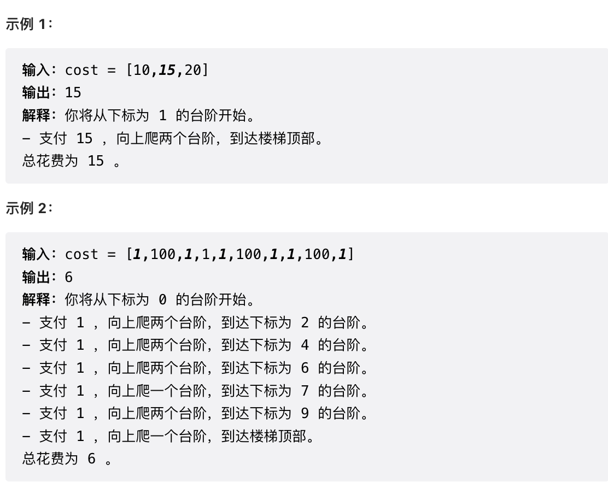

## 动态规划的思考步骤

### 思考过程

- 确定dp数组（dp table）以及下标的含义
- 确定递推公式
- dp数组如何初始化
- 确定遍历顺序
- 举例推导dp数组

### 基本代码模板

```java
class Solution {
    public int solover(int n) {
        if(n<=1)return n;
        // 确定dp的含义
        int[]dp=new int[n+1];
        // 对dp数字初始化
        dp[0]=0;
        dp[1]=1;
        // 遍历顺序，利用状态转移方程求解dp数组
        for(int i=2;i<=n;i++){
            dp[i]=dp[i-1]+dp[i-2];
        }
        return dp[n];

    }
}
```


## 一维动态规划

### leetcode 509 斐波那契数

#### 题目描述

[力扣题目链接(opens new window)](https://leetcode.cn/problems/fibonacci-number/)

斐波那契数，通常用 F(n) 表示，形成的序列称为 斐波那契数列 。该数列由 0 和 1 开始，后面的每一项数字都是前面两项数字的和。也就是： F(0) = 0，F(1) = 1 F(n) = F(n - 1) + F(n - 2)，其中 n > 1 给你n ，请计算 F(n) 。

示例 1：

- 输入：2
- 输出：1
- 解释：F(2) = F(1) + F(0) = 1 + 0 = 1

示例 2：

- 输入：3
- 输出：2
- 解释：F(3) = F(2) + F(1) = 1 + 1 = 2

示例 3：

- 输入：4
- 输出：3
- 解释：F(4) = F(3) + F(2) = 2 + 1 = 3

提示：

- 0 <= n <= 30

#### 思路解析

- 确定dp数组（dp table）以及下标的含义

  - dp[i]的定义为：第i个数的斐波那契数值是dp[i]

- 确定递推公式

  - 状态转移方程： dp[i] = dp[i - 1] + dp[i - 2];

- dp数组如何初始化

  - ```text
    dp[0] = 0;
    dp[1] = 1;
    ```

- 确定遍历顺序

  - dp[i]是依赖 dp[i - 1] 和 dp[i - 2]，遍历的顺序一定是从前到后遍历的

- 举例推导dp数组

#### 参考代码

```java
class Solution {
    public int fib(int n) {
        if(n<=1)return n;
        // dp[i]为F[i]
        int[]dp=new int[n+1];
        // 初始化
        dp[0]=0;
        dp[1]=1;
        for(int i=2;i<=n;i++){
            dp[i]=dp[i-1]+dp[i-2];
        }
        return dp[n];

    }
}
```

### leetcode 70 爬楼梯

#### 题目描述

[力扣题目链接(opens new window)](https://leetcode.cn/problems/climbing-stairs/)

假设你正在爬楼梯。需要 n 阶你才能到达楼顶。

每次你可以爬 1 或 2 个台阶。你有多少种不同的方法可以爬到楼顶呢？

注意：给定 n 是一个正整数。

示例 1：

- 输入： 2
- 输出： 2
- 解释： 有两种方法可以爬到楼顶。
  - 1 阶 + 1 阶
  - 2 阶

示例 2：

- 输入： 3
- 输出： 3
- 解释： 有三种方法可以爬到楼顶。
  - 1 阶 + 1 阶 + 1 阶
  - 1 阶 + 2 阶
  - 2 阶 + 1 阶

#### 思路解析

- 确定dp数组以及下标的含义

  - dp[i]： 爬到第i层楼梯，有dp[i]种方法

- 确定递推公式

  - 第一种情况：dp[i - 1]，上i-1层楼梯，有dp[i - 1]种方法，那么再一步跳一个台阶。
  - 第二种情况：dp[i - 2]，上i-2层楼梯，有dp[i - 2]种方法，那么再一步跳两个台阶。
  - 所以dp[i] = dp[i - 1] + dp[i - 2] 。

- dp数组如何初始化

  - ```java
    dp[0]=1;
    dp[1]=1;
    ```

- 确定遍历顺序：遍历顺序一定是从前向后遍历的

#### 参考代码

```java
class Solution {
    public int climbStairs(int n) {
        // dp[i]为到达第i阶台阶的方式，第n阶为楼顶
        int[]dp=new int[n+1];
        // 初始化
        dp[0]=1;
        dp[1]=1;
        // 状态转移方程:dp[i]=dp[i-1]+dp[i-2]
        for(int i=2;i<=n;i++){
            dp[i]=dp[i-1]+dp[i-2];
        }
        return dp[n];
    }
}
```

### leetcode 746 使用最小花费爬楼梯

#### 题目描述

[力扣题目链接](https://leetcode.cn/problems/min-cost-climbing-stairs/)

给你一个整数数组 cost ，其中 cost[i] 是从楼梯第 i 个台阶向上爬需要支付的费用。一旦你支付此费用，即可选择向上爬一个或者两个台阶。

你可以选择从下标为 0 或下标为 1 的台阶开始爬楼梯。

请你计算并返回达到楼梯顶部的最低花费。



#### 思路解析

- 确定dp数组以及下标的含义
  - dp[i]的定义：到达第i台阶所花费的最少体力为dp[i]。
- 确定递推公式
  - 第一种情况：dp[i - 1] 跳到 dp[i] 需要花费 dp[i - 1] + cost[i - 1]。
  - 第二种情况：dp[i - 2] 跳到 dp[i] 需要花费 dp[i - 2] + cost[i - 2]。
  - 所以dp[i] = min(dp[i - 1] + cost[i - 1], dp[i - 2] + cost[i - 2]);
- dp数组如何初始化
  - 题目描述中明确说明“你可以选择从下标为 0 或下标为 1 的台阶开始爬楼梯。” 也就是说 到达 第 0 个台阶是不花费的，但从 第0 个台阶 往上跳的话，需要花费 cost[0]。所以初始化 dp[0] = 0，dp[1] = 0;
- 确定遍历顺序
  - dp[i]由dp[i-1]dp[i-2]推出，所以是从前到后遍历cost数组即可

#### 参考代码

```java
class Solution {
    public int minCostClimbingStairs(int[] cost) {
        int n=cost.length;
        // dp[i]为到达第i阶台阶的最小花费，第n阶为楼顶
        int[]dp=new int[n+1];
        // 初始化
        dp[0]=0;
        dp[1]=0;
        // 状态转移方程推导
        // 从第i-1阶爬1个台阶:dp[i-1]+cost[i-1]
        // 从第i-2阶爬2个台阶:dp[i-2]+cost[i-2]
        for(int i=2;i<=n;i++){
            dp[i]=Math.min(dp[i-1]+cost[i-1],dp[i-2]+cost[i-2]);
        }
        return dp[n];
    }
}
```

### leetcode 343 整数拆分

#### 题目描述

[力扣题目链接(opens new window)](https://leetcode.cn/problems/integer-break/)

给定一个正整数 n，将其拆分为至少两个正整数的和，并使这些整数的乘积最大化。 返回你可以获得的最大乘积。

示例 1:

- 输入: 2
- 输出: 1
- 解释: 2 = 1 + 1, 1 × 1 = 1。

示例 2:

- 输入: 10
- 输出: 36
- 解释: 10 = 3 + 3 + 4, 3 × 3 × 4 = 36。
- 说明: 你可以假设 n 不小于 2 且不大于 58。

#### 思路解析

- 确定dp数组（dp table）以及下标的含义

  - dp[i]：分拆数字i，可以得到的最大乘积为dp[i]。

- 确定递推公式

  - 第一种情况：j * (i - j) 直接相乘。单纯的把整数拆分为两个数相乘
  - 第二种情况：j * dp[i - j]，相当于是拆分(i - j)，拆分成两个以及两个以上的个数相乘

  - 递推公式：**`dp[i] = max({dp[i], (i - j) * j, dp[i - j] * j})`**

- dp的初始化

  - 初始化dp[2] = 1=

- 确定遍历顺序

  - 确定遍历顺序，递归公式：**`dp[i] = max(dp[i], max((i - j) * j, dp[i - j] * j));`**
  - i从3开始遍历到n
  - j从1开始遍历到i-1

#### 参考代码

```java
class Solution {
    public int integerBreak(int n) {
        // 分拆数字i可以得到的最大乘积
        int[]dp=new int[n+1];
        // 初始化
        dp[2]=1;
        // 遍历过程
        // 被拆成i*(i-j)
        // 被拆成dp[i-j]*j
        for(int i=3;i<=n;i++){
            for(int j=1;j<i;j++){
                dp[i]=Math.max(dp[i],Math.max((i-j)*j,dp[i-j]*j));
            }
        }
        return dp[n];
    }
}
```

### leetcode 96 不同的二叉搜索树

#### 题目描述

[力扣题目链接(opens new window)](https://leetcode.cn/problems/unique-binary-search-trees/)

给定一个整数 n，求以 1 ... n 为节点组成的二叉搜索树有多少种？

示例:


#### 思路解析

- 确定dp数组（dp table）以及下标的含义
  - **dp[i] ： i个不同元素节点组成的二叉搜索树的个数**。
- 确定递推公式
  - dp[i] += dp[以j为头结点左子树节点数量] * dp[以j为头结点右子树节点数量]
  - j表示选取的根节点结点的元素，从1遍历到i为止。
    - 左子树：[1,j-1]
    - 右子树：[j+1,i];
  - 所以递推公式：**`dp[i] += dp[j - 1] * dp[i - j]`** ; ，j-1 为j为头结点左子树节点数量，i-j 为以j为头结点右子树节点数量

- dp数组初始化
  - 初始化dp[0]=1
- 确定遍历顺序
  - 首先遍历节点数，从递归公式：dp[i] += dp[j - 1] * dp[i - j]可以看出，节点数为i的状态是依靠 i之前节点数的状态。
  - 那么遍历i里面每一个数作为头结点的状态，用j来遍历。

#### 参考代码

```java
class Solution {
    public int numTrees(int n) {
        // dp[i]代表i个节点的不同二叉树数量
        int[]dp=new int[n+1];
        // 初始化
        dp[0]=1;
        // i表示考虑i个节点的情况
        for(int i=1;i<=n;i++){
            // j表示选取的根节点编号
            for(int j=1;j<=i;j++){
                dp[i]+=dp[j-1]*dp[i-j];
            }
        }
        return dp[n];
    }
}
```


## 二维动态规划

### leetcode 62 不同路径

#### 题目描述

[力扣题目链接(opens new window)](https://leetcode.cn/problems/unique-paths/)

一个机器人位于一个 m x n 网格的左上角 （起始点在下图中标记为 “Start” ）。

机器人每次只能向下或者向右移动一步。机器人试图达到网格的右下角（在下图中标记为 “Finish” ）。

问总共有多少条不同的路径？

示例 1：


- 输入：m = 3, n = 7
- 输出：28

示例 2：

- 输入：m = 2, n = 3
- 输出：3

解释： 从左上角开始，总共有 3 条路径可以到达右下角。

1. 向右 -> 向右 -> 向下
2. 向右 -> 向下 -> 向右
3. 向下 -> 向右 -> 向右

示例 3：

- 输入：m = 7, n = 3
- 输出：28

示例 4：

- 输入：m = 3, n = 3
- 输出：6

提示：

- 1 <= m, n <= 100
- 题目数据保证答案小于等于 2 * 10^9

#### 思路解析

- 确定dp数组（dp table）以及下标的含义
  - **`dp[i][j]`** ：表示从（0 ，0）出发，到(i, j) 有 **`dp[i][j]`** 条不同的路径。
- 确定递推公式
  -  **`dp[i - 1][j]`** 表示是从(0, 0)的位置到(i - 1, j)有几条路径，**`dp[i][j - 1]`**同理。
  - **`dp[i][j] = dp[i - 1][j] + dp[i][j - 1]`** 
- dp数组的初始化
  - 首先 **`dp[i][0]`** 一定都是1，因为从(0, 0)的位置到(i, 0)的路径只有一条（竖直向下走），那么 **`dp[0][j]`**也同理（水平向右走。
- 确定遍历顺序
  - 看一下递推公式 **`dp[i][j] = dp[i - 1][j] + dp[i][j - 1]`** ，**`dp[i][j]`** 都是从其上方和左方推导而来，那么从左到右一层一层遍历就可以了。

#### 参考代码

```java
class Solution {
    public int uniquePaths(int m, int n) {
        int[][]dp=new int[m][n];
        // 初始化
        // [0,0]到[m,0]的路径只有一条，竖直向下走
        for(int i=0;i<m;i++){
            dp[i][0]=1;
        }
        // [0,0]到[0,n]的路径只有一条，向右走
        for(int i=0;i<n;i++){
            dp[0][i]=1;
        }
        // 转移方程 dp[i[[j]=dp[i-1][j]+dp[i][j-1]
        for(int i=1;i<m;i++){
            for(int j=1;j<n;j++){
                dp[i][j]=dp[i-1][j]+dp[i][j-1];
            }
        }
        return dp[m-1][n-1];
    }
}
```

### leetcode 63 不同路径II

#### 题目描述

[力扣题目链接(opens new window)](https://leetcode.cn/problems/unique-paths-ii/)

一个机器人位于一个 m x n 网格的左上角 （起始点在下图中标记为“Start” ）。

机器人每次只能向下或者向右移动一步。机器人试图达到网格的右下角（在下图中标记为“Finish”）。

现在考虑网格中有障碍物。那么从左上角到右下角将会有多少条不同的路径？


网格中的障碍物和空位置分别用 1 和 0 来表示。

示例 1：


- 输入：obstacleGrid = [[0,0,0],[0,1,0],[0,0,0]]
- 输出：2 解释：
- 3x3 网格的正中间有一个障碍物。
- 从左上角到右下角一共有 2 条不同的路径：
  1. 向右 -> 向右 -> 向下 -> 向下
  2. 向下 -> 向下 -> 向右 -> 向右

示例 2：


- 输入：obstacleGrid = [[0,1],[0,0]]
- 输出：1

提示：

- m == obstacleGrid.length
- n == obstacleGrid[i].length
- 1 <= m, n <= 100
- obstacleGrid[i][j] 为 0 或 1

#### 思路解析

与上一题的大体思路相同，只是在初始化和遍历过程略有不同。

- 初始化时将遇到障碍物之前的dp数字置为1
- 遍历过程中遇到障碍物跳过该dp数组

#### 参考代码

```java
import java.util.Arrays;

//leetcode submit region begin(Prohibit modification and deletion)
class Solution {
    public int uniquePathsWithObstacles(int[][] obstacleGrid) {
        // m行n列
        int m=obstacleGrid.length;
        int n=obstacleGrid[0].length;
        if (obstacleGrid[m - 1][n - 1] == 1 || obstacleGrid[0][0] == 1) {
            return 0;
        }
        int[][]dp=new int[m][n];
        // 初始化
        // 从[0,0]到[i,0]只有一条，遇到障碍物停止
        for(int i=0;i<m&&obstacleGrid[i][0]==0;i++){
            dp[i][0]=1;
        }
        // 从[0,0]到[0,i]只有一条，遇到障碍物停止
        for(int i=0;i<n&&obstacleGrid[0][i]==0;i++){
            dp[0][i]=1;
        }
        //遍历过程
        for(int i=1;i<m;i++){
            for(int j=1;j<n;j++){
                if(obstacleGrid[i][j]==1)
                    continue;
                else
                    dp[i][j]=dp[i-1][j]+dp[i][j-1];
            }
        }
        return dp[m-1][n-1];
    }
}
```

## 0-1背包问题

### 题目描述

有n件物品和一个最多能背重量为w 的背包。第i件物品的重量是weight[i]，得到的价值是value[i] 。**每件物品只能用一次**，求解将哪些物品装入背包里物品价值总和最大。

### 思路解析

#### 二维dp解法

- 确定dp数组以及下标的含义
  - 有两个维度需要分别表示：物品 和 背包容量
  - **`dp[i][j] 表示从下标为[0-i]的物品里任意取，放进容量为j的背包，价值总和最大`**
- 确定递推公式
  - 第一种情况：不放物体则 **`dp[i][j]=dp[i-1][j]`**
  - 第二种情况：放入物体则 **`dp[i][j]=dp[i-1][j-weight[i]]+value[i]`**
  - 取上面的较大值
- dp数组的初始化
  - i=0时
    -  `j < weight[0]`的时候，**`dp[0][j]`** 是 0，因为背包容量比编号0的物品重量还小。
    - 当`j >= weight[0]`时，**`dp[0][j]`** 是value[0]
  - j=0时
    - 背包容量为0，**`dp[i][0]=0`**
- 确定遍历顺序
  - 先遍历物品再遍历容量

**代码模板**

```java
import java.util.*;
public class Main{
    public static void main (String[] args) {
        Scanner sc=new Scanner(System.in);
        int M=sc.nextInt();
        int N=sc.nextInt();
        int[]weight=new int[M];
        int[]value=new int[M];
        for(int i=0;i<M;i++){
            weight[i]=sc.nextInt();
        }
        for(int i=0;i<M;i++){
            value[i]=sc.nextInt();
        }
        // dp[i][j]表示放入[0-i]的物品，背包容量为j的最大价值
        int[][]dp=new int[M][N+1];
        // 初始化
        // 背包空间为0，价值为0
        for(int i=0;i<M;i++){
            dp[i][0]=0;
        }
        // 被背包容量大于weight[0]价值为value[0]
        for(int i=weight[0];i<=N;i++){
            dp[0][i]=value[0];
        }
        for(int i=1;i<M;i++){
            for(int j=0;j<=N;j++){
                if(j<weight[i]){
                    dp[i][j]=dp[i-1][j];
                }else{
                    dp[i][j]=Math.max(dp[i-1][j],dp[i-1][j-weight[i]]+value[i]);
                }
            }
        }
        System.out.println(dp[M-1][N]);
         
    }
}
```

#### 一维dp解法

在使用二维数组的时候，递推公式：**`dp[i][j] = max(dp[i - 1][j], dp[i - 1][j - weight[i]] + value[i]);`**

其实可以发现如果把dp[i - 1]那一层复制到dp[i]上，表达式完全可以是：**`dp[i][j] = max(dp[i][j], dp[i][j - weight[i]] + value[i]);`**

因此可以推出

**`dp[j] = max(dp[j], dp[j - weight[i]] + value[i]);`**

- 确定dp数组的定义
  - dp[j]表示：容量为j的背包，所背的物品价值可以最大为dp[j]。
- 递推公式
  - 递推公式为：`dp[j] = max(dp[j], dp[j - weight[i]] + value[i]);`
- 初始化
  - 全部初始化为0即可
- 遍历顺序
  - 顺序遍历物品，同时逆序遍历容量
  - **倒序遍历是为了保证物品i只被放入一次** ，从后往前循环，每次取得状态不会和之前取得状态重合，这样每种物品就只取一次了

代码模板

```java
import java.util.*;
public class Main{
    public static void main (String[] args) {
        Scanner sc=new Scanner(System.in);
        int M=sc.nextInt();
        int N=sc.nextInt();
        int[]weight=new int[M];
        int[]value=new int[M];
        for(int i=0;i<M;i++){
            weight[i]=sc.nextInt();
        }
        for(int i=0;i<M;i++){
            value[i]=sc.nextInt();
        }
        // dp[j]背包容量为j的最大价值
        int[]dp=new int[N+1];
        for(int i=0;i<M;i++){
            for (int j = N; j >= weight[i]; j--) {
                dp[j] = Math.max(dp[j], dp[j - weight[i]] + value[i]);
            }
        }
        System.out.println(dp[N]);
    }
}
```

### 经典例题

板子题：https://kamacoder.com/problempage.php?pid=1046

#### leetcode 416 分割等和子集

**题目描述**

[力扣题目链接(opens new window)](https://leetcode.cn/problems/partition-equal-subset-sum/)

题目难易：中等

给定一个只包含正整数的非空数组。是否可以将这个数组分割成两个子集，使得两个子集的元素和相等。

注意: 每个数组中的元素不会超过 100 数组的大小不会超过 200

示例 1:

- 输入: [1, 5, 11, 5]
- 输出: true
- 解释: 数组可以分割成 [1, 5, 5] 和 [11].

示例 2:

- 输入: [1, 2, 3, 5]
- 输出: false
- 解释: 数组不能分割成两个元素和相等的子集.

提示：

- 1 <= nums.length <= 200
- 1 <= nums[i] <= 100

**思路解析**

本题可以将其视为一个0-1背包问题。nums中的数字为重量和价值的物品

既有一个 只能装重量为 sum / 2 的背包，商品为数字，这些数字能不能把 这个背包装满。

即为求解装满 承载重量为 sum / 2 的背包，价值最大是多少？如果最大价值是 sum / 2，说明正好被商品装满了。

- 确定dp数组以及下标的含义
  - 如果背包所载重量为target， dp[target]就是装满 背包之后的总价值，因为 本题中每一个元素的数值既是重量，也是价值，所以，当 dp[target] == target 的时候，背包就装满了。
- 确定递推公式
  - 本题相当于背包里放入数值，那么物品i的重量是nums[i]，其价值也是nums[i]。所以递推公式：**`dp[j] = max(dp[j], dp[j - nums[i]] + nums[i]);`**
- dp数组如何初始化
  - dp[0]=0
- 遍历顺序与0-1背包相同

注意当sum是一个奇数是不存在该种方式的

**参考代码**

```java
class Solution {
    public boolean canPartition(int[] nums) {
        int sum=0;
        for(int i=0;i<nums.length;i++){
            sum+=nums[i];
        }
        if(sum%2!=0){
            return false;
        }
        int target=sum/2;
        int[]dp=new int[target+1];
        for(int i=0;i<nums.length;i++){
            for(int j=target;j>=nums[i];j--){
                dp[j]=Math.max(dp[j],dp[j-nums[i]]+nums[i]);
            }
            if(dp[target]==target){
                return true;
            }
        }
        return dp[target]==target;
    }
}
```

#### leetcode 494 目标和

**题目描述**

[力扣题目链接(opens new window)](https://leetcode.cn/problems/target-sum/)

难度：中等

给定一个非负整数数组，a1, a2, ..., an, 和一个目标数，S。现在你有两个符号 + 和 -。对于数组中的任意一个整数，你都可以从 + 或 -中选择一个符号添加在前面。

返回可以使最终数组和为目标数 S 的所有添加符号的方法数。

示例：

- 输入：nums: [1, 1, 1, 1, 1], S: 3
- 输出：5

解释：

- -1+1+1+1+1 = 3
- +1-1+1+1+1 = 3
- +1+1-1+1+1 = 3
- +1+1+1-1+1 = 3
- +1+1+1+1-1 = 3

一共有5种方法让最终目标和为3。

提示：

- 数组非空，且长度不会超过 20 。
- 初始的数组的和不会超过 1000 。
- 保证返回的最终结果能被 32 位整数存下。

**思路解析**

本题依然可以转换为0-1背包问题，设加法部分为left，减法部分为right
$$
		left+right=sum,
        left-right=target \to
        left=(sum+target)/2
$$
**此时问题就转化为，用nums装满容量为left的背包有多少种方法**

- 确定dp数组以及下标的含义
  - dp[i]：使用容量为i的包装满，有dp[j]种方法。
- 确定递推公式
  - **不放物品i**：即背包容量为j，里面不放物品i，装满有dp[j]中方法。
  - **放物品i**： 即：先空出物品i的容量，背包容量为（j - 物品i容量），放满背包有 dp[[j - 物品i容量] 种方法。
  - 递推公式：dp[j] = dp[j] + dp[j - nums[i]]
- 遍历顺序：同0-1背包

**参考代码**

```java
class Solution {
    public int findTargetSumWays(int[] nums, int target) {
        int sum=0;
        for(int i=0;i<nums.length;i++){
            sum+=nums[i];
        }
        // left+right=sum
        // left-right=target
        // left=(sum+target)/2
        if (Math.abs(target) > sum) return 0;
        if ((target + sum) % 2 == 1) return 0;
        int bagSize=(sum+target)/2;
        int[]dp=new int[bagSize+1];
        dp[0]=1;
        for(int i=0;i<nums.length;i++){
            for(int j=bagSize;j>=nums[i];j--){
                dp[j]+=dp[j-nums[i]];
            }
        }
        return dp[bagSize];
    }
}
```

#### leetcode 474 一和零

**题目描述**

[力扣题目链接(opens new window)](https://leetcode.cn/problems/ones-and-zeroes/)

给你一个二进制字符串数组 strs 和两个整数 m 和 n 。

请你找出并返回 strs 的最大子集的大小，该子集中 最多 有 m 个 0 和 n 个 1 。

如果 x 的所有元素也是 y 的元素，集合 x 是集合 y 的 子集 。

示例 1：

- 输入：strs = ["10", "0001", "111001", "1", "0"], m = 5, n = 3
- 输出：4
- 解释：最多有 5 个 0 和 3 个 1 的最大子集是 {"10","0001","1","0"} ，因此答案是 4 。 其他满足题意但较小的子集包括 {"0001","1"} 和 {"10","1","0"} 。{"111001"} 不满足题意，因为它含 4 个 1 ，大于 n 的值 3 。

示例 2：

- 输入：strs = ["10", "0", "1"], m = 1, n = 1
- 输出：2
- 解释：最大的子集是 {"0", "1"} ，所以答案是 2 。

提示：

- 1 <= strs.length <= 600
- 1 <= strs[i].length <= 100
- strs[i] 仅由 '0' 和 '1' 组成
- 1 <= m, n <= 100

**思路解析**

本题其实也是一个01背包问题。**本题中strs 数组里的元素就是物品，每个物品都是一个！**

**而m 和 n相当于是一个背包，两个维度的背包**。而重量也是两个维度（0的个数和1的个数）

- 确定dp数组（dp table）以及下标的含义
  - **`dp[i][j]：最多有i个0和j个1的strs的最大子集的大小为dp[i][j]`**。
- 确定递推公式
  - **`dp[i][j]`** 可以由前一个strs里的字符串推导出来，strs里的字符串有zeroNum个0，oneNum个1。
  - 然后我们在遍历的过程中，取dp[i][j]的最大值。
  - 递推公式：**`dp[i][j] = max(dp[i][j], dp[i - zeroNum][j - oneNum] + 1);`**
- 遍历顺序：倒序遍历m和n，类似0-1背包

**参考代码**

```java
class Solution {
    public int findMaxForm(String[] strs, int m, int n) {
        // 最多有i个0和j个1的strs的最大子集的大小为dp[i][j]
        int[][]dp=new int[m+1][n+1];
        int oneNum;
        int zeroNum;
        for(String str:strs){
            oneNum=0;
            zeroNum=0;
            for(char ch:str.toCharArray()){
                if(ch=='0'){
                    zeroNum++;
                }else{
                    oneNum++;
                }
            }
            for(int i=m;i>=zeroNum;i--){
                for(int j=n;j>=oneNum;j--){
                    dp[i][j]=Math.max(dp[i][j],dp[i-zeroNum][j-oneNum]+1);
                }
            }
        }
        return dp[m][n];
    }
}
```

