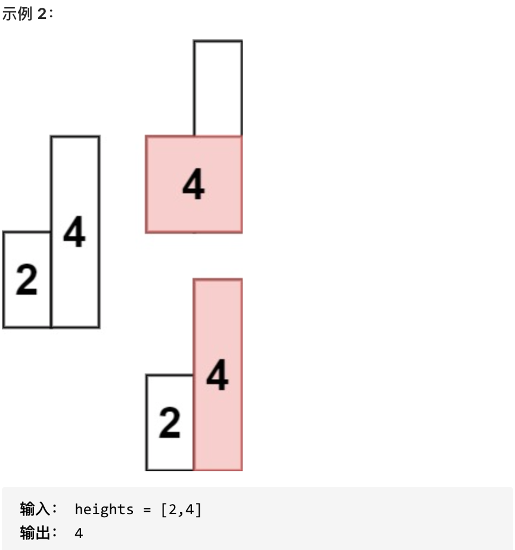

## 使用场景

通常是一维数组，要寻找任一个元素的右边或者左边第一个比自己大或者小的元素的位置，此时就要想到可以用单调栈了

## 思路解析

**用一个栈来记录我们遍历过的元素** ，因为遍历数组的时候，不知道之前都遍历了哪些元素，以至于遍历一个元素找不到是不是之前遍历过一个更小的，所以我们需要用一个容器（这里用单调栈）来记录我们遍历过的元素。

- 单调栈里存放的元素是下标：如果需要使用对应的元素，直接T[i]就可以获取。

- 单调栈里元素顺序取决是寻找元素右边第一个比自己大还是小的元素
  - 如果求一个元素右边第一个更大元素，单调栈就是从栈顶到栈底递增的
  - 如果求一个元素右边第一个更小元素，单调栈就是从栈顶到栈底递减的
- 判断条件（以从栈顶到栈底递增）
  - 当前遍历的元素T[i]小于栈顶元素T[st.top()]的情况
    - 加入栈中
  - 当前遍历的元素T[i]等于栈顶元素T[st.top()]的情况
    - 加入栈中
  - 当前遍历的元素T[i]大于栈顶元素T[st.top()]的情况
    - 将前面所有小于当前遍历元素的栈元素出栈
      - 循环内执行题目逻辑
    - 将当前遍历元素入栈

## 代码模板

```java
class Solution {
    public int[] dailyTemperatures(int[] t) {
        Stack<Integer>stack=new Stack<>();
        // 加入第一个元素下标
        stack.push(0);
        for(int i=1;i<n;i++){
            if(t[i]<ts[stack.peek()]){
                stack.push(i);
            }else if(t[i]==t[stack.peek()]){
                // 执行逻辑
            }
            else{
                while(!stack.isEmpty()&&temperatures[i]>temperatures[stack.peek()]){
                    // 题目逻辑
                    stack.pop();
                }
                stack.push(i);
            }
        }
        return res;
    }
}
```

## 经典例题

### leetcode 739 每日温度

#### 题目描述

[力扣题目链接(opens new window)](https://leetcode.cn/problems/daily-temperatures/)

请根据每日 气温 列表，重新生成一个列表。对应位置的输出为：要想观测到更高的气温，至少需要等待的天数。如果气温在这之后都不会升高，请在该位置用 0 来代替。

例如，给定一个列表 temperatures = [73, 74, 75, 71, 69, 72, 76, 73]，你的输出应该是 [1, 1, 4, 2, 1, 1, 0, 0]。

提示：气温 列表长度的范围是 [1, 30000]。每个气温的值的均为华氏度，都是在 [30, 100] 范围内的整数。

#### 思路解析

本题抽象为查找右边第一个比自己大的元素

使用从栈顶到栈底递增的单调栈

- 当前遍历的元素T[i]小于栈顶元素T[st.top()]的情况
  - 加入栈中
- 当前遍历的元素T[i]等于栈顶元素T[st.top()]的情况
  - 加入栈中
- 当前遍历的元素T[i]大于栈顶元素T[st.top()]的情况
  - 将前面所有小于当前遍历元素的栈元素出栈
    - 计算栈顶元素和当前遍历元素之间的下标差值
  - 再将当前遍历元素入栈

#### 参考代码

```java
class Solution {
    public int[] dailyTemperatures(int[] temperatures) {
        int n=temperatures.length;
        int[]res=new int[n];
        Stack<Integer>stack=new Stack<>();
        stack.push(0);
        for(int i=1;i<n;i++){
            if(temperatures[i]<=temperatures[stack.peek()]){
                stack.push(i);
            }else{
                while(!stack.isEmpty()&&temperatures[i]>temperatures[stack.peek()]){
                    // 更新下标差值
                    res[stack.peek()]=i-stack.peek();
                    stack.pop();
                }
                stack.push(i);
            }
        }
        return res;
    }
}
```

### leetcode 496 下一个更大元素

#### 题目描述

[力扣题目链接(opens new window)](https://leetcode.cn/problems/next-greater-element-i/)

给你两个 没有重复元素 的数组 nums1 和 nums2 ，其中nums1 是 nums2 的子集。

请你找出 nums1 中每个元素在 nums2 中的下一个比其大的值。

nums1 中数字 x 的下一个更大元素是指 x 在 nums2 中对应位置的右边的第一个比 x 大的元素。如果不存在，对应位置输出 -1 。

示例 1:

输入: nums1 = [4,1,2], nums2 = [1,3,4,2].
输出: [-1,3,-1]
解释:
对于 num1 中的数字 4 ，你无法在第二个数组中找到下一个更大的数字，因此输出 -1 。
对于 num1 中的数字 1 ，第二个数组中数字1右边的下一个较大数字是 3 。
对于 num1 中的数字 2 ，第二个数组中没有下一个更大的数字，因此输出 -1 。

示例 2:
输入: nums1 = [2,4], nums2 = [1,2,3,4].
输出: [3,-1]
解释:
对于 num1 中的数字 2 ，第二个数组中的下一个较大数字是 3 。
对于 num1 中的数字 4 ，第二个数组中没有下一个更大的数字，因此输出-1 。

提示：

- 1 <= nums1.length <= nums2.length <= 1000
- 0 <= nums1[i], nums2[i] <= 10^4
- nums1和nums2中所有整数 互不相同
- nums1 中的所有整数同样出现在 nums2 中

#### 思路解析

本题抽象为在查找nums1元素在nums2对应位置查找nums2右边第一个比自己大的元素，然后将结果返回元素nums1的对应位置

使用从栈顶到栈底递增的单调栈

- 当前遍历的元素T[i]小于栈顶元素T[st.top()]的情况
  - 加入栈中
- 当前遍历的元素T[i]等于栈顶元素T[st.top()]的情况
  - 加入栈中
- 当前遍历的元素T[i]大于栈顶元素T[st.top()]的情况
  - 将前面所有小于当前遍历元素的栈元素出栈
    - 查找nums2元素在nums1的对应位置的下标
    - 将该下标的对应元素设置为当前遍历元素
  - 再将当前遍历元素入栈

#### 参考代码

```java
class Solution {
    public int[] nextGreaterElement(int[] nums1, int[] nums2) {
        Stack<Integer>stack=new Stack<>();
        int n=nums1.length;
        int[]res=new int[n];
        Arrays.fill(res,-1);
        // 记录nums2元素在nums1的对应位置
        HashMap<Integer,Integer>map=new HashMap<>();
        for(int i=0;i<n;i++){
            map.put(nums1[i],i);
        }
        stack.push(0);
        for(int i=1;i<nums2.length;i++){
            if(nums2[i]<=nums2[stack.peek()]){
                stack.push(i);
            }else{
                while(!stack.isEmpty()&&nums2[i]>nums2[stack.peek()]){
                    if(map.containsKey(nums2[stack.peek()])){
                        Integer index=map.get(nums2[stack.peek()]);
                        res[index]=nums2[i];
                    }
                    stack.pop();
                }
                stack.push(i);
            }
        }
        return res;
    }
}
```

### leetcode 503 下一个更大元素II

#### 题目描述

[力扣题目链接(opens new window)](https://leetcode.cn/problems/next-greater-element-ii/)

给定一个循环数组（最后一个元素的下一个元素是数组的第一个元素），输出每个元素的下一个更大元素。数字 x 的下一个更大的元素是按数组遍历顺序，这个数字之后的第一个比它更大的数，这意味着你应该循环地搜索它的下一个更大的数。如果不存在，则输出 -1。

示例 1:

- 输入: [1,2,1]
- 输出: [2,-1,2]
- 解释: 第一个 1 的下一个更大的数是 2；数字 2 找不到下一个更大的数；第二个 1 的下一个最大的数需要循环搜索，结果也是 2。

提示:

- 1 <= nums.length <= 10^4
- -10^9 <= nums[i] <= 10^9

#### 思路解析

本题与前面几题思路一致但是由于数组是循环的，需要在遍历的过程中模拟走了两边nums。然后用i % nums.size()代替i

#### 参考代码

```java
class Solution {
    public int[] nextGreaterElements(int[] nums) {
        //边界判断
        if(nums == null || nums.length <= 1) {
            return new int[]{-1};
        }
        int size = nums.length;
        int[] res = new int[size];//存放结果
        Arrays.fill(res,-1);
        Stack<Integer>stack=new Stack<>();
        stack.push(0);
        for(int i=1;i<2*size;i++){
            if(nums[i%size]<=nums[stack.peek()]){
                stack.push(i%size);
            }else {
                while(!stack.isEmpty()&&nums[i%size]>nums[stack.peek()]){
                    res[stack.peek()]=nums[i%size];
                    stack.pop();
                }
                stack.push(i%size);
            }
        }
        return res;
    }
}
```

### leetcode 42 接雨水

#### 题目描述

[力扣题目链接(opens new window)](https://leetcode.cn/problems/trapping-rain-water/)

给定 n 个非负整数表示每个宽度为 1 的柱子的高度图，计算按此排列的柱子，下雨之后能接多少雨水。

示例 1：


- 输入：height = [0,1,0,2,1,0,1,3,2,1,2,1]
- 输出：6
- 解释：上面是由数组 [0,1,0,2,1,0,1,3,2,1,2,1] 表示的高度图，在这种情况下，可以接 6 个单位的雨水（蓝色部分表示雨水）。

示例 2：

- 输入：height = [4,2,0,3,2,5]
- 输出：9

#### 思路解析

本题需要寻找一个元素，右边最大元素以及左边最大元素，来计算雨水面积。

一旦发现添加的柱子高度大于栈头元素了，此时就出现凹槽了，栈头元素就是凹槽底部的柱子，栈头第二个元素就是凹槽左边的柱子，而添加的元素就是凹槽右边的柱子。

- 当前遍历的元素（柱子）高度小于栈顶元素的高度 height[i] < height[st.top()]
  - 入栈
- 情况二：当前遍历的元素（柱子）高度等于栈顶元素的高度 height[i] == height[st.top()]
  - 先出栈再入栈
- 情况三：当前遍历的元素（柱子）高度大于栈顶元素的高度 height[i] > height[st.top()]
  - 先将栈顶元素出栈作为凹槽的中间元素
  - 水池的高度是min(凹槽左边高度, 凹槽右边高度) - 凹槽底部高度
  - 雨水的宽度是 凹槽右边的下标 - 凹槽左边的下标 - 1

#### 参考代码

```java
class Solution {
    public int trap(int[] height) {
        int n=height.length;
        Stack<Integer>stack=new Stack<>();
        stack.push(0);
        int res=0;
        for(int i=1;i<n;i++){
            if(height[stack.peek()]>height[i]){
                stack.push(i);
            }else if(height[stack.peek()]==height[i]){
                stack.pop();
                stack.push(i);
            }else {
                while (!stack.isEmpty() && height[stack.peek()] < height[i]) {
                    int mid = stack.peek();
                    stack.pop();
                    if(!stack.isEmpty()){
                        int h = Math.min(height[i], height[stack.peek()]) - height[mid];
                        int w = i - stack.peek() - 1;
                        res += h * w;
                    }
                }
                stack.push(i);
            }
        }
        return res;
    }
}
```

### leetcode 84 柱状图的最大矩形

#### 题目描述

[力扣题目链接(opens new window)](https://leetcode.cn/problems/largest-rectangle-in-histogram/)

给定 n 个非负整数，用来表示柱状图中各个柱子的高度。每个柱子彼此相邻，且宽度为 1 。

求在该柱状图中，能够勾勒出来的矩形的最大面积。




- 1 <= heights.length <=10^5
- 0 <= heights[i] <= 10^4

#### 思路解析

上一题是找每个柱子左右两边第一个大于该柱子高度的柱子，而本题是找每个柱子左右两边第一个小于该柱子的柱子。

将单调栈的顺序反转即可

#### 参考代码

```java
class Solution {
    public int largestRectangleArea(int[] heights) {
        int [] newHeights = new int[heights.length + 2];
        newHeights[0] = 0;
        newHeights[newHeights.length - 1] = 0;
        for (int index = 0; index < heights.length; index++){
            newHeights[index + 1] = heights[index];
        }
        heights = newHeights;
        int n=heights.length;
        int res=0;
        Stack<Integer>stack=new Stack<>();
        stack.push(0);
        for(int i=1;i<n;i++){
            if(heights[stack.peek()]<heights[i]){
                stack.push(i);
            }else if(heights[stack.peek()]==heights[i]){
                stack.pop();
                stack.push(i);
            }else{
                while(!stack.isEmpty()&&heights[stack.peek()]>heights[i]){
                    int mid=stack.peek();
                    stack.pop();
                    if(!stack.isEmpty()){
                        int left=stack.peek();
                        int right=i;
                        int h=heights[mid];
                        int w=right-left-1;
                        res=Math.max(h*w,res);
                    }
                }
                stack.push(i);
            }
        }
        return res;
    }
}
```

