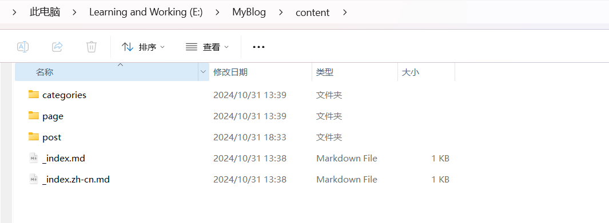
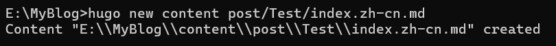
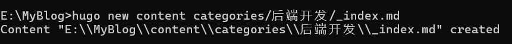
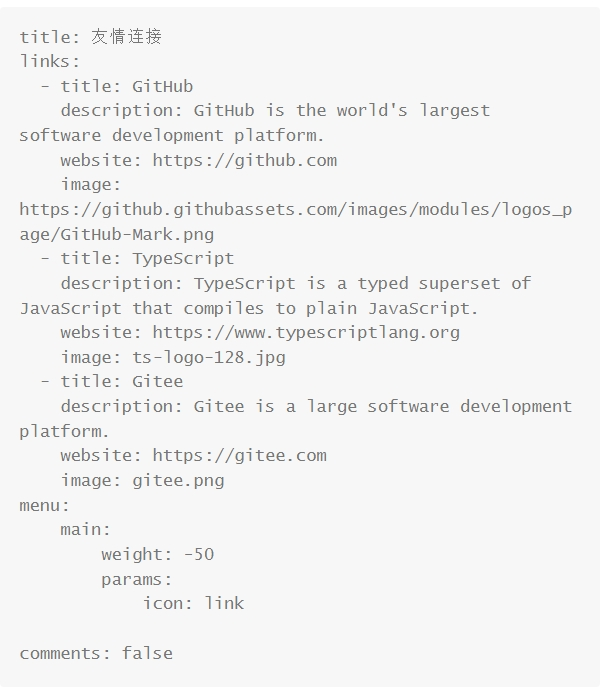

## 文章存储位置

本博客的所有文章都存放在E/MyBlog/content/post文件夹中

## 如何添加文章

在 `content/tags/文章名` 下新建文件 `index.md`

### 命令行操作

在MyBlog主文件夹的cmd中运行以下命令

```
hugo new content post/<FileName>/index.md
```

#### 参数解释

**post**：所有文章保存的文件路径

**FileName**为当前文章所在的文件夹名

**index.md**为当前文章的markdown文件

- **index.en.md**：英文文章
- **index.zh-cn.md**：中文文章




## 文章内修改

###  插入照片

将需要的图片放入文章的文件夹中即可

### 头文字参数

- **data**：创建时间

- **draft**：是否草稿

- **title**：文章标题

- **image**：博客网站的开头图片

- **categories**：文章的分类

- **tags**：文章的标签

- **description**：文章的描述

### 短代码

#### 文章引用

在markdown文件中插入以下短代码，使用时将{}改为{{}}

```
{< quote author="作者" url="作品的来源（可不填）" source="作品名" >}
引用内容
{< /quote >}
```

#### 插入B站视频

在markdown文件中插入以下短代码，使用时将{}改为{{}}

```
{< bilibili VIDEO_ID PART_NUMBER >}
```

可以在B站视频的url中找到`Video_ID``https://www.bilibili.com/video/BV1BPSdYHEbj/?spm_id_from=333.1007.tianma.1-2-2.click&vd_source=7db50a55b19a59c42ee778836913c04f`

其中VIDEO_ID：BV1BPSdYHEbj

#### 插入hugo notice

hugo notice有以下几个类别

- **tip**：提示
- **info**：引言
- **warning**：警告
- **note**：注解

创建方法为在markdown文件中插入短代码，使用时将{}改为{{}}

##### 创建Tip

```
{< notice tip >}
This is a very good tip.
{< /notice >}
```


This is a very good tip.


##### 创建Info

```
{< notice info >}
This is a very good info.
{< /notice >}
```


This is a very good info.


##### 创建Warning

```
{< notice warning >}
This is a very bad warning.
{< /notice >}
```


This is a very bad warning.


##### 创建Note

```
{< notice note >}
This is a very good note.
{< /notice >}
```


This is a very bad note.



### 插入参考博客

直接将参考博客的网址复制到markdown文件中

[Tyritic的个人博客](https://tyritic.github.io/)

## 创建分组（categories）

在 `content/categories/分类名` 下新建文件 `_index.md`

可以使用命令行工具

```
hugo new content categories/<分组名>/_index.md
```



### 参数解释

- **categories**：所有分组的所在目录
- **_index.md**：分组的配置文件
  - **_ndex.en.md**：英文分组
  - **_index.zh-cn.md**：中文分组


## 创建标签（Tags)

在 `content/tags/分类名` 下新建文件 `_index.md`

可以使用命令行工具

```
hugo new content tags/<标签名>/_index.md
```

### 参数解释

- **tags**：所有标签所在的目录
- **_index.md**：分组的配置文件
  - **index.en.md**：英文标签
  - **index.zh-cn.md**：中文标签


## 创建友情链接（Links)

在 `content/page/links` 下修改文件 `_index.md`，创建与GitHub同级的元素



### 参数列表

- **title**：博客显示该网站的名字
- **description**：博客对该网站的描述
- **website**：网站链接
- **image**：网站的icon
