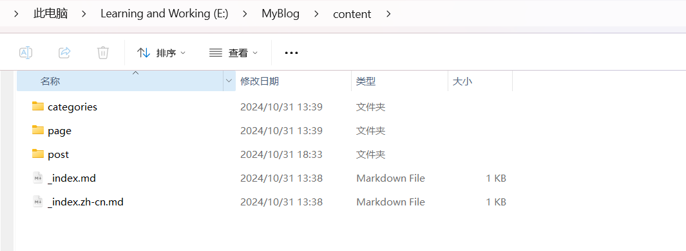
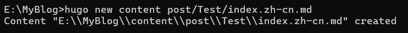
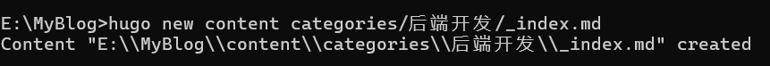
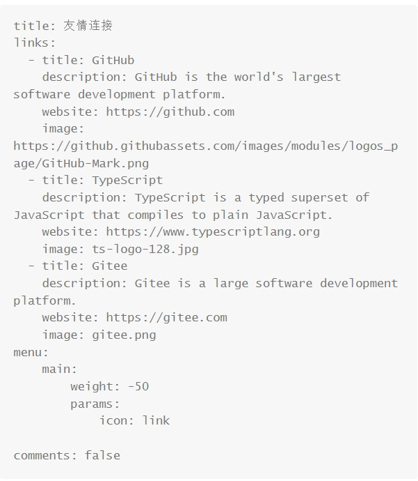

## 📁 文章存储位置

本博客的所有文章都存放在E/MyBlog/content/post文件夹中

<div align="center">
  
</div>

---

## 🛠️ 如何添加文章

在 `content/tags/文章名` 下新建文件 `index.zh-cn.md`

### 💻 命令行操作

在MyBlog主文件夹的cmd中运行以下命令

```shell
hugo new content post/<FileName>/index.zh-cn.md
```

#### 📝 参数解释

**post**：所有文章保存的文件路径

**FileName**为当前文章所在的文件夹名

**index.md**为当前文章的markdown文件

- **index.en.md**：英文文章
- **index.zh-cn.md**：中文文章

<div align="center">
  
</div>

---

## ✏️ 文章内修改

###  🖼️ 插入照片

将需要的图片放入文章的文件夹中即可

### 🔧 头文字参数

- **data**：创建时间

- **draft**：是否草稿

- **title**：文章标题

- **image**：博客网站的开头图片

- **categories**：文章的分类

- **tags**：文章的标签

- **description**：文章的描述

---

### 🔤 短代码

#### 💬 文章引用

在markdown文件中插入以下短代码，使用时将{}改为{{}}

```markdown
{< quote author="作者" url="作品的来源（可不填）" source="作品名" >}
引用内容
{< /quote >}
```

#### 🎬 插入B站视频

在markdown文件中插入以下短代码，使用时将{}改为{{}}

```markdown
{< bilibili VIDEO_ID PART_NUMBER >}
```

可以在B站视频的url中找到`Video_ID``https://www.bilibili.com/video/BV1BPSdYHEbj/?spm_id_from=333.1007.tianma.1-2-2.click&vd_source=7db50a55b19a59c42ee778836913c04f`

其中VIDEO_ID：BV1BPSdYHEbj

#### ⚙️ 插入hugo notice

hugo notice有以下几个类别

- **tip**：提示
- **info**：引言
- **warning**：警告
- **note**：注解

创建方法为在markdown文件中插入短代码，使用时将{}改为{{}}

##### 🌟 创建Tip

```markdown
{< notice tip >}
This is a very good tip.
{< /notice >}
```


This is a very good tip.


##### ℹ️ 创建Info

```markdown
{< notice info >}
This is a very good info.
{< /notice >}
```


This is a very good info.


##### ⚠️ 创建Warning

```markdown
{< notice warning >}
This is a very bad warning.
{< /notice >}
```


This is a very bad warning.


##### 📌 创建Note

```markdown
{< notice note >}
This is a very good note.
{< /notice >}
```


This is a very bad note.


---

### 🔗 插入参考博客

直接将参考博客的网址复制到markdown文件中

[Tyritic的个人博客](https://tyritic.github.io/)

---

## 🏷️ 创建分组（categories）

在 `content/categories/分类名` 下新建文件 `_index.md`

可以使用命令行工具

```shell
hugo new content categories/<分组名>/_index.md
```

<div align="center">
  
</div>

### 📖 参数解释

- **categories**：所有分组的所在目录
- **_index.md**：分组的配置文件
  - **_ndex.en.md**：英文分组
  - **_index.zh-cn.md**：中文分组


---

## 🏷️ 创建标签（Tags）

在 `content/tags/分类名` 下新建文件 `_index.md`

可以使用命令行工具

```shell
hugo new content tags/<标签名>/_index.md
```

### 📖 参数解释

- **tags**：所有标签所在的目录
- **_index.md**：分组的配置文件
  - **index.en.md**：英文标签
  - **index.zh-cn.md**：中文标签


---

## 🔗 创建友情链接（Links）

在 `content/page/links` 下修改文件 `_index.md`，创建与GitHub同级的元素

<div align="center">
  
</div>

### 📋 参数列表

- **title**：博客显示该网站的名字
- **description**：博客对该网站的描述
- **website**：网站链接
- **image**：网站的icon

---

## 😊 标题 Emoji 使用规范

### ✅ 基本规则

1. **所有标题必须有 emoji**
   - 包括二级标题（##）、三级标题（###）、四级标题（####）
   - emoji 放在标题文字前面，用空格分隔

2. **emoji 必须语义相关**
   - 选择与标题内容相关的 emoji
   - 例如：代码相关用 💻，配置相关用 ⚙️，警告用 ⚠️

3. **全文 emoji 严格不重复**
   - 同一篇文章中，所有级别的标题 emoji 都不能重复
   - 即使是不同章节，也要避免使用相同的 emoji

### ❌ 常见错误

#### 🚫 错误1：标题缺少 emoji

```markdown
❌ 错误示例：
## 简介
### 功能特性
#### 安装步骤

✅ 正确示例：
## 📖 简介
### ✨ 功能特性
#### 📦 安装步骤
```

#### 🚫 错误2：emoji 重复使用

```markdown
❌ 错误示例：
## 🔧 配置说明
### 🔧 服务端配置
### 🔧 客户端配置

✅ 正确示例：
## 🔧 配置说明
### 🖥️ 服务端配置
### 💻 客户端配置
```

#### 🚫 错误3：emoji 语义不相关

```markdown
❌ 错误示例：
## 🍎 错误处理    （用水果表示错误）
### 🌸 性能优化   （用花朵表示性能）

✅ 正确示例：
## ⚠️ 错误处理
### ⚡ 性能优化
```

#### 🚫 错误4：使用乱码 emoji

```markdown
❌ 错误示例：
## � 简介    （显示为方框或问号）

✅ 正确示例：
## 📖 简介   （使用标准 Unicode emoji）
```

### 🎨 常用 Emoji 参考

**技术类**：
- 💻 代码实现
- 🖥️ 服务端
- 📱 客户端
- ⚙️ 配置
- 🔧 工具/实战
- 🛠️ 快速开始
- 🔍 查询/搜索
- 📊 数据/图表
- 🎯 目标/重点

**流程类**：
- 📋 步骤/列表
- 📄 文档
- 🗂️ 文件组织
- 🎬 初始化
- 🔄 循环/流程
- ♻️ 生命周期
- 🔁 双向

**状态类**：
- ✅ 正确/成功
- ❌ 错误/失败
- ⚠️ 警告/陷阱
- 💡 提示/建议
- 🚨 严重警告
- ℹ️ 信息

**功能类**：
- 🚀 性能/快速
- 💭 设计/思考
- 🎭 场景
- 💬 聊天/对话
- 📦 打包/模块
- 📤 发送
- 📥 接收
- 📡 通信
- 📲 移动端

**优化类**：
- ⚡ 性能优化
- 🎨 美化/设计
- 🛡️ 安全
- 🔐 加密
- 🗺️ 路线图

### 🔍 检查方法

美化博客文章后，使用以下命令检查 emoji 重复：

```bash
# 提取所有标题的 emoji
grep -E "^##+ " 文章.md | awk '{print $2}' | sort | uniq -d

# 如果有输出，说明存在重复的 emoji，需要修改
```

### 💡 最佳实践

1. **写作前规划**：列出文章大纲，提前分配 emoji
2. **分层区分**：同一层级的标题使用相似主题的 emoji
3. **保持一致**：相同操作（如"第一步"、"第二步"）可以在不同章节使用相同 emoji（如步骤用 📋 🗂️ 🖥️ 📱）
4. **检查工具**：完成后用 grep 命令检查重复
