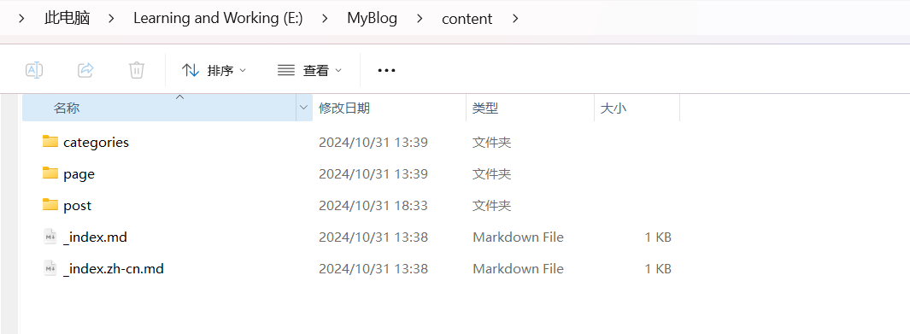
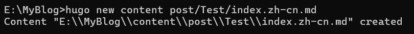

# 博客使用教程

## 文章存储位置

本博客的所有文章都存放在E/MyBlog/content/post文件夹中

## 如何添加文章

### 命令行操作

在MyBlog主文件夹的cmd中运行以下命令

```
hugo new content <SECTIONNAME>\<FileName>/<FORMAT>
```

#### 参数解释

<SECTIONNAME>为当前文章保存的文件路径

<FileName>为当前文章所在的文件夹名

<FORMAT> 为当前文章的语言格式

​	中文：index.zh-cn.md

​	英文：index.md



## 文章内修改

###  插入照片

将需要的图片放入文章的文件夹中即可