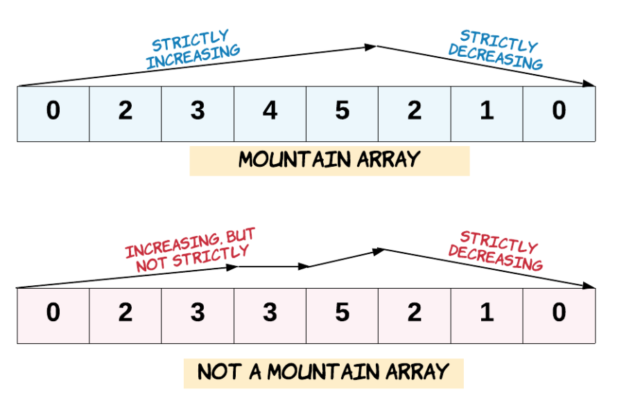

## 题目描述

通常当使用蛮力法需要两个for循环时，将两个for循环削减成一个for循环的优化方法。时间复杂度$O(n^2)$可以优化为$O(n)$

同时数组排序为两端大，中间小

## 算法模板

### 方法步骤

双指针法（左右指针法）： **通过一个左指针和右指针在一个for循环下完成两个for循环的工作。**

定义左右指针

- 左指针：定义在数组左侧的指针
- 右指针：定义在数组尾部的指针

### 代码模板

```
class solution{
    public int solution(int[]nums,int val)
    {
        int leftIndex=0;
        int rightIndex=nums.length-1;
        while(left<=right)
        {
        	
        }
    }
}
```

## 经典例题

### leetcode 977. 有序数组的平方

#### 题目描述

[力扣题目链接(opens new window)](https://leetcode.cn/problems/squares-of-a-sorted-array/)

给你一个按 非递减顺序 排序的整数数组 nums，返回 每个数字的平方 组成的新数组，要求也按 非递减顺序 排序。

示例 1：

- 输入：nums = [-4,-1,0,3,10]
- 输出：[0,1,9,16,100]
- 解释：平方后，数组变为 [16,1,0,9,100]，排序后，数组变为 [0,1,9,16,100]

示例 2：

- 输入：nums = [-7,-3,2,3,11]
- 输出：[4,9,9,49,121]

#### 思路解析

数组其实是有序的， 只不过负数平方之后可能成为最大数了。

那么数组平方的最大值就在数组的两端，不是最左边就是最右边，不可能是中间。

此时可以考虑双指针法了，i指向起始位置，j指向终止位置。

定义一个新数组result，和A数组一样的大小，让k指向result数组终止位置。比较左指针和右指针的平方大小

#### 参考代码

```java
class Solution {
    public int[] sortedSquares(int[] nums) {
        int leftIndex=0;
        int rightIndex=nums.length-1;
        int numsIndex=nums.length-1;
        int[]result=new int[nums.length];
        while(leftIndex<=rightIndex)
        {
            if(nums[leftIndex]*nums[leftIndex]>=nums[rightIndex]*nums[rightIndex])
            {
                result[numsIndex]=nums[leftIndex]*nums[leftIndex];
                leftIndex++;
            }
            else{
                result[numsIndex]=nums[rightIndex]*nums[rightIndex];
                rightIndex--;
            }
            numsIndex--;
        }
        return result;
    }
}
```


### leetcode 15. 三数之和

#### 题目描述

[力扣题目链接(opens new window)](https://leetcode.cn/problems/3sum/)

给你一个包含 n 个整数的数组 nums，判断 nums 中是否存在三个元素 a，b，c ，使得 a + b + c = 0 ？请你找出所有满足条件且不重复的三元组。

**注意：** 答案中不可以包含重复的三元组。

示例：

给定数组 nums = [-1, 0, 1, 2, -1, -4]，

满足要求的三元组集合为： [ [-1, 0, 1], [-1, -1, 2] ]

#### 思路解析

一开始的思路为，固定 **a+b** ，然后通过哈希法求出 **0-(a+b)** 是否在数组中出现过。但是题目中出现限制条件：**答案中不可以包含重复的三元组**。而使用哈希法进行去重比较困难。于是考虑先固定 **a** ,然后使用指针移动 **b** 和 **c** ,通过计算他们的和与0的大小关系来移动指针。同时题目不涉及数组下标，然后考虑使用排序+左右指针进行求解。

代码思路如下

- 将数组进行预排序
- 遍历数组，固定 **a** ，（注意去重操作）
- 设置左右指针
  - 左指针指向 **a** 的后一个位置，代表 **b** 
  - 右指针指向数组末尾，代表 **c**
- 计算三数之和 **sum** 与零的大小关系
  - **sum>0** ：说明 **c** 大了，右指针左移动
  - **sum<0** ：说明 **b** 小了，左指针右移动
  - **sum=0** ：说明符合要求，加入答案集中，但是要注意对 **b** 和 **c** 进行去重
    - 左指针右移动
    - 右指针左移动

去重的思路如下

- 对 **a** 的去重：若 **a** 的值出现重复直接跳过

  - 判断 **`nums[i] 与 nums[i + 1]`** 是否相同会导致三元组内不能出现重复的元素，导致损失了含有重复元素的三元组（[-1,-1,2]）
  - 判断 **`i > 0 && nums[i] == nums[i - 1]`** 可以正常打成去重效果

- 对 **b** 和 **c ** 的去重，直接移动指针即可

  - **`while (right > left && nums[right] == nums[right - 1]) right--;`**

  - **`while (right > left && nums[left] == nums[left + 1]) left++;`**


#### 参考代码

```java
import java.util.ArrayList;
import java.util.Arrays;
import java.util.HashSet;

//leetcode submit region begin(Prohibit modification and deletion)
class Solution {
    public List<List<Integer>> threeSum(int[] nums) {
        List<List<Integer>>res=new ArrayList<>(); //答案集
        Arrays.sort(nums); //数组预排序
        for(int i=0;i<nums.length;i++)
        {
            // 小剪枝操作，预先判断最小的数与0的关系，若最小的数比0大则不用进行下面的比较
            if(nums[i]>0)
                return res;
            // 对a去重的逻辑
            if(i>0&&nums[i]==nums[i-1]){
                continue;
            }
            // 设置左右指针
            int left=i+1;
            int right=nums.length-1;
            while(left<right)
            {
                int sum=nums[i]+nums[left]+nums[right];
                // sum太大，表示c太大，左移动右指针缩小c
                if(sum>0)
                {
                    right--;
                }
                // sum太小，表示b太小，右移动左指针扩大b
                else if(sum<0)
                {
                    left++;
                }
                else{
                    // 将结果加入答案集
                    List<Integer>ans=new ArrayList<>();
                    ans.add(nums[i]);
                    ans.add(nums[left]);
                    ans.add(nums[right]);
                    res.add(ans);
                    // 对b和c去重的逻辑
                    while(right>left&&nums[right]==nums[right-1])
                    {
                        right--;
                    }
                    while(right>left&&nums[left]==nums[left+1])
                    {
                        left++;
                    }
                    left++;
                    right--;
                }

            }
        }
        return res;
    }
}
```

### leetcode 18 四数之和

#### 题目描述

[力扣题目链接(opens new window)](https://leetcode.cn/problems/4sum/)

题意：给定一个包含 n 个整数的数组 nums 和一个目标值 target，判断 nums 中是否存在四个元素 a，b，c 和 d ，使得 a + b + c + d 的值与 target 相等？找出所有满足条件且不重复的四元组。

**注意：**

答案中不可以包含重复的四元组。

示例： 给定数组 nums = [1, 0, -1, 0, -2, 2]，和 target = 0。 满足要求的四元组集合为： [ [-1, 0, 0, 1], [-2, -1, 1, 2], [-2, 0, 0, 2] ]

#### 思路解析

基本思路与三数之和类似，但是在剪枝操作中存在注意点

- 在三数之和中判断 **`nums[i]>0`** 可以直接跳过接下来的比较但是在本题只通过 **`nums[i]>target`** 就跳过是错误的
  - 因为数组经过排序且target的值与零的大小关系不确定，假设 **`nums[i]<0`**，且 **`target<0`** 但是 **`nums[i]>target`** ，那么要是四元组中存在一个负数也能满足条件，例如数组是 **`[-4, -3, -2, -1]`** ，**`target`** 是 **`-10`**
  - 但是只要保证 **`nums[i]>=0&&nums[i]>target`** ，这个条件就能成功跳过不必要的比较

#### 参考代码

```java
class Solution {
    public List<List<Integer>> fourSum(int[] nums, int target) {
        List<List<Integer>>res=new ArrayList<>();
        if(nums.length<4)return res;
        Arrays.sort(nums);
        for(int i=0;i<nums.length;i++)
        {
            // 第一层剪枝
            if(nums[i]>target&&nums[i]>0)
                break;
            // 对a去重
            if(i>0&&nums[i]==nums[i-1])
                continue;
            for(int j=i+1;j<nums.length;j++)
            {
                // 第二层剪枝
                if(nums[i]+nums[j]>target&&nums[i]+nums[j]>0)
                    break;
                // 对b去重
                if(j>i+1&&nums[j]==nums[j-1])
                    continue;
                // 设置左指针对应c，右指针对应d
                int k=j+1;
                int l=nums.length-1;
                while(k<l)
                {
                    int sum=nums[i]+nums[j]+nums[k]+nums[l];
                    if(sum>target)l--;
                    else if(sum<target)k++;
                    else{
                        List<Integer>ans=new ArrayList<>();
                        ans.add(nums[i]);
                        ans.add(nums[j]);
                        ans.add(nums[k]);
                        ans.add(nums[l]);
                        res.add(ans);
                        // 对c和d进行去重
                        while(k<l&&nums[k]==nums[k+1])k++;
                        while(k<l&&nums[l]==nums[l-1])l--;
                        k++;
                        l--;
                    }

                }
            }

        }
        return res;
    }
}
```

### leetcode 941 有效的山脉数组

#### 题目描述

[力扣题目链接(opens new window)](https://leetcode.cn/problems/valid-mountain-array/)

给定一个整数数组 arr，如果它是有效的山脉数组就返回 true，否则返回 false。

让我们回顾一下，如果 A 满足下述条件，那么它是一个山脉数组：

- arr.length >= 3
- 在 0 < i < arr.length - 1 条件下，存在 i 使得：
  - arr[0] < arr[1] < ... arr[i-1] < arr[i]
  - arr[i] > arr[i+1] > ... > arr[arr.length - 1]



示例 1：

- 输入：arr = [2,1]
- 输出：false

示例 2：

- 输入：arr = [3,5,5]
- 输出：false

示例 3：

- 输入：arr = [0,3,2,1]
- 输出：true

#### 思路解析

山脉数组保证从左边到山顶是单调递增，从右边到山顶时单调递增

故可以通过设置左指针和右指针，让两个指针相向移动。只要两个指针相遇则是山脉数组

如果left或者right没有移动，说明是一个单调递增或者递减的数组，依然不是山峰

#### 参考代码

```java
class Solution {
    public boolean validMountainArray(int[] arr) {
        int left=0;
        int right=arr.length-1;
        // 保证从左到右单调递增
        while(left<arr.length-1&&arr[left]<arr[left+1])
            left++;
        // 保证从右到左单调递增
        while(right>0&&arr[right]<arr[right-1])
            right--;
        if(left==right&&left!=0&&right!=arr.length-1)
            return true;
        return false;
    }
}
```

