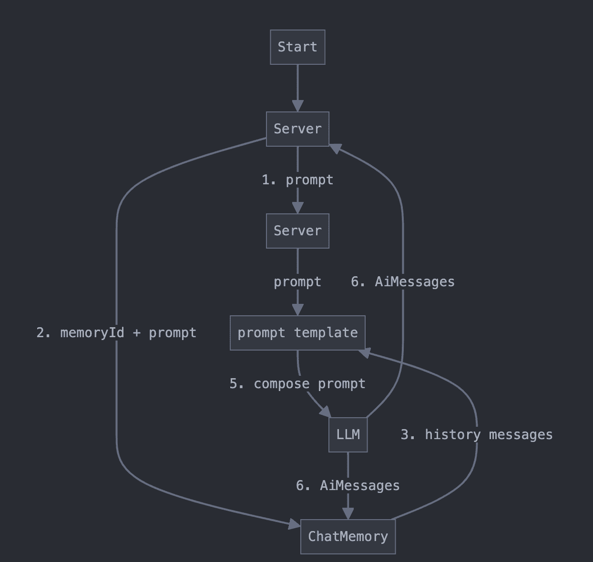
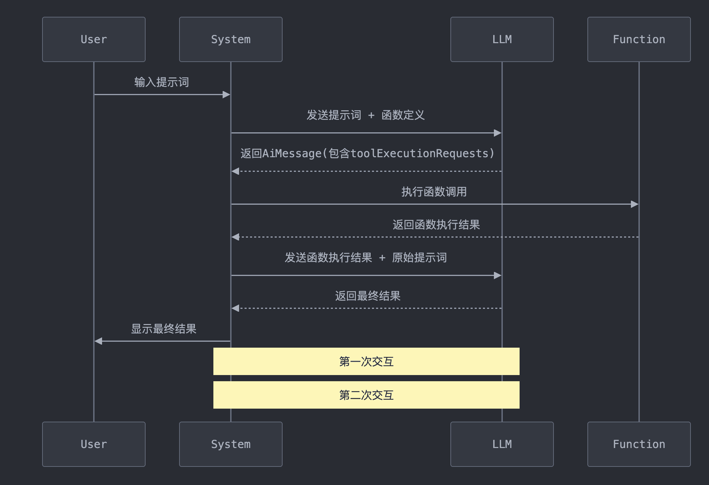

## 模型抽象：

### 大语言模型

- **`LanguageModels`** ：早期的简单 API，只接受 String 输入并返回 String 输出。此 API 已过时（根据最新官方文档）

- **`ChatLanguageModels`** ：目前推荐使用的主要 API，支持更复杂的输入和输出。接受单个或多个 ChatMessages 作为输入，并返回 AiMessage 作为输出。ChatMessage 通常包含文本，但还支持文本和Images 的混合。

### 特定功能模型

- **`EmbeddingModel`**：用于将文本转换为向量（Embedding），便于语义搜索和聚类。
- **`ImageModel`** ：用于生成和编辑图像。
- **`ModerationModel`** ：用于检测文本是否包含有害内容，确保内容安全。
- **`ScoringModel`** ：用于根据查询对文本段落进行相关性评分，适用于 RAG（检索增强生成）任务

## 模型参数

langchain4j支持对大语言模型进行参数配置，这些参数将定义

- 模型的输出：生成内容（文本、图像）中的创造力或确定性水平， 生成的内容量等。
- 连接性：基本 URL、授权密钥、超时、重试、日志记录等。

识物探趣项目是基于SpringBoot+Ollama实现的，实现步骤如下

- 在application.yml中进行参数的配置从而实现自动配置

## 消息抽象

**`ChatMessage`** 作为所有聊天消息的父类

- **`UserMessage`** ：表示用户的消息。根据 LLM，UserMessage 可以只包含文本 (String) 或文本和/或图像 （Image）。
  - 使用 **`UserMessage.from`** 方法创建对象
- **`AiMessage`** ：由 AI 生成的响应消息，通常是为了响应 **`UserMessage`**。generate 方法返回一个 AiMessage（包装在 Response 对象中），可以包含文本响应或请求执行特定工具的命令（ToolExecutionRequest）。
- **`ToolExecutionResultMessage`** ：表示 ToolExecutionRequest 的执行结果，将在后续内容中详细介绍。
- **`SystemMessage`** ：由系统生成的消息。通常用于定义对话的上下文和规则。开发人员可以在此提供 AI 应该扮演的角色、回答的方式和对话的基调等说明。LLMs 通常更关注 SystemMessage，因此要谨慎编写此消息内容，避免最终用户任意定义或修改。在SpringBoot项目中以注解 **`@SystemMessage`**



UserMessage的多模态支持

**`UserMessage`** 包含一个 **`List<Content>`** 类型的 **`contents`**。**`Content`** 是一个接口，具有以下几种实现：

- `TextContent` ：`TextContent` 是最简单的 `Content` 类型，表示纯文本，并包装一个单独的 `String`。
- `ImageContent` ：`ImageContent` 可以通过远程图片的 URL 来创建也可以通过 Base64 编码的二进制数据来创建：
- `AudioContent` ：音频内容
- `VideoContent `：视频内容
- `PdfFileContent `：PDF 文件的二进制内容



## 模型交互方法

langchain4j提供了 **`generate`**（最新版本已经废弃）和 **`chat`** 方法来和大模型进行交互，

### 模型交互Api

- **`chat`** 方法

  ```java
  default String chat(String userMessage) // 接受单个userMessage
  default ChatResponse chat(ChatMessage... messages) // 接受多个userMessage
  default ChatResponse chat(List<ChatMessage> messages) // 接受一个列表
  ```

  

- **`generate`** 方法

  ```java
  default String generate(String userMessage) 
  default Response<AiMessage> generate(ChatMessage... messages)
  Response<AiMessage> generate(List<ChatMessage> var1)
  ```


### 事件监听器

LangChain4j 支持通过 `ChatModelListener` 监听以下事件：

- 请求到达 LLM
- LLM 返回的响应
- 错误处理

具体实现

- 创建 **`ChatModelListener`** 的接口实现类
- 重写其中的所有方法
- 在对应的 **`ChatLanguageModel`** 的Bean类中添加

### 重试和超时机制

langchain4j支持通过在application.yml或者在model的Bean类中配置 **`maxRetries`** 来配置重试逻辑，指定重试次数和延迟等参数。通过**`timeout`** 配置超时机制

## 聊天记忆

langchain4j提供了聊天记忆存储功能，ChatMemory是一个用于管理聊天上下文的组件,它可以解决以下问题:

- 防止上下文超出大模型的token限制
- 隔离不同用户的上下文信息
- 简化ChatMessage的管理

### 提供功能

- Eviction policy（逐出策略）：控制哪些消息应该从记忆中移除。逐出策略用于在达到令牌或消息数限制时，删除一些不再需要的消息。通常，最早的消息会被逐出，但也可以使用更复杂的算法来决定逐出策略。
- Persistence（持久化）：将聊天记忆数据保存在外部存储（如数据库、文件系统等）中，以便在会话结束后保持对话状态。通过持久化，记忆数据可以在应用重启后恢复。
- Special treatment of SystemMessage（系统消息的特殊处理）：系统消息通常用于提供背景信息、设置对话的规则或配置一些参数。LangChain4J 提供了对系统消息的特殊处理，以便它们在记忆中发挥特定的作用或不被逐出。
- Special treatment of tool messages（工具消息的特殊处理）：工具消息通常与外部工具或API交互有关。LangChain4J 允许对工具消息进行特殊处理，比如确保它们在记忆中的处理方式与普通消息不同，或确保它们在记忆中的存储与其他消息的存储方式有所区分。



记忆与历史记录

- **历史记录**：保留了用户和 AI 之间的所有消息内容，并且这些内容是不可变的。历史记录是用户在界面中看到的内容，代表了实际的对话内容。
- **记忆** ：保留的是部分信息，这些信息被呈现给大型语言模型（LLM），让它看起来像是模型“记住”了之前的对话。记忆和历史记录的区别在于，记忆可能会通过不同的算法对历史记录进行修改，比如：逐出部分消息、汇总多条消息、删除不重要的细节、注入额外的信息（如用于 RAG 的信息）或指令（如用于生成结构化输出的指令）等。



### 相关实现类

#### MessageWindowChatMemory 类

基于消息数量的简单实现。它采用滑动窗口的方式,保留最新的N条消息,并淘汰旧消息。本质上是基于消息数量进行管理

创建方式

```java
ChatMemory chatMemory = MessageWindowChatMemory.withMaxMessages(10);
```

#### TokenWindowChatMemory类

同样采用滑动窗口的方式,但侧重于保留最新的tokens,而不是消息数量

- 更精确的token控制
- 需要结合Tokenizer计算ChatMessage的token数量
- 适用于需要严格控制token使用的场景

```java
Tokenizer tokenizer = new OpenAiTokenizer(GPT_3_5_TURBO);
ChatMemory chatMemory = TokenWindowChatMemory.withMaxTokens(1000, tokenizer);
```

### 数据持久化

Langchain4j提供了 **`ChatMemoryStore`** 用于自定义数据

```java
class PersistentChatMemoryStore implements ChatMemoryStore {

    @Override
    public List<ChatMessage> getMessages(Object memoryId) {
        // TODO: 实现从持久化存储中根据 memoryId 获取所有消息。
        // 可以使用 ChatMessageDeserializer.messageFromJson(String) 和 
        // ChatMessageDeserializer.messagesFromJson(String) 辅助方法
        // 来方便地将聊天消息从 JSON 反序列化。
    }

    @Override
    public void updateMessages(Object memoryId, List<ChatMessage> messages) {
        // TODO: 实现根据 memoryId 更新持久化存储中的所有消息。
        // 可以使用 ChatMessageSerializer.messageToJson(ChatMessage) 和 
        // ChatMessageSerializer.messagesToJson(List<ChatMessage>) 辅助方法
        // 来方便地将聊天消息序列化为 JSON。
    }

    @Override
    public void deleteMessages(Object memoryId) {
        // TODO: 实现根据 memoryId 删除持久化存储中的所有消息。
    }
}

ChatMemory chatMemory = MessageWindowChatMemory.builder()
        .id("12345") // 为 ChatMemory 指定唯一的 ID，用于区分不同的用户或会话
        .maxMessages(10) // 设置最大消息数量
        .chatMemoryStore(new PersistentChatMemoryStore()) // 设置自定义的持久化存储
        .build();

```



从 `ChatMemory` 中逐出的消息也会从 `ChatMemoryStore` 中逐出。当一条消息被逐出时，`updateMessages()` 方法会被调用，并且传入的消息列表中不包括被逐出的消息。



### 项目中的聊天记忆功能实现

#### 共享聊天

```java
public interface ChatAssistant {
    /**
     * 共享聊天
     */
    String chat(String message);
}

// 共享聊天
ChatMemory chatMemory = MessageWindowChatMemory.withMaxMessages(10);
ChatAssistant assistant = AiServices.builder(ChatAssistant.class)
        .chatLanguageModel(chatLanguageModel)
        .chatMemory(chatMemory)
        .build();

String answer1 = assistant.chat("你好！我的名字是冷冷.");
String answer2 = assistant.chat("我的名字是什么？");
```

#### 隔离聊天

```java
public interface ChatAssistant {
    /**
     * 隔离聊天
     */
    String chat(@MemoryId Long userId, @UserMessage String message);
}

ChatAssistant assistant = AiServices.builder(ChatAssistant.class)
        .chatLanguageModel(chatLanguageModel)
        // 注意每个memoryId对应创建一个ChatMemory
        .chatMemoryProvider(memoryId -> MessageWindowChatMemory.withMaxMessages(10))
        .build();


assistant.chat(1L, "你好！我的名字是冷冷1.");
assistant.chat(2L, "你好！我的名字是冷冷2.");

String chat = assistant.chat(1L, "我的名字是什么");
System.out.println(chat);
chat = assistant.chat(2L, "我的名字是什么");
System.out.println(chat);
```


## 流式响应

langchain4j提供了流式响应的能力，支持逐个token流式传输来自 LLMs 的响应

### 流式响应模型

在 `ChatLanguageModel` 和 `LanguageModel` 基础接口上，LangChain4j 提供了支持流式响应的 `StreamingChatLanguageModel` 和 `StreamingLanguageModel` 接口

流式响应模型和之前的模型具有类似的Api

### 流式请求处理

#### StreamingResponseHandler

流式响应的关键接口是 `StreamingResponseHandler`。它允许开发者定义在响应生成过程中的各个事件的处理逻辑。

```java
public interface StreamingResponseHandler<T> {

    void onNext(String token);
 
    default void onComplete(Response<T> response) {}

    void onError(Throwable error);
}
```

- **onNext(String token)**：每当生成下一个令牌时触发，通常用于将实时生成的内容及时反馈给前端。
- **onComplete(Response response)**：当模型生成完成时触发。此时返回一个完整的 `Response` 对象。对于 `StreamingChatLanguageModel`，`T` 为 `AiMessage`；对于 `StreamingLanguageModel`，`T` 为 `String`。
- **onError(Throwable error)**：当生成过程中发生错误时触发。

#### TokenStream

**`TokenStream`** 可以作为 **`generate`** 和 **`chat`** 的返回值

需要对返回的 `TokenStream` 进行订阅，分别处理 `onNext`、`onComplete` 和 `onError` 事件，并启动流式处理

```java
interface Assistant {

    TokenStream chat(String message);
}

StreamingChatLanguageModel model = OpenAiStreamingChatModel.builder()
    ...
    .build();

Assistant assistant = AiServices.create(Assistant.class, model);

TokenStream tokenStream = assistant.chat("讲个笑话");

tokenStream.onNext(System.out::println)
    .onComplete(System.out::println)
    .onError(Throwable::printStackTrace)
    .start();
```

#### Flux进行流式处理

引入依赖

```xml
<dependency>
    <groupId>dev.langchain4j</groupId>
    <artifactId>langchain4j-reactor</artifactId>
    <version>0.35.0</version>
</dependency>
```

可以将 **`Flux<String>`** 作为chat方法的返回值来实现基于SpringFlux的流式处理。使用 `Flux.subscribe` 来处理每个生成的令牌、错误和完成事件

```java
interface Assistant {

  Flux<String> chat(String message);
}

StreamingChatLanguageModel model = OpenAiStreamingChatModel.builder()
    ...
    .build();

Assistant assistant = AiServices.create(Assistant.class, model);

Flux<String> tokenFlux = assistant.chat("讲个笑话");

tokenFlux.subscribe(
    System.out::println,  // onNext
    Throwable::printStackTrace,  // onError
    () -> System.out.println("onComplete")  // onComplete
);
```

## AI服务

为了简化开发，LangChain4j提供了高层API，使开发者能够更专注于业务逻辑，而无需关注底层实现细节。高层API中，`AiService` 用于定义一个集成大模型的服务。

在Spring项目中，则需要将接口注册为Bean对象，使用 **`AiServices.builder(ChatAssistant.class).build()`** 初始化Bean

在springboot中，langchain4j通过提供类似与 **`@Service`** 的注解 **`@AIService`** 来实现自动装配

```java
@AiService
interface Assistant {
    String chat(String userMessage);
}
```

### 装配机制

#### 自动组件注入

如果这些组件在 Spring 的应用上下文（ApplicationContext）中存在，它们会被 **自动注入** 到 AI 服务：

- `ChatLanguageModel`（聊天语言模型）
- `StreamingChatLanguageModel`（流式聊天语言模型）
- `ChatMemory`（对话记忆）
- `ChatMemoryProvider`（对话记忆提供器）
- `ContentRetriever`（内容检索器）
- `RetrievalAugmentor`（检索增强器）
- **所有被 `@Component`、`@Service` 以及 `@Tool` 注解的类**，其中 `@Tool` 表示可以作为 AI 工具的方法。

#### 显式组件注入

如果你有多个 AI 服务，并且希望将不同的 LangChain4j 组件连接到每个服务中， 可以指定要与显式注入模式 一起使用的组件。`@AiService(wiringMode = EXPLICIT)` ，同时显式指定使用的组件名

```java
@AiService(wiringMode = EXPLICIT, chatModel = "openAiChatModel")
interface OpenAiAssistant {

    @SystemMessage("You are a polite assistant")
    String chat(String userMessage);
}

@AiService(wiringMode = EXPLICIT, chatModel = "ollamaChatModel")
interface OllamaAssistant {

    @SystemMessage("You are a polite assistant")
    String chat(String userMessage);
}
```

### 提示词工程

**提示词工程** 是指设计、优化和调整输入给语言模型（如 GPT、BERT 等）的问题或提示，以便模型能够生成最符合用户需求的输出。简单来说，提示词工程是一种通过精心设计输入文本来 **引导** AI 模型产生高质量、准确的结果的过程。

#### 角色设定

角色设定是指导大语言模型(LLM)行为的重要手段。通过明确定义AI助手的身份和能力范围，我们可以使其更专注于特定领域的任务。在LangChain4j中，主要利用 `@SystemMessage` 来实现。因为`SystemMessage`具有高优先级，能有效地指导模型的整体行为。

```java
@SystemMessage("你是一位专业的中国法律顾问，只回答与中国法律相关的问题。输出限制：对于其他领域的问题禁止回答，直接返回'抱歉，我只能回答中国法律相关的问题。'")
```

**`@SystemMessage`** 还支持从 resources 加载 Prompt 模板：**`@SystemMessage(fromResource = "my-prompt-template.txt")`**

#### 提示词模板

提示词模板用于提供LLM输入输出的精确性。LangChain4j提供了多种方式来使用提示词模板，让我们能够灵活地构造输入并控制输出。

- **`@UserMessage`** 用于简单的提示词模板，配合 **`@V`** 注解修饰方法的形参实现简单的提示词模板（ **`@V`** 注解在SpringBoot项目中不需要使用）

  ```
  public interface AiAssistant {
      @SystemMessage("你是一位专业的文化专家，只回答与本展馆展品相关的问题。输出限制：对于其他领域的问题禁止回答，直接返回'抱歉，我只能回答和展品相关的问题。'")
      @UserMessage("请回答以下问题：{{question}}")
      String answerLegalQuestion(@V("question") String question);
  }
  ```

  

- 定义结构化输出：如果想从 LLM 接收结构化输出， 可以将 AI Service 方法的返回类型从更改为其他类型

  - `String`
  - `AiMessage`
  - 自定义POJO（可以在POJO类的字段名中使用 **`@Description`** 让LLM更加理解字段名

### 工具调用

函数调用让 LLM 能够根据输入的提示,生成一个调用特定函数的请求。这个请求包含了函数名称和所需的参数信息。通过这种方式,我们可以将 LLM 的智能与外部工具或 API 无缝连接。通过Tools机制可以通过自然语言整合大模型和系统内部功能，使得大模型这个智能大脑拥有了灵活的四肢，从而可以处理更复杂的场景

**LLM 本身并不执行函数,它只是指示应该调用哪个函数以及如何调用**



#### 工作流程

- 用户向系统输入提示词，然后系统将带有提示词的工具请求发送给LLM
- LLM根据提示词和工具的描述,返回带有需要调用的函数名称和参数函数调用请求
- 系统根据LLM返回的参数执行对应的工具方法，并将函数执行结果和原始提示词一起发给LLM
- LLM根据原始提示词和函数执行结果生成最终结果

#### 低级抽象层次

在AIService的Bean类中实现ToolSpecification（工具说明）和 ToolExecutor（业务逻辑），然后在AIService中的tools字段中加入

ToolSpecification对象就代表一个工具，当用户把要问题UserMessage和工具ToolSpecification一起传递给大模型，大模型就知道要结合工具描述来解决用户的问题，此时大模型响应的AiMessage不再是一串文本

ToolExecutionRequest，表示一个工具执行请求，表示大模型在解决问题时，需要调用工具来解决用户的问题，由于可能传了多个工具给大模型，所以toolExecutionRequests是一个List，表示为了解决用户的问题需要调用哪些工具。

```java
@Bean
public FunctionAssistant functionAssistant(ChatLanguageModel chatLanguageModel) {
    // 工具说明 ToolSpecification
    ToolSpecification toolSpecification = ToolSpecification.builder()
            .name("invoice_assistant")
            .description("根据用户提交的开票信息，开具发票")
            .addParameter("companyName", type("string"), description("公司名称"))
            .addParameter("dutyNumber", type("string"), description("税号"))
            .addParameter("amount", type("number"), description("金额"))
            .build();

    // 业务逻辑 ToolExecutor
    ToolExecutor toolExecutor = (toolExecutionRequest, memoryId) -> {
        String arguments1 = toolExecutionRequest.arguments();
        System.out.println("arguments1 =>>>> " + arguments1);
        return "开具成功";
    };

    return AiServices.builder(FunctionAssistant.class)
            .chatLanguageModel(chatLanguageModel)
            .tools(Map.of(toolSpecification, toolExecutor))
            .build();
}
```

#### 高级抽象层次

通过使用注解 `@Tool`，可以更方便地集成函数调用。LangChain4j 的 AI 服务会自动处理工具执行，无需手动管理工具请求。

**工具定义**：只需将Java方法标注为 `@Tool`，LangChain4j 就会自动将其转换为 `ToolSpecification`，并且在与LLM交互时调用这些方法。

**`@Tool`** 的字段

- `name`：工具的名称。如果未提供，则方法的名称将用作工具的名称。
- `value`：工具的描述。

方法参数使用 `@P` 修饰

**`@P`** 的字段

- `value`：参数的描述。必填字段。
- `required`：参数是否为必填项，默认为 。可选字段。`true`

**`@ToolMemoryId`**：当工具方法需要根据**当前用户的聊天上下文**来进行操作时

**`@Description`** ：指定类和字段的描述

```java
@Slf4j
public class InvoiceHandler {
    @Tool("根据用户提交的开票信息进行开票")
    public String handle(String companyName, String dutyNumber,@P("金额保留两位有效数字") String amount) {
        log.info("companyName =>>>> {} dutyNumber =>>>> {} amount =>>>> {}", companyName, dutyNumber, amount);
        return "开票成功";
    }
}

@Bean
public FunctionAssistant functionAssistant(ChatLanguageModel chatLanguageModel) {
    return AiServices.builder(FunctionAssistant.class)
            .chatLanguageModel(chatLanguageModel)
            .tools(new InvoiceHandler())
            .build();
}
```

#### 动态工具调用配置

LangChain4j 支持动态工具配置，开发者可以基于用户输入的上下文，在运行时动态加载工具。通过 `ToolProvider` 接口，工具集会在每次请求时动态生成

```java
ToolProvider toolProvider = (toolProviderRequest) -> {
    if (toolProviderRequest.userMessage().singleText().contains("booking")) {
        ToolSpecification toolSpecification = ToolSpecification.builder()
            .name("get_booking_details")
            .description("Returns booking details")
            .addParameter("bookingNumber", type("string"))
            .build();
        return ToolProviderResult.builder()
            .add(toolSpecification, toolExecutor)
            .build();
    } else {
        return null;
    }
};

Assistant assistant = AiServices.builder(Assistant.class)
    .chatLanguageModel(model)
    .toolProvider(toolProvider)
    .build();
```

