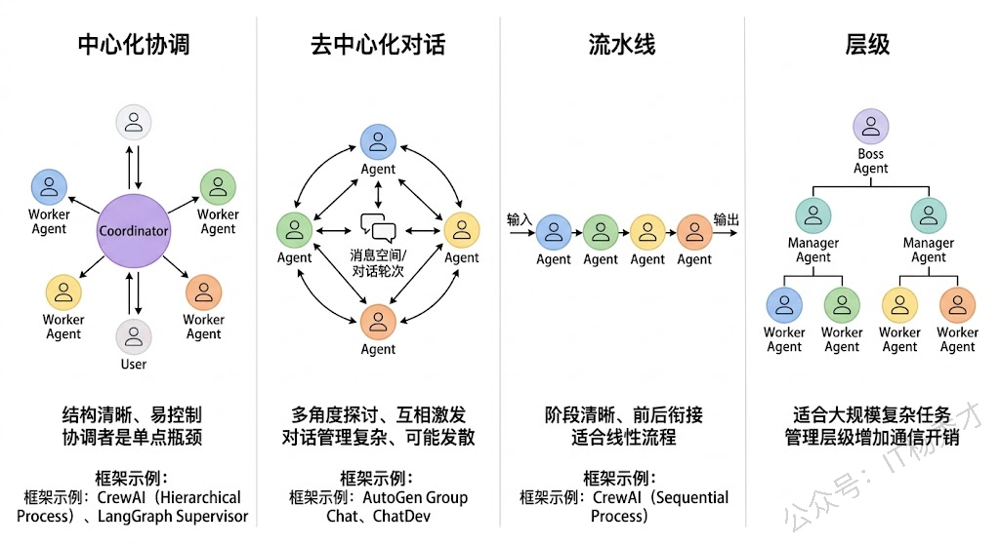

## 🧠 单Agent的瓶颈

要理解多智能体系统，最好的切入点是先搞清楚：**单个Agent到底在什么时候不够用了？**

  

回顾单Agent的架构——一个LLM作为中枢大脑，配上工具、记忆、规划能力，通过ReAct等框架来完成任务。这套架构在很多场景下确实好用，但随着任务复杂度的提升，它会遇到几个瓶颈。

- **第一个瓶颈是角色过载。** 当你让一个Agent同时扮演"需求分析师 + 架构师 + 程序员 + 测试员"时，它的System Prompt会变得又长又复杂，各种角色的指令互相干扰，模型很难在一个上下文里同时保持多种角色的专业能力。就像现实中一个人同时做四份工作，每份都做不精。

- **第二个瓶颈是上下文窗口的压力。** 一个复杂任务涉及大量的工具定义、历史对话、中间推理状态，全部塞进一个Agent的上下文窗口，很快就撑满了。即使窗口够大，信息太多也会导致"Lost in the Middle"问题，关键信息被淹没。

- **第三个瓶颈是串行执行的效率问题。** 单Agent只有一个LLM在推理，所有步骤只能串行执行。如果任务中有可以并行的部分（比如同时分析三个竞品），单Agent也只能一个一个来。

多智能体系统就是为了突破这些瓶颈而出现的。

---

## 🤝 什么是多智能体系统

多智能体系统（Multi-Agent System，MAS）是指**多个具有不同角色、专长或职责的Agent组成一个协作网络，通过互相通信和配合来共同完成一个复杂任务**。

你可以把它类比为一个公司的团队协作。单Agent就像一个全栈的"独行侠"，什么都自己干。而多智能体系统就像一个有明确分工的项目团队——有产品经理负责理解需求、架构师负责设计方案、程序员负责写代码、测试负责验证质量，每个人都专注于自己最擅长的领域，通过沟通协作来完成整个项目。

  

在技术实现层面，多智能体系统的每个Agent本质上是LLM驱动的，但每个Agent有自己独立的**System Prompt**（定义角色和职责）、**工具集**（只挂载与自己职责相关的工具）、以及**记忆空间**（可以有私有记忆也可以共享部分记忆）。Agent之间通过某种**通信机制**（消息传递、共享黑板、管道等）来交换信息和协调行动。

---

## ⚡ 多Agent协作的核心优势

理解了"为什么需要多Agent"之后，优势就很自然了：

- **专业化分工带来的质量提升**是最大的优势。每个Agent只负责一个明确的角色，它的System Prompt可以写得非常精确和专注，挂载的工具也只需要和它的职责相关。这样LLM在推理时的"认知负荷"大幅降低，做出高质量决策的概率明显提高。就像你不会让一个前端工程师去写数据库优化SQL一样，专业的事交给专业的Agent。实验也验证了这一点——在代码生成任务中，让一个Agent同时写代码和审核代码的效果，明显不如让一个"Coder Agent"写代码然后让一个独立的"Reviewer Agent"做代码审查。因为后者在审查时不会带有"这是我自己写的代码"的认知偏见。

- **上下文隔离带来的效率提升**也非常显著。每个Agent只需要在自己的上下文中保留与自身职责相关的信息，不需要装载其他Agent的工具定义和历史记录。这不仅降低了单个Agent的token消耗，也避免了信息过多导致的注意力分散。

- **并行执行带来的速度提升**在很多场景下都很有价值。多个Agent可以同时处理任务的不同部分——比如在一个数据分析场景中，一个Agent在查询销售数据的同时，另一个Agent可以去查询用户反馈数据，最后由一个汇总Agent把两边的结果合并分析。这比单Agent串行执行两次查询要快得多。

- **容错和鲁棒性**也得到了改善。多个Agent可以互相检查和验证对方的输出——一个Agent写了代码，另一个Agent来测试；一个Agent做了分析，另一个Agent来验证逻辑是否自洽。这种"交叉检验"的机制在单Agent架构中很难实现。

---

## 🔀 主流的多Agent协作模式

在实际工程中，多Agent之间的协作方式不是随意的，而是有几种成熟的模式。理解这些模式对于实际项目设计都很重要。

  

- **中心化协调模式（Orchestrator Pattern）** 是最常见的模式。有一个"协调Agent"（也叫Supervisor / Manager）作为中枢，它负责接收用户任务、分配子任务给各个专业Agent、收集结果、做最终汇总。其他Agent不直接互相通信，而是都和协调Agent交互。这种模式结构清晰、容易控制，但协调Agent是单点瓶颈——如果它的判断出错，整个团队都会被带偏。

- **去中心化对话模式（Debate / Discussion Pattern）** 允许多个Agent之间直接对话讨论。比如让一个"正方Agent"和一个"反方Agent"围绕一个问题展开辩论，最后由一个"裁判Agent"做总结。这种模式在需要多角度分析的场景中很有效，但对话管理更复杂。

- **流水线模式（Pipeline Pattern）** 是把任务拆成多个阶段，每个阶段由一个Agent负责，上一个Agent的输出是下一个Agent的输入，形成一条流水线。比如"需求分析Agent → 设计Agent → 编码Agent → 测试Agent"，就是一条典型的软件开发流水线。这种模式适合阶段明确、前后依赖关系清晰的任务。

- **层级模式（Hierarchical Pattern）** 是中心化模式的扩展。顶层有一个总协调Agent，它把任务分配给几个中层Manager Agent，每个Manager再管理自己下属的Worker Agent。这种模式适合规模更大、层次更深的复杂任务。

---

## ⚠️ 多Agent引入的新复杂性

多Agent不是银弹，它在解决单Agent瓶颈的同时，也引入了一系列单Agent时代完全不存在的新问题。

  

- **通信开销与信息一致性**是第一个大问题。多个Agent之间需要互相传递信息，但传什么、传多少、什么时候传，都需要精心设计。传少了，下游Agent缺乏足够的上下文做出好的决策；传多了，又变成了变相把所有信息塞进一个超大上下文的老问题。更棘手的是**信息一致性**——Agent A在第3步更新了对任务的理解，但Agent B可能还在基于第1步的旧信息工作，这种信息不同步会导致协作混乱。
实际项目中，常见的做法是设计一个**共享状态空间（Shared State）**——所有Agent都可以读写的公共黑板。LangGraph中的State就是这个思路，每个Node（Agent）读取State中自己需要的字段、写回自己产出的结果，由图引擎保证状态的一致性。

- **任务分配与协调成本**是第二个问题。谁来决定把哪个子任务分给哪个Agent？分完之后怎么知道各个Agent的执行进度？某个Agent失败了怎么重试或换人？这些在人类团队中靠项目经理和日会来解决的问题，在多Agent系统中需要靠一个可靠的"协调机制"来处理。而这个协调者本身也是一个LLM驱动的Agent，它的决策同样有不确定性——可能分配错任务、可能误判执行进度、可能做出不合理的重新规划。

- **调试难度的指数级增长**是第三个问题，也是在实际项目中感知最强烈的痛点。单Agent的调试已经够难了——推理链长、不可复现、黑箱不透明。多Agent把这个难度又放大了一个量级：你需要追踪多个Agent之间的消息流、理解每个Agent独立的推理链、还要排查它们之间的交互是否正确。当一个多Agent系统给出了错误结果时，可能是Agent A的分析有误、也可能是Agent B在传递信息时丢了关键细节、也可能是协调Agent在汇总时做了错误的判断——定位问题的空间比单Agent大得多。

- **成本控制**也是一个现实挑战。多Agent意味着多次LLM调用，而且Agent之间的通信本身也常常需要LLM来做"翻译"和"理解"。一个3个Agent的系统完成一次任务，总LLM调用次数可能是单Agent的3-5倍甚至更多。在token单价还没有降到足够低的阶段，这在很多B2C场景中是不可接受的成本。

---

## 🛠️ 主流框架和工程选型

了解了原理和挑战之后，如果能结合框架来谈就很有说服力了。

  

**CrewAI** 是目前最流行的多Agent框架之一，它用Role-Based的方式定义Agent——每个Agent有自己的Role（角色）、Goal（目标）、Backstory（背景故事），像定义一个角色扮演游戏的角色一样。支持Sequential（流水线）和Hierarchical（层级）两种协作模式，上手非常简单。

**AutoGen**（微软出品）侧重于多Agent对话场景，支持Group Chat模式让多个Agent在一个对话组里讨论问题，非常适合需要多角度探讨的场景。

**LangGraph** 虽然不是专门的多Agent框架，但它的图编排能力天然适合构建多Agent系统——每个Node可以是一个独立的Agent，Node之间的边定义了通信和数据流转，通过State做共享状态管理。它的灵活性最高，但上手门槛也最高。

**选型原则：**

- 如果任务可以分成几个明确的角色用流水线或层级方式协作，**CrewAI**是最快的选择
- 如果需要Agent之间自由讨论辩论，**AutoGen**更合适
- 如果需要高度定制的复杂协作流程，**LangGraph**给你最大的控制力

---

## 📝 总结

多智能体系统是指多个具有不同角色和专长的Agent组成协作网络，通过通信和分工来共同完成复杂任务。它的出现本质上是为了解决单Agent的三个瓶颈：**角色过载**导致Prompt臃肿、**上下文压力**撑满窗口、**串行瓶颈**无法并行。

多Agent对应带来了几个核心优势：专业化分工让每个Agent的Prompt精简且专注，决策质量显著提升；上下文隔离让每个Agent只关注自己职责范围内的信息；可并行执行的子任务交给不同Agent同时处理大幅缩短耗时；多个Agent可以互相检查和验证输出。

但多Agent也引入了新复杂性：**通信层面**传什么信息、如何保持状态一致性需要精心设计；**协调层面**任务怎么分、进度怎么跟、失败怎么重试都依赖协调者判断；**工程层面**调试难度指数级增长；还有**成本问题**——N个Agent通信M轮意味着LLM调用次数成倍增长。

实际经验是：多Agent不应该是默认选择，而应该是**单Agent确实遇到瓶颈后的升级方案**——能用单Agent搞定的就不要上多Agent，因为复杂性本身就是成本。
