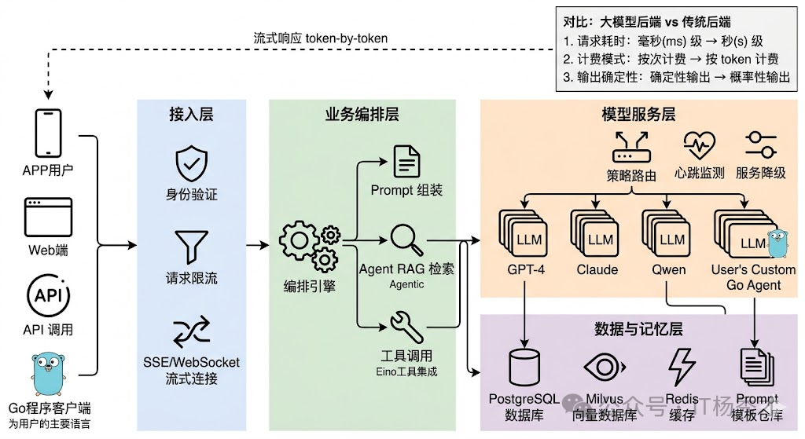
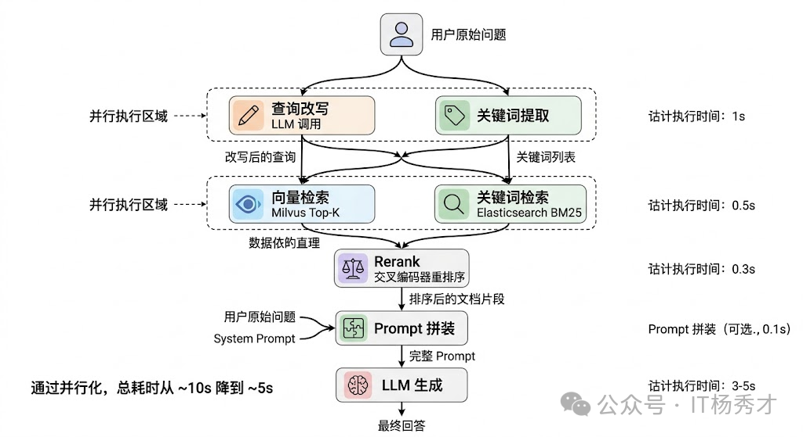
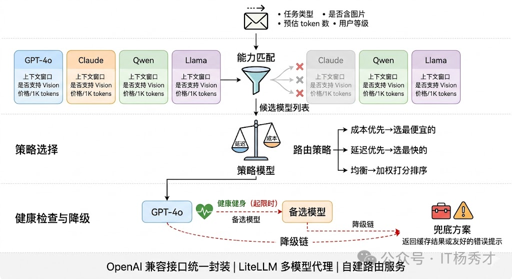
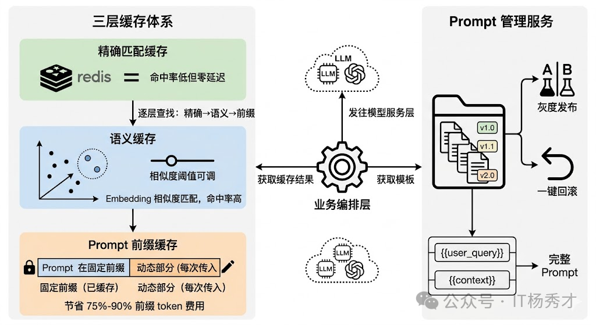

## 🧠 大模型应用后端架构的本质

大模型应用的后端架构，本质上是在解决一个问题：如何让大模型（LLM）在生产环境中可靠、高效、可控地提供服务。这个问题看似简单——调个 API 就能跑——但当你真正要做产品时，API 调用只是冰山一角。

**一个真实的大模型应用需要考虑的核心问题包括：**

- 如何管理海量的 Prompt 模板和变量替换？
- 如何处理多轮对话的上下文和会话状态？
- 如何控制成本——LLM 调用是按 token 计费的？
- 如何保证系统的稳定性——LLM 服务的 SLA 和自建模型的可靠性？
- 如何实现复杂业务流程，比如 RAG、Agent、多模型路由？
- 如何做监控和可观测性——知道每次回答是怎么生成的？

这些问题的答案就构成了大模型应用后端架构的主体。和传统后端架构不同，LLM 应用有其独特的挑战：LLM 调用是外部依赖、成本高昂、延迟不稳定、输出不可预测——这意味着架构设计必须有针对性地应对这些问题。

传统 Web 后端的核心瓶颈通常在数据库——查询慢了加索引，并发高了加缓存，数据量大了分库分表，整套方法论经过十几年的打磨已经非常成熟。但当你把 LLM 引入后端架构的那一刻，这些规则就变了。一个普通的数据库查询耗时毫秒级，一次 LLM 调用动辄几秒甚至十几秒；数据库查询按次计费几乎可以忽略不计，LLM 调用按 token 收费，一个活跃用户一天的对话成本可能就是几毛到几块钱；最关键的是，数据库查询是确定性的，同样的 SQL 永远返回同样的结果，而 LLM 的输出每次都可能不同。慢、贵、不确定——就是后端架构设计必须要考虑的三大核心因素

---
## 🏗️ 整体分层与请求流转
一个生产级的大模型应用后端，从外到内通常可以分成四层：接入层负责协议处理、认证鉴权和流量控制；业务编排层负责理解用户意图、组装 Prompt、编排多步调用逻辑；模型服务层负责管理和调用各种 LLM，做路由、负载均衡和容错降级；数据与记忆层负责对话历史、向量检索、用户画像等持久化存储。

这四层的划分看起来和传统微服务架构差不多，但每一层内部的设计重心完全不同。传统后端的接入层主要关心的是鉴权和限流，大模型应用的接入层还要处理 SSE 长连接和流式传输；传统后端的业务层通常是"接收请求→查数据库→返回结果"这种同步短链路，大模型应用的业务层可能需要编排多轮 LLM 调用、工具调用、RAG 检索，整个链路又长又慢；传统后端的数据层主要是关系型数据库，大模型应用的数据层还要加上向量数据库、会话缓存、Prompt 模板库等一系列新组件。

  

## 📡 接入层

接入层是整个系统的入口，负责接收来自前端的请求并返回响应。这层的设计要点包括：

- **鉴权与限流**：API Key 验证、用户配额控制、请求频率限制
- **协议转换**：将 HTTP/WebSocket 请求转换为内部处理协议
- **响应缓存**：对于重复或相似的请求，直接返回缓存结果以节省成本

对于接入第三方 LLM API（如 OpenAI、Claude、国内厂商）的场景，接入层还需要处理多 API Key 的负载均衡和自动切换、API 兼容层、重试机制和熔断策略。

流式传输是大模型后端架构必须把流式响应作为一等公民来设计。实现方案主要是 SSE 或 WebSocket。

流式传输带来的工程复杂度不小。中间件兼容性是第一个坑——Nginx 默认会缓冲后端响应再一次性发给客户端。错误处理的时机也变了——流式场景下 HTTP 200 已经发出去了，中间出错没法改状态码。

  

## 🧩 业务编排层

### ⚙️ 异步与任务编排
传统 Web API 绝大部分请求可以在几百毫秒内同步返回，但大模型应用中有大量"重任务"——比如基于 RAG 的长文档问答（需要先检索、再拼装、再调用 LLM）、多步 Agent 任务（可能涉及十几次工具调用和 LLM 推理）、批量内容生成等。这些任务的耗时可能从十几秒到几分钟不等，用同步 HTTP 请求来承载显然不合适。

成熟的做法是把重任务走异步任务队列——用户提交后立即返回 task_id，后台 Worker 异步执行，前端通过轮询或 WebSocket 接收进度推送。Celery + Redis 是 Python 生态最常用的方案。

异步任务内部还需要一个编排引擎来协调多步骤的执行。比如一个 RAG 问答流程：先并行执行"查询改写"和"关键词提取"，完成后再并行做"向量检索"和"关键词检索"，汇总后 Rerank，最后送入 LLM 生成回答。这里面有串行有并行，步骤之间有数据依赖。LangGraph 用有向图来定义这种编排逻辑，每个节点是一个处理步骤，边定义数据流向和条件分支，比较适合这种场景。

  

## 🎛️ 模型服务层

模型服务层是大模型应用的核心，负责调度各种模型资源来完成复杂的任务。这层的设计直接决定了应用的能力上限，因为它要直接面对 LLM 的"慢、贵、不确定"三大特性。

**模型服务层的核心职责包括：**

- **模型选择**：根据任务类型自动选择最合适的模型（小模型快省、大模型准贵）
- **意图识别**：判断用户意图，决定走哪个处理路径
- **任务分解**：将复杂任务拆解为多个子任务，分配给不同模型或工具
- **结果聚合**：整合多个子任务的结果，生成最终响应

### 🔀 多模型路由与降级

多模型路由与降级是这一层最核心的设计。生产环境中几乎不会只用一个模型——你可能用 GPT-4o 做复杂推理、用 Claude 做长文档理解、用开源的 Qwen 做一些简单的分类和提取任务。这就需要一个模型路由器，根据任务类型、复杂度、成本预算等条件把请求分发到合适的模型。更重要的是降级策略：当首选模型 API 超时或返回错误时，系统应该自动 fallback 到备选模型，而不是直接报错给用户。一个典型的降级链可能是 GPT-4o → Claude → Qwen，越往后模型能力可能稍弱但可用性更高。

实现上，路由器通常维护一张模型能力矩阵——记录每个模型的上下文窗口、支持的功能（Function Calling、Vision 等）、平均延迟、每千 token 价格和当前健康状态。路由决策可以基于规则（"含图片的请求只发给支持 Vision 的模型"），也可以基于策略（"优先选延迟最低的健康模型，成本超阈值时降级"）。

  

## 💾 数据与记忆层

### 🗃️ 缓存策略
缓存在传统后端是锦上添花，在大模型后端是必须有的基础设施。原因很直接：LLM 调用既慢又贵，如果同样的问题能从缓存中直接返回，省下的时间和成本非常可观。

最直接的是精确匹配缓存——把用户输入的 hash 作为 key，LLM 的响应作为 value 存入 Redis。完全相同的问题直接命中缓存，延迟从几秒降到几毫秒。但这种方案的命中率通常很低，因为自然语言表达的多样性意味着同一个意思有无数种问法，"Python 怎么读取 JSON 文件"和"用 Python 解析 JSON 文件的方法"虽然语义相同但 hash 完全不同。

所以更实用的是语义缓存（Semantic Cache）。核心思路是把用户输入转成 Embedding 向量，在缓存中做向量相似度检索，相似度超过阈值就直接返回缓存结果。GPTCache 就是专门做这个的开源方案。语义缓存的命中率远高于精确匹配，但相似度阈值需要根据业务场景调优——设太高命中率低，设太低可能返回不太相关的结果。

还有一层容易被忽视的缓存是 Prompt 模板缓存。在实际项目中，System Prompt 和 Few-shot 示例通常是固定的，每次请求都带上这些固定前缀会浪费大量 token。OpenAI 的 Prompt Caching 和 Anthropic 的 Cache Control 机制就是针对这个场景——把 Prompt 的固定前缀缓存在模型服务端，后续请求只需传增量部分，既减少了网络传输量也降低了 token 费用（缓存命中的 token 价格通常是原价的 10%-25%）。

### 📝 Prompt 管理

Prompt 是 LLM 应用的"灵魂"，Prompt 管理的质量直接影响输出效果。一个成熟的 Prompt 管理体系包括：

- **模板存储**：结构化存储 Prompt 模板，支持版本管理
- **变量替换**：运行时动态填充变量（用户名、时间、上下文等）
- **模板组合**：将多个子模板组合成完整 Prompt
- **A/B 测试**：对比不同 Prompt 版本的效果差异

Prompt 在大模型应用中的角色，相当于传统应用中的业务逻辑代码——它直接决定了应用的行为和输出质量。但很多团队在早期会犯一个错误：把 Prompt 硬编码在代码里，和业务逻辑混在一起。这在原型阶段没问题，但一旦进入生产环境就会遇到各种麻烦。问题一是迭代效率低——Prompt 的调优频率远高于代码，你可能每天都要微调措辞、补充示例，如果写在代码里每次都要走完整的发布流程，太重了。问题二是版本管理和回滚——Prompt 改了一版效果变差想回滚，如果和代码绑定就会影响同次发布的其他功能。

  

所以生产环境中通常会建一个独立的 Prompt 管理服务，本质上是一个带版本控制的模板仓库，支持灰度发布（10% 流量走新 Prompt）和快速回滚。模板通过变量占位符（{{user_query}}、{{context}}）和业务数据做动态拼装。LangFuse 和 PromptLayer 都提供了这种能力。

---

## 📌 总结

大模型应用的后端架构，本质上是在传统后端架构的基础上，针对 LLM 的独特特性做适配和优化。核心要点包括：

- **分层清晰**：接入层、编排层、数据层各司其职
- **成本意识**：从架构层面控制 token 消耗
- **可靠性设计**：重试、熔断、降级缺一不可
- **可观测性先行**：没有监控的 LLM 应用是盲人摸象
- **渐进演进**：从简单开始，按需增加复杂度

架构没有绝对的好坏，只有适合不适合。选什么架构，取决于你的业务复杂度、团队规模、成本预算和对稳定性的要求。理解这些核心组件和模式，才能在具体场景下做出正确的架构决策。
