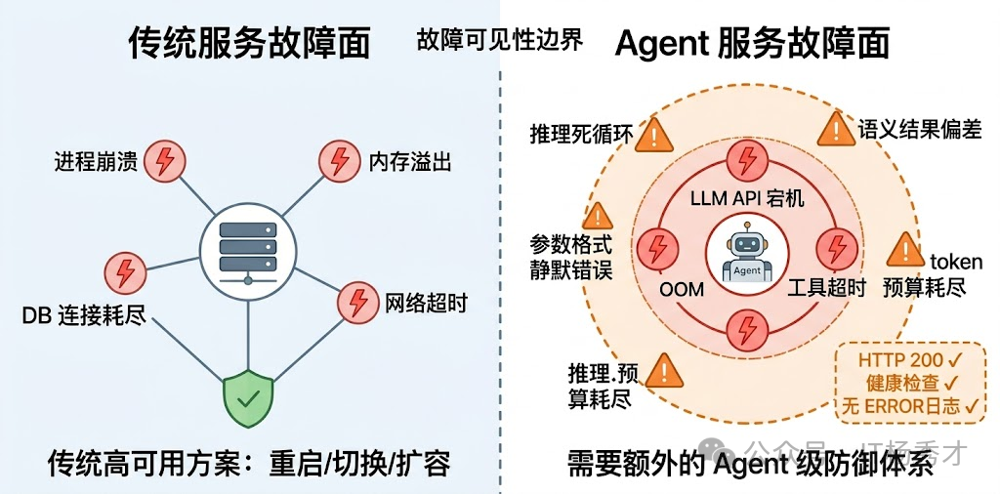
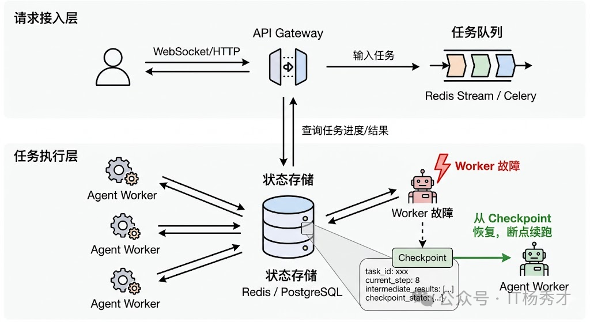
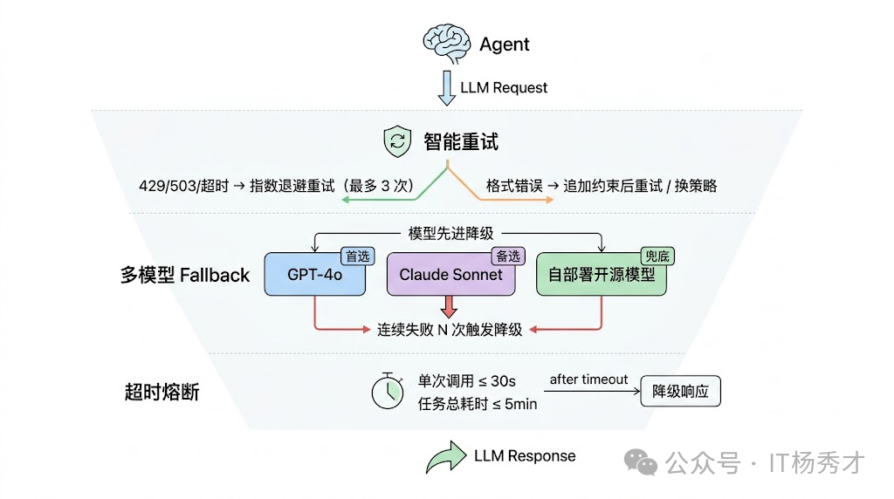
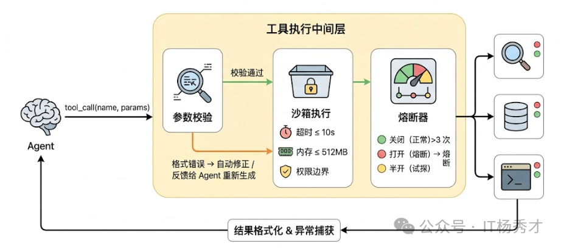
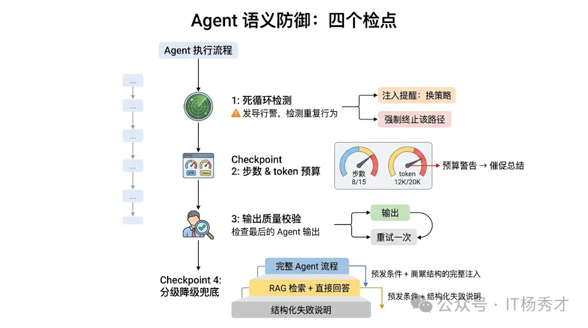
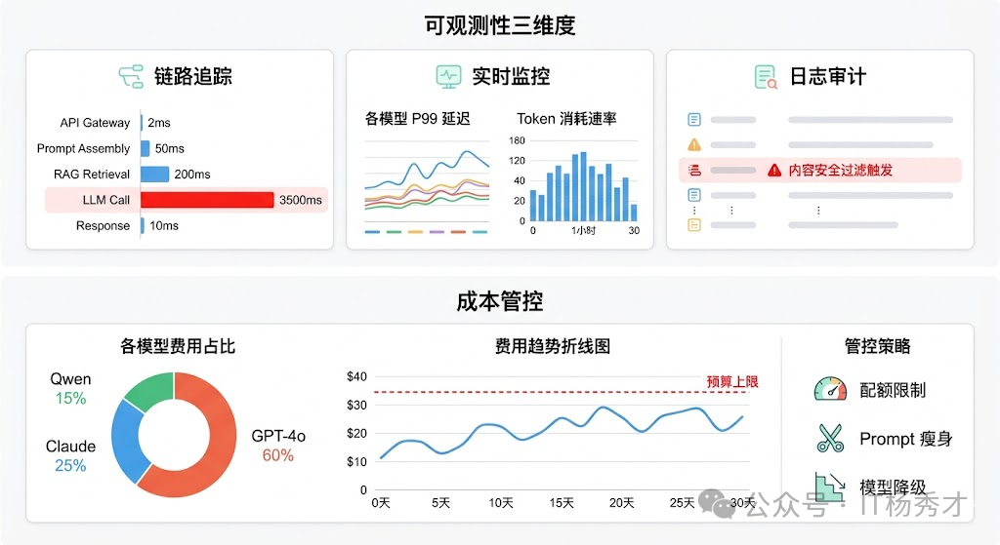

## 🧠 Agent 服务的故障面

高可用性（High Availability）是分布式系统的核心目标之一，但对大模型应用来说，实现高可用有其独特的挑战。传统 Web 服务的故障模式比较好理解：进程崩溃、内存溢出、数据库连接池耗尽、网络抖动……这些故障有一个共同特点——服务要么在工作，要么明确地挂了，监控系统能很快感知到，然后触发重启或切换。传统 Web 服务的高可用方案已经非常成熟——多实例部署、负载均衡、数据库主从复制，这些手段足以应对大多数场景。但当你的系统依赖大语言模型时，游戏规则就变了。

Agent 服务除了这些硬故障之外，还有一大类传统服务里几乎不存在的软故障：服务在技术层面完全正常运行、没有任何报错，但 Agent 的行为已经出了问题——它可能在重复调用同一个工具、可能生成了格式错误的参数导致下游静默失败、可能在推理上兜圈子消耗大量 token 却没有任何进展、也可能给出了一个看起来合理但实际上完全错误的结果。

这类"软故障"之所以危险，是因为它们不会触发传统意义上的告警。你的健康检查是绿的，HTTP 状态码是 200，日志里没有 ERROR——但用户拿到了一个垃圾结果，或者等了两分钟什么都没收到。

所以，Agent 服务的高可用设计需要在传统基础设施层之上，额外构建一套针对 Agent 特有故障模式的防御体系。

  

---

## 🔄 业务编排层的高可用
Agent 和传统 API 最大的区别之一是执行链路长且有状态。一个传统 API 请求通常是无状态的——请求进来、处理、返回结果，毫秒级完成。但一个 Agent 任务可能要跑几分钟，中间经历十几步推理和工具调用，每一步的结果都是下一步的输入。如果在执行到第 8 步的时候服务突然重启了，前面 7 步的所有工作就全白费了。
### 📚 Checkpoint 机制
在 Agent 执行链路的关键节点做状态快照：当前执行到了哪一步、已经收集到了哪些中间结果、上下文中有哪些信息。这些快照持久化到 Redis 或数据库中。如果服务中断后恢复，Agent 可以从最近的 Checkpoint 继续执行，而不是从头开始。LangGraph 的 Checkpoint 机制就是这个思路的典型实现——它把图执行过程中每个节点的状态都存下来，支持任意节点的恢复和重放。

Checkpoint 机制还带来了一个额外的好处：断点续跑。在生产环境中，用户可能发起一个需要长时间运行的 Agent 任务（比如"帮我分析这 10 个竞品的产品策略"），中间因为网络波动或用户主动断开连接了。有了 Checkpoint，用户重新连接后可以直接从上次断开的地方继续，不需要重跑。

  

### 🔗 连接解耦
把 Agent 的任务执行和用户的请求连接解耦。不要让 Agent 的执行直接绑定在一个 HTTP 长连接上，而是把任务提交到一个异步队列（比如 Celery、RQ 或者直接用 Redis Stream），Agent Worker 从队列中取任务执行，执行过程中的中间结果和最终结果写到状态存储中，前端通过轮询或 WebSocket 来获取进度和结果。这样即使某个 Worker 挂了，队列中的任务会被其他 Worker 自动接管（结合 Checkpoint 从断点恢复），用户完全无感。

---

## 🏗️ 模型服务层的高可用
### 💎 LLM 调用时的高可用
Agent 的每一步推理都要调用 LLM，所以 LLM API 的稳定性直接决定了整个服务的可用性上限。但现实情况是，不管是调用 OpenAI 还是自部署的模型，LLM API 都是整条链路中最不稳定的环节之一——它可能限流（429）、可能超时、可能返回不完整的响应、甚至可能整个服务不可用。

  

#### 🚦 限流保护
限流是保护系统的第一道防线。对于 LLM 应用，限流有两个维度：

- 用户维度限流
    - 按 API Key 或用户 ID 设置每日/每分钟请求配额
    - 超出配额后返回 429 状态码或触发降级
    - 防止单个用户耗尽整个系统的容量
- 系统维度限流
    - 限制对外部 LLM API 的并发请求数
    - 超过阈值的请求进入队列等待，而不是直接拒绝
    - 保护外部服务不被你的流量冲垮

#### 🔁 重试机制
最基本的防御是重试机制，但 Agent 场景下的重试和传统服务的重试有一个重要区别：LLM 调用的成本很高（每次都消耗 token），而且由于输出的不确定性，重试不一定能得到更好的结果。所以不能无脑重试，需要区分情况：网络超时和限流（429/503）值得重试，因为问题出在通道而不是请求本身；但如果是模型返回了不符合预期格式的内容，简单重试大概率还是一样的结果，这时候更好的策略是调整 Prompt（比如追加更明确的格式约束）后再重试，或者直接换一个模型。

- 设置最大重试次数（通常 2-3 次）
- 使用指数退避而非立即重试
- 只对临时性故障（超时、限流）重试，不对业务错误重试
- 重试时加入随机抖动，避免惊群效应

#### 🛡️ 降级策略
降级是高可用架构的核心——当主要路径不可用时，提供一个"还算能用"的替代方案。
对于 LLM 应用，降级策略可以分为几个层次：

**第一层：模型降级**
说到模型降级，这就引出了 Agent 服务高可用的一个核心策略：多模型 Fallback。生产环境中不能把命运绑在单一模型供应商上。当 GPT-4 不可用时，自动切换到 GPT-3.5；当 Claude 不可用时，切换到国产模型。这要求你的系统在设计时就支持多模型，需要维护一张模型能力矩阵和降级链。一个典型的设计是建一个 LLM Gateway 层，维护一个模型能力矩阵和降级链——首选 GPT-4o，如果连续失败 N 次就自动降级到 Claude Sonnet，再不行就降到自部署的开源模型。降级确实会带来质量下降，但"质量稍差的回答"远好过"完全不可用"。

**第二层：功能降级**

当 LLM 完全不可用时，提供基于规则或关键词匹配的兜底回复。比如：

- 常见问题（FAQ）用正则匹配直接返回预设答案
- 无法处理的请求返回"当前服务繁忙，请稍后再试"
- 记录降级事件用于后续分析和改进

**第三层：静态降级**

最终兜底——当所有降级策略都无法满足需求时，系统返回一个完全静态的友好提示页面。页面内容应包含：当前服务状态说明（如"AI 服务暂时不可用"）、预计恢复时间或联系支持渠道、用户可采取的临时措施（如稍后重试、联系客服等）。确保用户不会看到原始技术错误信息，同时提供有价值的后续行动指引。

还有一个容易被忽视的点是超时控制。LLM 生成长文本时可能需要十几秒甚至更久，如果不设合理的超时，一个慢请求就可能占住一个工作线程很长时间。在 Agent 场景下尤其严重，因为一次用户请求可能触发 5-10 次 LLM 调用，如果每次调用都卡住 30 秒，总耗时就完全不可控了。所以需要对单次 LLM 调用设超时（通常 15-30 秒），对整个 Agent 任务也设总超时（通常 2-5 分钟），任何一个先触发就终止执行并返回降级结果。

### 🧰 工具执行时的防御
Agent 的能力边界取决于它能调用哪些工具，但工具调用在生产环境中是出了名的脆弱。搜索引擎 API 可能限流，数据库查询可能超时，第三方接口可能返回格式变了的数据，本地执行的代码工具可能因为恶意输入导致安全问题。

  

#### 沙箱机制
工具层防御的核心思路是隔离与限制。每个工具调用都应该在一个受控的沙箱环境中执行：有独立的超时限制（不能让一个工具把整个 Agent 卡住）、有资源配额（CPU、内存、网络带宽的上限）、有权限边界（工具只能访问它被授权的资源）。如果是代码执行类工具，还需要沙箱隔离来防止任意代码执行带来的安全风险。

#### ⚡ 熔断器模式
在此基础上，借鉴微服务领域的熔断器模式非常有效。为每个工具维护一个健康状态：如果某个工具在短时间内连续失败超过阈值，就将它"熔断"——后续请求直接跳过这个工具，不再尝试调用，同时通知 Agent"该工具当前不可用"。过一段时间后进入"半开"状态，放少量请求去试探是否恢复了。这样既避免了对已知故障工具的无效重试，也防止了故障传播导致整个 Agent 卡住。

#### ✔️ 工具格式校验层
LLM 生成的工具调用参数经常有各种小问题——日期格式不对、枚举值拼写错误、必填字段缺失等。如果直接把这些参数透传给工具，要么报错中断，要么更糟糕的情况是静默执行了错误的操作。所以在 Agent 和实际工具之间需要一个校验层：基于每个工具的 schema 做参数类型检查和格式修正，能自动修正的就修正（比如日期格式转换），不能修正的就生成清晰的错误信息反馈给 Agent，让它重新生成参数。

---

### 🧠 语义层面的稳健性
前面解决的是系统层面不挂的问题，但 Agent 服务还有一类独特的挑战：系统完全正常，但 Agent 的行为出了问题。这就是前面提到的"软故障"，需要在语义层面做专门的防御。

  

#### 🔄 死循环检测
最常见的软故障是推理死循环。Agent 反复执行相同或极其相似的步骤，但没有取得任何实质进展。比如它不断调用搜索工具查同一个关键词，每次都对搜索结果不满意但又不知道怎么换策略。在 token 消耗层面这是灾难性的——一个死循环的 Agent 几分钟就能烧掉大量 token 预算。

防止死循环需要多重机制配合。首先是最大步数限制——设一个执行步数上限（比如 15 步），到达上限后强制终止并返回当前已有的最佳结果。
其次是重复检测——如果 Agent 连续两步调用了相同的工具、传入了相似的参数，就触发干预，要么注入一条系统消息提醒它"你已经尝试过这个方向了，请换一种策略"，要么直接终止这条推理路径。最后是 token 预算控制——为每个任务设一个 token 消耗上限，接近上限时通知 Agent"预算即将耗尽，请尽快给出结论"。

#### 输出质量校验
Agent 的最终输出在返回给用户之前，应该经过一道质量检查。根据任务类型不同，检查的内容也不同：如果是 JSON 格式输出，检查是否是合法 JSON 并且符合预期的 schema；如果是自然语言回答，可以用一个轻量级的 LLM 做快速评估（是否回答了用户的问题、是否包含明显的事实性错误、是否存在幻觉指标过高的内容）。检查不通过的可以触发一次重新生成，或者至少在返回结果时附带一个置信度标识，让上层应用决定如何处理。

#### 🆘 兜底策略的设计
不管防御做得多好，总会有 Agent 搞不定的情况。这时候需要一个优雅的兜底方案，而不是返回一个空白页面或者一段报错信息。好的兜底策略是分级降级：Agent 完整流程搞不定就降级到简单的 RAG 检索 + 直接回答；RAG 也搞不定就降级到给用户返回一个结构化的"我无法完成这个任务"的说明，同时告知哪些部分已经完成、哪些部分失败了、建议用户如何调整问题。这种降级策略让用户始终能拿到"某种有价值的响应"，而不是面对一个冰冷的错误页面。

## 📊 可观测性与告警

高可用的前提是能及时发现问题。没有监控的高可用架构就像蒙着眼睛开车——你不知道自己什么时候会撞墙。

传统的服务监控关注的是系统级指标：CPU、内存、请求延迟、错误率。这些对 Agent 服务当然也要有，但远远不够。你还需要关注 Agent 行为级指标：每个任务的平均执行步数、工具调用成功率、单任务的 token 消耗分布、任务完成率（Agent 有多少比例的任务是正常完成的 vs 超时终止的 vs 降级输出的）。这些指标的异常往往比系统级指标更早反映出问题——比如"平均步数突然从 6 跳到 12"可能说明最新部署的 Prompt 有问题导致 Agent 推理效率下降了。

在链路追踪层面，LangSmith、LangFuse 这类专门为 LLM 应用设计的 Trace 平台非常有价值。它们能记录 Agent 每一步的完整上下文——LLM 的输入输出、工具调用的参数和返回值、每步的耗时和 token 消耗。当用户反馈"Agent 给了我一个错误的结果"时，你可以通过 Trace 快速定位到底是哪一步出了问题：是 LLM 理解错了用户意图？还是工具返回了错误的数据？还是 Agent 在多步推理中逐渐偏离了正确方向？没有这种细粒度的 Trace，Agent 的调试基本就是玄学。

告警策略也需要 Agent 化。除了常规的错误率告警，还需要针对 Agent 特有的异常模式设置告警规则：单任务 token 消耗超过阈值（可能在死循环）、某个工具的调用失败率飙升（该工具可能需要熔断）、任务降级率突然上升（可能 LLM 服务在抖动）等。这些告警能帮你在用户大规模受影响之前发现并处理问题。

**可观测性的三个维度：**

- **日志审计（Logging）**：侧重合规和安全——记录敏感操作、异常输出、触发内容安全过滤的请求等。
- **实时监控（Metrics）**：聚焦系统层面的健康指标——各模型的 P99 延迟、错误率、token 消耗速率、队列积压深度等，通常接入 Prometheus + Grafana。
- **链路追踪（Tracing）**：追踪请求在全链路上的处理过程，定位瓶颈。记录每个请求从接入到返回的完整调用链，特别是 LLM 调用链路——哪个模型、什么 Prompt、返回了什么、耗时多久、花了多少 token。LangSmith 和 LangFuse 都提供了这种 LLM 原生的 Tracing 能力。

  

### 📈 关键指标

**系统健康指标**

| 指标 | 说明 | 告警阈值 |
|------|------|----------|
| API 可用率 | LLM API 请求成功率 | < 99% |
| P99 延迟 | 99% 请求的响应时间 | > 30s |
| 错误率 | 各类错误的占比 | > 5% |
| 降级率 | 触发降级的请求比例 | > 10% |

**LLM 特有的监控指标：**

| 指标 | 含义 | 告警阈值建议 |
|------|------|--------------|
| 响应延迟 | LLM 生成第一个 token 的时间 | > 10s |
| Token 速率 | 每秒生成的 token 数 | < 20 tokens/s |
| 拒绝率 | 因内容安全被拒绝的比例 | > 5% |
| 幻觉率 | 输出包含明显错误信息的比例 | > 1% |
| 成本超限次数 | 触发成本控制的次数 | 持续增加 |
| 会话中断率 | 用户会话异常中断比例 | > 5% |

成本管控是大模型后端运营中最现实的问题。

### 🚨 告警策略

- **P1 告警**：服务完全不可用，立即通知
- **P2 告警**：性能严重下降，30 分钟内响应
- **P3 告警**：指标轻微异常，当日处理

### 🔍 故障复盘

每次故障都是一次学习机会。故障复盘不是为了追责，而是为了：

- 找出根本原因，避免同类问题再次发生
- 验证现有高可用措施是否有效
- 持续优化告警阈值和处理流程

---

## 📌 总结

大模型应用的高可用性不是锦上添花，而是必需品。核心要点：

- **降级是核心**：永远要有 Plan B，LLM 不可用时提供替代方案
- **限流是防线**：保护系统不被突发流量冲垮
- **熔断是保险**：避免外部故障演变成系统性雪崩
- **监控是眼睛**：看不见的系统无法保证可用
- **演练是验证**：只有经过验证的高可用才是真正的高可用

高可用是一个持续的过程，不是一劳永逸的解决方案。随着业务增长、用户量增加、LLM 服务商策略变化，你需要持续审视和优化你的高可用架构。
