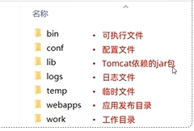

## 网络应用程序的常见架构

### 客户端—服务器结构（CS结构）

- 设置一台或多台高性能计算机（服务器集群）作为服务端，接受其他主机（客户端）的请求
  - 服务端总是打开，并具有固定的地址
- 客户端之间 **不能直接通信**
- 需要安装特定的客户端软件，该客户端需要承担部分业务逻辑

### 浏览器—服务器结构（BS结构）

- **客户端仅使用浏览器（Browser）作为访问入口**，完成不需要安装额外的软件。
- **所有的业务逻辑和数据处理都在服务器端（Server）**

### 点对点结构（P2P结构）

P2P（Peer-to-Peer）架构是一种**去中心化的网络架构**，每个节点（Peer）既可以作为**客户端（请求资源）**，也可以作为**服务器（提供资源）**，节点之间可以直接通信、共享资源，而无需依赖中央服务器。

- 对服务器具有最小依赖
- **具有自拓展性** ：网络能够随着节点（Peer）数量的增加，自主扩展计算能力、存储容量和带宽，而不依赖中央服务器。每个对等节点都由于接受请求产生工作负荷，但是每个对等节点向其他对等节点分发文件也为系统增加服务能力

## 进程与网络之间的接口（Socket）

**Socket（套接字）** 是计算机网络中用于 **进程间通信（IPC, Inter-Process Communication）** 的一种机制，它可以让不同计算机上的进程通过网络进行通信。Socket 提供了一种标准化的接口，使应用程序能够发送和接收数据，而不需要关心底层网络协议的实现细节。

## 超文本传输协议（HTTP）

**HTTP（超文本传输协议，HyperText Transfer Protocol）** 是一种 **无状态、基于请求-响应模式** 的 **应用层协议** ，用于在 **Web 浏览器和服务器之间** 传输数据，如 HTML 页面、图片、视频等。

HTTP 是 **互联网的基础协议**，它构建在 **TCP/IP 协议** 之上，使得客户端（如浏览器）和服务器可以相互通信。默认端口为 80

### URI和URL

- **URI(Uniform Resource Identifier)** 全称是统一资源标志符，可以唯一标识一个资源。
- **URL(Uniform Resource Locator)** 全称是统一资源定位符，可以提供该资源的路径。它是一种具体的 URI，即 URL 可以用来标识一个资源，而且还指明了如何 locate 这个资源。

### 基本工作模型

基于 **请求—响应** 模型进行工作，客户端向服务器发送 HTTP Request（请求），服务器响应请求并返回 HTTP Response（响应）


- HTTP客户端先建立与服务端的TCP连接
  - 浏览器发起到服务器的 TCP 连接（创建套接字 **`Socket`**）。
  - 服务器接收来自浏览器的 TCP 连接。

- 客户端进程和服务器进程通过 **`Socket`** 访问网络连接
  - 客户端从 **`Socket`** 发出请求并接受响应
  - 服务端从 **`Socket`** 接受请求并发送响应

### 协议特点

- **无状态协议** ：HTTP 协议是 **无状态** 的协议，它无法记录客户端用户的状态，一般我们都是通过 **`Session`** 来记录客户端用户的状态。
- **明文传输** ：默认情况下数据不加密，容易被监听（可用 HTTPS 加密）。
- **基于请求—响应机制** ：客户端发送请求，服务器返回响应。
- **可靠传输** ：HTTP 通过 **TCP协议（三次握手）** 确保可靠传输。

### HTTP状态码

状态码由 **3** 位数字组成，第一位定义 **响应的类别**

- **1xx: 信息响应**

  - **100 Continue**：服务器已接收请求的初步部分，客户端应继续请求。

  - **101 Switching Protocols**：服务器同意切换协议，如从 HTTP 切换到 WebSocket。

- **2xx: 成功**

  - **200 OK**：请求成功，服务器返回所请求的资源或数据。

  - **201 Created**：请求成功并创建了新的资源，常用于 POST 请求。

  - **204 No Content**：请求成功但服务器不返回任何内容，常用于删除操作。
  - **206 Partial Content** ：应用于 HTTP 分块下载或断点续传，表示响应返回的 body 数据并不是资源的全部，而是其中的一部分，也是服务器处理成功的状态。

- **3xx: 重定向**

  - **301 Moved Permanently**：资源已永久移动到新的 URL，客户端应使用新 URL 访问。

  - **302 Found**：资源临时移动到新的 URL，客户端应继续使用原来的 URL。搜索引擎会抓取新的内容而保存旧的网址并认为新的网址只是暂时的。

  - **304 Not Modified**：资源未修改，客户端可以使用缓存版本。

- **4xx: 客户端错误**

  - **400 Bad Request**：请求无效或语法错误，服务器无法处理。

  - **401 Unauthorized**：请求需要身份验证，客户端未提供有效的凭证。

  - **403 Forbidden**：服务器理解请求但拒绝执行，通常是权限问题。

  - **404 Not Found**：请求的资源在服务器上未找到。

- **5xx: 服务器错误**

  - **500 Internal Server Error**：服务器内部错误，无法完成请求。
  - **501 Not Implemented** ：客户端请求的功能还不支持，类似“即将开业，敬请期待”的意思。

  - **502 Bad Gateway**：服务器作为网关或代理，从上游服务器接收到无效响应。

  - **503 Service Unavailable**：服务器暂时无法处理请求，通常是因为过载或维护。



- 重定向机制的区别
  - **301 Moved Permanently** ：用于临时重定向，不会更新书签。
  - **302 Found** ：用于永久重定向，通常会更新客户端的书签



### HTTP请求方法

- **GET** ：用于请求获取指定资源，通常用于获取数据。
  - **GET** 请求的参数位置一般是写在 **URL** 中，但是浏览器会对 URL 的长度有限制（HTTP协议本身对 URL长度并没有做任何规定）。
- **POST** ：用于向服务器提交数据，通常用于提交表单数据或进行资源的创建。
  - **POST** 请求携带数据的位置一般是写在报文请求体 **body** 中，请求体中的数据可以是任意格式的数据，只要客户端与服务端协商好即可，而且浏览器不会对请求体大小做限制。
- **PUT** ：用于向服务器更新指定资源，通常用于更新已存在的资源。
- **DELETE** ：用于请求服务器删除指定资源。
- **HEAD** ：类似于GET请求，但只返回资源的头部信息，用于获取资源的元数据而不获取实际内容。



**GET** 和 **POST** 的区别

- 定义
  - **GET**：用于获取资源，通常用于请求数据而不改变服务器状态。
  - **POST**：用于提交数据到服务器，通常会改变服务器的状态或产生副作用（如创建或更新资源）。
- 参数传递方式
  - **GET**：参数通过 URL 拼接传递，暴露在请求 URL 中，具有可见性，长度有限（取决于浏览器和服务器）。
  - **POST**：参数放在请求体中，通常不可见且长度理论上没有限制，更适合传递大量数据或敏感信息（但是注意，POST 也可以在 URL 上放参数！）。
- 安全性
  - 数据安全性
    - **GET**：参数可见，数据容易暴露在浏览器历史记录、日志和缓存中，不适合传递敏感信息。
    - **POST**：数据放在请求体中，相对安全，但需要 **HTTPS** 才能保证数据加密传输。
  - HTTP定义：在 HTTP 协议里，所谓的 **安全** 是指请求方法不会 **破坏** 服务器上的资源。
    - **GET** ：是 **只读** 操作，无论操作多少次，服务器上的数据都是安全的，且每次的结果都是相同的。
    - **POST** ：是 **新增或提交数据** 的操作，会修改服务器上的资源
- 幂等性：多次执行相同的操作，结果都是相同的
  - **GET** ：**GET** 具有幂等性，**GET** 是 **只读** 操作，无论操作多少次，服务器上的数据都是安全的，且每次的结果都是相同的。（重复请求不会改变服务器状态）。
  - **POST** ：**POST** 具有非幂等，**POST** 是 **新增或提交数据** 的操作，会修改服务器上的资源（多次请求可能导致重复创建资源或执行多次相同操作）
- 缓存机制
  - **GET** ：可以对 **GET** 请求的数据做缓存，当请求同一个 URL 时可以直接返回缓存内容，减少服务器负载。适用于不频繁变动的资源，比如图片、静态页面。
    - 缓存可以做到浏览器本身上（彻底避免浏览器发请求）
    - 缓存可以做到代理上，而且在浏览器中 **GET** 请求可以保存为书签。
  - **POST** ：**POST** 请求默认不缓存，大部分浏览器和缓存服务器不缓存 POST 请求，主要因为 POST 请求通常会对服务器数据产生影响（如创建、修改数据），需要确保请求每次都传递到服务器。



### HTTP报文格式

#### 请求报文


HTTP 请求报文由三个部分组成(请求行+请求头+请求体)

- **请求行 （红色部分）** ：请求报文的第一行
  - 请求方法（如**GET**、**POST** ）
  - 请求的资源路径 **URI**
  - HTTP协议版本（如HTTP/1.1）。
- **请求头（深黄色部分）**：以键值对的形式表现，用于传递客户端环境、请求内容、认证信息等。
  - **实体头部** ：描述请求体的头部
    - **`Content-Length`** ：表明本次请求的数据长度。用于服务端进行拆包
      - 当客户端发送一个HTTP请求时，会在请求头中添加 **`Content-Length`** 字段，该字段的值表示请求正文的字节数。服务器在接收到请求后，会根据 **`Content-Length`** 字段的值来确定请求的长度，并从请求中读取相应数量的字节，直到读取完整个请求内容。这种基于 **`Content-Length`** 字段的拆包机制可以确保服务器正确接收到完整的请求，避免了请求的丢失或截断问题。
    - **`Content-Type`** ：请求体的多媒体类型（用于 POST 和 PUT 请求中）
  - **通用头部**：适用于请求和响应
    - **`Cache-Control`** ：用来指定在这次的请求/响应链中的所有缓存机制都必须 遵守的指令
    - **`Connection`** ：该浏览器想要优先使用的连接类型（持久连接还是非持久连接）
  - **请求头部**：特定于请求的头部
    - **`Host`** ：客户端发送请求时，用来指定服务器的域名。
    - **`User-Agent`** ：浏览器的浏览器身份标识字符串
    - **`Accept`** ：能够接受的回应内容类型（Content-Types）。
    - **`Accept-Encoding`** ：能够接受的编码方式列表
    - **`Accept-Language`** ：能够接受的回应内容的自然语言列表。
    - **`Cookie`** ：服务器通过 Set-Cookie发送的一个超文本传输协议 Cookie
    - **`Authorization`** ：用于超文本传输协议的认证的认证信息
- **空行**：用于分隔请求头和请求体。
- **请求体**：仅在POST、PUT等方法中存在，包含需要发送到服务器的数据。
  - **表单数据（Form Data）**：**`application/x-www-form-urlencoded`**，用于提交表单数据。
  - **多部分数据（Multipart Data）**：`multipart/form-data`，用于上传文件或复杂表单数据。
  - **JSON数据**：**`application/json`** ，用于提交JSON格式的数据。
  - **XML数据**：**`application/xml`** ，用于提交XML格式的数据。
  - **文本数据**：**`text/plain`** ，用于提交纯文本数据。

**请求解析过程**

- **请求行解析**：根据 HTTP 请求的第一行（请求行），服务器首先解析出请求方法、请求 URI 和协议版本。
- **请求头解析**：请求头的格式为 **`key: value`**，可以通过换行符来分隔每一行的头部信息。头部信息指示了客户端的行为、首选内容类型、缓存控制等。
- **请求体解析**：对于包含请求体的请求（如 POST 或 PUT），服务器需要解析请求体的内容。通常，内容类型会告知服务器如何解析请求体。
- **请求路由与处理**：HTTP 请求中的 URI 部分会被用来进行路由匹配，决定请求应该被哪个资源或处理程序处理。
- **生成 HTTP 响应**：服务器处理请求后，会生成一个 HTTP 响应
- **发送 HTTP 响应**：服务器将构造好的 HTTP 响应通过 TCP 连接返回给客户端。客户端接收到响应后，会根据状态码和响应头判断如何处理响应体

#### 响应报文


HTTP响应报文由三个部分组成(响应行,响应头,响应体)

- **响应行（红色部分）**：响应报文的第一行
  - HTTP协议版本
  - 状态码：用于描述响应结果
  - 描述
- **响应头（黄色部分）**：以键值对形式表现
  - **`Set-Cookie`** ：服务端可以设置客户端的cookie
  - **`Connection`** ：该浏览器想要优先使用的连接类型
- **响应体（绿色部分）**：存放响应数据

### HTTP缓存技术

对于一些具有重复性的 HTTP 请求，比如每次请求得到的数据都一样的，我们可以把这对请求-响应的数据都**缓存在本地**，那么下次就直接读取本地的数据，不必在通过网络获取服务器的响应了，由此HTTP/1.1 的性能会提升不少。

#### 强制缓存

强制缓存指的是只要浏览器判断缓存没有过期，则直接使用浏览器的本地缓存。由浏览器决定是否使用缓存的主动性。

**实现方式**

强制缓存是利用HTTP 响应头部（Response Header）字段实现的，它们都用来表示资源在客户端缓存的有效期：

- **`Cache-Control`** ：是一个相对时间
- **`Expires`** ：是一个绝对时间

**工作流程**

- 当浏览器第一次请求访问服务器资源时，服务器会在返回这个资源的同时，在请求头部加上 **`Cache-Control`** ，**`Cache-Control`** 中设置了过期时间大小；
- 浏览器再次请求访问服务器中的该资源时，会先 **通过请求资源的时间与 Cache-Control 中设置的过期时间大小，来计算出该资源是否过期** ，如果没有，则使用该缓存，否则重新请求服务器；
- 服务器再次收到请求后，会再次更新请求头的 **`Cache-Control`**。

#### 协商缓存

通过服务端告知客户端是否可以使用缓存的方式被称为协商缓存。

**实现方式**

- 响应头部中 **`Etag`** ：唯一标识响应资源
- 请求头部中的 **`If-None-Match`** ：当资源过期时，浏览器发现响应头里有 **`Etag`**，则再次向服务器发起请求时，会将请求头 If-None-Match 值设置为 **Etag** 的值。服务器收到请求后进行比对，如果资源没有变化返回 **304（允许使用本地缓存）**，如果资源变化了返回 **200**。

**工作流程**

- 当浏览器第一次请求访问服务器资源时，服务器会在返回这个资源的同时，在请求头部加上 **`ETag`** 唯一标识，这个唯一标识的值是根据当前请求的资源生成的
- 当浏览器再次请求访问服务器中的该资源时，首先会先检查强制缓存是否过期：
  - 如果没有过期，则直接使用本地缓存；
  - 如果缓存过期了，会在请求头部加上 **`If-None-Match`** 字段，该字段的值就是 **`ETag`** 唯一标识；
- 服务器再次收到请求后，会根据请求中的 **`If-None-Match`** 值与当前请求的资源生成的唯一标识进行比较
  - 如果值相等代表服务器中的资源未被修改，则返回 **304 Not Modified**，不会返回资源
  - 如果不相等代表服务器中的资源被修改，则返回 **200** 状态码和返回资源，并在请求头部加上新的 ETag 唯一标识；
- 如果浏览器收到 **304** 的请求响应状态码，则会从本地缓存中加载资源，否则更新资源。

### HTTP版本

#### HTTP1.0版本

- **无状态协议**：HTTP 1.0 是无状态的，每个请求之间相互独立，服务器不保存任何请求的状态信息。
- **非持久连接**：默认情况下，每个 HTTP 请求/响应对之后，连接会被关闭，属于短连接。这意味着对于同一个网站的每个资源请求，如 HTML 页面上的图片和脚本，都需要建立一个新的 TCP 连接。可以设置 `Connection: keep-alive` 强制开启长连接。

#### HTTP1.1版本

**新增特性**

- 默认使用长连接即  **`keep—alive`** ，允许持久连接。只要任意一端没有明确提出断开连接，则保持 TCP 连接状态。

- 支持 **`pipeline`**，在同一个 TCP 连接里面，客户端可以发起多个请求，只要第一个请求发出去了，不必等其回来，就可以发第二个请求出去，可以 **减少整体的响应时间。** 但是**服务器必须按照接收请求的顺序发送对这些管道化请求的响应（队尾堵塞）**。 所以，**HTTP/1.1 管道解决了请求的队头阻塞，但是没有解决响应的队头阻塞**。

  

  

- 允许响应数据分块（chunked)，即响应的时候不标明 **`Content-Length`** ，客户端就无法断开连接，直到收到服务端的 EOF ，利于传输大文件。

- 新增缓存的控制和管理。

- 请求头中加入了 **`Host`** 字段：解决了域名系统（DNS）允许多个主机名绑定到同一个 IP 地址上，而请求报文无法指出所请求的主机名的问题

- 范围请求：HTTP/1.1 引入了范围请求（range request）机制，以避免带宽的浪费。当客户端想请求一个文件的一部分，或者需要继续下载一个已经下载了部分但被终止的文件，HTTP/1.1 可以在请求中加入 **`Range`** 头部，以请求（并只能请求字节型数据）数据的一部分。

**性能瓶颈**

- 头部冗余：请求 / 响应头部（Header）未经压缩就发送，首部信息越多延迟越大。只能压缩 `Body` 的部分，发送冗长的首部。每次互相发送相同的首部造成的浪费较多
- 请求队头阻塞：服务器是按请求的顺序响应的，如果服务器响应慢，会招致客户端一直请求不到数据
- 没有请求优先级控制
- 请求只能从客户端开始，服务器只能被动响应。

**优化思路**

- 避免发送HTTP请求
  - 实现方案：采用缓存技术，对于一些具有重复性的 HTTP 请求，可以把这对请求-响应的数据都**缓存在本地**，那么下次就直接读取本地的数据，不必在通过网络获取服务器的响应了
- 减少HTTP响应数据大小
  - 实现方案
    - 无损压缩（适合用在文本文件、程序可执行文件、程序源代码）、
    - 有损压缩（压缩多媒体数据）
- 减少 HTTP 请求的次数
  - 实现方案
    - 减少重定向请求：将原本由客户端处理的重定向请求，交给代理服务器处理，这样可以减少重定向请求的次数
    - 合并请求：将多个小资源合并成一个大资源再传输，能够减少 HTTP 请求次数以及 头部的重复传输，再来减少 TCP 连接数量，进而省去 TCP 握手和慢启动的网络消耗

#### HTTP2.0版本

新增特性

- **二进制帧**：相较于HTTP/1.1 则使用文本格式的报文，HTTP 2.0 使用二进制而不是文本格式来传输数据，解析更加高效。
- **多路复用**：一个 TCP 连接上可以同时进行多个 HTTP 请求/响应，解决了 HTTP 1.x 的响应队头阻塞问题。
- **头部压缩**：HTTP 协议不带状态，所以每次请求都必须附上所有信息。HTTP 2.0 引入了头部压缩机制，可以使用 gzip 或 compress 压缩后再发送，减少了冗余头部信息的带宽消耗。
- **服务端推送**：服务器可以主动向客户端推送资源，而不需要客户端明确请求。
- **优先级设置** ：HTTP2.0支持优先级设置，允许按 **权重和依赖关系** 优先传输关键资源，优化用户体验。

**底层实现**


- **Stream** ：一个TCP连接中包含多条 **Stream** ，一个 **Stream**中包含一对请求响应报文
- **Message** ：请求或响应报文
- **Frame** ：Frame 是 HTTP/2 最小单位，以二进制压缩格式存放 HTTP/1 中的内容（头部和包体）

在 HTTP/2 连接上，**不同 Stream 的帧是可以乱序发送的（因此可以并发不同的 Stream ）**，因为每个帧的头部会携带 Stream ID 信息，所以接收端可以通过 Stream ID 有序组装成 HTTP 消息，而**同一 Stream 内部的帧必须是严格有序的**。

客户端和服务器**双方都可以建立 Stream** ，客户端建立的 Stream 必须是奇数号，而服务器建立的 Stream 必须是偶数号。


HTTP/2 还可以对每个 Stream 设置不同 **优先级**

#### HTTP3.0版本

**HTTP2.0的问题**

- 队头阻塞：HTTP/2 多个请求是跑在一个 TCP 连接中的，那么当 TCP 丢包时，整个 TCP 都要等待重传，那么就会阻塞该 TCP 连接中的所有请求。
- 网络连接迁移：一个 TCP 连接是由四元组（源 IP 地址，源端口，目标 IP 地址，目标端口）确定的，这意味着如果 IP 地址或者端口变动了，就会导致需要 TCP 与 TLS 重新握手，这不利于移动设备切换网络的场景

**HTTP3.0的改进**

将传输层协议改为UDP，并且基于UDP实现了应用层的QUIC协议

**QUIC协议的特点**

- **传输协议** ：HTTP/2.0 是基于 TCP 协议实现的，HTTP/3.0 新增了 QUIC（Quick UDP Internet Connections） 协议来实现可靠的传输，提供与 TLS/SSL 相当的安全性，具有较低的连接和传输延迟。可以将 QUIC 看作是 UDP 的升级版本，在其基础上新增了很多功能比如加密、重传等等
- **连接建立快**：对于 HTTP/1 和 HTTP/2 协议，TCP 和 TLS 是分层的，分别属于内核实现的传输层、OpenSSL 库实现的表示层。 QUIC 内部包含了 TLS，它在自己的帧会携带 TLS 里的“记录”，再加上 QUIC 使用的是 TLS 1.3，因此仅需 1 个 RTT 就可以「同时」完成建立连接与密钥协商，甚至在第二次连接的时候，应用数据包可以和 QUIC 握手信息（连接信息 + TLS 信息）一起发送，达到 0-RTT 的效果。
- **无队头阻塞**：HTTP/2.0 多请求复用一个 TCP 连接，一旦发生丢包，就会阻塞住所有的 HTTP 请求。由于 QUIC 协议的特性，HTTP/3.0 在一定程度上解决了队头阻塞问题，一个连接建立多个不同的数据流，这些数据流之间独立互不影响，某个数据流发生丢包了，其数据流不受影响（本质上是多路复用+轮询）。
- **连接迁移**：HTTP/3.0 支持连接迁移，因为 QUIC 使用 64 位 ID 标识连接，只要 ID 不变就不会中断，网络环境改变时（如从 Wi-Fi 切换到移动数据）也能保持连接。而 TCP 连接是由（源 IP，源端口，目的 IP，目的端口）组成，这个四元组中一旦有一项值发生改变，这个连接也就不能用了。
- **安全性**：在 HTTP/2.0 中，TLS 用于加密和认证整个 HTTP 会话，包括所有的 HTTP 头部和数据负载。TLS 的工作是在 TCP 层之上，它加密的是在 TCP 连接中传输的应用层的数据，并不会对 TCP 头部以及 TLS 记录层头部进行加密，所以在传输的过程中 TCP 头部可能会被攻击者篡改来干扰通信。而 HTTP/3.0 的 QUIC 对整个数据包（包括报文头和报文体）进行了加密与认证处理，保障安全性。

## HTTPS协议

HTTP 是明文传输的，存在数据窃听、数据篡改和身份伪造等问题。而 HTTPS 通过引入 SSL/TLS 解决安全性问题，HTTPS 默认端口号是  **443**

- **信息加密**：交互信息无法被窃取。
- **校验机制**：无法篡改通信内容，篡改了就不能正常显示。
- **身份证书**：证明身份。

### 加密机制

#### 混合加密

HTTPS 采用的是**对称加密**和**非对称加密**结合的混合加密方式实现消息的机密性，保证消息不被窃听

- 在通信建立前（TLS四次握手）采用**非对称加密**的方式交换会话秘钥，后续就不再使用非对称加密。
- 在通信过程（后续加密通信）中全部使用**对称加密**的会话秘钥的方式加密明文数据。



**非对称加密和对称加密**

- 对称加密：双方用会话密钥加密通信内容。
- 非对称加密：服务器向客户端发送公钥，然后客户端用公钥加密自己的随机密钥，也就是会话密钥，发送给服务器，服务器用私钥解密，得到会话密钥。
  - 密钥类型
    - 公钥：负责加密
    - 私钥：负责解密
  - 用公钥加密过的密文只有私钥才能解密，用私钥加密过的密文只有公钥才能解密
    - **公钥加密，私钥解密** ：这个目的是为了**保证内容传输的安全**，因为被公钥加密的内容，其他人是无法解密的，只有持有私钥的人，才能解密出实际的内容；
    - **私钥加密，公钥解密** ：这个目的是为了**保证消息不会被冒充**，因为私钥是不可泄露的，如果公钥能正常解密出私钥加密的内容，就能证明这个消息是来源于持有私钥身份的人发送的。
- 相较于对称加密，非对称加密的速度慢



#### 数字签名和摘要算法

HTTPS 采用的是 **数字签名** 和 **摘要算法** 实现消息的完整性，保证消息不被篡改

**摘要算法** 用于保证消息的 **完整性** 

计算机里会 **用摘要算法（哈希函数）来计算出内容的哈希值** ，也就是内容的摘要，这个**哈希值是唯一的，且无法通过哈希值推导出内容**，然后将内容和哈希值一同发送。对方收到后，先是对内容也计算出一个摘要，然后跟发送方发送的摘要做一个比较，如果摘要相同，说明内容没有被篡改，否则就可以判断出内容被篡改了。


**数字签名** 用于保证消息保证消息的来源可靠性（能确认消息是由持有私钥的一方发送的）

数字签名算法利用非对称加密的机制，服务器用私钥对内容的哈希值进行加密，然后服务端会向客户端颁发对应的公钥。如果客户端收到的信息，能被公钥解密，就说明该消息是由服务器发送的。


#### 数字证书

由于客户端的公钥可以被替换或者伪造，导致在通信时攻击者可以使用与自己私钥配对的公钥替换客户端的公钥然后与客户端进行通信

**数字证书** 用于保证公钥无法被伪造或者替换


- 服务器将自己的公钥注册到数字证书认证机构（CA）
- CA 使用自己的私钥将服务器的公钥进行加密，生成数字证书
  - CA 会把持有者的公钥、⽤途、颁发者、有效时间等信息打成⼀个包，然后对这些信息进⾏ Hash 计算，得到⼀个 Hash 值；
  - CA 会使⽤⾃⼰的私钥将该 Hash 值加密，⽣成 Certificate Signature；
  - 最后将 Certificate Signature 添加在⽂件证书上，形成数字证书。

- 客户端拿到服务器的数字证书后，使用CA的公钥确认服务器的数字证书的真实性
- 客户端从数字证书获取服务器公钥后，使用已被验证的公钥进行加密后发送
- 服务器用私钥对报文解密

#### 生活例子解释

你想向老师请假，一般来说是要求由家长写一份请假理由并签名，老师才能允许你请假

这里的老师对应于客户端，家长对应服务端，你对应一名攻击者。

**为什么需要数字签名？**

假设你有模仿家长字迹的能力，你用家长的字迹写了一份请假条然后签上你爸爸的名字，老师一看到这个请假条，查看字迹和签名，就误以为是家长写的，就会允许你请假。

引入了数字签名算法后，你就无法模仿家长的字迹来请假了，家长手上持有着私钥，老师持有着公钥。

其中请假条中的签名对于数字签名，字迹对应内容

这样只有用家长手上的私钥才对请假条进行签名，老师通过公钥看能不能解出这个签名，如果能解出并且确认内容的完整性，就能证明是由家长发起的请假条，这样老师才允许你请假，否则老师就不认。

**为什么需要数字证书？**

虽然家长持有私钥，老师通过是否能用公钥解密来确认这个请假条是不是来源你父亲的。但是我们还可以自己伪造出一对公私钥啊！

你找了个夜晚，偷偷把老师桌面上和你爸爸配对的公钥，换成了你的公钥，那么下次你在请假的时候，你继续模仿你爸爸的字迹写了个请假条，然后用你的私钥做个了数字签名。

但是老师并不知道自己的公钥被你替换过了，所以他还是按照往常一样用公钥解密，由于这个公钥和你的私钥是配对的，老师当然能用这个被替换的公钥解密出来，并且确认了内容的完整性，于是老师就会以为是家长写的请假条，又允许你请假了。

#### 通信过程

**第一阶段**是TLS四次握手，这一阶段主要是利用**非对称加密**的特性各种交换信息，最后得到一个"会话秘钥"。

**第二阶段**是则是在第一阶段的"**会话秘钥**"基础上，进行**对称加密**通信。


- 第一次握手：由客户端向服务器发起加密通信请求，也就是 **ClientHello** 请求。
  - 客户端支持的 TLS 协议版本，如 TLS 1.2 版本。
  - 客户端生产的随机数 **`（Client Random）`** ，后面用于生成「会话秘钥」条件之一。
  - 客户端支持的密码套件列表，如 RSA 加密算法。
- 第二次握手：服务器收到客户端请求后，向客户端发出响应，也就是 **SeverHello** 响应
  - 确认 TLS 协议版本，如果浏览器不支持，则关闭加密通信。
  - 服务器生产的随机数 **`（Server Random）`** ，也是后面用于生产会话秘钥条件之一。
  - 确认的密码套件列表，如 RSA 加密算法。
  - 服务器的数字证书，包含被CA私钥加密过的服务器公钥。
- 第三次握手：通过浏览器或者操作系统中的 CA 公钥，确认服务器的数字证书的真实性。同时生成会话密钥： 客户端使用客户端随机数，服务器随机数和 **`pre_master_key`** 这三个随机数进行计算得到一个 **会话秘钥** 。客户端会 **从数字证书中取出服务器的公钥** ，然后使用它加密报文的 **`pre-master key`** ，向服务器发送如下信息：
  - 一个随机数 **`（pre-master key）`** ：该随机数由客户端生成，并被服务器公钥加密。
  - 加密通信算法改变通知：表示随后的信息都将用会话秘钥加密通信。
  - 内容摘要：客户端会把迄今为止的通信数据内容生成一个摘要，用 **会话秘钥** 加密，发给服务器做校验，此时客户端这边的握手流程就结束了，因此也叫 **Finished报文** 。
- 第四次握手：服务器收到客户端的第三个随机数 **`（pre-master key）`** 之后通过服务器私钥进行解密获得原文，通过与客户端协商的加密算法，计算出本次通信的 **会话秘钥** 。
  - 加密通信算法改变通知，表示随后的信息都将用会话秘钥加密通信。
  - 服务器握手结束通知，表示服务器的握手阶段已经结束。这一项同时把之前所有内容的发生的数据做个摘要，用来供客户端校验。

## DNS（域名解析协议）

DNS的全称是Domain Name System（域名系统），它是互联网中用于将域名转换为对应IP地址的分布式数据库系统。

**DNS 是应用层协议，基于 UDP 协议之上，端口为 53** 。

### DNS服务器

- 根 DNS 服务器：根 DNS 服务器提供 TLD 服务器的 IP 地址。目前世界上只有 13 组根服务器，我国境内目前仍没有根服务器。
- 顶级域 DNS 服务器（TLD 服务器）：顶级域是指域名的后缀，如`com`、`org`、`net`和`edu`等。国家也有自己的顶级域，如`uk`、`fr`和`ca`。TLD 服务器提供了权威 DNS 服务器的 IP 地址。
- 权威 DNS 服务器：在因特网上具有公共可访问主机的每个组织机构必须提供公共可访问的 DNS 记录，这些记录将这些主机的名字映射为 IP 地址。
- 本地 DNS 服务器：每个 ISP（互联网服务提供商）都有一个自己的本地 DNS 服务器。当主机发出 DNS 请求时，该请求被发往本地 DNS 服务器，它起着代理的作用，并将该请求转发到 DNS 层次结构中。严格说来，不属于 DNS 层级结构


### 域名解析过程


- **域名解析请求**：用户在浏览器中输入一个域名，浏览器首先检查本地缓存（如果有的话）是否存有该域名的 IP 地址。
- **本地DNS解析**：如果本地缓存中没有所需的 IP 地址，浏览器会向配置的 **本地 DNS 服务器** 发送请求。若存在则直接返回
- **根DNS解析** ：如果 **本地DNS服务器** 中没有所需的 IP 地址，**本地 DNS 服务器** 向 **根DNS服务器** 发出请求，查询 **根DNS** 以获取 **顶级域（TLD）的 DNS** 地址。 **根DNS** 负责将 **顶级域DNS** 的IP地址发回到 **本地DNS** 。
- **顶级域DNS解析** ：**本地DNS** 向 **顶级域DNS** 发出请求，查询 **顶级域DNS** 以获取 **权威DNS** 地址。 **顶级域DNS** 负责将 **权威DNS** 的IP地址发回到 **本地DNS** 。
- **权威DNS解析** ：**本地DNS** 向 **权威DNS** 发出请求，查询 **权威DNS** 以获取 **域名对应的IP地址** 。 **权威DNS** 负责将 **域名对应的IP地址** 发回到 **本地DNS** 。
- 浏览器缓存该 IP 地址以供后续请求使用，并通过 IP 地址连接到目标服务器以访问网站内容

## RPC（**远程过程调用**）

**RPC**（**R**emote **P**rocedure **C**all），又叫做**远程过程调用**。它本身并不是一个具体的协议，而是一种**调用方式**。

### 服务发现

在 **HTTP** 中，你知道服务的域名，就可以通过 **DNS 服务**去解析得到它背后的 IP 地址，默认 80 端口。

而 **RPC** 的话，就有些区别，一般会有专门的**中间服务**去保存服务名和IP信息，比如 **Consul 或者 Etcd，甚至是 Redis**。想要访问某个服务，就去这些中间服务去获得 IP 和端口信息。由于 DNS 也是服务发现的一种，所以也有基于 DNS 去做服务发现的组件，比如**CoreDNS**。

### 底层连接形式

主流的 **HTTP/1.1** 协议为例，其默认在建立底层 TCP 连接之后会一直保持这个连接（**Keep Alive**），之后的请求和响应都会复用这条连接。

而 **RPC** 协议，也跟 HTTP 类似，也是通过建立 TCP 长链接进行数据交互，但不同的地方在于，RPC 协议一般还会再建个**连接池**，在请求量大的时候，建立多条连接放在池内，要发数据的时候就从池里取一条连接出来，**用完放回去，下次再复用**，可以说非常环保。

## WebSocket

WebSocket 适用于需要实时通信和双向数据流的场景，而 HTTP 更适合于传统的客户端与服务器之间的短时请求响应场景。

WebSocket 是一种基于 TCP 连接的全双工通信协议，即客户端和服务器可以同时发送和接收数据。客户端和服务器仅需一次握手，两者之间就直接可以创建持久性的连接，并进行双向数据传输。



全双工和半双工的概念

- **全双工** ：**同一时间里**，**双方**都可以**主动**向对方发送数据。
- **半双工** ：**同一时间里**，客户端和服务器**只能有一方主动**发数据



### 与HTTP的区别

- WebSocket 是一种双向实时通信协议，客户端和服务器建立持久连接后，双方可以随时发送消息，直到主动关闭连接
- HTTP 是一种单向通信协议。HTTP 协议基于请求/响应模型，下的通信只能由客户端发起，服务器无法主动通知客户端

### HTTP轮询和长轮询

为了实现类似服务器主动发送消息给客户端的场景，有HTTP轮询和长轮询两种实现方案

#### HTTP轮询

**网页的前端代码里不断定时发 HTTP 请求到服务器，服务器收到请求后给客户端响应消息。**。这是一种伪实现。本质上并不是服务器主动发消息到客户端，而是客户端自己不断偷偷请求服务器，只是用户无感知而已。

**缺点**

- 消耗带宽，同时也会增加下游服务器的负担。
- 使用体验上会出现 **明显的卡顿** ，用户需要等个 1~2 秒，正好才触发下一次 HTTP 请求

#### 长轮询

将HTTP 请求的 **超时时间设置的很大** ，比如 30 秒，**在这 30 秒内只要服务器收到了请求，就立马返回给客户端。如果超时，那就立马发起下一次请求。**

这样就减少了 HTTP 请求的个数，并且由于大部分情况下，响应也是及时的。

### WebSocket握手过程

- 客户端向服务器发送一个 HTTP 请求，请求头中包含 **`Upgrade: websocket`** 和 **`Sec-WebSocket-Key`** 等字段，表示要求升级协议为 **WebSocket** ；
  - **`Upgrade: websocket`** ：请求升级协议到 **WebSocket**
  - **`Sec-WebSocket-Key`**  ：**随机生成的 base64 码**
- 服务器收到这个请求后，会进行升级协议的操作，如果支持 WebSocket，它将回复一个 HTTP 101 状态码，响应头中包含 ，**`Connection: Upgrade`** 和 **`Sec-WebSocket-Accept: xxx`** 等字段、表示成功升级到 WebSocket 协议。
  - **`Connection: Upgrade`** ：支持协议切换
  - **`Sec-WebSocket-Accept`** ：根据客户端生成的 **`Sec-WebSocket-Key`** ，用 **公开的** 算法变成另一段字符串
- 客户端也用同样的**公开算法**将 **`Sec-WebSocket-Key`** 转成另一段字符串，如果这段字符串跟服务器传回来的 **`Sec-WebSocket-Accept`** **一致**，那验证通过。客户端和服务器之间建立了一个 WebSocket 连接，可以进行双向的数据传输。
- 数据以帧（frames）的形式进行传送，WebSocket 的每条消息可能会被切分成多个数据帧（最小单位）。发送端会将消息切割成多个帧发送给接收端，接收端接收消息帧，并将关联的帧重新组装成完整的消息。
- 客户端或服务器可以主动发送一个关闭帧，表示要断开连接。另一方收到后，也会回复一个关闭帧，然后双方关闭 TCP 连接。

## Tomcat服务器

### 基本使用

**启动Tomcat服务器**：双击Tomcat服务器目录下的bin\startup.bat

**关闭Tomcat服务器**

- **CTRL+C**：正常关闭
- **直接关闭运行窗口**：强制关闭
- **双击Tomcat服务器目录下的bin\shutdown.bat**：正常关闭

**部署项目**：将应用放入webapps目录下

### Tomcat服务器的目录结构

```
Tomcat/
|--bin（可执行文件）
|--conf（配置文件）
|--lib（Tomcat依赖的jar包）
|--logs（日志文件）
|--temp（测试代码资源）
|--webapps（应用发布目录）
|--resource（工作目录）
```

