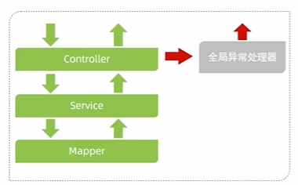

项目开发过程中会遇到异常问题

## 全局异常处理器



**@RestControllerAdvice**：用于修饰类表示全局异常处理器

- 创建一个类并使用 `@ControllerAdvice` 注解标记。
- 在该类中定义带有 `@ExceptionHandler` 注解的方法，用于捕获异常。
- 全局异常处理类会捕获应用中所有控制器抛出的异常。


**`@ExceptionHandler`** ：用于修饰异常处理方法，用于局部的异常处理，通常定义在控制器类中。它可以捕获特定的异常，并返回自定义的错误信息或视图。

- 在控制器类中定义处理异常的方法。
- 使用 `@ExceptionHandler` 指定要捕获的异常类型。
- 可以返回自定义的视图或 JSON 响应。

示例代码

```java
@RestControllerAdvice
puhlic class GlobalExceptionHandler {
	@ExceptionHandler(Exception.class)
    public Result ex(Exception ex){ex.printstackTrace();
		return Result.error(”对不起,操作失败,请联系管理员");
}
```

可以设置HTTP的状态码

**`@ResponseStatus`**  注解可以直接用于自定义异常类或异常处理方法中，设置返回的 HTTP 状态码。

```java
@ExceptionHandler(UserNotFoundException.class)
@ResponseStatus(HttpStatus.NOT_FOUND)
public String handleUserNotFound(UserNotFoundException ex, Model model) {
    model.addAttribute("errorMessage", ex.getMessage());
    return "errorPage";
}
```

`ResponseEntity` 可以灵活地控制返回的 HTTP 状态码和响应体，常用于 REST API 中的异常处理。

## 全局异常

在common包下定义基本异常BaseException，其余的异常为这个类的子类

示例代码

```java
public class BaseException extends RuntimeException {

    public BaseException() {
    }

    public BaseException(String msg) {
        super(msg);
    }

}
```

