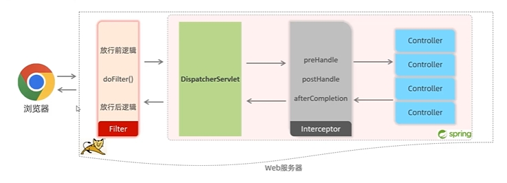

## 简介

Spring框架中提供的，用来动态拦截控制器方法的执行。拦截器可以用于实现诸如 **权限验证**、**日志记录**、**性能监控** 等功能，而无需将这些逻辑直接耦合在控制器代码中。
**作用** ：用于在请求处理流程的不同阶段拦截 HTTP 请求和响应，并对其进行预处理或后处理。

## 具体实现

1. 定义 **Interceptor** 类，实现 **`HandlerInterceptor`** 接口并重写方法

   ```java
   @Component
   public class LoginCheckInterceptor implements HandlerInterceptor {
      @0verride //目标资源方法执行前执行，放回true:放行，返回false:不放行
      public boolean prehandle(HttpServletRequest reg, HttpServletResponse resp, object handler) throws Exception {
           System.out.println("preHandle ...");
   		return true;
      }
      @Override //目标资源方法执行后执行
      public void postHandle(HttpservletRequest req, HttpServletResponse resp, object handler, ModelAndview modelAndview){
          System.out.println("postHandle..");
      }
   	@0verride //视图渲染完毕后执行，最后执行
       public void afterCompletion (HttSservietReguest reg, HttpServletResponse resp, Object handler, Exception ex) {
           System.out.println("aftercompletion ...");
       }
   }
   ```

2. 注册拦截器

   ```java
   @Configuration
   public class webConfig implements WebMvcConfigurer {
       @Autowired
   	private LoginCheckInterceptor logincheckInterceptor;
       @Override
   	public void addInterceptors(InterceptorRegistry registry){
           registry.addInterceptor (logincheckInterceptor)
               .addPathPatterns("拦截路径")
               .excludePathPatterns("放行路径")
       }
   }
   ```

## 拦截路径

拦截器可以根据需求，配置不同的拦截路径:

| 拦截路径  |         含义         |       示例       |
| :-------: | :------------------: | :--------------: |
|    /*     |    所有的一级路径    |      /depts      |
|    /**    |      任意级路径      | /depts，/depts/1 |
| /depts/*  |  /depts下的一级路径  |     /depts/1     |
| /depts/** | /depts下的任意级路径 |   /depts/emp/1   |

## 执行流程



- 请求先进入过滤器还未进入Spring容器中
- 经过过滤器的校验后进入**`DispatcherServlet`**
- 请求到达拦截器进行校验



过滤器和拦截器的区别

- 接口规范不同:
  - 过滤器需要实现Filter接口
  - 拦截器需要实现Handlerinterceptor接口。
- 拦截范围不同:
  - Filter会拦截所有的资源，它通常用于处理全局的任务，如跨域请求处理（CORS）、编码转换等。
  - Interceptor只会拦截Spring环境中的资源。
- 拦截顺序不同
  - 过滤器比拦截器提前拦截请求

- 来源不同
  - 过滤器是Servlet规范的一部分，更加接近底层
  - 拦截器是SpringMVC的一部分，更加接近业务层


