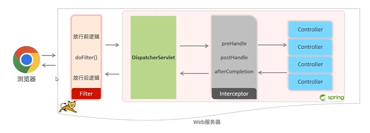

## 📖 简介

**Spring** 框架中提供的，用来动态拦截控制器方法的执行。拦截器可以用于实现诸如 **权限验证**、**日志记录**、**性能监控** 等功能，而无需将这些逻辑直接耦合在控制器代码中。

- **作用**：用于在请求处理流程的不同阶段拦截 **HTTP** 请求和响应，并对其进行预处理或后处理。

---

## ⚙️ 具体实现

1. **定义 Interceptor 类**，实现 **`HandlerInterceptor`** 接口并重写方法：

   ```java
   @Component
   public class LoginCheckInterceptor implements HandlerInterceptor {
       @Override // 目标资源方法执行前执行，返回true:放行，返回false:不放行
       public boolean preHandle(HttpServletRequest req, HttpServletResponse resp, Object handler) throws Exception {
           System.out.println("preHandle ...");
           return true;
       }
       @Override // 目标资源方法执行后执行
       public void postHandle(HttpServletRequest req, HttpServletResponse resp, Object handler, ModelAndView modelAndView) {
           System.out.println("postHandle ...");
       }
       @Override // 视图渲染完毕后执行，最后执行
       public void afterCompletion(HttpServletRequest req, HttpServletResponse resp, Object handler, Exception ex) {
           System.out.println("afterCompletion ...");
       }
   }
   ```

2. **注册拦截器**：

   ```java
   @Configuration
   public class WebConfig implements WebMvcConfigurer {
       @Autowired
       private LoginCheckInterceptor loginCheckInterceptor;
       @Override
       public void addInterceptors(InterceptorRegistry registry) {
           registry.addInterceptor(loginCheckInterceptor)
               .addPathPatterns("拦截路径")
               .excludePathPatterns("放行路径");
       }
   }
   ```

---

## 🛤️ 拦截路径

拦截器可以根据需求，配置不同的拦截路径：

| 拦截路径  |         含义         |       示例       |
| :-------: | :------------------: | :--------------: |
|    /*     |    所有的一级路径    |      /depts      |
|    /**    |      任意级路径      | /depts，/depts/1 |
| /depts/*  |  /depts下的一级路径  |     /depts/1     |
| /depts/** | /depts下的任意级路径 |   /depts/emp/1   |

---

## 🔄 执行流程

<div align="center">
  
</div>

- 请求先进入过滤器还未进入 **Spring** 容器中
- 经过过滤器的校验后进入 **`DispatcherServlet`**
- 请求到达拦截器进行校验



**过滤器和拦截器的区别**：

- **接口规范不同**：
  - 过滤器需要实现 **`Filter`** 接口
  - 拦截器需要实现 **`HandlerInterceptor`** 接口
- **拦截范围不同**：
  - **Filter** 会拦截所有的资源，它通常用于处理全局的任务，如跨域请求处理（**CORS**）、编码转换等。
  - **Interceptor** 只会拦截 **Spring** 环境中的资源。
- **拦截顺序不同**：
  - 过滤器比拦截器提前拦截请求
- **来源不同**：
  - 过滤器是 **Servlet** 规范的一部分，更加接近底层
  - 拦截器是 **SpringMVC** 的一部分，更加接近业务层

