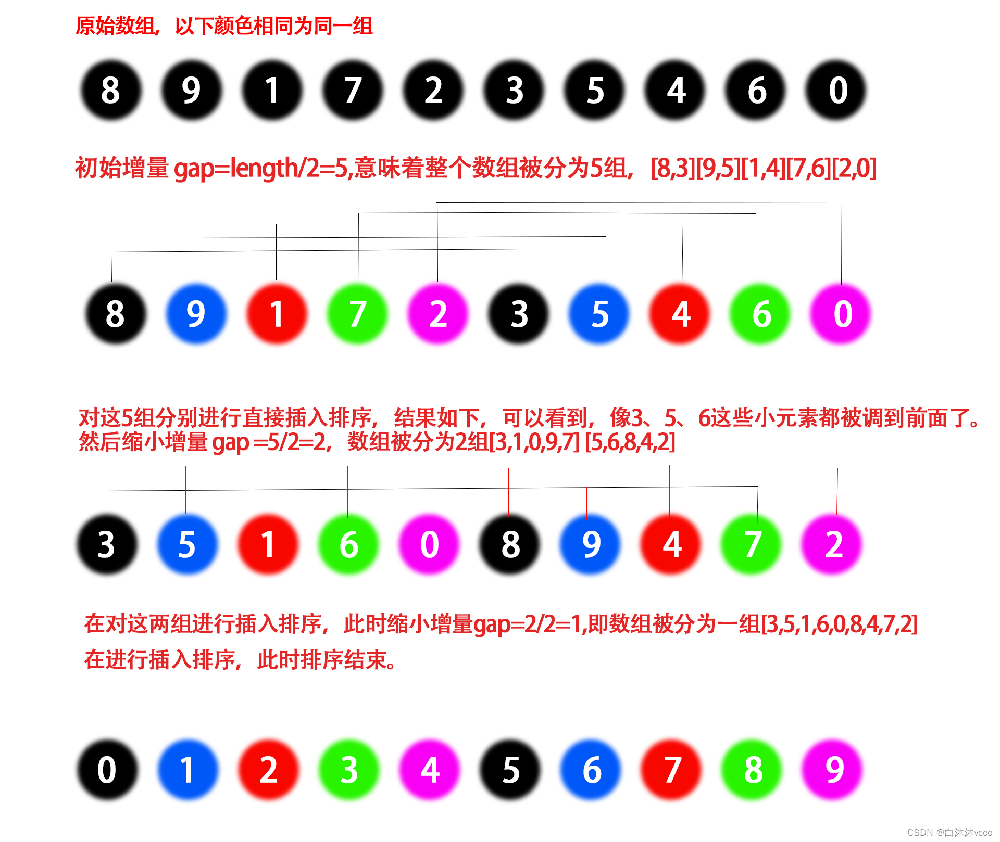

## 排序算法的相关概念

- 内部排序和外部排序
  - **内部排序** ：在排序期间元素全部存放在内存中的排序
  - **外部排序** ：排序期间元素无法全部放在内存中，必须在排序的过程中不断进行内外存的数据交换
- 稳定排序和非稳定排序
  - **稳定排序** ：对于相同的键，不会重新排列它的相对顺序
  - **非稳定排序** ：对于相同的键，会重新排序它的相对顺序
- 基于比较的排序和基于桶的排序
  - **基于比较的排序** ：通过比较来决定元素间的相对次序，适用于各种规模的数据，也不在乎数据的分布，都能进行排序
  - **基于桶的排序** ：不通过比较来决定元素间的相对次序，而是通过确定每个元素之前，应该有多少个元素来排序。非比较排序时间复杂度底，但由于非比较排序需要占用空间来确定唯一位置。所以对数据规模和数据分布有一定的要求。

## 基于比较的排序

### 冒泡排序

它重复地遍历要排序的序列，依次比较两个元素，如果它们的顺序错误就把它们交换过来。遍历序列的工作直到没有再需要交换为止，此时说明该序列已经排序完成。此时元素会像泡泡一样，冒泡到数组的适当位置

#### 算法步骤

- 比较相邻的元素。如果第一个比第二个大，就交换它们两个；
- 对每一对相邻元素作同样的工作，从开始第一对到结尾的最后一对，这样在最后的元素应该会是最大的数
- 针对所有的元素重复以上的步骤，直到排序完成。

#### 代码实现

```java
public static void bubbleSort(int[] a) {
        int n=a.length;
        // 遍历n-1次
        for(int i=0;i<n-1;i++){
            // 标志位,如果一次遍历中没有发生交换,说明数组已经有序,直接退出
            boolean flag=true;
            // 每次遍历都会找到一个最大值,因此第i次遍历时只需要遍历n-i-1个元素
            for(int j=0;j<n-i-1;j++){
                if(a[j]>a[j+1]){
                    int temp=a[j];
                    a[j]=a[j+1];
                    a[j+1]=temp;
                    flag=false;
                }
            }
            if(flag){
                break;
            }
        }
    }
```

#### 算法分析

- **稳定性**：稳定
- **时间复杂度**
  - 最佳：$O(n)$ （当输入数组为已经排序好的数据）
  - 最差：$O(n^2)$：（当输入数组为倒序排列的）
  - 平均：$O(n^2)$
- **空间复杂度**：$O(1)$

### 选择排序

选择排序无论接收什么数据进去都是 $O(n^2)$ 的时间复杂度。所以用到它的时候，数据规模越小越好。它的工作原理：首先在未排序序列中找到最小（大）元素，存放到排序序列的起始位置，然后，再从剩余未排序元素中继续寻找最小（大）元素，然后放到已排序序列的末尾。以此类推，直到所有元素均排序完毕。

#### 算法步骤

- 首先在未排序序列中找到最小（大）元素，存放到排序序列的起始位置
- 再从剩余未排序元素中继续寻找最小（大）元素，然后放到已排序序列的末尾。
- 重复第 2 步，直到所有元素均排序完毕。

#### 代码实现

```java
public static void selectionSort(int[] a) {
        int n=a.length;
        // 遍历n-1次
        for(int i=0;i<n-1;i++){
            // 每次遍历都会找到一个最小值,因此第i次遍历时只需要遍历n-i-1个元素
            int minIndex=i;
            for(int j=i+1;j<n;j++){
                if(a[j]<a[minIndex]){
                    minIndex=j;
                }
            }
            if(minIndex!=i){
                int temp=a[i];
                a[i]=a[minIndex];
                a[minIndex]=temp;
            }
        }
    }
```

#### 算法分析

- **稳定性**：不稳定
- **时间复杂度**
  - 最佳：$O(n^2)$ 
  - 最差：$O(n^2)$
  - 平均：$O(n^2)$
- **空间复杂度**：$O(1)$

### 插入排序

插入排序的原理类似于洗牌。它的工作原理是通过构建有序序列，对于未排序数据，在已排序序列中从后向前扫描，找到相应位置并插入。

#### 算法步骤

- 从第一个元素开始，该元素可以认为已经被排序；
- 取出下一个元素，在已经排序的元素序列中从后向前扫描；
- 如果该元素（已排序）大于新元素，将该元素移到下一位置；
- 重复步骤 3，直到找到已排序的元素小于或者等于新元素的位置；
- 将新元素插入到该位置后；
- 重复步骤 2~5。

#### 代码实现

```java
public static void insertionSort(int[] a) {
        int n=a.length;
        // 遍历n-1次
        for(int i=1;i<n;i++){
            // 从第i个元素开始,将当前元素插入到前面已经排好序的数组中
            int preIndex=i-1;
            System.out.println("preIndex: "+preIndex);
            int current=a[i];
            System.out.println("current: "+current);
            // 从后往前遍历,将大于current的元素后移一位
            while(preIndex>=0&&current<a[preIndex]){
                a[preIndex+1]=a[preIndex];
                preIndex--;
            }
            a[preIndex+1]=current;
        }
    }
```

#### 算法分析

- **稳定性** ：稳定
- **时间复杂度** ：
  - 最佳：$O(n)$ （输入数组本身为有序）
  - 最差：$O(n^2)$ （输入数组本身为倒序）
  - 平均：$O(n^2)$
- **空间复杂度** ：$O(1)$

### 希尔排序

希尔排序的基本思想是：先将整个待排序的记录序列分割成为若干子序列分别进行直接插入排序，待整个序列中的记录 “基本有序” 时，再对全体记录进行依次直接插入排序。

#### 算法步骤

- 选择一个增量序列 $\lbrace t_1, t_2, \dots, t_k \rbrace$，其中 $t_i \gt t_j, i \lt j, t_k = 1，t_1=length/2$；
- 按增量序列个数 k，对序列进行 k 趟排序；
- 每趟排序，根据对应的增量 $t$，将待排序列分割成若干长度为 $m$ 的子序列，分别对各子表进行直接插入排序。仅增量因子为 1 时，整个序列作为一个表来处理，表长度即为整个序列的长度。



#### 代码实现

```java
public static void shellSort(int []a)
   {
       int n=a.length;
       // gap为增量,每次将数组分为gap个子数组,对每个子数组进行插入排序
       for(int gap=n/2;gap>0;gap/=2)
       {
           for(int i=gap;i<n;i++)
           {
               int current=a[i];
               int preIndex=i-gap;
               while(preIndex>=0 && a[preIndex]>current)
               {
                   a[preIndex+gap]=a[preIndex];
                   preIndex-=gap;
               }
               a[preIndex+1]=current;
           }
       }
   }
}
```


#### 算法分析

- **稳定性**：不稳定
- **时间复杂度**
  - 最佳：$O(nlogn)$，
  - 最差：$O(n^2)$ 
  - 平均：$O(nlogn)$
- **空间复杂度**：$O(1)$

### 归并排序

归并排序是一种稳定的排序方法。将已有序的子序列合并，得到完全有序的序列；即先使每个子序列有序，再使子序列段间有序。归并排序的性能不受输入数据的影响，因为始终都是 $O(nlogn)$ 的时间复杂度。代价是需要额外的内存空间。

#### 算法步骤

- 归并排序算法是一个递归过程，边界条件为当输入序列仅有一个元素时，直接返回，具体过程如下：
- 如果输入内只有一个元素，则直接返回，否则将长度为 $n$ 的输入序列分成两个长度为 $n/2$ 的子序列；
- 分别对这两个子序列进行归并排序，使子序列变为有序状态；
- 设定两个指针，分别指向两个已经排序子序列的起始位置；
- 比较两个指针所指向的元素，选择相对小的元素放入到合并空间（用于存放排序结果），并移动指针到下一位置；
- 重复步骤 3 ~ 4 直到某一指针达到序列尾；
- 将另一序列剩下的所有元素直接复制到合并序列尾

#### 代码实现

```java
public static int[] mergeSort(int []a)
   {
       // 递归结束条件
       if (a.length <= 1) {
           return a;
       }
       // 将数组分为两部分
       int middle = a.length / 2;
       int[] arr_1 = Arrays.copyOfRange(a, 0, middle);
       int[] arr_2 = Arrays.copyOfRange(a, middle, a.length);
       // 递归调用
       return merge(mergeSort(arr_1), mergeSort(arr_2));
   }

   public static int[] merge(int[] arr_1, int[] arr_2){
        int[] sorted = new int[arr_1.length + arr_2.length];
        int index=0;
        int index_1=0;
        int index_2=0;
        while(index_1<arr_1.length && index_2<arr_2.length){
            if(arr_1[index_1]<arr_2[index_2]){
                sorted[index++]=arr_1[index_1++];
            }
            else{
                sorted[index++]=arr_2[index_2++];
            }
        }
        if(index_1<arr_1.length){
            for(int i=index_1;i<arr_1.length;i++){
                sorted[index++]=arr_1[i];
            }
        }
        if(index_2<arr_2.length){
            for(int i=index_2;i<arr_2.length;i++){
                sorted[index++]=arr_2[i];
            }
        }
        return sorted;
   }
```

#### 算法分析

- **稳定性**：稳定
- **时间复杂度**：最佳：$O(nlogn)$， 最差：$O(nlogn)$， 平均：$O(nlogn)$
- **空间复杂度**：$O(n)$

### 快速排序

快速排序的基本思想：通过一趟排序将待排序列分隔成独立的两部分，其中一部分记录的元素均比另一部分的元素小，则可分别对这两部分子序列继续进行排序，以达到整个序列有序。

#### 算法步骤

- 从序列中挑出一个元素，做为 “基准”(`pivot`)；
- 重新排列序列，将所有比基准值小的元素摆放在基准前面，所有比基准值大的摆在基准的后面（相同的数可以到任一边）。在这个操作结束之后，该基准就处于数列的中间位置。
- 递归地把小于基准值元素的子序列和大于基准值元素的子序列进行快速排序

#### 代码实现

```java
public static void quickSort(int []a,int low,int high)
{
    if(low<high)
    {
        int pi=partition(a,low,high);
        quickSort(a,low,pi-1);
        quickSort(a,pi+1,high);
    }
}

public static int partition(int []a,int low,int high)
{
    int pivot=a[low];
    int i=low;
    int j=high;
    while(i<j)
    {
         while(pivot<=a[j] && i<j)
         {
             j--;
         }
         while(pivot>=a[i] && i<j)
         {
             i++;
         }
         if(i<j)
         {
             int temp=a[i];
             a[i]=a[j];
             a[j]=temp;
         }
    }
    a[low]=a[i];
    a[i]=pivot;
    return j;
}
```


### 堆排序

#### 算法步骤

- 将初始待排序列 $(R_1, R_2, \dots, R_n)$ 构建成大顶堆，此堆为初始的无序区；
- 将堆顶元素 $R_1$ 与最后一个元素 $R_n$ 交换，此时得到新的无序区 $(R_1, R_2, \dots, R_{n-1})$ 和新的有序区 $R_n$, 且满足 $R_i \leqslant R_n (i \in 1, 2,\dots, n-1)$；
- 由于交换后新的堆顶 $R_1$ 可能违反堆的性质，因此需要对当前无序区 $(R_1, R_2, \dots, R_{n-1})$ 调整为新堆，然后再次将 $R_1$ 与无序区最后一个元素交换，得到新的无序区 $(R_1, R_2, \dots, R_{n-2})$ 和新的有序区 $(R_{n-1}, R_n)$。不断重复此过程直到有序区的元素个数为 $n-1$，则整个排序过程完成。

#### 代码实现

```java
// Global variable that records the length of an array;
static int heapLen;

/**
 * Swap the two elements of an array
 * @param arr
 * @param i
 * @param j
 */
private static void swap(int[] arr, int i, int j) {
    int tmp = arr[i];
    arr[i] = arr[j];
    arr[j] = tmp;
}

/**
 * Build Max Heap
 * @param arr
 */
private static void buildMaxHeap(int[] arr) {
    for (int i = arr.length / 2 - 1; i >= 0; i--) {
        heapify(arr, i);
    }
}

/**
 * Adjust it to the maximum heap
 * @param arr
 * @param i
 */
private static void heapify(int[] arr, int i) {
    int left = 2 * i + 1;
    int right = 2 * i + 2;
    int largest = i;
    if (right < heapLen && arr[right] > arr[largest]) {
        largest = right;
    }
    if (left < heapLen && arr[left] > arr[largest]) {
        largest = left;
    }
    if (largest != i) {
        swap(arr, largest, i);
        heapify(arr, largest);
    }
}

/**
 * Heap Sort
 * @param arr
 * @return
 */
public static int[] heapSort(int[] arr) {
    // index at the end of the heap
    int heapLen = arr.length;
    // build MaxHeap
    buildMaxHeap(arr);
    for (int i = arr.length - 1; i > 0; i--) {
        // Move the top of the heap to the tail of the heap in turn
        swap(arr, 0, i);
        heapLen -= 1;
        heapify(arr, 0);
    }
    return arr;
}
```

#### 算法分析

- **稳定性**：不稳定
- **时间复杂度**
  - 最佳：$O(nlogn)$
  -  最差：$O(nlogn)$
  -  平均：$O(nlogn)$
- **空间复杂度**：$O(1)$