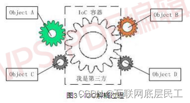
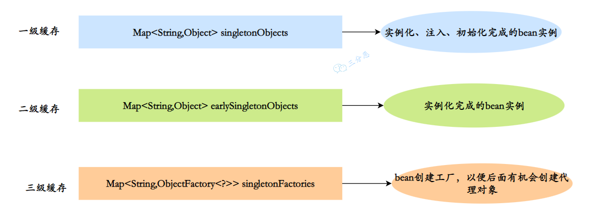

## IOC容器
### 概念定义

IOC 容器是 Spring 框架的核心部分，负责管理应用程序中的对象生命周期和依赖注入。

### 容器接口

**`BeanFactory`** 接口是 **IOC 的底层容器** 。负责管理和配置应用中的 Bean。主要负责配置、创建和管理 bean，为 Spring 提供了基本的依赖注入（DI）支持。

**`ApplicationContext`** 是 **`BeanFactory`** 的子接口，在 **`BeanFactory`** 的基础上添加了企业级的功能支持。

- 核心容器 **`BeanFactory`**
- 国际化 **`MessageSource`**
- 资源获取 **`ResourceLoader`**
- 环境信息 **`EnvironmentCapable`**
- 事件发布 **`ApplicationEventPublisher`**

其中 **`ApplicationContext`** 具有以下实现类

- **`ClassPathXmlApplicationContext`** ：通过读取类路径（resources）下的 XML格式的配置文件创建IOC容器对象
- **`FileSystemXmlApplicationContext`** ：通过文件系统路径读取 XML 格式的配置文件创建IOC 容器对象
- **`AnnotationConfigApplicationContext`** ：通过读取 Java 配置类创建 IOC 容腊对象
- **`WebApplicationContext`** ：专门为 Web 应用准备，基于 Web 环境创建 IOC 容器对象，并将对象引入存入 ServletContext 城中。

容器获取

- 根据name获取bean: **`Object getBean(String name)`**
- 根据类型获取bean：**`<T>T getBean(class<T> requiredType)`**
- 根据name获取bean(带类型转换)：**`<T>T getBean(String name,Class<T>requiredType)`**

### 启动过程

- 启动
  - **配置加载** ：加载配置文件或配置类，IoC 容器首先需要加载应用程序的配置信息，这些配置信息可以是 XML 配置文件、Java 配置类或注解配置等方式。
  - **创建容器** ：Spring 创建 IOC 容器（BeanFactory 、 ApplicationContext），准备加载和管理 Bean。
- Bean 定义注册
  - **解析和注册** ：**`BeanDefinitionReader`** 读取解析配置中的 Bean 定义，并将其注册到容器中，形成 **`BeanDefinition`** 对象。
- 实例化和依赖注入
  - **实例化** ：根据 **`BeanDefinition`** 创建 Bean 的实例。
  - **依赖注入** ：根据 **`BeanDefinition`** 中的依赖关系，可以通过构造函数注入、Setter 注入或字段注入，将依赖注入到 Bean 中。
- 初始化
  - **`BeanPostProcessor`** 处理：这些处理器会在 Bean 初始化生命周期中加入定义的处理逻辑
  - Aware 接口调用：如果 Bean 实现了 Aware 接口（如 BeanNameAware、BeanFactoryAware），Spring 会回调这些接口，传递容器相关信息。
  - 初始化方法调用：调用 Bean 的初始化方法（如通过 **`@PostConstruct`** 注解标注的方法，或实现 InitializingBean 接口的 bean 会被调用 afterPropertiesSet 方法）

## Bean对象

### 概念定义

任何通过 Spring 容器实例化、组装和管理的 Java 对象都可以被称为 Spring Bean。Bean 可以在 Spring 容器中被定义并且通过依赖注入来与其他 Bean 进行互相依赖。

即 Bean 可以看作是 Spring 应用中的一个对象，它的生命周期（创建、初始化、使用、销毁等过程）完全由 Spring 容器管理。

### 生命周期

#### 过程定义

- **实例化**：当 Spring 容器启动时，根据配置文件或注解，Spring 会首先实例化 Bean。
  - Spring 容器根据 Bean 的定义创建 Bean 的实例，相当于执行构造方法，也就是 new 一个对象。

- **依赖注入**：在实例化之后，Spring 容器会通过构造器、setter 方法或注解将其他 Bean 的依赖注入进来。
  - 相当于执行 setter 方法为字段赋值。

- **初始化**：如果 Bean 实现了 **`InitializingBean`** 接口或者使用了 **`@PostConstruct`** 注解，Spring 会在依赖注入完成后调用相应的初始化方法。
  - 初始化阶段允许执行自定义的逻辑，比如设置某些必要的属性值、开启资源、执行预加载操作等，以确保 Bean 在使用之前是完全配置好的。

- **销毁**：如果 Bean 实现了 **`DisposableBean`** 接口或使用了 **`@PreDestroy`** 注解，Spring 会在容器关闭时调用销毁方法。
  - 相当于执行 `= null`，释放资源。


#### 生命周期的拓展

- **`@PostConstruct`** 注解用于标识某个方法是 Bean 初始化后的回调方法。当 Spring 完成对 Bean 的依赖注入之后，它会自动调用带有 **`@PostConstruct`** 注解的方法。
  - 使用场景
    - **依赖注入后做额外的初始化工作**：例如，某个服务需要在依赖注入后连接外部系统。
    - **进行状态检查**：在 Bean 初始化后验证某些关键属性是否正确配置。
  - 执行时机
    - **`@PostConstruct`** 方法在依赖注入完成后立即执行，但在 Bean 可以被其他对象使用之前调用（即在 Bean 完成初始化前调用，Bean 处于准备状态）。
- **`@PreDestroy`** 注解用于标识当 Bean 被销毁时应该调用的方法。这个方法通常用于释放资源、关闭连接或者其他清理操作。Spring 容器在关闭时，会自动调用这些方法来进行资源的释放。
  - 使用场景
    - **资源清理**：例如关闭数据库连接、文件句柄、线程池等。
    - **会话管理**：例如在 Web 应用中，清理用户会话或缓存。
  - 执行时机：
    - **`@PreDestroy`** 方法在 Bean 即将被销毁时调用，一般是在 Spring 容器关闭时执行。对于单例（`singleton`）作用域的 Bean，会在容器关闭时调用；对于原型（`prototype`）作用域的 Bean，不会调用销毁方法，因为容器不管理其生命周期。
- **BeanPostProcessor接口**：
  - 通过实现 **`BeanPostProcessor`** 接口，开发者可以在 Bean 初始化前后添加自定义逻辑，如动态代理、AOP 增强等。
- **BeanFactoryPostProcessor接口**：
  - **`BeanFactoryPostProcessor`** 允许开发者在 Bean 实例化之前，修改 Bean 的定义信息（如属性值），它在所有 Bean 实例化之前执行。
- **Aware 接口**：
  - Spring 提供了多个 **`Aware`** 接口，如 **`BeanNameAware`**、**`BeanFactoryAware`**、**`ApplicationContextAware`** 等，允许 Bean 获取 Spring 容器的相关信息，进一步定制生命周期。

### 声明方式

#### 基于xml配置文件

早期的 Spring 应用通常通过 XML 文件定义 Bean，使用 `<bean>` 标签来指定类、构造器参数和依赖关系。

具体实现步骤

- 编写配置文件（元数据）
- 示例化IOC容器
- 获取Bean对象

#### 基于注解定义Bean对象

| 注解        | 说明                                                         | 位置                                            |
| ----------- | ------------------------------------------------------------ | ----------------------------------------------- |
| @Component  | 声明Bean对象的基本注解                                       | 不属于以下三类时使用该注解                      |
| @Service    | @Component的衍生注解，用于标识业务逻辑层的类。它具有明确的语义，表明该类承担业务操作 | 标注在ServiceImpl类上                           |
| @Controller | @Component的衍生注解，用于处理 HTTP 请求，并将结果返回给客户端。 | 标注在Controller类上                            |
| @Repository | @Component的衍生注解，用于数据访问层（DAO）的类，与数据库交互。 | 标注在数据访问类上（现在有mybatis，使用频率少） |

**示例**

```java
@Component
public class UserService {
}

```

**注意事项**

- 声明bean的时候，可以通过value属性指定bean的名字，如果没有指定，默认为类名首字母小写
- 使用以上四个注解都可以声明bean，但是在springboot集成web开发中，声明控制器bean只能用 **`@Controller`**

具体实现步骤

- 在组件中添加对应注解
- 指定组件扫描范围
  - Spring：修改xml配置文件
  - SpringBoot：默认扫描的范围是启动类所在包及其子包。**`@ComponentScan`** 注解虽然没有显式配置，但是实际上已经包含在了启动类声明注解 **`@SpringBootApplication`** 中
- 从IOC容器中获取容器



**`@Bean`** 和 **`@Component`** 的区别

- **`@Bean`** 注解通常用于 Java 配置类的方法上，以声明一个 Bean 并将其添加到 Spring 容器中，**用于显示声明**。
  - 使用场景：用于配置第三方库或复杂对象
  - 控制权限：**`@Bean`** 注解允许开发人员手动控制Bean的创建和配置过程
- **`@Component`** 注解用于类级别，将该类标记为 Spring 容器中的一个组件，自动检测并注册为 Bean（需要扫对应的包），用于**自动扫描和注入**。
  - 使用场景：用于自动发现并注册自定义类
  - 控制权限：**`@Component`** 注解修饰的类是出Spring框架来创建和初始化的



#### 基于配置类定义Bean对象

可以使用Java配置类来代替xml文件对Bean对象进行配置。

**`@Configuration`** 用于修饰一个类，指示某个Java类是配置类

**@Bean** 用于修饰一个方法，标识该方法的返回值是一个Bean对象

- 创建Bean类
- 创建对应的Java配置类，并使用 **`@Configuration`** 进行修饰，并在配置类中定义一个返回值为Bean对象的方法，这个方法用 **`@Bean`** 修饰
- 从IOC容器中获取Bean对象

**示例代码**

```java
@Configuration
public class commonconfig{
	@Bean //将方法返回值交给I0C容器管理,成为IOC容器的bean对象
public SAXReader saxReader(){
	return new SAXReader();
}
```



- 通过 **`@Bean`** 注解的name或value属性可以声明bean的名称，如果不指定，默认bean的名称就是方法名
- 如果第三方bean需要依赖其它bean对象，直接在bean定义方法中设置形参即可，容器会根据类型自动装配。



### 实例化方式

#### 基于构造方法


### 作用域

#### 五大作用域

Spring支持五种作用域，后三种在web环境才生效

|   作用域    |                     说明                      |
| :---------: | :-------------------------------------------: |
|  singleton  | 容器内同名称 的 bean 只有一个实例(单例)(默认) |
|  prototype  |   每次使用该 bean 时会创建新的实例(非单例)    |
|   request   |    每个请求范围内会创建新的实例(web环境中)    |
|   session   |    每个会话范围内会创建新的实例(web环境中)    |
| application |    每个应用范围内会创建新的实例(web环境中)    |

使用 **`@Scope`** 注解来指定作用域

```java
@Scope("prototype")
@RestController
@RequestMapping("/depts")
public class DeptController {
}
```



注意事项

- **`singleton`** 的bean，在容器启动时被创建，可以使用 **`@Lazy`** 注解来延迟初始化(延迟到第一次使用时)
- **`prototype`** 的bean，每一次使用该bean的时候都会创建一个新的实例。
- 实际开发当中，绝大部分的Bean是单例的，也就是说绝大部分Bean不需要配置scope属性。
- Spring 中的 Bean 默认都是单例的。



#### 作用域对生命周期的影响

Spring 只帮我们管理单例模式 Bean 的完整生命周期，对于 **`prototype`** 的 Bean，Spring 在创建好交给使用者之后，则不会再管理后续的生命周期。

#### 线程安全问题

**`prototype`** 作用域下，每次获取都会创建一个新的 bean 实例，不存在资源竞争问题，所以不存在线程安全问题。

**`singleton`** 作用域下，IoC 容器中只有唯一的 bean 实例，可能会存在资源竞争问题（取决于 Bean 是否有状态）。在多线程环境中，**如果 Bean 中包含全局可变状态（如实例变量或非线程安全资源），则可能会引发线程安全问题**。

### 区分要素

在 **Spring** 中，`id` 和 `name` 用于唯一标识 **Bean**，确保在 **IOC 容器** 中可以正确获取 Bean。

| **属性** | 作用                  | 定义方式          | 唯一性       |
| -------- | --------------------- | ----------------- | ------------ |
| **id**   | Bean 的唯一标识符     | 只能是 **一个**   | **必须唯一** |
| **name** | Bean 的别名，可有多个 | 允许 **多个别名** | **可以重复** |

Spring **默认以类名（首字母小写）**  作为Bean的 **`name`**

默认情况下，**`id`** 属性和 **`name`** 属性的值是相同的。如果只配置了 **`id`** 属性而没有配置 **`name`** 属性，则 **`name`** 属性默认与 **`id`** 属性相同。



使用xml文件配置时，同一个xml配置文件中不允许存在多个相同的id，在多个xml配置文件中允许存在多个相关id，但是

在同一个配置类文件中，如果存在多个 **`id`** 相同的Bean对象，容器内只会注册第一个Bean对象



## 什么是控制反转（IOC)

IOC意味着将你设计好的对象交给容器控制，而不是传统的在你的对象内部直接控制。

IOC容器作为中间位置“第三方”，也就是，使得A、B、C、D这四个对象没有了耦合关系，齿轮之间的传动全部依靠IOC容器，全部对象的控制权上交给IOC容器，所以IOC容器成了整个系统的关键核心，它起到一个“粘合剂”的作用，把系统中所有对象粘合在一起发挥作用。

- **控制** ：指的是对象创建（实例化、管理）的权力
- **反转** ：控制权交给外部环境（IoC 容器）

## IOC理论推导

### 反转之前

- 写一个UserDao接口

```
public interface UserDao {
   public void getUser();
}
```

- 再去写Dao的实现类

```java
public class UserDaoImpl implements UserDao {
   @Override
   public void getUser() {
       System.out.println("获取用户数据");
  }
}
```

- 然后去写UserService的接口

```java
public interface UserService {
   public void getUser();
}
```

- 最后写Service的实现类

```java
public class UserServiceImpl implements UserService {
   private UserDao userDao = new UserDaoImpl();

   @Override
   public void getUser() {
       userDao.getUser();
  }
}
```

- 测试

```java
@Test
public void test(){
   UserService service = new UserServiceImpl();
   service.getUser();
}
```

假如把Userdao的实现类增加一个

```java
public class UserDaoMySqlImpl implements UserDao {
   @Override
   public void getUser() {
       System.out.println("MySql获取用户数据");
  }
}
```

就要同时修改UserService的实现类

```java
public class UserServiceImpl implements UserService {
   private UserDao userDao = new UserDaoMySqlImpl();

   @Override
   public void getUser() {
       userDao.getUser();
  }
}
```

### 反转后

```java
public class UserServiceImpl implements UserService {
   private UserDao userDao;
// 利用set实现
   public void setUserDao(UserDao userDao) {
       this.userDao = userDao;
  }

   @Override
   public void getUser() {
       userDao.getUser();
  }
}
```

利用 **`set`** 替换 userDao的类型


## IOC的关键点

- **谁控制谁**：
  - 传统Java SE程序设计，我们直接在对象内部通过new进行创建对象，是程序主动去创建依赖对象；
  - 而IOC是有专门一个容器来创建这些对象，即由Ioc容器来控制对象的创建；
- **控制了什么**
  - 那就是主要控制了外部资源获取（不只是对象包括比如文件等）。
- **什么是反转**：
  - 传统应用程序是由我们自己在对象中主动控制去直接获取依赖对象，也就是正转；
  - 而反转则是由容器来帮忙创建及注入依赖对象
- **为什么是反转**：因为由容器帮我们查找及注入依赖对象，对象只是被动的接受依赖对象。
- **哪些方面反转了**：依赖对象的获取被反转了。

## IOC的优点

- **松耦合** ：在对象之间添加了中间层，统一管理对象，对象之间不再直接耦合
- **提高可维护性** ：由于 **对象的创建和管理** 由 **Spring IOC 容器** 负责，**开发者无需关心对象的创建和生命周期**，可以**专注于业务逻辑**。

## IOC的设计要点

- Bean的生命周期管理：需要设计Bean的创建、初始化、销毁等生命周期管理机制，可以考虑使用工厂模式和单例模式来实现。
- 依赖注入：需要实现依赖注入的功能，包括属性注入、构造函数注入、方法注入等，可以考虑使用反射机制和XML配置文件来实现。
- Bean的作用域：需要支持多种Bean作用域，比如单例、原型、会话、请求等，可以考虑使用Map来存储不同作用域的Bean实例。
- AOP功能的支持：需要支持AOP功能，可以考虑使用动态代理机制和切面编程来实现。
- 异常处理：需要考虑异常处理机制，包括Bean创建异常、依赖注入异常等，可以考虑使用try-catch机制来处理异常。
- 配置文件加载：需要支持从不同的配置文件中加载Bean的相关信息，可以考虑使用XML、注解或者Java配置类来实现。

## IOC的过程

- 所有的类都会在IOC容器中登记，告诉spring你是个什么东西，你需要什么东西，
- 然后spring会在系统运行到适当的时候，把你要的东西主动给你，同时也把你交给其他需要你的东西。
- 所有的类的创建、销毁都由spring来控制，也就是说控制对象生存周期的不再是引用它的对象，而是spring。
- 对于某个具体的对象而言，以前是它控制其他对象，现在是所有对象都被spring控制，所以这叫控制反转。

## 依赖注入（DI）

### 定义

DI（Dependency Injection，依赖注入）是 Spring 框架中用于实现**控制反转（IOC）** 的一种机制。DI 的核心思想是由容器负责对象的依赖注入，而不是由对象自行创建或查找依赖对象。

通过 DI，Spring 容器在创建一个对象时，会自动将这个对象的依赖注入进去，这样可以让对象与其依赖的对象解耦，提升系统的灵活性和可维护性。

### 关键点

- 谁依赖于谁：当然是**应用程序依赖于IoC容器**；
- 为什么需要依赖：**应用程序需要IoC容器来提供对象需要的外部资源**；
- 谁注入谁：很明显是**IoC容器注入应用程序某个对象，应用程序依赖的对象**；
- 注入了什么：就是**注入某个对象所需要的外部资源（包括对象、资源、常量数据）**

### 注入方式

#### 构造方法注入

具体实现：在构造方法中初始化Bean对象。如果类中存在无参构造方法则需要使用 **`@Autowired`** 修饰有参构造方法来告知spring使用哪个构造方法来创建对象

```java
@Controller
public class UserController {
	private UserService userService;
	public UserController(){
	@Autowired
	public UserController(UserService userService){
        	this.userService =userService;
    	}
	public void sayHi(){
		System.out.println("Hi, userController...");
        	userService.sayHi();
    }
}
```

优点:
可以注⼊final修饰的属性

注⼊的对象不会被修改

依赖对象在使⽤前⼀定会被完全初始化，因为依赖是在类的构造⽅法中执⾏的，⽽构造⽅法是在类加载阶段就会执⾏的⽅法.

通⽤性好,构造⽅法是JDK⽀持的,所以更换任何框架,他都是适⽤的

缺点:
注⼊多个对象时,代码会⽐较繁琐

#### 字段注入(不推荐)

具体实现：使用 **`@Autowired`** 注解修饰要注入的对象

```java
@Autowired
userMapper mapper;
```

不推荐的理由

- 不能像构造方法那样使用 final 注入不可变对象
- 隐藏了依赖关系，调用者可以看到构造方法注入或者 setter 注入，但无法看到私有字段的注入


#### setter方法注入

具体实现：在设置set⽅法的时候需要加上 **`@Autowired`** 注解

```java
@Controller
public class UserController {
	private UserService userService;
	@Autowired
    	public void setUserService(UserService userService){
        	this.userService =userService;
    	}
	public void sayHi(){
		System.out.println("Hi, userController..");
        userService.sayHi();
    }
}
```

- 优点:
  - ⽅便在类实例之后,重新对该对象进⾏配置或者注⼊
- 缺点:
  - 不能注⼊⼀个Final修饰的属性
  - 注⼊对象可能会被改变,因为setter⽅法可能会被多次调⽤,就有被修改的⻛险.

### 依赖注入的相关注解

#### **`@Autowired`**

**`@Autowired`** 是 **Spring 框架** 提供的 **依赖注入（DI）** 注解，作用是 **自动装配（自动注入）Bean**。它可以用于 **构造方法、Setter 方法、字段（属性）**，让 Spring 自动找到合适的 Bean 并注入。

 **默认按照类型（byType）注入**



Bean对象的默认名称是类名首字母小写



存在的问题

当同⼀类型存在多个bean时（一个接口存在多个Bean实现类）,在使⽤ **`@Autowired`** 就会存在问题，因为这个时候 Spring 会根据类型同时找到多个满足条件的选择，默认情况下它自己不知道选择哪一个。

解决方案

- 注解 **`@Qualifier`**和 **`@Autowired`** 配合使用，**`@Qualifier`** 用于在依赖注入时**消除歧义**。当一个类型有多个实现时，**`@Qualifier`** 注解通过 **`value`** 属性可以指定需要注入哪一个具体的 Bean。

  ```java
  @Component
  public class UserService {
      @Autowired
      @Qualifier("orderServiceA") // 指定使用 orderServiceA
      private OrderService orderService;
  }
  ```

  

- 在Bean对象的定义时使用 **`@Primary`** 注解，用于标记当存在多个候选 Bean 时，注入的优先级

  ```java
  import org.springframework.context.annotation.Primary;
  import org.springframework.stereotype.Component;
  
  public interface MyService {
      void performAction();
  }
  
  @Component
  @Primary
  public class MyServiceImpl1 implements MyService {
      @Override
      public void performAction() {
          System.out.println("1");
      }
  }
  
  @Component
  public class MyServiceImpl2 implements MyService {
      @Override
      public void performAction() {
          System.out.println("2");
      }
  }
  // 使用 @ Primary 注解后，此时会优先注入 MyServiceImpl1。
  ```

- 让bean对象名称与属性名相匹配：当同⼀类型存在多个bean时（一个接口存在多个Bean实现类）, **`@Autowired`** 会转为注入方式会变为 `byName`（根据名称进行匹配）

#### **`@Resource`**

**`@Resource`** 属于 JDK 提供的注解，默认注入方式为 `byName`。如果无法通过名称匹配到对应的 Bean 的话，注入方式会变为`byType`。

**`@Resource`** 有两个常用的属性：`name`（名称）、`type`（类型）。

如果仅指定 **`name`** 属性则注入方式为`byName`，如果仅指定 **`type`** 属性则注入方式为`byType`，如果同时指定`name` 和`type`属性（不建议这么做）则注入方式为`byType`+`byName`。

```java
@Component
public class Usercomponent {
	@Bean({"u1", "u2"})
    public UserInfo userInfo(){
        return new UserInfo(1,"张三");
	@Bean
	public UserInfo userInfo2(){
		return new UserInfo( 2,"李四");
    }
}
    
@Controller
public class Usercontroller {
	@Resource(name ="u1")
	private UserInfo userInfo;
	public void sayHi(){
		System.out.println("Hi,userController...");
        System.out.println(userInfo);
    }
}
```



**`@Autowired`** 和 **`@Resource`** 的区别

- **`@Autowired`** 是spring框架提供的注解，⽽ **`@Resource`** 是JDK提供的注解
- **`@Autowired`** 默认是按照类型注⼊，⽽ **`@Resource`** 是按照名称注⼊.相⽐于 **`@Autowired`** 来说，**`@Resource`** ⽀持更多的参数设置



### 循环依赖问题

#### 问题定义

循环依赖（Circular Dependency）是指两个或多个模块、类、组件之间相互依赖，形成一个闭环。简而言之，模块A依赖于模块B，而模块B又依赖于模块A，这会导致依赖链的循环，无法确定加载或初始化的顺序。

```java
@Service
public class A {
    @Autowired
    private B b;
}

@Service
public class B {
    @Autowired
    private A a;
}

//或者自己依赖自己
@Service
public class A {
    @Autowired
    private A a;
}
```

#### 解决方案

在 Spring 中，只有同时满足以下两点才能解决循环依赖的问题：

- 依赖的 Bean 必须都是单例
- 依赖注入的方式，必须 **不全是** 构造器注入，且 beanName 字母序在前的不能是构造器注入
  - 如果全是构造器注入，比如`A(B b)`，那表明在 new 的时候，就需要得到 B，此时需要 new B ，但是 B 也是要在构造的时候注入 A ，即`B(A a)`，这时候 B 需要找到不完整的 A ，但是找不到。因为 A 还没 new 完呢，所以找不到完整的 A

关键就是 **提前暴露未完全创建完毕的 Bean** 。

在 Spring 中主要是使用 **三级缓存** 来解决了循环依赖：

- 一级缓存（Singleton Objects Map）: 用于存储完全初始化完成的单例Bean。
- 二级缓存（Early Singleton Objects Map）: 用于存储尚未完全初始化，但已实例化的Bean，用于提前暴露对象，避免循环依赖问题。
- 三级缓存（Singleton Factories Map）: 用于存储对象工厂，当需要时，可以通过工厂创建早期Bean（特别是为了支持AOP代理对象的创建）。



**工作流程**：

- Spring 首先创建 Bean 实例，并将其加入三级缓存中（Factory）。
- 当一个 Bean 依赖另一个未初始化的 Bean 时，Spring 会从三级缓存中获取 Bean 的工厂，并生成该 Bean 的代理对象。
- 代理对象存入二级缓存，同时删除三级缓存中的对象，解决循环依赖。
- 一旦所有依赖 Bean 被完全初始化，Bean 将转移到一级缓存中。

#### 三级缓存的必要性

Spring 之所以需要 **三级缓存** 而不是简单的二级缓存，主要原因在于 **AOP代理** 和 **Bean的早期引用问题** 。

二级缓存虽然可以解决循环依赖的问题，但在涉及到 **动态代理（AOP）** 时，直接使用二级缓存不做任何处理会导致 **拿到的 Bean 是未代理的原始对象** 。如果二级缓存内存放的都是代理对象，则违反了 Bean 的生命周期。

#### 第二层缓存的作用

如果没有二级缓存，Spring 无法在未完成初始化的情况下暴露 Bean。会导致代理 Bean 的循环依赖问题，因为某些代理逻辑无法在三级缓存中提前暴露。最终可能抛出 BeanCurrentlyInCreationException。
