## 常见的IO模型

### 同步IO型

#### 阻塞型IO模型

应用程序发起I/O操作后会被阻塞，直到操作完成才返回结果。期间调用方会被挂起，不能继续执行其他任务，直到请求的操作完成

此时 阻塞等待的是**内核数据准备好**和**数据从内核态拷贝到用户态**这两个过程。

- **优点**：实现简单，逻辑直观；调用后直接等待数据就绪。
- **缺点**：每个连接都需要一个线程，即使没有数据到达，线程也会被占用，导致资源浪费，不适合高并发场景。

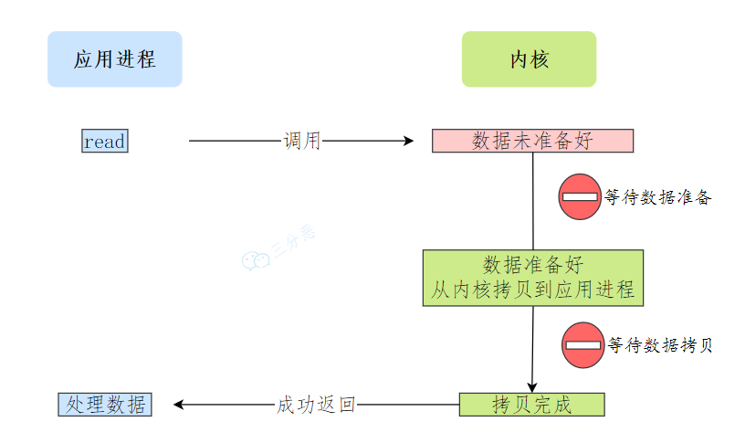

#### 非阻塞型IO模型

I/O操作不会阻塞进程，在非阻塞操作中，调用方在发出请求后立即返回。在没数据的时候，用户程序可以不再阻塞等着，而是直接返回错误，告知暂无准备就绪的数据，用户程序会通过轮询操作，不断发起 read 调用，直到内核中的数据拷贝就绪，才会停止发起 read 调用，这时调用方可以继续执行其他任务。

但是 **从内核拷贝到用户空间这一步，用户线程还是会被阻塞的**。

- **优点**：线程不会长时间阻塞，可以在无数据时执行其他任务；适用于部分实时性要求较高的场景。
- **缺点**：轮询方式会频繁进行系统调用，上下文切换开销较大，CPU 占用率较高，不适合大规模连接。

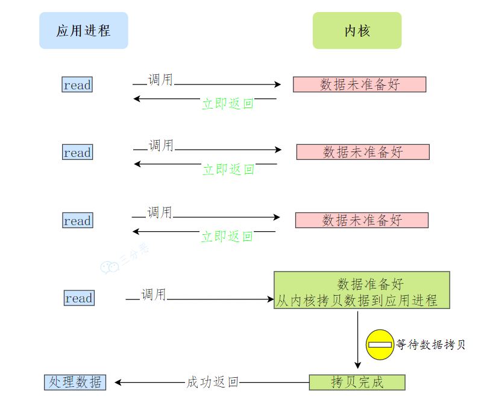

#### IO复用模型

使用 **`select`** 、**`poll`**、**`epoll`** 等系统调用，允许程序同时等待多个I/O操作，当其中任意一个就绪时进行处理。当其中任何一个I/O操作准备就绪时，应用程序会被通知。通常使用select线程 ，可以往 select 线程注册需要被监听的连接，由 select 线程来监控它所管理的连接是否有数据已就绪，如果有则可以通知别的线程来 read 读取数据。

但是 **从内核拷贝到用户空间这一步，用户线程还是会被阻塞的**。

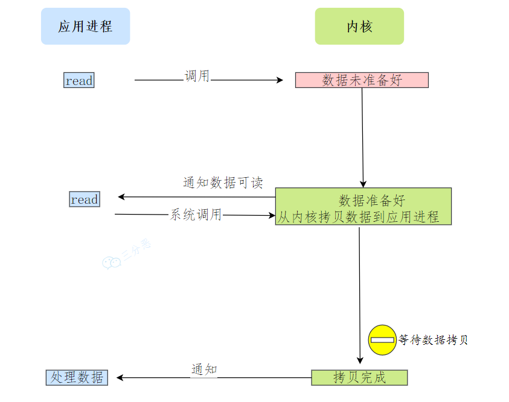

### 异步IO型

应用程序发起I/O操作后可以立即做其他事情，当I/O操作完成时，应用程序会得到通知。异步I/O模型由操作系统内核完成I/O操作，应用程序只需等待通知即可。

异步 I/O 是 **内核数据准备好** 和 **数据从内核态拷贝到用户态** 这两个过程都不⽤等待。

与多路复用模型的区别就是让内核直接把数据拷贝到用户空间之后再告知用户线程

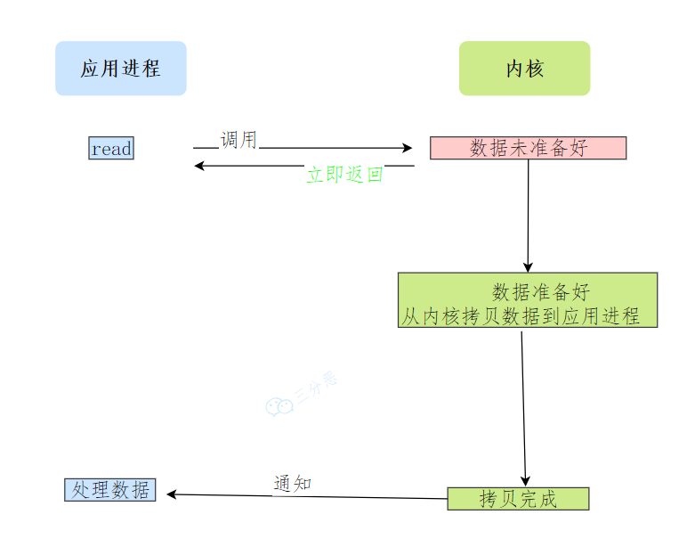

### 同步和异步的区别

同步和异步（Asynchronous） 是两种不同的任务执行方式，主要区别在于任务的执行是否需要等待其他任务完成

- **同步** ：在同步操作中，任务需要等待前一个任务完成后才能继续。调用者发起请求后，会被阻塞，直到任务完成并返回结果。调用者必须等待结果才能进行后续操作。
- **异步** ：在异步操作中，任务在发出请求后可以立即继续执行，不需要等待请求的完成。请求的结果会通过回调机制在任务完成后通知调用者。

## 零拷贝技术

### 解放CPU的技术-DMA技术

传统的IO流程

- 用户进程调用 read 方法，向操作系统发出 I/O 请求，请求读取数据到自己的内存缓冲区中，进程进入阻塞状态
- CPU 发出对应的指令给磁盘控制器，然后返回
- 磁盘控制器收到指令后，于是就开始准备数据，会把数据放入到磁盘控制器的内部缓冲区中，然后产生一个**中断**
- CPU 收到中断信号后，停下手头的工作，接着把磁盘控制器的缓冲区的数据一次一个字节地读进自己的寄存器，然后再把寄存器里的数据写入到内存，而在数据传输的期间 CPU 是无法执行其他任务的。

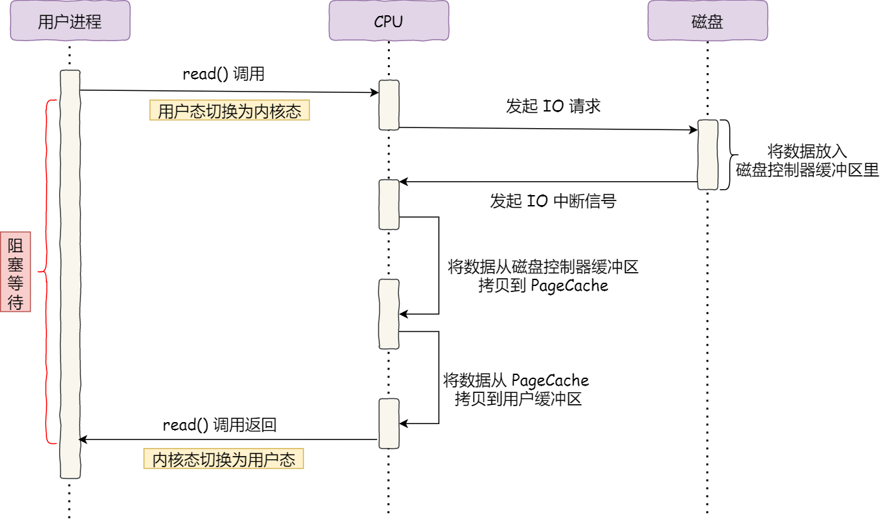

整个数据的传输过程，都要需要 CPU 亲自参与搬运数据的过程，而且这个过程，CPU 是不能做其他事情的。

DMA（直接内存访问技术）：**在进行 I/O 设备和内存的数据传输的时候，数据搬运的工作全部交给 DMA 控制器，而 CPU 不再参与任何与数据搬运相关的事情，CPU 就可以去处理别的事务** 。

**DMA的工作流程**

- 用户进程调用 read 方法，向操作系统发出 I/O 请求，请求读取数据到自己的内存缓冲区中，进程进入阻塞状态
- CPU收到请求后，进一步将 I/O 请求发送 DMA，然后让 CPU 执行其他任务
- DMA 进一步将 I/O 请求发送给磁盘；
- 磁盘收到 DMA 的 I/O 请求，把数据从磁盘读取到磁盘控制器的缓冲区中
- DMA 收到磁盘的信号，将磁盘控制器缓冲区中的数据拷贝到内核缓冲区中，此时不占用 CPU，CPU 可以执行其他任务
- 当 DMA 读取了足够多的数据，就会发送中断信号给 CPU；
- CPU 收到 DMA 的信号，知道数据已经准备好，于是将数据从内核拷贝到用户空间，系统调用返回

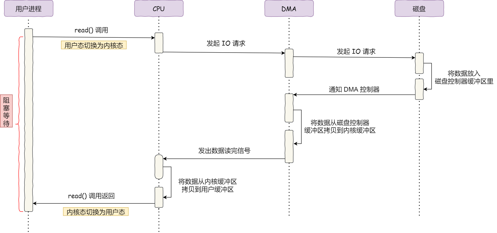

 CPU 不再参与将数据从 **磁盘控制器缓冲区搬运到内核空间** 的工作，这部分工作全程由 DMA 完成。

**DMA的模式**

- 突发传输模式

  - 一旦DMA控制器由处理器授权可以使用总线，就将系统总线的控制权交还給处理器之前传输数据块中的所有数据

  - 使用场合：将程序或数据文件加载到内存中

  - 缺点：使处理器在相对较长的时间内处于活动状态

- 循环窃取模式

  - 一旦DMA控制器获得对系统总线的使用权就传输一个字节的数据然后将系统总线的控制权返还给处理器

  - 多次发出请求直到填满整个数据块

- 透明模式

  - DMA控制器只在CPU执行不使用系统总线的操作时传输数据，DMA控制器不需要请求系统总线的控制权

  - 优点：处理器不用停止执行程序

  - 缺点：确定处理器何时需要使用系统总线所需硬件相对复杂

### 传统文件传输技术

传统 I/O 的工作方式是，数据读取和写入是从用户空间到内核空间来回复制，而内核空间的数据是通过操作系统层面的 I/O 接口从磁盘读取或写入

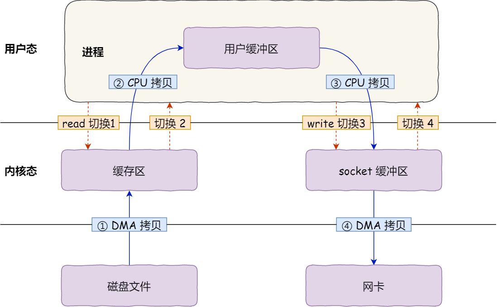

期间共**发生了 4 次用户态与内核态的上下文切换** ，因为发生了两次系统调用，一次是 **`read()`** ，一次是 **`write()`** ，每次系统调用都得先从用户态切换到内核态，等内核完成任务后，再从内核态切换回用户态。

- 第一次上下文切换：把磁盘上的数据拷贝到操作系统内核的缓冲区里，这个拷贝的过程是通过 DMA 搬运的。
- 第二次上下文切换：把内核缓冲区的数据拷贝到用户的缓冲区里，于是我们应用程序就可以使用这部分数据了，这个拷贝到过程是由 CPU 完成的。
- 第三次拷贝：把刚才拷贝到用户的缓冲区里的数据，再拷贝到内核的 socket 的缓冲区里，这个过程依然还是由 CPU 搬运的。
- 第四次拷贝：把内核的 socket 缓冲区里的数据，拷贝到网卡的缓冲区里，这个过程又是由 DMA 搬运的。

### 零拷贝技术

**零拷贝（Zero-Copy）** 是一种高效的数据传输技术，它可以将数据从内核空间直接传输到应用程序的内存空间中，避免了不必要的数据拷贝，从而提高了数据传输的效率和性能。数据可以**直接从外部设备复制到应用程序的内存空间中**，避免了**中间的内核空间缓冲区**，减少了**不必要的数据拷贝**，提高了**数据传输的效率和性能**。

#### mmap + write

**`mmap()`** 系统调用函数会直接把内核缓冲区里的数据**映射**到用户空间，这样，操作系统内核与用户空间就不需要再进行任何的数据拷贝操作。

- 应用进程调用了 **`mmap()`** 后，DMA 会把磁盘的数据拷贝到内核的缓冲区里。接着，应用进程跟操作系统内核共享这个缓冲区；
- 应用进程再调用 **`write()`**，操作系统直接将内核缓冲区的数据拷贝到 socket 缓冲区中，这一切都发生在内核态，由 CPU 来搬运数据；
- 最后，把内核的 socket 缓冲区里的数据，拷贝到网卡的缓冲区里，这个过程是由 DMA 搬运的。
- 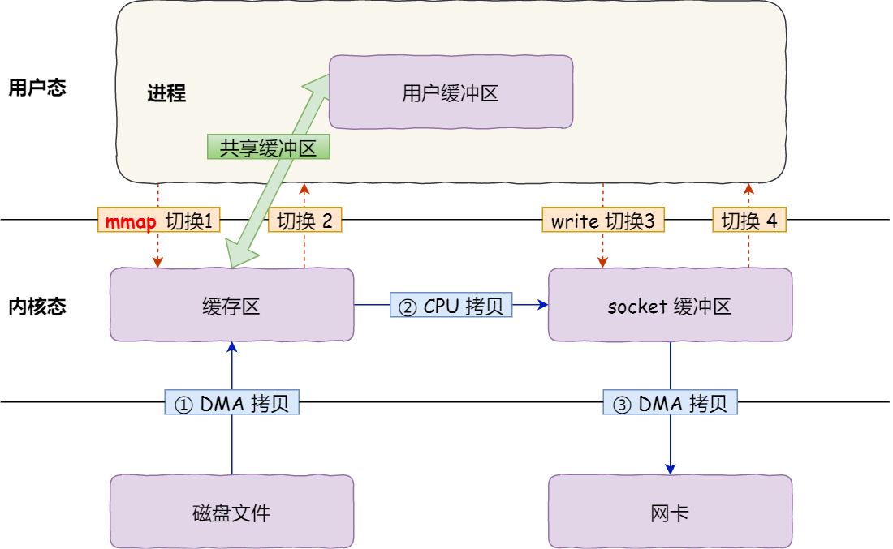

#### sendfile

**`sendfile()`** 可以替代前面的 **`read()`** 和 **`write()`** 这两个系统调用，这样就可以减少一次系统调用，也就减少了 2 次上下文切换的开销。这个系统调用可以直接把内核缓冲区里的数据拷贝到 socket 缓冲区里，不再拷贝到用户态

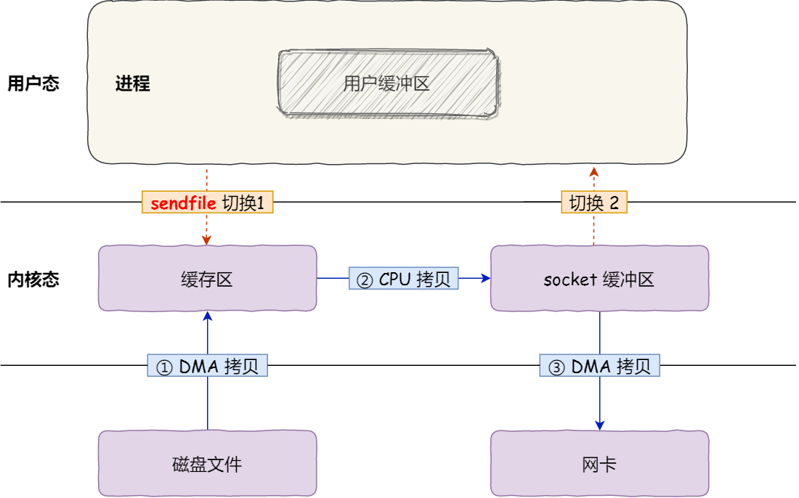

对于支持网卡支持 SG-DMA 技术的情况下， **`sendfile()`** 系统调用的过程得到优化，具体过程如下：

- 通过 DMA 将磁盘上的数据拷贝到内核缓冲区里；
- 缓冲区描述符和数据长度传到 socket 缓冲区，这样网卡的 SG-DMA 控制器就可以直接将内核缓存中的数据拷贝到网卡的缓冲区里，此过程不需要将数据从操作系统内核缓冲区拷贝到 socket 缓冲区中，这样就减少了一次数据拷贝；

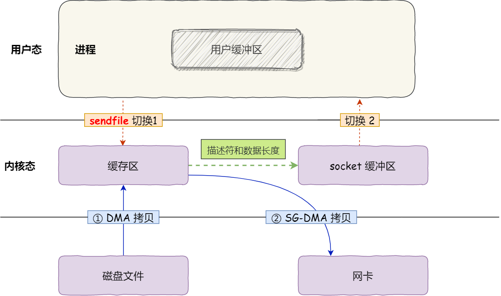

## 网络模型

### 基本的Socket模型

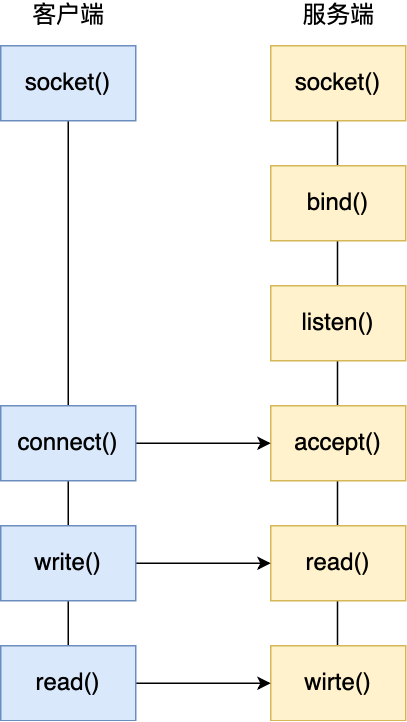

#### 服务端

- 服务端首先调用 `socket()` 函数，创建网络协议为 IPv4，以及传输协议为 TCP 的 Socket 
- 接着调用 `bind()` 函数，给这个 Socket 绑定一个 **IP 地址** 和 **端口**
  - 绑定端口的目的：当内核收到 TCP 报文，通过 TCP 头里面的端口号，来找到应用程序，然后把数据传递给我们。
  - 绑定 IP 地址的目的：一台机器是可以有多个网卡的，每个网卡都有对应的 IP 地址，当绑定一个网卡时，内核在收到该网卡上的包，才会发给我们
- 调用 `listen()` 函数进行监听
- 服务端进入了监听状态后，通过调用 `accept()` 函数，来从内核获取客户端的连接，如果没有客户端连接，则会阻塞等待客户端连接的到来。

在 TCP 连接的过程中，服务器的内核实际上为每个 Socket 维护了两个队列：

- 一个是「还没完全建立」连接的队列，称为 **TCP 半连接队列** ，这个队列都是没有完成三次握手的连接，此时服务端处于 `syn_rcvd` 的状态；
- 一个是「已经建立」连接的队列，称为 **TCP 全连接队列** ，这个队列都是完成了三次握手的连接，此时服务端处于 `established` 状态；

当 TCP 全连接队列不为空后，服务端的 `accept()` 函数，就会从内核中的 TCP 全连接队列里拿出一个已经完成连接的 Socket 返回应用程序，后续数据传输都用这个 Socket。

#### 客户端

- 客户端创建好 Socket 后
- 调用 `connect()` 函数发起连接，指明服务端的 IP 地址和端口号

连接建立后，客户端和服务端就开始相互传输数据了，双方都可以通过 `read()` 和 `write()` 函数来读写数据。

#### 模型的限制

- **文件描述符** ：Socket 实际上是一个文件，也就会对应一个文件描述符。在 Linux 下，单个进程打开的文件描述符数是有限制的
- **系统内存** ：每个 TCP 连接在内核中都有对应的数据结构，意味着每个连接都是会占用一定内存的；

### 多进程模型

服务器的主进程负责监听客户的连接，一旦与客户端连接完成，accept() 函数就会返回一个「已连接 Socket」，这时就通过 `fork()` 函数创建一个子进程。

- 子进程会 **复制父进程的文件描述符** ，于是就可以直接使用已连接 Socket 和客户端通信了
- 父进程将客户端服务交给子进程来处理，因此父进程不需要关心已连接 Socket，只需要关心监听 Socket

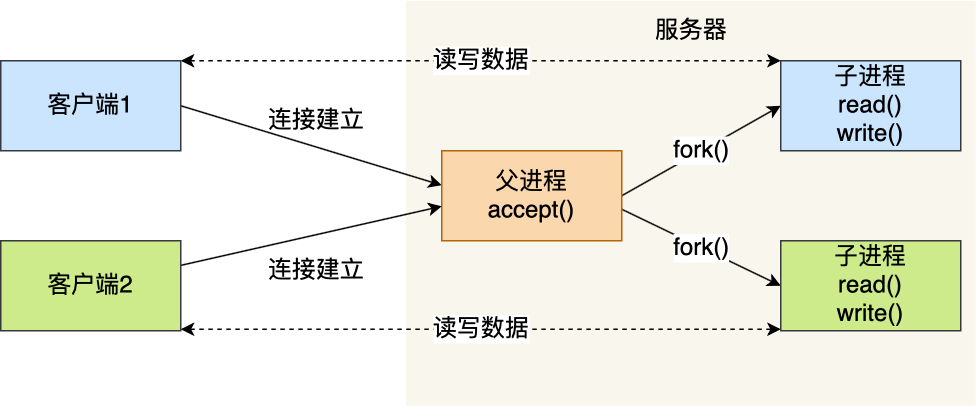

### 多线程模型

当服务器与客户端 TCP 完成连接后，通过 `pthread_create()` 函数创建线程，然后将已连接 Socket的文件描述符传递给线程函数，接着在线程里和客户端进行通信，从而达到并发处理的目的。

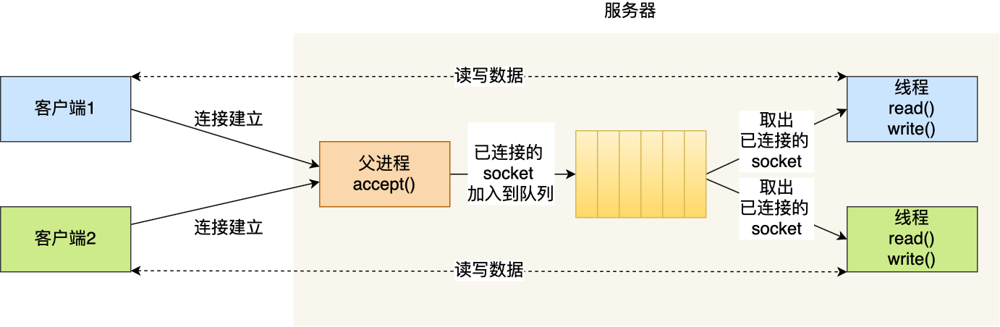

**线程池** 可以避免线程的频繁创建和销毁，所谓的线程池，就是提前创建若干个线程，这样当由新连接建立时，将这个已连接的 Socket 放入到一个队列里，然后线程池里的线程负责从队列中取出「已连接 Socket 」进行处理。

### IO多路复用模型

#### select/poll模型

**IO 多路复用是**指将已连接的 Socket 都放到一个文件描述符集合 ，然后调用函数将文件描述符集合拷贝到内核里，让内核来检查是否有网络事件产生。

检查的方式，就是通过**遍历**文件描述符集合的方式，当检查到有事件产生后，将此 Socket 标记为可读或可写， 接着再把整个文件描述符集合**拷贝**回用户态里，然后用户态还需要再通过**遍历**的方法找到可读或可写的 Socket，然后再对其处理。

**`select`** 模型和 **`poll`** 模型没有本质区别，都是使用线性结构存储socket

- **`select`** 使用固定长度的 BitsMap，表示文件描述符集合，而且所支持的文件描述符的个数是有限制的，

- **`poll`** 使用动态数组，以链表形式来组织，突破了 **`select`** 的文件描述符个数限制

#### epoll模型

**`epoll`** 是Linux系统对 **`select`** 和 **`poll`** 的优化。优化在以下方面。

红黑树的使用：epoll 在内核里使用 **红黑树** 代替线性结构跟踪进程所有待检测的文件描述符。红黑树的增删改一般时间复杂度是 $O(logn)$。相较于select/poll 每次操作时都传入整个 socket 集合给内核，而 epoll 因为在内核维护了红黑树，可以保存所有待检测的 socket，当事件发生时只需要传递活跃的文件描述符而不需要传递所有的文件描述符，减少了内核和用户空间大量的数据拷贝和内存分配。

事件驱动的机制： epoll 使用 **事件驱动** 的机制，内核里**维护了一个链表来记录就绪事件** ，当某个 socket 有事件发生时，通过 **回调函数** 内核会将其加入到这个就绪事件列表中，不需要像 select/poll 那样轮询扫描整个 socket 集合，大大提高了检测的效率。

epoll提供了两种事件触发机制 **边缘触发** 和 **水平触发**

- 边缘触发：当被监控的 Socket 描述符上有事件发生时， **服务器端只会从 `epoll_wait` 中苏醒一次，只会当事件发生时传递一次事件** ，即使进程没有调用 read 函数从内核读取数据，也依然只苏醒一次，因此我们程序要保证一次性将内核缓冲区的数据读取完
- 水平触发：当被监控的 Socket 上有可读事件发生时，**服务器端不断地从 `epoll_wait` 中苏醒，一直不断地把这个事件传递给用户**，直到内核缓冲区数据被 read 函数读完才结束 ，目的是告诉我们有数据需要读取

## 高性能网络模式

### Reactor模式

Reactor模式是对 I/O 多路复用作了一层封装，让使用者不用考虑底层网络 API 的细节，只需要关注应用代码的编写。

Reactor模式的核心思想是 **将I/O事件与相应的处理程序解耦** ，并通过 **事件分发器** 来管理事件和响应操作。

#### 组成部分

Reactor 模式主要由 Reactor 和处理资源池这两个核心部分组成

- Reactor： 负责监听和分发事件，它通常封装了一个多路复用器（如 **`select`** 、**`epoll`** ），在事件到达时将其分发给相应的事件处理器。
- Handler：负责处理事件，每个事件处理器与一个具体的I/O事件绑定，定义了在事件发生时应该执行的逻辑。
- Acceptor：在服务器端，**`Acceptor`** 用于接受新的客户端连接，并为每个新连接分配一个Handler进行后续的数据处理

#### 工作流程

- **Reactor** 通过多路复用器监听多个通道，等待事件（如连接到达、数据可读等）的发生。
- 当某个通道有事件发生时，Reactor将事件分发给相应的 **Handler** 。
- **Handler** 根据事件类型执行相应的操作，如读取数据、写入数据或处理业务逻辑。
- 事件处理完成后，**Reactor** 继续监听其他事件。

### Proactor模式

**Proactor 是异步网络模式， 感知的是已完成的读写事件** 。在发起异步读写请求时，需要传入数据缓冲区的地址（用来存放结果数据）等信息，这样系统内核才可以自动帮我们把数据的读写工作完成，这里的读写工作全程由操作系统来做，并不需要像 Reactor 那样还需要应用进程主动发起 read/write 来读写数据，操作系统完成读写工作后，就会通知应用进程直接处理数据。

#### 工作流程

- Proactor Initiator 负责创建 Proactor 和 Handler 对象，并将 Proactor 和 Handler 都通过 Asynchronous Operation Processor 注册到内核；
- Asynchronous Operation Processor 负责处理注册请求，并处理 I/O 操作
- Asynchronous Operation Processor 完成 I/O 操作后通知 Proactor
- Proactor 根据不同的事件类型回调不同的 Handler 进行业务处理
- Handler 完成业务处理

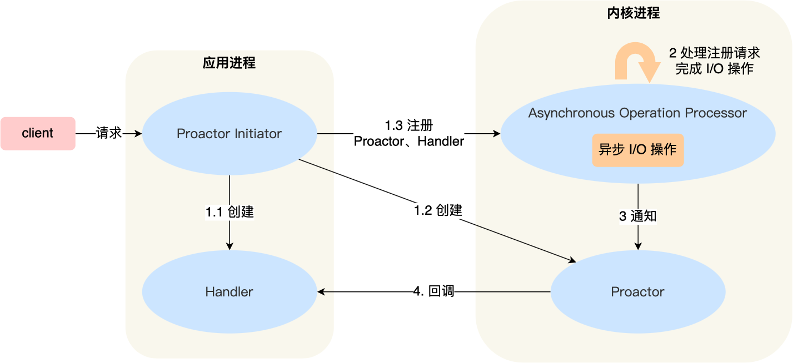

### Reactor模式和Proactor模式的区别

- **Reactor 是非阻塞同步网络模式，感知的是就绪可读写事件** ：在每次感知到有事件发生（比如可读就绪事件）后，就需要应用进程主动调用 read 方法来完成数据的读取，也就是要应用进程主动将 socket 接收缓存中的数据读到应用进程内存中，这个过程是同步的，读取完数据后应用进程才能处理数据。
- **Proactor 是异步网络模式， 感知的是已完成的读写事件** ：在发起异步读写请求时，需要传入数据缓冲区的地址（用来存放结果数据）等信息，这样系统内核才可以自动帮我们把数据的读写工作完成，这里的读写工作全程由操作系统来做，并不需要像 Reactor 那样还需要应用进程主动发起 read/write 来读写数据，操作系统完成读写工作后，就会通知应用进程直接处理数据。