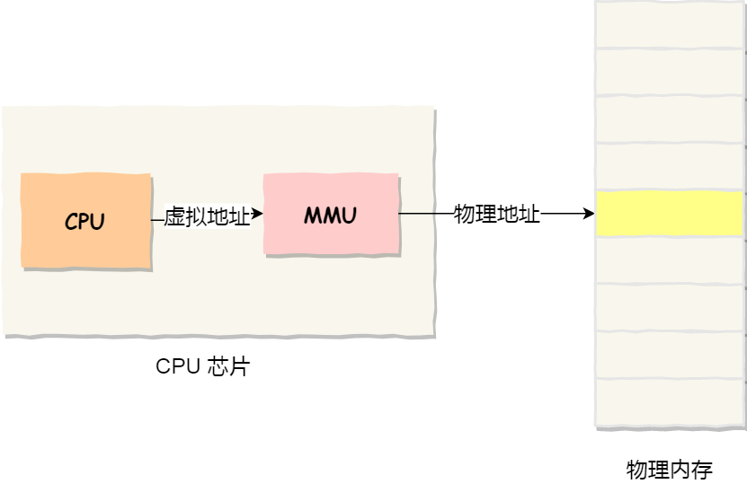
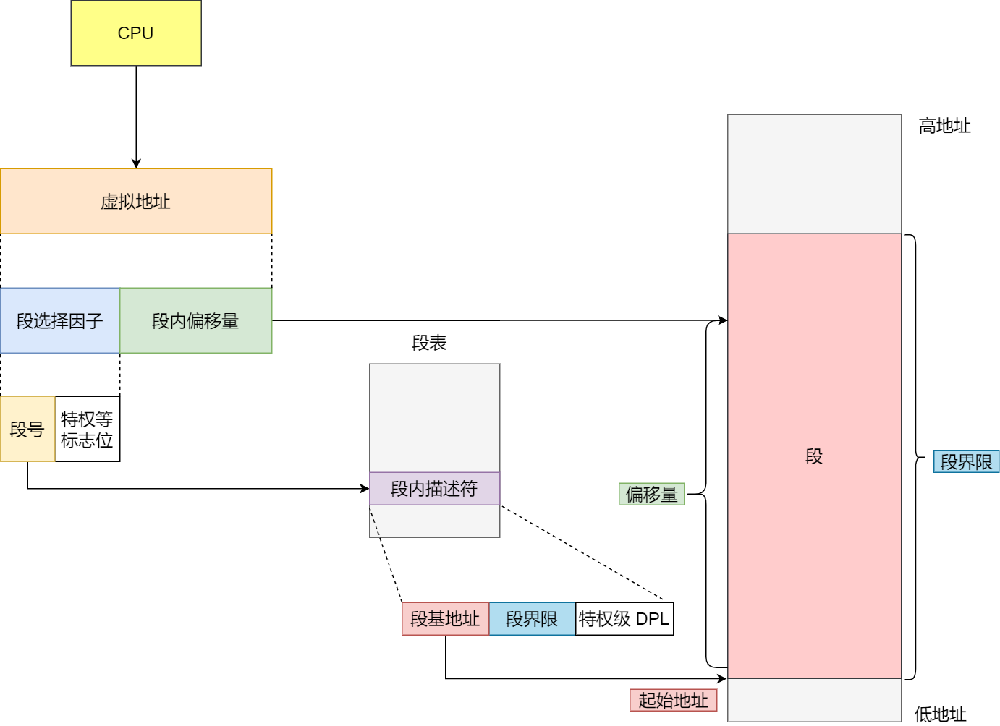
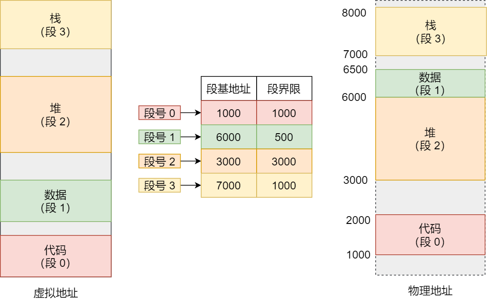
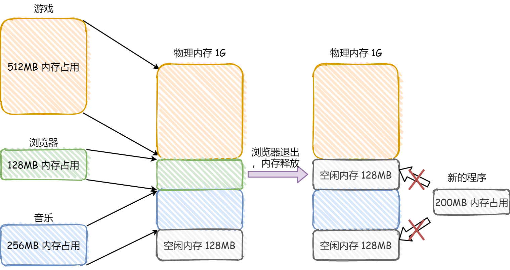
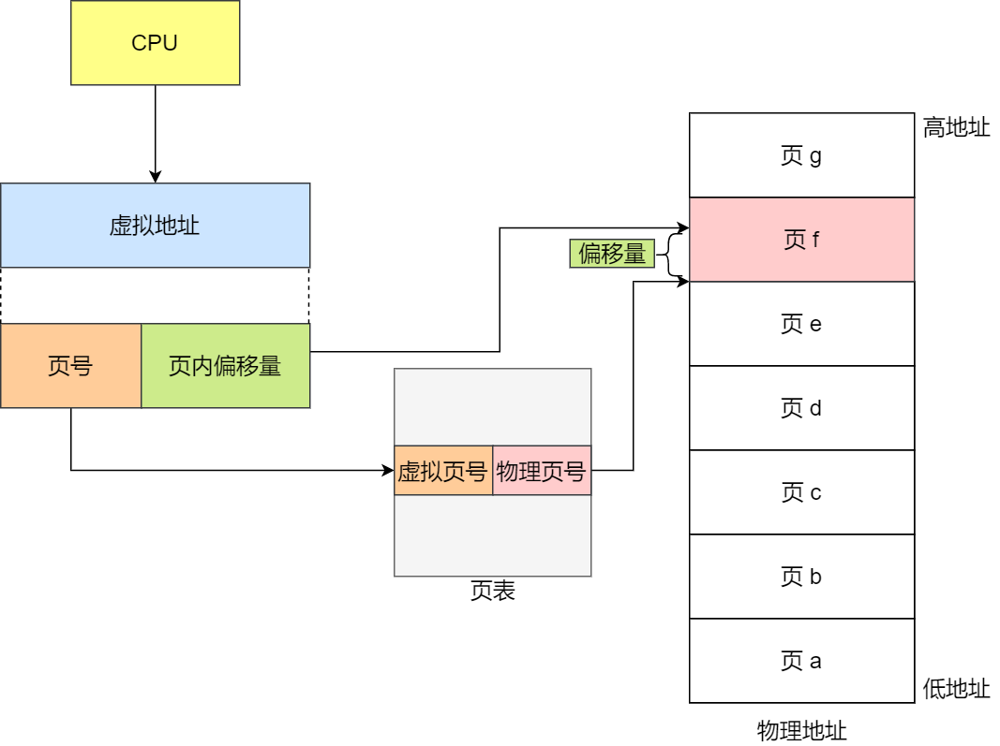

## 虚拟内存

### 虚拟内存的定义

**虚拟内存** 是计算机系统内存管理非常重要的一个技术，本质上来说它只是逻辑存在的，是一个假想出来的内存空间，主要作用是作为进程访问主存（物理内存）的桥梁并简化内存管理。每个程序在运行时认为自己拥有的内存空间就是虚拟内存，其大小可以远远大于物理内存的大小。

### 虚拟内存的存在意义

如果直接操作物理地址的话，存在以下的问题

- 用户程序可以访问任意内存，寻址内存的每个字节，这样就很容易破坏操作系统，造成操作系统崩溃。
- 同时运行多个程序会特别困难，当两个用户程序引用同一个物理地址时会导致程序崩溃

而在进程和物理内存之间添加一个中间层虚拟地址，就可以解决这个问题。因为进程不会直接操作物理地址，导致多个进程不会同时引用同一个物理地址

### 虚拟地址的原理

虚拟地址作为中间层把进程所使用的地址隔离开来（让操作系统为每个进程分配独立的一套 **虚拟地址** ），进程之间的地址是隔离的，互不干涉。前提每个进程都不能访问物理地址。至于虚拟地址最终怎么映射到物理内存里，对进程来说是透明的，操作系统将决定虚拟地址和物理地址的映射关系

程序要访问虚拟地址的时候，由操作系统转换成不同的物理地址，这样不同的进程运行的时候，写入的是不同的物理地址，这样就不会冲突了。



- **虚拟内存地址** ：程序所使用的内存地址，由CPU生成，用于内存的访问和操作。逻辑地址在程序编写和编译时使用，并由操作系统通过地址转换机制（如页表）映射到物理地址。
- **物理内存地址** ：实际存在硬件里面的空间地址，由内存管理单元（MMU）直接访问。它表示数据在物理内存中的实际存储位置，是由硬件层面决定的。物理地址直接对应到内存芯片上的某个位置，它是CPU在访问内存时经过地址转换后的实际地址



操作系统引入了虚拟内存，进程持有的虚拟地址会通过 CPU 芯片中的内存管理单元（MMU）的映射关系，来转换变成物理地址，然后再通过物理地址访问内存

### 虚拟内存的优点

- **内存扩展能力：**

  - 虚拟内存允许程序运行在比实际物理内存大的地址空间上。即使物理内存不足，系统也可以通过交换（swapping）将不常用的内存页移到磁盘中，使得多个程序能够同时运行。

- **进程隔离：**

  - 每个进程拥有独立的虚拟地址空间，防止进程间的内存访问冲突，提高系统稳定性和安全性。

  - 使用虚拟内存，操作系统可以通过页面表设置访问权限，防止非法访问。

- **简化内存管理：**

  - 操作系统可以更灵活地分配和回收内存，无需手动考虑物理内存布局问题。

  - 虚拟内存可以将程序逻辑地址与物理地址解耦。

## 物理地址和虚拟地址的映射管理方式

### 分段管理

将程序视为若干个逻辑分段组成的，如可由代码分段、数据分段、栈段、堆段组成。不同的段是有不同的属性的，同时具有实际意义和逻辑信息。将程序以段的形式进行划分，**连续** 的物理内存的形式管理/分配物理内存

#### 分段管理下的虚拟地址

分段机制下的虚拟地址由两部分组成：**段选择因子** 和 **段内偏移量**。

- **段选择因子** ：保存在段寄存器里面
  - **段号** ：用作段表的索引，标识这个段在虚拟地址的哪一段
  - **段标志位** ：某些特权位
- **段内偏移量** ：相对于该段的起始地址的偏移量，位于 0 和段界限之间，如果段内偏移量是合法的，就将段基地址加上段内偏移量得到物理内存地址。

#### 分段管理下的地址映射

虚拟地址是通过 **段表** 与物理地址进行映射的。**段表** 里面保存的是这个 **段的基地址、段的界限和特权等级** 等。

分段机制会把程序的虚拟地址分成 4 个段，每个段在段表中有一个项，由MMU进行地址翻译

- MMU 首先解析得到虚拟地址中的段号；
- 通过段号去该应用程序的段表中取出对应的段信息（找到对应的段表项）；
- 从段信息中取出该段的起始地址（物理地址）加上虚拟地址中的段内偏移量得到最终的物理地址。

#### 分段管理的缺点

分段管理会产生 **外部碎片**  。每个段的长度不固定，所以多个段未必能恰好使用所有的内存空间，会产生了多个不连续的小物理内存，导致新的程序无法被装载

解决方法：**内存交换**

可以通过将整块的内存先写入硬盘然后在读入内存，但是读入内存时不会占据原来的内存位置而是尽量和其他的整块内存相连，使得原来碎片化的内存合并起来。

### 分页管理

分页管理是把整个虚拟和物理内存空间切成⼀段段连续且尺寸固定的内存空间。其中在虚拟内存称为 **页** ，在物理内存的称为 **页框** 。

页和页框的大小相同，在Linux系统中大小为4KB。页表保存了页和页框之间的映射关系

#### 分页管理下的虚拟地址

在分页机制下，虚拟地址分为两部分，**页号** 和 **页内偏移** 。页号作为页表的索引，**页表** 包含物理页每页所在 **物理内存的基地址** ，这个基地址与页内偏移的组合就形成了物理内存地址。地址翻译依然由MMU完成

#### 分页管理下的地址映射

- MMU 首先解析得到虚拟地址中的虚拟页号；
- 通过虚拟页号去该应用程序的页表中取出对应的物理页号（找到对应的页表项）；
- 用该物理页号对应的物理页起始地址（物理地址）加上虚拟地址中的页内偏移量得到最终的物理地址

当页表中的页表项未被命中时，代表物理内存中没有对应的物理页或者物理内存中有对应的物理页但虚拟页还未和物理页建立映射（对应的页表项不存在）就会抛出缺页异常。此时系统进入内核态，针对不同类型的缺页中断进行操作

- **硬性页缺失** ：物理内存中没有对应的物理页。于是，Page Fault Handler 会指示 CPU 从已经打开的磁盘文件中读取相应的内容到物理内存，而后交由 MMU 建立相应的虚拟页和物理页的映射关系。
- **软性页缺失** ：物理内存中有对应的物理页，但虚拟页还未和物理页建立映射。于是，Page Fault Handler 会指示 MMU 建立相应的虚拟页和物理页的映射关系。

如果没有空闲的物理内存，那么内核就会开始进行 **回收内存** 的工作，回收的方式主要是两种：直接内存回收和后台内存回收。

- **后台内存回收** ：在物理内存紧张的时候，会唤醒 kswapd 内核线程来回收内存，这个回收内存的过程**异步**的，不会阻塞进程的执行。
- **直接内存回收** ：如果后台异步回收跟不上进程内存申请的速度，就会开始直接回收，这个回收内存的过程是**同步**的，会阻塞进程的执行。

#### 分页管理下的内存交换

当系统的物理内存不够用的时候，就需要将物理内存中的一部分空间释放出来，以供当前运行的程序使用。那些被释放的空间可能来自一些很长时间没有什么操作的程序，这些被释放的空间会被临时保存到磁盘，等到那些程序要运行时，再从磁盘中恢复保存的数据到内存中。

内存交换 就是把一块磁盘空间或者本地文件，当成内存来使用，它包含换出和换入两个过程

- **换出** ：把进程暂时不用的内存数据存储到磁盘中，并释放这些数据占用的内存
- **换入** ：在进程再次访问这些内存的时候，把它们从磁盘读到内存中来



当内存资源不足时，Linux 把某些页的内容转移至磁盘上的一块空间上，以释放内存空间。磁盘上的那块空间叫做交换空间(swap space)，而这一过程被称为交换。物理内存和交换空间的总容量就是虚拟内存的可用容量。



#### 分页管理的优缺点

- 优点
  - **解决了外部碎片的问题** ：由于页和页框大小固定，可以有效避免分段方式中段间未使用内存造成的外部碎片问题。
  - **内存管理灵活**：页表支持页的按需加载和交换（如虚拟内存机制），可以将不常用的页交换到磁盘上，从而扩大进程的可用内存空间
- 缺点
  - **内部碎片** ：如果程序使用的内存量不足一个页的大小，会造成页内未使用部分的浪费，即内部碎片问题。
  - **页表管理开销大** ：每个进程都需要维护自己的页表，页表的大小与逻辑地址空间成正比。多级页表虽然节省了内存，但增加了地址转换的复杂性。

#### 页面置换算法

- **先进先出置换算法** ：基本思路是，优先淘汰最早进入内存的页面。FIFO 算法维护一个队列，新来的页面加入队尾，当发生页面置换时，队头的页面（即最早进入内存的页面）被移出。
- **最少使用页面置换算法（LFU，Least Frequently Used）** : 置换算法选择的是之前一段时间内使用最少的页面作为淘汰页。
- **时钟页面置换算法** ：LRU 的一种近似和实现简单的形式。它通过一个循环列表（类似时钟的指针）遍历页面，每个页面有一个使用位，当页面被访问时，使用位设置为 1。当需要页面置换时，时钟指针会顺时针移动，直到找到使用位为 0 的页面进行置换。这个过程类似于给每个页面一个二次机会。算法执行时，会先将使用位从 1 清零，如果该页面再次被访问，它的使用位再次被设置为 1。
- **最近最久未使用页面置换算法（LRU ）** ：LRU 算法赋予每个页面一个访问字段，用来记录一个页面自上次被访问以来所经历的时间 T，当须淘汰一个页面时，选择现有页面中其 T 值最大的，即最近最久未使用的页面予以淘汰。