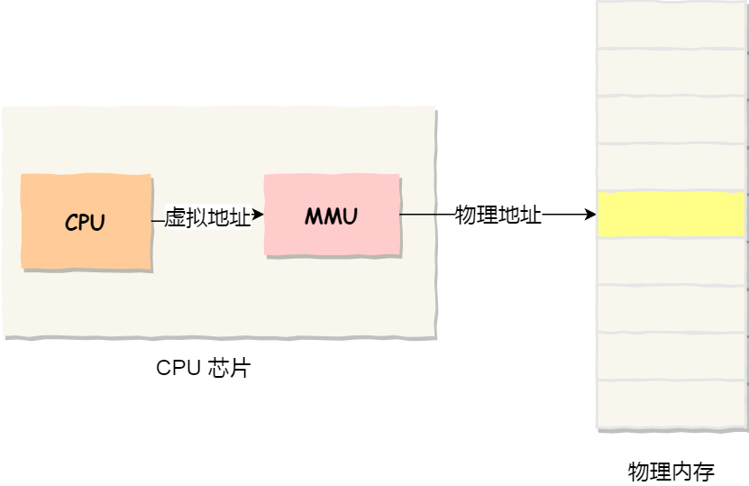
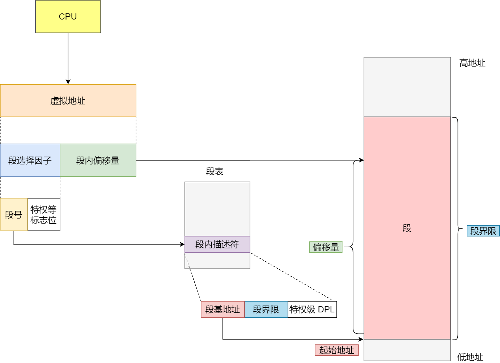
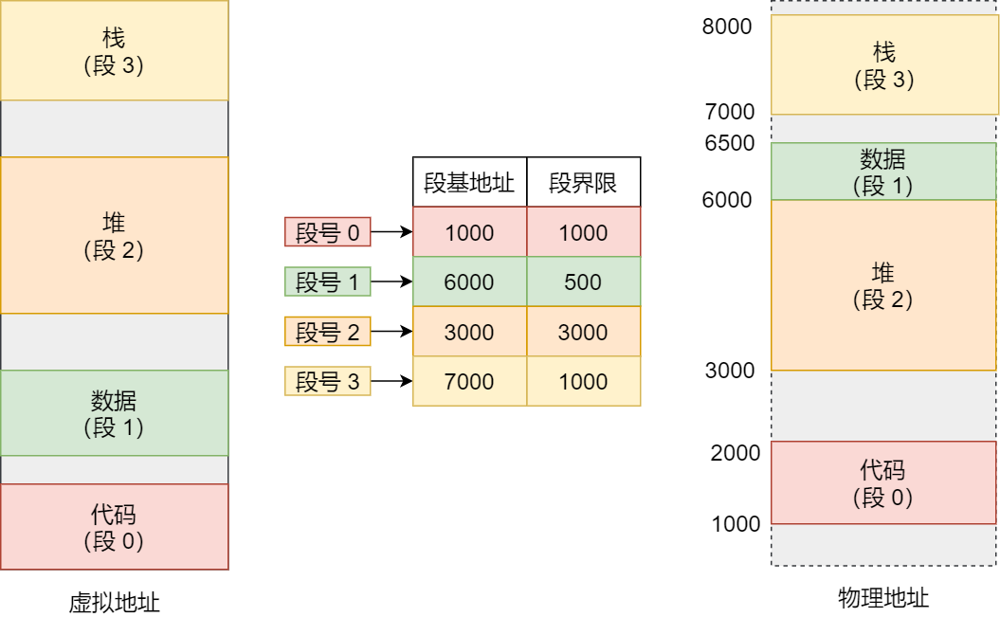
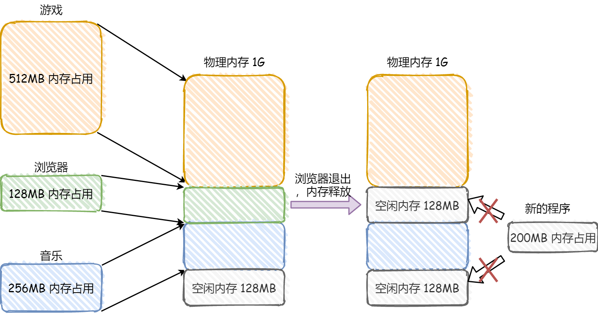
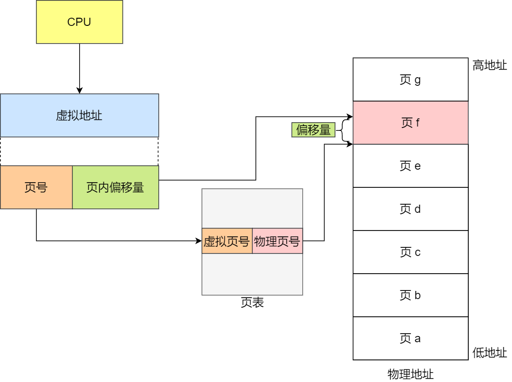
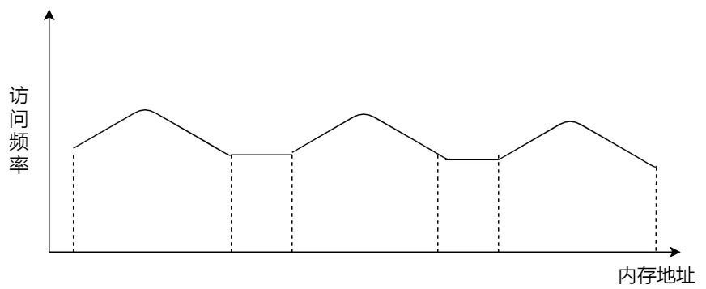
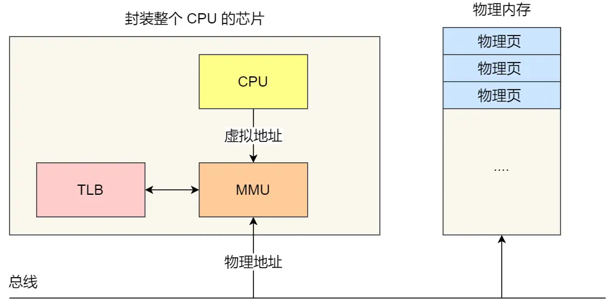
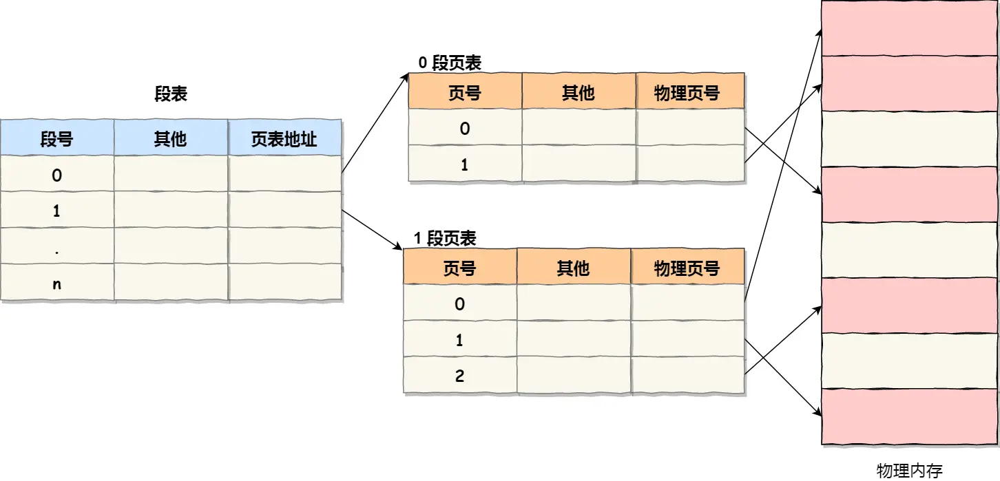
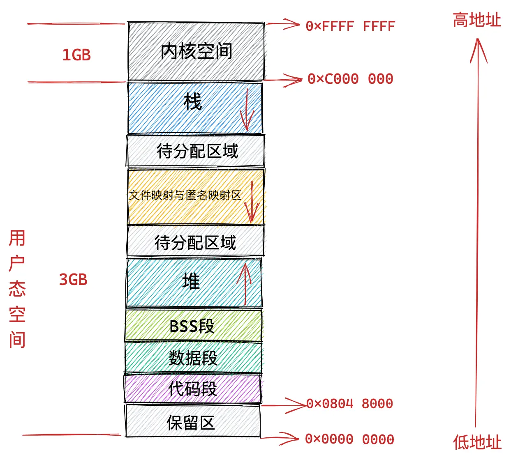
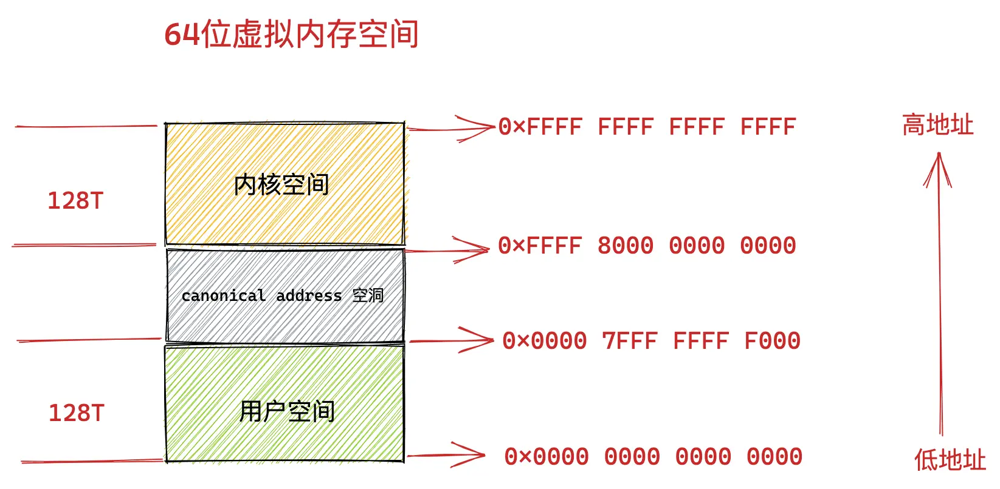

## 🧠 虚拟内存

### 📖 虚拟内存的定义

**虚拟内存** 是计算机系统内存管理非常重要的一个技术，本质上来说它只是逻辑存在的，是一个假想出来的内存空间，主要作用是作为进程访问主存（**物理内存**）的桥梁并简化内存管理。每个程序在运行时认为自己拥有的内存空间就是虚拟内存，其大小可以远远大于物理内存的大小。

### 💡 虚拟内存的存在意义

如果直接操作物理地址的话，存在以下的问题:

- **程序员负担过重**：需要精确知道每一个变量在内存中的具体位置，手动对物理内存进行布局
- **多进程地址冲突**：当两个用户程序引用同一个物理地址时会导致程序崩溃
- **内存分配困难**：需要考虑为每个进程分配多少内存，内存紧张时如何处理
- **地址空间隔离**：如何避免进程与进程之间的地址冲突

而在进程和物理内存之间添加一个中间层**虚拟地址**，就可以解决这个问题。因为进程不会直接操作物理地址，导致多个进程不会同时引用同一个物理地址。

### 🏠 虚拟地址的生活类比

理解虚拟内存地址，可以用我们日常生活中**收货地址**来类比：

当我们在网上购物时填写的收货地址（xx 省 xx 市 xx 区 xx 街道 xx 小区 xx 室），这个地址在现实世界中并不真实存在，它只是人们提出的一个**虚拟概念**。通过这个虚拟概念将它和现实世界真实存在的城市、小区、街道的地理位置一一映射起来，快递小哥就可以根据这个地址找到我们的真实住所。

- **收货地址** = **虚拟地址**（人为定义的，可以变化）
- **真实地理位置** = **物理地址**（真实存在的，不变）

比如现在的广东省深圳市在过去叫宝安县，河北省的石家庄过去叫常山。不管是常山也好，石家庄也好，这些都是人为定义的名字而已，但是地方还是那个地方，它所在的地理位置是不变的。**虚拟地址可以人为的变来变去，但是物理地址永远是不变的**。

在计算机世界中，虚拟内存地址也有类似的层次结构。以 **Intel Core i7** 处理器为例：

- **64 位虚拟地址格式**：全局页目录项（9 位）+ 上层页目录项（9 位）+ 中间页目录项（9 位）+ 页表项（9 位）+ 页内偏移（12 位），共 **48 位**
- **32 位虚拟地址格式**：页目录项（10 位）+ 页表项（10 位）+ 页内偏移（12 位），共 **32 位**

虚拟内存地址中的**全局页目录项**类比收货地址里的**省**，**上层页目录项**类比**市**，**中间层页目录项**类比**区县**，**页表项**类比**街道小区**，**页内偏移**类比**楼栋和几层几号**。

### 🔄 虚拟地址的原理

虚拟地址作为中间层把进程所使用的地址隔离开来（让操作系统为每个进程分配独立的一套 **虚拟地址** ，进程之间的地址是隔离的，互不干涉。前提每个进程都不能访问物理地址。至于虚拟地址最终怎么映射到物理内存里，对进程来说是透明的，操作系统将决定虚拟地址和物理地址的映射关系。

程序要访问虚拟地址的时候，由操作系统转换成不同的物理地址，这样不同的进程运行的时候，写入的是不同的物理地址，这样就不会冲突了。



- **虚拟内存地址** ：程序所使用的内存地址，由**CPU**生成，用于内存的访问和操作。逻辑地址在程序编写和编译时使用，并由操作系统通过地址转换机制（如页表）映射到物理地址。
- **物理内存地址** ：实际存在硬件里面的空间地址，由内存管理单元（**MMU**）直接访问。它表示数据在物理内存中的实际存储位置，是由硬件层面决定的。物理地址直接对应到内存芯片上的某个位置，它是**CPU**在访问内存时经过地址转换后的实际地址



操作系统引入了虚拟内存，进程持有的虚拟地址会通过 **CPU** 芯片中的内存管理单元（**MMU**）的映射关系，来转换变成物理地址，然后再通过物理地址访问内存

<div align="center">
  
</div>

### 💡 为什么使用虚拟地址

**程序的局部性原理**是虚拟内存的重要理论基础：

- **时间局部性**：如果程序中的某条指令一旦执行，则不久之后该指令可能再次被执行；如果某块数据被访问，则不久之后该数据可能再次被访问
- **空间局部性**：一旦程序访问了某个存储单元，则不久之后，其附近的存储单元也将被访问

根据这个结论我们可以得出：**无论一个进程实际可以占用的内存资源有多大，在某一段时间内，进程真正需要的物理内存其实是很少的一部分**。我们只需要为每个进程分配很少的物理内存就可以保证进程的正常执行运转。

而虚拟内存的引入正是要解决这个问题，虚拟内存引入之后，进程的视角就会变得非常开阔，每个进程都拥有自己独立的虚拟地址空间，进程与进程之间的虚拟内存地址空间是相互隔离，互不干扰的。每个进程都认为自己独占所有内存空间。

这样进程就以为自己独占了整个内存空间资源，给进程产生了所有内存资源都属于它自己的幻觉，这其实是 **CPU** 和操作系统使用的一个障眼法罢了。任何一个虚拟内存里所存储的数据，本质上还是保存在真实的物理内存里的。只不过内核帮我们做了虚拟内存到物理内存的这一层映射，将不同进程的虚拟地址和不同内存的物理地址映射起来。

当 **CPU** 访问进程的虚拟地址时，经过地址翻译硬件将虚拟地址转换成不同的物理地址，这样不同的进程运行的时候，虽然操作的是同一虚拟地址，但其实背后写入的是不同的物理地址，这样就不会冲突了。

### ✨ 虚拟内存的优点

- **内存扩展能力：**

  - 虚拟内存允许程序运行在比实际物理内存大的地址空间上。即使物理内存不足，系统也可以通过交换（**swapping**）将不常用的内存页移到磁盘中，使得多个程序能够同时运行。

- **进程隔离：**

  - 每个进程拥有独立的虚拟地址空间，防止进程间的内存访问冲突，提高系统稳定性和安全性。

  - 使用虚拟内存，操作系统可以通过页面表设置访问权限，防止非法访问。

- **简化内存管理：**

  - 操作系统可以更灵活地分配和回收内存，无需手动考虑物理内存布局问题。

  - 虚拟内存可以将程序逻辑地址与物理地址解耦。

- **加快启动速度：**

  - 程序按页加载，仅在访问时才调入内存，减少物理内存使用，加快启动速度。

---

## 🗺️ 物理地址和虚拟地址的映射管理方式

### 📐 分段管理

将程序视为若干个逻辑分段组成的，如可由代码分段、数据分段、栈段、堆段组成。不同的段是有不同的属性的，同时具有实际意义和逻辑信息。将程序以段的形式进行划分，**连续** 的物理内存的形式管理/分配物理内存

#### 🏷️ 分段管理下的虚拟地址

分段机制下的虚拟地址由两部分组成：**段选择因子** 和 **段内偏移量**。

- **段选择因子** ：保存在段寄存器里面
  - **段号** ：用作段表的索引，标识这个段在虚拟地址的哪一段
  - **段标志位** ：某些特权位
- **段内偏移量** ：相对于该段的起始地址的偏移量，位于 0 和段界限之间，如果段内偏移量是合法的，就将段基地址加上段内偏移量得到物理内存地址。

<div align="center">
  
</div>

#### 🔃 分段管理下的地址映射

虚拟地址是通过 **段表** 与物理地址进行映射的。**段表** 里面保存的是这个 **段的基地址、段的界限和特权等级** 等。

分段机制会把程序的虚拟地址分成 4 个段，每个段在段表中有一个项，由**MMU**进行地址翻译

- **MMU** 首先解析得到虚拟地址中的段号
- 通过段号去该应用程序的段表中取出对应的段信息（找到对应的段表项）
- 从段信息中取出该段的起始地址（物理地址）加上虚拟地址中的段内偏移量得到最终的物理地址

<div align="center">
  
</div>

#### ⚠️ 分段管理的缺点

分段管理会产生 **外部碎片** 。每个段的长度不固定，所以多个段未必能恰好使用所有的内存空间，会产生了多个不连续的小物理内存，导致新的程序无法被装载

<div align="center">
  
</div>

**解决方法：内存交换**

可以通过将整块的内存先写入硬盘然后在读入内存，但是读入内存时不会占据原来的内存位置而是尽量和其他的整块内存相连，使得原来碎片化的内存合并起来。

---

### 📄 分页管理

分页管理是把整个虚拟和物理内存空间切成**一段段连续且尺寸固定的内存空间**。其中在虚拟内存称为 **页** ，在物理内存的称为 **页框** 。

页和页框的大小相同，在**Linux**系统中大小为**4KB**。页表保存了页和页框之间的映射关系

#### 🏷️ 分页管理下的虚拟地址

在分页机制下，虚拟地址分为两部分，**页号** 和 **页内偏移** 。页号作为页表的索引，**页表** 包含物理页每页所在 **物理内存的基地址** ，这个基地址与页内偏移的组合就形成了物理内存地址。地址翻译依然由**MMU**完成

#### 🔃 分页管理下的地址映射

- **MMU** 首先解析得到虚拟地址中的虚拟页号
- 通过虚拟页号去该应用程序的页表中取出对应的物理页号（找到对应的页表项）
- 用该物理页号对应的物理页起始地址（物理地址）加上虚拟地址中的页内偏移量得到最终的物理地址

<div align="center">
  
</div>

当页表中的页表项未被命中时，代表物理内存中没有对应的物理页或者物理内存中有对应的物理页但虚拟页还未和物理页建立映射（对应的页表项不存在）就会抛出缺页异常。此时系统进入内核态，针对不同类型的缺页中断进行操作

- **硬性页缺失** ：物理内存中没有对应的物理页。于是，**Page Fault Handler** 会指示 **CPU** 从已经打开的磁盘文件中读取相应的内容到物理内存，而后交由 **MMU** 建立相应的虚拟页和物理页的映射关系。
- **软性页缺失** ：物理内存中有对应的物理页，但虚拟页还未和物理页建立映射。于是，**Page Fault Handler** 会指示 **MMU** 建立相应的虚拟页和物理页的映射关系。

如果没有空闲的物理内存，那么内核就会开始进行 **回收内存** 的工作，回收的方式主要是两种：直接内存回收和后台内存回收。

- **后台内存回收** ：在物理内存紧张的时候，会唤醒 **kswapd** 内核线程来回收内存，这个回收内存的过程**异步**的，不会阻塞进程的执行。
- **直接内存回收** ：如果后台异步回收跟不上进程内存申请的速度，就会开始直接回收，这个回收内存的过程是**同步**的，会阻塞进程的执行。

#### 🔄 分页管理下的内存交换

当系统的物理内存不够用的时候，就需要将物理内存中的一部分空间释放出来，以供当前运行的程序使用。那些被释放的空间可能来自一些很长时间没有什么操作的程序，这些被释放的空间会被临时保存到磁盘，等到那些程序要运行时，再从磁盘中恢复保存的数据到内存中。

**内存交换** 就是把一块磁盘空间或者本地文件，当成内存来使用，它包含换出和换入两个过程

- **换出** ：把进程暂时不用的内存数据存储到磁盘中，并释放这些数据占用的内存
- **换入** ：在进程再次访问这些内存的时候，把它们从磁盘读到内存中来



当内存资源不足时，**Linux** 把某些页的内容转移至磁盘上的一块空间上，以释放内存空间。磁盘上的那块空间叫做交换空间（**swap space**），而这一过程被称为交换。物理内存和交换空间的总容量就是虚拟内存的可用容量。



#### ⚖️ 分页管理的优缺点

- **优点**
  - **解决了外部碎片的问题** ：由于页和页框大小固定，可以有效避免分段方式中段间未使用内存造成的外部碎片问题。
  - **内存管理灵活**：页表支持页的按需加载和交换（如虚拟内存机制），可以将不常用的页交换到磁盘上，从而扩大进程的可用内存空间
- **缺点**
  - **内部碎片** ：如果程序使用的内存量不足一个页的大小，会造成页内未使用部分的浪费，即内部碎片问题。
  - **页表管理开销大** ：每个进程都需要维护自己的页表，页表的大小与逻辑地址空间成正比。多级页表虽然节省了内存，但增加了地址转换的复杂性。

---

### 🔄 页面置换算法

- **先进先出置换算法** ：基本思路是，优先淘汰最早进入内存的页面。**FIFO** 算法维护一个队列，新来的页面加入队尾，当发生页面置换时，队头的页面（即最早进入内存的页面）被移出。
- **最少使用页面置换算法（LFU）** : 置换算法选择的是之前一段时间内使用最少的页面作为淘汰页。
- **时钟页面置换算法** ：**LRU** 的一种近似和实现简单的形式。它通过一个循环列表（类似时钟的指针）遍历页面，每个页面有一个使用位，当页面被访问时，使用位设置为 1。当需要页面置换时，时钟指针会顺时针移动，直到找到使用位为 0 的页面进行置换。这个过程类似于给每个页面一个二次机会。算法执行时，会先将使用位从 1 清零，如果该页面再次被访问，它的使用位再次被设置为 1。
- **最近最久未使用页面置换算法（LRU）** ：**LRU** 算法赋予每个页面一个访问字段，用来记录一个页面自上次被访问以来所经历的时间 T，当须淘汰一个页面时，选择现有页面中其 T 值最大的，即最近最久未使用的页面予以淘汰。

---

### ⚡ TLB（快表）

多级页表虽然解决了空间上的问题，但是虚拟地址到物理地址的转换就多了几道转换的工序，这显然就降低了这俩地址转换的速度，也就是带来了时间上的开销。

程序是有**局部性**的，即在一段时间内，整个程序的执行仅限于程序中的某一部分。相应地，执行所访问的存储空间也局限于某个内存区域。

<div align="center">
  
</div>

我们就可以利用这一特性，把最常访问的几个页表项存储到访问速度更快的硬件，于是计算机科学家们就在 **CPU** 芯片中加入了一个专门存放程序最常访问的页表项的 **Cache**，这个 **Cache** 就是 **TLB**（*Translation Lookaside Buffer*），通常称为**页表缓存**、**转址旁路缓存**、**快表**等。

<div align="center">
  
</div>

在 **CPU** 芯片里面，封装了**内存管理单元**（*Memory Management Unit*，**MMU**）芯片，它用来完成地址转换和 **TLB** 的访问与交互。

有了 **TLB** 后，那么 **CPU** 在寻址时，会先查 **TLB**，如果没找到，才会继续查常规的页表。

**TLB** 的命中率其实是很高的，因为程序最常访问的页就那么几个。

---

### 🔀 段页式内存管理

内存分段和内存分页并不是对立的，它们是可以组合起来在同一个系统中使用的，那么组合起来后，通常称为**段页式内存管理**。

<div align="center">
  
</div>

段页式内存管理实现的方式：

- 先将程序划分为多个有逻辑意义的段，也就是前面提到的**分段机制**
- 接着再把每个段划分为多个页，也就是对分段划分出来的连续空间，再划分固定大小的页

这样，地址结构就由**段号、段内页号和页内位移**三部分组成。

用于段页式地址变换的数据结构是每一个程序一张**段表**，每个段又建立一张**页表**，段表中的地址是页表的起始地址，而页表中的地址则为某页的物理页号，如图所示：

<div align="center">
  
</div>

段页式地址变换中要得到物理地址须经过三次内存访问：

- **第一次**：访问段表，得到页表起始地址
- **第二次**：访问页表，得到物理页号
- **第三次**：将物理页号与页内位移组合，得到物理地址

可用软、硬件相结合的方法实现段页式地址变换，这样虽然增加了硬件成本和系统开销，但提高了内存的利用率。

---

## 💾 Linux进程的虚拟地址空间布局

以 **Linux x86（32-bit）** 为例，虚拟地址空间总大小为 **4GB = 2³²**。

| 区域 | 典型地址范围 | 说明 |
|------|-------------|------|
| **代码段（text）** | 0x08048000 ~ | 存放可执行代码（函数、指令） |
| **数据段（data）** | | 程序定义的全局变量、静态变量 |
| **BSS段（bss）** | | 未初始化的全局变量 |
| **堆（heap）** | | 运行时动态分配内存（malloc, new），向上增长 |
| **栈（stack）** | | 函数调用栈帧、局部变量，返回地址，向下增长 |
| **共享库映射区（mmap）** | | 动态链接库（libc.so、libpthread.so）等映射区域 |
| **内核空间** | 高地址部分（通常从 0xC0000000 开始） | 用户态无法访问 |

---

### 🔍 Linux内存管理方式

那么，**Linux** 操作系统采用了哪种方式来管理内存呢？

早期 **Intel** 的处理器从 **80286** 开始使用的是段式内存管理。但是很快发现，光有段式内存管理而没有页式内存管理是不够的，这会使它的 **X86** 系列会失去市场的竞争力。因此，在不久以后的 **80386** 中就实现了页式内存管理。也就是说，**80386** 除了完成并完善从 **80286** 开始的段式内存管理的同时还实现了页式内存管理。

但是这个 **80386** 的页式内存管理设计时，没有绕开段式内存管理，而是建立在段式内存管理的基础上，这就意味着，**页式内存管理的作用是在由段式内存管理所映射而成的地址上再加上一层地址映射**。

由于此时由段式内存管理映射而成的地址不再是「物理地址」了，**Intel** 就称之为「**线性地址**」（也称虚拟地址）。于是，段式内存管理先将逻辑地址映射成线性地址，然后再由页式内存管理将线性地址映射成物理地址。

<div align="center">
  
</div>

这里说明下**逻辑地址**和**线性地址**：

- **逻辑地址** ：程序所使用的地址，通常是没被段式内存管理映射的地址
- **线性地址** ：通过段式内存管理映射的地址，也叫虚拟地址

逻辑地址是「段式内存管理」转换前的地址，线性地址则是「页式内存管理」转换前的地址。

**Linux** 内存主要采用的是**页式内存管理**，但同时也不可避免地涉及了**段机制**。

这主要是上面 **Intel** 处理器发展历史导致的，因为 **Intel X86 CPU** 一律对程序中使用的地址先进行段式映射，然后才能进行页式映射。既然 **CPU** 的硬件结构是这样，**Linux** 内核也只好服从 **Intel** 的选择。

但是事实上，**Linux** 内核所采取的办法是使段式映射的过程实际上不起什么作用。也就是说，「上有政策，下有对策」，若惹不起就躲着走。

**Linux 系统中的每个段都是从 0 地址开始的整个 4GB 虚拟空间（32 位环境下），也就是所有的段的起始地址都是一样的。** 这意味着，**Linux** 系统中的代码，包括操作系统本身的代码和应用程序代码，所面对的地址空间都是线性地址空间（虚拟地址），这种做法相当于屏蔽了处理器中的逻辑地址概念，段只被用于访问控制和内存保护。

### ⚖️ 内核空间 vs 用户空间

在 **Linux** 操作系统中，虚拟地址空间的内部又被分为**内核空间**和**用户空间**两部分，不同位数的系统，地址空间的范围也不同。比如最常见的 32 位和 64 位系统：

<div align="center">
  
</div>

通过这里可以看出：

- **32 位系统**的内核空间占用 **1G**，位于最高处，剩下的 **3G** 是用户空间
- **64 位系统**的内核空间和用户空间都是 **128T**，分别占据整个内存空间的最高和最低处，剩下的中间部分是未定义的

再来说说，内核空间与用户空间的区别：

- 进程在**用户态**时，只能访问**用户空间**内存
- 只有进入**内核态**后，才可以访问**内核空间**的内存

虽然每个进程都各自有独立的虚拟内存，但是**每个虚拟内存中的内核地址，其实关联的都是相同的物理内存**。这样，进程切换到内核态后，就可以很方便地访问内核空间内存。

### 📋 用户空间内存分布

内核根据进程运行的过程中所需不同种类的数据而为其开辟了对应的地址空间。从程序运行流程来看，进程虚拟内存空间包含以下区域：

**1. 代码段（Text Segment）**

进程运行之前，程序代码被编译成二进制文件存放在磁盘中。进程运行时，这些二进制文件中的机器码需要被加载进内存中，用于存放这些机器码的虚拟内存空间叫做**代码段**。

**2. 数据段（Data Segment）**

在程序代码中定义的全局变量和静态变量，在程序编译之后也会存储在二进制文件中。程序运行之前，这些全局变量也需要被加载进内存中供程序访问。那些**被我们指定了初始值的全局变量和静态变量**在虚拟内存空间中的存储区域叫做**数据段**。

**3. BSS 段（BSS Segment）**

那些**没有指定初始值的全局变量和静态变量**在虚拟内存空间中的存储区域叫做**BSS 段**。这些未初始化的全局变量被加载进内存之后会被初始化为 0 值。因为内核知道这些数据是没有初值的，所以在二进制文件中只会记录 BSS 段的大小，在加载进内存时会生成一段 0 填充的内存空间。

**4. 堆（Heap）**

程序在运行期间往往需要动态的申请内存，在虚拟内存空间中也需要一块区域来存放这些动态申请的内存，这块区域就叫做**堆**。注意这里的堆指的是**操作系统堆**，并不是 **JVM** 中的堆。

**5. 文件映射与匿名映射区（Memory Mapping Segment）**

进程运行时所依赖的**动态链接库**（如 C 程序中的 glibc）以 `.so` 文件的形式存放在磁盘中，这些动态链接库也有自己的代码段、数据段、BSS 段，也需要一起被加载进内存中。

还有用于**内存文件映射**的系统调用 `mmap`，会将文件与内存进行映射，那么映射的这块内存（虚拟内存）也需要在虚拟地址空间中有一块区域存储。

这些动态链接库中的代码段、数据段、BSS 段，以及通过 `mmap` 系统调用映射的共享内存区，在虚拟内存空间的存储区域叫做**文件映射与匿名映射区**。

**6. 栈（Stack）**

在程序运行的时候总该要调用各种函数，那么调用函数过程中使用的**局部变量**和**函数参数**也需要一块内存区域来保存。这一块区域在虚拟内存空间中叫做**栈**。

---

### 📐 32 位机器上的虚拟内存空间分布

在 **32 位**机器上，指针的寻址范围为 2^32，所能表达的虚拟内存空间为 **4 GB**。所以在 32 位机器上进程的虚拟内存地址范围为：`0x0000 0000 - 0xFFFF FFFF`。

- **用户态虚拟内存空间**：**3 GB**，虚拟内存地址范围为：`0x0000 0000 - 0xC000 0000`
- **内核态虚拟内存空间**：**1 GB**，虚拟内存地址范围为：`0xC000 0000 - 0xFFFF FFFF`

<div align="center">
  
</div>

但是用户态虚拟内存空间中的代码段并不是从 `0x0000 0000` 地址开始的，而是从 `0x0804 8000` 地址开始。`0x0000 0000` 到 `0x0804 8000` 这段虚拟内存地址是一段**不可访问的保留区**，因为在大多数操作系统中，数值比较小的地址通常被认为不是一个合法的地址，这块小地址是不允许访问的。比如在 C 语言中我们通常会将一些无效的指针设置为 `NULL`，指向这块不允许访问的地址。

保留区的上边就是**代码段**和**数据段**，它们是从程序的二进制文件中直接加载进内存中的。紧挨着 BSS 段的上边就是**堆空间**，从低地址到高地址增长。

- 内核中使用 `start_brk` 标识堆的起始位置
- `brk` 标识堆当前的结束位置
- 当堆申请新的内存空间时，只需要将 `brk` 指针增加对应的大小，回收地址时减少对应的大小即可

堆空间的上边是一段待分配区域，用于扩展堆空间的使用。接下来就来到了**文件映射与匿名映射区域**，地址增长方向是从高地址向低地址增长。

用户态虚拟内存空间的最后一块区域就是**栈空间**，在这里会保存函数运行过程所需要的局部变量以及函数参数等函数调用信息。栈空间中的地址增长方向是从高地址向低地址增长。

- 内核中使用 `start_stack` 标识栈的起始位置
- `RSP` 寄存器中保存栈顶指针 `stack pointer`
- `RBP` 寄存器中保存的是栈基地址

在栈空间的下边也有一段待分配区域用于扩展栈空间，在栈空间的上边就是内核空间了，进程虽然可以看到这段内核空间地址，但是就是不能访问。这就好比我们在饭店里虽然可以看到厨房在哪里，但是厨房门上写着「厨房重地，闲人免进」，我们就是进不去。

### 📐 64 位机器上的虚拟内存空间分布

<div align="center">
  
</div>
在 **64 位**机器上，我们理所应当的会认为指针的寻址范围为 2^64，所能表达的虚拟内存空间为 **16 EB**。虚拟内存地址范围为：`0x0000 0000 0000 0000 - 0xFFFF FFFF FFFF FFFF`。

但事实上在目前的 **64 位**系统下只使用了 **48 位**来描述虚拟内存空间，寻址范围为 2^48，所能表达的虚拟内存空间为 **256TB**。

- **用户态虚拟内存空间**：**低 128TB**，虚拟内存地址范围为：`0x0000 0000 0000 0000 - 0x0000 7FFF FFFF F000`
- **内核态虚拟内存空间**：**高 128TB**，虚拟内存地址范围为：`0xFFFF 8000 0000 0000 - 0xFFFF FFFF FFFF FFFF`

这样一来就在用户态虚拟内存空间与内核态虚拟内存空间之间形成了一段 `0x0000 7FFF FFFF F000 - 0xFFFF 8000 0000 0000` 的地址空洞，我们把这个空洞叫做 **canonical address 空洞**。



可以通过 `cat /proc/pid/maps` 或者 `pmap pid` 来查看某个进程的实际虚拟内存布局。



在这几个内存段中，**堆**和**文件映射段**的内存是动态分配的。比如说，使用 C 标准库的 `malloc()` 或者 `mmap()` ，就可以分别在堆和文件映射段动态分配内存。

---

## 🧩 Linux 内核如何管理虚拟内存

经过上面的介绍，我们明白了在 Linux 系统中进程的虚拟内存空间是如何划分的。那么现在有一个问题，**内核如何管理这些虚拟内存空间呢？**

比如：进程在运行的过程中，会不断地向内核申请虚拟内存，比如：通过 `malloc` 申请堆内存，函数调用时使用的栈内存，通过 `mmap` 系统调用映射文件等。那么内核是如何管理进程已经使用的虚拟内存和还未使用的虚拟内存呢？

### 📊 VMA（虚拟内存区域）

Linux 内核使用 **VMA（Virtual Memory Area，虚拟内存区域）** 数据结构来管理进程的虚拟内存空间。VMA 是 `vm_area_struct` 结构体的实例，它描述了进程虚拟内存空间中的一块连续区域。

每个 VMA 包含以下信息：

- **vm_start**：VMA 的起始虚拟地址
- **vm_end**：VMA 的结束虚拟地址
- **vm_flags**：VMA 的访问权限标志（读、写、执行等）
- **vm_next**：指向下一个 VMA 的指针（形成链表结构）
- **vm_rb**：用于将 VMA 插入到红黑树中的节点
- **vm_file**：如果 VMA 映射的是文件，则指向该文件的指针
- **vm_pgoff**：文件映射的页偏移量

**VMA 的特点：**

- **连续性**：每个 VMA 描述的虚拟内存地址范围是连续的
- **不重叠**：同一个进程的 VMA 之间不会重叠
- **多种类型**：VMA 可以表示代码段、数据段、堆、栈、共享内存、文件映射等
- **链表 + 红黑树**：所有 VMA 既通过链表串联，也通过红黑树组织，方便查找和遍历

### 📁 mm_struct（内存描述符）

Linux 内核使用 **mm_struct** 结构体来描述进程的整个虚拟内存空间。每个进程的 `task_struct` 结构体中都有一个指向 `mm_struct` 的指针 `mm`。

`mm_struct` 结构体包含以下重要字段：

- **mmap**：指向 VMA 链表的头指针
- **mm_rb**：VMA 红黑树的根节点
- **mmap_cache**：VMA 缓存，用于加速 VMA 查找
- **pgd**：进程的全局页目录基地址
- **start_code / end_code**：代码段的起始和结束地址
- **start_data / end_data**：数据段的起始和结束地址
- **start_brk / brk**：堆的起始和当前结束地址
- **start_stack**：栈的起始地址
- **arg_start / arg_end**：命令行参数的起始和结束地址
- **env_start / env_end**：环境变量的起始和结束地址

**mm_struct 的作用：**

- **虚拟内存的总管家**：记录了进程虚拟内存空间的所有信息
- **页表管理**：通过 `pgd` 字段指向页表基地址
- **内存统计**：记录进程使用的虚拟内存总量、物理内存总量等统计信息
- **上下文切换**：进程切换时，需要切换 `mm_struct`

### 🔍 VMA 的操作

**1. 查找 VMA**

当进程访问某个虚拟地址时，内核需要快速找到该地址所属的 VMA。Linux 内核使用**红黑树**来加速查找过程：

- 从 `mm_rb` 根节点开始
- 比较目标地址与当前节点的地址范围
- 根据比较结果向左子树或右子树继续查找
- 时间复杂度：O(log n)，n 为 VMA 数量

**2. 合并 VMA**

当两个相邻的 VMA 具有相同的访问权限和映射属性时，内核会将它们合并为一个 VMA，以减少 VMA 的数量，提高管理效率。

**3. 分裂 VMA**

当需要修改某个 VMA 中的一部分属性时，内核会将该 VMA 分裂成多个 VMA，以便独立管理。

### 📝 示例：查看进程的 VMA

在 Linux 系统中，可以通过以下方式查看进程的 VMA 信息：

```bash
# 查看进程的所有 VMA 信息
cat /proc/<pid>/maps

# 查看进程的详细 VMA 信息
cat /proc/<pid>/smaps
```

**/proc/<pid>/maps 输出示例：**

```
00400000-00452000 r-xp 00000000 08:01 123456 /bin/bash
00651000-00652000 r--p 00051000 08:01 123456 /bin/bash
00652000-00653000 rw-p 00052000 08:01 123456 /bin/bash
00653000-00674000 rw-p 00000000 00:00 0    [heap]
7f8c4c000000-7f8c4c021000 rw-p 00000000 00:00 0
7f8c4c021000-7f8c50000000 ---p 00000000 00:00 0
7ffc8c000000-7ffc8c021000 rw-p 00000000 00:00 0    [stack]
```

每一行表示一个 VMA，包含以下信息：

- **地址范围**：虚拟内存的起始和结束地址
- **权限**：r（读）、w（写）、x（执行）、p（私有）或 s（共享）
- **偏移量**：文件映射的偏移
- **设备号**：映射文件所在的设备
- **inode**：映射文件的 inode 号
- **路径**：映射的文件路径或特殊区域名称（如 [heap]、[stack]）

---

## ⚠️ 缺页异常处理

当进程访问一个虚拟地址时，如果该地址对应的页面不在物理内存中，就会触发**缺页异常（Page Fault）**。缺页异常是虚拟内存管理的核心机制之一。

### 🔍 缺页异常的处理流程

**1. CPU 触发异常**

- CPU 通过 MMU 进行虚拟地址到物理地址的转换
- 页表项中的**存在位（Present Bit）** 为 0，表示页面不在内存中
- MMU 触发缺页异常，CPU 切换到内核态

**2. 内核处理异常**

- 内核的缺页异常处理程序被调用
- 检查访问的虚拟地址是否合法（是否在某个 VMA 范围内）
- 如果地址非法，发送 `SIGSEGV` 信号终止进程（段错误）

**3. 分配物理页框**

- 如果地址合法，内核从空闲页框链表中分配一个物理页框
- 如果物理内存不足，需要通过页面置换算法换出一个旧页面

**4. 调入页面**

- 如果页面被交换到磁盘，需要从磁盘读入到物理页框
- 如果是首次访问（匿名页），则分配物理页框并清零
- 如果是文件映射，则从文件中读取数据

**5. 更新页表**

- 建立虚拟页到物理页框的映射关系
- 设置页表项的存在位为 1
- 更新访问权限位

**6. 重新执行指令**

- 缺页异常处理完成后，返回用户态
- 重新执行触发缺页异常的指令
- 这次访问可以成功完成

### 📊 缺页异常的类型

**1. 次要缺页（Minor Page Fault）**

- 页面在物理内存中，但不在进程的页表中
- 不需要磁盘 I/O，处理速度快
- 常见场景：多个进程共享同一页面

**2. 主要缺页（Major Page Fault）**

- 页面不在物理内存中，需要从磁盘调入
- 需要磁盘 I/O，处理速度慢
- 常见场景：首次访问页面、页面被交换到磁盘

### 📈 缺页率的影响因素

- **物理内存大小**：内存越大，缺页率越低
- **页面大小**：页面越大，缺页率越低，但内部碎片越多
- **程序的局部性**：局部性越好，缺页率越低
- **页面置换算法**：算法越优，缺页率越低

---

## 🗺️ 内存映射（mmap）

**内存映射（Memory Mapping）** 是 Linux 系统中非常重要的系统调用，它可以将文件或设备映射到进程的虚拟地址空间，也可以创建匿名映射用于进程间通信。

### 📝 mmap 系统调用

```c
void* mmap(void* addr, size_t length, int prot, int flags, int fd, off_t offset);
```

**参数说明：**

- **addr**：建议的映射起始地址（通常为 NULL，由内核自动分配）
- **length**：映射区域的长度
- **prot**：保护标志（PROT_READ、PROT_WRITE、PROT_EXEC）
- **flags**：映射类型标志
  - `MAP_SHARED`：共享映射，修改对其他进程可见
  - `MAP_PRIVATE`：私有映射，修改采用写时复制（COW）
  - `MAP_ANONYMOUS`：匿名映射，不关联文件
  - `MAP_FIXED`：使用指定的 addr 地址
- **fd**：文件描述符（匿名映射时为 -1）
- **offset**：文件映射的偏移量

**返回值：**

- 成功：返回映射区域的起始地址
- 失败：返回 `MAP_FAILED`（即 `(void*) -1`）

### 🔧 mmap 的应用场景

**1. 文件映射**

将文件内容映射到内存，可以直接通过指针访问文件内容，无需调用 `read()` 和 `write()`。

```c
int fd = open("file.txt", O_RDONLY);
void* addr = mmap(NULL, size, PROT_READ, MAP_PRIVATE, fd, 0);
// 直接通过 addr 指针访问文件内容
```

**优点：**

- 减少数据拷贝次数（零拷贝）
- 提高 I/O 效率
- 简化文件操作

**2. 匿名映射**

不关联文件的映射，通常用于：

- 进程内动态内存分配（`malloc` 大内存时使用）
- 父子进程间的共享内存（配合 `fork()`）

```c
// 父进程
void* addr = mmap(NULL, size, PROT_READ | PROT_WRITE, 
                  MAP_SHARED | MAP_ANONYMOUS, -1, 0);

// fork() 后，父子进程可以通过 addr 共享内存
```

**3. 共享内存**

多个进程映射同一个文件，实现进程间通信（IPC）。

```c
// 进程 A
int fd = shm_open("/myshm", O_CREAT | O_RDWR, 0666);
void* addr = mmap(NULL, size, PROT_READ | PROT_WRITE, MAP_SHARED, fd, 0);

// 进程 B
int fd = shm_open("/myshm", O_RDWR, 0666);
void* addr = mmap(NULL, size, PROT_READ | PROT_WRITE, MAP_SHARED, fd, 0);
```

### 🔄 munmap 系统调用

当不再需要映射时，应该使用 `munmap()` 释放映射区域：

```c
int munmap(void* addr, size_t length);
```

**注意：**

- 释放后不能再访问该区域的内存
- 文件映射的修改会根据 `msync()` 或 `munmap()` 同步到磁盘

### 📊 mmap 与 brk 的区别

| 特性 | mmap | brk |
|------|------|-----|
| **分配方向** | 向低地址增长 | 向高地址增长 |
| **适用场景** | 大内存分配（>128KB） | 小内存分配（≤128KB） |
| **释放方式** | 需要显式调用 `munmap()` | 自动管理 |
| **映射类型** | 文件映射、匿名映射 | 仅匿名映射 |
| **效率** | 适合大内存，减少碎片 | 适合小内存，快速分配 |

---

## 💰 动态内存分配（malloc）

在用户程序中，我们通常使用 C 标准库的 `malloc()` 函数来动态申请内存。`malloc()` 内部封装了 Linux 的系统调用 `brk()` 和 `mmap()`。

### 🔧 malloc 的实现原理

**glibc 的内存分配策略：**

- **小内存（≤ 128KB）**：使用 `brk()` 系统调用，从堆中分配
- **大内存（> 128KB）**：使用 `mmap()` 系统调用，从文件映射区分配

**内存池管理：**

`malloc()` 并不是每次申请都调用系统调用，而是预先向内核申请一大块内存作为**内存池**，然后在内存池中进行分配。

- 减少系统调用次数
- 提高分配效率
- 减少内存碎片

### 📊 内存分配的数据结构

**chunk**：`malloc()` 管理的基本内存单元，包含：

- **chunk_header**：记录 chunk 的大小和状态信息
- **user_data**：用户实际可用的内存区域

**内存布局：**

```
低地址                                    高地址
+------------+------------+------------+------------+
| prev_size  |    size    |   user_data            |
+------------+------------+------------+------------+
```

### 🔄 free 的实现原理

`free()` 释放内存时，并不是立即归还给内核，而是：

1. 将释放的 chunk 标记为空闲
2. 与相邻的空闲 chunk 合并
3. 放入空闲链表（fastbin、smallbin、largebin）
4. 只有当空闲内存超过阈值时，才通过 `brk()` 或 `mmap()` 归还给内核

**优点：**

- 减少系统调用
- 提高再次分配的效率
- 减少内存碎片

### 📈 内存碎片问题

**外部碎片：**

- 空闲内存分散在不连续的区域
- 总空闲内存足够，但无法满足大内存请求
- 解决方案：内存紧缩、使用内存池

**内部碎片：**

- 分配的内存大于实际需要的内存
- 浪费部分内存空间
- 解决方案：优化 chunk 大小分类

---

## ⚙️ 内存分配方式

- **首次适应（First Fit）** ：找第一个足够大的空闲块分配给进程
- **最佳适应（Best Fit）** ：找最小但刚好满足需求的空闲块（碎片最小）
- **最差适应（Worst Fit）** ：找最大的空闲块（尝试保留大块空闲）

---

## 🗂️ 页表的分级

在现代操作系统中，**页表（Page Table）** 通常是多级分页的，目的是为了节省内存并提高虚拟地址的管理效率。

- **2级页表**：常用于 32 位系统
- **4级页表**：常用于 64 位系统
- **5级页表**：支持超大地址空间

### 两级页表 vs 一级页表

- **优势**：节省内存空间
- **劣势**：地址转换速度慢一些，需要多次内存访问才能完成一次虚拟地址到物理地址的转换

---

## 📝 总结

本文全面介绍了 **Linux 虚拟内存管理** 的核心概念和实现机制，主要内容包括：

### 🎯 核心概念

**1. 虚拟内存的本质**

虚拟内存是计算机系统内存管理的重要技术，它是逻辑存在的假想内存空间，作为进程访问物理内存的桥梁。通过虚拟内存，每个进程都拥有独立的虚拟地址空间，实现了进程间的内存隔离。

**2. 虚拟地址的生活类比**

用**收货地址**类比虚拟地址：
- 收货地址 = 虚拟地址（人为定义，可以变化）
- 真实地理位置 = 物理地址（真实存在，不变）

**3. 为什么使用虚拟地址**

基于**程序局部性原理**（时间局部性和空间局部性），在某段时间内进程真正需要的物理内存很少。虚拟内存的引入解决了：
- 多进程地址冲突问题
- 内存分配和管理复杂性
- 进程间内存隔离问题

### 🗺️ 进程虚拟内存空间

**六个主要区域：**

1. **代码段（Text Segment）**：存放二进制机器指令
2. **数据段（Data Segment）**：存放已初始化的全局变量和静态变量
3. **BSS 段**：存放未初始化的全局变量和静态变量
4. **堆（Heap）**：动态分配的内存，从低地址向高地址增长
5. **文件映射与匿名映射区**：存放动态库、共享内存等
6. **栈（Stack）**：存放局部变量和函数调用上下文，从高地址向低地址增长

**32 位 vs 64 位：**

- **32 位系统**：用户空间 3GB + 内核空间 1GB
- **64 位系统**：用户空间 128TB + 内核空间 128TB（中间有 canonical address 空洞）

### 🧩 Linux 内核管理机制

**VMA（虚拟内存区域）：**

- `vm_area_struct` 结构体实例
- 描述进程虚拟内存空间中的连续区域
- 通过链表 + 红黑树组织，支持快速查找

**mm_struct（内存描述符）：**

- 描述进程的整个虚拟内存空间
- 包含 VMA 链表、页表基地址、各段起止地址等信息
- 进程切换时需要切换 `mm_struct`

### ⚠️ 缺页异常处理

**处理流程：**

1. CPU 触发异常（页表项存在位为 0）
2. 内核检查地址合法性
3. 分配物理页框（不足时置换旧页面）
4. 调入页面（从磁盘或清零）
5. 更新页表（建立映射关系）
6. 重新执行指令

**类型：**

- **次要缺页**：页面在内存中，无需磁盘 I/O
- **主要缺页**：页面不在内存中，需要磁盘 I/O

### 🗺️ 内存映射（mmap）

**系统调用：**

```c
void* mmap(void* addr, size_t length, int prot, int flags, int fd, off_t offset);
```

**应用场景：**

- 文件映射（零拷贝 I/O）
- 匿名映射（大内存分配）
- 共享内存（进程间通信）

**与 brk 的区别：**

- `mmap`：向低地址增长，适合大内存（>128KB）
- `brk`：向高地址增长，适合小内存（≤128KB）

### 💰 动态内存分配（malloc）

**实现原理：**

- 小内存（≤128KB）：使用 `brk()` 从堆中分配
- 大内存（>128KB）：使用 `mmap()` 从文件映射区分配

**内存池管理：**

- 预先申请大块内存作为内存池
- 减少系统调用次数
- 提高分配效率

**内存碎片：**

- **外部碎片**：空闲内存分散，通过内存紧缩解决
- **内部碎片**：分配内存大于需求，优化 chunk 分类

### 🔑 关键要点

- 虚拟内存是**进程隔离**的基础
- **页表**是虚拟地址到物理地址映射的核心数据结构
- **TLB** 加速地址转换过程
- **缺页异常**是虚拟内存管理的核心机制
- **mmap** 和 **brk** 是动态内存分配的底层系统调用
- **malloc** 通过内存池管理减少系统调用

---



**学习建议：** 虚拟内存是操作系统最核心、最复杂的子系统之一。建议结合实践加深理解：

1. 使用 `cat /proc/<pid>/maps` 查看进程的虚拟内存布局
2. 使用 `strace` 跟踪程序的 `mmap`、`brk` 系统调用
3. 编写程序观察 `malloc` 的内存分配行为
4. 使用 `perf` 等工具分析缺页异常


