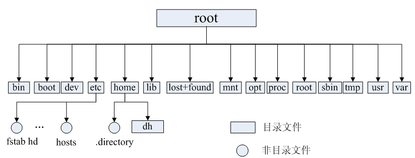

## 文件系统的概念

文件系统是操作系统中负责管理持久数据的子系统

文件系统的基本数据单位是文件，它的目的是对磁盘上的文件进行组织管理，那组织的方式不同，就会形成不同的文件系统。

对于Linux系统 **一切皆文件**，除了普通的文件和目录，就连块设备、管道、socket 等，也都是统一交给文件系统管理的。

## 文件的结构

Linux 文件系统会为每个文件分配两个数据结构：索引节点（index node）和目录项（directory entry），它们主要用来记录文件的元信息和目录层次结构。

- 索引节点：用来记录文件的元信息，比如文件大小、访问权限、创建时间、修改时间、 **数据在磁盘的位置** 等等。索引节点是文件的 **唯一** 标识，它们之间一一对应，也同样都会被存储在硬盘中，所以 **索引节点同样占用磁盘空间** 。
- 目录项：用来记录文件的名字、**索引节点指针** 以及与其他目录项的层级关联关系。多个目录项关联起来，就会形成目录结构，但它与索引节点不同的是， **目录项是由内核维护的一个数据结构，不存放于磁盘，而是缓存在内存** 。

目录项和索引节点的关系是多对一，一个文件可以有多个别名



目录项和目录的关系和区别

- 目录是个文件，持久化存储在磁盘

- 目录项是内核维护数据结构，缓存在内存。

如果查询目录频繁从磁盘读，效率会很低，所以内核会把已经读过的目录用目录项这个数据结构缓存在内存，下次再次读到相同的目录时，只需从内存读就可以，大大提高了文件系统的效率。



## 虚拟文件系统

操作系统 **对用户提供一个统一的接口** ，于是在用户层与文件系统层引入了虚拟文件系统作为中间层

虚拟文件系统定义了一组所有文件系统都支持的数据结构和标准接口

- 磁盘的文件系统：直接把数据存储在磁盘中
- 内存的文件系统：数据不是存储在硬盘的，而是占用内存空间，我们经常用到的 `/proc` 和 `/sys` 文件系统都属于这一类，读写这类文件，实际上是读写内核中相关的数据。
- 网络的文件系统：用来访问其他计算机主机数据的文件系统

文件系统首先要先挂载到某个目录才可以正常使用

## Linux系统的目录树

目录树由根目录（/）作为起始点，向下延伸，形成一系列的目录和子目录。

- **/bin：** 存放二进制可执行文件(ls、cat、mkdir 等)，常用命令一般都在这里；
- **/etc：** 存放系统管理和配置文件；
- **/home：** 存放所有用户文件的根目录，是用户主目录的基点，比如用户 user 的主目录就是/home/user，可以用~user 表示；
- **/usr：** 用于存放系统应用程序；
- **/opt：** 额外安装的可选应用程序包所放置的位置。一般情况下，我们可以把 tomcat 等都安装到这里；
- **/proc：** 虚拟文件系统目录，是系统内存的映射。可直接访问这个目录来获取系统信息；
- **/root：** 超级用户（系统管理员）的主目录（特权阶级^o^）；
- **/sbin:** 存放二进制可执行文件，只有 root 才能访问。这里存放的是系统管理员使用的系统级别的管理命令和程序。如 ifconfig 等；
- **/dev：** 用于存放设备文件；
- **/mnt：** 系统管理员安装临时文件系统的安装点，系统提供这个目录是让用户临时挂载其他的文件系统；
- **/boot：** 存放用于系统引导时使用的各种文件；
- **/lib 和/lib64：** 存放着和系统运行相关的库文件 ；
- **/tmp：** 用于存放各种临时文件，是公用的临时文件存储点；
- **/var：** 用于存放运行时需要改变数据的文件，也是某些大文件的溢出区，比方说各种服务的日志文件（系统启动日志等。）等；
- **/lost+found：** 这个目录平时是空的，系统非正常关机而留下“无家可归”的文件（windows 下叫什么.chk）就在这里。

## 软链接和硬链接

在 Linux系统上，文件链接是一种特殊的文件类型，可以在文件系统中指向另一个文件。

### 硬链接

硬链接是为 **同一个文件创建多个目录项** ，也就是指向同一个索引节点。由于多个目录项都是指向一个索引节点，那么 **只有删除文件的所有硬链接以及源文件时，系统才会彻底删除该文件。** 硬链接具有一些限制，不能对目录以及不存在的文件创建硬链接，并且，硬链接也不能跨越文件系统。



为什么硬链接不能跨域文件系统

硬链接是 **多个目录项中的索引节点指向一个文件** ，也就是指向同一个索引节点。索引节点是不可能跨越文件系统的，每个文件系统都有各自的索引节点数据结构和列表，所以**硬链接是不可用于跨文件系统的**。



### 软链接

软链接本质上是一个特殊类型的文件，这个文件有 **独立的索引节点** ，但是这个 **文件的内容是另外一个文件的路径** ，类似于Windows系统的快捷方式，所以访问软链接的时候，实际上相当于访问到了另外一个文件，所以 **软链接是可以跨文件系统的** ，即使**目标文件被删除了，链接文件还是在的，只不过指向的文件找不到了而已。**

