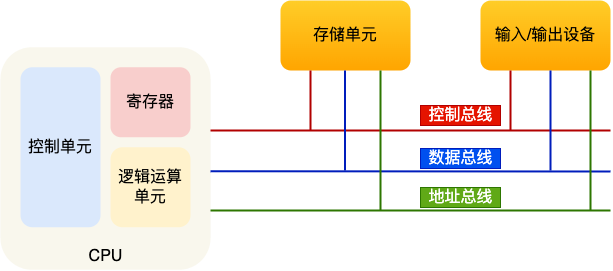
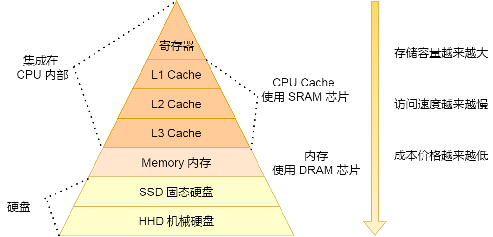

## 冯诺依曼体系

现代计算机模型是基于-**冯诺依曼计算机模型**

计算机在运行时，先从内存中取出第一条指令，通过控制器的译码，按指令的要求，从存储器中取出数据进行指定的运算和逻辑操作等加工，然后再按地址把结果送到内存中去，接下来，再取出第二条指令，在控制器的指挥下完成规定操作，依此进行下去。直至遇到停止指令

程序与数据一样存贮，按程序编排的顺序，一步一步地取出指令，自动地完成指令规定的操作是计算机最基本的工作模型

计算机基本结构为 5 个部分

- **运算器** ：对数据进行各种算术运算和逻辑运算，即对数据进行加工处理
- **控制器** ：是整个计算机的中枢神经，其功能是对程序规定的控制信息进行解释，根据其要求进行控制，调度程序、数据、地址，协调计算机各部分工作及内存与外设的访问等。
- **存储器** ：存储程序、数据和各种信号、命令等信息，并在需要时提供这些信息
- **输入设备** ：将程序、原始数据、文字、字符、控制命令或现场采集的数据等信息输入到计算机
- **输出设备** ：它把计算机的中间结果或最后结果、机内的各种数据符号及文字或各种控制信号等信息输出出来

### 内存

在冯诺依曼模型中，程序和数据被存储在一个被称作内存的线性排列存储区域。

存储的数据单位是一个二进制位，最小的存储单位叫作字节，也就是 8 位，英文是 byte，每一个字节都对应一个内存地址。

内存地址由 0 开始编号，比如第 1 个地址是 0，第 2 个地址是 1， 然后自增排列，最后一个地址是内存中的字节数减 1。

我们通常说的内存都是随机存取器（RAM），也就是读取任何一个地址数据的速度是一样的，写入任何一个地址数据的速度也是一样的。

### 中央处理器CPU

冯诺依曼模型中 CPU 负责控制和计算，为了方便计算较大的数值，CPU 每次可以计算多个字节的数据。



CPU位宽：代表的是 CPU 一次可以计算（运算）的数据量

32 位和 64 位 CPU 最主要区别在于一次能计算多少字节数据：

- 32 位 CPU 一次可以计算 4 个字节
- 64 位 CPU 一次可以计算 8 个字节

CPU 的位宽最好不要小于线路位宽



CPU 内部还有一些组件，常见的有 **寄存器、控制单元和逻辑运算单元** 等。

- 控制单元：负责控制 CPU 工作
- 逻辑运算单元：计算
- 寄存器：存放计算的中间结果，离控制单元和逻辑运算单元非常近，因此速度很快
  - 通用寄存器：用来存放需要进行运算的数据，比如需要进行加和运算的两个数据。
  - 程序计数器：用来存储 CPU 要执行下一条指令「所在的内存地址」，注意不是存储了下一条要执行的指令，此时指令还在内存中，程序计数器只是存储了下一条指令「的地址」。
  - 指令寄存器：用来存放当前正在执行的指令，也就是指令本身，指令被执行完成之前，指令都存储在这里。

#### 局部性原理

在CPU访问存储设备时，无论是存取数据抑或存取指令，都趋于聚集在一片连续的区域中，这就被称为局部性原理

- **时间局部性**
  - 如果一个信息项正在被访问，那么在近期它很可能还会被再次访问。

- **空间局部性（Spatial Locality）：**
  - 如果一个存储器的位置被引用，那么将来他附近的位置也会被引用。

### 总线

总线是用于 CPU 和内存以及其他设备之间的通信，总线可分为 3 种：

- 地址总线：用于指定 CPU 将要操作的内存地址；
- 数据总线：用于读写内存的数据；
- 控制总线：用于发送和接收信号，比如中断、设备复位等信号，CPU 收到信号后自然进行响应，这时也需要控制总线；

当 CPU 要读写内存数据的时候，一般需要通过以下三条总线

- 首先要通过地址总线来指定内存的地址；
- 然后通过控制总线控制是读或写命令；
- 最后通过数据总线来传输数据

##  程序执行的基本过程

程序实际上是一条一条指令，所以程序的运行过程就是把每一条指令一步一步的执行起来，负责执行指令的就是 CPU 了。

- **取得指令** ：CPU 读取程序计数器的值，这个值是指令的内存地址，然后 CPU 的控制单元操作地址总线指定需要访问的内存地址，接着通知内存设备准备数据，数据准备好后通过数据总线将指令数据传给 CPU，CPU 收到内存传来的数据后，将这个指令数据存入到指令寄存器。程序计数器的值自增，表示指向下一条指令。这个自增的大小，由 CPU 的位宽决定
- **指令译码** ：CPU 的控制器分析指令寄存器中的指令，确定指令的类型和参数。
- **执行指令** ：把指令交给逻辑运算单元运算；如果是存储类型的指令，则交由控制单元执行
- **数据回写** ：CPU 将计算结果存回寄存器或者将寄存器的值存入内存

## 存储器的层次结构

### 寄存器

寄存器是最靠近 CPU 的控制单元和逻辑计算单元的存储器。寄存器的访问速度非常快，一般要求在半个 CPU 时钟周期内完成读写

### CPU多级缓存

**CPU缓存** 是高速缓冲存储器，是位于CPU与主内存间的一种容量较小但速度很高的存储器

由于CPU的速度远高于主内存，CPU直接从内存中存取数据要等待一定时间周期，Cache中保存着CPU刚用过或循环使用的一部分数据，当CPU再次使用该部分数据时可从Cache中直接调用，减少CPU的等待时间，提高了系统的效率，具体包括以下几种：

- **L1-Cache** ：L1- 缓存在 CPU 中，相比寄存器，虽然它的位置距离 CPU 核心更远，但造价更低，读写速度在 2~4 个 CPU 时钟周期。
  - 每个 CPU 核心都有一块属于自己的 L1 高速缓存，指令和数据在 L1 是分开存放的，所以 L1 高速缓存通常分成 **指令缓存** 和 **数据缓存** 。
- **L2-Cache** ：L2- 缓存也在 CPU 中，位置比 L1- 缓存距离 CPU 核心更远，它的大小比 L1-Cache 更大，速度在 10~20 个 CPU 周期。
  - L2 高速缓存同样每个 CPU 核心都有
- **L3-Cache** ：L3- 缓存同样在 CPU 中，位置比 L2- 缓存距离 CPU 核心更远，大小通常比 L2-Cache 更大，读写速度在 20~60 个 CPU 周期。
  - L3 高速缓存通常是多个 CPU 核心共用的

当 CPU 需要内存中某个数据的时候，如果寄存器中有这个数据，我们可以直接使用；如果寄存器中没有这个数据，我们就要先查询 L1 缓存；L1 中没有，再查询 L2 缓存；L2 中没有再查询 L3 缓存；L3 中没有，再去内存中拿。

- 存储器存储空间大小：内存>L3>L2>L1>寄存器
- 存储器速度快慢排序：寄存器>L1>L2>L3>内存

#### CPU缓存一致性

CPU 缓存 是由很多个 Cache Line 组成的，CPU Line 是 CPU 从内存读取数据的基本单位，而 CPU Line 是由各种标志（Tag）+ 数据块（Data Block）组成

CPU写入数据通常有以下两种策略

- 写穿： **把数据同时写入内存和 Cache 中**
  - 写入前会先判断数据是否已经在 CPU 缓存 里面了：
    - 如果数据已经在 Cache 里面，先将数据更新到 Cache 里面，再写入到内存里面；
    - 如果数据没有在 Cache 里面，就直接把数据更新到内存里面。
- 写回：**当发生写操作时，新的数据仅仅被写入 Cache Block 里，只有当修改过的 Cache Block 被替换时才需要写到内存中**
  - 如果当发生写操作时，数据命中缓存，则把数据更新到 CPU 缓存 里，同时标记 CPU 缓存 里的这个 Cache Block 为脏（Dirty）的，这个脏的标记代表这个时候，我们 CPU Cache 里面的这个 Cache Block 的数据和内存是不一致的
  - 如果当发生写操作时，数据未命中缓存，就要检查这个 Cache Block 里的数据有没有被标记为脏的
    - 如果是脏的话，我们就要把这个 Cache Block 里的数据写回到内存，然后再把当前要写入的数据，先从内存读入到 Cache Block 里，然后再把当前要写入的数据写入到 Cache Block，最后也把它标记为脏的
    - 如果不是脏的话，把当前要写入的数据先从内存读入到 Cache Block 里，接着将数据写入到这个 Cache Block 里，然后再把这个 Cache Block 标记为脏的就好了

缓存一致性问题

**不同核心的缓存，在同一行时候是不一致，从而会导致执行结果的错误。**

解决思路

- **写传播** ：某个 CPU 核心里的 Cache 数据更新时，必须要传播到其他核心的 Cache；
- **事务的串行化** ：某个 CPU 核心里对数据的操作顺序，必须在其他核心看起来顺序是一样的。

### 内存

内存通常使用 **DRAM （Dynamic Random Access Memory，动态随机存取存储器）** 。DRAM的数据会被存储在电容里，电容会不断漏电，所以需要「定时刷新」电容，才能保证数据不会被丢失，这就是 DRAM 之所以被称为「动态」存储器的原因，只有不断刷新，数据才能被存储起来。因此断电后内存中的数据全部丢失

### 磁盘

SSD 就是固体硬盘，结构和内存类似，但是它相比内存的优点是断电后数据还是存在的，而内存、寄存器、高速缓存断电后数据都会丢失。

### 存储器的层次关系

存储空间越大的存储器设备，其访问速度越慢，所需成本也相对越少。

CPU 并不会直接和每一种存储器设备直接打交道，而是每一种存储器设备只和它相邻的存储器设备打交道。

当 CPU 需要访问内存中某个数据的时候，如果寄存器有这个数据，CPU 就直接从寄存器取数据即可，如果寄存器没有这个数据，CPU 就会查询 L1 高速缓存，如果 L1 没有，则查询 L2 高速缓存，L2 还是没有的话就查询 L3 高速缓存，L3 依然没有的话，才去内存中取数据

## 中断

在计算机中，中断是系统用来响应硬件设备请求的一种机制，操作系统收到硬件的中断请求，会打断正在执行的进程，然后调用内核中的中断处理程序来响应请求

操作系统收到了中断请求，会打断其他进程的运行，所以 **中断请求的响应程序，也就是中断处理程序，要尽可能快的执行完，这样可以减少对正常进程运行调度地影响。**

### 硬中断和软中断

 Linux 系统为了解决中断处理程序执行过长和中断丢失的问题，将中断过程分成了两个阶段

- **上半部用来快速处理中断（硬中断）** ：由 **硬件设备**（如键盘、网络卡、定时器等）触发的中断信号，具有较高的优先级，一般会暂时关闭中断请求，主要负责处理跟硬件紧密相关或者时间敏感的事情。
  - 当硬中断发生时，CPU会保存当前执行的上下文，并跳转到中断处理程序。
  - 中断处理程序处理完成后，会恢复被中断的程序的上下文，并继续执行。
- **下半部用来延迟处理上半部未完成的工作（软中断）**：由内核触发，一般以内核线程的方式运行。通常是通过执行特定指令（如`int`指令）或系统调用产生的。在程序运行中请求操作系统的服务