## 🧠 冯诺依曼体系

现代计算机模型是基于**冯诺依曼计算机模型**。

计算机在运行时，先从内存中取出第一条指令，通过控制器的译码，按指令的要求，从存储器中取出数据进行指定的运算和逻辑操作等加工，然后再按地址把结果送到内存中去，接下来，再取出第二条指令，在控制器的指挥下完成规定操作，依此进行下去。直至遇到停止指令。

程序与数据一样存贮，按程序编排的顺序，一步一步地取出指令，自动地完成指令规定的操作是计算机最基本的工作模型。

<div align="center">
  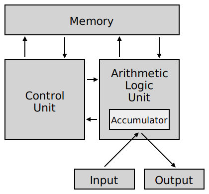
</div>

计算机基本结构为 5 个部分：

- **运算器**：对数据进行各种算术运算和逻辑运算，即对数据进行加工处理。
- **控制器**：是整个计算机的中枢神经，其功能是对程序规定的控制信息进行解释，根据其要求进行控制，调度程序、数据、地址，协调计算机各部分工作及内存与外设的访问等。
- **存储器**：存储程序、数据和各种信号、命令等信息，并在需要时提供这些信息。
- **输入设备**：将程序、原始数据、文字、字符、控制命令或现场采集的数据等信息输入到计算机。
- **输出设备**：它把计算机的中间结果或最后结果、机内的各种数据符号及文字或各种控制信号等信息输出出来。

<div align="center">
  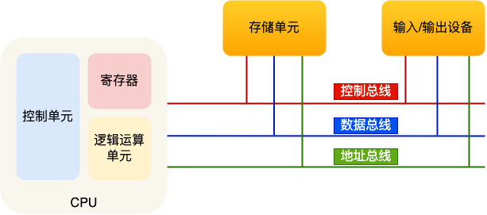
</div>

### 💾 内存

在冯诺依曼模型中，程序和数据被存储在一个被称作内存的线性排列存储区域。

存储的数据单位是一个二进制位，最小的存储单位叫作字节，也就是 8 位，英文是 byte，每一个字节都对应一个内存地址。

内存地址由 0 开始编号，比如第 1 个地址是 0，第 2 个地址是 1，然后自增排列，最后一个地址是内存中的字节数减 1。

我们通常说的内存都是**随机存取器**(**RAM)**，也就是读取任何一个地址数据的速度是一样的，写入任何一个地址数据的速度也是一样的。

### 🔧 中央处理器 CPU

冯诺依曼模型中 **CPU** 负责控制和计算，为了方便计算较大的数值，CPU 每次可以计算多个字节的数据。



**CPU 位宽**：代表的是 CPU 一次可以计算（运算）的数据量。

32 位和 64 位 CPU 最主要区别在于一次能计算多少字节数据：

- 32 位 CPU 一次可以计算 4 个字节
- 64 位 CPU 一次可以计算 8 个字节

CPU 的位宽最好不要小于线路位宽。



### 🔌 32 位与 64 位系统的区别

#### 🔁 数据传输方式：串行与并行

数据通过线路传输是通过操作电压实现的，低电压表示 0，高电压表示 1。如果只有一条线路，每次只能传递 1 bit 的数据（0 或 1），这种方式称为**串行传输**，下一个 bit 必须等待上一个 bit 传输完成才能进行传输。

为了提高传输效率，可以增加线路数量，实现**并行传输**。线路的位宽最好一次就能访问到所有的内存地址，避免低效率的串行传输。

#### 🔗 地址总线与内存寻址

CPU 通过地址总线来操作内存地址，地址总线的数量决定了 CPU 能操作的内存地址最大数量：

- 如果地址总线只有 1 条，每次只能表示「0 或 1」这两种地址，CPU 能操作的内存地址最大数量为 $2(2^1)$个
- 如果地址总线有 2 条，能表示 00、01、10、11 这四种地址，CPU 能操作的内存地址最大数量为 $4(2^2)$个
- 如果想要 CPU 操作 4GB 大的内存，需要 32 条地址总线，因为 $2^{32} = 4GB$

#### 🔌 CPU 位宽与线路位宽的匹配

CPU 的位宽最好不要小于线路位宽。例如，32 位 CPU 控制 40 位宽的地址总线和数据总线会非常复杂且麻烦，所以 32 位的 CPU 最好和 32 位宽的线路搭配，因为 32 位 CPU 一次最多只能操作 32 位宽的地址总线和数据总线。

#### 🧮 计算能力的差异

**32 位 CPU 计算 64 位数字的过程：**

如果用 32 位 CPU 去加和两个 64 位大小的数字，需要把这 2 个 64 位的数字分成：
- 2 个低位 32 位数字
- 2 个高位 32 位数字

计算步骤：
1. 先加和两个低位的 32 位数字，算出进位
2. 然后加和两个高位的 32 位数字
3. 最后再加上进位

可以发现，32 位 CPU 并不能一次性计算出加和两个 64 位数字的结果。

**64 位 CPU 的优势：**

64 位 CPU 可以一次性算出加和两个 64 位数字的结果，因为：
- 64 位 CPU 可以一次读入 64 位的数字
- 64 位 CPU 内部的逻辑运算单元也支持 64 位数字的计算

#### 📈 性能差异的实际情况

**64 位 CPU 性能不一定比 32 位 CPU 高很多**，因为很少应用需要计算超过 32 位的数字。

- **如果计算的数值不超过 32 位**：32 位和 64 位 CPU 之间没什么区别
- **只有当计算超过 32 位数字时**：64 位的优势才能体现出来

#### 💾 内存寻址上限

- **32 位 CPU**：最大只能操作 **4GB 内存**，就算安装了 8GB 内存条也无法完全利用
- **64 位 CPU**：寻址范围很大，理论最大的寻址空间为 $2^{64}$

CPU 内部还有一些组件，常见的有**寄存器、控制单元和逻辑运算单元**等。

- **控制单元**：负责控制 CPU 工作。
- **逻辑运算单元**：负责逻辑运算。
- **寄存器**：存放计算的中间结果，离控制单元和逻辑运算单元非常近，因此速度很快。
  - **通用寄存器**：用来存放需要进行运算的数据，比如需要进行加和运算的两个数据。
  - **程序计数器**：用来存储 CPU 要执行下一条指令「所在的内存地址」，注意不是存储了下一条要执行的指令，此时指令还在内存中，程序计数器只是存储了下一条指令「的地址」。
  - **指令寄存器**：用来存放当前正在执行的指令，也就是指令本身，指令被执行完成之前，指令都存储在这里。

#### 📍 局部性原理

在 CPU 访问存储设备时，无论是存取数据抑或存取指令，都趋于聚集在一片连续的区域中，这就被称为局部性原理。

- **时间局部性**：如果一个信息项正在被访问，那么在近期它很可能还会被再次访问。
- **空间局部性(Spatial Locality)**：如果一个存储器的位置被引用，那么将来他附近的位置也会被引用。

### 🔌 总线

总线是用于 CPU 和内存以及其他设备之间的通信，总线可分为 3 种：

- **地址总线**：用于指定 CPU 将要操作的内存地址。
- **数据总线**：用于读写内存的数据。
- **控制总线**：用于发送和接收信号，比如中断、设备复位等信号，CPU 收到信号后自然进行响应，这时也需要控制总线。

当 CPU 要读写内存数据的时候，一般需要通过以下三条总线：

- 首先要通过**地址总线**来指定内存的地址。
- 然后通过**控制总线**控制是读或写命令。
- 最后通过**数据总线**来传输数据。

---


## 📊 存储器的层次结构

### 📦 寄存器

寄存器是最靠近 CPU 的控制单元和逻辑计算单元的存储器。寄存器的访问速度非常快，一般要求在半个 CPU 时钟周期内完成读写。

### 🗄️ CPU 多级缓存

**CPU 缓存**是高速缓冲存储器，是位于 CPU 与主内存间的一种容量较小但速度很高的存储器。

由于 CPU 的速度远高于主内存，CPU 直接从内存中存取数据要等待一定时间周期，Cache 中保存着 CPU 刚用过或循环使用的一部分数据，当 CPU 再次使用该部分数据时可从 Cache 中直接调用，减少 CPU 的等待时间，提高了系统的效率。

<div align="center">
  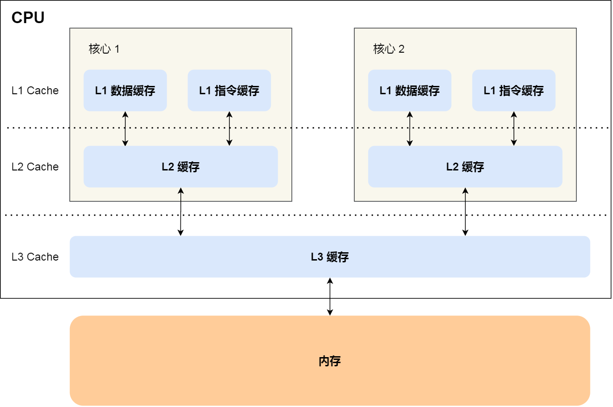
</div>

**三级缓存架构**：

- 🚀 **L1-Cache**：在 CPU 核心内部，离 CPU 核心最近，通常 32KB（每个核心独有），速度**2~4 个 CPU 时钟周期**，指令和数据分开存放
- ⚡ **L2-Cache**：在 CPU 核心内部，比 L1 稍远，通常 256KB（每个核心独有），速度**10~20 个 CPU 时钟周期**
- 🔄 **L3-Cache**：在 CPU 内部，多个核心共享，通常几 MB，速度**20~60 个 CPU 时钟周期**

> 📌 **存储器存储空间大小**：内存 > L3 > L2 > L1 > 寄存器
> 
> 📌 **存储器速度快慢排序**：寄存器 > L1 > L2 > L3 > 内存

---

### 💾 内存

内存通常使用 **DRAM**（**Dynamic Random Access Memory，动态随机存取存储器**）。DRAM 的数据会被存储在电容里，电容会不断漏电，所以需要「定时刷新」电容，才能保证数据不会被丢失，这就是 DRAM 之所以被称为「动态」存储器的原因，只有不断刷新，数据才能被存储起来。因此断电后内存中的数据全部丢失。

### 💿 磁盘

**SSD** 就是固体硬盘，结构和内存类似，但是它相比内存的优点是断电后数据还是存在的，而内存、寄存器、高速缓存断电后数据都会丢失。

### 📐 存储器的层次关系

存储空间越大的存储器设备，其访问速度越慢，所需成本也相对越少。

CPU 并不会直接和每一种存储器设备直接打交道，而是每一种存储器设备只和它相邻的存储器设备打交道。比如，CPU Cache 的数据是从内存加载过来的，写回数据的时候也只写回到内存，CPU Cache 不会直接把数据写到硬盘，也不会直接从硬盘加载数据，而是先加载到内存，再从内存加载到 CPU Cache 中。

<div align="center">
  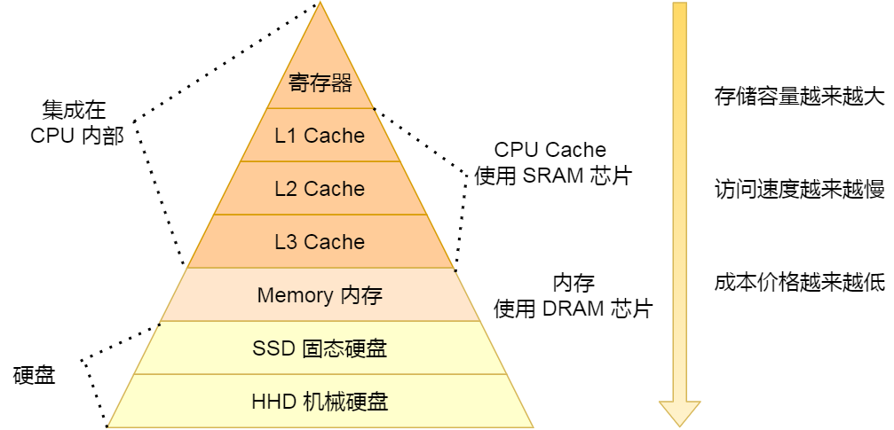
</div>

当 CPU 需要访问内存中某个数据的时候，如果寄存器有这个数据，CPU 就直接从寄存器取数据即可，如果寄存器没有这个数据，CPU 就会查询 L1 高速缓存，如果 L1 没有，则查询 L2 高速缓存，L2 还是没有的话就查询 L3 高速缓存，L3 依然没有的话，才去内存中取数据。

<div align="center">
  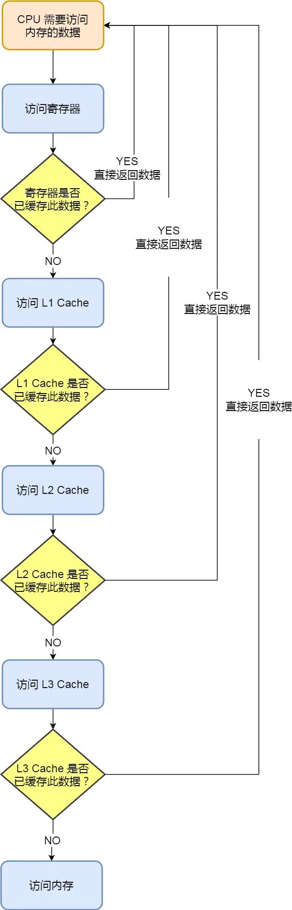
</div>
---

## 💻 CPU 
### 🗄️ CPU Cache
#### 1️⃣ CPU Cache 的性能优势 

**为什么需要 CPU Cache？**

根据摩尔定律，CPU 的访问速度每 18 个月就会翻倍（年增长约 60%），而内存的速度平均每年只增长 7% 左右。这导致 CPU 与内存的访问性能差距不断拉大：

- 一次内存访问所需时间：`200~300` 个时钟周期
- CPU 与内存的访问速度差距：**200~300 多倍**

为了弥补这个性能差异，CPU 内部引入了三级缓存：

- 🚀 **L1-Cache**：
  - 位置：在 CPU 核心内部，离 CPU 核心最近
  - 大小：通常 32KB（每个核心独有）
  - 速度：**2~4 个 CPU 时钟周期**
  - 特点：指令和数据分开存放，分为**指令缓存**和**数据缓存**
  
- ⚡ **L2-Cache**：
  - 位置：在 CPU 核心内部，比 L1 稍远
  - 大小：通常 256KB（每个核心独有）
  - 速度：**10~20 个 CPU 时钟周期**
  
- 🔄 **L3-Cache**：
  - 位置：在 CPU 内部，多个核心共享
  - 大小：通常几 MB（如 3MB，多核心共享）
  - 速度：**20~60 个 CPU 时钟周期**

<div align="center">
  
</div>

**速度对比**：

| 存储层级 | 访问延迟（时钟周期） |
|---------|-------------------|
| 寄存器 | < 1 |
| L1 Cache | 2~4 |
| L2 Cache | 10~20 |
| L3 Cache | 20~60 |
| 内存 | 200~300 |

> 📌 **存储器存储空间大小**：内存 > L3 > L2 > L1 > 寄存器
> 
> 📌 **存储器速度快慢排序**：寄存器 > L1 > L2 > L3 > 内存
>
> 📌 **关键数据**：CPU 从 L1 Cache 读取数据的速度，相比从内存读取的速度，**快 100 多倍**

#### 2️⃣ CPU Cache 的数据结构

**Cache Line（缓存块）**

CPU Cache 是由很多个 **Cache Line** 组成的，Cache Line 是 CPU 从内存读取数据的基本单位。Cache Line 由以下部分组成：

- **Tag（头标记）**：用于标识这个 Cache Line 对应的是哪个内存块的数据
- **Data Block（数据块）**：从内存加载过来的实际数据

<div align="center">
  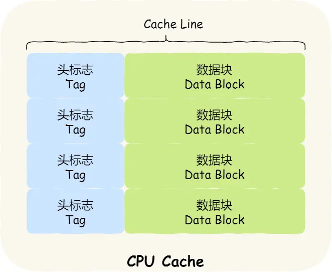
</div>

CPU 从内存读取数据时，是以 Cache Line 为单位批量读取的，而不是单个字节。在 Linux 系统中可以查看 Cache Line 大小：

```bash
# 查看 L1 Cache Line 大小，通常是 64 字节
getconf LEVEL1_DCACHE_LINESIZE
```

这意味着：当 CPU 访问 `array[0]` 时，如果数据不在 Cache 中，会一次性连续加载 `array[0]~array[15]`（共 64 字节）到 CPU Cache 中。

#### 3️⃣ 直接映射 Cache（Direct Mapped Cache）的工作原理
CPU 访问内存数据时，是一小块一小块数据读取的，具体这一小块数据的大小，取决于 coherency_line_size 的值，一般 64 字节。在内存中，这一块的数据我们称为内存块（Block），读取的时候我们要拿到数据所在内存块的地址。
内存地址映射到 CPU Cache 的一种简单策略是**直接映射**，使用**取模运算**：

```
Cache Line 索引 = 内存块地址 % Cache Line 总数
```

举个例子，内存共被划分为 32 个内存块，CPU Cache 共有 8 个 CPU Cache Line，假设 CPU 想要访问第 15 号内存块，如果 15 号内存块中的数据已经缓存在 CPU Cache Line 中的话，则是一定映射在 7 号 CPU Cache Line 中，因为 15 % 8 的值是 7。

<div align="center">
  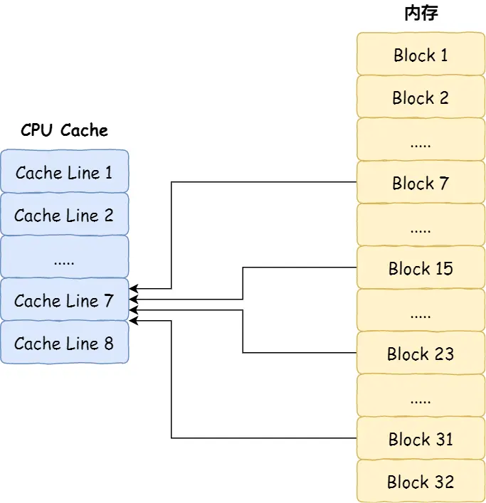
</div>

但是使用取模方式映射的话，就会出现多个内存块对应同一个 CPU Cache Line，比如上面的例子，除了 15 号内存块是映射在 7 号 CPU Cache Line 中，还有 7 号、23 号、31 号内存块都是映射到 7 号 CPU Cache Line 中。因此，为了区别不同的内存块，在对应的 CPU Cache Line 中我们还会存储一个组标记（Tag）。这个组标记会记录当前 CPU Cache Line 中存储的数据对应的内存块，我们可以用这个组标记来区分不同的内存块。

CPU 在从 CPU Cache 读取数据的时候，并不是读取 CPU Cache Line 中的整个数据块，而是读取 CPU 所需要的一个数据片段，这样的数据统称为一个字（Word）。使用偏移量（Offset）在对应的 CPU Cache Line 中数据块中找到所需的字。

一个内存访问地址包含三部分信息：

1. **Tag（组标记）**：用于区分不同的内存块
2. **Index（索引）**：定位到具体的 Cache Line
3. **Offset（偏移量）**：在 Cache Line 数据块中找到所需的字

一个CPU Cache 里的数据结构包含
1. **Tag（组标记）**：用于区分不同的内存块
2. **Index（索引）**：定位到具体的 Cache Line
3. **Data Block（数据块）**：从内存加载过来的实际数据
4. **有效位（Valid Bit）**：用于判断 Cache Line 是否有效

<div align="center">
  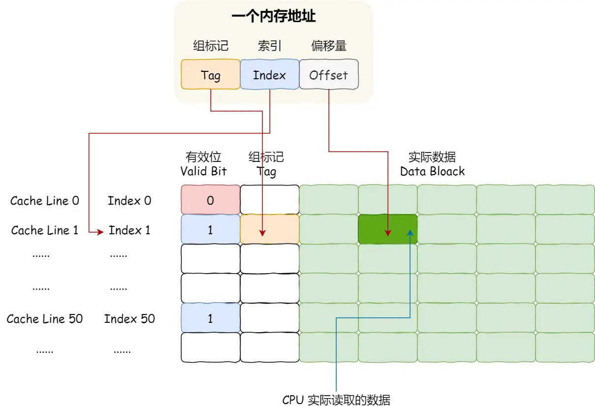
</div>

**CPU 访问内存数据的 4 个步骤**：

1. 根据内存地址的**索引**，找到对应的 Cache Line
2. 检查**有效位**，如果无效则直接访问内存重新加载
3. 对比**Tag**，如果匹配则命中缓存，否则访问内存重新加载
4. 根据**偏移量**，从 Cache Line 中读取所需的数据

#### 4️⃣ CPU 缓存一致性

CPU 缓存是由很多个 **Cache Line** 组成的，**Cache Line** 是 CPU 从内存读取数据的基本单位，而 Cache Line 是由各种标志（**Tag**）+ 数据块（**Data Block**）组成。

##### 📝 数据写入策略：写直达与写回

CPU 在读写数据的时候，都是在 CPU Cache 读写数据的，原因是 Cache 离 CPU 很近，读写性能相比内存高出很多。对于 Cache 里没有缓存 CPU 所需要读取的数据的这种情况，CPU 则会从内存读取数据，并将数据缓存到 Cache 里面，最后 CPU 再从 Cache 读取数据。

而对于数据的写入，CPU 都会先写入到 Cache 里面，然后再在找个合适的时机写入到内存，那就有「写直达」和「写回」这两种策略来保证 Cache 与内存的数据一致性。

**1. 写直达（Write-Through）**

保持内存与 Cache 一致性最简单的方式是，**把数据同时写入内存和 Cache 中**，这种方法称为**写直达（Write Through）**。

<div align="center">
  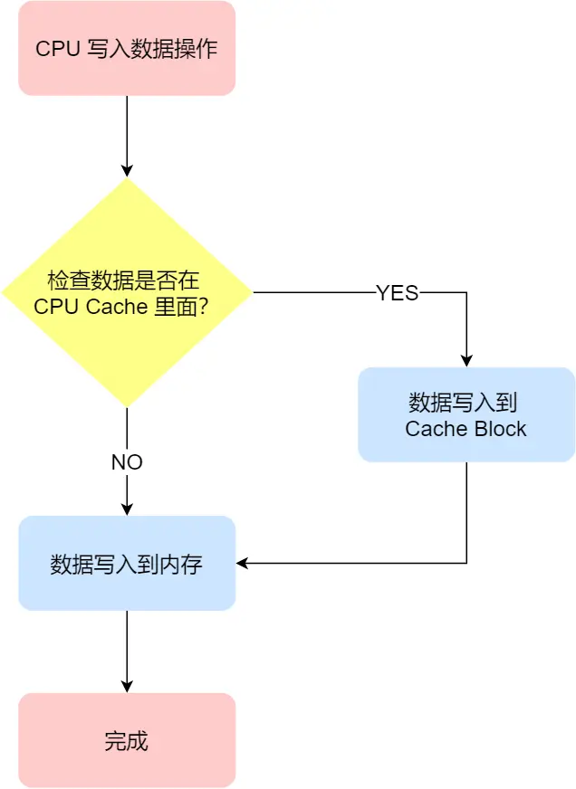
</div>

在这个方法里，写入前会先判断数据是否已经在 CPU Cache 里面了：

- **如果数据已经在 Cache 里面**：先将数据更新到 Cache 里面，再写入到内存里面
- **如果数据没有在 Cache 里面**：就直接把数据更新到内存里面

写直达法很直观，也很简单，但是问题明显，无论数据在不在 Cache 里面，每次写操作都会写回到内存，这样写操作将会花费大量的时间，无疑性能会受到很大的影响。

**2. 写回（Write-Back）**

既然写直达由于每次写操作都会把数据写回到内存，而导致影响性能，于是为了要减少数据写回内存的频率，就出现了**写回（Write Back）** 的方法。

在写回机制中，**当发生写操作时，新的数据仅仅被写入 Cache Block 里，只有当修改过的 Cache Block「被替换」时才需要写到内存中**，减少了数据写回内存的频率，这样便可以提高系统的性能。

<div align="center">
  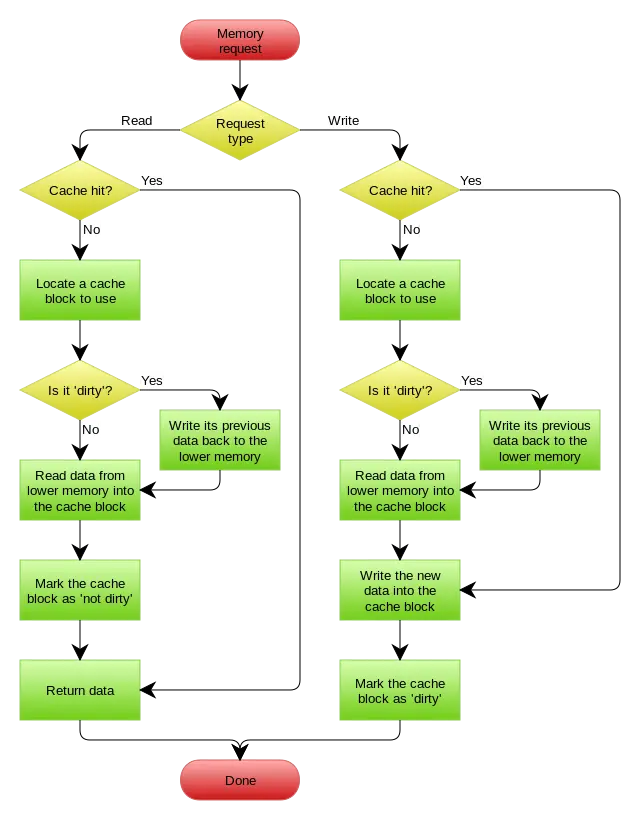
</div>

那具体如何做到的呢？下面来详细说一下：

- **如果当发生写操作时，数据已经在 CPU Cache 里的话**：则把数据更新到 CPU Cache 里，同时标记 CPU Cache 里的这个 Cache Block 为脏（**Dirty**）的，这个脏的标记代表这个时候，我们 CPU Cache 里面的这个 Cache Block 的数据和内存是不一致的，这种情况是不用把数据写到内存里的
- **如果当发生写操作时，数据所对应的 Cache Block 里存放的是「别的内存地址的数据」的话**：就要检查这个 Cache Block 里的数据有没有被标记为脏的：
  - **如果是脏的话**：我们就要把这个 Cache Block 里的数据写回到内存，然后再把当前要写入的数据，先从内存读入到 Cache Block 里，然后再把当前要写入的数据写入到 Cache Block，最后也把它标记为脏的
  - **如果不是脏的话**：把当前要写入的数据先从内存读入到 Cache Block 里，接着将数据写入到这个 Cache Block 里，然后再把这个 Cache Block 标记为脏的就好了

可以发现写回这个方法，在把数据写入到 Cache 的时候，只有在缓存不命中，同时数据对应的 Cache 中的 Cache Block 为脏标记的情况下，才会将数据写到内存中，而在缓存命中的情况下，则在写入后 Cache 后，只需把该数据对应的 Cache Block 标记为脏即可，而不用写到内存里。

这样的好处是，如果我们大量的操作都能够命中缓存，那么大部分时间里 CPU 都不需要读写内存，自然性能相比写直达会高很多。

为什么缓存没命中时，还要定位 Cache Block？这是因为此时是要判断数据即将写入到 cache block 里的位置，是否被「其他数据」占用了此位置，如果这个「其他数据」是脏数据，那么就要帮忙把它写回到内存。

**写直达 vs 写回对比**：

| 特性 | 写直达（Write-Through） | 写回（Write-Back） |
|-----|----------------------|------------------|
| 写入方式 | 同时写入 Cache 和内存 | 只写入 Cache，替换时才写回内存 |
| 性能 | 较低（受限于内存访问速度） | 较高（减少内存写操作频率） |
| 实现复杂度 | 简单直观 | 较复杂（需要脏标记） |
| 适用场景 | 对一致性要求极高的场景 | 大多数通用场景 |

##### 🔍 缓存一致性问题

现在 CPU 都是多核的，由于 L1/L2 Cache 是多个核心各自独有的，那么会带来多核心的**缓存一致性（Cache Coherence）** 的问题，如果不能保证缓存一致性的问题，就可能造成结果错误。

那缓存一致性的问题具体是怎么发生的呢？我们以一个含有两个核心的 CPU 作为例子看一看。

假设 A 号核心和 B 号核心同时运行两个线程，都操作共同的变量 i（初始值为 0）。

<div align="center">
  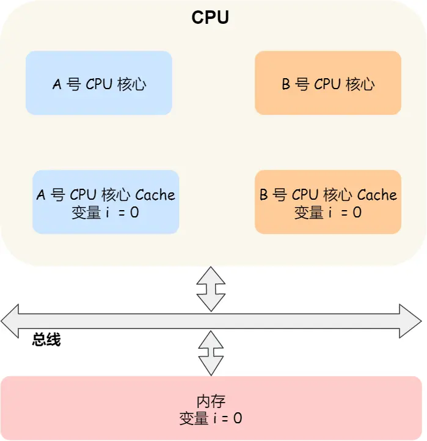
</div>

这时如果 A 号核心执行了 `i++` 语句的时候，为了考虑性能，使用了我们前面所说的写回策略，先把值为 `1` 的执行结果写入到 L1/L2 Cache 中，然后把 L1/L2 Cache 中对应的 Block 标记为脏的，这个时候数据其实没有被同步到内存中的，因为写回策略，只有在 A 号核心中的这个 Cache Block 要被替换的时候，数据才会写入到内存里。

如果这时旁边的 B 号核心尝试从内存读取 i 变量的值，则读到的将会是错误的值，因为刚才 A 号核心更新 i 值还没写入到内存中，内存中的值还依然是 0。**这个就是所谓的缓存一致性问题，A 号核心和 B 号核心的缓存，在这个时候是不一致，从而会导致执行结果的错误。**

<div align="center">
  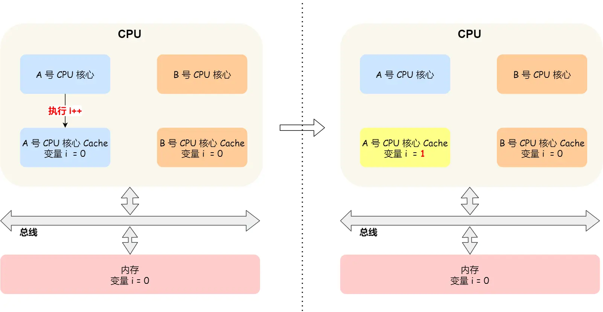
</div>

那么，要解决这一问题，就需要一种机制，来同步两个不同核心里面的缓存数据。要实现的这个机制的话，要保证做到下面这 2 点：

1. **写传播（Write Propagation）**：某个 CPU 核心里的 Cache 数据更新时，必须要传播到其他核心的 Cache
2. **事务的串行化（Transaction Serialization）**：某个 CPU 核心里对数据的操作顺序，必须在其他核心看起来顺序是一样的

第一点写传播很容易就理解，当某个核心在 Cache 更新了数据，就需要同步到其他核心的 Cache 里。而对于第二点事务的串行化，我们举个例子来理解它。

假设我们有一个含有 4 个核心的 CPU，这 4 个核心都操作共同的变量 i（初始值为 0）。A 号核心先把 i 值变为 100，而此时同一时间，B 号核心先把 i 值变为 200，这里两个修改，都会「传播」到 C 和 D 号核心。

<div align="center">
  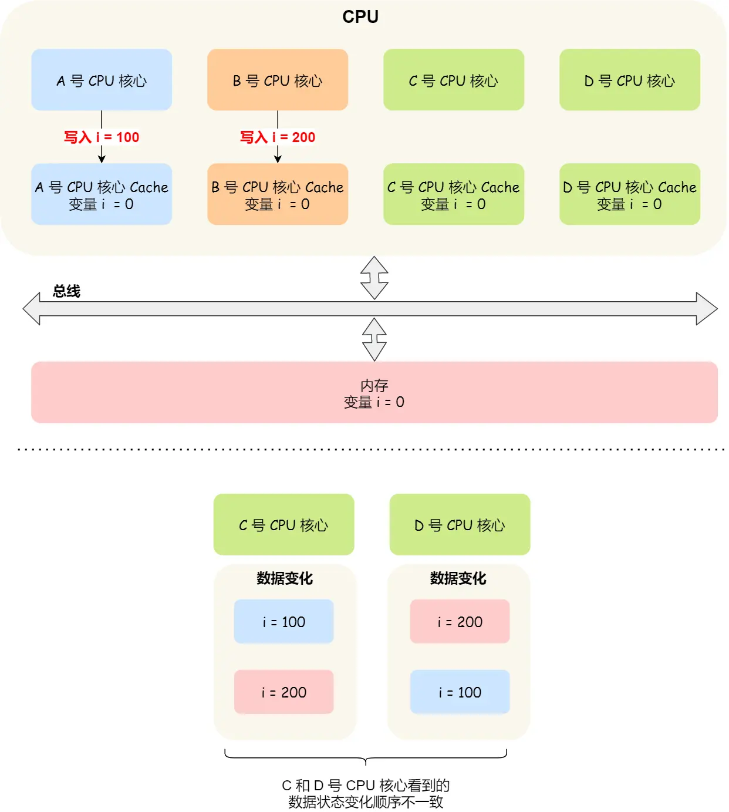
</div>

那么问题就来了，C 号核心先收到了 A 号核心更新数据的事件，再收到 B 号核心更新数据的事件，因此 C 号核心看到的变量 i 是先变成 100，后变成 200。

而如果 D 号核心收到的事件是反过来的，则 D 号核心看到的是变量 i 先变成 200，再变成 100，虽然是做到了写传播，但是各个 Cache 里面的数据还是不一致的。

所以，我们要保证 C 号核心和 D 号核心都能看到**相同顺序的数据变化**，比如变量 i 都是先变成 100，再变成 200，这样的过程就是事务的串行化。

要实现事务串行化，要做到 2 点：

- CPU 核心对于 Cache 中数据的操作，需要同步给其他 CPU 核心
- 要引入「锁」的概念，如果两个 CPU 核心里有相同数据的 Cache，那么对于这个 Cache 数据的更新，只有拿到了「锁」，才能进行对应的数据更新

##### 📡 总线嗅探机制

写传播的原则就是当某个 CPU 核心更新了 Cache 中的数据，要把该事件广播通知到其他核心。最常见实现的方式是**总线嗅探（Bus Snooping）**。

我还是以前面的 i 变量例子来说明总线嗅探的工作机制，当 A 号 CPU 核心修改了 L1 Cache 中 i 变量的值，通过总线把这个事件广播通知给其他所有的核心，然后每个 CPU 核心都会监听总线上的广播事件，并检查是否有相同的数据在自己的 L1 Cache 里面，如果 B 号 CPU 核心的 L1 Cache 中有该数据，那么也需要把该数据更新到自己的 L1 Cache。

可以发现，总线嗅探方法很简单，CPU 需要每时每刻监听总线上的一切活动，但是不管别的核心的 Cache 是否缓存相同的数据，都需要发出一个广播事件，这无疑会加重总线的负载。

另外，总线嗅探只是保证了某个 CPU 核心的 Cache 更新数据这个事件能被其他 CPU 核心知道，但是并不能保证事务串行化。

于是，有一个协议基于总线嗅探机制实现了事务串行化，也用状态机机制降低了总线带宽压力，这个协议就是 **MESI 协议**，这个协议就做到了 CPU 缓存一致性。

##### 🔐 MESI 协议

MESI 协议其实是 4 个状态单词的开头字母缩写，分别是：

- **Modified（已修改）**：该 Cache Block 上的数据已经被更新过，但是还没有写到内存里
- **Exclusive（独占）**：数据只存储在一个 CPU 核心的 Cache 里，而其他 CPU 核心的 Cache 没有该数据，数据与内存一致
- **Shared（共享）**：相同的数据在多个 CPU 核心的 Cache 里都有，数据与内存一致
- **Invalidated（已失效）**：这个 Cache Block 里的数据已经失效了，不可以读取该状态的数据

这四个状态来标记 Cache Line 四个不同的状态。

「已修改」状态就是我们前面提到的脏标记，代表该 Cache Block 上的数据已经被更新过，但是还没有写到内存里。而「已失效」状态，表示的是这个 Cache Block 里的数据已经失效了，不可以读取该状态的数据。

「独占」和「共享」状态都代表 Cache Block 里的数据是干净的，也就是说，这个时候 Cache Block 里的数据和内存里面的数据是一致性的。

「独占」和「共享」的差别在于，独占状态的时候，数据只存储在一个 CPU 核心的 Cache 里，而其他 CPU 核心的 Cache 没有该数据。这个时候，如果要向独占的 Cache 写数据，就可以直接自由地写入，而不需要通知其他 CPU 核心，因为只有你这有这个数据，就不存在缓存一致性的问题了，于是就可以随便操作该数据。

另外，在「独占」状态下的数据，如果有其他核心从内存读取了相同的数据到各自的 Cache，那么这个时候，独占状态下的数据就会变成共享状态。

那么，「共享」状态代表着相同的数据在多个 CPU 核心的 Cache 里都有，所以当我们要更新 Cache 里面的数据的时候，不能直接修改，而是要先向所有的其他 CPU 核心广播一个请求，要求先把其他核心的 Cache 中对应的 Cache Line 标记为「无效」状态，然后再更新当前 Cache 里面的数据。

**MESI 状态转换示例**：

我们举个具体的例子来看看这四个状态的转换：

1. **初始状态**：当 A 号 CPU 核心从内存读取变量 i 的值，数据被缓存在 A 号 CPU 核心自己的 Cache 里面，此时其他 CPU 核心的 Cache 没有缓存该数据，于是标记 Cache Line 状态为「**独占**」，此时其 Cache 中的数据与内存是一致的
2. **共享状态转换**：然后 B 号 CPU 核心也从内存读取了变量 i 的值，此时会发送消息给其他 CPU 核心，由于 A 号 CPU 核心已经缓存了该数据，所以会把数据返回给 B 号 CPU 核心。在这个时候，A 和 B 核心缓存了相同的数据，Cache Line 的状态就会变成「**共享**」，并且其 Cache 中的数据与内存也是一致的
3. **修改状态转换**：当 A 号 CPU 核心要修改 Cache 中 i 变量的值，发现数据对应的 Cache Line 的状态是共享状态，则要向所有的其他 CPU 核心广播一个请求，要求先把其他核心的 Cache 中对应的 Cache Line 标记为「**无效**」状态，然后 A 号 CPU 核心才更新 Cache 里面的数据，同时标记 Cache Line 为「**已修改**」状态，此时 Cache 中的数据就与内存不一致了
4. **连续修改**：如果 A 号 CPU 核心「继续」修改 Cache 中 i 变量的值，由于此时的 Cache Line 是「已修改」状态，因此不需要给其他 CPU 核心发送消息，直接更新数据即可
5. **数据回写**：如果 A 号 CPU 核心的 Cache 里的 i 变量对应的 Cache Line 要被「替换」，发现 Cache Line 状态是「已修改」状态，就会在替换前先把数据同步到内存

所以，可以发现当 Cache Line 状态是「已修改」或者「独占」状态时，修改更新其数据不需要发送广播给其他 CPU 核心，这在一定程度上减少了总线带宽压力。

事实上，整个 MESI 的状态可以用一个有限状态机来表示它的状态流转。还有一点，对于不同状态触发的事件操作，可能是来自本地 CPU 核心发出的广播事件，也可以是来自其他 CPU 核心通过总线发出的广播事件。

<div align="center">
  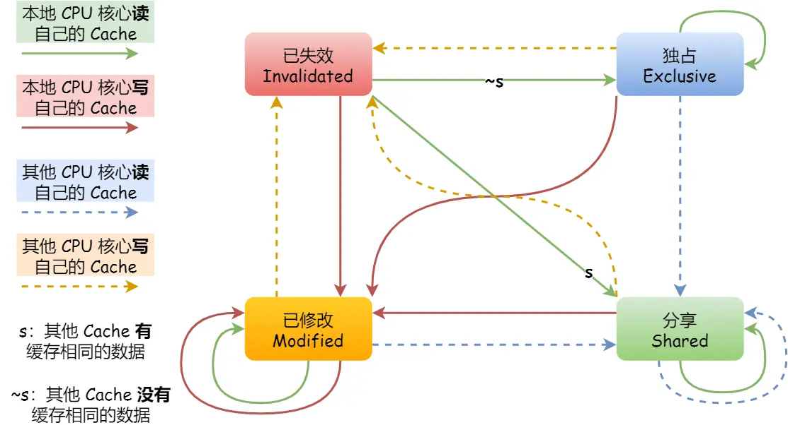
</div>

MESI 协议的四种状态之间的流转过程汇总成表格：

<div align="center">
  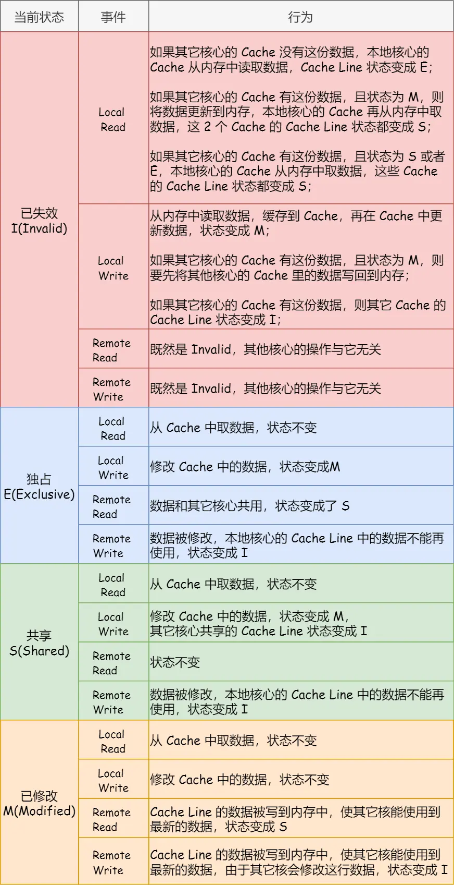
</div>

##### 📚 缓存一致性总结

CPU 在读写数据的时候，都是在 CPU Cache 读写数据的，原因是 Cache 离 CPU 很近，读写性能相比内存高出很多。对于 Cache 里没有缓存 CPU 所需要读取的数据的这种情况，CPU 则会从内存读取数据，并将数据缓存到 Cache 里面，最后 CPU 再从 Cache 读取数据。

而对于数据的写入，CPU 都会先写入到 Cache 里面，然后再在找个合适的时机写入到内存，那就有「写直达」和「写回」这两种策略来保证 Cache 与内存的数据一致性：

- **写直达**：只要有数据写入，都会直接把数据写入到内存里面，这种方式简单直观，但是性能就会受限于内存的访问速度
- **写回**：对于已经缓存在 Cache 的数据的写入，只需要更新其数据就可以，不用写入到内存，只有在需要把缓存里面的脏数据交换出去的时候，才把数据同步到内存里，这种方式在缓存命中率高的情况，性能会更好

当今 CPU 都是多核的，每个核心都有各自独立的 L1/L2 Cache，只有 L3 Cache 是多个核心之间共享的。所以，我们要确保多核缓存是一致性的，否则会出现错误的结果。

要想实现缓存一致性，关键是要满足 2 点：

- **第一点是写传播**：也就是当某个 CPU 核心发生写入操作时，需要把该事件广播通知给其他核心
- **第二点是事务的串行化**：这个很重要，只有保证了这个，才能保障我们的数据是真正一致的，我们的程序在各个不同的核心上运行的结果也是一致的

基于总线嗅探机制的 MESI 协议，就满足上面了这两点，因此它是保障缓存一致性的协议。

MESI 协议，是已修改、独占、共享、已失效这四个状态的英文缩写的组合。整个 MESI 状态的变更，则是根据来自本地 CPU 核心的请求，或者来自其他 CPU 核心通过总线传输过来的请求，从而构成一个流动的状态机。另外，对于在「已修改」或者「独占」状态的 Cache Line，修改更新其数据不需要发送广播给其他 CPU 核心。

#### 5️⃣ 如何写出 CPU 缓存友好的代码

**核心原则**：缓存命中率越高，代码性能越好。要分开优化**数据缓存命中率**和**指令缓存命中率**。

##### 📊 提升数据缓存命中率

**案例：二维数组遍历**

```java
// 形式一：顺序访问（快）
for (int i = 0; i < N; i++) {
    for (int j = 0; j < N; j++) {
        array[i][j] = array[i][j] + 1;
    }
}

// 形式二：跳跃访问（慢好几倍）
for (int j = 0; j < N; j++) {
    for (int i = 0; i < N; i++) {
        array[i][j] = array[i][j] + 1;
    }
}
```

**性能差异原因**：

二维数组在内存中是**连续存放**的。形式一 `array[i][j]` 的访问顺序与内存布局一致，利用了 CPU Cache 的**空间局部性**原理：

- 当 CPU 访问 `array[0][0]` 时，会一次性加载 `array[0][0]~array[0][15]` 到 Cache
- 后续访问 `array[0][1]` 等元素时，直接从 Cache 读取（命中）
- 缓存命中率高，性能更好

形式二 `array[j][i]` 是跳跃式访问，无法充分利用 Cache Line 的批量加载特性，导致频繁访问内存，性能较差。

> ✅ **优化建议**：遍历数组时，按照**内存布局顺序**访问，充分利用 CPU Cache 的批量加载特性。

##### 💡 提升指令缓存命中率

**案例：分支预测优化**

```java
// 场景：数组元素是 0-100 的随机数

// 操作一：遍历数组，把小于 50 的元素置为 0
for (int i = 0; i < array.length; i++) {
    if (array[i] < 50) {
        array[i] = 0;
    }
}

// 操作二：排序数组
Arrays.sort(array);
```

**问题**：先遍历再排序快，还是先排序再遍历快？

**答案**：**先排序再遍历更快**。

**原因**：CPU 有**分支预测器**，会根据历史执行记录预测条件分支的走向：

- 数组排序后，前几次循环 `if < 50` 都为 true，分支预测器会缓存 `if` 块内的指令到 Cache
- 后续执行时，CPU 直接从 Cache 读取指令，无需等待
- 随机数组无法让分支预测器有效工作

**显示分支预测提示**（C/C++）：

```c
// 如果 if 条件为 true 的概率很高，使用 likely 宏
if (likely(condition)) {
    // 高概率执行的代码
}

// 如果 if 条件为 true 的概率很低，使用 unlikely 宏
if (unlikely(condition)) {
    // 低概率执行的代码
}
```

> ✅ **优化建议**：对于计算密集型代码，让条件分支更有规律，帮助 CPU 分支预测器提高命中率。

##### 🔧 多核 CPU 的缓存优化

**问题**：线程在不同 CPU 核心间切换会导致缓存命中率下降。

- L1 和 L2 Cache 是每个核心独有的
- 线程切换到不同核心后，之前核心的 Cache 数据无法利用
- 需要重新从内存加载数据到新核心的 Cache

**解决方案：线程绑定（CPU Affinity）**

在 Linux 中，可以使用 `sched_setaffinity` 将线程绑定到特定 CPU 核心：

```c
#include <sched.h>

cpu_set_t mask;
CPU_ZERO(&mask);
CPU_SET(0, &mask);  // 绑定到 CPU 核心 0

pthread_setaffinity_np(thread, sizeof(mask), &mask);
```

> ✅ **优化建议**：对于计算密集型线程，考虑绑定到固定 CPU 核心，提高 L1/L2 Cache 命中率。

#### 6️⃣ 小结

**CPU Cache 优化的核心思想**：

1. **理解 Cache 机制**：CPU 批量加载数据（Cache Line），利用空间局部性
2. **顺序访问数据**：按照内存布局顺序遍历，提高缓存命中率
3. **优化分支预测**：让条件分支更有规律，提高指令缓存命中率
4. **线程绑定核心**：减少线程切换带来的缓存失效

**关键数据记住**：

- L1 Cache 比内存快 **100 多倍**
- Cache Line 大小通常是 **64 字节**
- 内存访问延迟：**200~300 时钟周期**
- L1 Cache 访问延迟：**2~4 时钟周期**

### 🔄 程序执行的基本过程和具体案例(以a = 1 + 2为例)

<div align="center">
  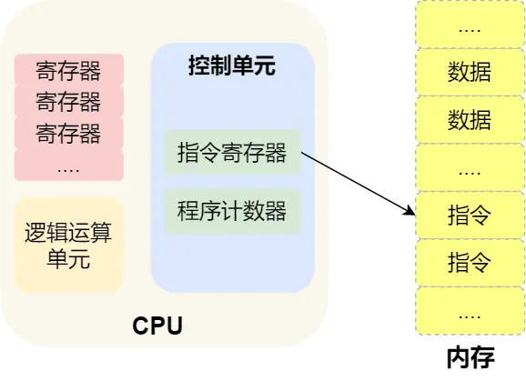
</div>

程序实际上是一条一条指令，所以程序的运行过程就是把每一条指令一步一步的执行起来，负责执行指令的就是 CPU 了。

- **取得指令**：CPU 读取程序计数器的值，这个值是指令的内存地址，然后 CPU 的控制单元操作地址总线指定需要访问的内存地址，接着通知内存设备准备数据，数据准备好后通过数据总线将指令数据传给 CPU，CPU 收到内存传来的数据后，将这个指令数据存入到指令寄存器。程序计数器的值自增，表示指向下一条指令。这个自增的大小，由 CPU 的位宽决定。
- **指令译码**：CPU 的控制器分析指令寄存器中的指令，确定指令的类型和参数。
- **执行指令**：把指令交给逻辑运算单元运算；如果是存储类型的指令，则交由控制单元执行。
- **数据回写**：CPU 将计算结果存回寄存器或者将寄存器的值存入内存。


#### 📝 编译过程：数据段与正文段

CPU 并不认识 `a = 1 + 2` 这样的代码字符串，这些字符串只是方便程序员理解。要想让程序运行，需要把代码翻译成**汇编语言**，这个过程称为**编译**。

针对汇编代码，还需要用汇编器翻译成**机器码**，这些机器码由 0 和 1 组成，这才是 CPU 能够真正识别的语言。

程序编译过程中，编译器会分析代码，将数据和指令分别存放在不同的区域：

- **数据段**：存放程序中的数据
- **正文段**：存放程序的指令

以 `a = 1 + 2` 为例，在 32 位 CPU 上的存储方式：

- 数据 1 被存放到 `0x200` 位置
- 数据 2 被存放到 `0x204` 位置

编译器会把 `a = 1 + 2` 翻译成 4 条指令，存放到正文段中（`0x100 ~ 0x10c` 区域）：

- `0x100` 的内容是 **`load` 指令**：将 `0x200` 地址中的数据 1 装入到寄存器 `R0`
- `0x104` 的内容是 **`load` 指令**：将 `0x204` 地址中的数据 2 装入到寄存器 `R1`
- `0x108` 的内容是 **`add` 指令**：将寄存器 `R0` 和 `R1` 的数据相加，并把结果存放到寄存器 `R2`
- `0x10c` 的内容是 **`store` 指令**：将寄存器 `R2` 中的数据存回数据段中的 `0x208` 地址（变量 `a` 的内存地址）

编译完成后，程序执行时，**程序计数器**会被设置为 `0x100` 地址，然后依次执行这 4 条指令。

由于是在 32 位 CPU 上执行，一条指令占 32 位（4 字节），所以每条指令间隔 4 个字节。

#### 🔢 指令的机器码表示

上面例子中的指令内容是汇编代码，实际上指令的内容是一串**二进制数字的机器码**，CPU 通过解析机器码来知道指令的内容。

不同的 CPU 有不同的**指令集**，对应着不同的汇编语言和机器码。以 MIPS 指令集为例：

MIPS 的指令是一个 32 位的整数，高 6 位代表**操作码**，表示这条指令是什么类型的指令，剩下的 26 位根据不同指令类型表示不同的内容，主要有三种类型：

- **R 指令**：用在算术和逻辑操作，包含读取和写入数据的寄存器地址。如果是逻辑位移操作，后面还有位移操作的「位移量」，最后的「功能码」用于扩展操作码。
- **I 指令**：用在数据传输、条件分支等。没有位移量和功能码，也没有第三个寄存器，而是合并成一个地址值或常数。
- **J 指令**：用在跳转，高 6 位之外的 26 位都是跳转后的地址。

以 `add` 指令（将寄存器 `R0` 和 `R1` 的数据相加，结果存入 `R2`）为例，翻译成机器码：

`add` 指令属于 R 指令类型：

- 操作码：`000000`（固定值）
- rs（第一个寄存器 R0 的编号）：`00000`
- rt（第二个寄存器 R1 的编号）：`00001`
- rd（目标寄存器 R2 的编号）：`00010`
- 位移量：`00000`（不是位移操作）
- 功能码：`100000`（固定值）

拼在一起就是一条 32 位的 MIPS 加法指令，用 16 进制表示为：`0x00011020`

编译器在编译程序时构造指令，这个过程叫**指令的编码**。CPU 执行程序时解析指令，这个过程叫**指令的解码**。

#### 🔄 CPU 流水线技术

现代大多数 CPU 都使用**流水线**（**Pipeline**）的方式来执行指令，把一个任务拆分成多个小任务。一条指令通常分为 4 个阶段，称为**4 级流水线**：

1. **Fetch**（**取得指令**）：CPU 通过程序计数器读取对应内存地址的指令
2. **Decode**（**指令译码**）：CPU 对指令进行解码
3. **Execution**（**执行指令**）：CPU 执行指令
4. **Store**（**数据回写**）：CPU 将计算结果存回寄存器或者将寄存器的值存入内存

这 4 个阶段称为**指令周期**（**Instruction Cycle**），CPU 的工作就是一个周期接着一个周期，周而复始。

不同的阶段由计算机中的不同组件完成：

- **取指令和指令译码**：由**控制器**操作
- **指令执行**：由**运算器**（算术逻辑单元）处理。但如果是简单的无条件地址跳转，则直接在控制器里面完成

#### 📋 指令的类型

指令从功能角度划分，可以分为 5 大类：

- **数据传输类型的指令**：如 `store/load` 是寄存器与内存间数据传输的指令，`mov` 是将一个内存地址的数据移动到另一个内存地址
- **运算类型的指令**：如加减乘除、位运算、比较大小等，最多只能处理两个寄存器中的数据
- **跳转类型的指令**：通过修改程序计数器的值来实现跳转，如 `if-else`、`switch-case`、函数调用等
- **信号类型的指令**：如发生中断的指令 `trap`
- **闲置类型的指令**：如 `nop` 指令，执行后 CPU 空转一个周期

#### ⏱️ 指令的执行速度

CPU 的硬件参数通常有 `GHz` 这个参数，比如 1 GHz 的 CPU，指的是**时钟频率**是 1G，代表 1 秒会产生 1G 次脉冲信号。每次脉冲信号高低电平的转换就是一个**时钟周期**。

对于 CPU 来说，在一个时钟周期内，CPU 仅能完成一个最基本的动作。**时钟频率越高，时钟周期就越短，工作速度也就越快**。

一条指令不一定能在一个时钟周期内完成，通常需要若干个时钟周期。不同的指令需要的时钟周期数不同，例如乘法指令需要的时钟周期数比加法指令多。

#### 💡 如何让程序跑得更快？

程序执行时，耗费的 CPU 时间少就说明程序是快的。程序的 **CPU 执行时间** 可以拆解为：

$$
\text{CPU 执行时间} = \text{CPU 时钟周期数} \times \text{时钟周期时间}
$$

**时钟周期时间**就是 CPU 主频，主频越高，CPU 工作速度越快。例如 2.4 GHz 的 CPU，时钟周期时间为 `1/2.4G`。

要想 CPU 跑得更快，可以缩短时钟周期时间（提升 CPU 主频）。但现代 CPU 主频已经很难做到翻倍提升。

**CPU 时钟周期数**可以进一步拆解为：

$$
\text{CPU 时钟周期数} = \text{指令数} \times \text{每条指令的平均时钟周期数（CPI）}
$$

于是程序的 CPU 执行时间公式变为：

$$
\text{CPU 执行时间} = \text{指令数} \times \text{CPI} \times \text{时钟周期时间}
$$

因此，要想程序跑得更快，可以优化这三个因素：

- **指令数**：执行程序需要多少条指令。这个层面主要靠**编译器**来优化，同样的代码在不同编译器编译后会产生不同的指令序列。
- **每条指令的平均时钟周期数**（**CPI**）：现代 CPU 通过**流水线技术**让一条指令需要的时钟周期数尽可能少。
- **时钟周期时间**：取决于计算机硬件。有的 CPU 支持**超频技术**，调快 CPU 内部时钟可以提升速度，但代价是散热压力增大。
---

## ⚡ 中断

在计算机中，**中断**是系统用来响应硬件设备请求的一种机制，操作系统收到硬件的中断请求，会打断正在执行的进程，然后调用内核中的中断处理程序来响应请求。

操作系统收到了中断请求，会打断其他进程的运行，所以**中断请求的响应程序，也就是中断处理程序，要尽可能快的执行完，这样可以减少对正常进程运行调度地影响。**

### 🔴 硬中断和软中断

Linux 系统为了解决中断处理程序执行过长和中断丢失的问题，将中断过程分成了两个阶段：

- **上半部用来快速处理中断**（**硬中断**）：由**硬件设备**（如键盘、网络卡、定时器等）触发的中断信号，当硬件设备需要与 CPU 交互（如数据传输完成、定时中断等），会通过硬中断通知 CPU。硬中断具有较高的优先级，一般会暂时关闭中断请求，主要负责处理跟硬件紧密相关或者时间敏感的事情。
  - 当硬中断发生时，CPU 会保存当前执行的上下文，并跳转到中断处理程序。
  - 中断处理程序处理完成后，会恢复被中断的程序的上下文，并继续执行。
- **下半部用来延迟处理上半部未完成的工作**（**软中断**）：由内核触发，一般以内核线程的方式运行。通常是通过执行特定指令（如 `int` 指令）或系统调用产生的。在程序运行中请求操作系统的服务，软中断的优先级一般低于硬中断。

---

## 📚 总结

操作系统的硬件结构是理解计算机系统的基础，主要包括以下几个核心部分：

1. **冯诺依曼体系**：现代计算机的基本架构，包括运算器、控制器、存储器、输入设备和输出设备
2. **CPU**：负责控制和计算，32 位和 64 位的主要区别在于一次能计算多少字节数据
3. **存储器层次结构**：从寄存器、L1/L2/L3 缓存到内存、磁盘，速度和容量的平衡
4. **总线**：连接各个部件的公共通信干线
5. **中断机制**：硬件和软件中断的配合，保证系统高效响应外部事件

理解这些硬件结构对于深入理解操作系统的工作原理至关重要。
