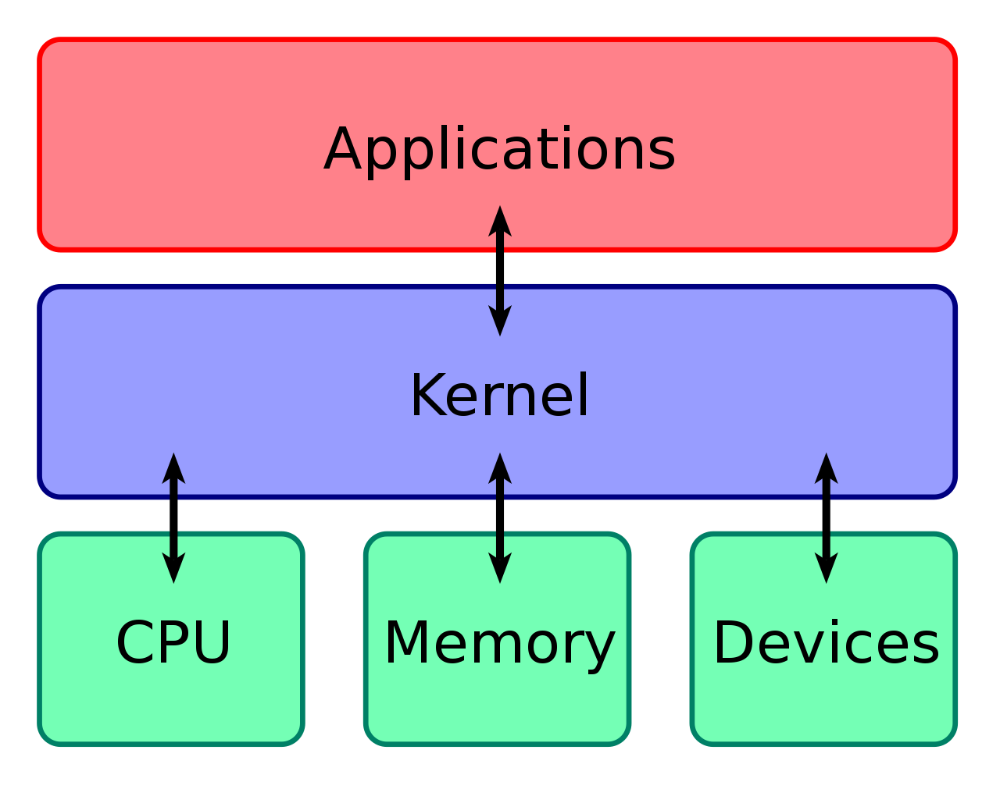
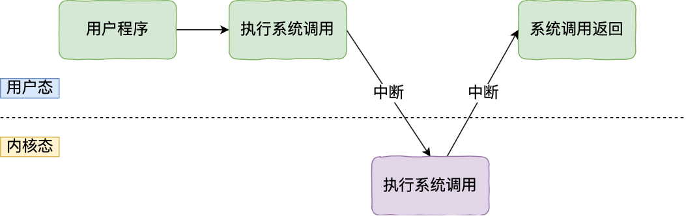

## 操作系统的主要功能

- 负责创建和终止进程。进程是正在运行的程序实例，每个进程都有自己的地址空间和资源。
- 负责为进程分配资源，比如说内存，并在进程终止时回收内存。
- 提供创建、删除、读写文件的功能，并组织文件的存储结构，比如说目录。
- 通过设备驱动程序控制和管理计算机的硬件设备，如键盘、鼠标、打印机等。

## 操作系统内核

计算机是由各种外部硬件设备组成的，比如内存、cpu、硬盘等，**内核作为应用连接硬件设备的桥梁** ，应用程序只需关心与内核交互，不用关心硬件的细节。

操作系统内核具有很高的权限

- **进程调度** ：管理进程、线程，决定哪个进程、线程使用 CPU
- **内存管理** ：管理内存，决定内存的分配和回收
- **硬件通信** ：管理硬件设备，为进程与硬件设备之间提供通信能力
- **系统调用** ：提供系统调用，如果应用程序要运行更高权限运行的服务，那么就需要有系统调用，它是用户程序与操作系统之间的接口。



微内核和宏内核

- **微内核** ：尽量将大部分操作系统功能移至用户态，仅保留最基础的功能（如进程间通信、内存管理）在内核态中。优点是系统更稳定、模块化，但切换频繁，性能不如宏内核。
- **宏内核** ：大部分操作系统服务在内核态中运行，包括文件系统、驱动程序等。优点是性能高，因为减少了用户态与内核态之间的切换，但可能增加系统的复杂性和维护难度。
- **混合内核** ：是宏内核和微内核的结合体，内核中抽象出了微内核的概念，也就是内核中会有一个小型的内核，其他模块就在这个基础上搭建，整个内核是个完整的程序；



## 内核态和用户态

内核具有很高的权限，可以控制CPU、内存、硬盘等硬件，而应用程序具有的权限很小，因此大多数操作系统，把内存分成了两个区域

### 定义

- 内核态：在内核态下，CPU可以执行所有的指令和访问所有的硬件资源。这种模式下的操作具有更高的权限，主要用于操作系统内核的运行。
- 用户态：在用户态下，CPU只能执行部分指令集，无法直接访问硬件资源。这种模式下的操作权限较低。应用程序需要通过系统调用与内核进行通信，由内核代为执行敏感操作。即使程序出现问题也不会影响操作系统的稳定性，主要用于运行用户程序。

### 切换机制

大部分的状态切换出现在用户程序调用系统调用的时候，当应用程序执行系统调用时，CPU 将从用户态切换到内核态，进入内核空间执行相应的内核代码，然后再切换回用户态。

内核程序执行在内核态，用户程序执行在用户态。当应用程序使用系统调用时，会产生一个中断。发生中断后， CPU 会中断当前在执行的用户程序，转而跳转到中断处理程序，也就是开始执行内核程序。内核处理完后，主动触发中断，把 CPU 执行权限交回给用户程序，回到用户态继续工作。

什么时候会出现上下文切换

- **系统调用**：用户态进程**主动**要求切换到内核态的一种方式，主要是为了使用内核态才能做的事情比如读取磁盘资源。系统调用的机制其核心还是使用了操作系统为用户特别开放的一个中断来实现。
- **中断**：当外围设备完成用户请求的操作后，会向 CPU 发出相应的中断信号，这时 CPU 会暂停执行下一条即将要执行的指令转而去执行与中断信号对应的处理程序，如果先前执行的指令是用户态下的程序，那么这个转换的过程自然也就发生了由用户态到内核态的切换。比如硬盘读写操作完成，系统会切换到硬盘读写的中断处理程序中执行后续操作等。
- **异常**：当 CPU 在执行运行在用户态下的程序时，发生了某些事先不可知的异常，这时会触发由当前运行进程切换到处理此异常的内核相关程序中，也就转到了内核态，比如缺页异常。

在用户态和内核态之间切换时，操作系统会执行**上下文切换** ，包括保存当前进程的寄存器、状态和堆栈等信息，并加载内核态的状态以处理系统调用。上下文切换的成本较高，所以优化系统性能时，需要减少不必要的系统调用和态切换。

内核态和用户态的切换过程

- **保存用户态的上下文信息** ：CPU 会将当前用户态进程使用的通用寄存器、程序计数器（PC）、栈指针（SP）、标志寄存器等内容保存起来。这些寄存器中存储着用户态程序当前的执行状态和相关数据，以便内核态处理完任务后能恢复到正确的用户态执行位置。
- **进行模式与权限的切换** ：通过修改 CPU 的特定标志位或寄存器，将处理器的运行模式从用户态切换到内核态，使 CPU 能够执行特权指令，访问所有的内存空间和硬件资源。内核会检查此次切换的合法性和权限，比如检查系统调用的参数是否正确、进程是否具有相应的权限来执行此操作等，以确保系统的安全性和稳定性。
- **加载内核态上下文并执行内核态代码** ：根据进程的描述符或任务控制块（TCB）中保存的内核栈信息，将栈指针设置为指向内核栈的地址，开始使用内核栈来进行内核代码的执行。

### 内核态和用户态的存在原因

- **安全性**：用户态和内核态的划分确保了普通应用程序无法直接访问硬件资源或执行敏感操作，避免了程序或用户恶意操作对系统核心的破坏。
- **稳定性**：通过在内核态中运行关键系统服务（如内存管理、文件系统、设备驱动等），操作系统可以对资源进行集中管理和保护。某个应用程序崩溃，只会影响用户态中的进程，不会影响到整个系统。
- **隔离性**：通过设置不同的权限级别，操作系统能够更好地控制对资源的访问。只有在内核态下，操作系统才有权对硬件资源进行操作，而用户态程序必须通过系统调用请求内核服务，这种设计确保了对系统资源的统一管理。内核态和用户态的划分使得操作系统内核与用户程序之间有了明确的边界，有利于系统的模块化和维护。

## 系统调用

系统调用提供了调用操作系统提供的内核态级别的子功能。凡是与系统态级别的资源有关的操作（如文件管理、进程控制、内存管理等)，都必须通过系统调用方式向操作系统提出服务请求，并由操作系统代为完成。

系统调用过程

- 用户态的程序发起系统调用，因为系统调用中涉及一些特权指令（只能由操作系统内核态执行的指令），用户态程序权限不足，因此会中断执行，也就是 Trap（Trap 是一种中断）。
- 发生中断后，当前 CPU 执行的程序会中断，跳转到中断处理程序。内核程序开始执行，也就是开始处理系统调用。
- 内核处理完成后，主动触发 Trap，这样会再次发生中断，切换回用户态工作。