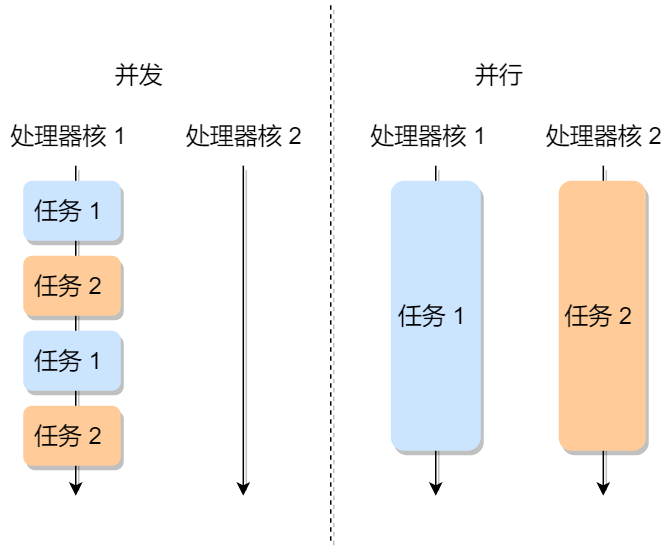
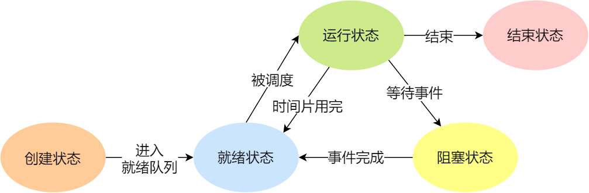
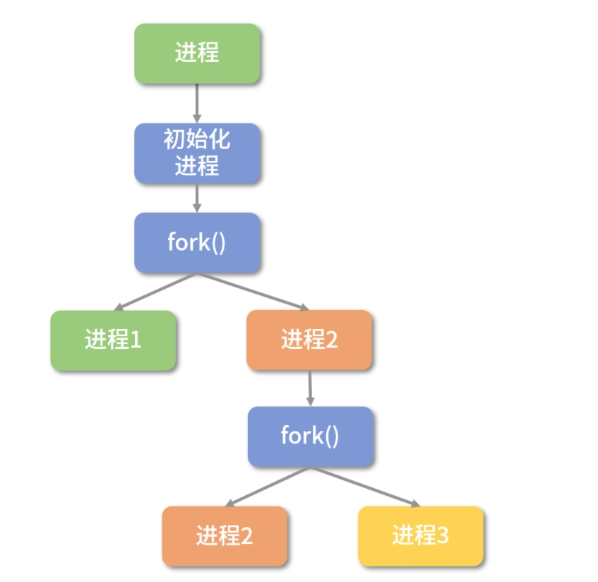
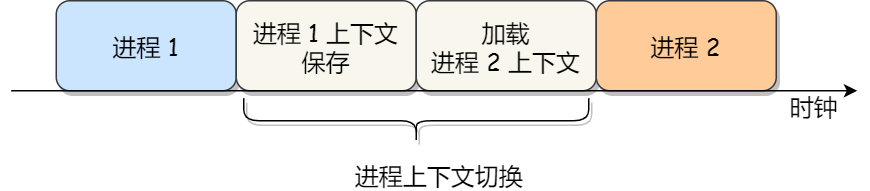
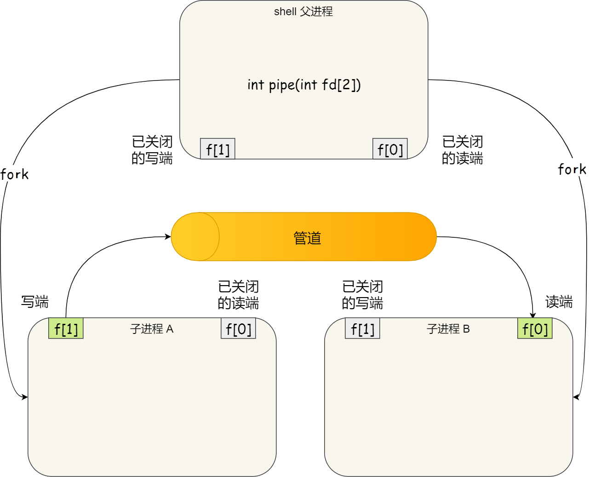
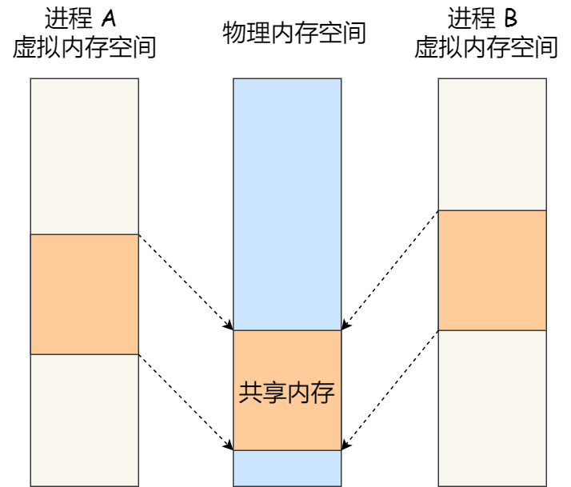

## 进程

在系统中正在运行的一个应用程序；程序一旦运行会被载入内存。进程是资源分配的最小单位。在操作系统中能同时运行多个进程；

进程可以分成以下两类

- **用户态进程** ：通常是应用程序的副本
- **内核态进程** ：内核本身的进程。

如果用户态进程需要申请资源，比如内存，可以通过系统调用向内核申请。

每个进程都有独立的内存空间，存放代码和数据段等，程序之间的切换会有较大的开销

### 并发和并行

- 并发：在一段时间内，多个任务都会被处理；但在某一时刻，只有一个任务在执行。
  - 单核处理器做到的并发，其实是利用时间片的轮转，例如有两个进程 A 和 B，A 运行一个时间片之后，切换到 B，B 运行一个时间片之后又切换到 A。因为切换速度足够快，所以宏观上表现为在一段时间内能同时运行多个程序。
- 并行：在同一时刻，有多个任务在执行。这个需要多核处理器才能完成，在微观上就能同时执行多条指令，不同的程序被放到不同的处理器上运行，这个是物理上的多个进程同时进行。

行

进程之间是独立和隔离的，一个进程崩溃不会导致所有进程崩溃

- **进程隔离性**：每个进程都有自己独立的内存空间，当一个进程崩溃时，其内存空间会被操作系统回收，不会影响其他进程的内存空间。这种进程间的隔离性保证了一个进程崩溃不会直接影响其他进程的执行。
- **进程独立性**：每个进程都是独立运行的，它们之间不会共享资源，如文件、网络连接等。因此，一个进程的崩溃通常不会对其他进程的资源产生影响。

### 进程的状态

- 创建状态（*new*）：进程正在被创建时的状态；
- 就绪状态（*Ready*）：进程处于可运行，进程获得了除了处理器之外的一切所需资源，一旦得到处理器资源(处理器分配的时间片)即可运行。由于其他进程处于运行状态而暂时停止运行；
- 运行状态（*Running*）：进程正在处理器上运行(单核 CPU 下任意时刻只有一个进程处于运行状态)
- 阻塞状态（*Blocked*）：该进程正在等待某一事件发生（如等待输入/输出操作的完成）而暂时停止运行，这时，即使给它CPU控制权，它也无法运行；

- 结束状态（*Exit*）：进程正在从系统中消失时的状态

  

#### 进程挂起

如果有大量处于阻塞状态的进程，进程可能会占用着物理内存空间，出现浪费物理内存的行为。所以，在虚拟内存管理的操作系统中，通常会把阻塞状态的进程的物理内存空间换出到硬盘，等需要再次运行的时候，再从硬盘换入到物理内存。

挂起状态用来描述 **进程没有占用实际的物理内存空间的情况**

- 阻塞挂起状态：进程在外存（硬盘）并等待某个事件的出现
- 就绪挂起状态：进程在外存（硬盘），但只要进入内存，即刻立刻运行

#### 僵尸进程

僵尸进程是已完成且处于终止状态，但在进程表中却仍然存在的进程。（进程已经终止，但其父进程未对其进行回收）

僵尸进程占用系统的进程表项，但不再消耗其他资源。

僵尸进程一般发生有父子关系的进程中，一个子进程的进程描述符在子进程退出时不会释放，只有当父进程通过 wait() 或 waitpid() 获取了子进程信息后才会释放。如果子进程退出，而父进程并没有调用 wait() 或 waitpid()，那么子进程的进程描述符仍然保存在系统中。

#### 孤儿进程

父进程提前终止，子进程继续运行，这些子进程就成为孤儿进程。操作系统会将孤儿进程托管给`init`进程（Linux系统中的PID为1的进程），由`init`进程来收养并清理这些孤儿进程。

### 进程控制块PCB

**PCB 是进程存在的唯一标识** 。一个进程的存在，必然会有一个 PCB，如果进程消失了，那么 PCB 也会随之消失。

#### PCB的结构

-  **进程描述信息：**

  - 进程标识符：标识各个进程，每个进程都有一个并且唯一的标识符；

  - 用户标识符：进程归属的用户，用户标识符主要为共享和保护服务；

- **进程控制和管理信息：**

  - 进程当前状态

  - 进程优先级：进程抢占 CPU 时的优先级；

- **资源分配清单：**

  - 有关内存地址空间或虚拟地址空间的信息
  - 所打开文件的列表和所使用的 I/O 设备信息。

- **CPU 相关信息：**

  - CPU 中各个寄存器的值，当进程被切换时，CPU 的状态信息都会被保存在相应的 PCB 中，以便进程重新执行时，能从断点处继续执行。

#### PCB之间的组织

通常是通过 **链表** 的方式进行组织。**相同状态的进程会被链接在一起，组成各种队列**

### 进程的控制

#### 创建进程

操作系统提供了 **`fork`** 指令，允许一个进程创建另一个进程，而且允许子进程继承父进程所拥有的资源。

`fork`函数用于创建一个与当前进程一样的子进程，所创建的子进程将复制父进程的代码段、数据段、堆、栈等所有用户空间信息，在内核中操作系统会重新为其申请一个子进程执行的位置。但是会有自己的进程空间

fork函数被调用一次但返回两次，两次返回的唯一区别是子进程中返回0而父进程中返回子进程ID。



fork函数为什么被调用一次但是返回两次

因为复制时会复制父进程的堆栈段，所以两个进程都停留在`fork`函数中等待返回，因此会返回两次，一个是在父进程中返回，一次是在子进程中返回，两次返回值是不一样的。

- 在父进程中将返回新建子进程的进程ID
- 在子进程中将返回0
- 若出现错误则返回一个负数



fork的具体流程

- 申请一个空白的 PCB，并向 PCB 中填写一些控制和管理进程的信息，比如进程的唯一标识等；
- 为该进程分配运行时所必需的资源，比如内存资源；
- 将 PCB 插入到就绪队列，等待被调度运行；

#### 终止进程

进程有以下三种结束方式

- 正常结束
- 异常结束
- 外界干预（信号 `kill` 掉）

当子进程被终止时，其在父进程处继承的资源应当还给父进程。而当父进程被终止时，该父进程的子进程就变为孤儿进程，会被 1 号进程收养，并由 1 号进程对它们完成状态收集工作。

终止线程的过程

- 查找需要终止的进程的 PCB；
- 如果处于执行状态，则立即终止该进程的执行，然后将 CPU 资源分配给其他进程；
- 如果其还有子进程，则应将该进程的子进程交给 1 号进程接管；
- 将该进程所拥有的全部资源都归还给操作系统；
- 将其从 PCB 所在队列中删除；

#### 阻塞线程

当进程需要等待某一事件完成时，它可以调用阻塞语句把自己阻塞等待。而一旦被阻塞等待，它只能由另一个进程唤醒。

阻塞进程的过程如下：

- 找到将要被阻塞进程标识号对应的 PCB；
- 如果该进程为运行状态，则保护其现场，将其状态转为阻塞状态，停止运行；
- 将该 PCB 插入到阻塞队列中去；

#### 唤醒进程

进程只能被另一个进程唤醒，唤醒进程的过程如下

- 在该事件的阻塞队列中找到相应进程的 PCB；
- 将其从阻塞队列中移出，并置其状态为就绪状态；
- 把该 PCB 插入到就绪队列中，等待调度程序调度；

### 进程的上下文切换

#### 上下文切换的概念

上下文切换是一种将CPU资源从一个进程分配给另一个进程的机制。

操作系统需要事先帮 CPU 设置好 **CPU 寄存器和程序计数器**。CPU 寄存器和程序计数是 CPU 在运行任何任务前所必须依赖的环境，这就是CPU上下文

CPU 上下文切换就是先把前一个任务的 CPU 上下文（CPU 寄存器和程序计数器）保存起来，然后加载新任务的上下文到这些寄存器和程序计数器，最后再跳转到程序计数器所指的新位置，运行新任务。

系统内核会存储保持下来的上下文信息，当此任务再次被分配给 CPU 运行时，CPU 会重新加载这些上下文，这样就能保证任务原来的状态不受影响，让任务看起来还是连续运行。

#### 进程上下文切换过程

进程是由内核管理和调度的，所以进程的切换只能发生在内核态。**进程的上下文切换不仅包含了虚拟内存、栈、全局变量等用户空间的资源，还包括了内核堆栈、寄存器等内核空间的资源。**

通常，会把交换的信息保存在进程的 PCB，当要运行另外一个进程的时候，我们需要从这个进程的 PCB 取出上下文，然后恢复到 CPU 中，这使得这个进程可以继续执行

#### 进程上下文切换的场景

- **CPU调度** ：CPU 时间被划分为一段段的时间片，这些时间片再被轮流分配给各个进程。这样，当某个进程的时间片耗尽了，进程就从运行状态变为就绪状态，系统从就绪队列选择另外一个进程运行；
- **系统资源不足** ：进程在系统资源不足（比如内存不足）时，要等到资源满足后才可以运行，这个时候进程也会被挂起，并由系统调度其他进程运行；
- **进程主动挂起** ：当进程通过睡眠函数 sleep 这样的方法将自己主动挂起时，自然也会重新调度；
- **高优先级进程运行** ：当有优先级更高的进程运行时，为了保证高优先级进程的运行，当前进程会被挂起，由高优先级进程来运行；
- **发生硬件中断** ：CPU 上的进程会被中断挂起，转而执行内核中的中断服务程序；

### 进程间通信

每个进程各自有不同的用户地址空间，任何一个进程的全局变量在另一个进程中都看不到，所以进程之间要交换数据必须通过内核，在内核中开辟一块缓冲区，进程1把数据从用户空间拷到内核缓冲区，进程2再从内核缓冲区把数据读走。

#### 命名管道/匿名管道

- **匿名管道** ：匿名管道是一种单向通信方式，用于在父进程和子进程之间或者同一主机上的不同进程之间传递数据，数据从一端写入，从另一端读取
- **命名管道** ：是匿名管道的改进版，支持无亲缘关系的进程之间的通信

本质上管道是 **内核里面的一串缓存**

对于匿名管道来说，匿名管道没有实体，不存在管道文件，只能通过父进程和子进程的文件描述符来进行通信

对于命名管道来说，提前创建了一个类型为管道的设备文件，在进程里只要使用这个设备文件，就可以相互通信。

#### 共享内存

**共享内存的机制，就是拿出一块虚拟地址空间来，映射到相同的物理内存中** 。这样这个进程写入的东西对于另外一个进程是可见的，不需要经过数据的拷贝和传输，大大提高了进程间通信的速度。

#### 消息队列

消息队列的通信模式适用于频繁地进行信息传输。比如，A 进程要给 B 进程发送消息，A 进程把数据放在对应的消息队列后就可以正常返回了，B 进程需要的时候再去读取数据就可以了。同理，B 进程要给 A 进程发送消息也是如此。

**消息队列是保存在内核中的消息链表** ，消息队列生命周期随内核，如果没有释放消息队列或者没有关闭操作系统，消息队列会一直存在

消息队列具有以下缺点

- **消息队列不适合比较大数据的传输** ：因为在内核中每个消息体都有一个最大长度的限制
- **消息队列通信过程中，存在用户态与内核态之间的数据拷贝开销** ：因为进程写入数据到内核中的消息队列时，会发生从用户态拷贝数据到内核态的过程，同理另一进程读取内核中的消息数据时，会发生从内核态拷贝数据到用户态的过程。

#### 信号

信号是一种 **异步** 的通信方式，用于通知目标进程发生了某个事件。信号常用于进程之间发送中断或终止命令。信号可以在应用进程和内核之间直接交互，内核也可以利用信号来通知用户空间的进程发生了哪些系统事件

#### 套接字

套接字提供网络通信的端点，可以让不同机器上运行的进程之间进行双向通信。但是套接字实际上不仅用于不同的主机进程间通信，还可以用于本地主机进程间通信。

#### 信号量

进程间通信处理同步互斥的机制。是在多线程环境下使用的一种设施，它负责协调各个线程，以保证它们能够正确，合理的使用公共资源。

对于信号量有两种操作

-  **P 操作**，这个操作会把信号量减去 1，相减后如果信号量 < 0，则表明资源已被占用，进程需阻塞等待；相减后如果信号量 >= 0，则表明还有资源可使用，进程可正常继续执行
-  **V 操作**，这个操作会把信号量加上 1，相加后如果信号量 <= 0，则表明当前有阻塞中的进程，于是会将该进程唤醒运行；相加后如果信号量 > 0，则表明当前没有阻塞中的进程

信号量有两种类型

- **互斥信号量** ：信号初始化为 `1`它可以保证共享内存在任何时刻只有一个进程在访问，这就很好的保护了共享内存。
- **异步信号量** ：保证进程之间的顺序执行

### 进程调度

#### 调度时机

以下状态的变化都会触发操作系统的调度

- 从就绪态 -> 运行态：当进程被创建时，会进入到就绪队列，操作系统会从就绪队列选择一个进程运行；
- 从运行态 -> 阻塞态：当进程发生 I/O 事件而阻塞时，操作系统必须选择另外一个进程运行；
- 从运行态 -> 结束态：当进程退出结束后，操作系统得从就绪队列选择另外一个进程运行；

#### 调度算法

调度算法分为以下两类

- **非抢占式调度算法** ：挑选一个进程，然后让该进程运行直到被阻塞，或者直到该进程退出，才会调用另外一个进程，也就是说不会理时钟中断这个事情。
- **抢占式调度算法** ：挑选一个进程，然后让该进程只运行某段时间，如果在该时段结束时，该进程仍然在运行时，则会把它挂起，接着调度程序从就绪队列挑选另外一个进程。这种抢占式调度处理，需要在时间间隔的末端发生 **时钟中断** ，以便把 CPU 控制返回给调度程序进行调度，也就是常说的 **时间片机制** 。

对于单核CPU有以下常见的调度算法

- **先来先服务（FCFS, First-Come, First-Served）** ：按照进程到达的顺序进行调度，每次从就绪队列选择最先进入队列的进程，然后一直运行，直到进程退出或被阻塞，才会继续从队列中选择第一个进程接着运行。
  - 适用于 CPU 繁忙型作业的系统，而不适用于 I/O 繁忙型作业的系统
  - 可能造成“长任务”拖延其他任务的执行。
- **短作业优先(SJF，Shortest Job First)**  : 从就绪队列中选出一个估计运行时间最短的进程为之分配资源，使它立即执行并一直执行到完成或发生某事件而被阻塞放弃占用 CPU 时再重新调度。
  - 很难准确预知进程的执行时间，并且可能因为短作业一直在执行，导致长作业持续被推迟执行。
- **最高响应比优先（HRRN, Highest Response Ratio Next）** ：通过计算响应比来决定下一个被调度的进程 ，把响应比优先级最高的进程投入运行，平衡长短任务的等待时间，防止短任务过多导致长任务饥饿。响应比的公式为： **(等待时间 + 服务时间) / 服务时间** 其中，**等待时间**是进程在就绪队列中等待的时间，**服务时间**是进程预计需要的执行时间
  - 对于短任务，其服务时间小，初始响应比就较高，容易被优先调度。
  - 对于长任务，随着等待时间的增加，响应比逐渐提升，最终也会被调度，避免了长任务的饥饿。
- **时间片轮转（RR, Round Robin）** ：为每个进程分配固定的时间片，时间片结束后调度下一个进程，如果时间片用完，进程还在运行，那么将会把此进程从 CPU 释放出来，并把 CPU 分配给另外一个进程；如果该进程在时间片结束前阻塞或结束，则 CPU 立即进行切换；
- **多级反馈队列调度（MLFQ, Multilevel Feedback Queue）**：通过将进程放入不同优先级的队列，实现灵活的调度机制。优先级较高的进程先被调度，随着执行时间增加，进程可能被降至低优先级队列。适合多任务、多类型的操作系统。
  - 设置了多个队列，赋予每个队列不同的优先级，每个 **队列优先级从高到低** ，同时 **优先级越高时间片越短** 
  - 新的进程会被放入到第一级队列的末尾，按先来先服务的原则排队等待被调度，如果在第一级队列规定的时间片没运行完成，则将其转入到第二级队列的末尾，以此类推，直至完成
  - 当较高优先级的队列为空，才调度较低优先级的队列中的进程运行。如果进程运行时，有新进程进入较高优先级的队列，则停止当前运行的进程并将其移入到原队列末尾，接着让较高优先级的进程运行

## 线程

### 线程的定义

**线程（Thread）** 可以被视为轻量级进程，是进程当中的一条执行流程，任务调度和执行的基本单位。线程的生命周期由进程控制，进程终止时，其所有线程也会终止。多个线程可以在同一个进程中同时执行，并且共享进程的资源比如内存空间、文件句柄、网络连接等。但每个线程各自都有一套独立的寄存器和栈，这样可以确保线程的控制流是相对独立的。

### 线程的优缺点和存在意义

线程具有以下优缺点

- 优点

  - 一个进程中可以同时存在多个线程；

  - 各个线程之间可以并发执行

  - 各个线程之间可以共享地址空间和文件等资源

- 缺点

  - 当进程中的一个线程崩溃时，可能影响其所属进程的所有线程

线程的存在意义

- 进程切换是一个开销很大的操作，线程切换的成本较低。
- 线程更轻量，一个进程可以创建多个线程。
- 多个线程可以并发处理不同的任务，更有效地利用了多处理器和多核计算机。而进程只能在一个时间干一件事，如果在执行过程中遇到阻塞问题比如 IO 阻塞就会挂起直到结果返回。
- 同一进程内的线程共享内存和文件，因此它们之间相互通信无须调用内核。

### 进程和线程的区别

- **本质区别** 
  - 进程是操作系统资源分配的基本单位
  - 线程是任务调度和执行的基本单位
- **切换开销** 
  - 每个进程都有独立的代码和数据空间（程序上下文），对于进程之间的切换，切换的时候要把页表给切换掉，而页表的切换过程开销是比较大的
  - 线程可以看做轻量级的进程，同一类线程共享代码和数据空间，每个线程都有自己独立的运行栈和程序计数器（PC），同一个进程的线程都具有同一个页表，那么在切换的时候不需要切换页表。
- **稳定性**
  - 进程中某个线程如果崩溃了可能会影响所属进程的其他进程
  - 进程中的子进程崩溃，并不会影响其他进程。
- **通信方式**
  - 因为各自独立的内存空间，进程间通信（IPC）较为复杂，需要使用管道、消息队列、共享内存、套接字等方式
  - 同一进程内的线程共享内存空间，因此线程直接读写内存即可，但注意需要使用同步机制避免数据错误。

### 线程的上下文切换

线程切换是指将 CPU 的控制权从一个线程转移到另一个线程的过程。与进程切换相比，线程切换的开销较小，因为同一进程内的线程共享相同的地址空间和资源。

- 保存当前线程的上下文（如 CPU 寄存器、栈指针等）到线程控制块（TCB）中
- 更新当前线程的状态（如就绪、阻塞等）。
- 选择下一个要执行的线程，更新调度信息。
- 恢复下一个线程的上下文，恢复 CPU 寄存器、栈指针、程序计数器等信息，确保线程能够从上次中断的地方继续执行，开始执行其任务。



线程控制块 TCB

类似于进程控制块PCB，TCB是操作系统用来管理线程的一个数据结构，它包含了与线程执行相关的所有必要信息，确保线程能够在系统中被正确调度和执行。每个线程都有一个对应的 TCB，操作系统通过 TCB 来管理和调度线程的执行。

TCB的主要内容

- **线程状态**：操作系统通过线程状态来判断线程是否可以被执行或者需要被挂起。
- **程序计数器** ：程序计数器保存线程当前执行指令的地址，标识线程的执行位置。线程切换时，程序计数器的值需要被保存和恢复。
- **寄存器内容** ：线程的寄存器值（如通用寄存器、栈指针等）需要在上下文切换时保存和恢复。它们包含了线程执行期间的局部变量、函数调用的返回地址等信息。
- **线程栈指针（Stack Pointer, SP）** ：每个线程都有一个栈，用于存储函数调用信息（如局部变量、返回地址等）。栈指针指向当前栈顶，线程切换时，栈指针需要被保存和恢复。
- **线程优先级（Thread Priority）** ：操作系统通常根据线程的优先级来决定哪个线程应该被调度执行。
- **线程标识符（Thread ID）** ：每个线程都有一个唯一的标识符（线程ID），操作系统通过它来区分不同的线程。
- **线程的调度信息** ：包括线程的调度策略、时间片（如果采用时间片轮转调度）、期望的调度器等。



### 线程的实现

#### 用户线程

用户线程是在用户空间实现的线程，不是由内核管理的线程，是由用户态的线程库来完成线程的管理。操作系统内核并不知道它的存在，它完全是在用户空间中创建。所以 **用户线程的整个线程管理和调度，操作系统是不直接参与的，而是由用户级线程库函数来完成线程的管理，包括线程的创建、终止、同步和调度等。**

用户线程的优缺点

- 优点

  - 管理开销小：创建、销毁不需要系统调用。

  - 切换成本低：用户空间程序可以自己维护，不需要走操作系统调度。

- 缺点

  - 与内核协作成本高：比如这种线程完全是用户空间程序在管理，当它进行 I/O 的时候，无法利用到内核的优势，需要频繁进行用户态到内核态的切换。
  - 由于操作系统不参与线程的调度，如果一个线程发起了系统调用而阻塞，那进程所包含的用户线程都不能执行了。
  - 当一个线程开始运行后，除非它主动地交出 CPU 的使用权，否则它所在的进程当中的其他线程无法运行，因为用户态的线程没法打断当前运行中的线程，它没有这个特权，只有操作系统才有，但是用户线程不是由操作系统管理的。

#### 内核线程

**内核线程是由操作系统管理的，线程对应的 TCB 是放在操作系统里的，这样线程的创建、终止和管理都是由操作系统负责。**

优缺点

- **优点**

  - 在一个进程当中，如果某个内核线程发起系统调用而被阻塞，并不会影响其他内核线程的运行；
  - 分配给线程，多线程的进程获得更多的 CPU 运行时间；

- **缺点**

  - 在支持内核线程的操作系统中，由内核来维护进程和线程的上下文信息，如 PCB 和 TCB；

  - 线程的创建、终止和切换都是通过系统调用的方式来进行，因此对于系统来说，系统开销比较大；

## 线程的同步机制

竞态条件：指当多个线程同时访问和操作同一块数据时，最终结果依赖于线程的执行顺序，这可能导致数据的不一致性。

临界区：对共享资源访问的程序片段，我们希望这段代码是互斥的，可以保证在某个时刻只能被一个线程执行，也就是说一个线程在临界区执行时，其它线程应该被阻止进入临界区。

### 锁机制

#### 互斥锁

使⽤加锁操作和解锁操作可以解决并发线程/进程的互斥问题。

任何想进⼊临界区的线程，必须先执⾏加锁操作。若加锁操作顺利通过，则线程可进⼊临界区；在完成对临界资源的访问后再执⾏解锁操作，以释放该临界资源。

锁有以下两类实现

- 自旋锁：当一个线程试图获取锁时，如果该锁已经被其他线程持有，当前线程不会立即进入休眠或阻塞，而是不断地检查锁的状态，直到该锁可用为止。这个过程被称为忙等待（busy waiting），因为线程在等待锁时仍然占用 CPU 资源，处于活跃状态。优点是避免了线程的上下文切换。
- 非自旋锁：指当一个线程尝试获取锁时，如果锁已经被其他线程持有，当前线程不会忙等待，而是主动让出 CPU，进入阻塞状态或休眠状态，等待锁释放。当锁被释放时，线程被唤醒并重新尝试获取锁。这类锁的主要目的是避免忙等待带来的 CPU 资源浪费。

#### 死锁的发生条件

当两个线程为了保护两个不同的共享资源而使用了两个互斥锁，那么这两个互斥锁应用不当的时候，可能会造成 **两个线程都在等待对方释放锁** ，在没有外力的作用下，这些线程会一直相互等待，就没办法继续运行，这种情况就是发生了 **死锁** 。

死锁的发生条件如下

- **互斥条件** ：多个线程不能同时使用同一个资源，如果另一进程申请该资源，那么必须等待直到该资源被释放为止。
- **等待占有条件** ：一个进程已经持有了至少一个资源，同时还在等待获取其他被占用的资源。在此期间，该进程不会释放已经持有的资源。
- **不可剥夺条件** ：当线程已经持有了资源 ，在自己使用完之前不能被其他线程获取
- **环路等待条件** ：在死锁发生的时候，两个线程获取资源的顺序构成了环形链

#### 避免死锁的方法

- **破坏停等条件** ：一个线程一次请求其所需要的所有资源
- **破坏环路等待条件** ：可以靠按序申请资源来预防。所谓按序申请，是指资源是有线性顺序的，申请的时候可以先申请资源序号小的，再申请资源序号大的，这样线性化后就不存在环路了。
- **破坏不可剥夺条件**：占用部分资源的线程进一步申请其他资源时，如果申请不到，可以主动释放它占有的资源。
- **资源分配时使用银行家算法检测死锁** ：在 **分配给进程资源前，首先判断这个进程的安全性** ，也就是预执行，判断分配后是否产生死锁现象。如果系统当前资源能满足其执行，则尝试分配，如果不满足则让该进程等待。通过不断检查剩余可用资源是否满足某个进程的最大需求，如果可以则加入安全序列，并把该进程当前持有的资源回收；不断重复这个过程，看最后能否实现让所有进程都加入安全序列

