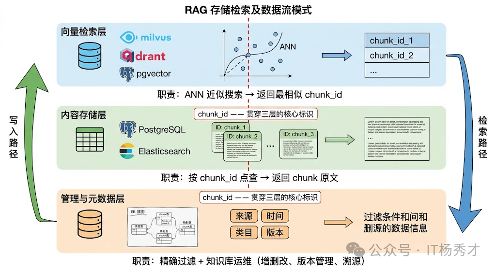

## 🧠 知识库管理简介

在前面，我们介绍了文旅Agent的整体架构和目标功能。其中，**知识库管理模块**是整个系统的核心组成部分之一，它为大模型提供了可靠的知识来源，实现了文旅内容资产的持续沉淀和高效复用。

### 🔍 什么是知识库

知识库（Knowledge Base）是一个结构化的信息存储系统，用于保存和管理组织的知识资产。在文旅Agent中，知识库主要存储以下类型的内容：

- **展品图录与讲解资料**：展品背景、历史沿革、艺术特点、相关故事
- **景区与场馆资料**：开放时间、场馆分布、服务说明、参观须知
- **活动与展览信息**：临展安排、主题活动、票务规则、导览路线
- **文旅内容文档**：策展文案、讲解词、FAQ、对外宣传材料
- **服务与推荐知识**：常见咨询问题、路线建议、面向不同用户群体的推荐策略

### 💡 知识库的核心目标

知识库Agent的核心目标，是作为文旅内容管理和AI应用的基础设施，通过自动化流程，将我们日常积累的文档（比如 `PDF`、`Markdown`、`DOCX`、展品图录、景区资料、导览讲解词等），转化为可被AI高效检索的向量资产。它实现了文档上传后的全流程自动化处理，避免了传统手动整理和向量化的繁琐操作。这个过程为后续的RAG（检索增强生成）机制提供了高质量的数据底座。

同时直接使用大模型存在诸多局限性，而知识库可以有效解决这些问题：

- **上下文窗口限制**：大模型的上下文窗口有限，无法一次性加载所有知识。知识库通过检索相关片段，让大模型在需要时获取准确信息
- **知识时效性**：大模型的知识有截止日期，无法及时更新。知识库可以实时更新，确保信息的时效性
- **领域专业性**：通用大模型对文旅场景中的展品知识、场馆规则和项目资料了解有限。知识库可以补充垂直领域的专有知识
- **回答准确性**：通过检索增强生成（RAG），可以大幅降低大模型的幻觉问题，提高回答的准确性

#### 🎯 支撑RAG精准检索，减少幻觉

知识库Agent最大的价值，是作为RAG技术的可靠数据底座。它确保了AI的回答能够言之有物，避免瞎猜。

- **相似性检索**：无论是对话Agent回答游客咨询，还是旅游服务Agent生成讲解与推荐，知识库都能通过向量数据库的相似性匹配算法，快速返回最相关、最准确的文档片段。例如：当对话Agent回答"这件青铜器有什么历史背景"时，它可以直接定位到展品图录里的对应章节；当用户追问"这个展厅适合带小朋友重点看什么"时，系统也能匹配到导览资料和活动说明中的相关内容。
- **检索结果增强**：返回的结果都会附带文档来源、章节位置等元信息，这不仅方便用户验证答案的准确性，也为RAG的大模型生成最终回答提供了可靠的依据。

#### 🧩 知识沉淀与跨场景复用

知识库Agent将散落的展品资料、导览文案、活动说明、游客常见问题等转化为统一的向量资产，实现了知识的结构化和集中化。

- **团队知识资产化**：通过自动存储和更新知识，它让策展、讲解、导览和内容运营中积累下来的经验不再只停留在个人记忆里，而是能沉淀成可持续复用的数字资产。
- **一次入库，多端受益**：知识库Agent的向量库具有通用性，能够无缝对接多个上层应用，实现一次存储、多Agent调用。例如，一次上传的《特展导览手册》：
  - 既能支撑对话Agent回答游客关于展品、路线和活动安排的问题。
  - 也能让旅游服务Agent在做个性化讲解和内容推荐时调用。
  - 甚至可以赋能展馆小程序、导览终端等入口，实现自动问答和讲解服务。

---

## 📂 文件管理

### 📤 文件上传

- 业务层面，我们限制单次上传不超过 20 个文件，单文件不超过 50MB。大部分用户上传的是 PDF 和 Word，50MB 基本覆盖了 99% 的文档。
- 系统层面，真正的瓶颈在文档解析和向量化。一个 50MB 的 PDF 可能有几百页，解析成文本、切分成 chunk、逐个向量化，整个流程下来可能要几分钟。如果用户一次上传 20 个这种大文件，后台任务队列会堆积。

针对任务堆积做了异步处理。用户上传后立刻返回成功，后台用 Kafka 慢慢消化。前端有个进度条，处理完了会通知用户。

### 🗄️ 存储设计

#### 📦 数据类型

- **向量数据**：每个文档 chunk 经过 Embedding 模型编码后生成的高维向量，用于语义相似度检索。但只有向量远远不够。
- **原始文本**：每个 chunk 对应的原始文本，这是最终要塞进 LLM Prompt 的内容。向量库检索返回的是"最相似的 chunk ID"，你还得拿着这个 ID 去取回原文。Milvus支持在向量旁边附带存储 payload/原文，但当 chunk 文本很长或者需要存储多种格式（Markdown 原文、清洗后纯文本、HTML 渲染版本）时，把所有内容都塞进向量库不是好主意——会严重影响向量索引的内存效率和构建速度。
- **结构化元数据**：文档来源、作者、创建时间、所属部门、知识类目、版本号、权限标签等。这些元数据的访问模式是精确查询和范围过滤（"只看法务部门的文档"、"只看2024年之后的"），这恰恰是关系数据库的强项，向量库在这方面先天不足。
- **文档级的管理信息**：原始文件的存储路径、文档和chunk 之间的前后顺序关系、文档的解析状态和版本记录。这些信息和检索无关，但对知识库的日常运维（增删改查文档、追溯 chunk 来源、支撑增量更新）至关重要。

#### 🏗️ 存储架构设计

系统的存储层都可以归结为三层结构：向量检索层、内容存储层、管理与元数据层。三层各司其职，通过 chunk_id 和 document_id 这两个核心标识串联在一起。

- **向量检索层**：这一层是整个架构中对性能要求最高的部分，负责根据查询向量快速找到最相似的 chunk_id。这一层的核心是向量数据库和它的索引结构。具体选型上，使用Milvus在大数据量下的性能和稳定性最好，Milvus 支持分布式部署、数据分片和多种索引策略（HNSW 适合高召回场景，IVF_PQ 适合内存受限场景），是千万级以上向量规模的首选。
- **内容存储层**，这一层负责存放 chunk 的原始文本和解析后的结构化内容。
  - 直接用关系数据库（PostgreSQL/MySQL）的一张 chunk 表来存：chunk_id 主键、chunk_text 存原文、document_id 外键关联到文档表。
  - 原文存在向量库的 payload 字段里，省去一次跨库查询——虽然这会增加向量库的存储压力（本项目采用此方式）
  - 用 Elasticsearch 同时承担原文存储和 BM25 关键词检索的角色。
- **管理与元数据层**，这一层负责存储结构化元数据和文档级别的管理信息，用于运维。用关系数据库来实现是最自然的选择。这一层通常包含几张核心表：文档表（document_id、文件名、来源、上传时间、解析状态、版本号）、chunk 元数据表（chunk_id、document_id、在文档中的位置序号、chunk 类型标记、标题层级路径、业务标签）、以及document-chunk 映射表（维护父子关系，支撑多级索引和增量更新时的批量删除）。

三层之间的数据流是这样的：文档入库时，原始文件经解析分块后，chunk 文本写入内容存储层，对应的向量写入检索层，元数据和文档信息写入管理层，三处共用同一个 chunk_id。检索时方向反过来——查询向量在检索层做 ANN 搜索拿到 chunk_id 列表，再分别去内容层取原文、去管理层取元数据用于后续过滤和溯源。

<div align="center">
  
</div>

---

## 🔄 离线流程

在离线阶段，系统会自动处理用户上传的文档，将其转换为向量资产，存储到知识库中。系统会根据文档的元数据，构建索引，方便后续的检索。

### 📚 文档加载

Eino提供了统一的文档加载器Document Loader，可以在Document Loader中配置不同的解析器，根据文件类型选择合适的解析器。

- **TextParser**：最基础的文本解析器，将输入内容直接作为文档内容，适配 Markdown 格式的文档。
- **DocxParser**：将 Word 文档转换为多个 section，适配 Word 格式的文档。
- **PDFParser**：将 PDF 文件转换为多个页面，适配 PDF 格式的文档。
- **HTMLParser**：将 HTML 文件转换为纯文本，适配 HTML 格式的文档。

```go
func NewDocumentLoader(ctx context.Context) (*fileloader.FileLoader, error) {
    // 同时它也作为兜底解析器，在遇到未注册扩展名时仍能尝试按纯文本解析。
	textParser := parser.TextParser{} // 最基础的纯文本解析器，适配Markdown文件

    // HTML 解析器。
	bodySelector := "body" // 提取 <body> 内的正文
	htmlParser, err := htmlparser.NewParser(ctx, &htmlparser.Config{
		Selector: &bodySelector, // 指定"提取哪一部分 HTML 内容"
	})
	if err != nil {
		return nil, err
	}

	// PDF 解析器。
	pdfParser, err := pdfparser.NewPDFParser(ctx, &pdfparser.Config{
		ToPages: true, // 按页拆分 PDF，每一页生成一个 Document。更适合后续知识库切分、定位和召回，便于控制单个 chunk 大小
	})
	if err != nil {
		return nil, err
	}

	// DOCX 解析器。
	docxParser, err := docxparser.NewDocxParser(ctx, &docxparser.Config{
		ToSections:      true, // 按 Word 文档内部结构拆成多个 section，便于后续分块和索引。
		IncludeComments: false, // 不提取批注，避免把审阅痕迹、协作噪声混进知识库。
		IncludeHeaders:  false, // 不提取页眉，避免重复标题、公司名、模板信息污染内容。
		IncludeFooters:  false, // 不提取页脚，避免页码、版权声明等无关信息进入知识库。
		IncludeTables:   true, // 提取表格内容。很多业务文档的重要信息都在表格里，通常建议保留。
	})
	if err != nil {
		return nil, err
	}

	// ExtParser 根据文件扩展名分派不同的解析器。
	extensionParser, err := parser.NewExtParser(ctx, &parser.ExtParserConfig{
		Parsers: map[string]parser.Parser{
			// Markdown 文件按纯文本解析，后续如果需要结构化切分，
			".md":       textParser,
			".markdown": textParser,

			// Word 文档使用 docx 专用解析器。
			".docx": docxParser,

			// PDF 文档使用 pdf 专用解析器。
			".pdf": pdfParser,

			// HTML / HTM 文档使用 html 专用解析器。
			".html": htmlParser,
		},

		// FallbackParser 是兜底解析器。尝试按普通文本读取，而不是直接报错。
		FallbackParser: textParser,
	})
	if err != nil {
		return nil, err
	}

	// FileLoader 是本地文件加载器。
	return fileloader.NewFileLoader(ctx, &fileloader.FileLoaderConfig{
		UseNameAsID: true, // 使用文件名作为 Document ID。
		Parser:      extensionParser, // 指定刚才构建好的 extensionParser，让 loader 具备多格式解析能力。
	})
}
```

### 📏 文档分片策略

项目采用基于文档结构的递归语义切分策略。利用文档自身的结构信息。Markdown 文档有标题层级，HTML 有标签结构，PDF 有段落和章节。按这些天然边界来切块，既简单又有效。这种方法特别适合结构化程度高的文档，例如技术文档、产品手册、法律合同等。

项目的核心思想是先识别文档结构（章节标题、子标题、段落、表格、图片），然后按语义单元切分 —— 一个章节就是一个 Chunk（如果不超长的话），表格整块保留，列表项跟前导句合并。超长的章节再递归按子标题或段落切分。

项目设置的Chunk Size 为 512 token。Overlap 为 100 token。

- **识别文档层级结构**：先理解文档结构，再决定在哪切
  - 按结构化文档标题划分，例如Markdown 的二级标题（`##`）切，每个 **chunk** 就是一个完整的章节，语义自然完整。
  - 正则匹配常见编号模式。
- **按语义单元切分**：识别出层级结构后，切分逻辑变成了递归。
  - 如果一个章节的 token 数 ≤ Chunk Size，整个章节作为一个 Chunk，不切。
  - 如果超过 Chunk Size，看有没有子标题。有的话按子标题切分，每个子章节再递归判断。
  - 如果没有子标题，按段落累积——段落逐个加入，直到接近 Chunk Size token 就封一个 Chunk。
  - 如果单个段落就超过 Chunk Size（极端情况），最后才按句子边界切分。
  - 表格和代码块作为不可拆分单元——无论多长，不在中间截断。如果单个表格超过 Chunk Size token，单独作为一个 Chunk。
- **语义完整性检查**：切完之后不是直接用，还要做一轮检查——相邻的两个 Chunk 之间是不是被错误地断开了。
  - chunk 以冒号结尾 → 后面大概率是列表。
  - chunk 是列表项编号开头。
  - chunk 以转折词开头。
- **动态 Overlap**：基于句子边界的 overlap，找到前一个 Chunk 末尾最近的句号位置，从那之后开始 overlap。这样每个 Chunk 的 overlap 部分都是完整的句子。
- **特殊元素处理**：
  - 表格：不能直接整块保留，小表格直接整块作为一个 Chunk。对于远超 Chunk 上限的大表格，如果表格有分组（比如"基本责任""可选责任"两组），按分组切分，每组带上完整表头。如果没有分组，按固定行数切分，但每个 Chunk 都复制表头。
  - 图片：不能直接丢掉，利用多模态模型，流程图和示意图生成文本描述，描述作为 Chunk 入库，数据图表提取结构化数据。
- **Chunk 的元数据设计**：Chunk 不只是一段文本。每个 Chunk 都应该带上丰富的元数据，这些元数据在检索和展示时都有用。

由于Eino框架的限制，只能自定义一个Document Transformer。

### 🗂️ 向量索引构建

使用Embedding模型把每个文本块转换成一个高维向量。这个向量是文本块语义信息的数学表示 —— 语义相近的文本块在向量空间中的距离也相近。这一步的关键是 Embedding 模型的质量，它直接决定了后续检索的准确率。然后把所有文本块的向量及其对应的原文存入 向量数据库（如 Milvus、Pinecone、Weaviate、Chroma 等）。向量数据库的核心能力是 ANN（Approximate Nearest Neighbor，近似最近邻搜索） —— 给定一个查询向量，能在毫秒级别从百万甚至亿级的向量中找到最相似的 Top-K 个。

#### 🗄️ 向量数据库选择

本项目的向量数据库采用Milvus。Milvus是一个基于向量的数据库，支持高维度向量的存储和检索。它提供了丰富的索引类型，如IVF、NSW等，能够高效地处理大规模的向量数据。
Milvus配置如下：

```go
// IndexConfig 是知识库向量索引的统一配置。
type IndexConfig struct {
	MilvusAddress string // Milvus 服务地址

	CollectionName string // collection 名称

	CollectionDesc string // collection 描述

  // ========== Dense Vector 配置 ==========
  EnableDense bool // 是否启用密集向量索引

	VectorField string // 向量字段名称

	VectorDim int // 稠密向量维度，必须和 embedding 模型输出维度一致。

	MetricType entity.MetricType // 向量距离度量方式

	HNSWM int // HNSW 索引参数 M 控制图中每个节点最大连接数，影响召回和索引大小。

	HNSWEFConstruction int // HNSW 建索引参数 efConstruction，值越大，索引质量通常越高，但建索引更慢。

  // ========== Sparse / BM25 配置 ==========
  EnableBM25 bool // 是否启用稀疏向量索引

  SparseVectorField string // 稀疏向量字段名称

  BM25MetricType string // BM25 度量方式

  AnalyzerName string // 分词器名称

  EnableAnalyzer bool // 是否启用分词器

  EnableHybridSearch bool // 是否启用混合搜索

  HybridTopK int // 混合搜索 Top-K 数量

  HybridFusionK int // 混合搜索融合 Top-K 数量

  // ========== Collection 通用配置 ==========
	ConsistencyLevel entity.ConsistencyLevel // 一致性级别

	EnableDynamicSchema bool // 是否启用动态 schema

	ShardNum int32 // 创建 collection 时的 shard 数。
}

// DefaultIndexConfig 返回一套默认文旅知识库配置。
func DefaultIndexConfig() *IndexConfig {
	return &IndexConfig{
		MilvusAddress:       "localhost:19530",
		CollectionName:      "knowledge_chunks",
		CollectionDesc:      "cultural tourism knowledge base chunks",

		// Dense Vector
		EnableDense:         true,
		VectorField:         "vector",
		VectorDim:           1024,
		MetricType:          entity.COSINE,
		HNSWM:               16,
		HNSWEFConstruction:  200,

		// BM25 / Sparse
		EnableBM25:          true,
		SparseVectorField:   "sparse_vector",
		BM25MetricType:      "BM25",
		AnalyzerName:        "standard",
		EnableAnalyzer:      true,

		// Hybrid Search
		EnableHybridSearch:  true,
		HybridTopK:          20,
		HybridFusionK:       60,

		// Collection 通用配置
		ConsistencyLevel:    entity.ClBounded,
		EnableDynamicSchema: false,
		ShardNum:            1,
	}
}
```

#### 🤖 Embedding模型选取

在文旅Agent中，我们选择 `BGE-M3` 作为Embedding模型，主要考虑以下因素：

- **语义理解能力**：能够准确理解文旅场景中的展品、景区、活动等相关语义
- **向量化质量**：相似文本的向量距离更近
- **维度适中**：1024维，兼顾存储和计算效率
- **开源可部署**：支持本地部署，保证数据安全

**Embedding配置**：

```go
type EmbedderConfig struct {
    Model:       "BGE-M3",
    Dimensions:  1024,
    BatchSize:   32,
    MaxRetries:  3,
}
```

#### 📊 向量索引类型

本项目的向量数据库采用Milvus。Milvus是一个基于向量的数据库，支持高维度向量的存储和检索。它提供了丰富的索引类型，如IVF、NSW等，能够高效地处理大规模的向量数据。

- 向量的数据类型选择FloatVector，每个向量的维度为1024维。主流文本 embedding 模型天然输出浮点向量。
- 度量方式选择余弦相似度(Cosine Similarity)。不选择欧式距离是因为余弦相似度衡量的是两个向量方向的一致性，忽略其模长（即向量长度），适用于高维稀疏场景（如文本、推荐系统）中关注“相对分布”而非“绝对位置”的任务；而欧式距离衡量的是空间中两点的几何距离，对向量模长敏感，易受特征尺度、维度灾难和稀疏性干扰。因此，在文本嵌入、用户-物品向量匹配、语义相似性计算等场景中，余弦相似度更鲁棒、更具可解释性。
- 向量检索算法选择近似最近邻索引算法(HNSW)。提前构建图结构来组织向量，查询时不用和全库每个向量逐个比较，而是在图里快速跳转，逼近最相似的结果。在低延迟和召回效果之间通常更适合在线 RAG 场景。HNSW 索引有两个关键参数：m（每层的邻居数）和 ef_search（检索时的候选数）。m 越大索引越准但占用内存越多，ef_search 越大检索越准但越慢。我们实测下来 m=16、ef_search=100 在准确率和延迟之间是比较好的平衡。

#### 📐 Schema 设计

在 Milvus 里，schema 用来规定一个 collection 里有哪些字段、每个字段的数据类型是什么、哪个是主键、哪个是向量字段、字符串最大长度是多少、向量维度是多少，是否有分区键等。

也就是说collection对应MySQL中的实体表，schema对应表的结构：

```json
{
  "collection": {
    "name": "knowledge_chunks",
    "含义": "知识库切分后的 chunk 集合",
    "作用": "用于存储文档切分后的文本片段、稠密向量、BM25 稀疏向量和检索元数据，支撑混合检索、过滤、版本治理和上下文拼装"
  },
  "fields": {
    "id": {
      "含义": "chunk 唯一主键",
      "类型": "VarChar",
      "作用": "唯一标识一条向量记录，便于删除、更新、追踪",
      "设计过程": "用 doc_id + chunk_no + version 生成"
    },
    "kb_id": {
      "含义": "知识库 ID",
      "类型": "VarChar",
      "作用": "多知识库隔离"
    },
    "tenant_id": {
      "含义": "租户 ID",
      "类型": "VarChar",
      "作用": "多租户隔离"
    },
    "doc_id": {
      "含义": "原始文档 ID",
      "类型": "VarChar",
      "作用": "把 chunk 归属到某个源文档，便于文档级重建与删除"
    },
    "source": {
      "含义": "原始来源",
      "类型": "VarChar",
      "作用": "保存文件路径、URL、对象存储 key"
    },
    "title_path": {
      "含义": "章节路径",
      "类型": "VarChar",
      "作用": "保存文档结构路径，比如 产品手册 / 安装说明 / 环境准备"
    },
    "chunk_type": {
      "含义": "chunk 类型",
      "类型": "VarChar",
      "作用": "区分 section、paragraph、table、code、image_desc"
    },
    "page_no": {
      "含义": "页码",
      "类型": "Int64",
      "作用": "适用于 PDF / DOCX 等分页文档"
    },
    "chunk_no": {
      "含义": "文档内 chunk 顺序号",
      "类型": "Int64",
      "作用": "恢复上下文顺序、支持相邻块拼接"
    },
    "content": {
      "含义": "chunk 正文",
      "类型": "VarChar",
      "作用": "召回后直接用于展示和拼 prompt，同时作为 BM25 分词和稀疏向量生成的来源字段",
      "配置要求": {
        "enable_analyzer": true,
        "analyzer_params": {
          "type": "standard"
        }
      }
    },
    "vector": {
      "含义": "稠密文本向量",
      "类型": "FloatVector",
      "作用": "语义检索核心字段",
      "设计建议": "向量维度必须与 Embedding 模型输出维度严格一致"
    },
    "sparse_vector": {
      "含义": "BM25 稀疏向量",
      "类型": "SparseFloatVector",
      "作用": "用于关键词检索和混合检索中的稀疏召回",
      "设计建议": "由 Milvus 服务端基于 content 自动生成，需要 Milvus 2.5+"
    },
    "version": {
      "含义": "文档版本",
      "类型": "Int64",
      "作用": "支持版本治理和重建"
    },
    "is_deleted": {
      "含义": "软删除标记",
      "类型": "Bool",
      "作用": "不要物理删库时很有用"
    },
    "created_at": {
      "含义": "创建时间戳",
      "类型": "Int64",
      "作用": "审计、治理、增量同步"
    },
    "updated_at": {
      "含义": "更新时间戳",
      "类型": "Int64",
      "作用": "重建和数据一致性管理"
    },
    "metadata": {
      "含义": "扩展 JSON 元数据",
      "类型": "JSON",
      "作用": "保存不常过滤但又需要保留的信息",
      "设计建议": "显式字段优先，JSON 只做兜底"
    }
  },
  "dense_index": {
    "field": "vector",
    "index_type": "HNSW",
    "metric_type": "COSINE",
    "params": {
      "M": 16,
      "efConstruction": 100
    }
  },
  "sparse_index": {
    "field": "sparse_vector",
    "index_type": "SPARSE_INVERTED_INDEX",
    "metric_type": "BM25",
    "source_field": "content"
  },
  "hybrid_search": {
    "enabled": true,
    "strategy": "dense + sparse(BM25)"
  }
}
```

#### ⚙️ 向量索引实现

Eino框架提供Indexer 组件，Indexer 组件是一个用于存储和索引文档的组件。它的主要作用是将文档及其向量表示存储到后端存储系统中，并提供高效的检索能力。

```go
indexer, err := milvus2.NewIndexer(ctx, &milvus2.IndexerConfig{
	// Milvus 客户端
	Client: client,

	// collection 名称
	Collection: cfg.CollectionName,

	// collection 描述
	Description: cfg.CollectionDesc,

	// 显式 schema 字段定义
	Fields: svc.buildCollectionFields(),

	// 稠密向量配置
	Vector: &milvus2.VectorConfig{
		Dimension:   int64(cfg.VectorDim),   // 稠密向量维度，必须与 embedding 输出一致
		MetricType:  cfg.MetricType,         // 稠密向量度量方式，文本检索通常使用 COSINE
		VectorField: cfg.VectorField,        // 稠密向量字段名，例如 vector
	},

	// 稀疏向量配置
	Sparse: &milvus2.SparseVectorConfig{
		VectorField: cfg.SparseVectorField,  // 稀疏向量字段名，例如 sparse_vector
		MetricType:  milvus2.BM25,           // BM25 稀疏检索
		// BM25 场景下 Method 可不显式指定，默认走 Auto
	},

	// 为 content 字段启用 analyzer，供 BM25 分词和稀疏向量生成使用
	FieldParams: map[string]map[string]string{
		"content": {
			"enable_analyzer": "true",
			"analyzer_params": `{"type":"standard"}`,
		},
	},

	// 是否开启动态 schema
	EnableDynamicSchema: cfg.EnableDynamicSchema,

	// 一致性级别
	ConsistencyLevel: cfg.ConsistencyLevel,

	// 文本向量化模型，仅用于 dense 向量生成
	Embedding: embedder,

	// 文档转换器：把 schema.Document 映射成显式字段行数据
	DocumentConverter: svc.convertDocumentsToRows,
})
```

#### 🔄 增量索引

在文旅 Agent 项目里，采用的是一套 文档级、异步化、版本化 的增量索引方案。它的核心不是 chunk 级 diff，而是 document 级重建 + 在线版本切换。这样设计的原因很直接：分块策略是基于文档结构的递归语义切分，并且带 overlap，文档中间一段文字的修改，往往会导致后续 chunk 边界整体漂移，因此很难稳定地做 chunk 级增量替换。增量更新的核心难点在于分块边界的不稳定性。一篇文档修改了中间一段话后重新分块，新旧 chunk 的切分位置很可能完全对不上——不是简单地"某个 chunk 内容变了"，而是整篇文档的 chunk 列表都变了。所以增量更新不能做 chunk 级别的 diff，只能做文档级别的替换。

总体索引构建流程如下
- 文件上传:用户上传 Markdown、PDF、DOCX 等文档后，服务端先做基础校验，例如文件数量、大小、扩展名是否合法。你原文里限制单次最多 20 个文件，单文件不超过 50MB，这样可以避免 PDF 和 Word 大文件把解析队列打爆。上传成功后，不同步做解析和向量化，而是将文件保存到本地临时目录，计算 content_hash，创建索引向量化任务，把任务投递到 Kafka。
- 检测是否真的需要更新:Kafka Consumer 收到任务后，先根据 doc_id 查询 kb_document。
  - 如果是新文档：初始化 active_version = 0，创建 version = 1
  - 如果是已有文档，比较这次上传的 content_hash 和当前文档记录里的 hash。如果 hash 没变，直接把任务标记为 success(skip)，如果 hash 变化，生成 target_version = active_version + 1。
- 文档解析与递归语义切分
- 写入新版本而不是直接覆盖旧版本:不能采用先删除再更新的方式，因为一旦新版本中途失败，线上就会出现查不到这篇文档内容的空窗期。所以我的做法是让线上查询在整个构建过程中始终只读旧版本。只有当新版本完整落库并通过校验后，才切换 active_version。
  - kb_document_version.status = building
  - 新版本 chunk 先写入 MySQL
  - 新版本向量再写入 Milvus
  - 全部成功后再把版本切为 active
  - 最后异步删除旧版本
- 失败处理与回滚
  - 解析失败，比如 PDF 损坏、DOCX 结构异常。当前任务标记 failed，同时保持旧版本 active，用户前端收到“索引更新失败”的通知
  - embedding 失败，任务进入重试队列，已写入的新版本数据不切换
  - 切换成功但旧版本删除失败，不影响线上查询，旧版本进入 GC 队列，后台定时清理

这个操作对存储层的要求是：三层存储的删除和写入必须保持一致性。如果向量层删了但管理层没删，就会出现"幽灵元数据"；如果内容层写了但向量层没写成功，就会出现"搜不到但实际存在"的 chunk。

---

## ⚡ 在线流程

### 🔦 查询加工

项目采用Multi-Query的策略对用户查询进行加工：从多个角度生成查询变体，合并结果以提高召回率。
Eino框架提供了Flow封装，定义了Multi-Query的能力。

```go
	mqr, err := multiquery.NewRetriever(ctx, &multiquery.Config{
		// RewriteLLM: 负责根据原始问题生成多个查询变体
		RewriteLLM: llm,

		// RewriteTemplate:
		// 如果传 nil，则使用官方默认模板
		RewriteTemplate: nil,

		// QueryVar:
		// 如果传空字符串，则使用默认 query 变量名
		QueryVar: "",

		// LLMOutputParser:
		// 如果传 nil，则使用默认解析器
		LLMOutputParser: nil,

		// MaxQueriesNum:
		// 最多生成多少个查询变体
		MaxQueriesNum: 3,

		// OrigRetriever:
		// 真正执行检索的底层 Retriever
		OrigRetriever: hybridRetriever,

		// FusionFunc:
		// 结果融合函数，nil 时使用默认融合逻辑（按文档 ID 去重）
		FusionFunc: nil,
	})
```

### 🎖️ 粗排阶段

#### 📋 元数据过滤

元数据过滤在向量检索之前或之后，利用文档的元数据（如时间、来源、类别、作者、权限范围）做预过滤。
例如用户问"最近三个月有哪些适合亲子参观的临展"，可以先用元数据过滤出最近 3 个月、且带有亲子标签的文档，再在这个子集内做向量检索。这样有两个直接好处：

- **准确率更高**：先把明显不可能相关的数据排除掉。
- **检索成本更低**：缩小候选集合后，召回与精排压力都会下降。

#### 🔀 混合检索与多路召回

项目采用混合检索策略，将密集向量检索和稀疏向量检索结合起来，以提高召回率和相关性。
Hybrid Search（混合检索） 是目前工业界最常见的方案。它会同时使用稀疏检索（如 BM25）和稠密检索（向量检索），再通过融合策略合并结果。之所以有效，是因为两种检索方式的能力边界刚好互补：

- 向量检索擅长理解语义，例如"青铜器"和"铜器"字面不同，但向量距离可能很近。因此对于文旅问答这类语义表达丰富的问题，它能够更好地覆盖口语化和模糊表达，相似度阈值设置为 0.8。
- BM25 等稀疏检索擅长精确关键词匹配，例如查询"千里江山图"时，不容易把"清明上河图"这类同属名作但字面不同的结果混进来。

多路召回时采用 Rank Fusion，指的是对初步召回的候选文档做融合排序，将候选池合并，以提高召回率和准确性。其中使用的方法是 Reciprocal Rank Fusion（RRF）。它的逻辑很直接：分别根据候选文档在多路结果中的排名计算得分，再把这些得分加总为最终分数。这里 `k` 取默认值 `60`，主要考虑的是工程实现稳定性和不同查询类型下的通用表现，作为文旅知识库检索场景中的折中配置。

向量检索和BM25检索各自取Top30，RRF融合后取Top10。

RRF 的优势在于：

- **不依赖分数归一化**：BM25 与余弦相似度分数不在同一量纲，直接混合容易失真。
- **工程实现简单**：按排名融合更稳健，落地成本低。
- **兼容多路召回**：不仅能融合两路，也能扩展到多路检索结果。

```go
hybridMode := search_mode.NewHybrid(
	milvusclient.NewRRFReranker().WithK(60),
	&search_mode.SubRequest{
		VectorField: "vector",
		VectorType:  milvus2.DenseVector,
		TopK:        10,
		MetricType:  milvus2.COSINE,
	},
	&search_mode.SubRequest{
		VectorField: "sparse_vector",
		VectorType:  milvus2.SparseVector,
		TopK:        10,
		MetricType:  milvus2.BM25,
	},
)

hybridRetriever, err := milvus2.NewRetriever(ctx, &milvus2.RetrieverConfig{
	Client:            client,
	Collection:        "knowledge_chunks",
	VectorField:       "vector",
	SparseVectorField: "sparse_vector",
	OutputFields:      []string{"id", "content", "metadata"},
	Embedding:         embedder,
	SearchMode:        hybridMode,
})
if err != nil {
	return nil, err
}
```

---

#### 🏅 ReRank 重排序

ReRank 是在初步召回后，再根据模型的输出对候选文档进行排序，以提高召回率和准确性。
前面检索阶段的 Rank Fusion，其目标通常是在海量文档中快速筛出一批大致相关的候选结果，所以它更偏向效率，准确性不是最高。Rerank 则会在这批候选结果上继续精排，挑出最匹配的问题上下文，再交给大模型使用。

项目采用 BGE-Reranker-base 模型对初步召回的候选文档(Top30)进行排序，取出Top5，以提高召回率和准确性。Embedding 和 Rerank 尽量选同一系列的，因为它们在训练时的数据分布和语义空间更一致，搭配效果最好。

---

## 🛤️ 总体链路

用户问题进入系统后，先通过 Multi-Query 生成多个更适合检索的查询变体；随后每个查询都会在预设的元数据过滤条件下进入同一个混合检索器，在 Milvus 中同时执行稠密向量检索和 BM25 关键词检索，并对单个查询内部的召回结果进行融合；接着再将多个查询变体产生的候选结果统一合并，形成粗排候选集；在精排阶段，使用 bge-reranker 对候选文档进行相关性重排序，筛选出最相关的结果；最后再对精排后的文档生成适合注入大模型的上下文，最终由模型完成回答生成。

---

## 🔒 RAG安全权限设计

我们来看一个在文旅场景里同样真实会发生的事故：某博物馆把内部知识库做成了 RAG，馆内人员可以直接提问。策展部门把尚未公开的特展方案、借展清单和布展说明上传到了知识库。一名普通讲解员在系统里问了一句"下季度重点展览会有哪些亮点"，RAG 做了语义检索，返回的却是尚未公开的策展文档。对于文旅项目来说，这同样是严重问题：不同场馆、不同项目组、不同合作方能访问的资料范围并不相同，未公开展览方案、藏品修复记录，合作票务合同等内容都不应该被任意检索。一套没有权限控制的 RAG，不只是产品缺陷，也会直接带来内容泄露和运营风险。根本原因在于向量数据库的设计目标是做语义检索，不是做权限管理。Milvus、Qdrant、Weaviate 等主流向量数据库，默认状态下所有存入 Collection 的向量对所有查询都是可见的。没有类似关系型数据库那样的行级安全（Row Level Security）。

### 🔐 接入层身份认证

用户登录后，系统签发 JWT Token，Token 的 payload 里携带用户的核心权限信息：这里把role（角色）、security_level（安全级别）都放在了 Token 里。这样每次请求过来，API Gateway 校验 Token 合法性，同时解析出用户的权限上下文，向下游服务传递，不需要每次都去数据库查用户权限。

### 🔎 检索层向量数据库过滤

- **Milvus 元数据过滤**：文档入库时，每个 chunk 都必须带上权限元数据，检索时，根据用户 Token 里的权限信息动态构建过滤条件。真实踩坑：刚做这个系统的时候，把权限过滤放在检索之后。就是先用向量搜出来 top_k 个结果，再逐条判断用户有没有权限，过滤掉没权限的。结果发现这样做有个严重问题：如果用户有权限看的文档很少，搜出来的 top_k 基本都被过滤掉了，最终返回的结果可能只有 2 条甚至 0 条，召回率极低。
- **Milvus 分区物理隔离**：引入分区物理隔离。每个场馆、项目组或租户的数据存入独立的 Partition，搜索时只在授权的 Partition 里搜索。Partition Key 机制为逻辑隔离提供了很好的底层支持：把 tenant_id 设为 Partition Key 后，同一个租户的数据会被自动路由到同一个 Partition 中，检索时只在对应 Partition 内搜索，既有物理隔离的性能优势，又不需要为每个租户手动创建 Collection。

### ✅ 返回层二次验证

检索结果出来之后，在返回给用户之前，再做一次权限校验。这是防止第二层出现配置错误或边界情况时的最后一道防线。

---

## 📈 评估过程

### 🧪 测试集的构建

- **确定评估范围**：明确要覆盖哪些领域和文档类型。在我们的文旅项目中，测试集主要覆盖了展品讲解、场馆信息查询、活动展览检索和路线/推荐问答这四个核心场景。
- **明确评估样本**：每条评估样本需要包含四个要素：用户问题（question）、检索到的上下文列表（contexts）、RAG 系统生成的答案（answer）、以及标准参考答案（ground truth）。其中前三个是 RAG 系统实际运行的产出，ground truth 是预先标注的"正确答案"。
- **评估数据的构造**：没有高质量的评估数据，指标算得再精确也没有意义。这其实是整个 RAG 评估中最费力、也最容易出问题的环节。
  - **设计评估问题**：评估问题一般有两个来源：
    - 人工编写——由熟悉文档的人基于内容提出问题。质量高但成本大，适合核心场景。
    - LLM 自动生成——让大模型阅读文档后生成问答对。速度快但质量参差不齐，需要人工筛选。实践中我们用的是组合方案：LLM 先生成 500 条初始问题，人工筛选保留 200 条高质量问题。筛选标准是：问题必须能在知识库中找到明确答案、表述自然不生硬、不跟其他问题重复。
  - **标注参考答案和支持证据**：
    - 参考答案——这个问题的正确回答是什么。由人工撰写或确认，尽量覆盖关键信息点。实际操作中有个经验：先让 RAG 系统跑一批真实用户问题，然后让标注人员在系统的输出基础上修正，而不是从零开始写标准答案。这样既减少了标注工作量，又能让评估数据更贴近系统的实际表现分布。
    - 支持证据——答案来自哪个文档的哪个片段。记录文档 ID、Chunk ID、页码。这不仅用于检索评估（判断系统有没有找到正确片段），也用于生成评估（判断 LLM 有没有基于证据回答）。
- **评估样本覆盖多样性和难度**：
  - 简单事实题——答案在单个 Chunk 里。
  - 多跳推理题——需要综合多个 Chunk。
  - 否定性查询——要求系统拒绝回答，或者提供拒绝理由。
  - 口语化查询——表述跟知识库差异大。

### 📋 评估框架

Ragas 是一个面向 LLM/RAG/Agent 应用的评估框架，核心用途是把"凭感觉评估"变成可重复、可量化的评估流程。它既支持用 LLM 做语义评估，也支持非 LLM 的传统指标，还支持测试集生成、实验对比和生产反馈闭环。

在检索阶段，我们使用以下指标评估检索效果：

- **召回率（Recall@K）**：Top-K 召回的相关片段数 / Top-K 召回的总片段数
- **精确率（Precision@K）**：Top-K 召回的相关片段数 / 总相关片段数

在排序阶段，我们使用以下指标评估精排效果：

- **MRR（Mean Reciprocal Rank，平均倒数排名）**：专门衡量"第一个相关文档排在什么位置"。如果第一个相关文档排在第 1 位，得分是 1；排在第 2 位，得分是 1/2；排在第 5 位，得分是 1/5。MRR 越高，说明系统越能把最相关的结果排到前面，用户（或 LLM）越快就能看到有用的信息。
- **Context Relevance（上下文相关性）**：这是 RAGAS 框架提出的评估维度。它不是简单地看每个 Chunk 是否相关，而是评估检索回来的整体上下文中，有多大比例的内容对回答用户问题确实有用。一个常见的实现方式是用 LLM 从检索到的上下文中提取所有能用于回答问题的句子，然后计算这些有用句子占总上下文的比例。这个指标特别适合发现"检索了很多 Chunk 但大部分是废话"的情况。

在生成阶段，我们使用以下指标评估生成效果：

- **Faithfulness（忠实度）**：是 RAG 生成评估中最核心的指标，没有之一。它衡量的是"LLM 生成的回答是否忠实于检索到的文档内容，有没有编造检索结果中不存在的信息"。为什么说它最核心？因为 RAG 系统存在的根本意义就是让 LLM 基于可靠的外部知识来回答，而不是靠自己的参数记忆胡编乱造。如果生成的回答中出现了检索文档完全没有提到的"事实"，那这个 RAG 系统就失去了存在的意义 —— 用户还不如直接问 LLM。Faithfulness 的评估通常是这样做的：先让 LLM 把生成的回答拆分成若干独立的事实性陈述（Claims），然后逐一检验每个陈述是否能被检索到的上下文所支持。Faithfulness 得分 = 被上下文支持的陈述数 / 总陈述数。这个拆分-验证的思路在 RAGAS 和 TruLens 等评估框架中被广泛使用。
- **Answer Relevance（回答相关性）**：衡量的是生成的回答是否切题、是否真正回答了用户的问题。一个回答可能完全忠实于检索文档（Faithfulness 满分），但如果它答非所问，同样是一个低质量的回答。比如用户问"Python 的 GIL 是什么"，LLM 却大谈 Python 的安装方法 —— 内容可能没有编造，但完全没有回答用户的问题。RAGAS 框架中评估 Answer Relevance 的一个巧妙方法是：用 LLM 根据生成的回答反向生成几个问题，然后计算这些反向生成的问题与原始问题之间的语义相似度，相似度越高说明回答越切题。
- **Answer Completeness / Correctness（回答完整性/正确性）**：关注的是回答是否覆盖了问题的所有要点。一个忠实且切题的回答，如果只回答了问题的一半，也不算好答案。这个指标通常需要一个参考答案（Ground Truth）来对比，评估生成的回答覆盖了参考答案中多少关键信息点。在有标注数据的场景下，这是一个很有说服力的指标。

---

## 📊 评估结果

在文旅测试集上，我们在测试集上做了完整的A/B对比：整体Recall@5从72%提升到85%，提升13个百分点。最终这套组合的MRR为0.86，最终这套检索链路做到 `Precision@5 = 85%`、`Recall@5 = 85%`、`MRR = 0.86`。从具体查询类型来看，也能比较清楚地看到混合检索的价值：

- **展品讲解类问题**：比如"这件青铜器的历史背景是什么"这类语义表达丰富的问题，从79%提升到85%，提升约6个百分点。这类查询向量检索本来就做得不错，BM25的补充效果有限，但RRF融合后依然有小幅提升，因为BM25能额外召回一些包含关键动词的相关文档。
- **场馆信息类问题**：比如开放时间、展厅分布、参观规则这类包含明确关键词的查询，BM25在这类查询上贡献最大，从51%提升到78%，提升约27个百分点。BM25能够把字面命中的资料稳定召回出来，而向量检索则可能把字面类似的名词也排进来。
- **活动展览类问题**：对于临展名称、时间范围、主题活动这类既需要语义理解、又依赖精确名词匹配的场景，混合检索加 `RRF` 融合能够有效减少误召回，再通过重排阶段进一步提升最终结果质量。从48%提升到73%，提升约25个百分点。这是提升最显著的一类，BM25对专业术语的精确匹配能力是关键。
