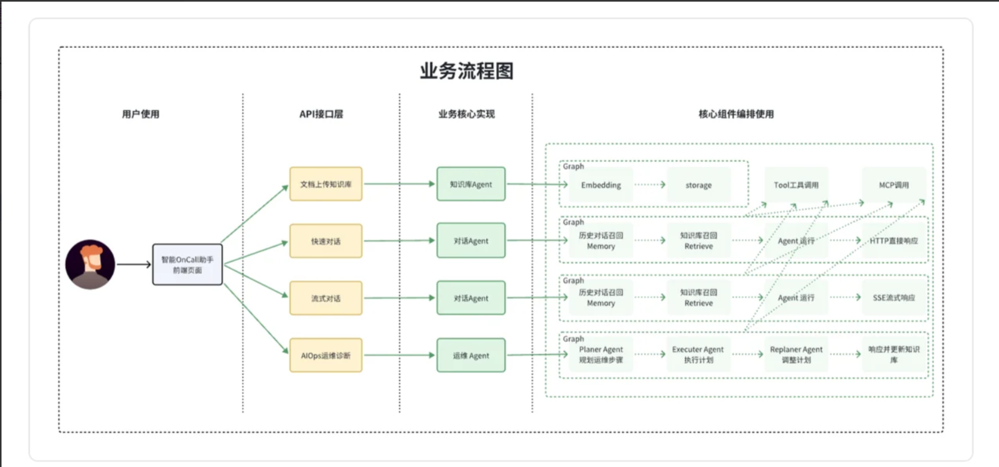
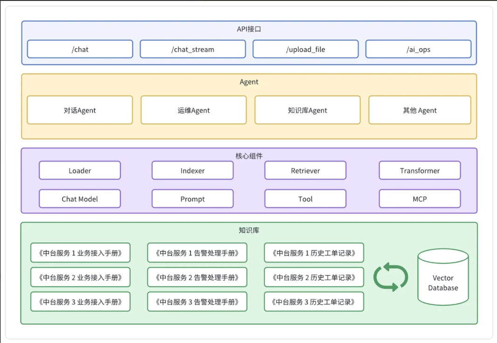

## 🧠 项目背景

在日常的运维工作中，OnCall（值班）告警处理是一项既重要又繁琐的任务。每当线上系统出现异常，值班人员需要在第一时间收到告警通知，并根据告警信息快速定位问题、分析原因、协调处理。然而，这个过程存在诸多痛点：

- **告警噪音过多**：一次故障可能触发大量重复告警，值班人员容易被海量信息淹没
- **信息碎片化**：告警信息分散在多个系统，需要人工汇总分析
- **响应时效要求高**：即使在深夜，值班人员也必须保持警觉，及时响应
- **经验难以传承**：处理告警的经验主要依赖个人积累，新人上手慢

随着大语言模型（LLM）技术的快速发展，我们开始探索利用AI能力来辅助甚至部分替代人工处理OnCall告警。智能OnCall Agent正是为了解决这些问题而诞生的项目。

## 📌 目标功能

- **文件上传知识库（知识库管理）**：这个功能支持团队将各种文档（比如故障处理手册、服务接入说明等）上传到系统。它为大模型提供了可靠的知识来源，实现了团队经验的持续沉淀和高效复用。
- **对话交互支持（Chatbot）**：值班人员可以通过自然语言与系统进行交互，快速查询故障处理手册。例如，你可以直接问：错误码120000001的原因是什么？系统会立即从《XX系统错误码手册》中返回精准的错误原因。
- **AIOps运维诊断（运维Agent）**：系统接收到告警通知后（例如接口失败率过高），会按照预设的步骤自动开始排查。它可能会调用日志API查询最近一小时的error日志，调取监控面板查看失败率的趋势，然后聚合数据并返回关键信息，比如：近三十分钟内context cancel错误占比百分之九十，疑似为下游系统异常。

---

## 🏗️ 技术选型

基于项目的需求和目标，我们进行了以下技术选型：

### 🎯 前后端开发框架

- **前端**：Vue3 + ElementPlus
- **后端**：Kitex + Hertz + Eino
- **数据库**：MySQL
- **缓存**：Redis
- **消息队列**：Kafka
- **向量数据库**：Milvus

#### 💡 Eino框架是什么，为什么不选择LangChain？
Eino框架是字节跳动开源的一个大模型应用开发框架，核心思想是用图Graph来定义Agent的工作流。在我的理解里，图中的每个节点代表一个原子能力，比如大模型节点、召回使用的Retriever节点等。边则代表了这些节点之间的执行顺序和数据流向。在项目中，我用Eino来构建不同的Agent。比如ChatAgent，把召回、Prompt构建、ReAct定义成节点，然后用边把它们连起来。这样，整个Agent的执行过程就变得非常清晰和可配置。选择Eino主要是看中它这种直观的图编排能力和对工作流状态的维护，让我们能相对容易地构建和调试复杂的Agent。

为什么不选择LangChain？其实要从它们适合的场景来分析

**选择Eino的场景**：
- 高性能生产环境：需要处理高并发请求
- 强类型要求：需要编译时类型安全
- Go技术栈：团队主要使用Go语言

**选择LangChain的场景**：
- 快速原型开发：需要快速验证想法
- 社区资源：需要大量的示例和教程
- Python生态：团队熟悉Python和相关库

在实际项目中，技术选型应该基于团队的技术栈、项目需求、性能要求和长期维护考虑。
对于追求性能和稳定性的生产环境，Eino提供了优秀的Go原生解决方案。
而对于快速迭代和研究型项目，LangChain的灵活性和生态优势更加明显。
Eino虽在生态覆盖度上略逊于LangChain，但其强类型带来的稳定性、Graph编排的开发效
率、字节实践的可靠性，更适合企业级生产落地。

#### 📖 向量数据库为什么选择Milvus？

目前市面上有四种类型的向量数据库：

- 集成了向量搜索插件的现有关系型或列型数据库，比如PGVector
- 支持密集向量索引的传统倒排索引的ElasticSearch
- 基于向量搜索库构建的轻量级向量数据库，Chroma
- 专用向量数据库：这类数据库专门为向量搜索而设计的向量数据库：
  - Milvus
  - Faiss
  - HNSW

Milvus是一个基于向量数据库的系统，它支持高维度向量的存储和检索。在智能OnCall Agent中，向量数据库主要用于存储告警信息的向量表示，以便后续的相似度查询和根因推理。

选择Milvus通常不是因为"它能存向量"这么简单，而是因为你需要一个把向量检索当成核心能力来设计的系统：既能做高性能 ANN，又能做过滤、混合检索、全文检索和更大规模的扩展。Milvus 官方把自己定位为开源、云原生的向量数据库，面向从本地原型到大规模分布式部署的场景。

**主要优势**：

- Milvus不只支持 dense vector，还支持 sparse vector、BM25 全文检索、multi-vector hybrid search，并且可以把这些能力放在同一个 collection 里组合使用。对很多知识库检索来说，这意味着你可以把"语义召回"和"关键词命中"放到同一套检索链路里，而不是自己拼很多外部组件。
- Milvus 对工程化检索支持比较完整。Milvus 支持在 ANN 搜索前先做 metadata filtering，把检索范围限制在满足条件的数据子集里，这对带租户、时间、类别、权限等条件的业务很重要。它还支持 rerankers、多种搜索类型，以及把搜索和结构化字段一起组织在 collection 中。

### 🤖 LLM集成

项目将集成主流的大语言模型API，用于：

- **告警分析**：自动理解告警内容，判断问题类型和紧急程度
- **根因推理**：基于告警信息和历史数据，推测可能的根因
- **处理建议**：生成初步的处理建议，供值班人员参考

本项目将采用本地Ollama部署的qwen3-coder-next模型，避免依赖外部API，确保数据安全和隐私保护。嵌入模型选择text-embedding-v4，因为它在语义相似度计算方面表现优异，能够提供准确的向量表示。维度为1024。

---

## 🧪 核心功能设计

### 🔔 告警处理流程

智能OnCall Agent的核心工作流程如下：

1. **告警接收**：从多个渠道（Prometheus、Alertmanager、自定义WebHook）接收告警
2. **告警聚合**：对相似告警进行聚合，减少噪音
3. **LLM分析**：将告警信息发送给LLM，获取分析结果
4. **处理执行**：根据分析结果，执行预设的自动化操作
5. **结果反馈**：将处理结果通知给值班人员

业务流程如下

  

### 🧩 系统架构

系统架构总的来说，包含四个接口、三个核心模块以及多个辅助组件:

- **知识库管理模块**：当你需要让AI回答特定领域问题时，如果直接将长文本丢给大模型，会受限于模型的上下文窗口大小，导致成本高、速度慢、准确率低。知识库管理模块通过采用先检索相关内容，再生成答案的策略，完美地解决了这些问题。
- **对话Agent**：这是一个智能交互系统，它能够像真人一样理解你的问题、调用知识库和相关的MCP工具，并给出精准的回答。它尤其适合用来处理高频重复的咨询类场景。
- **运维Agent**：它可以像资深工程师一样，自动接收告警、按预设步骤排查问题、分析根因并给出处理建议，甚至能够自动执行标准化操作，将工程师从重复劳动中彻底解放出来。

  

---

## 📋 项目的预期

### ✅ 基础预期与达成情况

基础预期分为3个核心维度，目前都已达成：

- **业务价值预期**：能解决最初设定的核心痛点，把XX场景的多步骤重复任务自动化，覆盖80%的高频场景，把1小时的任务压缩到5分钟完成，内部测试用户满意度90%
- **功能可用性预期**：能稳定完成多步规划、多工具调度、异常处理，核心任务成功率85%以上，不会频繁崩盘、无限循环、出现幻觉
- **工程稳定性预期**：完成了模块化架构设计，支持工具快速接入、权限管控、高并发请求，能支撑小范围内部用户使用。

### 🚩 最终预期与当前短板

这个Agent的最终预期，是打造一个高智能、高鲁棒性、高泛化性、能适配复杂业务场景的垂直领域Agent，真正成为用户的"数字助理"，而不只是简单的任务执行工具。目前的短板，也是我后续优化的核心方向：

- **复杂长链路任务的规划能力不足**：超过10步的复杂任务，规划偏离、逻辑断裂的问题明显，任务成功率会降到60%左右，后续会优化规划模块，加入多智能体协同、长程规划优化
- **个性化与持续学习能力不足**：目前只能基于预设规则和历史经验执行，无法基于用户反馈、使用习惯自主学习优化，后续会优化记忆系统和反思模块，加入在线学习能力
- **多模态能力融合不够深入**：目前只能处理文本信息，对图片、文档、音频的处理能力较弱，后续会接入多模态大模型，优化多模态知识检索和理解能力
---

