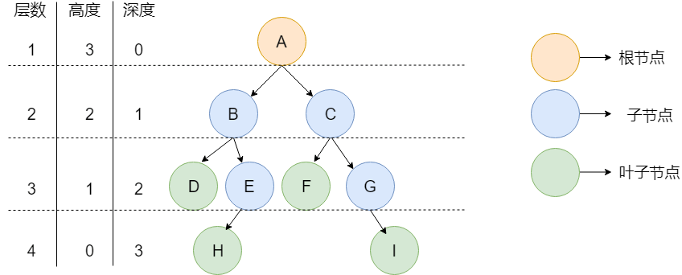

## 树的定义

树是是n（n≥0）结点的有限集合。n=0时，称为 **空树** 。任何一颗非空树只有一个根节点。

树具有以下特点：

- 一棵树中的任意两个结点有且仅有唯一的一条路径连通。
- 一棵树如果有 n 个结点，那么它一定恰好有 n-1 条边。
- 一棵树不包含回路。



## 树的常见概念

### 节点相关

- **节点** ：树中的每个元素都可以统称为节点。
- **根节点** ：顶层节点或者说没有父节点的节点。
- **父节点** ：若一个节点含有子节点，则这个节点称为其子节点的父节点。
- **子节点** ：一个节点含有的子树的根节点称为该节点的子节点。
- **兄弟节点** ：具有相同父节点的节点互称为兄弟节点。
- **叶子节点**：没有子节点的节点。

### 深度和高度

- **节点的高度** ：该节点到叶子节点的最长路径所包含的边数
- **节点的深度** ：根节点到该节点的路径所包含的边数，根节点的深度默认为0
- **树的高度** ：树的高度等于根节点的高度，即根节点到叶子节点包含的边数
- **树的深度** ：树的深度等于叶子节点的深度，即根节点到叶子节点包含的边数，所有树的深度等于树的高度

## 二叉树

### 定义

每个节点最多只有两个分支（即不存在分支度大于 2 的节点）的树结构

```java
static class TreeNode{
    int val;
    TreeNode left;
    TreeNode right;
    public TreeNode(int val){
        this.val=val;
    }
}
```

深度为k的二叉树的节点数为$[2^d,2^{d+1}-1]$

- 最多节点（满二叉树）：$N=2^0+2^1+...2^d=2^{d+1}-1$
- 最少节点（最后一层只有一个节点）：$N=2^0+2^1+..2^{d-1}+1=2^d$

### 分类

#### 满二叉树

一个二叉树，如果每一个层的结点数都达到最大值，则这个二叉树就是 **满二叉树** 。也就是说，如果一个二叉树的层数为 K，且结点总数是$2^k -1 $，则它就是 **满二叉树** 。


#### 完全二叉树

除最后一层外，若其余层都是满的，并且最后一层是满的或者是在右边缺少连续若干节点，则这个二叉树就是 **完全二叉树** 。


#### 二叉搜索树

对于每个节点X，它的左子树的所有项的值均小于X的元素值，右子树的所有项均大于X的元素值

- 若它的左子树不空，则左子树上所有结点的值均小于它的根结点的值
- 若它的右子树不空，则右子树上所有结点的值均大于它的根结点的值


#### 平衡二叉树

**平衡二叉树** 是一棵二叉搜索树，且具有以下性质：

- 可以是一棵空树
- 如果不是空树，它的左右两个子树的高度差的绝对值不超过 1，并且左右两个子树都是一棵平衡二叉树。

## 树的基本操作

### 遍历元素

#### 前序遍历

二叉树的前序遍历，就是先输出根结点，再遍历左子树，最后遍历右子树，遍历左子树和右子树的时候，同样遵循先序遍历的规则。通常通过递归实现前序遍历。

```java
public void preOrder(TreeNode root){
	if(root == null){
		return;
	}
	system.out.println(root.data);
	preOrder(root.left);
	preOrder(root.right);
}
```

#### 中序遍历

二叉树的中序遍历，就是先递归中序遍历左子树，再输出根结点的值，再递归中序遍历右子树

```java
public void inOrder(TreeNode root){
	if(root == null){
		return;
	}
	inOrder(root.left);
	system.out.println(root.data);
	inOrder(root.right);
}
```

#### 后序遍历

二叉树的后序遍历，就是先递归后序遍历左子树，再递归后序遍历右子树，最后输出根结点的值

```java
public void postOrder(TreeNode root){
	if(root == null){
		return;
	}
 	postOrder(root.left);
	postOrder(root.right);
	system.out.println(root.data);
}
```

#### 层序遍历

层序遍历一个二叉树。就是从左到右一层一层的去遍历二叉树。通常使用队列实现

```java
public void solver(TreeNode node) {
        if (node == null) return;
        Queue<TreeNode> que = new LinkedList<TreeNode>();
        que.offer(node);
        while (!que.isEmpty()) {
            List<Integer> itemList = new ArrayList<Integer>();
            int len = que.size();
            while (len > 0) {
                TreeNode tmpNode = que.poll();
                itemList.add(tmpNode.val);
                if (tmpNode.left != null) que.offer(tmpNode.left);
                if (tmpNode.right != null) que.offer(tmpNode.right);
                len--;
            }
            resList.add(itemList);
        }
    }
```

### 插入元素

通常插入元素的时间复杂度为$O(h)$

- 对于二叉搜索树
  - 最坏情况：此时二叉搜索树退化为链表，时间复杂度为$O(n)$
  - 最好情况：此时二叉搜索树是平衡的，时间复杂度为$O(logn)$

因此可以通过二叉树的平衡操作来减少二叉树的深度

### 删除元素

删除节点有以下几种情况

- **左右孩子都为空（叶子节点）** ：直接删除节点， 返回NULL为根节点
- **删除节点的左孩子为空，右孩子不为空** ：删除节点，右孩子补位，返回右孩子为根节点
- **删除节点的右孩子为空，左孩子不为空** ：删除节点，左孩子补位，返回左孩子为根节点
- **左右孩子节点都不为空** ：将删除节点的左子树头结点（左孩子）放到删除节点的右子树的最左面节点的左孩子上，返回删除节点右孩子为新的根节点。

```java
public TreeNode deleteNode(TreeNode root, int key) {
        if(root==null)
            return null;
        if(root.val==key)
        {
            if(root.left==null)
                return root.right;
            else if(root.right==null)
                return root.left;
            else {
                TreeNode curr=root.right;
                while(curr.left!=null)
                    curr=curr.left;
                curr.left=root.left;
                root=root.right;
                return root;
            }
        }
        if(root.val>key)
            root.left=deleteNode(root.left,key);
        else
            root.right=deleteNode(root.right,key);
        return root;
    }
```

## B树

### 定义

B 树是一种 **自平衡的多路搜索树（multi-way search tree）** 

B树单一节点拥有的最多子节点数量，称为B树的 **阶** 。一个m阶的B树，树的节点具有以下特征

- 子节点个数和元素个数

  - 根节点
    - 元素的个数：$[1,m-1]$
    - 子节点的个数：$[2,m]$

  - 中间节点
    - 元素个数：$[\lceil m/2 \rceil-1,m-1]$
    - 子节点的个数：$[\lceil m/2 \rceil,m]$

  - 每个节点的子节点个数和元素个数满足关系$子节点个数=元素个数+1$

- 所有的叶子节点都位于同一层。

- 每个节点中的元素从小到大排列，非叶子节点存储数据和索引

### 插入操作

- 定位：找出插入该关键字的最低层中某个非叶结点（在B树中查找key时，会找到表示查找失败的叶节点，这样就确定了最底层非叶结点的插入位置。注意：插入位置一定是最底层中的某个非叶结点）。
- 插入。在B树中，每个非失败结点的关键字个数都在区间内。插入后的结点关键字个数小于m，可以直接插入；插入后检查被插入结点内关键字的个数，当插入后的结点关键字个数大于m-1时，必须对结点进行分裂。
- 分裂的方法：取一个新结点，在插入key后的原结点，从中间位置$\lceil m/2 \rceil$将其中的关键字分为两部分，左部分包含的关键字放在原结点中，右部分包含的关键字放在新结点中，中间位置$\lceil m/2 \rceil$的结点插入原结点的父结点。若此时导致父结点的关键字个数也超过上限，则继续进行这种分裂操作，直至这个过程传到根节点为止，进而导致B树的高度增1。
  


### 删除操作

B树中的删除操作与插入操作类似，但是只需讨论删除终端结点（最底层非叶结点）中关键字的情形，因为当被删关键字k不在终端结点可以转换为在终端节点的情况

- 直接删除：若被删除关键字所在结点的关键字个数$≥\lceil m/2 \rceil$，说明删除该关键字后仍满足B树的定义，则直接删去该关键字
- 兄弟够借：若被删除关键字在你所在结点删除前的关键字个数为$\lceil m/2 \rceil-1$，且与此结点相连的右（或左）兄弟结点的关键字个数$≥\lceil m/2 \rceil$，则需要调整该结点、右（或左）兄弟结点及其双亲结点父子交换，以达到新的平衡。
- 兄弟不够借。若被删除关键字所在结点删除前的关键字个数为$\lceil m/2 \rceil-1$，且此时与该结点相邻的左、右兄弟结点的关键字个数均为$\lceil m/2 \rceil-1$，则将关键字删除后与左或者右兄弟结点进行合并

## B+树

### 定义

- 每个分支结点最多有m棵子树（孩子结点）

- 非叶根节点至少有两棵子树，其他每个分支结点至少有$\lceil m/2 \rceil$棵子树。

  - 在B+树中，每个结点（非根内部结点）的关键字个数n的范围$[\lceil m/2 \rceil,m]$；

       在B树中，每个结点（非根内部结点）的关键字个数n的范围是$[\lceil m/2 \rceil-1,m-1]$。

- 结点的子树个数与关键字个数相等。

- 所有叶结点包含全部关键字及指向对应记录的指针，叶结点中将关键字按大小顺序排列，并且相邻叶结点按大小顺序互联链接起来。

- 所有分支结点（可视为索引的索引）中仅仅包含它的各个子结点（即下一级的索引块）中关键字的最大值及指向子结点的指针。


## 堆

### 定义

堆的本质是一个二叉树。与二叉树的区别在于：对于这颗二叉树而言，任何一个子树 **根节点上的数据和孩子节点上的数据之间是存在大小关系**。

- **大顶堆** ：根节点上的数据 **大于或者等于** 左右两个孩子
- **小顶堆** ：根节点上的数据 **小于或者等于** 左右两个孩子

### 插入操作

以大顶堆为例，需要对堆的叶子节点进行向上调整，使得堆符合定义。

- 将元素插入到叶子节点中
- 比较插入节点和它的父亲节点，如果插入节点比其父亲节点大则交换位置
- 继续迭代往上判断，直到 **父节点比它大或者到达树的顶部**


### 删除操作

堆的删除只会删除堆顶的元素，因此需要对堆的根节点进行向下调整使得堆满足定义。对大顶堆来说

- 假装删除堆顶的元素，将其视为空穴
- 选取空穴的左右子节点中比较小的节点，与空穴进行交换
- 继续迭代向下判断，直到空穴位于叶子节点

### 建立堆

#### 向下调整建立堆

时间复杂度为$O(logn)$

- 找到最后一个父节点，将该父节点进行向下调整
- 依次对所有的父节点进行向下调整

### 堆排序和Top K问题

升序使用大顶堆，降序使用小顶堆，时间复杂度为$O(nlogn)$

堆排序的过程如下（以升序排序为例）

- 提取大顶堆的堆顶元素
- 将当前最大的元素与末尾元素进行交换
- 重新调整剩余元素形成新的堆
- 循环往复直到堆中没有元素

TOP K问题：比如说现在有10亿个数据，要选出其中最大的K个数，应该怎么选？

我们可以建一个容量为K的小根堆，然后先把前K个数据丢到堆里，之后依次遍历剩余的数据，将比堆顶大的数据代替堆顶进堆。