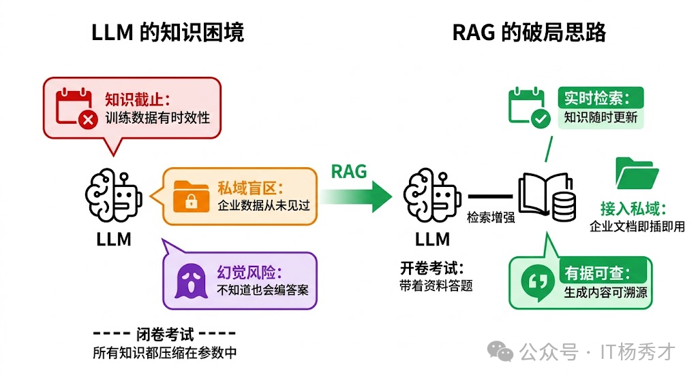
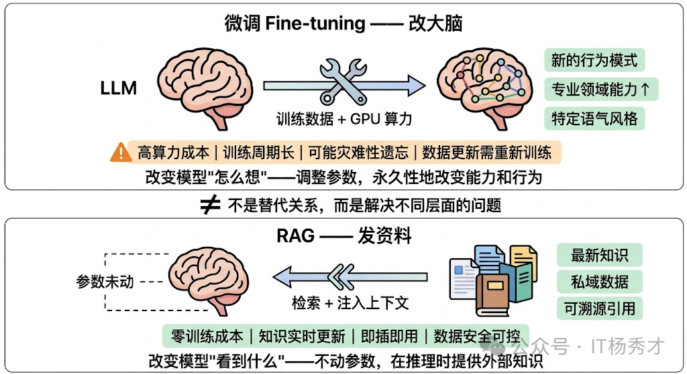
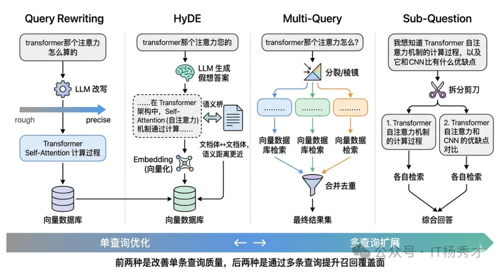
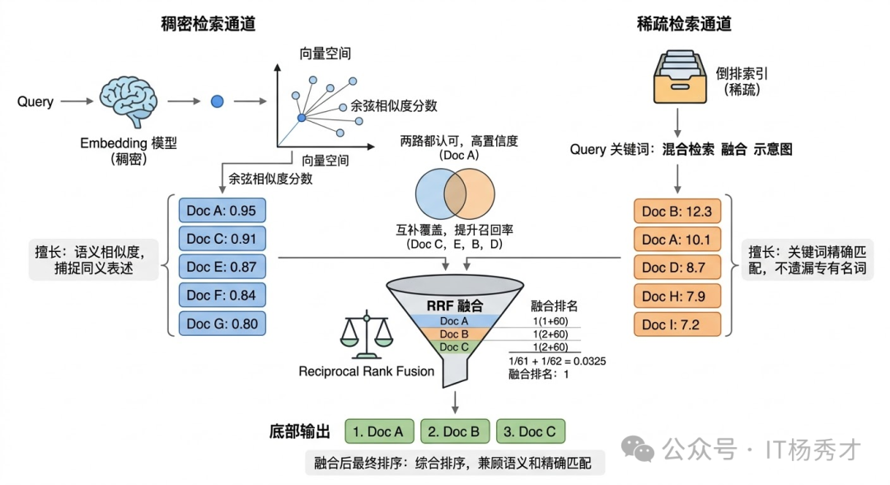
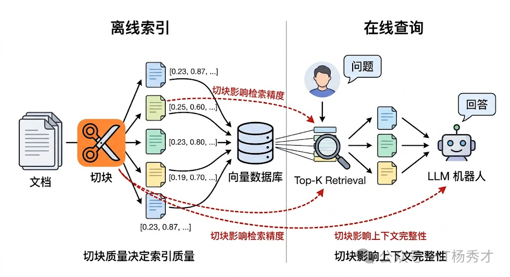
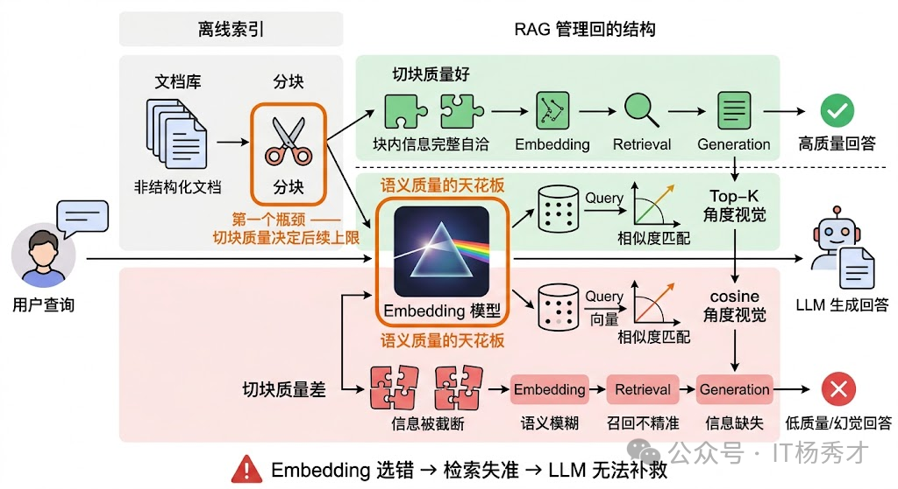
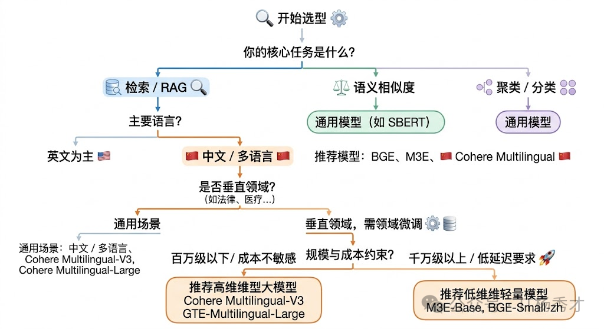
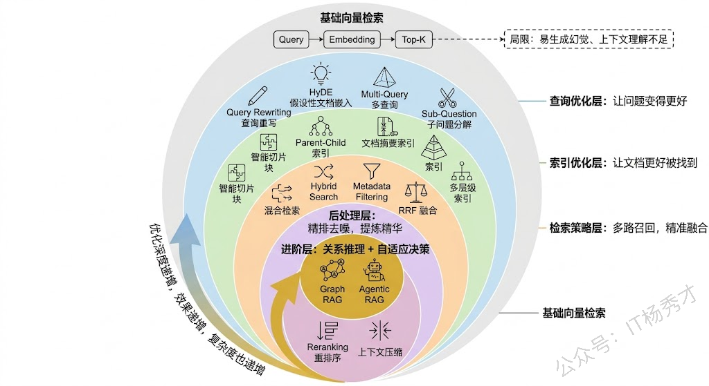

## 🤖 业务背景
随着自然语言处理技术的发展，纯生成式模型虽然已经能够生成较为流畅的文本，但在实际业务中仍然存在两个典型问题：

- **知识局限性**：大模型的知识主要来源于训练数据，通常建立在互联网上的公开语料之上。对于实时性、私有化或离线场景中的知识，模型本身往往无法直接掌握。
- **幻觉问题**：大模型的生成本质上仍然是概率计算。当模型缺少某个领域知识，或者面对自己并不擅长的问题时，就可能一本正经地输出错误结论。

再往工程里看，这两个问题通常会进一步拆成三类约束：**知识有截止日期、无法理解私域数据、缺少依据时容易产生幻觉**。这也是为什么很多企业在做问答机器人、知识助手、客服 Copilot 时，最终都会从“只靠模型记忆”转向“模型 + 外部知识库”的组合方案。

  



可以先用一句话理解本文：**RAG 的本质，是让大模型在回答前先检索资料，再基于资料作答，从“靠记忆回答”切换到“带依据回答”。**



---

## 📖 什么是 RAG

**RAG（Retrieval-Augmented Generation，检索增强生成）** 是一种将 **信息检索（Retrieval）** 与 **文本生成（Generation）** 结合起来的 AI 方法，主要目标是提升大语言模型（LLM）的知识覆盖范围与回答准确性。

可以把它理解成这样：**模型在回答问题之前，先去外部知识库中检索相关内容，再结合检索结果生成最终回答，而不是完全依赖自身参数里的旧知识。**

RAG 的核心价值主要体现在两个方面：

- **检索**：根据用户输入，从外部知识库中检索与问题相关的文本片段，通常依赖文本向量化和向量数据库完成语义匹配。
- **增强生成**：将检索到的知识作为上下文输入给大模型，让模型基于更准确、更贴近问题的信息生成答案，从而减少误导性输出。

如果换一个角度理解，RAG 更像是让模型在推理时“开卷考试”：模型本身不需要把所有知识都背下来，而是在回答前先把相关资料找出来，再基于资料作答。

### 🎯 为什么需要 RAG

要理解 RAG，首先得理解它要解决的痛点。大语言模型的知识来源于预训练阶段吃过的语料，这套"参数化知识"有三个致命的缺陷。

- 知识有截止日期。GPT-4 的训练数据截止到某个时间点，之后发生的事情它一无所知。你问它"2024 年诺贝尔物理学奖给了谁"，它只能坦白说不知道。
- 缺乏私域知识。LLM 训练用的是公开互联网数据，你公司内部的技术文档、客户档案、会议纪要、产品规格书——这些私有数据 LLM 从未见过，所以它也无法回答这类私有问题。
- 幻觉问题。当 LLM 对某个问题没有足够的知识储备时，它有时不会老实说"我不知道"，而是会"一本正经地胡说八道"——用流畅自信的语言生成看起来合理但事实上错误的内容。这是因为 LLM 的本质是一个概率语言模型，它优化的目标是"下一个 token 的概率"，而不是"事实的准确性"。这种幻觉在需要高准确性的场景（法律、医疗、金融）中是不可接受的。

面对这三个缺陷，直觉上你可能会想：那把最新的数据、私域文档全部喂给模型重新训练不就好了？这就是微调的思路。但微调有很高的门槛——需要 GPU 算力、需要整理训练数据、需要处理灾难性遗忘、训练完还要重新部署。而且每次数据更新都要重新微调，成本和周期都不现实。RAG 的诞生，本质上就是在说：能不能不动模型本身，而是在推理阶段给它"开卷考试"的机会？ 不要求模型记住所有知识，而是在需要的时候从外部知识库中检索相关信息，把检索结果作为上下文塞给模型，让它"带着资料回答问题"。

  

### 🧠 RAG 与微调的区别

要理解RAG 和微调的对比，我们可以用一个形象的比喻。微调就像是给一个人"补课"——你改变的是他脑子里的知识结构和思维方式。微调后的模型，它的参数被永久性地更新了，它"记住"了新的知识或"学会"了新的行为模式。RAG 则像是给一个人"发参考资料"——你没有改变他的能力，而是在他答题的时候递给他一叠相关材料，让他照着材料来回答。

- **RAG** 更擅长解决“知识获取”问题，例如最新信息、企业私有文档、产品参数、库存状态、内部制度等。即模型需要用到的事实性信息——最新的数据、私域文档、具体的产品参数等。这些信息的特点是"需要查的，而不是需要学的"。你不需要让模型把你公司所有产品的参数都背下来，你只需要在用户问到某个产品时，帮它从数据库里检索出相关参数就好了。
- **微调** 微调改变模型的行为模式和专业能力，更擅长解决“行为模式”问题，例如输出风格、领域术语习惯、复杂格式约束、某类推理偏好等。比如你想让一个通用模型学会用医学术语对话、学会用特定的语气风格回答、学会遵循某种复杂的输出格式、或者让它在某个专业领域（如法律条文解读）的推理能力更强——这些是微调的强项。因为这些本质上是在改变模型的"思维方式"，需要调整模型参数才能实现。

所以在生产环境里，两者通常不是二选一，而是互补关系：**微调负责改变模型能力边界，RAG 负责补充实时且可更新的事实知识。**

| 方案 | 更擅长解决什么问题 | 典型场景 |
| --- | --- | --- |
| RAG | 外部知识获取、实时信息补充、私域知识接入 | 企业知识库问答、客服机器人、内部文档检索 |
| 微调 | 输出风格、格式约束、领域表达习惯、行为模式塑造 | 法律文书风格、客服回复模板、结构化输出 |

  

### 💡 RAG 的核心优势

RAG 相比微调在"知识获取"层面有五大显著优势：

- **知识实时更新，无需重新训练**：微调一次可能需要数天甚至数周，而 RAG 的知识更新只需要往向量数据库里写入新数据，几分钟甚至几秒钟就完成了。

- **大幅降低幻觉，生成内容可溯源**：RAG 通过在 Prompt 中提供明确的参考信息，把 LLM 的生成从"凭记忆编"变成了"照资料写"。更重要的是，RAG 天然支持引用溯源，用户可以验证信息的准确性。

- **成本低、门槛低、落地快**：RAG 只需要一个 Embedding API、一个向量数据库、一个 LLM API，加上几百行代码，就能搭起一个可用的原型。

- **数据安全和权限控制**：RAG 天然支持在检索阶段根据用户身份过滤可访问的文档范围，确保模型只能"看到"该用户有权看到的资料。

- **避免灾难性遗忘**：因为 RAG 根本不动模型参数，模型的通用能力完好无损，不会在新知识上训练后出现能力退化。

  

---

## 🔄 核心流程

RAG 的完整流程通常可以拆成 5 个核心阶段：

- **数据准备**：清洗原始文档，并进行分块处理，例如把 PDF、Word 或网页文本切成可检索的片段。
- **文本向量化**：使用**嵌入模型**（如 **BERT**、**BGE**）将文本转换为向量表示。
- **索引存储**：将生成的向量写入**向量数据库**，例如 **Milvus**、**Faiss**、**Elasticsearch**。
- **检索增强**：用户提问后，先把问题向量化，再检索相关文档片段。
- **生成答案**：把检索结果与用户问题一起送给大模型，生成最终回答。

如果从系统设计视角再抽象一层，RAG 往往会被拆成 **离线索引阶段** 和 **在线查询阶段**：

- **离线索引阶段**：把原始文档解析、切块、向量化后写入向量数据库，提前构建好可检索的知识底座。
- **在线查询阶段**：用户提问后，再用同一个嵌入模型把问题向量化，做相似度检索、重排序、上下文组装，最后交给 LLM 生成答案。



如果从工程实现看，RAG 可以简化理解为两句话：

- **离线阶段负责把知识“准备好”**
- **在线阶段负责把知识“找出来并组织好”**



  

进一步抽象后，RAG 也可以理解成两个个阶段：**索引、检索生成**。

  

### 🗂️ 离线索引阶段

离线索引阶段是"备考"的过程，目的是把原始文档变成可以被高效检索的形式。
在索引阶段，系统会先对原始文档进行解析，然后拆分为多个较小的文本块。接着，这些文本块会经过嵌入模型处理，转换成向量并存入向量数据库，为后续语义检索提供基础。

#### 📂 文档加载与切分（Chunking）

原始文档可能是 PDF、Word、网页、数据库记录等各种格式，首先要把它们统一解析成纯文本。然后，由于文档通常很长，而后续的 Embedding 模型和 LLM 的上下文窗口都有长度限制，需要把长文档切分成较小的文本块（Chunk）。切分策略是 RAG 工程中第一个需要仔细调优的点——切太大，检索精度下降（一个大 chunk 里可能只有一小段是相关的，其他全是噪声）；切太小，语义完整性被破坏（一句话被从中间截断，失去了上下文）。常见的策略包括按固定长度切分并设置重叠（Overlap）、按自然段落或章节切分、以及基于语义相似度的动态切分。

#### 🧮 文本向量化（Embedding）
一个 Embedding 模型（如 OpenAI 的 text-embedding-3、BGE、E5 等）把每个文本块转换成一个高维向量。这个向量是文本块语义信息的数学表示——语义相近的文本块在向量空间中的距离也相近。这一步的关键是 Embedding 模型的质量，它直接决定了后续检索的准确率。

  

#### 🗄️存入向量数据库（Vector Database）
把所有文本块的向量及其对应的原文存入向量数据库（如 Milvus、Pinecone、Weaviate、Chroma 等）。向量数据库的核心能力是**ANN（Approximate Nearest Neighbor，近似最近邻搜索）** ——给定一个查询向量，能在毫秒级别从百万甚至亿级的向量中找到最相似的 **Top-K** 个。

这里有两个工程细节非常关键：

- **切块策略本身就是索引质量的一部分**。切得太粗会把多个知识点揉成一个向量，切得太碎又会让语义断裂。
- **索引和查询必须使用同一个 Embedding 模型**。否则向量空间不一致，即使文本本身相关，也可能检索不到。

  



嵌入模型、文本向量化与向量数据库可以这样理解：

- **嵌入模型**：把词、短语或句子转换成数值向量的工具，这些向量会尽可能保留文本的语义信息。例如在识物探趣项目中，使用的嵌入模型是 **bge-small-zh-v1.5**，向量维度为 **512**。
- **文本向量化**：把文本映射到高维空间中。语义相近的内容在空间中距离更近，语义差异较大的内容距离更远。
- **向量数据库**：专门用于存储和管理高维向量的数据库，适合对文本、图片、音频等非结构化数据进行相似性搜索。



### 🔍 检索阶段

在线查询阶段是"开卷考试"的过程，用户提出一个问题后，系统实时检索相关知识并交给 LLM 生成回答。

#### 🔄 查询向量化（Embedding）
用同一个 Embedding 模型把用户的问题转换成向量。注意这里必须用和索引阶段相同的模型，否则向量空间不一致，检索就会失效。

#### 🎯 相似度检索
用问题向量在向量数据库中进行 ANN 搜索，找到 Top-K 个最相似的文本块。这些文本块就是系统认为和用户问题最相关的"参考资料"。实际工程中，这一步往往还会叠加一些增强策略，比如混合检索（同时用向量检索和关键词检索，取并集）、重排序（用一个 Cross-encoder 模型对 Top-K 结果做精排）、查询改写（用 LLM 对用户原始问题做扩展或改写以提高召回率）等。

检索阶段会先把用户问题通过**嵌入模型**转换为向量，再与**向量数据库**中的知识向量进行相似度比对。系统会从中找出最匹配的前 `K` 条结果，作为后续生成阶段的参考上下文。

#### ⚙️ 增强生成

增强生成阶段会把用户问题与检索到的相关文本块进行组合，再通过**提示工程（Prompt Engineering）**组织成适合模型理解的输入格式。大模型在拥有外部知识上下文之后，就能输出更准确、更贴近问题的回答。

  

---

## ⚠️ RAG 的常见瓶颈

很多人一开始会把“检索优化”理解成“换一个向量库”或“把 Top-K 从 3 调到 5”。但真正影响效果的，往往是整条检索链路：**查询怎么改写、索引怎么组织、召回怎么融合、候选怎么精排**。

在进入各种优化手段之前，先要看清楚 **基础向量检索本身的瓶颈**。很多问题不是“参数没调好”，而是方案本身就有边界：

- **查询和文档之间存在语义鸿沟**：用户提问常常是口语化、问题体，但知识库里的文档往往是陈述句、术语化表达。
- **向量检索不擅长精确匹配**：涉及时间、数字、型号、版本号等条件时，单纯做语义相似度很容易把“接近但不正确”的内容一起召回。
- **固定切片容易割裂上下文**：如果一个完整结论恰好被切开，返回的 chunk 往往只有半段，模型即使看到了也很难稳定作答。

  



如果底层问题出在“查询表达不清、切块不合理、候选噪声太多”，那么单纯调大 `Top-K` 往往只会把更多噪声送进模型，而不是稳定提升效果。



### 📌 RAG 的局限性

一个成熟的系统不应该只讲优势而忽略局限。RAG 也有它的短板：

1. **检索质量是天花板**：RAG 的效果高度依赖检索的准确率——如果检索到的文本块和问题不相关甚至矛盾，LLM 会基于错误的上下文生成错误的答案，这有时会比没有 RAG 更危险（因为模型"有理有据地说错话"，用户更容易相信）。

2. **上下文窗口的瓶颈**：检索出来的文本块要塞进 Prompt，受限于 LLM 的上下文长度。虽然长上下文模型（128K 甚至更长）在一定程度上缓解了这个问题，但"长上下文 ≠ 好利用"—— LLM 对超长上下文中间部分的注意力会下降（**Lost in the Middle** 现象）。

3. **不擅长改变模型行为**：RAG 解决的是"知识获取"问题，而不是"行为模式"问题。如果想让模型学会一种新的推理风格或适应特定的输出格式，这些需要微调来解决。



实际上，**RAG 和微调最好的关系是互补而非互斥**。很多生产级系统中，两者是一起用的：先微调让模型具备领域专业能力和特定行为模式，再用 RAG 为它提供实时的、可更新的事实性知识。



## 🚀 RAG 优化策略

### 💡 查询阶段的优化

很多时候检索质量差，根源并不在检索引擎，而在用户查询本身。用户的提问可能太模糊、太口语化，或者把多个子问题混在一起。如果能在检索之前先把查询“加工”一下，效果往往会明显提升。

查询侧最常见的做法包括：

- **Query Rewriting**：把口语化、模糊化的问题改写成更适合检索的表达。
- **HyDE**：先让模型生成一段“假想答案”，再用这段答案的向量去检索，缩小查询和文档之间的表达鸿沟。
- **Multi-Query**：从多个角度生成查询变体，合并结果以提高召回率。
- **Sub-Question Decomposition**：把复杂问题拆成多个子问题分别检索，再汇总回答。

  

除了查询侧优化，工业界里几乎都会使用 **混合检索（Hybrid Search）**，把**向量检索**和**关键词检索**结合起来。原因很直接：

- **向量检索** 擅长语义理解。
- **BM25** 等**稀疏检索**擅长精确匹配关键字、数字、型号、日期等条件。

两者结合后，通常会通过 **RRF（Reciprocal Rank Fusion）** 这类方法按排名融合结果。相比直接融合原始分数，**RRF** 对不同量纲的检索分更稳健，也更容易落地。同时还可以叠加 **元数据过滤**，例如先按时间、来源、类别、权限范围做预筛，再做向量召回。

  

### 🧩 索引阶段的优化

索引侧优化解决的核心问题是：**知识该如何被切分、编码、组织，才能在查询发生时被更准确地找出来。**

#### ✂️ 选择合适的分块策略

##### 🎯 文本切块在 RAG 中的角色
RAG 的基本流程是：用户提问 → 检索相关文档片段 → 将片段拼入 Prompt → LLM 基于这些片段生成回答。而"切块"发生在更早的离线阶段——把原始文档切分成小片段，每个片段生成一个 Embedding 向量存入向量数据库。用户查询时，查询向量和这些片段向量做相似度匹配，找出最相关的 Top-K 片段。

这意味着切块质量直接决定了两件事：检索能不能找到对的片段，以及找到的片段能不能让 LLM 生成好的回答。切得不好，要么检索阶段就漏掉了关键信息，要么检索到了但片段内容残缺不全导致 LLM 无法正确理解。可以说，切块是 RAG 系统中"最不起眼但影响最深远"的环节——很多人花大量精力调 Prompt、换 Embedding 模型、调 Top-K，最后发现问题根源其实出在切块策略上。

分块的本质，是把原始长文本拆成若干个较小但语义相对完整的片段。每个片段通常控制在几百字到上千字之间，比如一个段落、若干段落，或者一个小节。

之所以要分块，主要有几个原因：

- **模型上下文长度有限**：长文本无法一次性完整送入模型，拆分后更容易被处理。
- **便于精准定位信息**：用户问题通常只关心文档中的某一小部分内容，分块后能更快检索到相关片段。
- **兼顾上下文与检索效率**：块太大，检索不精准；块太小，上下文可能断裂。合理分块能在效果和效率之间取得平衡。

所以，分块本质上就是把输入文档切成多个粒度可控的语义单元，方便后续的向量检索与生成模块高效协作。

  

##### ⚖️ Chunk Size 的权衡
从实战调优角度看，分块通常要同时考虑两个参数：**`chunk size`** 和 **`overlap`**。

- **块太小**：每个 chunk 的内容非常聚焦，大概率只包含一个知识点。这带来的好处是 Embedding 向量更精准地代表那个知识点，检索时更容易被"命中"——也就是检索精度（Precision）高。但问题也很明显：一个太小的 chunk 很可能缺少必要的上下文。比如原文是"该方法在实验中将准确率提升了 15%，但仅在数据量超过 10 万条时才有效"，如果从"但"字处切开，前半段 chunk 只说了"提升 15%"而丢失了限制条件，LLM 读到这个片段就可能给出一个过于乐观的回答。此外，小 chunk 意味着数量多，检索到的 Top-K 片段可能来自文档的不同角落，LLM 需要整合多个碎片化的信息，增加了理解难度和幻觉风险。
- **块太大**：每个 chunk 包含更丰富的上下文，语义完整性好，LLM 拿到后更容易理解和推理。但大 chunk 的 Embedding 向量不可避免地变成了多个知识点的"混合体"，一个向量要同时代表好几层含义，检索时就容易"模糊匹配"——用户问的是 A，但因为某个 chunk 里 A 和 B 混在一起，B 的部分也被捎带检索出来了，稀释了相关性。更实际的问题是，大 chunk 意味着每个片段占用更多的 Prompt 空间（即 Context Window），能放进去的片段数量就更少，可能导致召回率（Recall）不够。

  

所以 chunk size 的选择不是一个固定的"最优值"，而是根据具体场景在这两极之间找平衡点。工程实践中的经验是：

- **FAQ、事实问答** 适合偏小的块，例如 `256 ~ 512 token`。因为答案往往在某一段话里，精准检索更重要
- **技术文档、法律条款、分析型内容** 更适合偏大的块，例如 `512 ~ 1024 token`。因为上下文完整性更关键。

##### 🔗 Overlap 的作用
`overlap` 的作用，则是缓解块边界处的信息断裂。想象一下，一段连贯的论述横跨了两个 chunk 的边界：前一个 chunk 的结尾讲了原因，后一个 chunk 的开头讲了结论。如果没有重叠，这两个 chunk 各自都是"半截话"——前一个有原因没结论，后一个有结论没原因。Embedding 分别编码后，两个向量都无法完整代表这段论述的含义，检索时就可能漏掉这条关键信息。此时两个向量都不够完整，召回质量会明显下降。

  

常见的经验值是 `overlap` 设为 `chunk size` 的 `10% ~ 25%`。比如 chunk size 是 512 token，overlap 可以设 50-128 token。过小起不到衔接作用，过大又会带来两个副作用：

- **存储膨胀**：同一段内容被重复编码多次。向量数据库的体积和索引成本显著增加
- **检索重复**：多个 chunk 包含大量相同内容，检索时可能返回一堆"长得差不多"的片段，浪费了宝贵的 Top-K 配额，等于你明明可以看到 5 条不同信息，结果其中 3 条都在重复同一段话。

##### 📋 常见的切块策略
常用切块策略除了固定大小切块（Fixed-size Chunking），还有更精细的做法：

- **语义切块（Semantic Chunking）**：不按固定 token 数切，而是按语义边界切。先把文本按句子分割，然后计算相邻句子之间的 Embedding 相似度，当相似度出现明显下降时（说明话题发生了转换），就在那里切一刀。这样每个 chunk 自然地对应一个完整的语义单元，不需要 overlap 来"缝合"了。

- **基于文档结构的切块**：利用文档自身的结构信息。Markdown 文档有标题层级，HTML 有标签结构，PDF 有段落和章节。按这些天然边界来切块，既简单又有效。比如按 Markdown 的二级标题（`##`）切，每个 chunk 就是一个完整的章节，语义自然完整。这种方法特别适合结构化程度高的文档，例如技术文档、产品手册、法律合同等。

- **递归切块（Recursive Chunking）**：设定一组分隔符优先级（比如先按段落 `\n\n` 切，太大了再按句子 `\n` 切，还太大了再按固定长度切），逐级递归直到每个 chunk 都在目标大小范围内。它兼顾了结构化和大小控制，是实践中最常用的默认策略。

  

##### 🧪 实战调优的步骤

1. **先看数据**：在动手切之前，先抽样看看原始文档长什么样——平均段落长度、内容结构化程度、信息密度。技术文档和闲聊记录显然需要完全不同的策略。

2. **建立评估闭环**：准备一组有标准答案的测试问题，跑一轮 RAG 看效果，调整参数后再跑一轮对比。核心指标有两个：检索召回率（相关片段有没有被检索到）和生成准确率（最终回答对不对）。很多时候你会发现检索层面已经召回了正确片段，但因为 chunk 太碎导致 LLM 无法正确理解，这就是切块的锅。

3. **考虑多级索引**：不只存一种粒度的 chunk，而是同时维护多个层级：比如用小 chunk（256 token）做精准检索，命中后把对应的大 chunk（1024 token）或原始段落送给 LLM。LlamaIndex 中的 `SentenceWindowNodeParser` 和 `HierarchicalNodeParser` 就是这个思路的实现。

4. **匹配 Embedding 模型能力**：不同 Embedding 模型的最佳输入长度不同——有些模型在短文本上表现更好，有些模型专门针对长文本优化（如 jina-embeddings-v2 支持 8192 token）。如果你用的是一个短文本模型却切了很大的 chunk，Embedding 质量会明显下降。

如果文档结构比较稳定，更进一步的做法是结合 **语义切块、按标题分块、递归分块**，甚至引入 **多级索引**。例如用小块做精确召回，命中后再回溯父块或原始段落给模型，这样检索和生成两端都能拿到更合适的粒度。

#### 🗃️ 设计合理的索引架构

  

##### 🕸️ Parent-Child 索引
**Parent-Child 索引**是一种非常实用的索引架构。核心思想是：用小 `chunk` 做检索，但返回大 `chunk` 给 **LLM**。具体来说，先把文档切成较大的 `chunk`（比如 `2000 token`），再把每个大 `chunk` 进一步切成小的子 `chunk`（比如 `200 token`）。检索时用小 `chunk` 的向量做匹配，小 `chunk` 语义集中，匹配更精准；命中后，返回它所属的父级大 `chunk` 给 **LLM**，大 `chunk` 上下文完整，**LLM** 能更好地理解和利用。这种设计同时兼顾了检索精度和上下文完整性，在实际项目中效果很好。

##### 📄 文档摘要索引
对于每篇文档，先用 **LLM** 生成一段摘要，把摘要也做向量化存入索引。检索时，除了匹配原文 `chunk`，还会匹配摘要。摘要天然是对全文内容的高度凝练，很多时候用户的查询和摘要的匹配度反而比和原文碎片的匹配度更高。命中摘要后，再定位到对应的原文段落，返回详细内容。这种“先粗后细”的两级检索在处理长文档时特别有效。

##### 🏗️ 多层级索引
**多层级索引** 不只是文档-chunk 两层，而是构建多层级的索引结构——比如**"领域 → 主题 → 文档 → 段落"**。查询时先在高层级（如领域、主题）做粗筛，快速定位相关范围，再在低层级（如段落）做精确匹配。这种分层策略在文档量很大（数十万篇以上）时优势明显，因为它避免了在全量向量中做暴力搜索，大幅减少检索范围的同时提高了匹配准确率。

#### 🧠 选取合适的嵌入模型

如果说分块决定了“知识被切成什么样”，那么 **Embedding 模型** 决定的就是“这些知识被表示成什么样”。两者共同决定了检索上限。

##### 🎯 Embedding 模型的角色
在 **RAG**、语义搜索、推荐系统、文档聚类等场景中，**Embedding 模型**是连接“自然语言”和“数学空间”的桥梁。它把一段文字转化为一个高维向量，使得语义相近的文本在向量空间中彼此靠近，语义不同的文本彼此远离。桥梁质量越高，后续检索、重排、生成的上限就越高。

这个“桥梁”的质量直接决定了下游任务的天花板。以 **RAG** 为例，如果 **Embedding 模型**不能准确捕捉查询和文档之间的语义关系，那么即使你的 **LLM** 再强大、**Prompt** 写得再好，也无法弥补检索阶段的信息缺失，这就是业界常说的 **Garbage In, Garbage Out**。所以选好 **Embedding 模型**是整个系统的地基，地基不稳，上层建筑再精美也没用。

  

##### ⚖️ 选型时的核心因素
选择嵌入模型时，通常需要重点考虑以下因素：

- **语义准确性**：模型能否准确捕捉长句、上下文关系和同义表达，直接影响检索质量。
- **模型效率**：推理速度、显存占用和部署成本是否满足业务要求。
- **领域适配性**：是否对医疗、金融、法律等垂直领域做过优化，能否理解专业术语。
- **多语言支持**：是否覆盖业务需要的语言，以及跨语言语义对齐能力是否足够。
- **数据规模匹配**：模型大小与训练数据规模是否匹配当前业务复杂度。

除了上面这些通用因素，真正做选型时还要额外注意 4 个问题：

- **任务类型匹配度**：**Embedding 模型**的训练目标不同，擅长的任务也不同。有些模型是为语义相似度（**Semantic Textual Similarity**）优化的，擅长判断两段文本说的是不是同一件事；有些是为检索（**Retrieval**）优化的，擅长从一堆候选文档中找出和查询最相关的那几篇；还有些是为聚类或分类任务优化的。在 **RAG** 场景中，你需要的核心能力是检索，那就应该优先选在检索任务上表现好的模型，而不是在句子相似度任务上跑分最高的模型。**MTEB 排行榜（Massive Text Embedding Benchmark）**之所以有价值，就是因为它把不同任务类型拆开评估，你可以针对自己的任务类型去看对应的分数。
- **语言和领域匹配度**：这一点在国内场景尤为关键。很多在英文上表现优秀的模型，在中文上的效果可能大打折扣。如果你的业务场景是中文为主，就必须选在中文数据上训练过或专门针对中文优化过的模型，比如 **BGE（BAAI General Embedding）** 系列、**M3E**、**Cohere** 的多语言模型等。更进一步，如果是垂直领域（如医疗、法律、金融），通用模型的效果往往不够好，因为这些领域有大量专业术语和特定的语义关系，通用训练数据中覆盖不足。这时候要么选在该领域数据上微调过的模型，要么自己基于开源模型做领域微调。
- **是否支持非对称检索**：对称检索指的是查询和文档在形式上是相似的（比如两个句子比较相似度），非对称检索指的是查询和文档形式不同（比如一个短问题去检索一篇长文档）。RAG 场景几乎都是非对称检索——用户的查询通常是一句简短的问题，而候选文档是完整的段落甚至文章。有些模型专门为非对称检索做了优化（比如在训练时使用了 query-document 对，并且对 query 和 document 分别使用不同的前缀指令），在这种场景下效果会明显好于对称模型。E5 系列和 BGE 系列都支持通过 instruction prefix 来区分 query 和 passage，实际测试中这个小技巧对检索效果的提升不可忽视。
- **向量维度与成本的平衡**：维度越高，表达能力通常更强，但索引体积、检索延迟和内存占用也会同步增加。选型不能只看效果，还要考虑实际部署时的约束。API 调用模型（如 OpenAI、Cohere）使用方便但有持续成本，且数据要发送到第三方；开源模型（如 BGE、E5、GTE）可以自部署，数据不出域，但需要 GPU 资源和运维能力。在实际项目中，还需要考虑模型的推理速度（高并发下能不能扛住）、最大输入长度（你的文档分块策略和模型的 max_tokens 是否匹配）、以及是否支持批量推理等工程细节。

  

一些典型取舍如下：

- **轻量模型**：如 MiniLM、DistilBERT，速度快，更适合在线问答。
- **重型模型**：如 BERT-large 或更大的 Embedding 模型，表达能力强，更适合离线批处理。
- **领域模型或微调方案**：适合对专业术语理解要求较高的场景，也可以通过 LoRA 等方式做轻量适配。

##### 📊 评估 Embedding 模型的核心指标
选好了候选模型之后，还需要做评估。

检索类指标是 RAG 场景下最重要的一组。常用的包括：
- **Recall@K（召回率）**：在 Top-K 个检索结果中，有多少个是真正相关的文档。比如 Recall@10 = 0.8 意味着前 10 条检索结果覆盖了 80% 的相关文档。这个指标直接衡量"该找到的有没有找到"，是检索系统最基础的生命线。
- **MRR（Mean Reciprocal Rank，平均倒数排名）**：第一个相关文档出现在第几位的倒数的均值。如果第一个相关结果排在第 1 位，MRR 贡献 1；排在第 2 位，贡献 0.5；排在第 3 位，贡献 0.33。MRR 反映的是"用户不想翻页，最相关的结果能不能排在最前面"。
- **NDCG@K（Normalized Discounted Cumulative Gain，归一化折损累积增益）**：这是最全面的排序指标，它不仅考虑相关文档有没有被检索到，还考虑相关程度更高的文档是否排在更前面。NDCG 的"折损"机制给排在前面的结果更高的权重，越往后权重衰减越快，这和用户的实际行为是吻合的——没人会翻到第 50 页去找答案。
- **MAP（Mean Average Precision，平均精度均值）**：对每个查询计算 Precision 在不同召回点的平均值，再对所有查询求均值。它综合衡量了检索结果的精确度和排序质量。

语义相似度指标则用于衡量模型在判断文本对相似性上的能力。
- **Spearman相关系数**：计算模型预测的相似度分数与人工标注的相似度分数之间的排序相关性。Spearman 不关心绝对值，只关心排序是否一致——如果人工标注认为 A 比 B 更相似，模型的分数也应该给 A 更高。这个指标对于 Embedding 模型来说非常合理，因为我们在实际使用中通常是比较相对排序（"哪个更相似"），而不是看绝对的分数值。
- **Person相关系数**：衡量模型分数与人工标注之间的线性相关程度。相比 Spearman，它对绝对值更敏感，但在实际评估中两者通常配合使用。
- **聚类和分类指标**：用于评估向量在下游分类或聚类任务中的区分能力。如果一个 Embedding 模型足够好，那么同类文本的向量应该自然聚拢，不同类的向量应该分开。常用指标包括：V-Measure（衡量聚类结果与真实标签的一致性）、聚类纯度（每个簇中主类别的占比）、以及用向量作为特征训练分类器后的 Accuracy 和 F1。

  

公开基准里最常见的是 **MTEB（Massive Text Embedding Benchmark）**。它很适合拿来做候选筛选。第一，总分不能直接拿来做选型依据，因为总分是各任务的平均，一个在检索上表现一般但在聚类上特别好的模型，总分可能和一个检索很强但聚类一般的模型差不多。你需要看和你业务场景对应的那个任务类型的子分数。第二，排行榜上的数据集和你的真实数据分布可能差异很大。一个在 MTEB 英文检索任务上排名第一的模型，在你的中文法律文档检索场景下可能排不进前五。所以 MTEB 是选候选模型的起点，不是终点——最终必须在你自己的数据上做评估。

更稳妥的做法通常是：先在 MTEB 或同类榜单里筛出 3 到 5 个候选模型，再在自己的标注数据上跑一轮 Recall、NDCG 和线上 A/B 验证。

  

##### 🔧 工程实践考量
在实际项目中，除了模型效果本身，还有一些工程因素对选型影响很大。

- **推理性能和吞吐量**：**推理性能和吞吐量**直接影响系统的可用性。如果你的场景是实时检索（用户提交查询后毫秒级返回结果），那 Embedding 模型的推理延迟就是硬约束。一般来说，参数量越小、向量维度越低的模型推理越快。在高并发场景下，还需要考虑模型是否支持高效的批量推理和 GPU 加速。ONNX Runtime 和 TensorRT 等推理优化工具可以显著提升吞吐。
- **最大输入长度**：**最大输入长度**是另一个经常被忽视的因素。不同模型支持的最大 token 数差异很大——有些模型只支持 512 tokens，有些支持 8192 甚至更长。这直接影响你的文档分块策略：如果模型只支持 512 tokens 但你的文档块平均 1000 tokens，超出部分就会被截断，等于你精心设计的分块策略白费了一半。反过来，如果模型支持很长的输入，你就有机会使用更大的块来保留更完整的上下文语义，这对于检索质量的提升有时是决定性的。
- **Matryoshka**：**Matryoshka**是近期一个很值得关注的技术。传统模型生成固定维度的向量，而 Matryoshka Embedding 允许你在推理后截取前 N 维作为压缩向量使用，不同维度下的效果会渐进衰减但不会断崖式下降。OpenAI 的 text-embedding-3 系列和 Nomic 的 nomic-embed-text 就支持这个特性。它的工程价值在于你可以在同一个模型上灵活调节"效果-成本"的平衡——存储紧张时用低维向量，追求效果时用全维向量。

##### 🔍 综合考量
选择 Embedding 模型需要从多个维度综合考量，不能简单看排行榜选分数最高的。首先要匹配任务类型，RAG 场景下应该重点看模型在检索任务上的表现而不是看综合总分，MTEB 排行榜把任务拆得很细，可以针对性地看。其次是语言和领域匹配，中文场景下 BGE、M3E 这类专门做过中文优化的模型通常比纯英文模型效果好很多，垂直领域如果通用模型效果不够还需要做领域微调。第三要关注对称和非对称检索的区别，RAG 是典型的短查询检索长文档的非对称场景，BGE 和 E5 都支持通过 query/passage 前缀来优化这种场景，这个细节在实际中对效果影响很大。工程层面还要考虑向量维度带来的存储和计算成本、模型支持的最大输入长度是否和分块策略匹配、以及推理吞吐能否满足在线服务的延迟要求。

评估指标方面，检索场景最核心的是 Recall@K、MRR、NDCG@K 和 MAP 这几个。Recall 衡量能不能找全，MRR 衡量第一个相关结果排得准不准，NDCG 综合衡量排序质量，MAP 则综合了精确度和排序。语义相似度任务主要看 Spearman 相关系数。但最关键的一点是，公开基准上的分数只能用来初筛候选，最终一定要在自己的真实数据上做评估，因为 MTEB 的数据分布和你的业务数据可能差异很大。在实际项目中，我的做法是先从 MTEB 筛出 3-5 个候选，然后在自有标注数据上跑 Recall 和 NDCG 做离线对比，最优的模型再通过 A/B 测试在线验证，确认效果后才正式采用。

### 🔬 检索阶段的优化

检索侧优化解决的核心问题是：**如何在海量候选内容里，把最值得送进模型的那一小部分上下文尽可能稳定地找出来。**

#### 🔀 混合检索与多路召回

单纯的**向量检索**再怎么优化，也有它的能力天花板，因为 **Embedding 模型**本身就有局限。真正在生产环境中效果好的方案，几乎都不是只用向量检索，而是混合多种检索方式。

**Hybrid Search（混合检索）** 是目前工业界最常见的方案。它会同时使用**稀疏检索**（如 **BM25**）和**稠密检索**（向量检索），再通过融合策略合并结果。之所以有效，是因为两种检索方式的能力边界刚好互补：

- **向量检索** 擅长理解语义，例如“汽车”和“轿车”字面不同，但向量距离可能很近。
- **BM25** 擅长精确关键词匹配，例如查询 `GPT-4o` 时，不容易把 `GPT-3.5` 的结果混进来。

**Rank Fusion** 指的是对初步召回的候选文档再次做融合排序，以提高召回率和准确性。

其中最常见的方法是 **Reciprocal Rank Fusion（RRF）**。它的逻辑很直接：分别根据候选文档在多路结果中的排名计算得分，再把这些得分加总为最终分数。**RRF** 的优势在于：

- **不依赖分数归一化**：BM25 与余弦相似度分数不在同一量纲，直接混合容易失真。
- **工程实现简单**：按排名融合更稳健，落地成本低。
- **兼容多路召回**：不仅能融合两路，也能扩展到多路检索结果。

**Elasticsearch 8.x** 以及很多向量数据库（如 **Weaviate**、**Qdrant**）都已经对混合检索提供了原生支持。

  

#### 🔽 元数据过滤

元数据过滤是另一个经常被忽视、但非常实用的检索增强手段。它的做法是在向量检索之前或之后，利用文档的元数据（如时间、来源、类别、作者、权限范围）做预过滤。

例如用户问“最新的产品定价策略”，可以先用元数据过滤出最近 3 个月的文档，再在这个子集内做向量检索。这样有两个直接好处：

- **准确率更高**：先把明显不可能相关的数据排除掉。
- **检索成本更低**：缩小候选集合后，召回与精排压力都会下降。

元数据过滤对“**精确条件 + 语义理解**”的混合型查询尤其有效，而现实业务中的问题，大多都属于这一类。

### 🔧 后处理阶段的优化

检索完成后，在结果送进 **LLM** 之前，还有一个重要的优化环节，就是**后处理**。它的核心价值在于：用更精细的模型对检索结果做“二次筛选”，把真正相关的内容留下，把噪声过滤掉。

#### 🔄 Rerank 重排序

前面检索阶段的 **Rank Fusion**，其目标通常是**在海量文档中快速筛出一批大致相关的候选结果**，所以它更偏向效率，准确性不是最高。**Rerank** 则会在这批候选结果上继续精排，挑出最匹配的问题上下文，再交给大模型使用。

典型流程是：先用**向量检索**做粗召回（比如返回 **top-20**），再用专门的 **`Cross-Encoder`** 重排序模型对这 20 个结果逐一精排，重新排序后取 **top-5** 送给 **LLM**。

它的典型流程如下：

- **生成候选文档**：先通过向量检索或传统检索得到一批候选结果。
- **执行重排序**：使用 **Rerank** 模型对候选结果重新计算匹配得分。
- **选取 Top-K**：保留最相关的若干条结果，作为最终生成阶段的输入。

它之所以有效，是因为向量检索和重排序本质上是两种不同架构：

- **向量检索**使用的是 **Bi-Encoder**：查询和文档分别编码成向量，再做相似度计算，优点是快，适合大规模召回。但代价是查询和文档之间没有交互，模型看不到它们的细粒度关联。
- **Reranker** 使用的是 **Cross-Encoder**：把查询和文档拼接后一起送进模型，模型能逐 `token` 地分析查询和文档之间的交叉关系，自然能更准确地判断相关性。优点是准，适合小规模精排。代价是慢（每对 **`query-doc`** 都要过一遍模型），所以只能用在候选量较小的重排阶段。

这就是 **RAG** 里常见的“**粗召回 + 精重排**”两阶段架构。第一阶段用速度快但精度一般的 **Bi-Encoder** 做大范围召回，第二阶段用精度高但速度慢的 **Cross-Encoder** 做小范围精排。这个架构在搜索引擎和推荐系统中已经用了很多年，移植到 **RAG** 中同样非常有效。常用的 **Reranker** 模型包括 **Cohere Rerank**、**bge-reranker**，以及基于 **cross-encoder** 架构的各类模型。

  

#### 💾 Contextual Compression 上下文压缩

**Contextual Compression（上下文压缩）**是另一种常见的后处理策略。检索回来的 `chunk` 里，往往会有大量和查询无关的“水分”。例如一个 **`500 token`** 的 `chunk` 中，真正与问题强相关的内容可能只有两三句话。

上下文压缩的思路，就是用 **LLM** 或专门的提取模型，把每个 `chunk` 中与查询相关的核心信息提取出来，压缩成更精炼的片段。这样做的价值很明确：

- **减少输入 `token` 数量**，从而降低生成成本。
- **减少无关信息干扰**，提高回答稳定性。
- **让上下文利用率更高**，把宝贵的上下文窗口留给真正重要的信息。

**LangChain** 的 `ContextualCompressionRetriever` 就提供了开箱即用的实现。

当你已经把**分块、索引、召回、重排**这些基础能力打磨到位后，再继续往上走，才值得考虑更复杂的增强路线。

#### 📝 提示词优化

高质量的**提示词（Prompt）**设计，可以显著提升 **RAG** 的最终效果。常见做法包括：

- **明确角色与任务**：清晰说明模型身份、能力边界与回答目标，例如要求模型只能基于提供资料作答。
- **结构化组织输入**：将提示拆成“背景 + 问题 + 输出格式”之类的清晰结构。
- **加入上下文约束**：明确禁止模型脱离检索内容自由发挥，减少幻觉。
- **设置兜底机制**：如果没有检索到相关资料，就要求模型明确返回“未找到相关内容”。

#### 🕸️ 知识图谱增强检索（Graph RAG）

**知识图谱增强检索（Graph RAG）**解决的是**向量检索**天然不擅长的“关系推理”问题。向量检索更擅长回答“**是什么**”，但不擅长回答“**A 和 B 之间是什么关系**”“**从 A 到 C 需要经过哪些步骤**”这类需要跨文档关联推理的问题。

**Graph RAG** 的做法，是在传统**向量索引**之外，再额外构建一个**知识图谱**，把文档中的实体与关系抽取出来形成图结构。检索时，先从向量库中找到相关内容片段，再沿着知识图谱中的关系边扩展关联实体和上下文，最后把两路信息合并后送给 **LLM**。

微软开源的 **GraphRAG** 项目就是这个方向的代表：它会先用 **LLM** 从文档中抽取实体关系图，再利用社区检测算法做聚类摘要，查询时结合图结构和摘要完成检索。

#### 🧠 Agentic RAG（自适应检索）

**Agentic RAG（自适应检索）**是更进一步的演进。传统 **RAG** 的检索策略通常是固定的，不管什么问题都走同一套流程；但现实里，不同类型的查询其实需要不同策略：

- **简单事实型问题**：一次检索往往就够了。
- **复杂分析型问题**：可能需要多轮检索，每轮根据上一轮结果继续改写查询。
- **探索型问题**：可能需要先找背景，再找细节，再补充证据。

**Agentic RAG** 会把这部分检索过程交给 **Agent** 自主决策，它可以判断：

- 是否真的需要检索
- 该使用哪种检索策略
- 当前结果是否足够好
- 是否要继续追加一轮检索

这种方式更灵活，但工程复杂度也更高，落地时通常要在效果、延迟和系统可控性之间做权衡。

  

---

## ✅ 小结

**RAG** 的核心价值，不是简单地“给大模型加个数据库”，而是通过 **检索能力 + 上下文增强 + 生成能力** 的协同，解决大模型在知识实时性、准确性和可控性上的不足。

如果从工程视角来看，RAG 的效果往往取决于三个关键点：

- **索引是否合理**：文档切分与向量化质量决定了知识底座的可用性。
- **检索是否精准**：召回策略与重排序决定了模型能看到什么信息。
- **生成是否可控**：提示词设计与上下文约束决定了最终答案的稳定性。

如果继续往进阶方向走，还会逐步接触到 **Graph RAG** 和 **Agentic RAG**。前者强调把实体关系也纳入检索，补足跨文档关系推理；后者强调让 Agent 根据问题复杂度动态决定是否检索、检索几轮、用哪种召回策略。它们本质上都在做同一件事：让 RAG 从“能检索”进化到“会检索、会取舍、会组织上下文”。 



如果要把这篇文章压缩成一条工程建议，可以记住这个顺序：**先把索引质量打牢，再优化召回策略，最后做重排和上下文组织。**



  

