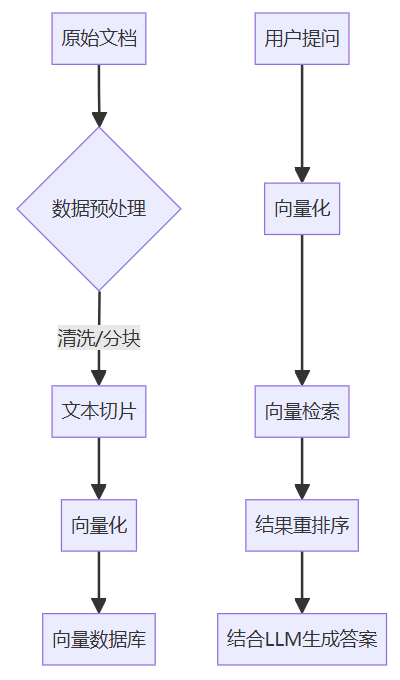
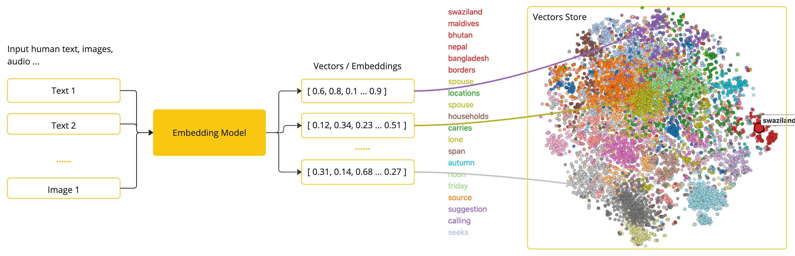
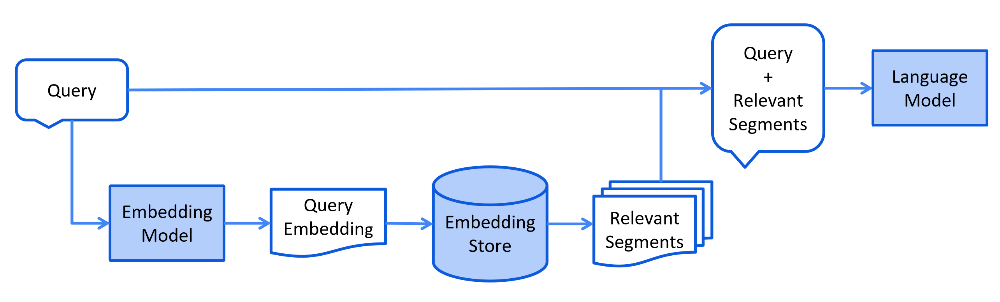

## 🤖 业务背景

随着自然语言处理技术的发展，纯生成式模型虽然已经能够生成较为流畅的文本，但在实际业务中仍然存在两个典型问题：

- **知识局限性**：大模型的知识主要来源于训练数据，通常建立在互联网上的公开语料之上。对于实时性、私有化或离线场景中的知识，模型本身往往无法直接掌握。
- **幻觉问题**：大模型的生成本质上仍然是概率计算。当模型缺少某个领域知识，或者面对自己并不擅长的问题时，就可能一本正经地输出错误结论。

---

## 📘 什么是 RAG

**RAG（Retrieval-Augmented Generation，检索增强生成）** 是一种将 **信息检索（Retrieval）** 与 **文本生成（Generation）** 结合起来的 AI 方法，主要目标是提升大语言模型（LLM）的知识覆盖范围与回答准确性。

可以把它理解成这样：**模型在回答问题之前，先去外部知识库中检索相关内容，再结合检索结果生成最终回答，而不是完全依赖自身参数里的旧知识。**

RAG 的核心价值主要体现在两个方面：

- **检索**：根据用户输入，从外部知识库中检索与问题相关的文本片段，通常依赖文本向量化和向量数据库完成语义匹配。
- **增强生成**：将检索到的知识作为上下文输入给大模型，让模型基于更准确、更贴近问题的信息生成答案，从而减少误导性输出。

---

## 🧭 核心流程

RAG 的完整流程通常可以拆成 5 个核心阶段：

- **数据准备**：清洗原始文档，并进行分块处理，例如把 PDF、Word 或网页文本切成可检索的片段。
- **文本向量化**：使用嵌入模型（如 BERT、BGE）将文本转换为向量表示。
- **索引存储**：将生成的向量写入向量数据库，例如 Milvus、Faiss、Elasticsearch。
- **检索增强**：用户提问后，先把问题向量化，再检索相关文档片段。
- **生成答案**：把检索结果与用户问题一起送给大模型，生成最终回答。

  

进一步抽象后，RAG 也可以理解成三个阶段：**索引、检索、生成**。

  

### 🗂️ 索引阶段

在索引阶段，系统会先对原始文档进行解析，然后拆分为多个较小的文本块。接着，这些文本块会经过嵌入模型处理，转换成向量并存入向量数据库，为后续语义检索提供基础。



嵌入模型、文本向量化与向量数据库可以这样理解：

- **嵌入模型**：把词、短语或句子转换成数值向量的工具，这些向量会尽可能保留文本的语义信息。例如在识物探趣项目中，使用的嵌入模型是 **bge-small-zh-v1.5**，向量维度为 **512**。
- **文本向量化**：把文本映射到高维空间中。语义相近的内容在空间中距离更近，语义差异较大的内容距离更远。
- **向量数据库**：专门用于存储和管理高维向量的数据库，适合对文本、图片、音频等非结构化数据进行相似性搜索。



  

### 🔍 检索阶段

检索阶段会先把用户问题通过嵌入模型转换为向量，再与向量数据库中的知识向量进行相似度比对。系统会从中找出最匹配的前 `K` 条结果，作为后续生成阶段的参考上下文。

### ✨ 增强生成阶段

增强生成阶段会把用户问题与检索到的相关文本块进行组合，再通过提示工程（Prompt Engineering）组织成适合模型理解的输入格式。大模型在拥有外部知识上下文之后，就能输出更准确、更贴近问题的回答。

  

---

## 🚀 优化策略

### 🧩 索引阶段的优化

#### ✂️ 分块策略

分块的本质，是把原始长文本拆成若干个较小但语义相对完整的片段。每个片段通常控制在几百字到上千字之间，比如一个段落、若干段落，或者一个小节。

之所以要分块，主要有几个原因：

- **模型上下文长度有限**：长文本无法一次性完整送入模型，拆分后更容易被处理。
- **便于精准定位信息**：用户问题通常只关心文档中的某一小部分内容，分块后能更快检索到相关片段。
- **兼顾上下文与检索效率**：块太大，检索不精准；块太小，上下文可能断裂。合理分块能在效果和效率之间取得平衡。

所以，分块本质上就是把输入文档切成多个粒度可控的语义单元，方便后续的向量检索与生成模块高效协作。

常见的分块策略包括：

- **自然结构分块**：按原始文档中的标题、段落、空行、章节编号等自然结构切分。
- **固定大小分块**：按固定字符数、词数或 Token 数均匀切分，实现简单。
- **滑动窗口分块**：相邻块之间保留一定重叠，减少上下文断裂。
- **递归分块**：先粗分，再对超长部分继续细分，适合结构复杂的文档。
- **语义分块**：利用 NLP 模型判断语义边界，尽量让每个块保持完整语义。

#### 🧠 选取合适的嵌入模型

选择嵌入模型时，通常需要重点考虑以下因素：

- **语义准确性**：模型能否准确捕捉长句、上下文关系和同义表达，直接影响检索质量。
- **模型效率**：推理速度、显存占用和部署成本是否满足业务要求。
- **领域适配性**：是否对医疗、金融、法律等垂直领域做过优化，能否理解专业术语。
- **多语言支持**：是否覆盖业务需要的语言，以及跨语言语义对齐能力是否足够。
- **数据规模匹配**：模型大小与训练数据规模是否匹配当前业务复杂度。

一些典型取舍如下：

- **轻量模型**：如 MiniLM、DistilBERT，速度快，更适合在线问答。
- **重型模型**：如 BERT-large 或更大的 Embedding 模型，表达能力强，更适合离线批处理。
- **领域模型或微调方案**：适合对专业术语理解要求较高的场景，也可以通过 LoRA 等方式做轻量适配。

### 🔎 检索阶段的优化

#### 🥇 进行重排序

Rerank 指的是对初步检索得到的候选文档再次排序。

初步检索的目标通常是**在海量文档中快速筛出一批大致相关的候选结果**，所以它更偏向效率，准确性并不是最高。Rerank 则会对这些候选结果做进一步精排，挑出最匹配的问题上下文，再交给大模型使用。

它的典型流程如下：

- **生成候选文档**：先通过向量检索或传统检索得到一批候选结果。
- **执行重排序**：使用 Rerank 模型对候选结果重新计算匹配得分。
- **选取 Top-K**：保留最相关的若干条结果，作为最终生成阶段的输入。

### 🛠️ 生成阶段的优化

#### 📝 提示词优化

高质量的提示词设计，可以显著提升 RAG 的最终效果。常见做法包括：

- **明确角色与任务**：清晰说明模型身份、能力边界与回答目标，例如要求模型只能基于提供资料作答。
- **结构化组织输入**：将提示拆成“背景 + 问题 + 输出格式”之类的清晰结构。
- **加入上下文约束**：明确禁止模型脱离检索内容自由发挥，减少幻觉。
- **设置兜底机制**：如果没有检索到相关资料，就要求模型明确返回“未找到相关内容”。

#### 🔄 查询重写

查询重写是利用 LLM 从不同角度改写用户问题，生成多个语义相近但表达不同的查询，从而提高召回效果。

#### 🎯 多查询检索后的重排序

当系统通过多查询方式召回更多候选内容后，通常还需要结合 Rerank 再做一次排序，以保证最终送入模型的上下文足够相关。

---

## ✅ 小结

RAG 的核心价值，不是简单地“给大模型加个数据库”，而是通过 **检索能力 + 上下文增强 + 生成能力** 的协同，解决大模型在知识实时性、准确性和可控性上的不足。

如果从工程视角来看，RAG 的效果往往取决于三个关键点：

- **索引是否合理**：文档切分与向量化质量决定了知识底座的可用性。
- **检索是否精准**：召回策略与重排序决定了模型能看到什么信息。
- **生成是否可控**：提示词设计与上下文约束决定了最终答案的稳定性。
