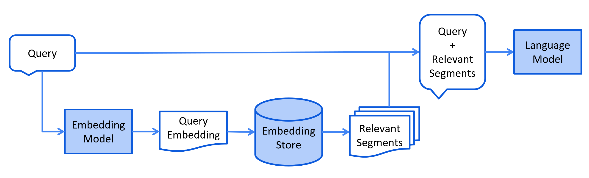

## RAG的业务场景

随着自然语言处理技术的发展，纯生成模型虽然可以生成流畅的文本，但是存在以下问题。

- **知识的局限性** ：大模型自身的知识完全源于它的训练数据，基本都是构建于网络公开的数据，对于一些实时性的、非公开的或离线的数据是无法获取到的，这部分知识也就无从具备。
- **幻觉问题**： 所有的 AI 大模型的底层原理都是基于数学概率，其模型输出实质上是一系列数值运算，大模型也不例外，所以它有时候会一本正经地胡说八道，尤其是在大模型自身不具备某一方面的知识或不擅长的场景。

## 什么是RAG

**RAG（检索增强生成，Retrieval-Augmented Generation）** 是一种结合 **信息检索（Retrieval）** 和 **文本生成（Generation）** 的 AI 方法，主要用于 **提高大语言模型（LLM）的知识覆盖范围和回答准确性**。**个人理解为RAG 让 AI 在回答问题时，先从外部知识库中检索相关信息，再结合检索到的内容生成最终回答，而无需重新训练模型** 这样可以减少 AI 依赖自身训练数据的局限性，并提供最新、准确的信息。

- **检索** ：基于用户的输入，从外部知识库中检索与查询相关的文本片段，通常使用向量化表示和向量数据库进行语义匹配。
- **增强生成** ：将检索到的知识送给大语言模型以此来优化大模型的生成结果 ，使得大模型在生成更精确、更贴合上下文答案的同时，也能有效减少产生误导性信息的可能。

## RAG的流程

RAG（检索增强生成）的完整流程可分为5个核心阶段

- **数据准备**：清洗文档、分块处理（如PDF转文本切片）；
- **向量化**：使用嵌入模型（如BERT、BGE）将文本转为向量；
- **索引存储**：向量存入数据库（如Milvus、Faiss、Elasticsearch）；
- **检索增强**：用户提问向量化后检索相关文档；
- **生成答案**：将检索结果与问题组合输入大模型生成回答。

可以简化为三个阶段（索引-检索-生成）

### 索引阶段

在索引阶段，对原始文档进行解析，并将其拆分成多个较小的文本块。随后，这些文本块会通过嵌入模型进行向量化处理，生成的向量将被存储在向量数据库中，供后续检索使用。



嵌入模型，文本向量化，向量数据库

- 嵌入模型：**将文本数据（如词汇、短语或句子）转换为数值向量（文本向量化）的工具** ，这些向量捕捉了文本的语义信息，可用于各种自然语言处理（NLP）任务。例如在识物探趣项目中使用嵌入模型为 **bge-small-zh-v1.5**（向量维度为 **512** ）

- 文本向量化： **将文本映射到高维空间中的点，使语义相似的文本在这个空间中距离较近。** 例如，“猫”和”狗”的向量可能会比”猫”和”汽车”的向量更接近。总而言之，**语义相近的对象在向量空间中彼此邻近，而语义相异的对象则相距较远。**

- 向量数据库：专门设计用来存储和管理嵌入向量的数据库系统。它可以将非结构化数据(如文本、图片、音频等)转换成高维向量的形式进行存储，并提供高效的相似性搜索功能。



### 检索阶段

将用户的查询通过嵌入模型转换成向量 ，以便与向量数据库中存储的知识相关的向量进行比对。通过语义相似度匹配，从向量数据库中找出最匹配的前 K 个数据。

### 增强生成阶段

系统将用户查询与检索到的相关文本块进行组合，通过提示工程（Prompt Engineering）设计适当的输入格式，将用户的查询内容和检索到的相关知识 一起嵌入到一个预设的提示词模板，将经过检索增强的提示词内容输入到大语言模型中，以此生成所需的输出。

## RAG的优化策略

### 索引阶段的优化策略

#### 分块策略

分块就是把原始长文本（比如一本书、一篇论文）拆成若干个 **“小块”**（通常几百字到上千字，比如500-1000字），每个小块包含**相对完整的语义单元**，比如一个段落、几个段落或一个小节。

为什么需要分块

- **模型处理能力限制**：大语言模型一次能处理的文本长度有限，太长的文本塞进去会“消化不良”，分块后每个小块能塞进模型的“肚子”里。
- **精准定位信息**：用户提问通常针对局部内容，分块后每个小块像“信息卡片”，检索时能快速找到最相关的卡片，避免在整本大书里“大海捞针”。
- **平衡上下文与效率**：小块既能保留足够上下文（比如前后句子的逻辑），又能让计算机高效存储和检索（小块的向量计算更快）。

所以分块就是将输入文档或大段文本切分成多个较小的、可控粒度的“块”，以便后续的向量化检索和生成模块高效调用与组合。

常见的分块策略

- **自然结构分块** ：按文档原有格式拆分，比如遇到标题、空行、章节编号、标点符号分块。
- **固定大小分块** ：将文本按固定字符数、词数或 token 数等均匀切分，简单易实现。
- **滑动窗口分块** ：在固定大小基础上为相邻的块保留一定重叠，以减少上下文出现断裂
- **递归分块** ：先按段落/章节粗分，超长部分再递归细化（按句子或空行），适合复杂文档。
- **语义分块** ：用 NLP 模型（如 BERT、GPT）判断文本语义边界，确保每个块是完整的语义单元（比如一个论点、一个案例）。

#### 选取合适的嵌入模型

选择嵌入模型的时候主要考虑以下因素

- **语义准确性**：模型能否精准捕捉文本语义（比如长句理解、上下文关联、同义词区分），直接影响向量相似度计算的可靠性。
  - 部分模型擅长短文本（如 Sentence-BERT），但长文本下会丢失上下文。
  - 通用模型（如 text-embedding-ada-002）在专业领域可能“词不达意”（比如“主诉”在医疗文本中是专有名词，通用模型可能理解为“主要诉求”）
- **模型效率**：推理速度是否满足业务实时性要求（比如 QPS 高的场景不能用太大的模型），显存/内存占用是否适配硬件资源。
  - 轻量级模型（如 MiniLM、DistilBERT）速度快（毫秒级/句），适合实时问答；
  - 重型模型（如 BERT-large、GPT-4 Embedding）速度慢（秒级/句），适合离线批量处理。
- **领域适配**：是否针对垂直领域做过预训练或微调，原生支持特定术语和逻辑（比如金融模型懂“PE 估值”，通用模型可能误解为“体育器材”）。简而言之就是让模型懂行话
  - 直接选领域专用模型
  - 用通用模型+领域数据微调（适合有私有语料的场景，比如用公司内部客服对话数据微调）
  - 添加领域适配器（如 LoRA 技术，在不改变原模型的前提下，新增少量参数适配领域）。
- **多语言支持**：是否支持业务所需语言（尤其是小语种），以及跨语言对齐能力（比如中英混合文本能否正确嵌入）。
- **数据规模匹配**：模型参数量和训练数据规模是否匹配你的语料复杂度（小数据用大模型可能过拟合，大数据用小模型可能语义坍缩）

### 检索阶段的优化策略

#### 进行重排序

Rerank 是一个对初步检索返回的候选文档列表进行再次排序的过程。因为初步检索需要**快速地在海量的文档中**找出大致相关的文档，其需要考虑效率，所以查找出的文档不会非常准确，这步是**粗排**。在已经筛选的相关的文档中再进行精筛，找出匹配度更高的文档让其排在前面，选其中的 Top-K 然后扔给大模型，提高答案的准确性，这就是 Rerank，也是**精排**。

- **初步检索生成候选文档**：使用速度较快的传统检索方法获得一组候选文档。
- **根据Rerank模型重新排序**：根据Rerank模型匹配得分对候选文档进行排序，选出最相关的 Top-K 文档。
- **交给生成模块**：Top-K 候选文档传递给大模型，帮助生成更精准、更富信息量的回答。

### 增强生成阶段的优化策略

#### 提示词优化

设计合适的提示词可以提高RAG的效果

- **明确角色和任务**：提示中要清楚说明 AI 的身份、能力边界和目标任务。比如“你是一个专业法律助手，只能基于提供的材料回答问题”，可以有效限制模型的自由发挥。
- **结构化提示**：用明确的格式指导 AI 输出，比如：“背景 + 问题 + 输出格式”。
- **加上下文约束**：明确告知 AI 只能基于检索到的资料回答，避免“幻觉”。
  - 提示中明确“不要使用自己的知识推断”。
- **加入冗余兜底机制**：如没检索到相关内容，就让 AI 显式回复 “未找到相关资料”
  - 在 prompt 中加入 “如果找不到资料，请回复‘未找到相关内容’”。

#### 查询重写

利用 LLM 从不同视角生成多个查询，优化用户输入

#### 多查询检索时进行重排序

采用类似检索阶段的重排序策略