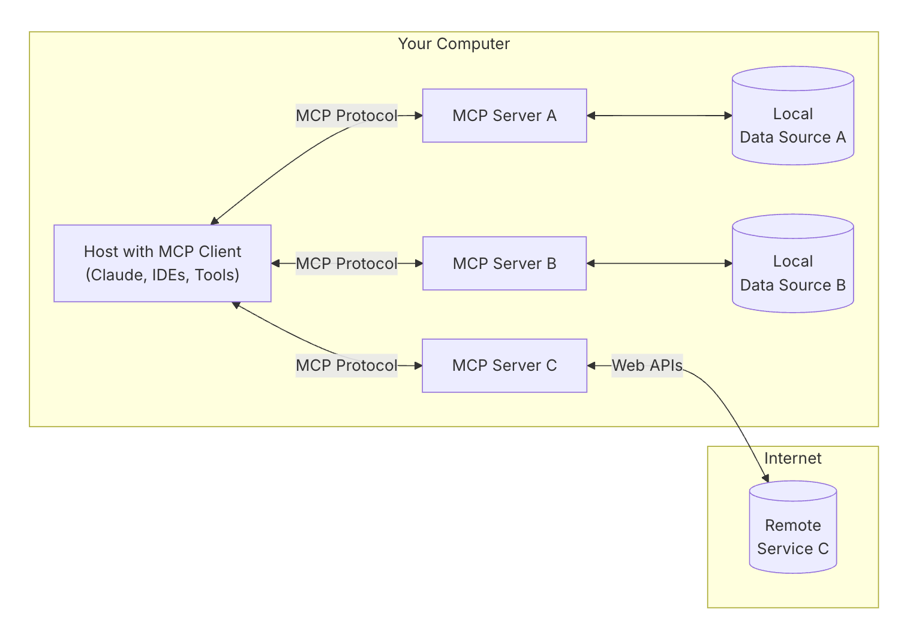
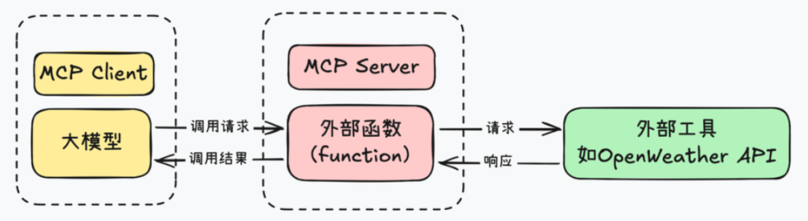

## LLM的一些缺陷
- 市面上的LLM大部分是基于网络上通用知识训练得来的，缺乏对垂直领域相关的知识，类似一个盲目自信的人对于不了解不理解的问题也会编造一些内容（ **幻觉** 问题）
- LLM的知识不具备实时性，例如向LLM询问今天的天气时LLM无法给出正确答案
- LLM无法主动从网络等各种来源主动获取知识，即LLM目前只能作为 **规划者** 而无法成为 **执行者**

## 传统解决方案——函数调用

Function-Call于2023年由OpenAI提出。在此之前，LLM 主要通过自然语言回答问题，无法直接执行 API 调用或插件交互。这一机制的核心在于  **模型能够以结构化的 JSON 格式输出函数参数** 。

工作流程如下

- 模型识别用户输入的意图判断是否需要使用Function-Call
- 模型生成一个结构化的JSON对象来包装函数的相关参数并转发到应用程序的对应函数中
- 应用程序执行函数并将结果返回给模型
- 模型将应用程序返回的结果进行整理并以自然语言整理出最终回答、

但是 function call 也有其局限性，重点在于function call 平台依赖性强，不同 LLM 平台的 function call API 实现差异较大。例如，OpenAI 的函数调用方式与 Google 的不兼容，开发者在切换模型时需要重写代码，增加了适配成本。

## MCP协议是什么

MCP全称模型上下文协议，是由Claude公司推出的标准化LLM与外部数据源与工具的交互形式。跳转[官方文档](https://modelcontextprotocol.io/introduction)

引用Claude对此的描述

> MCP is an open protocol that standardizes how applications provide context to LLMs. Think of MCP like a USB-C port for AI applications. Just as USB-C provides a standardized way to connect your devices to various peripherals and accessories, MCP provides a standardized way to connect AI models to different data sources and tools.

MCP（模型上下文协议）是一种开放协议，它对应用程序向大语言模型（LLM）提供上下文的方式进行了标准化。可以把 MCP 想象成人工智能应用程序的 USB-C 接口。就像 USB-C 接口为将设备连接到各种外围设备和配件提供了一种标准化的方式一样，MCP 也为将人工智能模型连接到不同的数据源和工具提供了一种标准化的方式。

可以从以下角度理解MCP协议

- MCP协议类似于一个人工智能应用程序的拓展坞，通过拓展坞可以以标准化的形式将LLM连接到各种外部工具和数据源
- 同时也可以将MCP协议理解为Function-Call的标准化和优化，MCP协议依然是建立在Function-Call的基础上的

## MCP协议相较于Function-Call的改进

- **Tool** ：基于Function-Call实现对外部工具的调用，使得模型可以进行具体的操作
  - 服务器定义好工具（比如“计算两点距离”或者“发个邮件”），客户端发现这些工具后，LLM 就能根据需要调用。调用完结果会返回给 LLM，继续推理或者输出。

- **Resource** ：LLM可以读取的数据，比如文件内容、数据库查询结果或API的响应
  - 服务器（MCP Server）把这些数据暴露出来，客户端（比如 LLM 应用）可以读取它们，然后塞进模型的上下文里去推理或者生成内容。

- **Prompt** ：服务器提供给AI的预写消息或模板，帮助AI理解如何使用资源和工具
  - 服务器定义好一堆 Prompt 模板（比如“写个产品描述”或者“调试错误”），客户端可以直接选一个，填入参数，然后丢给 LLM 执行。

## MCP的相关概念

### 核心架构

MCP 遵循客户端-服务器架构，所有传输都使用 [JSON-RPC](https://www.jsonrpc.org/) 2.0 来交换消息。

- **主机** ：启动连接的 LLM 应用程序
- **客户端** ：嵌入在主机内，在主机应用程序内与服务器保持一比一连接
- **服务器** ：连接到具体的数据源或工具，向客户端提供资源、工具和提示
  - 资源（Resources）：类似文件的数据，可以被客户端读取，如 API 响应或文件内容。
  - 工具（Tools）：可以被 LLM 调用的函数（需要用户批准）。
  - 提示（Prompts）：预先编写的模板，帮助用户完成特定任务。
- **资源** ：服务器可以访问到的资源
  - **本地资源** : MCP 服务器可以安全访问的计算机资源（数据库、文件、服务）
  - **远程职业** : MCP 服务器可以连接到的互联网上可用的资源（API）

### 工作流程

- 初始化：主机应用程序启动并初始化客户端，每个客户端与一个服务器建立连接。
- 功能协商：客户端和服务器之间进行功能协商，确定它们可以相互提供哪些功能和服务。
- 请求处理：客户端根据用户请求或AI模型的需要，向服务器发送请求。服务器处理这些请求，并可能与本地或远程资源进行交互。
  - 将用户的查询连同工具描述通过 function calling一起发送给 LLM。
  - LLM 决定是否需要使用工具以及使用哪些工具。
  - 如果需要使用工具，MCP client 会通过 MCP server 执行相应的工具调用。
- 响应返回：服务器将处理结果返回给客户端，客户端再将信息传递回主机应用程序。