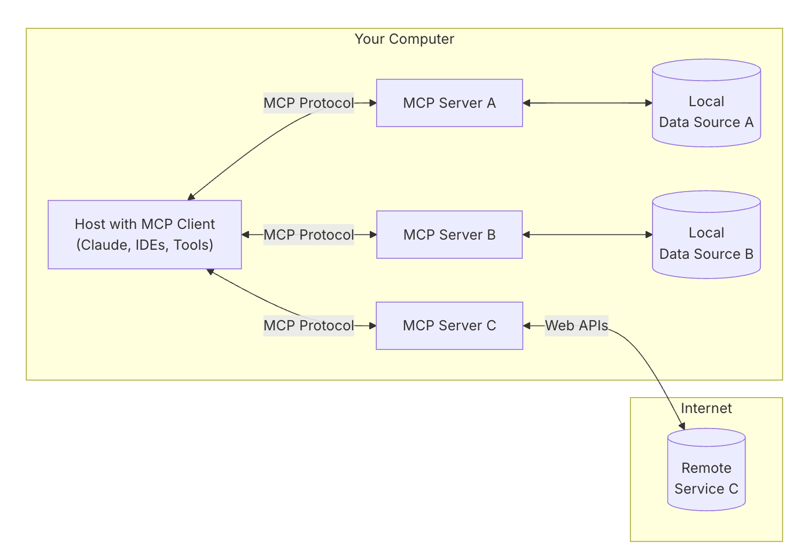
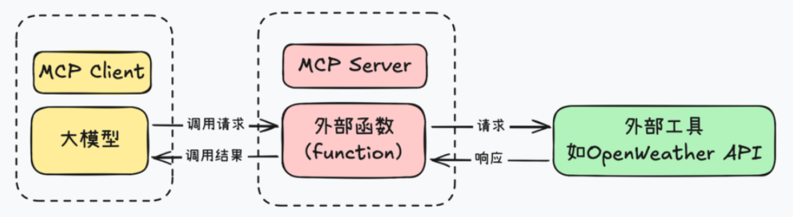

## 🤔 LLM 的典型局限

在真正落地业务场景时，LLM 虽然已经具备很强的理解和生成能力，但仍然有几个明显短板：

- **知识覆盖有限**：大多数 LLM 基于公开语料训练，对垂直领域知识掌握不足，遇到不熟悉的问题时容易出现“看起来很自信、实际上不准确”的回答。
- **知识缺乏实时性**：模型的知识停留在训练阶段，无法天然知道“今天”的天气、最新政策或最新业务数据。
- **缺少主动执行能力**：LLM 更像一个“规划者”，能够理解和推理，但如果没有外部工具配合，它本身无法主动读取文件、访问网络或执行系统操作。

---

## 🧰 传统方案：函数调用

Function Call 于 **2023 年** 由 OpenAI 推出。在此之前，LLM 主要只能通过自然语言回答问题，无法直接触发 API 调用或插件交互。Function Call 的关键能力在于：**模型能够以结构化 JSON 的形式输出函数参数，再交由应用程序执行对应逻辑。**

一个典型流程如下：

- **识别意图**：模型根据用户输入判断是否需要调用函数。
- **生成参数**：模型输出结构化 JSON，用于描述目标函数及其参数。
- **应用执行**：业务程序接收参数后调用本地函数或外部接口。
- **结果回传**：函数执行结果再返回给模型，由模型整理成自然语言回答。

虽然 Function Call 非常重要，但它也存在明显局限：

- **平台依赖性强**：不同 LLM 平台对 Function Call 的实现差异较大。
- **迁移成本高**：从一个模型平台切换到另一个平台时，通常需要重写适配逻辑。
- **生态不统一**：工具描述、参数约定和交互方式都可能不一致，难以形成统一标准。

---

## 🔌 MCP 是什么

MCP 全称是 **Model Context Protocol（模型上下文协议）**，它由 Anthropic 推出，目标是为 LLM 与外部数据源、工具之间的交互提供一种更标准化的方式。官方文档见：[MCP Introduction](https://modelcontextprotocol.io/introduction)。

官方对 MCP 的描述是：

> MCP is an open protocol that standardizes how applications provide context to LLMs.

可以把 MCP 理解成 AI 应用的 **USB-C 接口**。就像 USB-C 让不同设备可以通过统一标准连接各种外设一样，MCP 也希望让不同模型、不同工具、不同数据源之间通过统一协议协作。

从工程角度看，MCP 的价值在于：

- **统一连接方式**：让模型以一致的方式接入工具、资源和上下文，而不是每个平台都单独定制一套接入协议。
- **增强模型能力**：模型不仅能“思考”，还可以借助外部系统去读取文件、调用服务、获取实时数据。
- **提升系统可维护性**：协议统一之后，组件之间的职责边界会更清晰，适配和维护成本也更低。

如果用一句话总结：**MCP 不是替代 Function Call，而是在它之上进一步标准化模型与外部能力的协作方式。**

---

## 🧩 MCP 相比 Function Call 带来了什么

MCP 的核心改进，可以从三个能力对象来理解：

- **Tool**：可供模型调用的外部工具。
  - 服务器定义好工具，例如“发送邮件”“计算距离”“执行查询”等，客户端发现这些工具后，LLM 就可以在合适时机发起调用，结果再返回给模型继续推理。
- **Resource**：可供模型读取的数据资源。
  - 这类资源可以是文件内容、数据库结果、API 响应等。客户端会把这些资源作为上下文提供给模型使用。
- **Prompt**：由服务器提供的提示词模板。
  - 服务器可以预先定义 Prompt 模板，例如“生成产品描述”“排查报错”“总结会议纪要”等，客户端按模板填参后交给模型执行。

从这个角度看，MCP 不只是“让模型会调函数”，而是把 **工具、资源、提示词模板** 都纳入了统一的协议体系中。

---

## 🏗️ 核心架构与运行方式

### 🏛️ 核心架构

MCP 采用 **客户端 - 服务器架构**，通信层通常使用 [JSON-RPC 2.0](https://www.jsonrpc.org/) 来交换消息。

  

架构中的关键角色如下：

- **主机（Host）**：发起连接的 LLM 应用程序，例如聊天客户端、IDE 插件或 Agent 框架。
- **客户端（Client）**：嵌入在主机中，负责与 MCP Server 建立并维护连接。
- **服务器（Server）**：对接具体的数据源或工具，向客户端暴露能力。
  - **Resources**：类似文件、接口响应、数据库查询结果这样的可读资源。
  - **Tools**：可被 LLM 调用的函数式能力，通常需要用户授权。
  - **Prompts**：预定义的提示模板，帮助用户更高效地完成特定任务。
- **资源来源**：既可以是本地资源，也可以是远程资源。
  - **本地资源**：数据库、文件、服务等本机可访问对象。
  - **远程资源**：互联网上的 API、远端服务或其他在线能力。

### 📡 传输模式

MCP 常见有两种运行模式：

- **Stdio 模式**：通过标准输入输出流通信，是最常见的本地部署方案。实现简单，适合同机进程间交互，也避免了额外网络开销。
- **SSE 模式**：通过服务器发送事件（Server-Sent Events）通信，更适合远程部署场景，尤其是需要通过 HTTP 与多个客户端交互时。

---

## 🔄 MCP 的工作流程

  

一个典型的 MCP 请求大致会经过以下步骤：

- **初始化**：主机启动并初始化 MCP Client，每个 Client 与一个 MCP Server 建立连接。
- **能力协商**：Client 和 Server 先确认彼此支持的功能、资源和工具。
- **请求处理**：Client 根据用户请求或模型推理结果，决定是否向 Server 发起资源读取或工具调用。
- **模型决策**：LLM 根据上下文和工具描述，判断是否需要调用工具，以及该调用哪些能力。
- **执行调用**：MCP Server 负责真正执行工具逻辑，或读取本地 / 远程资源。
- **结果整合**：调用结果返回给模型，由模型将新信息与原问题一起整合，形成最终答案。
- **响应返回**：最终结果再由 Client 传回主机应用程序。

如果从 Agent 视角理解，MCP 的意义在于：**模型不再只是“知道很多”，而是开始具备“按协议接入外部世界”的能力。**

---

## 🔐 安全性设计

MCP 的安全设计主要体现在以下几个方面：

- **用户授权与控制**：模型访问工具、资源和提示词时，通常需要经过用户同意。主机负责权限管理和交互确认，避免模型在用户不知情的情况下访问外部能力。
- **隔离与沙箱机制**：具体的工具调用被封装在 MCP Server 中，模型不会直接接触底层敏感系统，从而降低误操作和越权访问的风险。
- **传输安全与来源验证**：协议层支持对请求来源和通信过程进行校验，确保只有可信请求可以访问相应资源。

这也是 MCP 能够走向工程化的重要原因之一。它不是单纯强调“模型更强了”，而是强调 **模型能力扩展必须建立在可控、可审计、可授权的前提下**。

---

## ✅ 小结

MCP 的核心意义，在于为 LLM、工具、数据源之间建立了一套更统一的连接规范。

如果说 Function Call 解决的是“模型能不能调用函数”的问题，那么 MCP 进一步解决的是：

- **模型如何统一接入外部能力**
- **不同工具和数据源如何被标准化暴露**
- **整个调用链路如何在安全与可维护的前提下运行**

对于 Agent 系统来说，MCP 很重要，因为它让模型从“只会生成内容”的角色，逐步走向“能够读取上下文、调用工具并完成任务”的执行型智能体。
