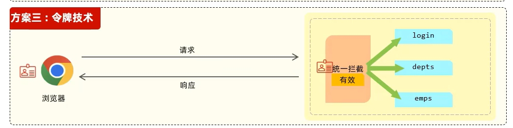

## 登录功能实现的基本思路


### 登录标记

用户登录成功之后，每一次请求中，都可以获取到该标记，

常见技术

- 会话技术

### 登录校验

对接收到的请求进行统一拦截

常见技术

- 过滤器（Filter）
- 拦截器（Interceptor）

## 登录标记

### 会话技术

用户打开浏览器，访问web服务器的资源，会话建立，直到有一方断开连接，会话结束。在一次会话中可以包含多次请求和响应。

### 会话跟踪

一种维护浏览器状态的方法，服务器需要识别多次请求是否来自于同一浏览器，以便在同一次会话的多次请求间共享数据。

会话跟踪方案

- 客户端会话跟踪技术:Cookie
- 服务端会话跟踪技术:Session
- 令牌技术

#### Cookies


基本流程

1. 浏览器第一次向服务端发出请求时服务端设置Cookies
2. 服务端给浏览器响应并设置响应头的Set-Cookie
3. 浏览器解析Cookie值并保存在浏览器本地
4. 后续的每次请求中浏览器会将Cookis数据放入请求头中

优点：HTTP协议支持的技术

缺点

- 移动端APP不支持cookie
- 不安全，用户可以自己禁用Cookie
- Cookies不能跨域



跨域被分为三个维度：协议，IP，端口，三者有一个不同就是跨域




#### Session


基本流程

1. 浏览器第一次向服务器端发出请求，此时服务器端没有Session对象
2. 服务器端生成Session对象并将Session对象放入响应的响应头（Set-Cookies）
3. 浏览器保存Session对象并在此后的每次请求中以请求头的Cookies数据附带Session对象
4. 服务器会寻找到请求Cookies中的Session对象从而实现数据共享

优点：存储在服务器端安全

缺点

- 服务器集群中无法直接使用Session技术
- Session技术基于Cookies技术，继承了Cookies的全部缺点

#### 令牌技术



基本流程

1. 浏览器发出请求后，服务端生成令牌作为身份凭证放入响应
2. 此后的每一次请求浏览器的请求携带会携带令牌
3. 服务端则会校验令牌

优点:

- 支持PC端、移动端
- 解决集群环境下的认证问题
- 减轻服务器端存储压力

## JWT令牌技术

简介：全称:jSON Web Token(https://jwt.io/) 定义了一种简洁的、自包含的格式，用于在通信双方以json数据格式安全的传输信息。由于数字签名的存在，这些信息是可靠的。

### 令牌结构

- 第一部分:Header(头)，记录令牌类型、签名算法等。
- 第二部分:Payload(有效载荷)，携带一些自定义信息、默认信息等。
- 第三部分:Signature(签名)，防止Token被篡改、确保安全性。将header、payload，并加入指定秘钥，通过指定签名算法计算而来。


### 使用场景：登录认证

1. 登录成功后服务端生成令牌，通过响应返回给客户端
2. 此后每个请求都要携带JWT令牌，服务端每次处理请求前都要校验令牌，校验通过后再处理

### 具体实现

1. 引入JWT相关依赖
2. 将JWT数字签名的相关部分放入Properties文件中以备引用
3. 书写JWT工具类的生成方法和解析方法

#### 生成JWT令牌

具体思路

1. 指定签名算法
2. 使用令牌持续时间来计算令牌的过期时间
3. 生成JWT令牌函数Jwts.builder()

示例代码

```java
/**
     * 创建jwt
     * 加密算法：HS256
     * 私钥使用jwtProperties中的userSecretKey
     * @param claims 载荷
     * @return jwt
     */
public String createJwt(Map<String, Object>claims)
    {
        String userSecretKey = jwtProperties.getUserSecretKey(); //自定义密钥
        long userTtl = jwtProperties.getUserTtl(); //令牌持续时间
        SignatureAlgorithm signatureAlgorithm = SignatureAlgorithm.HS256; //指定签名算法
        long nowMillis = System.currentTimeMillis();
        Date exp = new Date(nowMillis + userTtl); //令牌过期时间
        JwtBuilder builder = Jwts.builder() //生成JWT令牌
                .setClaims(claims) //设置载荷
                .signWith(signatureAlgorithm, userSecretKey.getBytes()) //设置数字签名（签名算法，过期时间）
                .setExpiration(exp); //设置过期时间
        return builder.compact();
    }
```

#### 解析JWT令牌

示例代码

```java
 /**
     * 解密jwt
     * @param token jwt
     * @return jwt中的数据
     */
    public Claims parseJwt(String token)
    {
        //获取jwtProperties中的userSecretKey
        String userSecretKey = jwtProperties.getUserSecretKey();
        return Jwts.parser()
                .setSigningKey(userSecretKey.getBytes(StandardCharsets.UTF_8))
                .parseClaimsJws(token)
                .getBody();
    }
```

## 登录校验

### 	过滤器（Filter）

### 	拦截器（interceptor）

