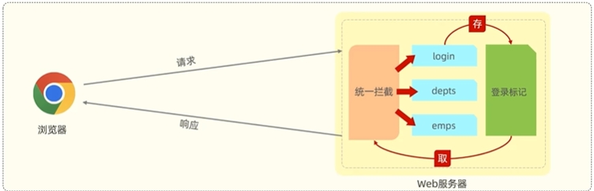
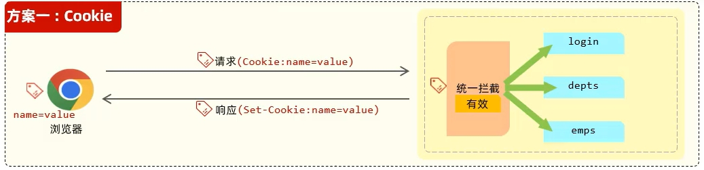
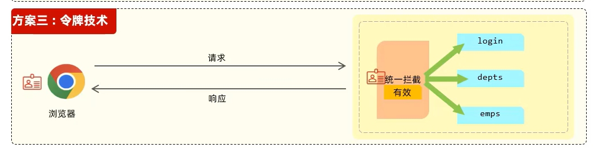
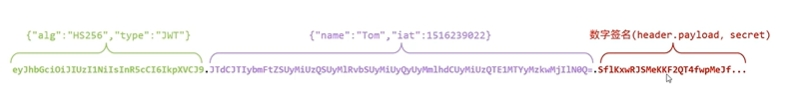
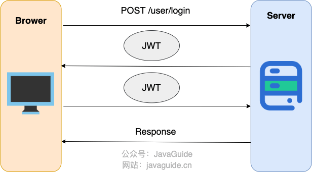

## 登录功能实现的基本思路


### 登录标记

用户登录成功之后，每一次请求中，都可以获取到该标记，

常见技术

- 会话技术
- JWT令牌

### 登录校验

对接收到的请求进行统一拦截

常见技术

- 过滤器（Filter）
- 拦截器（Interceptor）

## 登录标记

### 会话技术

用户打开浏览器，访问web服务器的资源，会话建立，直到有一方断开连接，会话结束。在一次会话中可以包含多次请求和响应。

### 会话跟踪

一种维护浏览器状态的方法，服务器需要识别多次请求是否来自于同一浏览器，以便在同一次会话的多次请求间共享数据。

会话跟踪方案

- 客户端会话跟踪技术：Cookie
- 服务端会话跟踪技术：Session

#### Cookie



什么是 **Cookie**

**Cookie** 是存储在用户浏览器端的一个小型数据文件，用于跟踪和保存用户的状态信息。

主要用于保持用户登录状态、跟踪用户行为、存储用户偏好等。

**存储在浏览器端**。


**基本流程**

1. 浏览器第一次向服务端发出请求时服务端设置 **Cookie**
2. 服务端给浏览器响应并设置响应头的 **Set-Cookie**
3. 浏览器解析 **Cookie** 值并保存在浏览器本地
4. 后续的每次请求中浏览器会将 **Cookie** 数据放入请求头中

**优点**：HTTP协议支持的技术

**缺点**

- 移动端APP不支持 **Cookie**，
  - 状态管理： **Session** 基于服务器端的状态管理，而移动端应用通常是无状态的。移动设备的连接可能不稳定或中断，因此难以维护长期的会话状态。如果使用 **Session** 进行身份认证，移动应用需要频繁地与服务器进行会话维护，增加了网络开销和复杂性;
  - 兼容性:：移动端应用通常会面向多个平台。每个平台对于 Session 的管理和存储方式可能不同，可能导致跨平台兼容性的问题;
  - 安全性：移动设备通常处于不受信任的网络环境，存在数据泄露和攻击的风险。将敏感的会话信息存储在移动设备上增加了被攻击的潜在风险。

- 不安全，用户可以自己禁用 **Cookie**
- Cookie不能跨域



跨域被分为三个维度：协议，IP，端口，三者有一个不同就是跨域




#### Session


什么是 **Session**

**Session** 是服务器端保存用户状态的机制，每个用户会话都有一个唯一的 Session ID。

主要用于跟踪用户在服务器上的状态信息，例如登录状态和购物车内容。

**存储在服务器端**，然后对应的 Session ID 通过 Cookie 保存在客户端浏览器中。


**基本流程**

1. 浏览器第一次向服务器端发出请求，此时服务器端没有 **Session** 对象
2. 服务器端生成 **Session** 对象并将 **Session** 对象的 **ID** 放入响应的响应头（Set-Cookies）
3. 浏览器保存 **Session** 对象并且此后浏览器的每次请求中以请求头的 **Cookie** 数据附带 **Session** 对象以维持会话状态
4. 服务器会寻找到请求 **Cookie** 中的 **Session** 对象从而实现数据共享

**优点** ：存储在服务器端更加安全

**缺点**

- 服务器集群中无法直接使用 **Session** 技术
- **Session** 技术基于**Cookie** 技术，继承了Cookie的全部缺点

#### 令牌技术



基本流程

1. 浏览器发出请求后，服务端生成令牌作为身份凭证放入响应
2. 此后的客户端每一次的请求会在请求头（通常是 **`Authorization`** 头）携带令牌
3. 服务端则会该令牌的有效性以进行用户身份验证

优点:

- 支持PC端、移动端
- 解决集群环境下的认证问题
- 减轻服务器端存储压力

## Session-Cookie 方案


- 用户向服务器发送用户名、密码、验证码用于登陆系统。
- 服务器验证通过后，服务器为用户创建一个 **`Session`**，并将 **`Session`** 信息存储起来。
- 服务器向用户返回一个 **`SessionID`**，写入用户的 **`Cookie`** 。
- 当用户保持登录状态时，**`Cookie`** 将与每个后续请求一起被发送出去。
- 服务器可以将存储在 **`Cookie`** 上的 **`SessionID`** 与存储在内存中或者数据库中的 **`Session`** 信息进行比较，以验证用户的身份，返回给用户客户端响应信息的时候会附带用户当前的状态

## JWT令牌技术

简介：**JSON Web Token**(https://jwt.io/) 定义了一种简洁的、自包含的格式，用于在通信双方以json数据格式安全的传输信息。由于数字签名的存在，这些信息是可靠的。

### 令牌结构

- **Header** (头)：描述 JWT 的元数据，定义了生成签名的算法以及 **`Token`** 令牌的类型。**Header** 被 Base64Url 编码后成为 JWT 的第一部分。
  - **`typ`**（Type）：令牌类型。
  - **`alg`**（Algorithm）：签名算法。

- **Payload**(有效载荷)：携带所传递的数据。**Payload** 被 Base64Url 编码后成为 JWT 的第二部分。
- **Signature** (签名)：防止Token被篡改、确保安全性。服务器通过 **Payload**、**Header** 和一个密钥(Secret)使用 **Header** 里面指定的签名算法（默认是 HMAC SHA256）生成。生成的签名会成为 JWT 的第三部分。
  - Header + Payload
  - 存放在服务端的密钥(一定不要泄露出去)。
  - 签名算法。




### 优点

- **自包含**： **JWT** 中包含了所有必要的信息，因此在验证时不需要查询数据库，提升了性能。
- **跨语言**：由于 **JWT** 是基于JSON的，几乎所有编程语言都支持它的生成和解析。
- **无状态** ：**JWT** 自身包含了身份验证所需要的所有信息，因此，我们的服务器不需要存储 JWT 信息。这显然增加了系统的可用性和伸缩性，大大减轻了服务端的压力。



**JWT与Session的对比**

- **无状态认证**：**JWT** 通常用于无状态认证，即服务器不存储会话数据。相比之下，**Session** 认证通常需要服务器存储用户的会话信息。
- **扩展性**：由于 **JWT** 不依赖服务器存储，因此在分布式系统中更具扩展性。**Session** 认证在多服务器环境中需要依赖共享存储或会话粘性（Session Stickiness），从而增加了系统复杂度。

**拓展知识：如何废除一个未过期的令牌**

因为  **JWT**  是无状态的，一般服务器并不保存已签发的  **JWT** ，所以服务器无法主动撤销一个已经签发的  **JWT** 。

不过可以通过以下思路实现

- **使用黑名单（Blacklist）**
  - **实现思路**：在服务器端维护一个黑名单（或者叫作废列表），该列表包含所有已被废除的  **JWT**  标识符（通常使用  **JWT**  的`jti`声明）。每次服务器验证  **JWT**  时，除了验证签名和其他标准信息外，还需要检查该  **JWT**  是否在黑名单中。
  - **优点**：可以精确废除特定的  **JWT** ，不影响其他合法的  **JWT** 。
  - **缺点**：需要在服务器端存储和管理黑名单，违背了  **JWT**  的无状态特性，增加了系统复杂度。如果黑名单列表变大，查询效率可能成为问题。
- **使用版本控制（Token Versioning）**
  - **实现思路**：在用户信息中引入一个“Token 版本号”的字段，每次生成  **JWT**  时，将这个版本号作为  **JWT**  的一部分（可以放在 Payload 的自定义声明中）。当需要废除某个用户的  **JWT**  时，只需将用户的版本号递增。在服务器验证  **JWT**  时，检查  **JWT**  中的版本号与用户当前的版本号是否匹配，若不匹配，则视为无效。
  - **优点**：无需维护黑名单，可以较容易地废除特定用户的所有  **JWT** 。
  - **缺点**：在多用户、多设备情况下，如果一个设备上的  **JWT**  被废除，所有设备上的  **JWT**  都会失效。需要在服务器端存储和管理用户的版本号。



### 具体实现

1. 引入 **JWT** 相关依赖
2. 将 **JWT** 数字签名的相关部分放入Properties文件中以备引用
3. 书写 **JWT** 工具类的生成方法和解析方法

#### 生成JWT令牌

具体思路

1. 指定签名算法
2. 使用令牌持续时间来计算令牌的过期时间
3. 生成 **JWT** 令牌函数 **`Jwts.builder()`**

示例代码

```java
/**
     * 创建jwt
     * 加密算法：HS256
     * 私钥使用jwtProperties中的userSecretKey
     * @param claims 载荷
     * @return jwt
     */
public String createJwt(Map<String, Object>claims)
    {
        String userSecretKey = jwtProperties.getUserSecretKey(); //自定义密钥
        long userTtl = jwtProperties.getUserTtl(); //令牌持续时间
        SignatureAlgorithm signatureAlgorithm = SignatureAlgorithm.HS256; //指定签名算法
        long nowMillis = System.currentTimeMillis();
        Date exp = new Date(nowMillis + userTtl); //令牌过期时间
        JwtBuilder builder = Jwts.builder() //生成JWT令牌
                .setClaims(claims) //设置载荷
                .signWith(signatureAlgorithm, userSecretKey.getBytes()) //设置数字签名（签名算法，过期时间）
                .setExpiration(exp); //设置过期时间
        return builder.compact();
    }
```

#### 解析JWT令牌

示例代码

```java
 /**
     * 解密jwt
     * @param token jwt
     * @return jwt中的数据
     */
    public Claims parseJwt(String token)
    {
        //获取jwtProperties中的userSecretKey
        String userSecretKey = jwtProperties.getUserSecretKey();
        return Jwts.parser()
                .setSigningKey(userSecretKey.getBytes(StandardCharsets.UTF_8))
                .parseClaimsJws(token)
                .getBody();
    }
```

## JWT身份认证方案

在基于 JWT 进行身份验证的的应用程序中，服务器通过 Payload、Header 和 Secret(密钥)创建 JWT 并将 JWT 发送给客户端。客户端接收到 JWT 之后，会将其保存在 Cookie 或者 localStorage 里面，以后客户端发出的所有请求都会携带这个令牌。



- 用户向服务器发送用户名、密码以及验证码用于登陆系统。

- 如果用户用户名、密码以及验证码校验正确的话，服务端会返回已经签名的 Token，也就是 JWT。

- 用户以后每次向后端发请求都在 Header 中带上这个 JWT 。

- 服务端检查 JWT 并从中获取用户相关信息。

  

## 登录校验

### 	过滤器（Filter）

参见博客[Filter](https://tyritic.github.io/p/filter/)

### 	拦截器（interceptor）

参见博客[Interceptor](https://tyritic.github.io/p/interceptor/)
