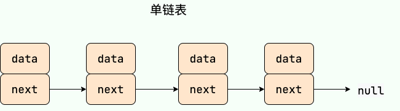
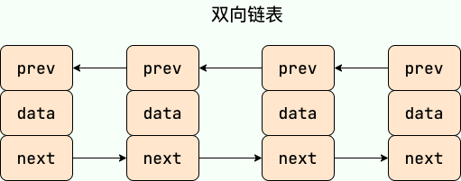
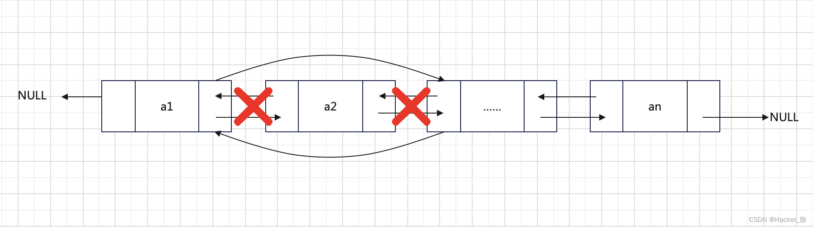
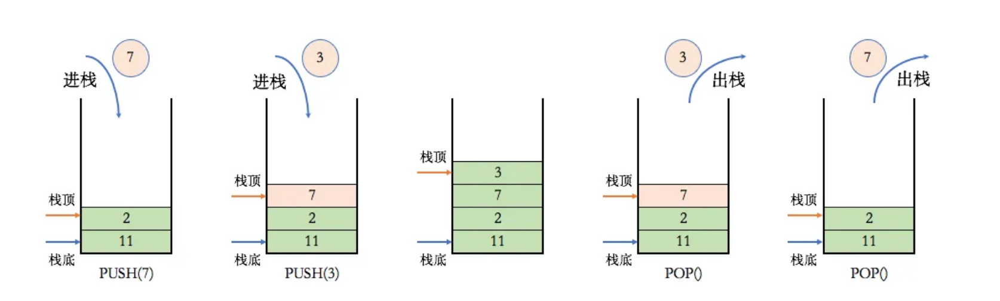
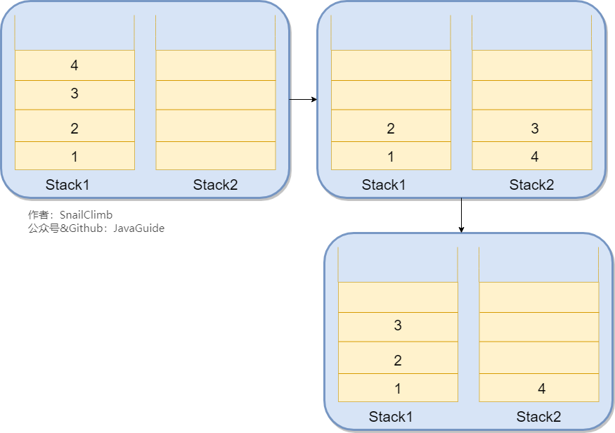
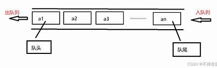

## 顺序表

### 数组

#### 定义

数组由相同类型的元素（element）组成，并且是使用一块连续的内存来存储。直接可以利用元素的索引（index）可以计算出该元素对应的存储地址。

**特点**

- **提供随机访问** ：可以利用元素的索引访问元素
- **容量固定**
- **插入和删除元素较慢**

#### 基本操作

- 访问特定元素：$O(1)$
- 插入元素：$O(n)$
  - 最好情况：在表尾插入元素，时间复杂度为 $O(1)$
  - 最坏情况：发生在插入发生在数组的首部，此时需要移动所有元素，时间复杂度为$O(n)$
- 删除元素：$O(n)$
  - 最好情况：在表尾删除元素，时间复杂度为 $O(1)$
  - 最坏情况：发生在删除发生在数组的首部，此时需要移动所有元素，时间复杂度为$O(n)$

### 单链表

#### 定义

**单链表 ** 虽然是一种线性表，但是并不会按线性的顺序存储数据，使用的不是连续的内存空间来存储数据。单链表只有一个方向，结点只有一个后继指针 next 指向后面的节点，通过连续的节点组成，但是节点在内存中不是连续分布的 ，而是散乱分布在内存中的某地址上。链表通常有一个不保存任何值的 head 节点(头结点)，通过头结点我们可以遍历整个链表。尾结点通常指向 null。



```java
static class ListNode{
    int val;
    ListNode next;
    public ListNode(int val){
        this.val=val;
    }
}
```

**特点**

- **不提供随机访问** ：每次访问元素需要遍历链表
- **容量不固定**
- **插入和删除元素速度快**
- 

#### 基本操作

- 访问特定元素：$O(n)$
- 插入元素：$O(1)$
  - 找到要插入位置的前驱节点 **`pre`** 和后驱节点 **`temp=pre.next`**
  - 前驱节点 **`pre`** 指向目标节点 **`target`** ：**`pre.next=target`**
  - 目标节点指向后驱节点 **`temp`** ：**`target.next=temp`**
- 删除元素：$O(1)$
  - 找到要删除位置的前驱节点 **`pre`**
  - 将前驱节点 **`pre`** 指向目标节点的后驱节点：**`pre.next=pre.next.next`**

### 双向链表

#### 定义

基本定义与单链表一致，但是 **双向链表** 包含两个指针，一个 prev 指向前一个节点，一个 next 指向后一个节点。因此双向链表支持反向遍历



#### 基本操作

- 访问元素
- 插入元素：$O(1)$
  - 找到要插入位置的前驱节点 **`pre`** 和后驱节点 **`temp=pre.next`**
  - 前驱节点 **`pre`** 和目标节点 **`target`** 建立双向链接
    - **`pre.next=target`**
    - **`target.prev=pre`**
  - 目标节点 **`target`** 和后驱节点 **`temp`** 建立双向链接
    - **`target.next=temp`**
    - **`temp.prev=target`**
- 删除元素：$O(1)$
  - 找到要删除位置的前驱节点 **`pre`**
  - 将前驱节点 **`pre`** 指向目标节点的后驱节点 **`temp`** 建立双向联系
    - **`pre.next=temp`**
    - **`temp.prev=pre`**

### 数组和链表的区别

- **访问效率** 
  - 数组可以通过索引直接访问任何位置的元素，访问效率高，时间复杂度为$O(1)$，
  - 链表需要从头节点开始遍历到目标位置，访问效率较低，时间复杂度为$O(n)$。
- **插入和删除效率**
  - 数组插入和删除操作需要移动其他元素，时间复杂度为$O(n)$
  - 链表只需要修改指针指向，时间复杂度为$O(1)$。
- **缓存命中率**
  - 数组元素在内存中连续存储，可以提高CPU缓存的命中率
  - 链表节点不连续存储，可能导致CPU缓存的命中率较低，频繁的缓存失效会影响性能。
- **应用场景**
  - 数组适合静态大小、频繁访问元素的场景
  - 链表适合动态大小、频繁插入、删除操作的场景

## 栈

### 定义

**栈 (Stack)** 只允许在有序的线性数据集合的一端（栈顶）进行加入数据（入栈）和移除数据（出栈）。因而按照 **后进先出（LIFO, Last In First Out）** 的原理运作。**在栈中，push 和 pop 的操作都发生在栈顶。** 在Java中栈一般由Stack类实现，而且栈顶一般为数组末端

### 基本操作

- **访问元素** ：需要遍历元素，时间复杂度为$O(n)$
- **入栈和出栈** ：只对栈顶的元素进行操作，时间复杂度为$O(1)$

### 常见应用场景

#### 浏览器的回退和前进



可以使用两个栈来实现浏览器的回退和前进。一个栈Stack1用于保存当前浏览的界面，另一个栈Stack2用于回退的页面。

- 前进页面：将页面从 Stack2 弹出，然后压入到 Stack1 中
- 回退页面：把页面从 Stack1 弹出，然后压入 Stack2 中。

## 队列

### 定义

**队列（Queue）** 是 **先进先出 (FIFO，First In, First Out)** 的线性表。队列只允许在后端（队尾）进行插入操作（入队），在前端（队头）进行删除操作（出队）。在Java中队列由Queue的实现类来实现，队尾为数组后端，队头为数组前端

### 基本操作

- **访问元素** ：需要遍历元素，时间复杂度为$O(n)$
- **入队和出队** ：只对队头和队尾的元素进行操作，时间复杂度为$O(1)$

## 栈和队列的相互转换

### 栈实现队列

使用两个栈，一个栈为输入栈，另一个栈为输出栈。

- 入队：将元素压入输入栈。
- 出队：先判断输出栈是否为空，如果不为空，则直接弹出栈顶元素；如果为空，则将输入栈中的所有元素依次弹出并压入输出栈中，然后再从输出栈中弹出栈顶元素作为出队元素。
- 查询队首元素时，同样需要先将输入栈中的元素转移到输出栈中，然后取出的输出栈顶元素但不弹出。

### 队列实现栈

使用一个栈可以实现队列。

- 入栈：先入队然后将队列中的元素（除了最后一个）依次出队再入队（相当于反转一次）
- 出栈：直接出队
- 查询栈顶元素：直接返回队首元素