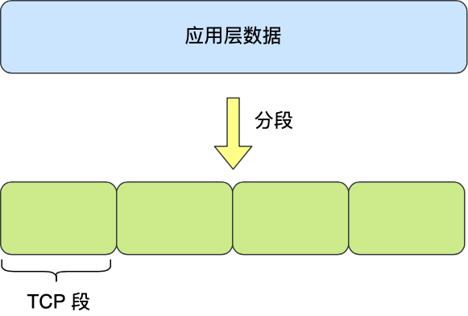
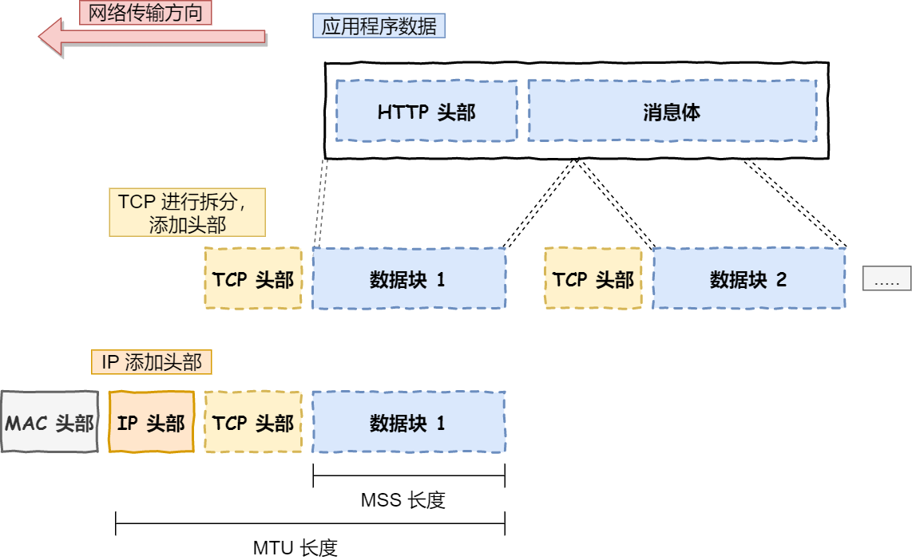
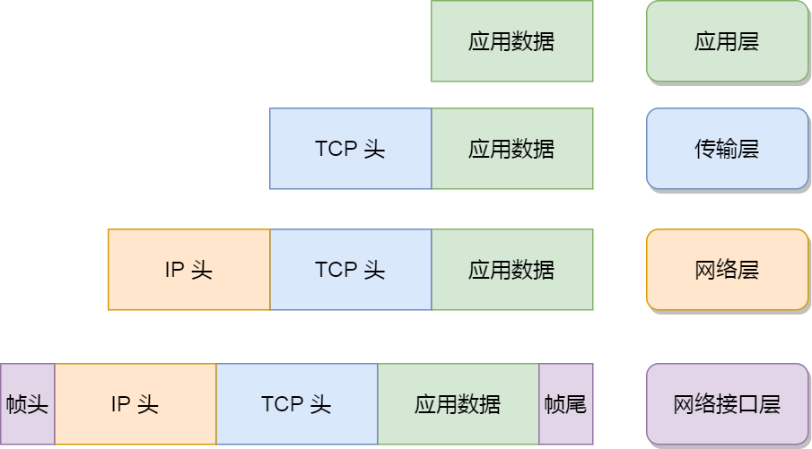
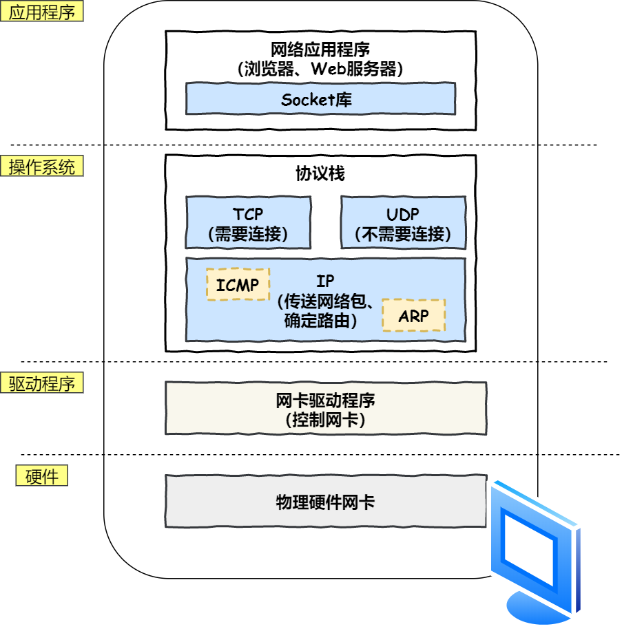
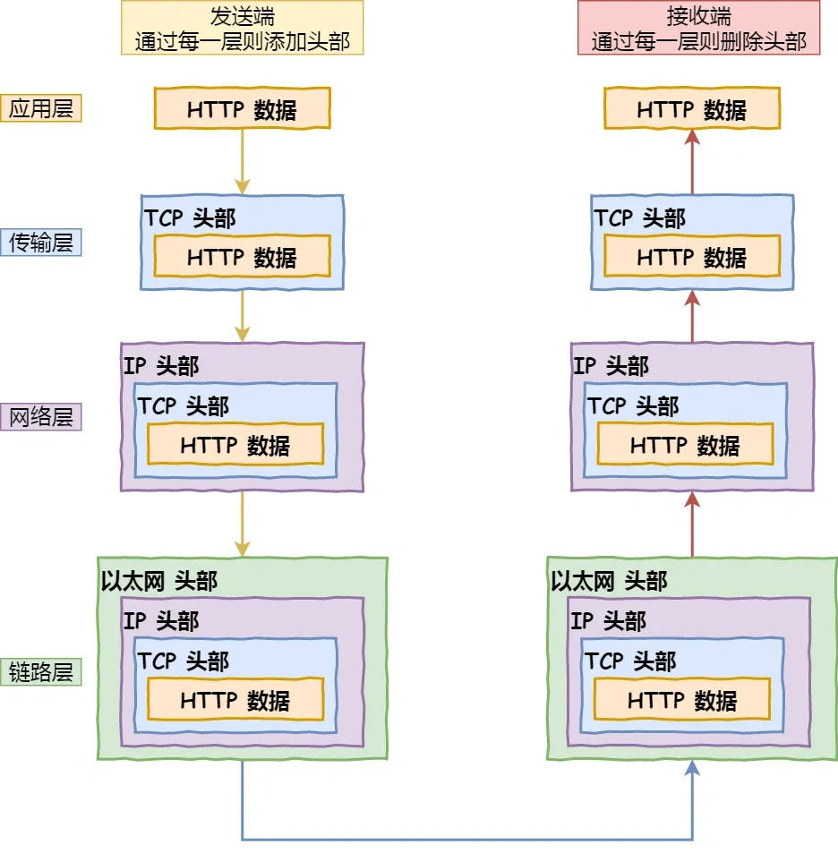
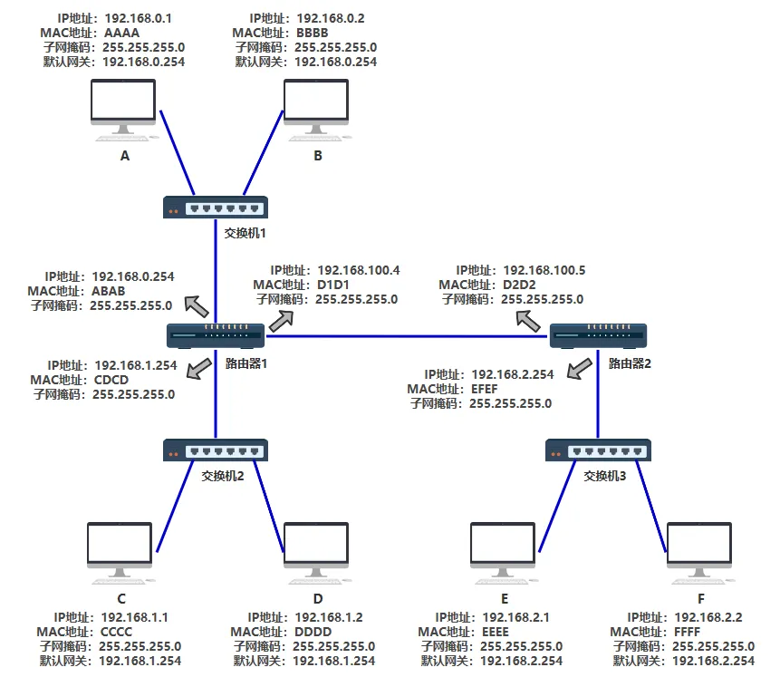

## 网络中的常见设备

### **主机（host）**

**主机（Host）** 是指连接到网络并能够发送或接收数据的设备。

#### 常见的主机类型

- **个人计算机（PC）**

  - 普通用户使用的台式机或笔记本电脑。

  - 通过有线（以太网）或无线（Wi-Fi）方式连接到网络。

- **服务器（Server）**

  - 提供网络服务的计算机，如Web服务器、数据库服务器、云服务器等。

  - 运行稳定性和计算能力较强，可同时为多个客户端提供服务。

  - 常见操作系统：Windows Server、Linux（Ubuntu、CentOS等）。

- **物联网设备（IoT Devices）**

  - 连接到互联网的智能设备，如智能家居、传感器、工业控制系统等。

  - 资源有限，通常使用轻量级协议（如MQTT、CoAP）进行通信。

- **移动设备（Mobile Devices）**

  - 智能手机、平板电脑等设备，也可以作为主机接入网络。

  - 主要通过Wi-Fi或蜂窝网络（4G/5G）访问互联网。

### 交换机（Switch）

**交换机（Switch）** 是一种**二层（数据链路层）或三层（网络层）网络设备**，用于在局域网（LAN）中连接多个设备，并根据**MAC地址或IP地址**高效地转发数据。**交换机没有MAC地址**

#### 主要功能

- **数据转发**：接收数据帧，并根据目标MAC地址决定将其发送到哪个端口，而不是像集线器（Hub）那样广播给所有设备。
- **流量管理**：通过 **全双工通信** ，同时支持数据的发送和接收，减少网络冲突，提高带宽利用率。
- **地址学习（MAC表）**：存储设备的MAC地址和端口映射关系，智能决定数据流向。

#### 常见交换机类型

- **二层交换机（L2 Switch）**：依据MAC地址转发数据，不具备IP路由功能，适用于小型局域网
- **三层交换机（L3 Switch）**：结合路由功能，能根据IP地址转发数据包，适用于大型网络。

### 路由器（Router）

**路由器（Router）** 是一种 **网络层（第三层）设备** ，用于连接不同的网络，并根据 **IP地址** 确定数据包的最佳传输路径。它是互联网通信的核心设备，负责数据的转发和寻址。

#### 主要功能

- **IP地址转发**：根据数据包的**目标IP地址**，选择最佳路径进行转发。
- **网络隔离**：不同的网络（如家庭网络和外部互联网）通过路由器进行连接和隔离。
- **NAT（网络地址转换）**：允许多个设备共享一个公网IP上网。
- **DHCP（动态主机配置协议）**：自动分配IP地址，简化网络配置。

### 集线器（Hub）

**集线器（Hub）** 是一种 **物理层（第一层）** 的网络设备，用于在局域网（LAN）内连接多个设备。它的主要作用是广播（Broadcast）数据，即收到数据后，会将其发送到所有端口，而不进行智能转发或流量管理。作为接收方的主机发现Mac地址不是自己会忽略该数据包

#### 主要功能

- **信号复制**：收到数据后，将其广播到所有端口。
- **物理连接**：提供多个端口，用于连接计算机、打印机等设备。
- **放大信号**（部分型号）：用于延长网络传输距离（称为**中继器集线器**）

## 分组交换技术

**分组交换（Packet Switching）** 是一种将数据**拆分成多个小数据包**，并**独立**传输到目标地址的通信方式。它不需要建立固定的通信路径，而是**根据网络的实时状态**选择最优路径，从而提高资源利用率和网络可靠性。

### 存储转发机制

交换机或路由器开始向链路传输该分组的第一个比特之前必须接受整个分组

### 工作流程

- **数据拆分**：将大数据拆分为多个小的数据包（Packet）。
- **数据打包**：每个数据包包含**源地址、目标地址和序列号**，确保数据按顺序重组。
- **动态路由**：每个数据包**独立选择路径**，可能走不同的路。
- **数据包重组**：接收端根据序列号**重新组装数据**，恢复原始信息。

### 优缺点

**优点**

- **无建立时延** ：通信前无须建立间接，用户可以随时发送分组
- **线路利用率高** ：分组在哪段链路上传送时才占用这段链路的通信资源。相比采用电路交换传送突发式的计算机数据，分组交换的通信线路利用率大大提高。
- **简化了存储管理（相对于报文交换）**：因为分组的长度固定，相应缓冲区的大小也固定，在交换结点中存储器的管理通常被简化为对缓冲区的管理，相对比较容易。
- **加速传输** ：分组是逐个传输的，可以使后一个分组的存储操作与前一个分组的转发操作并行，这种流水线方式减少了报文的传输时间。此外，传输一个分组比传输一次报文所需的缓冲区小得多，这样，因缓冲区不足而等待发送的概率及时间必然也少得多。
- **减小了出错概率和重发数据量** ：因为分组较短，其出错概率必然减小，所以每次重发的数据量也就大大减少，这样不仅提高了可靠性，而且减小了传输时延。

**缺点**

- **存在存储转发时延** ：尽管分组交换比报文交换的传输时延小，但相对于电路交换仍存在存储转发时延，且其结点交换机必须具有更强的处理能力。
- **需要传输额外的信息量** ：每个小数据段都要加上控制信息以构成分组，这使得传送的信息量增大，进而使得控制复杂，降低了通信效率，增大了处理的时延。
- **当分组交换网采用数据报服务时，可能出现失序、丢失或重复分组的情况** ：分组到达目的结点时，要对分组按编号进行排序等工作，

### 应用场景

- **互联网通信**（如网页浏览、电子邮件、社交网络）
- **VoIP（网络电话）**
- **视频流**（如YouTube、Netflix）
- **无线通信（4G/5G）**

## 电路交换技术

**电路交换（Circuit Switching）** 是指在通信开始前，**必须建立一个固定的端到端通信路径（电路）**，预留好了通信所需资源，并在整个通信过程中保持该路径。

### 复用技术

在电路交换中，复用指的是将多个用户或通信流的信号**合并**到一个物理路径上，并根据需要将其分开进行通信。在通信过程中，虽然多个通信流共享同一条物理线路，但每个用户都能获得一个独占的**虚拟通道**，在会话期间保持通道的占用。

常见的复用技术

- **时分复用（TDM, Time Division Multiplexing）**
  - 时分复用技术将一个物理信道**按时间划分为多个时隙**，每个通信会话在不同的时隙内传输数据。这样，多个用户或信号可以**交替使用同一通道**，但每个用户在其专有的时间段内使用该通道。
- **频分复用（FDM, Frequency Division Multiplexing）**
  - 频分复用技术将可用的传输带宽**划分为多个频带**，每个通信会话被分配到一个独立的频带上进行传输。每个频带相当于一个**独立的虚拟信道**，每个用户在自己分配的频带内进行通信。

### 工作流程

- **建立连接**（拨号和呼叫建立阶段）：系统为通信双方**预留一条专用电路**。
- **数据传输**（通信阶段）：数据沿固定路径传输，保证稳定性。
- **释放连接**（挂断阶段）：通话结束后，释放电路资源。

### 优缺点

**优点**

- **通信质量稳定**：由于通话期间通道被**独占**，不会有其他用户占用带宽。
- **延迟低**：不需要数据包排序或重组，数据按固定路径流动，时延较小。
- **适用于实时通信**：如传统电话、专线通信等。

**缺点**

- **资源利用率低**，即使通话双方没有发送数据，通信通道仍然被占用

## 通信时延

节点总时延=节点处理时延+排队时延+传输时延+传播时延

### 节点处理时延

检查分组首部以及决定分组导向何处所需时间

### 排队时延

分组在链路上等待传输所需的时间

### 传输时延

将所有分组推向链路的时延

### 传播时延

从链路的起点到交换机所需的时间

## OSI七层协议模型

**协议**：定义了在两个或多个通信实体之间交换的报文格式和顺序，以及报文发送或接受报文或其他事件所采取的动作

计算机网络的协议采用分层架构。每一层都依赖于**上层提供的服务**并向**下层提供服务**。（通常以物理层为第一层，作为最下层）

当数据从设备发出时，数据从应用层逐层向下传递，每一层会对数据进行**封装**，增加自己的头部信息，以便下一层能够正确地识别、处理和传输数据。

当数据到达目标设备时，数据从物理层逐层向上传递，每一层会进行 **解封装**，提取出属于该层的数据部分，并将其传递给上一层，直到最终到达应用层。

每一层分工明确

- **应用层** ：为计算机用户提供服务，给应用程序提供统一的接口
- **表示层** ：数据处理(编解码、加密解密、压缩解压缩)，使得通信的应用程序能够解释交换数据的含义
- **会话层** ：管理（建立、维护、重连）表示层实体之间的会话
- **传输层** ：负责端到端的数据传输，为两台主机进程之间的通信提供通用的数据传输服务
- **网络层** ：负责数据的路由、转发、分片，决定数据在网络的游走路径
- **数据链路层** ：负责数据的封帧和差错检测，以及 MAC 寻址
- **物理层** ：负责在物理网络中传输数据帧，透明地传送比特流传输



网络模型为什么要采用分层模型

- **各层之间相互独立**：各层之间相互独立，各层之间不需要关心其他层是如何实现的，只需要知道自己如何调用下层提供好的功能就可以了（可以简单理解为接口调用）**。这个和我们对开发时系统进行分层是一个道理。**
- **提高了灵活性和可替换性**：每一层都可以使用最适合的技术来实现，你只需要保证你提供的功能以及暴露的接口的规则没有改变就行了。并且，每一层都可以根据需要进行修改或替换，而不会影响到整个网络的结构。**这个和我们平时开发系统的时候要求的高内聚、低耦合的原则也是可以对应上的。**
- **问题分解**：分层可以将复杂的网络问题分解为许多比较小的、界线比较清晰简单的小问题来处理和解决。这样使得复杂的计算机网络系统变得易于设计，实现和标准化。 **这个和平时开发的时候，一般会将系统功能分解，然后将复杂的问题分解为容易理解的更小的问题是相对应的，这些较小的问题具有更好的边界（目标和接口）定义**。



### 应用层

**应用层** 是OSI模型的最高层，它为用户提供直接的**网络服务**。它是应用程序与网络之间的接口，**它定义了信息交换的格式，消息会交给下一层传输层来传输**，是应用程序以及应用层协议存在的地方，负责用户与计算机的交互。

应用层是不用去关心数据是如何传输的，而且应用层是工作在操作系统中的用户态，传输层及以下则工作在内核态。

应用层的信息分组称为 **报文**

#### 常用协议

常见的应用层协议

- **HTTP（Hypertext Transfer Protocol，超文本传输协议）**：基于 TCP 协议，是一种用于传输超文本和多媒体内容的协议，主要是为 Web 浏览器与 Web 服务器之间的通信而设计的。当我们使用浏览器浏览网页的时候，我们网页就是通过 HTTP 请求进行加载
- **SMTP（Simple Mail Transfer Protocol，简单邮件发送协议）**：基于 TCP 协议，是一种用于发送电子邮件的协议。注意 ⚠️：SMTP 协议只负责邮件的发送，而不是接收。要从邮件服务器接收邮件，需要使用 POP3 或 IMAP 协议。
- **FTP（File Transfer Protocol，文件传输协议）**：基于 TCP 协议，是一种用于在计算机之间传输文件的协议，可以屏蔽操作系统和文件存储方式。
- **SSH（Secure Shell Protocol，安全的网络传输协议）**：基于 TCP 协议，通过加密和认证机制实现安全的访问和文件传输等业务
- **DNS（Domain Name System，域名管理系统）**: 基于 UDP 协议，用于解决域名和 IP 地址的映射问题。

### 表示层

**表示层** 负责**数据格式的转换**，确保不同系统之间的数据能够互相理解。它通常包括数据的**编码、加密、解密**和**压缩**功能。

例如：**Linux** 给 **WIndows** 发包，不同系统语法不一致，如 **exe** 不能在 **Linux** 下执行，**shell** 不能在 **Windows** 不能直接运行。因此需要表示层。解决**不同系统之间通信语法问题**

### 会话层

**会话层** 负责**建立、管理和终止会话**，它提供了在应用程序之间的**会话管理功能**，保证数据的同步、恢复以及多次通信的管理。它确保数据传输的**秩序性**，如恢复中断的连接。

常见的协议有 `ADSP、RPC` 等

### 传输层

**传输层** 负责在通信的两端提供 **端到端的可靠性（不同主机上不同进程的通信）** ，它确保数据的**可靠传输**和**流量控制**。它将数据从应用层交给网络层，然后将接收到的数据传递给应用层。传输层还负责错误检测与修正。

#### 报文段

传输层的数据分组称为 **报文段**

#### 常用协议

在传输层会有两个传输协议，分别是 **TCP** 和 **UDP**。

TCP 的全称叫传输控制协议（*Transmission Control Protocol*），具有以下功能

- 流量控制
- 超时重传
- 拥塞控制等

通过提供面向连接的服务保证报文段可靠地传输给对方

UDP 相对来说就很简单，提供无连接服务，只负责发送数据包，不保证数据包是否能抵达对方，但它实时性相对更好，传输效率也高。

当设备作为接收方时，传输层则要负责把报文段传给应用进程，但是一台设备上可能会有很多应用进程在接收或者传输数据，因此需要用一个 **端口号** 将应用进程区分开来。

### 网络层

随着网络节点的不断增加，点对点通讯需要通过多个节点，如何找到目标节点，如何选择最佳路径成为首要需求。

网络层主要功能是将 **网络地址转化为对应的物理地址（寻址）** ，并 **决定如何将数据从发送方路由到接收方（路由选择）** 。

#### 数据报

位于网络层的数据分组称为 **数据报**

网络层最常使用的是 IP 协议（*Internet Protocol*），IP 协议会将传输层的报文作为数据部分，再加上 IP 包头组装成 IP 报文，如果 IP 报文大小超过 MTU（以太网中一般为 1500 字节）就会**再次进行分片**，得到一个即将发送到网络的 IP 报文。

#### IP地址

**IP地址** 用于区分不同的物理设备

- **网络号**：负责标识该 IP 地址是属于哪个「子网」的；
- **主机号**：负责标识同一「子网」下的不同主机；

**子网掩码** ：用于计算网络号和主机号

将 **子网掩码** 和 **IP地址** 进行按位与操作即可计算出网络号

将 **子网掩码** 取反后与 **IP地址** 进行进行**按位与运算**，就可以得到主机号

#### 常见协议

- **IP（Internet Protocol，网际协议）**：TCP/IP 协议中最重要的协议之一，属于网络层的协议，主要作用是定义数据包的格式、对数据包进行路由和寻址，以便它们可以跨网络传播并到达正确的目的地。
- **ARP（Address Resolution Protocol，地址解析协议）**：ARP 协议解决的是网络层地址和链路层地址之间的转换问题。
- **ICMP（Internet Control Message Protocol，互联网控制报文协议）**：一种用于传输网络状态和错误消息的协议，常用于网络诊断和故障排除
- **NAT（Network Address Translation，网络地址转换协议）**：NAT 协议的应用场景如同它的名称——网络地址转换，应用于内部网到外部网的地址转换过程中。具体地说，在一个小的子网（局域网，LAN）内，各主机使用的是同一个 LAN 下的 IP 地址，但在该 LAN 以外，在广域网（WAN）中，需要一个统一的 IP 地址来标识该 LAN 在整个 Internet 上的位置。
- **RIP(Routing Information Protocol，路由信息协议）**：一种内部网关协议（Interior Gateway Protocol，IGP），也是一种动态路由协议，基于距离向量算法，使用固定的跳数作为度量标准，选择跳数最少的路径作为最佳路径。

**数据链路层** 在物理连接中提供可靠的传输（ **点到点的传输** ），负责建立和维护两个相邻节点间的链路。包括**数据帧的封装与解封装**，以及**错误检测与校正**。它还负责处理**物理地址**（MAC地址），管理局域网的访问控制。

链路层中的数据分组为 **帧**

### 物理层

物理层是OSI模型的最底层，负责将数据以**电气信号、光信号或无线信号**的形式传输到物理媒介上。它定义了硬件设备的接口、传输媒介的电气特性、连接器的标准等。

**网卡工作在这层**

## TCP/IP模型

**TCP/IP 四层模型** 是目前被广泛采用的一种模型,可以将 **TCP / IP** 模型看作是 OSI 七层模型的精简版本，由以下 4 层组成：

- **应用层**
- **传输层**
- **网络层**
- **网络接口层**

### 网络接口层

**网络接口层（Network Access Layer）**：可以把网络接口层看作是数据链路层和物理层的合体。负责将数字信号在物理通道（网线）中准确传输，定义了如何在单一网络链路上传输数据，如何处理数据帧的发送和接收，包括物理地址（MAC 地址）的解析。

### MAC地址

**Mac地址** 是一个全球唯一的物理地址，由设备制造商在生产时烧录到网卡的固件中。MAC 地址用于局域网（LAN）中的设备识别和通信。

IP 网络使用 **IP 地址** 进行通信，但在局域网内，设备最终依靠 **MAC 地址** 进行数据传输。

**ARP（Address Resolution Protocol）** 负责将 IP 地址转换为 MAC 地址。

### 数据封装过程

## 网页显示过程

### 工作流程

- 浏览器解析 **URL**：浏览器会解析 **URL** 并根据解析结果和缓存分析生成对应的HTTP请求报文
  - 浏览器分析 URL 所需要使用的传输协议和请求的资源路径。
    - 如果输入的 URL 中的协议或者主机名不合法，将会把地址栏中输入的内容传递给搜索引擎。
    - 如果没有问题，浏览器会检查 URL 中是否出现了非法字符，则对非法字符进行转义后在进行下一过程。
  - 浏览器会判断所请求的资源是否在缓存里，如果请求的资源在缓存里且没有失效，那么就直接使用，否则向服务器发起新的请求。
- 浏览器通过  **DNS**   做域名解析从而获取域名对应的IP地址：请求需要知晓服务器域名对应的 IP 地址才能通信，浏览器会检查本地缓存、操作系统缓存，甚至路由器缓存。如果未命中缓存，浏览器向配置的 **DNS** 服务器发送查询请求，**DNS 服务器递归查询** 最终返回 **IP** 地址。
- 通过 **DNS** 获取到 **IP** 后，就可以把 HTTP 的传输工作交给操作系统中的**协议栈**。
  - 浏览器会调用 Socket 库委托协议栈工作，并得到了封装了 **HTTP** 数据的 **TCP** 数据包, **TCP**协议指定了指定源端口号和目的端口号，然后下发给网络层
  - 在 TCP 数据包的基础上，再封装源地址 **IP** 和前面 **DNS** 解析出来目标地址 **IP** 等信息，得到网络包。并多个网络节点中确定数据包的传输路径，最终能找到目标服务器。然后将下发给数据链路层
  - 数据链路层的发送需要封装通信双方的 MAC 地址。
    - 本机的 MAC 地址作为源 MAC 地址。
    - 接收方目标 MAC 地址的获取方式是通过将 IP 地址与本机的子网掩码相结合，可以判断是否与请求主机在同一个子网里
      - 如果在同一个子网里，可以使用 APR 协议获取到目的主机的 MAC 地址
      - 如果不在一个子网里，那么请求应该转发给网关，由它代为转发，此时同样可以通过 ARP 协议来获取网关的 MAC 地址，此时目的主机的 MAC 地址应该为网关的地址。
  - 网卡驱动获取网络包之后，会将其**复制**到网卡内的缓存区中。网卡会将包转为电信号，通过网线发送出去
- 建立TCP连接：主机将使用目标 IP地址和目标MAC地址发送一个TCP SYN包，请求建立一个TCP连接，然后交给路由器或者交换机
  - 交换机：它会根据数据包中的 MAC 头来查找MAC表来找到另一个设备连接在交换机的哪个端口，然后传输。
  - 路由器：路由器进行跨子网的转发，通过查找路由表中IP地址和端口的映射关系来决定从路由器的哪个端口发出
- 发送HTTP请求：连接建立后，浏览器会向服务器发送HTTP请求。请求中包含了用户需要获取的资源的信息，例如网页的URL、请求方法（GET、POST等）等。
- 服务器处理请求并返回响应：服务器收到请求后，会根据请求的内容进行相应的处理。例如，如果是请求网页，服务器会读取相应的网页文件，并生成HTTP响应。

### 数据封装过程

## 数据包传递过程

路由器1的路由表

|     目的地址     |    下一跳     | 端口 |
| :--------------: | :-----------: | :--: |
|  192.168.0.0/24  |               |  0   |
| 192.168.0.254/32 |               |  0   |
|  192.168.1.0/24  |               |  1   |
| 192.168.1.254/32 |               |  1   |
|  192.168.2.0/24  | 192.168.100.5 |  2   |
| 192.168.100.0/24 |               |  2   |
| 192.168.100.4/32 |               |  2   |

以主机A发送给主机F数据包为例

- A **（192.168.0.1）** 通过子网掩码 **（255.255.255.0）** 计算出自己与 F **（192.168.2.2）** 并不在同一个子网内，于是决定发送给默认网关 **（192.168.0.254）**
- A 通过 ARP 找到 默认网关 **192.168.0.254** 的 MAC 地址 **（ABAB）** 。
- A 封装数据包
  - 数据链路层头部
    - 源 MAC 地址设置为A的MAC地址 **（AAAA）**
    - 目标MAC地址为网关 MAC 地址 **（ABAB）**
  - 网络层头部
    - 源 IP 地址设置为A的IP地址 **（192.168.0.1）**
    - 目的 IP 地址设置为F的IP地址 **（192.168.2.2）**（从始至终这个数据包的两个 IP 地址都是不变的，只有 MAC 地址在不断变化）
- 交换机 1 收到数据包后，查询MAC地址表，目标 MAC 地址是 **ABAB** ，从MAC地址表的指定端口转发给路由器1
- 数据包来到了路由器 1，发现其目标 IP 地址是 **192.168.2.2** ，查看其路由表，发现了下一跳的地址是 **192.168.100.5** ，从映射端口发出数据包到路由器2
  - 源MAC设置为路由器1的映射端口的MAC地址 **（D1D1）**
  - 目标MAC设置为下一跳的MAC地址 **（D2D2）**
- 此时路由器 2 收到了数据包，看到其目标IP地址是 **192.168.2.2** ，查询其路由表，准备从映射端口把数据包送出去。
- 但此时路由器 2 需要知道 **192.168.2.2** 的 MAC 地址了，于是查看其 arp 缓存，找到其 MAC 地址为 **FFFF** ，将其封装在数据链路层头部，并从映射端口把包发出去。
  - 源MAC设置为路由器2的映射端口的MAC地址 **（EFEF）**
  - 目标MAC设置为F的MAC地址 **（FFFF）**
- 交换机 3 收到了数据包，发现目的 MAC 地址为 **FFFF** ，查询其 MAC 地址表，从映射端口把数据包发出去。
- **F 最终收到了数据包**并且发现目的 MAC 地址就是自己，于是收下了这个包