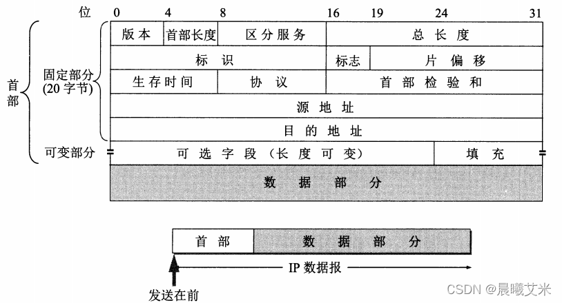
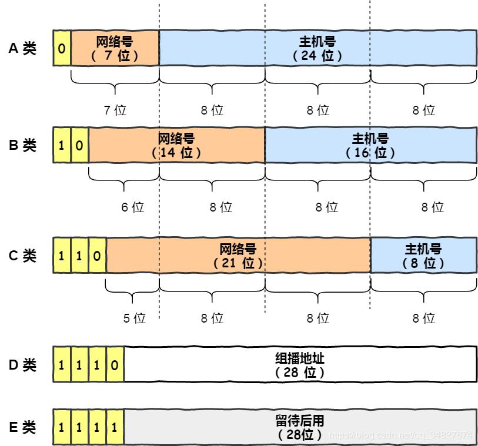
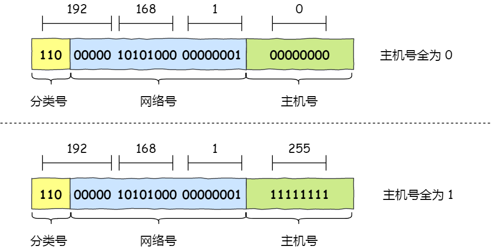
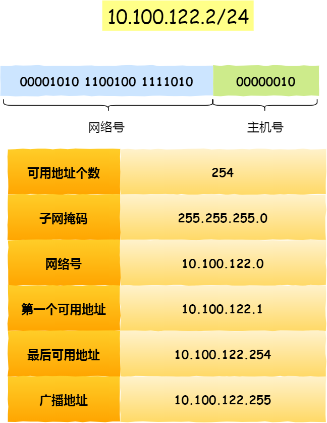
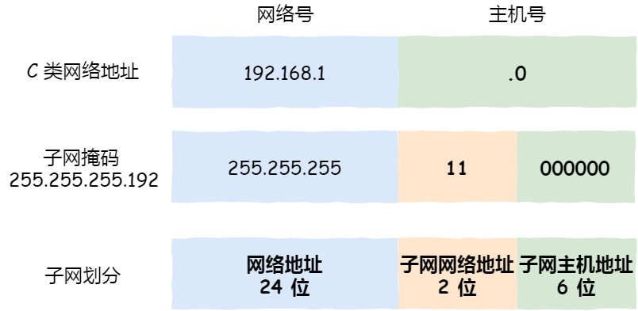
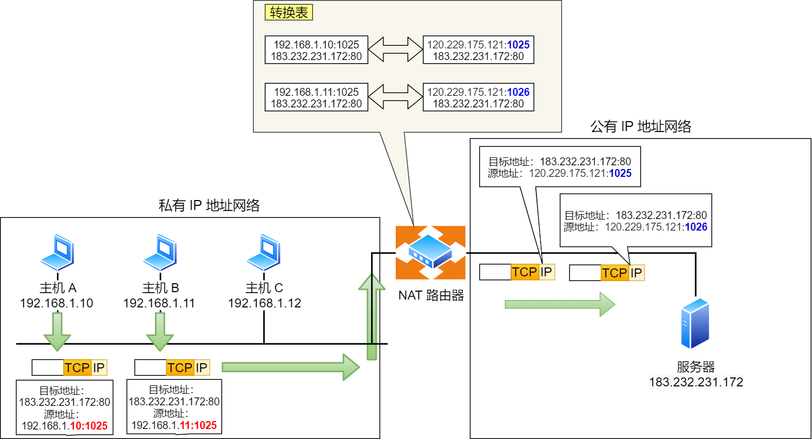

## 网际协议-IP地址

### 作用

#### 在TCP/IP参考模型的作用

IP协议 在 TCP/IP 参考模型中处于第三层，也就是**网络层**。

网络层的主要作用是：**实现主机与主机之间的通信，也叫点对点（end to end）通信。**

- **寻址** ：每个连接到网络的设备都有一个唯一的 IP 地址。IP 协议使用这些地址来标识数据包的源地址和目的地址，确保数据包能够准确地传输到目标设备。
- **路由** ：IP 协议负责决定数据包在网络传输中的路径。比如说路由器使用路由表和 IP 地址信息来确定数据包的最佳传输路径。
- **分片和重组** ：当数据包过大无法在某个网络上传输时，IP 协议会将数据包分成更小的片段进行传输。接收端会根据头部信息将这些片段重新组装成完整的数据包。

#### 与数据链路层的关系

- MAC 的作用则是实现「直连」的两个设备之间通信
- IP 则负责在「没有直连」的两个网络之间进行通信传输。



MAC地址

MAC称为物理地址，也叫硬件地址，用来定义网络设备的位置，MAC地址是网卡出厂时设定的，是固定的（但可以通过在设备管理器中或注册表等方式修改，同一网段内的MAC地址必须唯一）。

MAC地址采用十六进制数表示，长度是6个字节（48位），分为前24位和后24位。



### IP数据报

#### IPV4报文格式

- 首部
  - 版本号：指定IP协议版本
  - 首部长度：确定IP数据报中的载荷的实际开始位置
  - 服务类型：指定不同类型的IP数据报
  - 数据报长度
  - 标识：用于分片后重新组装数据报
  - 标志：决定是否进行分片
  - 片偏移：较长的IP报文在分片后，某片在原分组中的相对位置
  - 生存时间（TTL）：数据报在网络中的寿命。
  - 协议：占8位，协议字段指出此数据报携带的数据是使用何种协议
  - 首部检验和：帮助路由器检测收到的IP数据报中的比特错误
- 源IP地址
- 目的IP地址
- 载荷



IPV6的改进

- **取消了首部校验和字段。** 因为在数据链路层和传输层都会校验，因此 IPv6 直接取消了 IP 的校验。
- **取消了分片/重新组装相关字段。** 分片与重组是耗时的过程，IPv6 不允许在中间路由器进行分片与重组，这种操作只能在源与目标主机，这将大大提高了路由器转发的速度。
- **取消选项字段。** 选项字段不再是标准 IP 首部的一部分了，但它并没有消失，而是可能出现在 IPv6 首部中的「下一个首部」指出的位置上。删除该选项字段使的 IPv6 的首部成为固定长度的 `40` 字节。



#### 数据报分片

通常将链路层帧可以承载的最大数据量称为MTU。当IP数据报长度大于MTU会进行数据报分片，并使用单独的链路层帧进行封装。然后端系统接收后会进行重新组装

### IP地址

在 TCP/IP 网络通信时，为了保证能正常通信，每个设备都需要配置正确的 IP 地址，否则无法实现正常的通信。

IP 地址（IPv4 地址）由 `32` 位正整数来表示，IP 地址在计算机是以二进制的方式处理的。

#### IP地址的分类

$$
最大主机数=2^{主机号}-2
$$
其中要去除两个特殊的IP地址，主机号全为 1 和 全为 0 地址

- 主机号全为 1 指定某个网络下的所有主机，用于广播
  - 广播地址用于在 **同一个链路中相互连接的主机之间发送数据包** 。
- 主机号全为 0 指定某个网络

#### 无分类IP地址CIDR

IP地址由 **网络号和主机号** 构成

表示形式 `a.b.c.d/x`，其中 `/x` 表示前 x 位属于**网络号**， x 的范围是 `0 ~ 32`，

子网掩码用于指示IP地址的网络部分。**将子网掩码和 IP 地址按位计算 AND，就可得到网络号。** 两台主机要通信，首先要判断是否处于同一网段，即网络地址是否相同。

如果相同，那么可以把数据包直接发送到目标主机，否则就需要路由网关将数据包转发送到目的地。

#### 子网划分

**子网划分实际上是将主机号分为两个部分：子网号和子网主机号**。

## IP协议的相关应用

### ARP协议

#### 作用

将 IP 地址转换为 MAC 地址，它工作在 **网络层** 和 **数据链路层** 之间，主要用于在局域网中确定一个特定 IP 地址对应的物理地址（MAC 地址）。因为最终需要找到 MAC 地址才能跟具体的设备通信。

#### 工作流程

- **ARP 请求**：主机 A 需要发送数据包给主机 B，但只有主机 B 的 IP 地址，没有它的 MAC 地址。主机 A 发送一个 ARP 请求广播到网络。
- **ARP 响应**：当同个链路中的所有设备收到 ARP 请求时，会去拆开 ARP 请求包里的内容，如果 ARP 请求包中的目标 IP 地址与自己的 IP 地址一致，回复一个 ARP 响应，告知主机 A 自己的 MAC 地址。
- **更新 ARP 表**：主机 A 将主机 B 的 IP 和 MAC 地址的映射关系保存到 ARP 表中，以便以后使用。

### DHCP协议

DHCP全称为动态主机配置协议，通过配置DHCP协议保证给定主机每次连接得到相同的IP地址或者分配到临时的IP地址

#### 工作流程

- **DHCP服务器发现**
  - 客户端首先发起 **DHCP 发现报文（DHCP DISCOVER）** 的 IP 数据报，由于客户端没有 IP 地址，也不知道 DHCP 服务器的地址，所以使用的是 UDP **广播** 通信，其使用的广播目的地址是 255.255.255.255（端口 67） 并且使用 0.0.0.0（端口 68） 作为源 IP 地址。DHCP 客户端将该 IP 数据报传递给链路层，链路层然后将帧广播到所有的网络中设备。
- **DHCP服务器提供**
  - DHCP 服务器收到 DHCP 发现报文时，用 **DHCP 提供报文（DHCP OFFER）** 向客户端做出响应。该报文仍然使用 IP 广播地址 255.255.255.255，该报文信息携带服务器提供可租约的 IP 地址、子网掩码、默认网关、DNS 服务器以及 **IP 地址租用期** 。
- **DHCP请求**
  - 客户端收到一个或多个服务器的 DHCP 提供报文后，从中选择一个服务器，并向选中的服务器发送 **DHCP 请求报文（DHCP REQUEST** 进行响应，回显配置的参数。
- **DHCP ACK**
  - 服务端用 **DHCP ACK 报文*对 DHCP 请求报文进行响应，应答所要求的参数。
- **再次租用**
  - 如果租约的 DHCP IP 地址快期后，客户端会向服务器发送 DHCP 请求报文：
    - 服务器如果同意继续租用，则用 DHCP ACK 报文进行应答，客户端就会延长租期。
    - 服务器如果不同意继续租用，则用 DHCP NACK 报文，客户端就要停止使用租约的 IP 地址。

### NAT协议

网络地址转换协议，将私有IP地址转换为公有IP地址

NAT将IP地址和端口号一起转换，保证所有离开专有网络的设备具有相同的源IP地址，所有进入专有网络的报文具有相同的目的IP地址

**两个私有 IP 地址都被路由器转换 IP 地址为公有地址 120.229.175.121，但是以不同的端口号作为区分。**