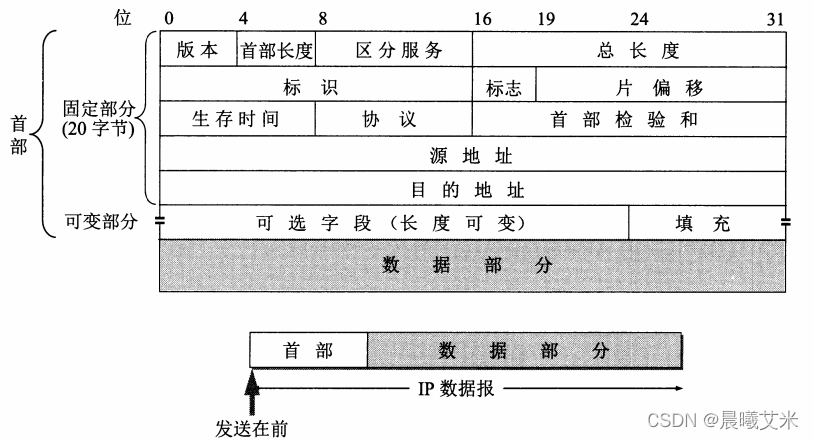
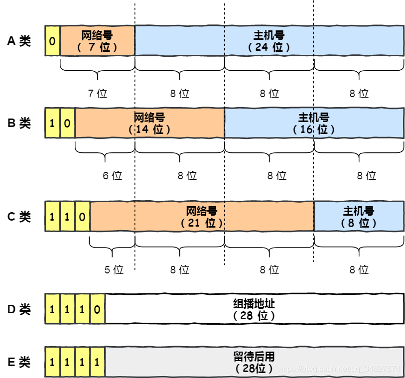
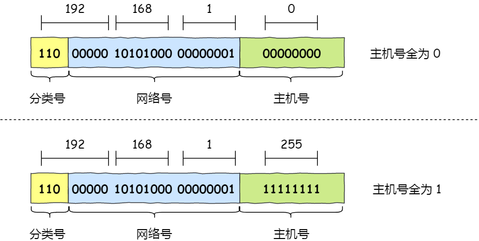
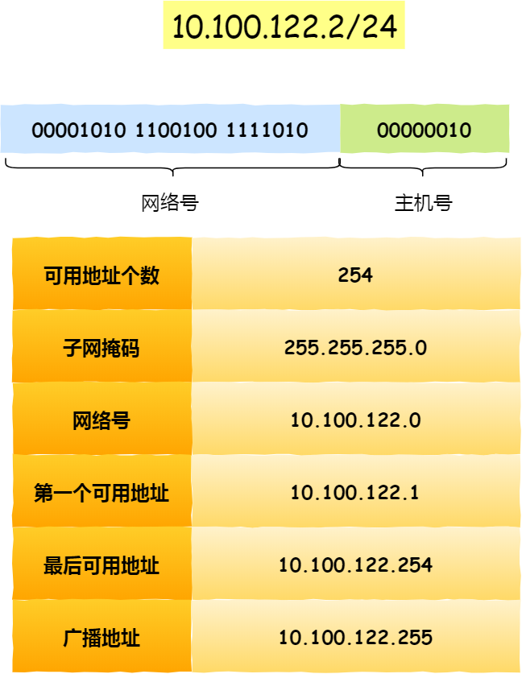
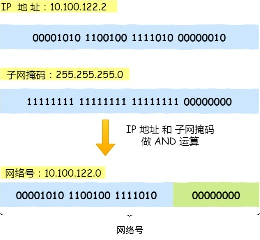
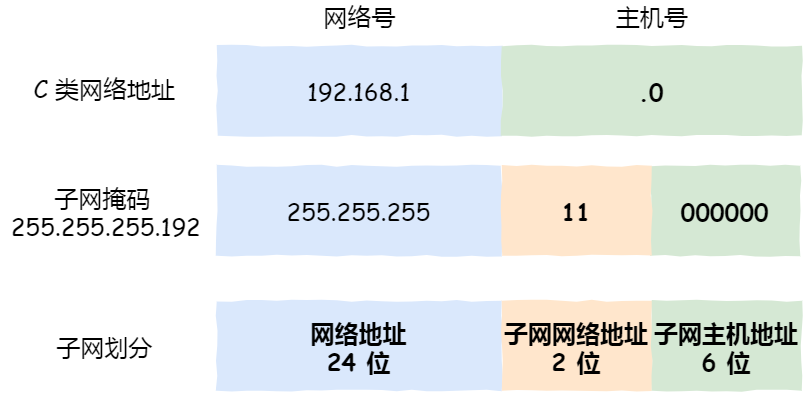
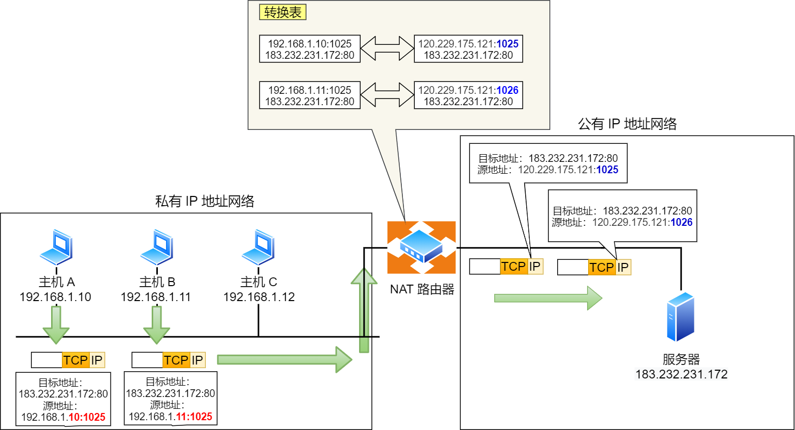

## 🧠 网际协议-IP地址

### 💡 作用

#### 🔍 在TCP/IP参考模型的作用

IP协议 在 TCP/IP 参考模型中处于第三层，也就是**网络层**。

网络层的主要作用是：**实现主机与主机之间的通信，也叫点对点（end to end）通信。**

- **寻址** ：每个连接到网络的设备都有一个唯一的 IP 地址。IP 协议使用这些地址来标识数据包的源地址和目的地址，确保数据包能够准确地传输到目标设备。
- **路由** ：IP 协议负责决定数据包在网络传输中的路径。比如说路由器使用路由表和 IP 地址信息来确定数据包的最佳传输路径。
- **分片和重组** ：当数据包过大无法在某个网络上传输时，IP 协议会将数据包分成更小的片段进行传输。接收端会根据头部信息将这些片段重新组装成完整的数据包。

#### ⚖️ 与数据链路层的关系

- MAC 的作用则是实现**直连**的两个设备之间通信，作为网卡硬件的唯一标识符，在 同一局域网（LAN）中用于标识设备
- IP 则负责在**没有直连**的两个网络之间进行通信传输，作为网络中设备的逻辑标识符，可以唯一标识一个设备在网络中的位置，支持跨网络的寻址与路由



MAC地址

MAC称为物理地址，也叫硬件地址，用来定义网络设备的位置，MAC地址是网卡出厂时设定的，是固定的（但可以通过在设备管理器中或注册表等方式修改，同一网段内的MAC地址必须唯一）。

MAC地址采用十六进制数表示，长度是6个字节（48位），分为前24位和后24位。



### 📦 IP数据报

#### 📋 IPV4报文格式

  

- 首部
  - 版本号：指定IP协议版本
  - 首部长度：确定IP数据报中的载荷的实际开始位置
  - 服务类型：指定不同类型的IP数据报
  - 数据报长度
  - 标识：用于分片后重新组装数据报
  - 标志：决定是否进行分片
  - 片偏移：较长的IP报文在分片后，某片在原分组中的相对位置
  - 生存时间（TTL）：数据报在网络中的寿命。
  - 协议：占8位，协议字段指出此数据报携带的数据是使用何种协议
  - 首部检验和：帮助路由器检测收到的IP数据报中的比特错误
  - 源IP地址
  - 目的IP地址
- 载荷



IPV6的改进

- **取消了首部校验和字段。** 因为在数据链路层和传输层都会校验，因此 IPv6 直接取消了 IP 的校验。
- **取消了分片/重新组装相关字段。** 分片与重组是耗时的过程，IPv6 不允许在中间路由器进行分片与重组，这种操作只能在源与目标主机，这将大大提高了路由器转发的速度。
- **取消选项字段。** 选项字段不再是标准 IP 首部的一部分了，但它并没有消失，而是可能出现在 IPv6 首部中的「下一个首部」指出的位置上。删除该选项字段使的 IPv6 的首部成为固定长度的 `40` 字节。



#### ✂️ 数据报分片

通常将链路层帧可以承载的最大数据量称为MTU。当IP数据报长度大于MTU会进行数据报分片，并使用单独的链路层帧进行封装。然后端系统接收后会进行重新组装

---

### 🏷️ IP地址

在 TCP/IP 网络通信时，为了保证能正常通信，每个设备都需要配置正确的 IP 地址，否则无法实现正常的通信。

IP 地址（IPv4 地址）由 `32` 位正整数来表示，IP 地址在计算机是以二进制的方式处理的。

#### 📊 IP地址的分类

  

$$
最大主机数=2^{主机号}-2
$$
其中要去除两个特殊的IP地址，主机号全为 1 和 全为 0 地址

  

- 主机号全为 1 指定某个网络下的所有主机，用于广播
  - 广播地址用于在 **同一个链路中相互连接的主机之间发送数据包** 。
- 主机号全为 0 指定某个网络

#### 🔢 无分类IP地址CIDR

IP地址由 **网络号和主机号** 构成

表示形式 `a.b.c.d/x`，其中 `/x` 表示前 x 位属于**网络号**， x 的范围是 `0 ~ 32`，

  

子网掩码用于指示IP地址的网络部分。**将子网掩码和 IP 地址按位计算 AND，就可得到网络号。** 两台主机要通信，首先要判断是否处于同一网段，即网络地址是否相同。

如果相同，那么可以把数据包直接发送到目标主机，否则就需要路由网关将数据包转发送到目的地。

  

#### 🧩 子网划分

**子网划分实际上是将主机号分为两个部分：子网号和子网主机号**。

  

---

## 🛠️ IP协议的相关应用

### 📡 ARP协议

#### 📌 作用

将 IP 地址转换为 MAC 地址，它工作在 **网络层** 和 **数据链路层** 之间，主要用于在局域网中确定一个特定 IP 地址对应的物理地址（MAC 地址）。因为最终需要找到 MAC 地址才能跟具体的设备通信。

#### 工作流程

- **ARP 请求**：主机 A 需要发送数据包给主机 B，但只有主机 B 的 IP 地址，没有它的 MAC 地址。主机 A 发送一个 ARP 请求广播到网络。
- **ARP 响应**：当同个链路中的所有设备收到 ARP 请求时，会去拆开 ARP 请求包里的内容，如果 ARP 请求包中的目标 IP 地址与自己的 IP 地址一致，回复一个 ARP 响应，告知主机 A 自己的 MAC 地址。

---

### 🌐 NAT协议

网络地址转换协议，将私有IP地址转换为公有IP地址。它允许多个设备通过共享一个公共IP地址来访问外部网络，同时隐藏内部网络的真实IP地址。

NAT将IP地址和端口号一起转换，保证所有离开专有网络的设备具有相同的源IP地址，所有进入专有网络的报文具有相同的目的IP地址。

- **当内部网络中的设备发起对外部网络的连接请求时，NAT会截获该数据包。
- NAT将内部设备的私有IP地址替换为公共IP地址，并记录下这个转换关系（通常是通过维护一张NAT表实现）。
- 在返回的数据包中，NAT会根据记录的转换关系，将公共IP地址还原为私有IP地址，从而确保数据能够正确地传递到原始设备。

  

**两个私有 IP 地址都被路由器转换 IP 地址为公有地址 120.229.175.121，但是以不同的端口号作为区分。**

---

### 🧭 路由选择协议
- RIP协议：基于距离向量算法，路由选择更新信息在邻居之间通过RIP通过来交换，每个路由器维护一张路由选择表，包括路由器的距离向量和转发表，一条路径的最大成本被限制在15跳
- OSPF协议：基于链路状态算法，每个路由器会先了解周围链路状态，像数据结构里的图一样生成拓扑结构，然后把这些信息发送给网络中其他路由器，然后根据迪杰斯特拉算法计算出最短路径更新路由表，收敛快且适用于更大网络规模