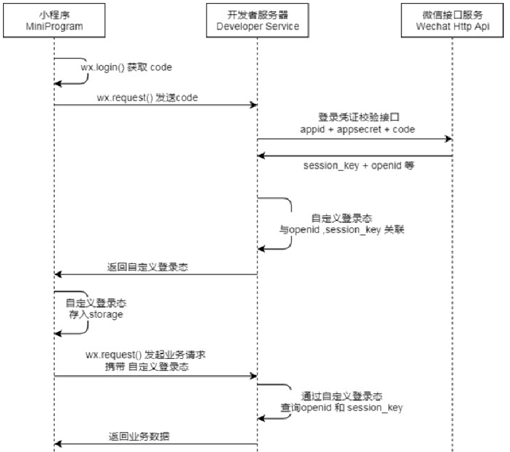

## 表结构设计

#### 用户登录表

| 字段名             | 类型                   | 约束条件                          | 备注                     |
|:----------------:|:--------------------:|:-----------------------------:|:----------------------:|
| `id`            | `int(10) unsigned`    | `NOT NULL AUTO_INCREMENT PRIMARY KEY` | 主键 ID                  |
| `third_account_id` | `varchar(128)`       | `NOT NULL DEFAULT ''`          | 第三方用户 ID（主要是微信openid |
| `user_name`      | `varchar(64)`        | `NOT NULL DEFAULT ''`          | 用户名                   |
| `password`       | `varchar(128)`       | `NOT NULL DEFAULT ''`          | 密码                     |
| `login_type`     | `tinyint(4)`         | `NOT NULL DEFAULT '0'`         | 登录方式: `0-微信登录`，`1-账号密码登录` |
| `deleted`        | `tinyint(4)`         | `NOT NULL DEFAULT '0'`         | 是否删除                  |
| `create_time`    | `timestamp`          | `NOT NULL DEFAULT CURRENT_TIMESTAMP` | 创建时间                  |
| `update_time`    | `timestamp`          | `NOT NULL DEFAULT CURRENT_TIMESTAMP ON UPDATE CURRENT_TIMESTAMP` | 最后更新时间               |

### 增删改查的技巧

- 增加对象：mapper层直接对Entity对象操作，server层对DTO操作
- 查询对象：使用分页查询可以同时支持一次查询多个对象和一次查询一个对象
- 更新对象：在mapper中直接对Entity对象操作，使用动态SQL实现根据条件更新
- 删除对象：直接接受主键作为形参进行删除

## 登录流程设计

相对于 **`Cookie`** 和 **`Session`** 不适用于分布式集群，本项目选择 JWT 令牌方案作为登录的鉴权机制。

具体鉴权机制的方案对比参考[往期博客](https://tyritic.github.io/p/%E7%99%BB%E5%BD%95%E9%89%B4%E6%9D%83%E6%9C%BA%E5%88%B6/)

### 微信用户登录

作为服务端只需要完成以下任务

- 服务端，通过HttpClient向微信接口服务发送请求，并携带appId+appsecret+code三个参数。
- 服务端，接收微信接口服务返回的数据，session_key+opendId等。opendId是微信用户的唯一标识。
- 服务端，自定义登录态，生成令牌(token)和openid等数据返回给小程序端，方便后绪请求身份校验。

## 开发遇到的问题

### JWT无法主动失效的安全问题

JWT 令牌的无状态特性导致服务端不会主动跟踪JWT令牌的状态，无法管控令牌。在某些场景中会导致潜在的安全问题，比如当用户登出之后，使用相同的JWT令牌依然成功访问服务。

#### 解决方案

通过引入redis缓存中间件来形成黑名单机制，将已经失效的JWT令牌放入redis缓存中并根据该令牌的过期时间为redis键值对设置过期时间，当已经登出的用户带着被纳入黑名单的令牌访问服务时将被拒绝提供服务

#### 具体实现

黑名单基于jwt标识来实现对令牌的处理

JWT 令牌通常包含一个 `jti`（JWT ID），它是一个唯一标识，可以用来跟踪和管理 JWT。

- **JWT 生成时，包含唯一的 `jti` 字段。**
- **当用户登出或 Token 需要失效时，将 `jti` 存入 Redis 黑名单。**
- **每次请求时，解析 Token，检查其 `jti` 是否在黑名单中，如果存在，则拒绝访问。**

#### 未来改进方向

黑名单功能可以使用基于Redis的布隆过滤器，布隆过滤器详情可见往期博客

- 将已经失效的JWT令牌放入Redis和布隆过滤器中
- 先通过布隆过滤器做第一次判断，判断JWT令牌是否位于黑名单中，若判断不在黑名单中则直接返回
- 如果布隆过滤器认为 Token 可能失效，则查询 Redis 进行最终确认

### 无法在线程中获取用户的id信息

服务端只会在拦截器中拦截到JWT令牌，虽然JWT令牌中可以解析出用户id，但是用户id无法持久化被其他组件访问到。

**解决方案**

每次请求在Tomcat服务器中都会开辟一个新的线程，可以选择将JWT令牌中的id信息放入ThreadLocal中以便其他位置可以通过线程上下文获取该id

### 数据库自增主键的问题

在项目是单表的时候，数据库自增主键暂时不会出现问题。但是当数据增多之后，一张表无法满足需求后则会出现问题

**单点性能瓶颈**

- **数据库的 `AUTO_INCREMENT` 依赖单台数据库的锁管理**，每次插入数据时都需要更新主键值。
- 在 **高并发场景** 下，这种方式很容易成为 **性能瓶颈**，影响整个数据库的写入速度。

**分库分表**

- 在 **分布式架构** 下，不同的数据库实例需要共享 **全局唯一 ID**，但 `AUTO_INCREMENT` 只能保证单个数据库实例内的唯一性，导致 ID 可能冲突。
- **分库分表后**，不同数据库的自增 ID 可能重复，需要额外处理，增加复杂性。

**解决方案**

本项目采用雪花算法（hutool包实现）来生成用户唯一性ID。同时雪花算法还保证了ID的递增性

雪花算法生成的 **64 位** ID（一个 `long` 类型数字），结构如下：

| 符号位（1 bit） | 时间戳（41 bit） | 机器 ID（10 bit） | 序列号（12 bit）  |
| --------------- | ---------------- | ----------------- | ----------------- |
| 0（正数）       | 约 69 年         | 1024 台机器       | 每毫秒 4096 个 ID |

- **1 bit（符号位）**：始终为 `0`，保证生成的是正数。
- **41 bit（时间戳）**：存储 **当前时间（毫秒）**，可用 **约 69 年**（2⁴¹ 毫秒）。
- **10 bit（机器 ID）**：支持 **1024 台机器**，确保分布式部署不冲突。通常由5位数据中心ID和5位机器ID构成
- **12 bit（序列号）**：同一毫秒内，支持 **4096 个 ID**（2¹² = 4096）。

**生成算法过程**

- **获取当前时间戳**（毫秒级），并 **计算时间戳偏移量**
- **检查当前毫秒内序列号**：
  - 若当前毫秒内 **序列号未满 4096**，则递增。
  - 若达到上限，则 **等待下一毫秒**（时间回拨问题）。
- **拼接各部分生成唯一 ID**：
  - **时间戳偏移量** 左移22位到符号位的右侧
  - **机器ID** 左移动12位
  - **数据中心ID** 左移动12+5=17位
  - **自增序列** 拼接到最右侧



雪花算法的潜在问题

- 时钟回拨问题：雪花算法依赖系统时间戳，如果服务器的时钟 回拨（倒退），可能会导致：
  - **生成重复 ID**（如果新的时间比之前的时间还小）。
  - **ID 生成失败**（因为 ID 递增的逻辑依赖时间）。



