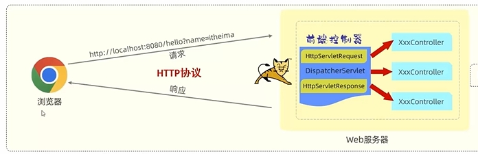
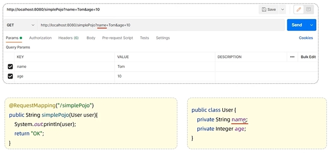
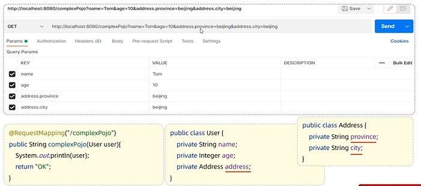
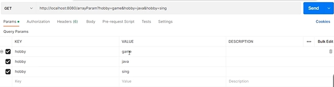
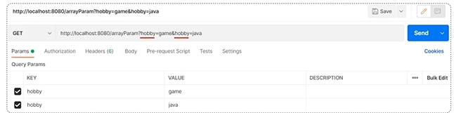
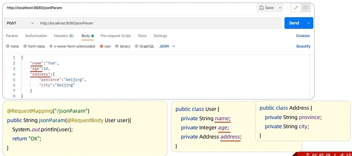

## 请求响应过程



### 基本流程

1. 浏览器向SpringBoot项目中内置的Tomcat服务器发送请求
2. SpringBoot项目中的controller类接收浏览器发出的请求并发送响应

## 请求参数的接收

### 简单参数

#### 	方法一：设置controller类中的函数形参名和请求的参数名相同

```java
@RequsetMapping("/simpleParam")
public String getParam(String param)
{
	return param;
}
```

#### 方法二：参数名和形参名不匹配使用`@RequestParam` 注解的name属性将参数名映射到形参

```java
@RequestMapping("/simpleParam")
public String getParam(@RequestParam(name=“username")String param)
{
	return param;
}
```

<br>



**`@RequestParam`**

作用：建立请求参数和controller形参的映射关系

属性

- **value/name**：请求的参数名
- **required**：参数是否必需。默认为true



### 实体对象参数

#### 简单实体对象

请求参数与形参对象属性名相同

```java
@RequestMapping("/objectParam")
public User getParam(User user)
{
	return user;
}
```



#### 复杂实体对象（对象的成员变量是对象）

请求参数与形参对象属性名相同，按对象层次关系接收



### 数组集合参数

#### 数组参数

请求参数名与形参数组名称相同且请求参数为多个，定义数组类型形参即可接收参数

```
@RequestMapping("/arrayParam")
public User getParam(String[]array)
{
	return array;
}
```



#### 集合参数

请求参数名与形参数组名称相同且请求参数为多个，**`@RequestParam`** 绑定参数关系

```
@RequestMapping("/listParam")
public User getParam(@RequestParam List<String>param)
{
	return param;
}
```



### 日期参数

使用 **`@DateTimeFormat`** 注解完成日期格式转换

```java
@RequestMapping("/dateParam")
public String getParam(@DateTimeFormat(pattern="yyyy-MM-dd HH:mm:ss") LocalDateTime param)
{
	return param.toString();
}
```



**`@DateTimeFormat`**

pattern属性用于指定时间格式



### Json参数

JSON数据键名与形参对象属性名相同，定义pojo类型形参即可接收参数，需要使用 **`@RequestBody`** 标识

```java
@RequestMapping("/jsonParam")
public String getParam(@RequestBody User user)
{
	return user.toString();
}
```



### 路径参数

通过请求URL直接传递参数，使用{..}来标识该路径参数，需要使用 **`@PathVariable`** 获取路径参数


```
@RequestMapping("/path/{id}")
public String getParam(@PathVariable Integer id)
{
	return id;
}
```

## 响应报文的回写

### @RequestBody

- **类型**：方法注解，类注解
- **位置**：controller类/方法上
- **作用**：将方法返回值直接响应，如果返回值类型是 实体对象/集合，将会转换为JSON格式响应
- **说明**：**`@RequestController=@RequestBody+@Controller`**
