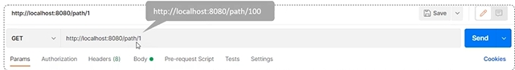

## 请求响应过程


### 基本流程

1. 浏览器向SpringBoot项目中内置的Tomcat服务器发送请求
2. SpringBoot项目中的controller类接收浏览器发出的请求并发送响应

## 控制器的定义

### 控制器的种类

- **`@Controller`**：用于定义一个传统的 Spring MVC 控制器，它处理客户端请求，返回视图名，通常用于返回 HTML 页面。
- **`@RestController`**：专用于构建 RESTful API 的控制器，等同于 `@Controller` + `@ResponseBody`。返回的内容会直接作为 HTTP 响应体，通常用于返回 JSON 或 XML 格式的数据。



**`@ResponseBody`**

**`@ResponseBody`** 注解用于将控制器方法的返回值直接写入 HTTP 响应体中，而不是返回一个视图名称。通常用于返回 JSON 或 XML 格式的数据，适用于 RESTful API。

使用场景：

- 用于返回 JSON、XML 数据，而不是传统的 HTML 页面。
- RESTful 风格的接口通常使用该注解返回数据，尤其是在前后端分离的场景中。



### 路径参数的映射

使用 **`@RequestMapping`** 注解映射请求路径：在方法上使用 **`@RequestMapping`** 或其衍生注解（如 **`@GetMapping`**、**`@PostMapping`** 等）来映射 HTTP 请求。

- **`@GetMapping`**：专用于处理 `GET` 请求。
- **`@PostMapping`**：专用于处理 `POST` 请求。
- **`@PutMapping`**：专用于处理 `PUT` 请求。
- **`@DeleteMapping`**：专用于处理 `DELETE` 请求。

### 具体实现

- 定义控制器类

  - 定义Controller：使用 **`@Controller`** 注解指定控制器，同时使用 **`@ResponseBody`** 修饰控制器方法表示控制器方法的返回值直接写入 HTTP 响应体中，而不是返回一个视图名称。

    ```java
    @Controller
    public class UserController {
    
        @GetMapping("/users/{id}")
        public String getUser(@PathVariable Long id, Model model) {
            // 调用业务逻辑
            User user = userService.getUserById(id);
            // 添加模型数据
            model.addAttribute("user", user);
            // 返回视图名称
            return "userProfile";
        }
    }
    ```

    

  - 定义RestController：直接使用 **`@RestController`** 指定控制器

    ```java
    @RestController
    @RequestMapping("/api/users")
    public class UserController {
    
        @GetMapping("/{id}")
        public User getUserById(@PathVariable Long id) {
            return userService.getUserById(id);  // 返回的是 JSON 数据
        }
    }
    ```

    

- 路径参数的映射：使用 **`@RequestMapping`** 注解映射请求路径：在方法上使用 **`@RequestMapping`** 或其衍生注解（如 **`@GetMapping`**、**`@PostMapping`** 等）来映射 HTTP 请求。


## 请求参数的接收

### 简单参数

#### 	方法一：设置controller类中的函数形参名和请求的参数名相同

```java
@RequsetMapping("/simpleParam")
public String getParam(String param)
{
	return param;
}
```

#### 方法二：参数名和形参名不匹配使用 `@RequestParam` 注解的name属性将参数名映射到形参

```java
@RequestMapping("/simpleParam")
public String getParam(@RequestParam(name=“username")String param)
{
	return param;
}
```

<br>



**`@RequestParam`**

作用：建立请求参数和controller形参的映射关系

属性

- **value/name**：请求的参数名
- **required**：参数是否必需。默认为true



### 实体对象参数

#### 简单实体对象

请求参数与形参对象属性名相同

```java
@RequestMapping("/objectParam")
public User getParam(User user)
{
	return user;
}
```


#### 复杂实体对象（对象的成员变量是对象）

请求参数与形参对象属性名相同，按对象层次关系接收


### 数组集合参数

#### 数组参数

请求参数名与形参数组名称相同且请求参数为多个，定义数组类型形参即可接收参数

```
@RequestMapping("/arrayParam")
public User getParam(String[]array)
{
	return array;
}
```


#### 集合参数

请求参数名与形参数组名称相同且请求参数为多个，**`@RequestParam`** 绑定参数关系

```
@RequestMapping("/listParam")
public User getParam(@RequestParam List<String>param)
{
	return param;
}
```


### 日期参数

使用 **`@DateTimeFormat`** 注解完成日期格式转换

```java
@RequestMapping("/dateParam")
public String getParam(@DateTimeFormat(pattern="yyyy-MM-dd HH:mm:ss") LocalDateTime param)
{
	return param.toString();
}
```



**`@DateTimeFormat`**

pattern属性用于指定时间格式



### Json参数

JSON数据键名与形参对象属性名相同，定义pojo类型形参即可接收参数，需要使用 **`@RequestBody`** 标识

```java
@RequestMapping("/jsonParam")
public String getParam(@RequestBody User user)
{
	return user.toString();
}
```




**`@RequestBody`**

- **类型**：方法注解，类注解
- **位置**：controller类/方法上
- **作用**：将请求体中的数据直接绑定到控制器方法的参数上，如果返回值类型是 实体对象/集合，将会转换为JSON格式响应
- **使用场景**
  - 处理 RESTful 接口中的 JSON 数据请求。
  - 将客户端提交的复杂数据结构（如 JSON）直接映射为 Java 对象。



### 路径参数

通过请求URL直接传递参数，使用{..}来标识该路径参数，需要使用 **`@PathVariable`** 获取路径参数



```java
@RequestMapping("/path/{id}")
public String getParam(@PathVariable Integer id)
{
	return id;
}
```

**`@PathVariable`** 是 Spring MVC 中用于从 URI 模板中提取变量值的注解。它的主要作用是在处理 HTTP 请求时，从请求的 URL 路径中捕获变量，并将其绑定到控制器方法的参数上。



**`@PathVariable`** 和 **`@RequestParam`** 都是用于从 HTTP 请求中提取数据的注解，但它们的用法不同：

- **`@PathVariable`**：从 URL 路径中提取动态数据，常用于 RESTful URL 模式。URL 中的参数通常是路径的一部分，如 `/users/{id}`。
- **`@RequestParam`**：从请求的查询参数中提取数据，通常用于处理表单数据或查询参数。参数在 `?` 之后，格式如 `/users?id=1`。



### 请求头和Cookie

**`@RequestHeader`** 注解用于提取 HTTP 请求头中的值，并将其注入到控制器方法的参数中。例如访问 Accept、Content-Type、User-Agent 等请求头信息。

```java
@GetMapping("/header-info")
public String getHeaderInfo(@RequestHeader("User-Agent") String userAgent) {
    // 使用 userAgent 进行业务处理
    return "headerInfoView";
}
```

**`@CookieValue`** 注解用于从 HTTP 请求的 Cookie 中提取值，并将其注入到控制器方法的参数中。

```java
@GetMapping("/cookie-info")
public String getCookieInfo(@CookieValue("sessionId") String sessionId) {
    // 使用 sessionId 进行业务处理
    return "cookieInfoView";
}
```

